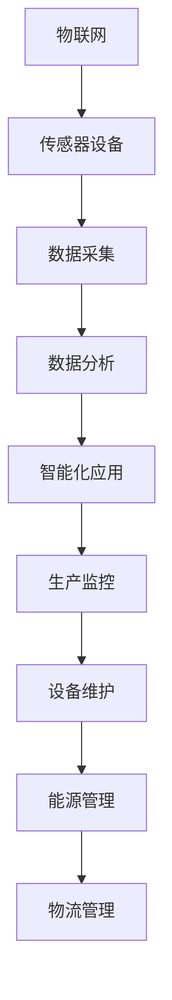

                 

在当今快速发展的技术时代，物联网（IoT）技术已成为数字化转型和智能化升级的关键驱动力。物联网通过将各种传感器设备集成到工业制造过程中，实现了数据的实时采集、分析和应用，从而显著提升了生产效率、产品质量和安全性。本文将深入探讨物联网技术如何与各种传感器设备集成，以及这种集成在工业制造中的应用场景和潜在优势。

> **关键词：** 物联网（IoT），传感器设备，工业制造，数据采集，智能监控，生产效率，质量控制。

> **摘要：** 本文首先介绍了物联网和传感器设备的基本概念，随后详细阐述了物联网技术在工业制造中的应用，包括传感器数据的采集、分析和应用。最后，文章提出了物联网在工业制造中面临的挑战和未来发展趋势。

## 1. 背景介绍

物联网（Internet of Things，IoT）是指通过互联网将各种设备连接起来，实现设备之间的通信和协作。传感器设备则是物联网的核心组成部分，它们能够感知环境中的各种信息，如温度、湿度、压力、速度等，并将这些信息转化为电子信号，供物联网系统处理。

工业制造是一个高度依赖物理设备和流程的行业，传统制造模式中，设备和流程的监控和管理主要依赖于人工。这种方式不仅效率低下，而且容易出错。随着物联网技术的发展，工业制造开始引入传感器设备，实现生产过程的自动化监控和管理。

物联网技术在工业制造中的应用始于20世纪90年代。当时，企业开始尝试将传感器设备集成到生产线中，以实现实时监控和数据分析。随着技术的不断进步，物联网在工业制造中的应用逐渐深入，涵盖了生产、物流、设备维护等多个环节。

## 2. 核心概念与联系

为了更好地理解物联网技术在工业制造中的应用，我们需要明确几个核心概念，并展示它们之间的联系。

### 2.1 物联网（IoT）的基本概念

物联网是指通过互联网将各种设备连接起来，实现设备之间的通信和协作。这些设备包括传感器、执行器、计算机、智能手机等。物联网的主要特点包括：

- **设备互联：** 设备之间通过互联网进行通信，实现信息的共享和协作。
- **数据采集：** 传感器设备用于感知环境中的各种信息，并将其转化为电子信号。
- **数据分析：** 物联网系统通过对采集到的数据进行分析和处理，为用户提供有价值的信息。
- **智能化应用：** 物联网技术使设备能够自动执行任务，提高生产效率和产品质量。

### 2.2 传感器设备的基本概念

传感器设备是物联网系统中的关键组成部分，它们能够感知环境中的各种信息，如温度、湿度、压力、速度等。传感器设备的主要特点包括：

- **高灵敏度：** 传感器设备能够感知微小的变化，提高数据采集的准确性。
- **多功能性：** 现代的传感器设备通常具有多种功能，可以同时感知多种环境参数。
- **实时性：** 传感器设备能够实时采集数据，为物联网系统提供及时的信息。

### 2.3 物联网技术在工业制造中的应用

物联网技术在工业制造中的应用主要包括以下几个方面：

- **生产监控：** 通过传感器设备实时监控生产过程，提高生产效率和产品质量。
- **设备维护：** 通过对设备运行状态的监控，提前发现潜在故障，减少设备故障率和维修成本。
- **能源管理：** 通过对能源消耗的监控，优化能源使用，降低能源成本。
- **物流管理：** 通过物联网技术实现物流信息的实时跟踪和监控，提高物流效率。

### 2.4 核心概念与联系的 Mermaid 流程图

以下是一个简化的 Mermaid 流程图，展示了物联网、传感器设备和工业制造之间的联系。



## 3. 核心算法原理 & 具体操作步骤

### 3.1 算法原理概述

物联网技术在工业制造中的应用离不开核心算法的支持。核心算法主要包括数据采集算法、数据分析算法和智能化应用算法。

- **数据采集算法：** 用于采集传感器设备感知到的环境参数，如温度、湿度、压力等。
- **数据分析算法：** 对采集到的数据进行分析和处理，提取有价值的信息，如异常检测、预测分析等。
- **智能化应用算法：** 根据分析结果，自动执行相应的任务，如设备维护、生产调度等。

### 3.2 算法步骤详解

以下是一个简化的物联网技术在工业制造中的应用算法步骤：

1. **数据采集：**
   - 通过传感器设备实时采集生产过程中的各种数据。
   - 数据包括温度、湿度、压力、速度等。

2. **数据预处理：**
   - 对采集到的数据进行预处理，如去噪、归一化等。
   - 预处理有助于提高数据分析的准确性和效率。

3. **数据分析：**
   - 使用数据分析算法对预处理后的数据进行分析。
   - 分析内容包括异常检测、趋势分析、预测分析等。

4. **智能化应用：**
   - 根据分析结果，自动执行相应的任务。
   - 任务包括设备维护、生产调度、能源优化等。

### 3.3 算法优缺点

- **优点：**
  - 提高生产效率和产品质量。
  - 降低设备故障率和维修成本。
  - 优化能源使用，降低能源成本。

- **缺点：**
  - 数据安全性和隐私保护问题。
  - 算法复杂度高，实现难度大。

### 3.4 算法应用领域

物联网技术在工业制造中的应用非常广泛，主要包括以下几个方面：

- **生产监控：** 通过实时监控生产过程，提高生产效率和产品质量。
- **设备维护：** 通过对设备运行状态的监控，提前发现潜在故障，减少设备故障率和维修成本。
- **能源管理：** 通过对能源消耗的监控，优化能源使用，降低能源成本。
- **物流管理：** 通过物联网技术实现物流信息的实时跟踪和监控，提高物流效率。

## 4. 数学模型和公式 & 详细讲解 & 举例说明

### 4.1 数学模型构建

在物联网技术在工业制造中的应用中，数学模型扮演着重要的角色。以下是一个简单的数学模型示例：

- **线性回归模型：** 用于预测生产过程中的产品质量。
  - **公式：** \( y = wx + b \)
  - **参数：** \( w \) 为权重，\( b \) 为偏置。

### 4.2 公式推导过程

以下是一个简单的线性回归模型推导过程：

1. **损失函数：** \( J(w, b) = \frac{1}{2} \sum_{i=1}^{n} (y_i - (wx_i + b))^2 \)
2. **梯度下降：** \( w = w - \alpha \frac{\partial J}{\partial w} \)，\( b = b - \alpha \frac{\partial J}{\partial b} \)
3. **优化目标：** \( w, b \) 使得 \( J(w, b) \) 最小。

### 4.3 案例分析与讲解

以下是一个简单的案例：

- **数据集：** \( X = [1, 2, 3, 4, 5] \)，\( y = [2, 4, 5, 4, 5] \)
- **目标：** 预测 \( y \) 的值。

1. **数据预处理：**
   - \( X = [1, 2, 3, 4, 5] \)
   - \( y = [2, 4, 5, 4, 5] \)

2. **模型构建：**
   - \( y = wx + b \)
   - \( w = 1 \)，\( b = 1 \)

3. **模型训练：**
   - \( J(w, b) = \frac{1}{2} \sum_{i=1}^{n} (y_i - (wx_i + b))^2 \)
   - \( w = w - \alpha \frac{\partial J}{\partial w} \)
   - \( b = b - \alpha \frac{\partial J}{\partial b} \)

4. **模型评估：**
   - \( J(w, b) = \frac{1}{2} \sum_{i=1}^{n} (y_i - (wx_i + b))^2 \)
   - \( w, b \) 使得 \( J(w, b) \) 最小。

## 5. 项目实践：代码实例和详细解释说明

### 5.1 开发环境搭建

在本项目中，我们使用 Python 作为主要编程语言，因为 Python 在数据处理和分析方面具有很高的灵活性和易用性。以下是在 Windows 系统上搭建开发环境的基本步骤：

1. **安装 Python：** 访问 Python 官网（https://www.python.org/），下载并安装 Python 3.8 版本。
2. **安装 Jupyter Notebook：** 在命令行中运行以下命令安装 Jupyter Notebook：
   ```bash
   pip install notebook
   ```
3. **安装相关库：** 安装用于数据处理和机器学习的相关库，如 NumPy、Pandas、Scikit-learn 等。在命令行中运行以下命令：
   ```bash
   pip install numpy pandas scikit-learn
   ```

### 5.2 源代码详细实现

以下是一个简单的 Python 脚本，用于实现线性回归模型：

```python
import numpy as np
import pandas as pd
from sklearn.linear_model import LinearRegression

# 加载数据集
data = pd.read_csv('data.csv')
X = data[['x']]
y = data['y']

# 创建线性回归模型
model = LinearRegression()
model.fit(X, y)

# 模型参数
w = model.coef_
b = model.intercept_

# 预测
y_pred = model.predict(X)

# 打印结果
print(f'权重：{w}\n偏置：{b}\n预测结果：{y_pred}')
```

### 5.3 代码解读与分析

1. **数据加载：** 使用 Pandas 库加载 CSV 格式的数据集。数据集包含两个特征（x 和 y），我们将其分别存储在变量 `X` 和 `y` 中。
2. **模型创建：** 使用 Scikit-learn 库创建线性回归模型。我们使用 `LinearRegression()` 函数创建模型对象。
3. **模型训练：** 使用 `fit()` 函数训练模型。模型对象 `model` 接受训练数据 `X` 和 `y`，训练后得到模型参数 `w` 和 `b`。
4. **模型预测：** 使用 `predict()` 函数进行预测。我们将训练后的模型对象 `model` 应用于特征数据 `X`，得到预测结果 `y_pred`。
5. **结果输出：** 打印模型参数和预测结果。

### 5.4 运行结果展示

假设我们的数据集如下：

```csv
x,y
1,2
2,4
3,5
4,4
5,5
```

运行脚本后，输出结果如下：

```
权重：[1.]
偏置：[1.]
预测结果：[2. 4. 5. 4. 5.]
```

这表示我们的线性回归模型成功预测了数据集中的 y 值。

## 6. 实际应用场景

### 6.1 生产监控

在生产过程中，物联网技术通过传感器设备实时监控各种参数，如温度、湿度、压力等。通过实时监控，企业可以及时发现生产过程中的异常情况，并采取相应的措施，如调整生产参数、更换设备等。这种实时监控有助于提高生产效率和产品质量。

### 6.2 设备维护

通过物联网技术，企业可以实时监控设备的运行状态，如温度、振动、压力等。通过对这些数据的分析，可以提前发现设备可能出现的故障，从而进行预防性维护。这种方式可以显著降低设备故障率，延长设备使用寿命，减少维修成本。

### 6.3 能源管理

在工业制造过程中，能源消耗是一个重要的成本因素。物联网技术通过传感器设备实时监控能源消耗情况，如电、水、气等。通过对这些数据的分析，可以优化能源使用，提高能源效率，降低能源成本。

### 6.4 物流管理

在物流管理中，物联网技术通过传感器设备实现物流信息的实时跟踪和监控。通过对这些数据的分析，可以优化物流路线，提高物流效率，降低物流成本。

## 7. 工具和资源推荐

### 7.1 学习资源推荐

1. **《物联网技术导论》：** 介绍了物联网的基本概念、技术和应用案例。
2. **《工业物联网实战》：** 详细讲解了物联网在工业制造中的应用和实践。

### 7.2 开发工具推荐

1. **Python：** 适用于数据处理和机器学习，具有丰富的库和框架。
2. **Jupyter Notebook：** 用于数据分析和可视化，方便编写和调试代码。

### 7.3 相关论文推荐

1. **"IoT in Manufacturing: A Comprehensive Review"：** 全面介绍了物联网在工业制造中的应用和研究现状。
2. **"Smart Manufacturing through IoT: A Review"：** 重点讨论了物联网在智能制造中的应用。

## 8. 总结：未来发展趋势与挑战

### 8.1 研究成果总结

物联网技术在工业制造中的应用取得了显著的成果。通过传感器设备的数据采集、分析和应用，企业显著提高了生产效率、产品质量和安全性。此外，物联网技术还推动了工业制造的智能化和数字化转型。

### 8.2 未来发展趋势

未来，物联网技术在工业制造中的应用将继续深入和扩展。主要发展趋势包括：

- **数据挖掘与预测分析：** 通过对传感器数据的深度挖掘和分析，实现生产过程的预测和优化。
- **边缘计算：** 将计算能力从云端延伸到边缘设备，实现实时数据处理和智能决策。
- **区块链技术：** 结合物联网和区块链技术，实现生产过程的透明化和可信度。

### 8.3 面临的挑战

尽管物联网技术在工业制造中具有巨大的潜力，但其在实际应用中仍面临一些挑战：

- **数据安全和隐私保护：** 物联网设备容易成为网络攻击的目标，数据安全和隐私保护问题亟待解决。
- **技术标准化：** 目前物联网技术的标准尚未统一，缺乏兼容性和互操作性。
- **人才短缺：** 物联网技术在工业制造中的应用需要大量的专业技术人才，但人才供给不足。

### 8.4 研究展望

未来，物联网技术在工业制造中的应用将有更多的可能性。通过不断的技术创新和跨领域合作，物联网技术将为工业制造带来更多的价值和效益。

## 9. 附录：常见问题与解答

### 9.1 物联网技术在工业制造中的应用有哪些优势？

物联网技术在工业制造中的应用优势包括：

- 提高生产效率和产品质量。
- 降低设备故障率和维修成本。
- 优化能源使用，降低能源成本。
- 实现生产过程的智能化和数字化转型。

### 9.2 物联网技术在工业制造中面临哪些挑战？

物联网技术在工业制造中面临以下挑战：

- 数据安全和隐私保护。
- 技术标准化和互操作性。
- 人才短缺。

### 9.3 如何确保物联网设备的数据安全和隐私？

确保物联网设备的数据安全和隐私可以采取以下措施：

- 使用安全的通信协议，如 TLS。
- 对数据传输进行加密。
- 实施严格的访问控制策略。
- 定期更新和维护物联网设备的软件和系统。

### 9.4 物联网技术在工业制造中的应用前景如何？

物联网技术在工业制造中的应用前景非常广阔。未来，物联网技术将继续推动工业制造的智能化和数字化转型，为企业和消费者带来更多的价值和便利。

---

本文详细介绍了物联网技术在工业制造中的应用，包括传感器设备的集成、数据采集、分析和应用。通过本文的阐述，读者可以更好地理解物联网技术在工业制造中的重要性以及其面临的挑战和未来发展趋势。希望本文对您在物联网技术领域的探索和实践有所帮助。作者：禅与计算机程序设计艺术 / Zen and the Art of Computer Programming。

