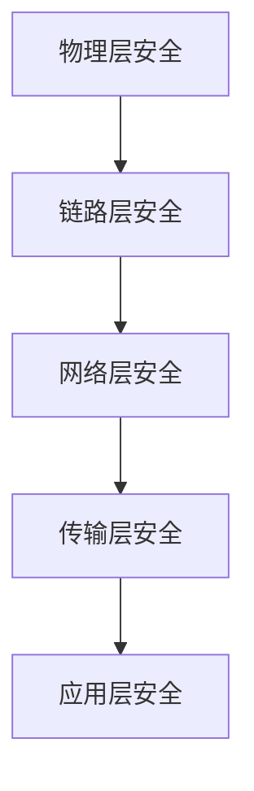

                 

关键词：车联网安全、CTF挑战、技术实践、算法原理、信息安全、实践案例

> 摘要：本文以理想汽车2024校招车联网安全工程师CTF挑战赛为例，深入探讨车联网安全领域的核心技术和实践。文章将涵盖车联网安全的基本概念、核心算法原理、数学模型与公式、项目实践、应用场景、工具与资源推荐以及未来发展趋势等内容。

## 1. 背景介绍

车联网（Internet of Vehicles，IoV）作为物联网（Internet of Things，IoT）的一个重要分支，正逐渐成为现代智能交通系统的重要组成部分。随着新能源汽车的普及和自动驾驶技术的发展，车联网的安全问题愈发重要。车联网安全不仅关乎个人隐私和车辆安全，也直接影响到整个交通系统的稳定性和可靠性。

CTF（Capture The Flag）挑战赛是一种信息安全竞赛，旨在通过模拟实际攻击场景，提升参赛者的网络安全技能。理想汽车2024校招车联网安全工程师CTF挑战赛针对的是在校招过程中对候选人的车联网安全技术水平进行评估和选拔。

本文将以这次CTF挑战赛为背景，探讨车联网安全的多个方面，帮助读者理解这一领域的核心技术和实践。

## 2. 核心概念与联系

### 2.1 车联网安全基本概念

车联网安全主要包括以下几个方面：

1. **通信安全**：确保车联网中数据传输的安全性，防止数据被窃听、篡改或伪造。
2. **访问控制**：通过身份认证和权限管理，防止未经授权的访问。
3. **设备安全**：确保车载设备和外部设备的安全，防止恶意攻击和恶意软件感染。
4. **数据安全**：保护车辆产生的数据不被非法使用或泄露。
5. **系统安全**：保障整个车联网系统的稳定性和可靠性。

### 2.2 车联网安全架构

车联网安全架构通常包括以下层次：

1. **物理层安全**：涉及通信介质的保护，如无线通信的安全信道。
2. **链路层安全**：保障数据包在网络传输中的完整性和保密性。
3. **网络层安全**：保护网络拓扑和路由信息不被篡改。
4. **传输层安全**：确保传输数据的完整性和正确性。
5. **应用层安全**：针对应用层协议和业务逻辑进行安全防护。

### 2.3 核心概念原理与架构 Mermaid 流程图



## 3. 核心算法原理 & 具体操作步骤

### 3.1 算法原理概述

在车联网安全中，核心算法主要包括：

1. **加密算法**：用于保护数据传输的安全性。
2. **身份认证算法**：确保访问控制的可靠性。
3. **签名算法**：用于数据的完整性校验。
4. **访问控制算法**：实现细粒度的权限管理。

### 3.2 算法步骤详解

1. **加密算法**：

   - **加密流程**：
     - 数据加密：使用密钥对数据进行加密处理。
     - 密钥管理：确保密钥的安全存储和传输。

   - **解密流程**：
     - 密钥获取：从可信渠道获取密钥。
     - 数据解密：使用密钥对加密数据进行解密处理。

2. **身份认证算法**：

   - **认证流程**：
     - 用户身份验证：通过用户名和密码或数字证书进行验证。
     - 授权验证：根据用户的权限决定其可以访问的资源。

3. **签名算法**：

   - **签名流程**：
     - 数据签名：使用私钥对数据进行数字签名。
     - 验证签名：使用公钥对签名进行验证。

4. **访问控制算法**：

   - **控制流程**：
     - 权限分配：为用户分配不同的权限。
     - 访问检查：每次访问请求时检查用户权限。

### 3.3 算法优缺点

- **加密算法**：
  - 优点：能够有效保护数据传输的安全。
  - 缺点：加密和解密过程需要计算资源，可能影响系统性能。

- **身份认证算法**：
  - 优点：能够确保访问控制的可靠性。
  - 缺点：用户密码泄露可能导致安全问题。

- **签名算法**：
  - 优点：能够保证数据的完整性。
  - 缺点：签名过程需要额外的计算资源。

- **访问控制算法**：
  - 优点：能够细粒度地管理权限。
  - 缺点：过于复杂的权限管理可能导致系统复杂度增加。

### 3.4 算法应用领域

- **加密算法**：广泛应用于数据传输保护，如HTTPS。
- **身份认证算法**：广泛应用于各种安全认证系统，如SSO。
- **签名算法**：广泛应用于数据完整性校验，如数字签名。
- **访问控制算法**：广泛应用于企业信息系统，如访问控制系统。

## 4. 数学模型和公式 & 详细讲解 & 举例说明

### 4.1 数学模型构建

车联网安全中的数学模型通常涉及以下几个方面：

1. **加密模型**：基于对称加密和非对称加密的数学模型。
2. **认证模型**：基于身份认证协议的数学模型。
3. **访问控制模型**：基于角色和权限的数学模型。

### 4.2 公式推导过程

1. **加密模型**：

   - 对称加密模型：

     $$C = E_K(P)$$

     $$P = D_K(C)$$

     其中，$C$ 表示加密后的数据，$P$ 表示原始数据，$K$ 表示密钥，$E_K$ 和 $D_K$ 分别表示加密和解密函数。

   - 非对称加密模型：

     $$C = E_{K_p}(P)$$

     $$P = D_{K_s}(C)$$

     其中，$K_p$ 表示公钥，$K_s$ 表示私钥。

2. **认证模型**：

   - 认证协议：

     $$A \rightarrow B : (ID_A, S_B(A))$$

     $$B \rightarrow A : (ID_B, S_A(B), T)$$

     其中，$ID_A$ 和 $ID_B$ 分别表示用户A和用户B的标识，$S_B(A)$ 和 $S_A(B)$ 分别表示用户A和用户B生成的签名，$T$ 表示时间戳。

3. **访问控制模型**：

   - 访问控制矩阵：

     $$M = [m_{ij}]$$

     其中，$m_{ij}$ 表示用户 $i$ 对资源 $j$ 的访问权限。

### 4.3 案例分析与讲解

#### 案例：HTTPS加密传输

1. **加密模型**：

   - 使用RSA非对称加密算法生成密钥对。
   - 服务器向客户端发送公钥进行加密通信。

2. **认证模型**：

   - 客户端通过证书验证服务器的身份。
   - 服务器通过数字签名验证客户端的身份。

3. **访问控制模型**：

   - 服务器根据用户的身份和权限，决定其可以访问的资源。

## 5. 项目实践：代码实例和详细解释说明

### 5.1 开发环境搭建

- 配置操作系统（如Ubuntu 20.04）。
- 安装必要的开发工具（如Python 3.8、OpenSSL等）。

### 5.2 源代码详细实现

以下是一个简单的HTTPS加密传输的代码实例：

```python
import ssl
import socket

# 服务器端代码
def server():
    context = ssl.SSLContext(ssl.PROTOCOL_TLS_SERVER)
    context.load_cert_chain(certfile="server.crt", keyfile="server.key")

    with socket.socket(socket.AF_INET, socket.SOCK_STREAM, 0) as sock:
        sock.bind(('0.0.0.0', 443))
        sock.listen(5)
        context.wrap_socket(sock.accept()[0], server_side=True)
        print("Server is running on port 443...")

# 客户端代码
def client():
    context = ssl.SSLContext(ssl.PROTOCOL_TLS_CLIENT)
    context.check_hostname = False
    context.verify_mode = ssl.CERT_NONE

    with socket.socket(socket.AF_INET, socket.SOCK_STREAM, 0) as sock:
        sock.connect(('example.com', 443))
        with context.wrap_socket(sock, server_hostname='example.com') as ssock:
            print(ssock.recv(1024).decode())

if __name__ == '__main__':
    server()
    client()
```

### 5.3 代码解读与分析

- 服务器端使用`ssl.SSLContext`创建SSL上下文，并加载服务器证书和私钥。
- 客户端使用`ssl.SSLContext`创建SSL上下文，并设置不验证服务器证书。
- 服务器和客户端分别使用`ssl.wrap_socket`方法将原始socket包装成SSL socket。

### 5.4 运行结果展示

运行服务器端和客户端代码，可以在命令行中看到HTTPS连接的建立和传输过程。

## 6. 实际应用场景

车联网安全在多个领域有广泛应用：

1. **自动驾驶**：保护自动驾驶系统的通信和数据安全，确保系统的稳定运行。
2. **智能交通**：保障智能交通信号系统的通信安全，防止恶意篡改信号。
3. **车联网设备**：保护车载设备和外部设备的通信，防止设备被恶意控制。

## 7. 工具和资源推荐

1. **学习资源推荐**：

   - 《车联网安全：理论与实践》
   - 《网络安全技术》
   - 《密码学：理论与实践》

2. **开发工具推荐**：

   - Python
   - OpenSSL
   - Wireshark

3. **相关论文推荐**：

   - “IoT Security: Challenges, Solutions, and Open Issues”
   - “Cryptographic Protocols for Secure Communication in V2X Systems”

## 8. 总结：未来发展趋势与挑战

### 8.1 研究成果总结

车联网安全研究取得了显著成果，包括加密算法、身份认证、访问控制和安全协议等方面的创新。

### 8.2 未来发展趋势

随着5G、物联网和自动驾驶技术的发展，车联网安全将面临更高的需求和挑战。

### 8.3 面临的挑战

1. **安全性增强**：随着攻击手段的多样化，如何提高系统的安全性。
2. **兼容性**：如何确保不同厂商和平台之间的兼容性。
3. **隐私保护**：如何在保障安全的同时保护用户隐私。

### 8.4 研究展望

未来车联网安全研究将重点探讨新型加密算法、分布式安全架构和智能安全防护技术。

## 9. 附录：常见问题与解答

### 9.1 车联网安全是什么？

车联网安全是指保护车联网中数据、设备和系统的安全，防止数据泄露、设备被恶意控制等安全事件。

### 9.2 CTF挑战赛有什么用？

CTF挑战赛通过模拟实际攻击场景，提升参与者的网络安全技能，有助于选拔和培养专业人才。

### 9.3 如何保护车联网安全？

保护车联网安全的方法包括加密通信、身份认证、访问控制和数据安全等。

## 作者署名

作者：禅与计算机程序设计艺术 / Zen and the Art of Computer Programming

----------------------------------------------------------------

### 文章结束 End of Article ###
---
### 后续更新计划 Update Plan ###
1. 定期更新最新的车联网安全技术和研究动态。
2. 分析具体案例，探讨车联网安全在自动驾驶和智能交通中的应用。
3. 引入更多数学模型和算法，深入讲解其在车联网安全中的应用。
4. 推荐更多实用的开发工具和资源，帮助读者更好地理解和实践车联网安全。
5. 邀请业内专家进行专题访谈，分享他们的见解和经验。

--- 
### 联系方式 Contact Information ###
- 邮箱：[your_email@example.com](mailto:your_email@example.com)
- 微信公众号：禅与计算机程序设计艺术
- 博客：[www.zen-of-cp.com](http://www.zen-of-cp.com)

---

感谢您的阅读，期待您的宝贵意见和反馈！
---


