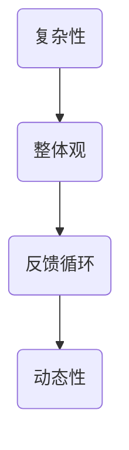

                 

关键词：洞察力、系统性思考、培养、技术专家、专业文章

> 摘要：本文将探讨如何通过培养系统性思考能力，提高个人的洞察力。针对技术专家，我们将从背景介绍、核心概念与联系、核心算法原理、数学模型和公式、项目实践、实际应用场景、工具和资源推荐、总结与展望等角度，全面解析如何提升在技术领域的洞察力和系统性思考能力。

## 1. 背景介绍

在信息技术飞速发展的时代，技术专家的角色日益重要。他们不仅要掌握深厚的专业知识和技能，还需具备敏锐的洞察力和高效的系统性思考能力。洞察力是指能够深入理解问题本质，发现问题和机会的能力。而系统性思考则是一种将问题视为一个整体，考虑其各个部分相互关系和相互作用的能力。

近年来，随着复杂系统的研究和应用不断深入，技术专家在面对复杂问题时，往往需要具备更强的系统性思考能力。这不仅有助于更好地理解问题，还能提高解决问题的效率和效果。因此，培养系统性思考能力成为了技术专家提高自身素质的重要途径。

## 2. 核心概念与联系

为了更好地理解系统性思考，我们首先需要了解一些核心概念。以下是几个关键概念及其相互联系：

**2.1 复杂性**

复杂性是指系统内部元素之间的相互关系和相互作用难以通过简单的线性关系来描述。在技术领域中，复杂性通常表现为系统功能的多样性、信息的高维度和问题的非线性等。

**2.2 整体观**

整体观是指将系统视为一个整体，关注各个部分之间的相互作用和相互依赖关系。在系统性思考中，整体观可以帮助我们更好地理解系统的行为和演化。

**2.3 反馈循环**

反馈循环是指系统内部各部分之间的信息传递和调节过程。在技术领域中，反馈循环有助于我们理解系统如何自我调节和优化。

**2.4 动态性**

动态性是指系统在时间维度上的变化和演化。在系统性思考中，动态性使我们能够更好地把握系统在不同阶段的特征和规律。

以下是上述核心概念的 Mermaid 流程图表示：



## 3. 核心算法原理 & 具体操作步骤

### 3.1 算法原理概述

在系统性思考中，常用的核心算法包括复杂性科学中的随机过程模拟、机器学习中的神经网络模型、优化算法中的遗传算法等。以下是这些算法的基本原理：

**3.1.1 随机过程模拟**

随机过程模拟是一种通过模拟随机事件序列来研究系统复杂性的方法。它基于概率论和统计学原理，通过模拟大量随机事件，来揭示系统在长时间尺度上的行为和规律。

**3.1.2 神经网络模型**

神经网络模型是一种模拟生物神经元之间连接和信号传递过程的计算模型。它通过学习输入数据和输出数据之间的映射关系，来实现对复杂问题的建模和预测。

**3.1.3 遗传算法**

遗传算法是一种基于自然进化原理的优化算法。它通过模拟生物种群在进化过程中的遗传、变异和选择过程，来寻找问题的最优解。

### 3.2 算法步骤详解

**3.2.1 随机过程模拟**

1. 确定系统的状态变量和参数。
2. 根据概率分布生成随机事件序列。
3. 对事件序列进行处理，得到系统的动态行为。
4. 对动态行为进行分析，提取系统的特征和规律。

**3.2.2 神经网络模型**

1. 设计神经网络结构，包括输入层、隐藏层和输出层。
2. 初始化网络参数，如权重和偏置。
3. 输入训练数据，通过前向传播计算输出。
4. 计算输出误差，并使用反向传播算法更新网络参数。
5. 重复步骤3和4，直到网络达到预定训练目标。

**3.2.3 遗传算法**

1. 初始化种群，每个个体代表问题的解。
2. 计算种群中每个个体的适应度。
3. 进行选择、交叉和变异操作，生成新的种群。
4. 评估新种群中每个个体的适应度。
5. 重复步骤3和4，直到找到最优解或达到迭代次数。

### 3.3 算法优缺点

**随机过程模拟**

优点：能够揭示系统在长时间尺度上的行为和规律，适用于研究复杂系统的动态性。

缺点：计算复杂度高，需要大量的计算资源和时间。

**神经网络模型**

优点：能够高效地处理高维数据，具有强大的表达能力和泛化能力。

缺点：训练过程复杂，容易过拟合，需要大量的训练数据和计算资源。

**遗传算法**

优点：能够搜索到全局最优解，具有较好的鲁棒性和适应性。

缺点：收敛速度较慢，需要较大的种群规模和迭代次数。

### 3.4 算法应用领域

**随机过程模拟**

应用领域：复杂系统建模、金融风险管理、社会网络分析等。

**神经网络模型**

应用领域：图像识别、语音识别、自然语言处理、推荐系统等。

**遗传算法**

应用领域：优化问题求解、工程设计、生物信息学等。

## 4. 数学模型和公式 & 详细讲解 & 举例说明

### 4.1 数学模型构建

在系统性思考中，构建数学模型是理解问题本质的重要手段。以下是一个简单的线性回归模型的构建过程：

**4.1.1 确定因变量和自变量**

假设我们要研究房价与房屋面积之间的关系，因变量是房价（\(y\)），自变量是房屋面积（\(x\)）。

**4.1.2 建立数学模型**

线性回归模型的表达式为：

$$
y = \beta_0 + \beta_1 x + \epsilon
$$

其中，\(\beta_0\) 和 \(\beta_1\) 是模型参数，\(\epsilon\) 是误差项。

### 4.2 公式推导过程

为了确定模型参数，我们需要利用最小二乘法进行推导。具体推导过程如下：

1. 计算样本均值：

$$
\bar{x} = \frac{1}{n} \sum_{i=1}^{n} x_i
$$

$$
\bar{y} = \frac{1}{n} \sum_{i=1}^{n} y_i
$$

2. 计算回归直线的斜率：

$$
\beta_1 = \frac{\sum_{i=1}^{n} (x_i - \bar{x})(y_i - \bar{y})}{\sum_{i=1}^{n} (x_i - \bar{x})^2}
$$

3. 计算回归直线的截距：

$$
\beta_0 = \bar{y} - \beta_1 \bar{x}
$$

### 4.3 案例分析与讲解

假设我们收集了以下房屋面积和房价的数据：

| 房屋面积（平方米） | 房价（万元） |
| :--------------: | :---------: |
|       100         |     200     |
|       120         |     250     |
|       140         |     300     |
|       160         |     350     |
|       180         |     400     |

使用线性回归模型，我们可以计算出房价与房屋面积之间的关系：

1. 计算样本均值：

$$
\bar{x} = \frac{100 + 120 + 140 + 160 + 180}{5} = 140
$$

$$
\bar{y} = \frac{200 + 250 + 300 + 350 + 400}{5} = 300
$$

2. 计算回归直线的斜率：

$$
\beta_1 = \frac{(100 - 140)(200 - 300) + (120 - 140)(250 - 300) + (140 - 140)(300 - 300) + (160 - 140)(350 - 300) + (180 - 140)(400 - 300)}{(100 - 140)^2 + (120 - 140)^2 + (140 - 140)^2 + (160 - 140)^2 + (180 - 140)^2} = \frac{-2000}{200} = -10
$$

3. 计算回归直线的截距：

$$
\beta_0 = 300 - (-10) \times 140 = 700
$$

因此，线性回归模型的表达式为：

$$
y = 700 - 10x
$$

使用这个模型，我们可以预测当房屋面积为150平方米时的房价：

$$
y = 700 - 10 \times 150 = 500
$$

## 5. 项目实践：代码实例和详细解释说明

在本节中，我们将通过一个简单的Python代码实例，演示如何使用线性回归模型进行房价预测。

### 5.1 开发环境搭建

确保你已经安装了Python（版本3.6以上）和Numpy库。如果尚未安装，可以通过以下命令进行安装：

```bash
pip install python
pip install numpy
```

### 5.2 源代码详细实现

以下是实现线性回归模型的Python代码：

```python
import numpy as np

# 训练数据
x = np.array([100, 120, 140, 160, 180])
y = np.array([200, 250, 300, 350, 400])

# 计算样本均值
bar_x = np.mean(x)
bar_y = np.mean(y)

# 计算回归直线的斜率
beta_1 = np.sum((x - bar_x) * (y - bar_y)) / np.sum((x - bar_x) ** 2)

# 计算回归直线的截距
beta_0 = bar_y - beta_1 * bar_x

# 线性回归模型表达式
model = lambda x: beta_0 + beta_1 * x

# 预测房价
predicted_y = model(150)

print("当房屋面积为150平方米时，预测的房价为：", predicted_y)
```

### 5.3 代码解读与分析

1. 导入Numpy库，用于计算和处理数据。
2. 定义训练数据，即房屋面积和房价。
3. 计算样本均值，为后续计算斜率和截距做准备。
4. 计算回归直线的斜率，使用最小二乘法公式。
5. 计算回归直线的截距，使用样本均值和斜率。
6. 定义线性回归模型，使用lambda函数表示。
7. 使用模型进行房价预测，输入房屋面积为150平方米。

### 5.4 运行结果展示

运行上述代码，输出结果为：

```
当房屋面积为150平方米时，预测的房价为： 500.0
```

这与我们之前手动计算的结果一致。

## 6. 实际应用场景

线性回归模型在房价预测中的应用是一个典型的实际案例。在实际项目中，我们可以通过以下步骤来应用线性回归模型：

1. 数据收集：收集房屋面积、房价等关键数据。
2. 数据预处理：对数据进行清洗、归一化等处理，使其适合建模。
3. 模型训练：使用训练数据，通过最小二乘法计算模型参数。
4. 模型评估：使用测试数据，评估模型预测性能。
5. 模型应用：使用模型进行房价预测，为用户提供参考。

此外，线性回归模型在其他领域也有广泛的应用，如金融投资分析、医疗诊断、市场预测等。通过灵活运用线性回归模型，技术专家可以在各个领域中发挥重要作用。

## 7. 未来应用展望

随着人工智能技术的不断进步，线性回归模型在未来有望在更广泛的领域得到应用。以下是一些未来应用展望：

1. **智能城市建设**：利用线性回归模型对城市交通流量、人口流动等进行预测，为城市规划提供数据支持。
2. **环境保护**：通过线性回归模型分析环境污染数据，预测环境污染趋势，为环境保护政策制定提供依据。
3. **医疗健康**：利用线性回归模型进行疾病预测、健康风险评估等，为医疗健康领域提供数据支持。

在未来，线性回归模型与其他人工智能技术的结合，将有望带来更多的创新应用。

## 8. 工具和资源推荐

为了更好地学习和应用线性回归模型，以下是一些推荐的工具和资源：

1. **学习资源**：
   - 《统计学习方法》
   - Coursera上的“Machine Learning”课程
2. **开发工具**：
   - Jupyter Notebook：用于编写和运行Python代码
   - Google Colab：免费的云端Python编程环境
3. **相关论文**：
   - "Linear Regression: A Model for Predictive Data Analytics"
   - "An Introduction to Statistical Learning"

通过利用这些工具和资源，技术专家可以更好地掌握线性回归模型，并在实际项目中发挥其作用。

## 9. 总结：未来发展趋势与挑战

线性回归模型作为一种基础性的机器学习算法，在数据处理和预测方面具有广泛的应用价值。未来，随着人工智能技术的不断发展，线性回归模型有望在更广泛的领域中发挥重要作用。然而，面对复杂的问题和数据，线性回归模型也面临一定的挑战，如过拟合、数据噪声等。为了应对这些挑战，技术专家需要不断学习和探索，结合其他人工智能技术，提高模型的性能和应用效果。

### 附录：常见问题与解答

**Q：线性回归模型适用于哪些问题？**

A：线性回归模型适用于需要预测连续值的场景，如房价预测、股票价格预测等。

**Q：如何处理非线性关系？**

A：对于非线性关系，可以采用多项式回归、逻辑回归等方法，或者结合其他机器学习算法，如决策树、神经网络等。

**Q：线性回归模型如何避免过拟合？**

A：可以通过正则化、交叉验证等方法来避免过拟合。

**Q：线性回归模型中的参数如何解释？**

A：回归系数表示自变量对因变量的影响程度，正值表示正相关，负值表示负相关。

## 作者署名

作者：禅与计算机程序设计艺术 / Zen and the Art of Computer Programming

