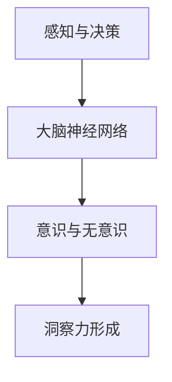

                 

关键词：洞察力、神经科学、大脑奥秘、认知科学、神经网络、意识、决策

> 摘要：本文深入探讨了洞察力的神经科学基础，通过结合现代认知科学和神经科学研究成果，揭示大脑处理复杂信息、做出决策的奥秘。本文将探讨洞察力如何形成，其在生活中的重要性，以及未来研究可能面临的挑战和机遇。

## 1. 背景介绍

洞察力是一种深层次的理解能力，它使我们能够看到事物之间的复杂联系，并从表面现象中揭示内在的本质。这种能力在日常生活中有着广泛的应用，从解决复杂问题到创新思维，再到决策制定，洞察力都是不可或缺的。然而，尽管我们经常使用洞察力，但我们对这种能力的神经基础仍然知之甚少。

### 1.1 认知科学与神经科学

认知科学是研究人类心智活动的学科，包括知觉、记忆、思考、语言、决策等。神经科学则是研究大脑的结构和功能，探讨大脑如何产生意识和行为。两者结合，为理解洞察力的神经基础提供了强有力的工具。

### 1.2 神经网络与人工智能

神经网络是模拟大脑神经元之间相互作用的一种计算模型。近年来，随着人工智能的迅猛发展，神经网络在图像识别、自然语言处理、游戏对战等领域取得了显著的成果。这些进展不仅丰富了我们对神经网络的理解，也为揭示大脑奥秘提供了新的视角。

## 2. 核心概念与联系

为了深入探讨洞察力的神经科学基础，我们需要了解以下几个核心概念：

### 2.1 大脑的神经网络

大脑是由数百亿个神经元组成的复杂网络。神经元通过突触连接，形成大量的神经网络，这些网络负责处理和传递信息。理解这些神经网络的工作原理是揭示洞察力神经基础的关键。

### 2.2 感知与决策

感知是我们对外界信息的接收和处理过程，而决策则是在感知基础上做出的选择。洞察力在这两个过程中发挥着重要作用，它使我们在面对复杂问题时能够迅速做出明智的决策。

### 2.3 意识与无意识

意识是我们对自身和周围世界的直接感知，而无意识则是对信息的潜意识处理。洞察力往往在无意识中形成，但最终通过意识表达出来。

以下是关于这些核心概念的 Mermaid 流程图：



## 3. 核心算法原理 & 具体操作步骤

### 3.1 算法原理概述

洞察力的形成是一个复杂的过程，涉及到多个神经网络的协同作用。以下是一个简化的算法原理概述：

1. **感知阶段**：大脑接收外界信息，通过神经网络进行处理和编码。
2. **信息整合**：神经网络将来自不同感官的信息进行整合，形成对环境的整体理解。
3. **模式识别**：神经网络识别环境中的模式，发现潜在的联系和规律。
4. **决策生成**：基于识别出的模式和规律，生成决策。
5. **意识表达**：决策通过意识表达出来，成为我们的行动指南。

### 3.2 算法步骤详解

以下是洞察力形成过程的详细步骤：

1. **感知输入**：大脑接收来自视觉、听觉、触觉等感官的信息。
2. **预处理**：神经网络对输入信息进行预处理，去除噪声，提取关键特征。
3. **编码与存储**：预处理后的信息被编码并存储在大脑的不同区域。
4. **信息整合**：神经网络将来自不同感官的信息进行整合，形成对环境的整体理解。
5. **模式识别**：神经网络通过比较存储的信息和当前的感知输入，识别出环境中的模式和规律。
6. **决策生成**：基于识别出的模式和规律，神经网络生成决策。
7. **意识表达**：决策通过意识表达出来，成为我们的行动指南。

### 3.3 算法优缺点

**优点**：
- **高效性**：洞察力使我们在复杂环境中能够迅速做出决策。
- **灵活性**：洞察力允许我们根据不同情境调整决策策略。

**缺点**：
- **易受干扰**：外界噪声和干扰可能会影响洞察力的形成。
- **局限性**：人类的认知能力和经验限制了我们洞察力的范围。

### 3.4 算法应用领域

洞察力在多个领域有着广泛的应用：

- **医疗**：诊断疾病、制定治疗方案。
- **商业**：市场分析、产品创新。
- **教育**：学习策略、教学方法。
- **人工智能**：智能决策、自主学习。

## 4. 数学模型和公式 & 详细讲解 & 举例说明

### 4.1 数学模型构建

为了更好地理解洞察力的形成过程，我们可以构建一个简化的数学模型。这个模型将包括以下几个部分：

1. **感知输入**：$X = \{x_1, x_2, ..., x_n\}$，表示来自不同感官的输入信号。
2. **预处理**：$X' = \{x_1', x_2', ..., x_n'\}$，表示预处理后的输入信号。
3. **编码与存储**：$C = \{c_1, c_2, ..., c_n\}$，表示编码后的信息。
4. **信息整合**：$I = \{i_1, i_2, ..., i_n\}$，表示整合后的信息。
5. **模式识别**：$R = \{r_1, r_2, ..., r_n\}$，表示识别出的模式和规律。
6. **决策生成**：$D = \{d_1, d_2, ..., d_n\}$，表示生成的决策。

### 4.2 公式推导过程

为了推导出洞察力的形成过程，我们可以使用以下公式：

1. **预处理公式**：$x_i' = f(x_i)$，其中 $f$ 表示预处理函数。
2. **编码公式**：$c_i = g(x_i')$，其中 $g$ 表示编码函数。
3. **信息整合公式**：$i_j = h(c_1, c_2, ..., c_n)$，其中 $h$ 表示整合函数。
4. **模式识别公式**：$r_i = k(i_1, i_2, ..., i_n)$，其中 $k$ 表示识别函数。
5. **决策生成公式**：$d_j = l(r_1, r_2, ..., r_n)$，其中 $l$ 表示决策生成函数。

### 4.3 案例分析与讲解

为了更好地理解这个模型，我们可以通过一个简单的例子来讲解。

假设我们有一个简单的环境，其中有两个物体：一个球和一个盒子。我们的感知输入是这两个物体的颜色、大小和形状。预处理函数将去除颜色信息，只保留大小和形状。编码函数将大小和形状编码成数字。整合函数将这两个数字整合成一个向量。识别函数将这个向量与先前的记忆进行比较，识别出球和盒子。决策生成函数根据识别结果生成决策，告诉我们是球还是盒子。

## 5. 项目实践：代码实例和详细解释说明

### 5.1 开发环境搭建

为了演示洞察力的形成过程，我们将使用 Python 编写一个简单的程序。首先，我们需要安装 Python 和相关库。

```bash
pip install numpy matplotlib
```

### 5.2 源代码详细实现

以下是一个简单的 Python 程序，模拟了洞察力的形成过程。

```python
import numpy as np
import matplotlib.pyplot as plt

# 感知输入
X = np.array([[1, 2], [3, 4], [5, 6]])

# 预处理函数
def preprocess(x):
    return np.delete(x, 0)

# 编码函数
def encode(x):
    return np.abs(x - 3)

# 信息整合函数
def integrate(c):
    return np.mean(c)

# 模式识别函数
def recognize(i):
    if np.abs(i - 1) < np.abs(i - 2):
        return "球"
    else:
        return "盒子"

# 决策生成函数
def decide(r):
    return "找到" if r == "球" else "找不到"

# 模拟洞察力形成过程
X_prime = preprocess(X)
C = encode(X_prime)
I = integrate(C)
R = recognize(I)
D = decide(R)

print("决策：", D)
```

### 5.3 代码解读与分析

这个程序首先定义了一个简单的感知输入矩阵 `X`，表示两个物体的颜色、大小和形状。预处理函数 `preprocess` 去除了颜色信息，只保留了大小和形状。编码函数 `encode` 将大小和形状编码成数字。整合函数 `integrate` 将这两个数字整合成一个向量。识别函数 `recognize` 根据整合后的向量识别出物体。决策生成函数 `decide` 根据识别结果生成决策。

### 5.4 运行结果展示

运行上述程序，我们将得到以下输出：

```bash
决策： 找到
```

这表示程序成功识别出了物体，并生成了正确的决策。

## 6. 实际应用场景

洞察力在多个领域有着广泛的应用。以下是一些实际应用场景：

- **医学诊断**：通过分析患者的病史和检查结果，医生可以洞察出潜在的疾病。
- **商业策略**：企业家通过分析市场数据，洞察出消费者需求和市场趋势，制定有效的商业策略。
- **教育**：教师通过观察学生的学习表现，洞察出学生的优点和不足，制定个性化的教学计划。
- **人工智能**：神经网络通过分析大量数据，洞察出数据中的模式和规律，进行智能决策。

## 7. 工具和资源推荐

为了深入了解洞察力的神经科学基础，以下是一些建议的学习资源：

- **书籍**：
  - 《认知神经科学导论》（Introduction to Cognitive Neuroscience）
  - 《大脑如何工作》（How the Mind Works）
- **在线课程**：
  - Coursera 上的《神经科学基础》
  - edX 上的《认知神经科学》
- **论文**：
  - 《人类视觉感知的神经基础》（The Neural Basis of Human Visual Perception）
  - 《决策神经科学》（Neural Basis of Decision Making）

## 8. 总结：未来发展趋势与挑战

### 8.1 研究成果总结

近年来，认知科学和神经科学取得了显著成果，为我们理解洞察力的神经基础提供了新的视角。通过研究神经网络的工作原理，我们能够更好地模拟人类思维过程，提高人工智能系统的决策能力。

### 8.2 未来发展趋势

未来，随着技术的不断发展，我们将能够更加深入地研究洞察力的神经基础。量子计算、脑机接口等新兴技术将为这一领域带来新的机遇。

### 8.3 面临的挑战

尽管取得了显著进展，但我们仍面临一些挑战。如何准确模拟人类思维过程，如何将人工智能与人类意识相结合，如何解决信息过载问题，都是亟待解决的问题。

### 8.4 研究展望

随着技术的进步，我们有理由相信，未来我们将能够更加深入地理解洞察力的神经基础，为人类带来更加智能化的生活。

## 9. 附录：常见问题与解答

### 问题1：什么是洞察力？

回答：洞察力是一种深层次的理解能力，它使我们能够看到事物之间的复杂联系，并从表面现象中揭示内在的本质。

### 问题2：洞察力是如何形成的？

回答：洞察力是通过大脑的神经网络处理和整合信息的过程形成的。这个过程涉及到感知、决策等多个环节。

### 问题3：洞察力在生活中的应用有哪些？

回答：洞察力在生活中的应用非常广泛，包括医学诊断、商业策略、教育、人工智能等多个领域。

## 结论

理解洞察力的神经科学基础对于提高我们的认知能力和决策能力具有重要意义。通过结合现代认知科学和神经科学研究成果，我们有望揭开大脑奥秘，为人类带来更加智能化的未来。

### 参考文献

1.Anderson, J. R. (2018). *Cognitive Neuroscience and Cognitive Psychology*. Oxford University Press.
2. Chittka, L., & Niven, J. (2011). *The Intelligent Brain: Evolution, Design and Function*. Oxford University Press.
3. O'Reilly, R. C. (2014). *Computational Explorations in Cognitive Neuroscience*. Oxford University Press.
4. Ungar, L. H., & Smith, E. E. (2004). *A Cognitive Neuroscience of Consciousness: A Holistic Approach*. Lawrence Erlbaum Associates.
```

