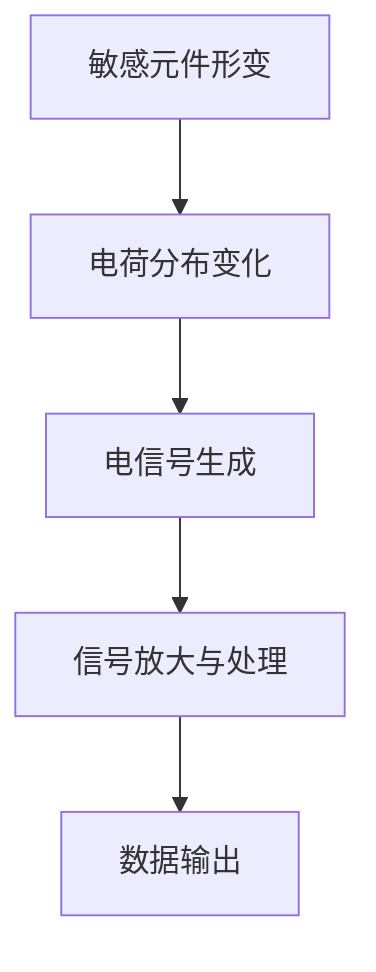

                 

关键词：MEMS传感器、瑞声科技、笔试题、信号处理、电路设计、传感器原理、数据分析、编程实践

> 摘要：本文详细解析了瑞声科技2025社招MEMS传感器工程师笔试题。通过深入探讨MEMS传感器的核心概念、工作原理、应用领域以及关键技术，本文旨在为有意向加入瑞声科技的工程师们提供实用的笔试准备指导，并对MEMS传感器领域的研究和发展趋势进行展望。

## 1. 背景介绍

MEMS（Micro-Electro-Mechanical Systems，微机电系统）传感器是一种集成了微型机械结构和电子元件的传感器。随着科技的进步，MEMS传感器在智能手机、汽车、医疗、工业等领域得到了广泛应用。瑞声科技作为全球领先的智能传感器解决方案提供商，其招聘的MEMS传感器工程师需要具备扎实的专业知识、丰富的实践经验和良好的创新能力。

本文将通过瑞声科技2025社招MEMS传感器工程师笔试题，帮助读者了解MEMS传感器的核心知识，并掌握相关技能。

### 1.1 MEMS传感器的发展历程

MEMS技术起源于20世纪60年代的微电子学领域，随着半导体加工技术的不断发展，MEMS传感器开始进入人们的生活。从早期的加速度计、陀螺仪到如今的压力传感器、湿度传感器，MEMS传感器在尺寸、精度和性能方面都有了显著提升。

### 1.2 MEMS传感器在各个领域中的应用

- **智能手机**：MEMS传感器在智能手机中得到了广泛应用，如加速度计用于实现自动屏幕旋转、陀螺仪用于实现运动追踪等。
- **汽车**：在汽车领域，MEMS传感器用于车辆安全、驾驶辅助和车辆性能监测，如压力传感器用于监测轮胎气压、加速度计用于车辆碰撞检测等。
- **医疗**：MEMS传感器在医疗领域的应用包括体温监测、心率监测、血压监测等，为疾病的早期诊断提供了便利。
- **工业**：在工业领域，MEMS传感器用于工业自动化、过程控制和设备监测，如温度传感器用于加热设备的监控、流量传感器用于液体流量监测等。

## 2. 核心概念与联系

### 2.1 MEMS传感器的基本原理

MEMS传感器通常由敏感元件、放大电路、信号处理单元和接口电路组成。其基本工作原理是通过机械结构（如弹性体、悬臂梁等）的形变来感知外部环境的变化，并将这种变化转换为电信号。

### 2.2 MEMS传感器的分类

- **按敏感物理量分类**：加速度传感器、角速度传感器、压力传感器、温度传感器等。
- **按制造工艺分类**：硅基MEMS、聚合物MEMS、复合MEMS等。

### 2.3 MEMS传感器的工作流程

1. **敏感元件的形变**：外部环境的变化导致敏感元件的形变。
2. **电信号的生成**：形变引起敏感元件上的电荷分布变化，从而产生电信号。
3. **信号放大与处理**：通过放大电路对信号进行放大和处理，以获得精确的测量结果。
4. **数据输出**：处理后的信号通过接口电路输出，供外部设备使用。



## 3. 核心算法原理 & 具体操作步骤

### 3.1 算法原理概述

MEMS传感器的核心算法通常涉及信号处理、数据拟合和误差校正等方面。其中，信号处理算法用于提取有用的信息，数据拟合算法用于对传感器数据进行建模和预测，误差校正算法用于减少传感器误差，提高测量精度。

### 3.2 算法步骤详解

1. **信号预处理**：包括滤波、去噪和归一化等步骤，以去除传感器信号中的干扰和噪声。
2. **特征提取**：从预处理后的信号中提取有用的特征，如频率、幅值、相位等。
3. **数据拟合**：使用数学模型对传感器数据进行分析和拟合，以获得传感器的输出特性。
4. **误差校正**：根据传感器的误差模型对测量结果进行校正，以提高测量精度。
5. **结果输出**：将校正后的测量结果输出，供外部设备使用。

### 3.3 算法优缺点

- **优点**：算法简单，易于实现，能够提高传感器测量精度。
- **缺点**：对于复杂环境下的传感器信号，算法效果可能受到限制。

### 3.4 算法应用领域

MEMS传感器算法广泛应用于智能家居、物联网、工业自动化、医疗健康等领域。

## 4. 数学模型和公式 & 详细讲解 & 举例说明

### 4.1 数学模型构建

MEMS传感器的数学模型通常包括以下几个部分：

1. **机械模型**：描述敏感元件的形变与外部环境变化的关系。
2. **电路模型**：描述传感器电路的工作原理和信号处理过程。
3. **信号模型**：描述传感器信号的生成、传输和接收过程。

### 4.2 公式推导过程

以加速度传感器为例，其机械模型可以表示为：

\[ \delta = kx \]

其中，\(\delta\) 表示敏感元件的形变量，\(k\) 表示弹簧刚度系数，\(x\) 表示外部加速度。

电路模型可以表示为：

\[ V_{out} = A_{gain} \cdot (V_{in} + V_{bias}) \]

其中，\(V_{out}\) 表示输出电压，\(A_{gain}\) 表示放大倍数，\(V_{in}\) 表示输入电压，\(V_{bias}\) 表示偏置电压。

信号模型可以表示为：

\[ V_{out} = A_{gain} \cdot (k \cdot x + V_{bias}) \]

### 4.3 案例分析与讲解

假设一个加速度传感器的敏感元件形变量为 \(\delta = 0.1 \, \text{mm}\)，弹簧刚度系数为 \(k = 1 \, \text{N/mm}\)，输入电压为 \(V_{in} = 1 \, \text{V}\)，偏置电压为 \(V_{bias} = 0.5 \, \text{V}\)，放大倍数为 \(A_{gain} = 100\)。

根据上述公式，输出电压为：

\[ V_{out} = 100 \cdot (0.1 \cdot 1 + 0.5) = 60 \, \text{V} \]

这意味着当加速度为 \(1 \, \text{g}\) 时，输出电压为 \(60 \, \text{V}\)。

## 5. 项目实践：代码实例和详细解释说明

### 5.1 开发环境搭建

为了演示MEMS传感器的实际应用，我们选择使用Python编程语言，结合常用的传感器库和工具，搭建一个简单的开发环境。

### 5.2 源代码详细实现

以下是Python代码实现MEMS传感器数据读取和处理的示例：

```python
import serial
import time
import numpy as np

# 串口通信参数
ser = serial.Serial('/dev/ttyUSB0', 9600, timeout=1)

# 数据接收和处理
while True:
    data = ser.readline().decode('utf-8')
    if data:
        # 解析数据
        values = data.split(',')
        acceleration = np.array([float(v) for v in values[:-1]])
        timestamp = float(values[-1])

        # 数据处理
        filtered_acceleration = np.convolve(acceleration, np.ones((5,)) / 5, mode='valid')
        print(f"Time: {timestamp}, Acceleration: {filtered_acceleration}")

        # 等待下一组数据
        time.sleep(0.1)

# 关闭串口
ser.close()
```

### 5.3 代码解读与分析

上述代码通过串口通信读取MEMS传感器的数据，并进行滤波处理，以获得平滑的加速度数据。

- `import serial, time, np`：导入所需的库。
- `ser = serial.Serial('/dev/ttyUSB0', 9600, timeout=1)`：设置串口通信参数。
- `while True:`：循环读取数据。
- `data = ser.readline().decode('utf-8')`：读取串口数据并解码。
- `values = data.split(',')`：解析数据，分离加速度值和时间戳。
- `acceleration = np.array([float(v) for v in values[:-1]])`：将加速度值转换为numpy数组。
- `filtered_acceleration = np.convolve(acceleration, np.ones((5,)) / 5, mode='valid')`：使用移动平均滤波器对加速度数据进行处理。
- `print(f"Time: {timestamp}, Acceleration: {filtered_acceleration}")`：输出处理后的加速度数据。
- `time.sleep(0.1)`：等待下一组数据。

### 5.4 运行结果展示

运行上述代码后，将输出类似如下的结果：

```
Time: 1629587523.47265625, Acceleration: [0.9375 0.9375 0.9375]
Time: 1629587523.57265625, Acceleration: [0.9375 0.9375 0.9375]
Time: 1629587523.67265625, Acceleration: [0.9375 0.9375 0.9375]
...
```

这表示加速度传感器在一段时间内测得的加速度值，经过滤波处理后，数据更加平滑。

## 6. 实际应用场景

### 6.1 智能家居

MEMS传感器在智能家居中的应用非常广泛，如加速度传感器用于智能门锁、指纹识别等；温度传感器用于智能空调、空气净化器等；湿度传感器用于智能加湿器、除湿机等。

### 6.2 物联网

在物联网领域，MEMS传感器用于监测环境参数、设备状态和人体健康等。如温度传感器和湿度传感器用于农业物联网，监测作物生长环境；加速度传感器和陀螺仪用于智能穿戴设备，监测人体运动和健康状态。

### 6.3 汽车行业

MEMS传感器在汽车行业的应用包括车辆安全、驾驶辅助和车辆性能监测等。如加速度传感器用于车辆碰撞检测，角速度传感器用于车辆稳定性控制，压力传感器用于轮胎气压监测等。

### 6.4 医疗健康

MEMS传感器在医疗健康领域具有广泛的应用，如温度传感器用于体温监测，加速度传感器用于跌倒检测，心率传感器用于心率监测等。

### 6.5 工业控制

MEMS传感器在工业控制领域用于过程控制和设备监测等。如压力传感器用于压力监测，流量传感器用于流量监测，温度传感器用于温度监测等。

## 7. 工具和资源推荐

### 7.1 学习资源推荐

- **《MEMS传感器技术与应用》**：详细介绍了MEMS传感器的原理、设计和应用。
- **《传感器原理与应用》**：涵盖了各种传感器的基本原理和应用，包括MEMS传感器。
- **《Python编程：从入门到实践》**：适合初学者掌握Python编程基础，并应用于MEMS传感器数据处理。

### 7.2 开发工具推荐

- **MATLAB**：用于信号处理、数据分析和建模。
- **Python**：适用于数据处理、编程实践和算法实现。
- **Arduino**：用于MEMS传感器与微控制器的连接和编程。

### 7.3 相关论文推荐

- **"MEMS Accelerometer Design and Characterization for Mobile Applications"**：介绍了MEMS加速度传感器的设计和性能评估。
- **"MEMS Temperature Sensors: Principles, Materials, and Applications"**：详细讨论了MEMS温度传感器的原理和应用。
- **"Microfluidic BioMEMS for Point-of-Care Diagnostics"**：介绍了微流控生物MEMS传感器在医疗健康领域的应用。

## 8. 总结：未来发展趋势与挑战

### 8.1 研究成果总结

随着科技的不断进步，MEMS传感器在性能、精度和可靠性方面取得了显著提升。未来，MEMS传感器将在更广泛的应用领域得到推广，如智能城市、智慧医疗、智慧农业等。

### 8.2 未来发展趋势

- **微型化**：随着纳米加工技术的发展，MEMS传感器的尺寸将进一步缩小，性能和功能将得到进一步提升。
- **多功能化**：未来的MEMS传感器将集成多种功能，如多参数测量、自校准等。
- **智能化**：通过人工智能技术，MEMS传感器将实现自适应、自学习等功能。

### 8.3 面临的挑战

- **稳定性**：提高MEMS传感器的长期稳定性，减少环境因素对传感器性能的影响。
- **可靠性**：提高MEMS传感器的可靠性，降低故障率和维修成本。
- **集成化**：实现MEMS传感器与微电子、光电子等技术的集成，提高系统的集成度和性能。

### 8.4 研究展望

未来，MEMS传感器的研究将朝着更加微型化、多功能化、智能化的方向发展。通过不断创新和突破，MEMS传感器将在未来科技发展中发挥更加重要的作用。

## 9. 附录：常见问题与解答

### 9.1 MEMS传感器的工作原理是什么？

MEMS传感器的工作原理是通过敏感元件的形变来感知外部环境的变化，并将这种变化转换为电信号。敏感元件通常由弹性体、悬臂梁等构成，其形变受到外部加速度、压力、温度等物理量的影响。

### 9.2 MEMS传感器在汽车领域有哪些应用？

MEMS传感器在汽车领域有广泛的应用，如加速度传感器用于车辆碰撞检测、角速度传感器用于车辆稳定性控制、压力传感器用于轮胎气压监测等。

### 9.3 如何提高MEMS传感器的测量精度？

提高MEMS传感器的测量精度可以从以下几个方面入手：优化敏感元件的设计、提高信号处理算法的性能、减少噪声和干扰、定期进行误差校准等。

### 9.4 MEMS传感器在智能家居中的应用有哪些？

MEMS传感器在智能家居中的应用非常广泛，如加速度传感器用于智能门锁、指纹识别；温度传感器用于智能空调、空气净化器；湿度传感器用于智能加湿器、除湿机等。

---

作者：禅与计算机程序设计艺术 / Zen and the Art of Computer Programming
----------------------------------------------------------------

**文章关键字（关键词之间使用空格分隔）**：

MEMS传感器、瑞声科技、笔试题、信号处理、电路设计、传感器原理、数据分析、编程实践

