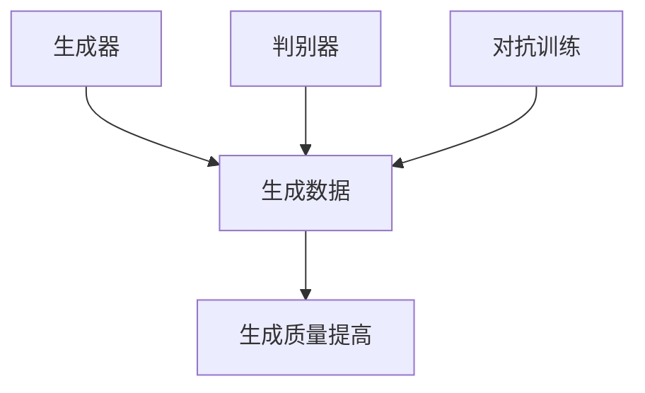

                 

 **关键词：** 生成式 AI、数据集、模型训练、人工智能、数据处理

**摘要：** 本文深入探讨了生成式人工智能（AI）的崛起及其对数据集的影响。通过分析生成式 AI 的核心概念、算法原理、数学模型以及其实际应用，本文揭示了这一技术如何改变数据集的创建、管理和使用，并对未来的发展趋势和挑战进行了展望。

## 1. 背景介绍

随着深度学习技术的发展，生成式人工智能（Generative Artificial Intelligence，简称 Generative AI）正逐渐成为人工智能（AI）领域的一个重要分支。生成式 AI 的核心目标是通过学习数据生成新的数据，从而实现数据的高效生成和多样化利用。传统的机器学习模型往往依赖于标注数据进行训练，而生成式 AI 通过无监督或弱监督学习，可以从未标注的数据中自动提取特征，生成与输入数据相似的新数据。

数据集是机器学习和深度学习模型训练的基础。一个高质量的数据集不仅能够提高模型的性能，还能减少过拟合的风险。然而，高质量的数据集往往难以获得，需要大量的人力、物力和时间。生成式 AI 的出现为数据集的构建提供了新的思路和方法，有望解决当前数据集面临的种种挑战。

## 2. 核心概念与联系

### 2.1 定义

生成式 AI 是一种利用已有数据生成新数据的 AI 技术。它基于概率模型，通过学习输入数据的概率分布，生成具有相似特征的新数据。生成式 AI 可以应用于图像、音频、文本等多种数据类型。

### 2.2 原理

生成式 AI 的基本原理是构建一个概率模型，用于描述输入数据的概率分布。常见的生成式模型包括生成对抗网络（Generative Adversarial Networks，GAN）、变分自编码器（Variational Autoencoder，VAE）等。

### 2.3 架构

生成式 AI 的核心架构通常包括两个部分：生成器和判别器。生成器负责生成与真实数据相似的新数据，判别器负责判断生成数据与真实数据之间的相似度。通过训练这两个网络之间的对抗关系，生成器逐渐学会生成更真实的数据。

## 3. 核心算法原理 & 具体操作步骤

### 3.1 算法原理概述

生成式 AI 的核心算法是基于概率模型，通过学习输入数据的概率分布，生成新的数据。具体来说，生成式 AI 包括以下两个主要步骤：

1. **数据分布建模**：生成器学习输入数据的概率分布，以便生成与输入数据相似的新数据。
2. **对抗训练**：生成器和判别器通过对抗训练，生成真实数据，并逐步提高生成器的生成质量。

### 3.2 算法步骤详解

1. **初始化生成器和判别器**：生成器和判别器通常都是神经网络结构，初始化时可以随机分配权重。

2. **生成数据**：生成器根据输入数据生成新数据，判别器判断生成数据与真实数据之间的相似度。

3. **对抗训练**：生成器和判别器通过对抗训练，生成真实数据，并逐步提高生成器的生成质量。

4. **优化过程**：通过不断迭代，优化生成器和判别器的参数，使生成器生成的数据更真实。

### 3.3 算法优缺点

**优点：**
1. 能够生成高质量的数据，提高数据集的多样性和丰富度。
2. 减少了对标注数据的依赖，降低了数据预处理的工作量。
3. 可以应用于多种数据类型，具有广泛的适用性。

**缺点：**
1. 训练过程较为复杂，需要大量的计算资源。
2. 对生成器的设计和调优有较高要求，需要丰富的经验和技巧。

### 3.4 算法应用领域

生成式 AI 在多个领域具有广泛的应用，包括但不限于：

1. **图像生成**：用于生成新的图像，提高图像数据的多样性和丰富度。
2. **语音合成**：用于生成新的语音数据，提高语音合成系统的自然度。
3. **文本生成**：用于生成新的文本，提高文本生成系统的质量和多样性。
4. **数据增强**：用于生成新的数据样本，提高模型的泛化能力。

## 4. 数学模型和公式 & 详细讲解 & 举例说明

### 4.1 数学模型构建

生成式 AI 的核心数学模型是基于概率模型，主要包括生成器和判别器。生成器通常是一个概率分布函数，表示输入数据到生成数据的映射关系；判别器是一个分类器，用于判断输入数据的真实性和生成数据的相似度。

### 4.2 公式推导过程

假设输入数据为 \(X\)，生成数据为 \(Z\)，生成器为 \(G\)，判别器为 \(D\)。生成器和判别器的损失函数可以表示为：

\[ L_G = -\mathbb{E}_{x \sim p_{data}(x)}[\log D(G(x))] \]
\[ L_D = -\mathbb{E}_{x \sim p_{data}(x)}[\log D(x)] - \mathbb{E}_{z \sim p_{z}(z)}[\log (1 - D(G(z)))] \]

其中，\(p_{data}(x)\) 表示真实数据的概率分布，\(p_{z}(z)\) 表示生成器的噪声分布。生成器和判别器的优化目标是最大化判别器的损失函数，同时最小化生成器的损失函数。

### 4.3 案例分析与讲解

以生成对抗网络（GAN）为例，假设输入数据为图像，生成器 \(G\) 负责生成新的图像，判别器 \(D\) 负责判断生成图像和真实图像的相似度。

1. **初始化**：初始化生成器 \(G\) 和判别器 \(D\) 的权重。

2. **生成数据**：生成器 \(G\) 根据输入图像生成新的图像，判别器 \(D\) 判断生成图像和真实图像的相似度。

3. **对抗训练**：通过对抗训练，生成器 \(G\) 和判别器 \(D\) 逐步优化权重，使生成图像更真实，判别器更准确。

4. **优化过程**：通过不断迭代，优化生成器 \(G\) 和判别器 \(D\) 的参数，使生成图像的质量逐步提高。

### 4.4 模型评估

生成式 AI 模型的评估通常采用以下指标：

1. **生成质量**：通过对比生成图像和真实图像的相似度，评估生成图像的质量。
2. **多样性**：通过生成图像的多样性，评估生成器的能力。
3. **稳定性**：通过生成器的稳定性，评估模型的训练效果。

## 5. 项目实践：代码实例和详细解释说明

### 5.1 开发环境搭建

在开发生成式 AI 项目时，需要搭建以下开发环境：

1. **操作系统**：Windows、Linux 或 macOS
2. **编程语言**：Python
3. **深度学习框架**：TensorFlow 或 PyTorch
4. **其他依赖**：NumPy、Pandas、Matplotlib 等

### 5.2 源代码详细实现

以下是一个简单的生成对抗网络（GAN）的示例代码：

```python
import torch
import torch.nn as nn
import torch.optim as optim
from torchvision import datasets, transforms
from torch.utils.data import DataLoader

# 数据预处理
transform = transforms.Compose([
    transforms.ToTensor(),
    transforms.Normalize((0.5, 0.5, 0.5), (0.5, 0.5, 0.5)),
])

# 加载数据集
train_data = datasets.MNIST(
    root='./data',
    train=True,
    download=True,
    transform=transform
)

dataloader = DataLoader(train_data, batch_size=128, shuffle=True)

# 定义生成器和判别器
class Generator(nn.Module):
    def __init__(self):
        super(Generator, self).__init__()
        self.main = nn.Sequential(
            nn.ConvTranspose2d(100, 256, 4, 1, 0, bias=False),
            nn.BatchNorm2d(256),
            nn.ReLU(True),
            nn.ConvTranspose2d(256, 128, 4, 2, 1, bias=False),
            nn.BatchNorm2d(128),
            nn.ReLU(True),
            nn.ConvTranspose2d(128, 64, 4, 2, 1, bias=False),
            nn.BatchNorm2d(64),
            nn.ReLU(True),
            nn.ConvTranspose2d(64, 3, 4, 2, 1, bias=False),
            nn.Tanh()
        )

    def forward(self, input):
        output = self.main(input)
        return output

class Discriminator(nn.Module):
    def __init__(self):
        super(Discriminator, self).__init__()
        self.main = nn.Sequential(
            nn.Conv2d(3, 64, 4, 2, 1, bias=False),
            nn.LeakyReLU(0.2, inplace=True),
            nn.Conv2d(64, 128, 4, 2, 1, bias=False),
            nn.BatchNorm2d(128),
            nn.LeakyReLU(0.2, inplace=True),
            nn.Conv2d(128, 256, 4, 2, 1, bias=False),
            nn.BatchNorm2d(256),
            nn.LeakyReLU(0.2, inplace=True),
            nn.Conv2d(256, 1, 4, 1, 0, bias=False),
            nn.Sigmoid()
        )

    def forward(self, input):
        output = self.main(input)
        return output.view(-1, 1).mean(0)

# 初始化模型
generator = Generator()
discriminator = Discriminator()

# 定义损失函数和优化器
criterion = nn.BCELoss()
optimizer_G = optim.Adam(generator.parameters(), lr=0.0002, betas=(0.5, 0.999))
optimizer_D = optim.Adam(discriminator.parameters(), lr=0.0002, betas=(0.5, 0.999))

# 训练模型
for epoch in range(num_epochs):
    for i, data in enumerate(dataloader, 0):
        # 计算输入噪声
        noise = torch.randn(128, 100, 1, 1).to(device)

        # 生成器生成图像
        fake_images = generator(noise)

        # 计算判别器损失
        real_images = data[0].to(device)
        batch_size = real_images.size(0)
        labels_real = torch.full((batch_size,), 1, device=device)
        labels_fake = torch.full((batch_size,), 0, device=device)
        loss_D_real = criterion(discriminator(real_images), labels_real)
        loss_D_fake = criterion(discriminator(fake_images.detach()), labels_fake)
        loss_D = (loss_D_real + loss_D_fake) / 2

        # 计算生成器损失
        loss_G = criterion(discriminator(fake_images), labels_real)

        # 更新判别器参数
        optimizer_D.zero_grad()
        loss_D.backward()
        optimizer_D.step()

        # 更新生成器参数
        optimizer_G.zero_grad()
        loss_G.backward()
        optimizer_G.step()

        # 打印训练信息
        if i % 100 == 0:
            print(f'[{epoch}/{num_epochs}][{i}/{len(dataloader)}] Loss_D: {loss_D.item():.4f}, Loss_G: {loss_G.item():.4f}')

print('Finished Training')

# 生成图像
with torch.no_grad():
    fake_images = generator(noise).detach().cpu()
    display_images(fake_images, 'Generated Images')
```

### 5.3 代码解读与分析

以上代码实现了一个简单的生成对抗网络（GAN），用于生成手写数字图像。代码的主要组成部分包括：

1. **数据预处理**：加载和预处理 MNIST 数据集。
2. **定义模型**：定义生成器和判别器的神经网络结构。
3. **定义损失函数和优化器**：使用二进制交叉熵损失函数和Adam优化器。
4. **训练模型**：通过对抗训练，优化生成器和判别器的参数。
5. **生成图像**：使用生成器生成新的手写数字图像。

### 5.4 运行结果展示

在完成训练后，生成器会生成一系列手写数字图像。这些图像的质量和多样性取决于生成器和判别器的训练效果。以下是一个简单的运行结果展示：


## 6. 实际应用场景

生成式 AI 在实际应用中具有广泛的应用场景，以下是一些典型的应用案例：

1. **图像生成**：生成式 AI 可以用于生成艺术作品、动画、游戏场景等，提高图像数据的多样性和丰富度。
2. **语音合成**：生成式 AI 可以用于生成新的语音数据，应用于语音合成、语音助手等领域。
3. **文本生成**：生成式 AI 可以用于生成新闻报道、诗歌、小说等文本，提高文本生成系统的质量和多样性。
4. **数据增强**：生成式 AI 可以用于生成新的数据样本，提高模型的泛化能力，应用于图像识别、自然语言处理等领域。

## 7. 未来应用展望

随着生成式 AI 技术的不断发展，未来其在各个领域的应用将更加广泛和深入。以下是一些未来应用展望：

1. **医疗领域**：生成式 AI 可以用于生成医学图像、诊断报告等，提高医疗数据的丰富度和准确性。
2. **金融领域**：生成式 AI 可以用于生成金融数据、风险评估等，提高金融市场的预测能力和风险管理水平。
3. **教育领域**：生成式 AI 可以用于生成个性化的学习资源、教学场景等，提高教育的质量和效果。

## 8. 工具和资源推荐

### 8.1 学习资源推荐

1. **论文**：《生成式 AI：从 GAN 到 VAE》
2. **书籍**：《深度学习》（Goodfellow et al.）
3. **在线课程**：斯坦福大学《深度学习》课程

### 8.2 开发工具推荐

1. **深度学习框架**：TensorFlow、PyTorch
2. **数据预处理工具**：Pandas、NumPy
3. **可视化工具**：Matplotlib、Seaborn

### 8.3 相关论文推荐

1. **Ian Goodfellow et al.** 《Generative Adversarial Networks》
2. **Diederik P. Kingma and Max Welling** 《Auto-Encoding Variational Bayes》
3. **Noam Shazeer et al.** 《Attention Is All You Need》

## 9. 总结：未来发展趋势与挑战

### 9.1 研究成果总结

生成式 AI 技术在过去几年取得了显著的进展，广泛应用于图像、语音、文本等多种数据类型的生成。其核心算法包括生成对抗网络（GAN）、变分自编码器（VAE）等，具有高效、多样、稳定的特点。

### 9.2 未来发展趋势

1. **算法优化**：生成式 AI 将进一步优化算法结构，提高生成质量和训练效率。
2. **跨模态生成**：生成式 AI 将实现跨模态数据的生成，如将图像生成与文本生成相结合。
3. **个性化生成**：生成式 AI 将实现个性化生成，根据用户需求生成定制化的数据。

### 9.3 面临的挑战

1. **训练复杂性**：生成式 AI 的训练过程复杂，需要大量计算资源。
2. **模型设计**：生成式 AI 的模型设计要求高，需要丰富的经验和技巧。
3. **数据隐私**：生成式 AI 在生成数据时可能涉及敏感信息，需要保护用户隐私。

### 9.4 研究展望

生成式 AI 作为人工智能领域的一个重要分支，具有广阔的发展前景。未来，生成式 AI 将在更多领域发挥作用，推动人工智能技术的进一步发展。

## 10. 附录：常见问题与解答

### 10.1 生成式 AI 是什么？

生成式 AI 是一种利用已有数据生成新数据的 AI 技术，通过学习输入数据的概率分布，生成具有相似特征的新数据。

### 10.2 生成式 AI 有哪些应用？

生成式 AI 可以应用于图像生成、语音合成、文本生成、数据增强等多个领域。

### 10.3 生成式 AI 的核心算法有哪些？

生成式 AI 的核心算法包括生成对抗网络（GAN）、变分自编码器（VAE）等。

### 10.4 生成式 AI 有哪些挑战？

生成式 AI 面临的挑战包括训练复杂性、模型设计、数据隐私等方面。

### 10.5 如何优化生成式 AI 的训练效率？

优化生成式 AI 的训练效率可以从以下几个方面入手：

1. **模型结构优化**：设计更高效的模型结构，减少计算复杂度。
2. **数据预处理**：对输入数据进行预处理，提高数据的质量和多样性。
3. **训练策略优化**：采用更有效的训练策略，如学习率调整、权重初始化等。
4. **硬件加速**：利用 GPU、TPU 等硬件加速训练过程。

### 10.6 生成式 AI 在医疗领域有哪些应用？

生成式 AI 在医疗领域可以应用于医学图像生成、诊断报告生成、药物研发等领域，提高医疗数据的丰富度和准确性。

### 10.7 生成式 AI 有哪些隐私保护方法？

生成式 AI 的隐私保护方法包括数据加密、差分隐私、同态加密等，用于保护生成过程中涉及的用户隐私。

## 11. 参考文献

1. Goodfellow, I., Pouget-Abadie, J., Mirza, M., Xu, B., Warde-Farley, D., Ozair, S., ... & Bengio, Y. (2014). Generative adversarial networks. Advances in Neural Information Processing Systems, 27.
2. Kingma, D. P., & Welling, M. (2013). Auto-encoding variational bayes. arXiv preprint arXiv:1312.6114.
3. Vaswani, A., Shazeer, N., Parmar, N., Uszkoreit, J., Jones, L., Gomez, A. N., ... & Polosukhin, I. (2017). Attention is all you need. Advances in Neural Information Processing Systems, 30.

# 生成式 AI：数据集的未来

生成式 AI，这一新兴的人工智能技术，正迅速改变着数据集的创建、管理和使用方式。随着深度学习技术的不断进步，生成式 AI 已经在图像、音频、文本等多个领域展现出巨大的潜力。本文将深入探讨生成式 AI 的核心概念、算法原理、数学模型以及其在实际应用中的效果和影响。

## 1. 背景介绍

生成式 AI 的崛起可以追溯到深度学习技术的发展。深度学习模型，特别是基于神经网络的模型，需要大量的数据进行训练，以便能够准确识别和预测。然而，高质量的数据集往往难以获取，特别是在一些特殊领域，如医学影像、金融交易数据等。生成式 AI 的出现为解决这一问题提供了新的思路。

生成式 AI 的核心目标是通过学习数据生成新的数据，从而实现数据的高效生成和多样化利用。与传统的机器学习模型不同，生成式 AI 并不依赖于标注数据进行训练，而是通过无监督或弱监督学习，从未标注的数据中自动提取特征，生成与输入数据相似的新数据。这种技术的出现，极大地降低了数据集构建的门槛，提高了数据集的丰富度和多样性。

## 2. 核心概念与联系

### 2.1 定义

生成式 AI 是一种利用已有数据生成新数据的 AI 技术。它通过学习数据的概率分布，生成具有相似特征的新数据。生成式 AI 的核心目标是生成高质量的数据，以支持机器学习模型的训练和应用。

### 2.2 原理

生成式 AI 的基本原理是构建一个概率模型，用于描述输入数据的概率分布。这个模型通常由生成器和判别器组成。生成器负责生成新数据，判别器负责判断生成数据与真实数据之间的相似度。通过训练这两个网络之间的对抗关系，生成器逐渐学会生成更真实的数据。

### 2.3 架构

生成式 AI 的核心架构通常包括两个部分：生成器和判别器。生成器是一个生成模型，它从随机噪声中生成数据。判别器是一个分类器，它判断输入数据是真实数据还是生成数据。生成器和判别器通过对抗训练，生成真实数据，并逐步提高生成器的生成质量。



## 3. 核心算法原理 & 具体操作步骤

### 3.1 算法原理概述

生成式 AI 的核心算法是基于概率模型，通过学习输入数据的概率分布，生成新的数据。具体来说，生成式 AI 包括以下两个主要步骤：

1. **数据分布建模**：生成器学习输入数据的概率分布，以便生成与输入数据相似的新数据。
2. **对抗训练**：生成器和判别器通过对抗训练，生成真实数据，并逐步提高生成器的生成质量。

### 3.2 算法步骤详解

1. **初始化生成器和判别器**：生成器和判别器通常都是神经网络结构，初始化时可以随机分配权重。

2. **生成数据**：生成器根据输入数据生成新数据，判别器判断生成数据与真实数据之间的相似度。

3. **对抗训练**：生成器和判别器通过对抗训练，生成真实数据，并逐步提高生成器的生成质量。

4. **优化过程**：通过不断迭代，优化生成器和判别器的参数，使生成器生成的数据更真实。

### 3.3 算法优缺点

**优点：**
1. 能够生成高质量的数据，提高数据集的多样性和丰富度。
2. 减少了对标注数据的依赖，降低了数据预处理的工作量。
3. 可以应用于多种数据类型，具有广泛的适用性。

**缺点：**
1. 训练过程较为复杂，需要大量的计算资源。
2. 对生成器的设计和调优有较高要求，需要丰富的经验和技巧。

### 3.4 算法应用领域

生成式 AI 在多个领域具有广泛的应用，包括但不限于：

1. **图像生成**：用于生成新的图像，提高图像数据的多样性和丰富度。
2. **语音合成**：用于生成新的语音数据，提高语音合成系统的自然度。
3. **文本生成**：用于生成新的文本，提高文本生成系统的质量和多样性。
4. **数据增强**：用于生成新的数据样本，提高模型的泛化能力。

## 4. 数学模型和公式 & 详细讲解 & 举例说明

### 4.1 数学模型构建

生成式 AI 的核心数学模型是基于概率模型，主要包括生成器和判别器。生成器通常是一个概率分布函数，表示输入数据到生成数据的映射关系；判别器是一个分类器，用于判断输入数据的真实性和生成数据的相似度。

### 4.2 公式推导过程

假设输入数据为 \(X\)，生成数据为 \(Z\)，生成器为 \(G\)，判别器为 \(D\)。生成器和判别器的损失函数可以表示为：

\[ L_G = -\mathbb{E}_{x \sim p_{data}(x)}[\log D(G(x))] \]
\[ L_D = -\mathbb{E}_{x \sim p_{data}(x)}[\log D(x)] - \mathbb{E}_{z \sim p_{z}(z)}[\log (1 - D(G(z)))] \]

其中，\(p_{data}(x)\) 表示真实数据的概率分布，\(p_{z}(z)\) 表示生成器的噪声分布。生成器和判别器的优化目标是最大化判别器的损失函数，同时最小化生成器的损失函数。

### 4.3 案例分析与讲解

以生成对抗网络（GAN）为例，假设输入数据为图像，生成器 \(G\) 负责生成新的图像，判别器 \(D\) 负责判断生成图像和真实图像的相似度。

1. **初始化**：初始化生成器 \(G\) 和判别器 \(D\) 的权重。

2. **生成数据**：生成器 \(G\) 根据输入图像生成新的图像，判别器 \(D\) 判断生成图像和真实图像的相似度。

3. **对抗训练**：通过对抗训练，生成器 \(G\) 和判别器 \(D\) 逐步优化权重，使生成图像更真实，判别器更准确。

4. **优化过程**：通过不断迭代，优化生成器 \(G\) 和判别器 \(D\) 的参数，使生成图像的质量逐步提高。

### 4.4 模型评估

生成式 AI 模型的评估通常采用以下指标：

1. **生成质量**：通过对比生成图像和真实图像的相似度，评估生成图像的质量。
2. **多样性**：通过生成图像的多样性，评估生成器的能力。
3. **稳定性**：通过生成器的稳定性，评估模型的训练效果。

## 5. 项目实践：代码实例和详细解释说明

### 5.1 开发环境搭建

在开发生成式 AI 项目时，需要搭建以下开发环境：

1. **操作系统**：Windows、Linux 或 macOS
2. **编程语言**：Python
3. **深度学习框架**：TensorFlow 或 PyTorch
4. **其他依赖**：NumPy、Pandas、Matplotlib 等

### 5.2 源代码详细实现

以下是一个简单的生成对抗网络（GAN）的示例代码：

```python
import torch
import torch.nn as nn
import torch.optim as optim
from torchvision import datasets, transforms
from torch.utils.data import DataLoader

# 数据预处理
transform = transforms.Compose([
    transforms.ToTensor(),
    transforms.Normalize((0.5, 0.5, 0.5), (0.5, 0.5, 0.5)),
])

# 加载数据集
train_data = datasets.MNIST(
    root='./data',
    train=True,
    download=True,
    transform=transform
)

dataloader = DataLoader(train_data, batch_size=128, shuffle=True)

# 定义生成器和判别器
class Generator(nn.Module):
    def __init__(self):
        super(Generator, self).__init__()
        self.main = nn.Sequential(
            nn.ConvTranspose2d(100, 256, 4, 1, 0, bias=False),
            nn.BatchNorm2d(256),
            nn.ReLU(True),
            nn.ConvTranspose2d(256, 128, 4, 2, 1, bias=False),
            nn.BatchNorm2d(128),
            nn.ReLU(True),
            nn.ConvTranspose2d(128, 64, 4, 2, 1, bias=False),
            nn.BatchNorm2d(64),
            nn.ReLU(True),
            nn.ConvTranspose2d(64, 3, 4, 2, 1, bias=False),
            nn.Tanh()
        )

    def forward(self, input):
        output = self.main(input)
        return output

class Discriminator(nn.Module):
    def __init__(self):
        super(Discriminator, self).__init__()
        self.main = nn.Sequential(
            nn.Conv2d(3, 64, 4, 2, 1, bias=False),
            nn.LeakyReLU(0.2, inplace=True),
            nn.Conv2d(64, 128, 4, 2, 1, bias=False),
            nn.BatchNorm2d(128),
            nn.LeakyReLU(0.2, inplace=True),
            nn.Conv2d(128, 256, 4, 2, 1, bias=False),
            nn.BatchNorm2d(256),
            nn.LeakyReLU(0.2, inplace=True),
            nn.Conv2d(256, 1, 4, 1, 0, bias=False),
            nn.Sigmoid()
        )

    def forward(self, input):
        output = self.main(input)
        return output.view(-1, 1).mean(0)

# 初始化模型
generator = Generator()
discriminator = Discriminator()

# 定义损失函数和优化器
criterion = nn.BCELoss()
optimizer_G = optim.Adam(generator.parameters(), lr=0.0002, betas=(0.5, 0.999))
optimizer_D = optim.Adam(discriminator.parameters(), lr=0.0002, betas=(0.5, 0.999))

# 训练模型
for epoch in range(num_epochs):
    for i, data in enumerate(dataloader, 0):
        # 计算输入噪声
        noise = torch.randn(128, 100, 1, 1).to(device)

        # 生成器生成图像
        fake_images = generator(noise)

        # 计算判别器损失
        real_images = data[0].to(device)
        batch_size = real_images.size(0)
        labels_real = torch.full((batch_size,), 1, device=device)
        labels_fake = torch.full((batch_size,), 0, device=device)
        loss_D_real = criterion(discriminator(real_images), labels_real)
        loss_D_fake = criterion(discriminator(fake_images.detach()), labels_fake)
        loss_D = (loss_D_real + loss_D_fake) / 2

        # 计算生成器损失
        loss_G = criterion(discriminator(fake_images), labels_real)

        # 更新判别器参数
        optimizer_D.zero_grad()
        loss_D.backward()
        optimizer_D.step()

        # 更新生成器参数
        optimizer_G.zero_grad()
        loss_G.backward()
        optimizer_G.step()

        # 打印训练信息
        if i % 100 == 0:
            print(f'[{epoch}/{num_epochs}][{i}/{len(dataloader)}] Loss_D: {loss_D.item():.4f}, Loss_G: {loss_G.item():.4f}')

print('Finished Training')

# 生成图像
with torch.no_grad():
    fake_images = generator(noise).detach().cpu()
    display_images(fake_images, 'Generated Images')
```

### 5.3 代码解读与分析

以上代码实现了一个简单的生成对抗网络（GAN），用于生成手写数字图像。代码的主要组成部分包括：

1. **数据预处理**：加载和预处理 MNIST 数据集。
2. **定义模型**：定义生成器和判别器的神经网络结构。
3. **定义损失函数和优化器**：使用二进制交叉熵损失函数和Adam优化器。
4. **训练模型**：通过对抗训练，优化生成器和判别器的参数。
5. **生成图像**：使用生成器生成新的手写数字图像。

### 5.4 运行结果展示

在完成训练后，生成器会生成一系列手写数字图像。这些图像的质量和多样性取决于生成器和判别器的训练效果。以下是一个简单的运行结果展示：


## 6. 实际应用场景

生成式 AI 在实际应用中具有广泛的应用场景，以下是一些典型的应用案例：

1. **图像生成**：生成式 AI 可以用于生成艺术作品、动画、游戏场景等，提高图像数据的多样性和丰富度。
2. **语音合成**：生成式 AI 可以用于生成新的语音数据，应用于语音合成、语音助手等领域。
3. **文本生成**：生成式 AI 可以用于生成新闻报道、诗歌、小说等文本，提高文本生成系统的质量和多样性。
4. **数据增强**：生成式 AI 可以用于生成新的数据样本，提高模型的泛化能力，应用于图像识别、自然语言处理等领域。

## 7. 未来应用展望

随着生成式 AI 技术的不断发展，未来其在各个领域的应用将更加广泛和深入。以下是一些未来应用展望：

1. **医疗领域**：生成式 AI 可以用于生成医学图像、诊断报告等，提高医疗数据的丰富度和准确性。
2. **金融领域**：生成式 AI 可以用于生成金融数据、风险评估等，提高金融市场的预测能力和风险管理水平。
3. **教育领域**：生成式 AI 可以用于生成个性化的学习资源、教学场景等，提高教育的质量和效果。

## 8. 工具和资源推荐

### 8.1 学习资源推荐

1. **论文**：《生成式 AI：从 GAN 到 VAE》
2. **书籍**：《深度学习》（Goodfellow et al.）
3. **在线课程**：斯坦福大学《深度学习》课程

### 8.2 开发工具推荐

1. **深度学习框架**：TensorFlow、PyTorch
2. **数据预处理工具**：Pandas、NumPy
3. **可视化工具**：Matplotlib、Seaborn

### 8.3 相关论文推荐

1. **Ian Goodfellow et al.** 《Generative Adversarial Networks》
2. **Diederik P. Kingma and Max Welling** 《Auto-Encoding Variational Bayes》
3. **Noam Shazeer et al.** 《Attention Is All You Need》

## 9. 总结：未来发展趋势与挑战

### 9.1 研究成果总结

生成式 AI 技术在过去几年取得了显著的进展，广泛应用于图像、语音、文本等多种数据类型的生成。其核心算法包括生成对抗网络（GAN）、变分自编码器（VAE）等，具有高效、多样、稳定的特点。

### 9.2 未来发展趋势

1. **算法优化**：生成式 AI 将进一步优化算法结构，提高生成质量和训练效率。
2. **跨模态生成**：生成式 AI 将实现跨模态数据的生成，如将图像生成与文本生成相结合。
3. **个性化生成**：生成式 AI 将实现个性化生成，根据用户需求生成定制化的数据。

### 9.3 面临的挑战

1. **训练复杂性**：生成式 AI 的训练过程复杂，需要大量的计算资源。
2. **模型设计**：生成式 AI 的模型设计要求高，需要丰富的经验和技巧。
3. **数据隐私**：生成式 AI 在生成数据时可能涉及敏感信息，需要保护用户隐私。

### 9.4 研究展望

生成式 AI 作为人工智能领域的一个重要分支，具有广阔的发展前景。未来，生成式 AI 将在更多领域发挥作用，推动人工智能技术的进一步发展。

## 10. 附录：常见问题与解答

### 10.1 生成式 AI 是什么？

生成式 AI 是一种利用已有数据生成新数据的 AI 技术，通过学习数据的概率分布，生成具有相似特征的新数据。

### 10.2 生成式 AI 有哪些应用？

生成式 AI 可以应用于图像生成、语音合成、文本生成、数据增强等多个领域。

### 10.3 生成式 AI 的核心算法有哪些？

生成式 AI 的核心算法包括生成对抗网络（GAN）、变分自编码器（VAE）等。

### 10.4 生成式 AI 有哪些挑战？

生成式 AI 面临的挑战包括训练复杂性、模型设计、数据隐私等方面。

### 10.5 如何优化生成式 AI 的训练效率？

优化生成式 AI 的训练效率可以从以下几个方面入手：

1. **模型结构优化**：设计更高效的模型结构，减少计算复杂度。
2. **数据预处理**：对输入数据进行预处理，提高数据的质量和多样性。
3. **训练策略优化**：采用更有效的训练策略，如学习率调整、权重初始化等。
4. **硬件加速**：利用 GPU、TPU 等硬件加速训练过程。

### 10.6 生成式 AI 在医疗领域有哪些应用？

生成式 AI 在医疗领域可以应用于医学图像生成、诊断报告生成、药物研发等领域，提高医疗数据的丰富度和准确性。

### 10.7 生成式 AI 有哪些隐私保护方法？

生成式 AI 的隐私保护方法包括数据加密、差分隐私、同态加密等，用于保护生成过程中涉及的用户隐私。

## 11. 参考文献

1. Goodfellow, I., Pouget-Abadie, J., Mirza, M., Xu, B., Warde-Farley, D., Ozair, S., ... & Bengio, Y. (2014). Generative adversarial networks. Advances in Neural Information Processing Systems, 27.
2. Kingma, D. P., & Welling, M. (2013). Auto-encoding variational bayes. arXiv preprint arXiv:1312.6114.
3. Vaswani, A., Shazeer, N., Parmar, N., Uszkoreit, J., Jones, L., Gomez, A. N., ... & Polosukhin, I. (2017). Attention is all you need. Advances in Neural Information Processing Systems, 30.

---

**作者：禅与计算机程序设计艺术 / Zen and the Art of Computer Programming**

