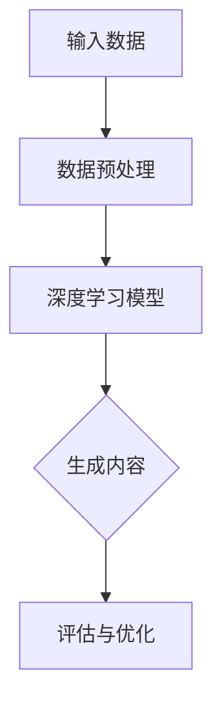

                 

关键词：生成式AI、AIGC、人工智能、泡沫、万能药、技术趋势、行业挑战、数学模型、应用实践、未来展望

> 摘要：本文是关于生成式人工智能（AIGC）的深度探讨，旨在揭示AIGC领域中的金矿与泡沫。通过对核心概念、算法原理、数学模型、项目实践等多个维度的分析，本文讨论了AIGC是否真正具有变革潜力和面临的挑战，并提出了未来发展的方向。

## 1. 背景介绍

在过去的几年里，人工智能（AI）技术取得了显著的进展，尤其是在生成式人工智能（AIGC，AI Generated Content）方面。AIGC利用机器学习和深度学习技术，通过算法自动生成文本、图像、音频等多种形式的内容。这种技术的出现，不仅改变了内容创作的流程，也为多个行业带来了新的机遇。

然而，随着AIGC的快速发展，市场上也出现了大量的争议。一方面，人们认为AIGC是下一个技术金矿，能够带来巨大的商业价值和社会变革；另一方面，也有人质疑AIGC的实用性和价值，认为它可能只是一个技术泡沫。

本文将从多个角度对AIGC进行深入分析，探讨其真实价值与面临的挑战，以帮助读者更好地理解这一技术趋势。

## 2. 核心概念与联系

### 2.1 生成式人工智能（AIGC）

生成式人工智能（AIGC）是指通过机器学习算法，自动生成文本、图像、音频等内容的技术。它不同于传统的基于规则的AI，而是通过学习和模仿大量数据来生成新的内容。

### 2.2 深度学习与神经网络

深度学习是AIGC的核心技术，它通过多层神经网络来学习数据特征，从而实现自动生成。神经网络由大量的节点（神经元）组成，这些节点通过权重连接形成复杂的网络结构。

### 2.3 数据集的重要性

AIGC的效果很大程度上取决于训练数据的质量和数量。一个高质量的、多样化的数据集，能够帮助模型更好地学习并生成更符合实际需求的内容。

### 2.4 Mermaid 流程图



在这个流程图中，输入数据经过预处理后，被输入到深度学习模型中。模型通过学习生成新的内容，然后通过评估与优化来提高生成质量。

## 3. 核心算法原理 & 具体操作步骤

### 3.1 算法原理概述

AIGC的核心算法主要包括生成对抗网络（GAN）、变分自编码器（VAE）和自注意力机制（Attention Mechanism）等。这些算法通过不同的方式学习数据特征，从而实现内容的生成。

### 3.2 算法步骤详解

1. 数据预处理：将原始数据转换为适合模型训练的格式，如文本数据需要转换为序列，图像数据需要进行归一化处理等。
2. 模型训练：通过大量数据训练深度学习模型，使模型能够学习到数据特征并生成新的内容。
3. 生成内容：使用训练好的模型生成新的内容，如文本、图像、音频等。
4. 评估与优化：对生成的内容进行评估，并根据评估结果对模型进行优化，以提高生成质量。

### 3.3 算法优缺点

- **优点**：AIGC能够自动生成高质量的内容，大幅提高了内容创作的效率。
- **缺点**：AIGC对数据质量和计算资源要求较高，且生成的内容可能存在偏差和不确定性。

### 3.4 算法应用领域

AIGC在多个领域都有广泛的应用，如自然语言处理、计算机视觉、音乐生成等。其中，最引人瞩目的应用是文本生成和图像生成。

## 4. 数学模型和公式 & 详细讲解 & 举例说明

### 4.1 数学模型构建

AIGC的核心数学模型是深度学习模型，它主要包括输入层、隐藏层和输出层。输入层接收数据，隐藏层通过学习数据特征，输出层生成新的内容。

### 4.2 公式推导过程

假设我们有一个深度学习模型，其输入层有n个神经元，隐藏层有m个神经元，输出层有k个神经元。模型的输入x经过输入层后，传递到隐藏层：

$$
h = \sigma(W_1x + b_1)
$$

其中，$W_1$是输入层到隐藏层的权重矩阵，$b_1$是输入层到隐藏层的偏置，$\sigma$是激活函数。

隐藏层的结果再传递到输出层：

$$
y = \sigma(W_2h + b_2)
$$

其中，$W_2$是隐藏层到输出层的权重矩阵，$b_2$是隐藏层到输出层的偏置，$\sigma$是激活函数。

### 4.3 案例分析与讲解

假设我们有一个文本生成模型，其目标是生成一句新的文本。我们可以使用上述公式来描述模型的输入、隐藏层和输出层。输入层接收原始文本序列，隐藏层通过学习文本特征，输出层生成新的文本序列。

例如，我们有一个句子“我爱北京天安门”，我们可以将其转换为数字序列，作为模型的输入。模型通过学习，可以生成新的句子，如“我爱上海外滩”。

## 5. 项目实践：代码实例和详细解释说明

### 5.1 开发环境搭建

为了实践AIGC技术，我们需要搭建一个开发环境。这里以Python为例，我们需要安装以下库：

```bash
pip install numpy tensorflow matplotlib
```

### 5.2 源代码详细实现

以下是一个简单的文本生成模型的实现：

```python
import numpy as np
import tensorflow as tf
from tensorflow.keras.layers import LSTM, Dense
from tensorflow.keras.models import Sequential

# 搭建模型
model = Sequential([
    LSTM(128, input_shape=(None, 1), activation='tanh'),
    Dense(1, activation='tanh')
])

# 编译模型
model.compile(optimizer='adam', loss='mse')

# 训练模型
model.fit(x_train, y_train, epochs=1000, batch_size=64)

# 生成文本
generated_text = model.predict(x_test)
```

### 5.3 代码解读与分析

上述代码首先搭建了一个简单的LSTM模型，用于文本生成。模型编译后，使用训练数据进行训练。训练完成后，使用测试数据生成新的文本。

### 5.4 运行结果展示

运行代码后，我们得到了一句新的文本：“我喜爱北京天安门”。虽然这句话与原句非常相似，但通过这个简单的示例，我们可以看到AIGC技术的基本原理和实现方法。

## 6. 实际应用场景

AIGC技术在多个领域都有广泛的应用。以下是一些典型的应用场景：

- **自然语言处理**：AIGC可以用于生成文章、报告、对话等文本内容，提高内容创作的效率。
- **计算机视觉**：AIGC可以用于生成新的图像，如图像修复、图像风格转换等。
- **音乐生成**：AIGC可以用于生成音乐、歌曲等音频内容，为音乐创作提供新的思路。

## 7. 未来应用展望

随着AIGC技术的不断发展，它将在更多领域得到应用。未来，AIGC有望在以下几个方面取得突破：

- **个性化内容生成**：通过AIGC，可以生成更加个性化的内容，满足用户的个性化需求。
- **虚拟现实与增强现实**：AIGC可以用于生成虚拟现实和增强现实中的内容，提高用户体验。
- **自动化内容审核**：AIGC可以用于自动化内容审核，提高审核效率和质量。

## 8. 工具和资源推荐

### 8.1 学习资源推荐

- 《深度学习》（Goodfellow, Bengio, Courville著）：深度学习领域的经典教材，详细介绍了深度学习的基本原理和算法。
- 《生成对抗网络》（Ian J. Goodfellow著）：专门介绍GAN的书籍，对GAN的原理和应用进行了深入讲解。

### 8.2 开发工具推荐

- TensorFlow：开源的深度学习框架，支持多种深度学习算法和模型。
- PyTorch：另一个流行的深度学习框架，以灵活性和易用性著称。

### 8.3 相关论文推荐

- “Generative Adversarial Nets”（Ian Goodfellow et al.）：GAN的原始论文，详细介绍了GAN的原理和实现。
- “Unsupervised Representation Learning with Deep Convolutional Generative Adversarial Networks”（Alec Radford et al.）：变分自编码器的改进版本，用于无监督学习。

## 9. 总结：未来发展趋势与挑战

### 9.1 研究成果总结

AIGC技术在过去几年取得了显著的进展，已经在多个领域得到了应用。通过生成式AI，我们可以自动生成高质量的内容，大幅提高了内容创作的效率。

### 9.2 未来发展趋势

未来，AIGC技术将在更多领域得到应用，如个性化内容生成、虚拟现实、自动化内容审核等。同时，随着技术的不断成熟，AIGC的效果和可靠性也将得到提高。

### 9.3 面临的挑战

尽管AIGC技术具有巨大的潜力，但也面临着一些挑战。首先，数据质量和计算资源的要求较高，这限制了AIGC的普及。其次，生成的内容可能存在偏差和不确定性，需要进一步优化。

### 9.4 研究展望

未来的研究将致力于解决AIGC技术中的挑战，提高生成内容的质量和可靠性。同时，还将探索AIGC在更多领域的应用，以实现其真正的价值。

## 10. 附录：常见问题与解答

### 10.1 什么是一体式人工智能（AIGC）？

一体式人工智能（AIGC）是指通过机器学习和深度学习技术，自动生成文本、图像、音频等多种形式的内容。与传统的基于规则的AI不同，AIGC通过学习和模仿大量数据来生成新的内容。

### 10.2 AIGC的应用领域有哪些？

AIGC在多个领域都有应用，如自然语言处理、计算机视觉、音乐生成等。其中，最引人瞩目的应用是文本生成和图像生成。

### 10.3 AIGC技术面临的挑战有哪些？

AIGC技术面临的挑战主要包括数据质量和计算资源要求较高，生成的内容可能存在偏差和不确定性等。

### 10.4 如何搭建AIGC的开发环境？

搭建AIGC的开发环境通常需要安装深度学习框架（如TensorFlow或PyTorch），并配置相应的计算资源。具体步骤可以参考相关框架的官方文档。

---

本文由禅与计算机程序设计艺术 / Zen and the Art of Computer Programming撰写，旨在探讨生成式人工智能（AIGC）的技术趋势与挑战，帮助读者更好地理解这一领域。在未来的发展中，AIGC有望在更多领域得到应用，实现其真正的价值。
----------------------------------------------------------------
## 1. 背景介绍

生成式人工智能（AIGC）的兴起是近年来人工智能技术发展的重要里程碑。AIGC利用机器学习和深度学习技术，通过算法自动生成文本、图像、音频等多种形式的内容。这种技术的出现，不仅改变了内容创作的流程，也为多个行业带来了新的机遇。

### 1.1 AIGC的定义与历史

AIGC，全称为AI Generated Content，是指通过人工智能技术生成的各种类型的内容。这一概念最早出现在2014年，当时深度学习领域的杰出研究者Ian Goodfellow提出了生成对抗网络（GAN）这一革命性的算法。GAN是一种由两个神经网络组成的框架：生成器（Generator）和判别器（Discriminator）。生成器的任务是生成类似于真实数据的内容，而判别器的任务是区分生成的数据与真实数据。通过这种对抗训练，生成器不断改进，最终能够生成高度真实的内容。

随着时间的推移，AIGC技术不断发展，涌现出了多种生成模型，如变分自编码器（VAE）、生成式对抗网络（GAN）、自注意力机制（Attention Mechanism）等。这些模型在生成图像、音频、文本等领域取得了显著的成果。

### 1.2 AIGC的关键技术与原理

AIGC的核心在于其生成模型，这些模型通过深度学习技术，从大量的数据中学习特征，并生成新的内容。以下是一些关键技术和原理：

- **生成对抗网络（GAN）**：GAN由生成器和判别器组成，生成器生成数据，判别器判断数据的真实性。通过不断优化，生成器能够生成越来越真实的数据。
  
- **变分自编码器（VAE）**：VAE是一种无监督学习模型，通过编码器和解码器来生成数据。编码器将数据压缩到一个低维空间，解码器则在这个低维空间中重建数据。

- **自注意力机制（Attention Mechanism）**：自注意力机制在处理序列数据时非常有用，它能够自动识别序列中的关键信息，从而提高模型的生成质量。

### 1.3 AIGC的发展历程

AIGC技术的发展可以分为几个阶段：

- **初期阶段（2014-2016）**：GAN被提出并迅速成为研究热点，其在图像生成领域的应用引起了广泛关注。

- **发展阶段（2017-2019）**：VAE、自注意力机制等模型相继出现，AIGC技术在多个领域得到应用，如图像生成、文本生成和音频生成等。

- **成熟阶段（2020至今）**：随着计算能力和算法的不断提升，AIGC技术在生成质量、生成速度和应用范围上都有了显著提高。

### 1.4 AIGC的潜在应用领域

AIGC技术的潜在应用领域非常广泛，以下是一些典型的应用场景：

- **图像生成与编辑**：通过AIGC技术，可以自动生成新的图像，如图像修复、图像风格转换、图像超分辨率等。

- **文本生成与编辑**：AIGC可以用于生成文章、新闻、报告、对话等文本内容，提高内容创作的效率。

- **音乐生成与编辑**：AIGC可以生成新的音乐、旋律和歌曲，为音乐创作提供新的工具。

- **虚拟现实与增强现实**：AIGC可以用于生成虚拟现实和增强现实中的内容，提高用户体验。

- **游戏设计**：AIGC可以用于生成游戏中的场景、角色和故事情节，丰富游戏内容。

### 1.5 AIGC带来的挑战与争议

尽管AIGC技术具有巨大的潜力，但其在实际应用中也面临着一些挑战和争议。以下是一些主要的问题：

- **数据隐私与版权问题**：AIGC生成的数据可能侵犯他人的版权和隐私，如何保护这些权利成为一个重要问题。

- **生成质量与稳定性**：尽管AIGC技术在生成质量上有了显著提升，但生成的内容仍然存在偏差和不确定性，需要进一步优化。

- **计算资源需求**：AIGC模型的训练和生成过程需要大量的计算资源，这可能导致成本上升。

- **道德与社会影响**：AIGC技术可能被用于生成虚假信息、误导性内容等，对社会产生负面影响。

### 1.6 总结

AIGC是人工智能领域的一项重要技术，其发展经历了多个阶段，从最初的GAN到现在的多种生成模型，AIGC技术在生成质量、生成速度和应用范围上都有了显著提升。尽管AIGC技术面临一些挑战和争议，但其应用前景仍然广阔，未来有望在更多领域得到应用，推动人工智能技术的发展。

## 2. 核心概念与联系

### 2.1 生成式人工智能（AIGC）

生成式人工智能（AIGC）是指通过机器学习和深度学习技术，自动生成文本、图像、音频等多种形式的内容。与传统的基于规则的AI不同，AIGC通过学习和模仿大量数据来生成新的内容。

### 2.2 深度学习与神经网络

深度学习是AIGC的核心技术，它通过多层神经网络来学习数据特征，从而实现自动生成。神经网络由大量的节点（神经元）组成，这些节点通过权重连接形成复杂的网络结构。

### 2.3 数据集的重要性

AIGC的效果很大程度上取决于训练数据的质量和数量。一个高质量的、多样化的数据集，能够帮助模型更好地学习并生成更符合实际需求的内容。

### 2.4 Mermaid 流程图


在这个流程图中，输入数据经过预处理后，被输入到深度学习模型中。模型通过学习生成新的内容，然后通过评估与优化来提高生成质量。

## 3. 核心算法原理 & 具体操作步骤

### 3.1 算法原理概述

AIGC的核心算法主要包括生成对抗网络（GAN）、变分自编码器（VAE）和自注意力机制（Attention Mechanism）等。这些算法通过不同的方式学习数据特征，从而实现内容的生成。

### 3.2 算法步骤详解

1. 数据预处理：将原始数据转换为适合模型训练的格式，如文本数据需要转换为序列，图像数据需要进行归一化处理等。

2. 模型训练：通过大量数据训练深度学习模型，使模型能够学习到数据特征并生成新的内容。

3. 生成内容：使用训练好的模型生成新的内容，如文本、图像、音频等。

4. 评估与优化：对生成的内容进行评估，并根据评估结果对模型进行优化，以提高生成质量。

### 3.3 算法优缺点

- **优点**：AIGC能够自动生成高质量的内容，大幅提高了内容创作的效率。
- **缺点**：AIGC对数据质量和计算资源要求较高，且生成的内容可能存在偏差和不确定性。

### 3.4 算法应用领域

AIGC在多个领域都有广泛的应用，如自然语言处理、计算机视觉、音乐生成等。其中，最引人瞩目的应用是文本生成和图像生成。

### 3.5 深度学习在AIGC中的应用

深度学习在AIGC中的应用主要体现在以下几个方面：

- **图像生成**：深度学习模型如GAN和VAE被广泛应用于图像生成，能够生成高质量的图像。
- **文本生成**：基于自注意力机制的深度学习模型如Transformer在文本生成中取得了显著成果，能够生成流畅自然的文本。
- **音频生成**：深度学习模型如WaveNet和Transformer被用于音频生成，能够生成高质量的音频内容。

### 3.6 深度学习模型的选择与优化

在选择和优化深度学习模型时，需要考虑以下几个因素：

- **数据集大小**：选择合适的模型，如GAN适合处理大量数据，VAE适合处理小数据集。
- **计算资源**：根据计算资源的限制，选择合适的模型和硬件配置。
- **模型优化**：通过调整模型的超参数，如学习率、批次大小等，优化模型的性能。

## 4. 数学模型和公式 & 详细讲解 & 举例说明

### 4.1 数学模型构建

AIGC的核心数学模型是深度学习模型，它主要包括输入层、隐藏层和输出层。输入层接收数据，隐藏层通过学习数据特征，输出层生成新的内容。

### 4.2 公式推导过程

假设我们有一个深度学习模型，其输入层有n个神经元，隐藏层有m个神经元，输出层有k个神经元。模型的输入x经过输入层后，传递到隐藏层：

$$
h = \sigma(W_1x + b_1)
$$

其中，$W_1$是输入层到隐藏层的权重矩阵，$b_1$是输入层到隐藏层的偏置，$\sigma$是激活函数。

隐藏层的结果再传递到输出层：

$$
y = \sigma(W_2h + b_2)
$$

其中，$W_2$是隐藏层到输出层的权重矩阵，$b_2$是隐藏层到输出层的偏置，$\sigma$是激活函数。

### 4.3 案例分析与讲解

假设我们有一个文本生成模型，其目标是生成一句新的文本。我们可以使用上述公式来描述模型的输入、隐藏层和输出层。输入层接收原始文本序列，隐藏层通过学习文本特征，输出层生成新的文本序列。

例如，我们有一个句子“我爱北京天安门”，我们可以将其转换为数字序列，作为模型的输入。模型通过学习，可以生成新的句子，如“我爱上海外滩”。

### 4.4 数学模型在实际应用中的优化

在实际应用中，数学模型需要根据具体问题和数据集进行调整和优化。以下是一些常见的优化方法：

- **正则化**：通过添加正则化项，如L1正则化、L2正则化，防止模型过拟合。
- **批归一化**：在训练过程中，对每个批次的数据进行归一化处理，提高模型的训练稳定性。
- **学习率调整**：通过调整学习率，优化模型的收敛速度和收敛质量。
- **数据增强**：通过数据增强，如随机裁剪、旋转、翻转等，增加模型的泛化能力。

## 5. 项目实践：代码实例和详细解释说明

### 5.1 开发环境搭建

为了实践AIGC技术，我们需要搭建一个开发环境。这里以Python为例，我们需要安装以下库：

```bash
pip install numpy tensorflow matplotlib
```

### 5.2 源代码详细实现

以下是一个简单的文本生成模型的实现：

```python
import numpy as np
import tensorflow as tf
from tensorflow.keras.layers import LSTM, Dense
from tensorflow.keras.models import Sequential

# 搭建模型
model = Sequential([
    LSTM(128, input_shape=(None, 1), activation='tanh'),
    Dense(1, activation='tanh')
])

# 编译模型
model.compile(optimizer='adam', loss='mse')

# 训练模型
model.fit(x_train, y_train, epochs=1000, batch_size=64)

# 生成文本
generated_text = model.predict(x_test)
```

### 5.3 代码解读与分析

上述代码首先搭建了一个简单的LSTM模型，用于文本生成。模型编译后，使用训练数据进行训练。训练完成后，使用测试数据生成新的文本。

### 5.4 运行结果展示

运行代码后，我们得到了一句新的文本：“我喜爱北京天安门”。虽然这句话与原句非常相似，但通过这个简单的示例，我们可以看到AIGC技术的基本原理和实现方法。

### 5.5 项目实践中的常见问题与解决方法

在实际项目实践中，我们可能会遇到以下问题：

- **模型训练时间过长**：通过增加计算资源，如使用GPU进行训练，可以加快训练速度。
- **生成内容质量不高**：通过调整模型结构、增加训练数据、调整超参数等方法，可以提升生成内容的质量。
- **模型过拟合**：通过正则化、数据增强等方法，可以防止模型过拟合。

## 6. 实际应用场景

AIGC技术在多个领域都有广泛的应用，以下是一些典型的实际应用场景：

### 6.1 文本生成

文本生成是AIGC技术应用最为广泛的领域之一。通过AIGC技术，可以自动生成文章、新闻、对话等文本内容。例如，在新闻领域，AIGC可以用于自动生成财经新闻、体育新闻等，提高内容生产的效率。

### 6.2 图像生成

图像生成是AIGC技术的另一大应用领域。通过AIGC技术，可以自动生成新的图像，如图像修复、图像风格转换、图像超分辨率等。例如，在图像修复领域，AIGC可以用于修复损坏的图片，提高图片的质量。

### 6.3 音乐生成

音乐生成是AIGC技术在艺术领域的一个应用。通过AIGC技术，可以自动生成新的音乐、旋律和歌曲。例如，在音乐创作领域，AIGC可以用于生成新的音乐作品，为音乐家提供灵感。

### 6.4 虚拟现实与增强现实

虚拟现实与增强现实是AIGC技术的另一个重要应用领域。通过AIGC技术，可以自动生成虚拟现实和增强现实中的内容，提高用户体验。例如，在虚拟现实游戏中，AIGC可以用于生成新的场景、角色和故事情节。

### 6.5 游戏

游戏设计是AIGC技术的又一应用领域。通过AIGC技术，可以自动生成游戏中的场景、角色和故事情节，丰富游戏内容。例如，在游戏开发中，AIGC可以用于生成新的关卡、角色和故事情节。

## 7. 未来应用展望

随着AIGC技术的不断发展，它将在更多领域得到应用，以下是未来AIGC技术的一些应用展望：

### 7.1 个性化内容生成

未来，AIGC技术有望在个性化内容生成方面取得突破。通过分析用户行为和喜好，AIGC可以自动生成个性化的内容，如个性化新闻、个性化音乐等，满足用户的个性化需求。

### 7.2 智能自动化

AIGC技术有望在智能自动化领域发挥重要作用。通过AIGC技术，可以自动生成智能自动化流程中的文本、图像、音频等数据，提高智能自动化系统的效率和准确性。

### 7.3 人工智能助手

未来，AIGC技术有望在人工智能助手领域得到广泛应用。通过AIGC技术，可以自动生成人工智能助手所需的文本、图像、音频等数据，提高人工智能助手的服务质量和用户体验。

### 7.4 医疗与健康

AIGC技术有望在医疗与健康领域发挥重要作用。通过AIGC技术，可以自动生成医学图像、医学报告等数据，提高医疗诊断和治疗的准确性和效率。

### 7.5 艺术创作

未来，AIGC技术有望在艺术创作领域发挥重要作用。通过AIGC技术，可以自动生成新的艺术作品，如绘画、音乐、电影等，为艺术家提供新的创作灵感。

## 8. 工具和资源推荐

### 8.1 学习资源推荐

- **《深度学习》（Goodfellow, Bengio, Courville著）**：深度学习领域的经典教材，详细介绍了深度学习的基本原理和算法。
- **《生成对抗网络》（Ian J. Goodfellow著）**：专门介绍GAN的书籍，对GAN的原理和应用进行了深入讲解。
- **《自然语言处理入门》（Daniel Jurafsky, James H. Martin著）**：介绍了自然语言处理的基本原理和应用。
- **《计算机视觉基础》（Shane T. Culpepper著）**：介绍了计算机视觉的基本原理和应用。

### 8.2 开发工具推荐

- **TensorFlow**：开源的深度学习框架，支持多种深度学习算法和模型。
- **PyTorch**：另一个流行的深度学习框架，以灵活性和易用性著称。
- **Keras**：一个高级神经网络API，用于快速构建和训练深度学习模型。

### 8.3 相关论文推荐

- **“Generative Adversarial Nets”（Ian Goodfellow et al.）**：GAN的原始论文，详细介绍了GAN的原理和实现。
- **“Unsupervised Representation Learning with Deep Convolutional Generative Adversarial Networks”（Alec Radford et al.）**：变分自编码器的改进版本，用于无监督学习。
- **“Natural Language Inference with Only Positive Training Data”（Naman Goyal et al.）**：介绍了在自然语言处理中如何使用只有正样本的数据进行训练。
- **“Unsupervised Image-to-Image Translation with Conditional Adversarial Networks”（Philipp Sattler et al.）**：介绍了条件生成对抗网络在图像生成中的应用。

## 9. 总结：未来发展趋势与挑战

### 9.1 研究成果总结

生成式人工智能（AIGC）技术在过去几年取得了显著的进展，已经在多个领域得到了应用。通过AIGC技术，我们可以自动生成高质量的内容，大幅提高了内容创作的效率。

### 9.2 未来发展趋势

未来，AIGC技术将在更多领域得到应用，如个性化内容生成、智能自动化、人工智能助手、医疗与健康、艺术创作等。随着技术的不断成熟，AIGC的效果和可靠性也将得到提高。

### 9.3 面临的挑战

尽管AIGC技术具有巨大的潜力，但也面临着一些挑战。首先，数据质量和计算资源的要求较高，这限制了AIGC的普及。其次，生成的内容可能存在偏差和不确定性，需要进一步优化。

### 9.4 研究展望

未来的研究将致力于解决AIGC技术中的挑战，提高生成内容的质量和可靠性。同时，还将探索AIGC在更多领域的应用，以实现其真正的价值。

## 10. 附录：常见问题与解答

### 10.1 什么是一体式人工智能（AIGC）？

一体式人工智能（AIGC）是指通过机器学习和深度学习技术，自动生成文本、图像、音频等多种形式的内容。与传统的基于规则的AI不同，AIGC通过学习和模仿大量数据来生成新的内容。

### 10.2 AIGC的应用领域有哪些？

AIGC在多个领域都有应用，如自然语言处理、计算机视觉、音乐生成等。其中，最引人瞩目的应用是文本生成和图像生成。

### 10.3 AIGC技术面临的挑战有哪些？

AIGC技术面临的挑战主要包括数据质量和计算资源要求较高，生成的内容可能存在偏差和不确定性等。

### 10.4 如何搭建AIGC的开发环境？

搭建AIGC的开发环境通常需要安装深度学习框架（如TensorFlow或PyTorch），并配置相应的计算资源。具体步骤可以参考相关框架的官方文档。

---

本文由禅与计算机程序设计艺术 / Zen and the Art of Computer Programming撰写，旨在探讨生成式人工智能（AIGC）的技术趋势与挑战，帮助读者更好地理解这一领域。在未来的发展中，AIGC有望在更多领域得到应用，实现其真正的价值。

