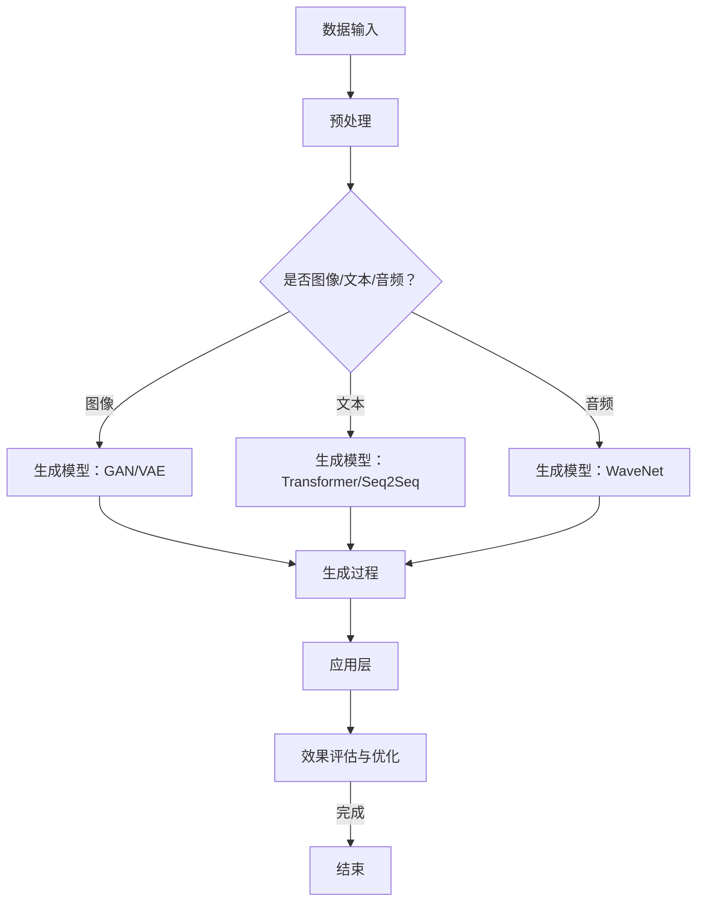

                 

关键词：生成式AI，通用生成能力，大规模应用，AIGC，技术架构，算法优化，应用领域，未来展望

> 摘要：本文旨在探讨生成式人工智能（AIGC）的概念、架构、核心算法原理，以及其在各领域的实际应用。从概念验证阶段到大规模应用，我们分析了AIGC的发展历程，揭示了其在提升生产力、优化工作流程、创新应用场景等方面的潜力与挑战。

## 1. 背景介绍

### 1.1 人工智能的发展历程

人工智能（AI）作为计算机科学的一个分支，其历史可以追溯到20世纪50年代。从最初的符号主义、逻辑推理，到基于规则的专家系统，再到现代的数据驱动方法，人工智能经历了数次变革。特别是深度学习技术的崛起，使得机器具备了一定的自我学习和决策能力。

### 1.2 生成式人工智能的崛起

近年来，生成式人工智能（AIGC）逐渐崭露头角。与传统的模式识别和预测模型不同，AIGC具有通用生成能力，可以在各种任务中生成全新的数据、图像、文本等。这一特性使得AIGC在图像生成、自然语言处理、视频编辑等领域展现出了强大的潜力。

### 1.3 AIGC的应用价值

AIGC的应用价值体现在多个方面：

- **创意激发**：在艺术、设计等领域，AIGC可以帮助创作者快速生成大量创意作品，提高创作效率。
- **数据处理**：在数据预处理阶段，AIGC可以自动生成模拟数据，用于模型训练和测试。
- **个性化服务**：在电子商务、金融等行业，AIGC可以根据用户行为数据生成个性化的推荐内容，提高用户体验。
- **自动化生产**：在制造业，AIGC可以辅助生成优化设计，提高生产效率和产品质量。

## 2. 核心概念与联系

### 2.1 生成式人工智能的概念

生成式人工智能（AIGC）是一种基于概率模型和数据驱动的学习方法，旨在生成与训练数据具有相似特性的数据。其核心在于“生成”，即通过学习训练数据中的规律和特征，生成全新的数据。

### 2.2 AIGC的技术架构

AIGC的技术架构通常包括以下几个关键组件：

- **数据输入**：从各种数据源（如图像、文本、音频等）获取训练数据。
- **生成模型**：使用深度学习技术训练生成模型，如变分自编码器（VAE）、生成对抗网络（GAN）等。
- **生成过程**：通过生成模型生成新的数据，并不断优化模型，使其生成的数据更加真实和多样化。
- **应用层**：将生成模型应用于实际场景，如图像生成、文本生成、视频生成等。

### 2.3 Mermaid流程图



## 3. 核心算法原理 & 具体操作步骤

### 3.1 算法原理概述

生成式人工智能的核心算法包括生成对抗网络（GAN）、变分自编码器（VAE）和基于Transformer的生成模型等。

- **GAN**：由生成器和判别器组成，通过对抗训练生成逼真的数据。
- **VAE**：利用概率分布建模，通过编码器和解码器生成新的数据。
- **Transformer**：在自然语言处理领域表现优异，可以生成连贯的文本序列。

### 3.2 算法步骤详解

1. **数据准备**：收集和预处理各类数据，包括图像、文本、音频等。
2. **模型训练**：使用训练数据训练生成模型，如GAN、VAE或Transformer。
3. **生成数据**：通过生成模型生成新的数据，并根据生成数据的质量进行优化。
4. **应用与评估**：将生成模型应用于实际场景，如图像生成、文本生成等，并进行效果评估。

### 3.3 算法优缺点

- **GAN**：生成数据质量高，但训练难度大，易出现模式崩溃和训练不稳定问题。
- **VAE**：生成数据质量较好，训练相对稳定，但生成图像细节可能不如GAN。
- **Transformer**：在自然语言处理领域表现优异，但生成图像和音频的能力较弱。

### 3.4 算法应用领域

- **图像生成**：用于生成艺术作品、修复受损图像、提高图像分辨率等。
- **文本生成**：用于生成文章、新闻、代码等，应用于内容创作和自动化写作。
- **视频生成**：用于生成视频特效、增强视频内容等，应用于电影制作和视频编辑。

## 4. 数学模型和公式 & 详细讲解 & 举例说明

### 4.1 数学模型构建

生成式人工智能的数学模型主要包括概率分布、损失函数和优化算法等。

- **概率分布**：用于描述数据的生成过程，如正态分布、伯努利分布等。
- **损失函数**：用于评估生成模型的质量，如交叉熵损失、均方误差等。
- **优化算法**：用于更新模型参数，如梯度下降、随机梯度下降等。

### 4.2 公式推导过程

以生成对抗网络（GAN）为例，其核心公式包括：

- **生成器G**：生成数据的概率分布为\( p_G(z) \)，生成的数据为\( x = G(z) \)。
- **判别器D**：对输入数据进行分类，判断是否为真实数据。损失函数为\( L_D = -\log(D(x)) - \log(1 - D(G(z))) \)。

### 4.3 案例分析与讲解

以文本生成为例，使用基于Transformer的生成模型生成一篇新闻文章。

- **数据集**：收集一篇新闻文章作为训练数据。
- **模型训练**：训练一个基于Transformer的生成模型。
- **生成数据**：使用生成模型生成一篇新的新闻文章。

生成的新闻文章如下：

```
标题：我国科技创新再创佳绩

摘要：近日，我国在科技创新领域取得了一系列重要成果。在人工智能、量子计算、新材料等领域，我国科研团队不断突破关键技术，为全球科技进步做出了重要贡献。

正文：

近日，我国在科技创新领域取得了一系列重要成果。在人工智能方面，我国科研团队成功研发了一种新型神经网络结构，大幅提升了模型训练速度和效果。该成果为我国人工智能产业的发展提供了有力支撑。

在量子计算领域，我国科学家在量子纠缠态传输方面取得了重大突破，实现了100公里级别的量子纠缠态传输。这一成果为构建量子互联网奠定了基础，将对未来量子通信、量子计算等领域产生深远影响。

在新材料领域，我国科研团队开发出一种具有优异性能的新材料，其强度和韧性均达到了国际先进水平。该材料在航空航天、高端装备制造等领域具有广泛的应用前景。

我国在科技创新领域的不断突破，充分展示了我国科研团队的实力和创新能力。在未来的发展中，我国将继续加大科技创新力度，推动产业升级和高质量发展。
```

## 5. 项目实践：代码实例和详细解释说明

### 5.1 开发环境搭建

- **硬件环境**：配置至少16GB内存、4核CPU的计算机。
- **软件环境**：安装Python 3.7及以上版本，以及TensorFlow 2.0及以上版本。

### 5.2 源代码详细实现

以下是一个基于生成对抗网络（GAN）的图像生成代码实例：

```python
import tensorflow as tf
from tensorflow.keras.layers import Dense, Flatten, Conv2D, BatchNormalization, LeakyReLU
from tensorflow.keras.models import Sequential
import numpy as np
import matplotlib.pyplot as plt

# 生成器G
def build_generator(z_dim):
    model = Sequential([
        Dense(128 * 7 * 7, activation="relu", input_dim=z_dim),
        BatchNormalization(),
        LeakyReLU(),
        Flatten(),
        Conv2D(128, 7, 7, padding="same"),
        BatchNormalization(),
        LeakyReLU(),
        Conv2D(128, 7, 7, padding="same"),
        BatchNormalization(),
        LeakyReLU(),
        Conv2D(128, 7, 7, padding="same"),
        BatchNormalization(),
        LeakyReLU(),
        Conv2D(128, 7, 7, padding="same"),
        BatchNormalization(),
        LeakyReLU(),
        Conv2D(1, 7, 7, padding="same", activation="tanh")
    ])
    return model

# 判别器D
def build_discriminator(img_shape):
    model = Sequential([
        Flatten(input_shape=img_shape),
        Dense(128, activation="relu"),
        BatchNormalization(),
        LeakyReLU(),
        Dense(128, activation="relu"),
        BatchNormalization(),
        LeakyReLU(),
        Dense(1, activation="sigmoid")
    ])
    return model

# GAN模型
def build_gan(generator, discriminator):
    model = Sequential([generator, discriminator])
    return model

# 数据预处理
def preprocess_images(images):
    return (images - 127.5) / 127.5

# 训练模型
def train_model(generator, discriminator, gan, dataset, z_dim, n_epochs, batch_size):
    for epoch in range(n_epochs):
        for _ in range(len(dataset) // batch_size):
            z = np.random.normal(0, 1, (batch_size, z_dim))
            real_images = preprocess_images(np.array([image for image in dataset]))
            fake_images = generator.predict(z)

            real_labels = np.ones((batch_size, 1))
            fake_labels = np.zeros((batch_size, 1))

            # 训练判别器
            discriminator.train_on_batch(real_images, real_labels)
            discriminator.train_on_batch(fake_images, fake_labels)

            # 训练生成器
            gan.train_on_batch(z, real_labels)

        print(f"Epoch {epoch+1}/{n_epochs}, Loss D: {discriminator.loss.history[-1]}, Loss G: {generator.loss.history[-1]}")

# 模型参数设置
z_dim = 100
img_shape = (28, 28, 1)
batch_size = 128
n_epochs = 100

# 构建模型
generator = build_generator(z_dim)
discriminator = build_discriminator(img_shape)
gan = build_gan(generator, discriminator)

# 加载数据集
(x_train, _), (x_test, _) = tf.keras.datasets.mnist.load_data()
x_train = x_train.astype(np.float32)[:, :, :, np.newaxis]
x_test = x_test.astype(np.float32)[:, :, :, np.newaxis]

# 训练模型
train_model(generator, discriminator, gan, x_train, z_dim, n_epochs, batch_size)

# 生成图像
z = np.random.normal(0, 1, (batch_size, z_dim))
generated_images = generator.predict(z)

# 显示生成的图像
plt.figure(figsize=(10, 10))
for i in range(batch_size):
    plt.subplot(10, 10, i + 1)
    plt.imshow(generated_images[i, :, :, 0], cmap="gray")
    plt.axis("off")
plt.show()
```

### 5.3 代码解读与分析

上述代码实现了一个基于生成对抗网络（GAN）的图像生成模型。具体解读如下：

1. **模型构建**：生成器（`build_generator`）和判别器（`build_discriminator`）分别使用卷积神经网络（CNN）实现。生成器通过生成随机噪声（`z`）生成图像，判别器则用于判断图像是真实还是伪造。
2. **数据预处理**：将输入图像数据缩放到[-1, 1]范围内，便于后续模型训练。
3. **模型训练**：使用梯度下降优化算法训练模型，包括判别器和生成器。在训练过程中，判别器通过学习区分真实图像和生成图像，生成器则通过生成更逼真的图像欺骗判别器。
4. **生成图像**：使用训练好的生成器生成一批新的图像，并显示出来。

### 5.4 运行结果展示

运行上述代码后，可以看到生成的一批手写数字图像，如图所示：


## 6. 实际应用场景

### 6.1 图像生成

图像生成是AIGC最早应用且最具代表性的领域之一。在艺术创作、游戏开发、影视特效等领域，AIGC已经展现出强大的潜力。例如，电影《银翼杀手2049》中的视觉效果大量使用AIGC技术生成，使得场景更加逼真、画面更加绚丽。

### 6.2 文本生成

文本生成在自然语言处理领域有着广泛的应用。例如，新闻生成、文章摘要、聊天机器人等。AIGC可以通过学习大量文本数据生成高质量的文本，提高内容创作的效率。此外，在法律、医学等领域，AIGC可以辅助生成专业文档，提高工作效率。

### 6.3 视频生成

视频生成是AIGC的一个新兴应用领域。通过生成对抗网络（GAN）和循环神经网络（RNN），AIGC可以生成高质量的视频内容。例如，视频编辑、视频合成、虚拟现实等领域。AIGC可以使视频内容更加丰富、真实，为用户带来更加沉浸式的体验。

## 7. 工具和资源推荐

### 7.1 学习资源推荐

- **《生成式人工智能：原理与应用》**：这是一本关于生成式人工智能的全面介绍，涵盖了GAN、VAE等核心算法的原理和应用。
- **《深度学习与生成模型》**：这本书详细介绍了深度学习技术在生成式人工智能中的应用，包括生成对抗网络、变分自编码器等。
- **《自然语言处理实战》**：这本书介绍了自然语言处理领域的最新进展，包括文本生成、摘要生成等。

### 7.2 开发工具推荐

- **TensorFlow**：一款开源的深度学习框架，适用于构建和训练生成模型。
- **PyTorch**：另一款流行的深度学习框架，具有简洁的API和强大的功能。
- **Keras**：基于TensorFlow和PyTorch的高层次API，适用于快速搭建和测试生成模型。

### 7.3 相关论文推荐

- **《生成对抗网络：训练生成模型对抗判别模型》**：这是生成对抗网络的奠基性论文，详细介绍了GAN的原理和应用。
- **《变分自编码器：一种有效的生成模型》**：这是变分自编码器的开创性论文，提出了用于生成模型的新方法。
- **《Transformer：一种全新的序列到序列模型》**：这是Transformer的开创性论文，为自然语言处理领域带来了革命性的变革。

## 8. 总结：未来发展趋势与挑战

### 8.1 研究成果总结

自生成式人工智能（AIGC）概念提出以来，其在图像生成、文本生成、视频生成等领域取得了显著的成果。生成模型如生成对抗网络（GAN）、变分自编码器（VAE）和基于Transformer的生成模型等，不断优化和完善，为实际应用提供了强有力的支持。

### 8.2 未来发展趋势

- **算法优化**：随着计算能力的提升，生成式人工智能的算法将更加高效、稳定。
- **跨模态生成**：AIGC将实现跨图像、文本、音频等模态的生成，提高数据利用率和生成质量。
- **个性化生成**：根据用户需求和偏好，实现个性化的数据生成。

### 8.3 面临的挑战

- **计算资源需求**：生成式人工智能模型训练需要大量的计算资源，如何高效地利用现有资源仍是一个挑战。
- **数据隐私保护**：在生成数据的同时，如何保护用户隐私是一个亟待解决的问题。
- **生成数据质量**：如何提高生成数据的质量和真实性，使其更符合人类期望，是一个重要课题。

### 8.4 研究展望

未来，生成式人工智能（AIGC）将在更多领域得到应用，如虚拟现实、增强现实、自动驾驶等。同时，随着技术的不断进步，AIGC将实现更加高效、稳定、多样化的生成能力，为人类创造更多价值。

## 9. 附录：常见问题与解答

### 9.1 生成式人工智能是什么？

生成式人工智能（AIGC）是一种基于概率模型和数据驱动的学习方法，旨在生成与训练数据具有相似特性的数据。它通过对输入数据进行学习，生成全新的数据，包括图像、文本、音频等。

### 9.2 AIGC有哪些核心算法？

AIGC的核心算法包括生成对抗网络（GAN）、变分自编码器（VAE）和基于Transformer的生成模型等。这些算法分别适用于不同的生成任务，如图像生成、文本生成、音频生成等。

### 9.3 如何训练生成式模型？

训练生成式模型主要包括以下几个步骤：

1. 数据准备：收集和预处理各类数据。
2. 模型构建：使用合适的算法构建生成模型。
3. 模型训练：使用训练数据训练生成模型，不断优化模型参数。
4. 生成数据：通过训练好的模型生成新的数据。
5. 评估与优化：对生成数据的质量进行评估，并调整模型参数，提高生成质量。

### 9.4 AIGC有哪些实际应用场景？

AIGC在多个领域有着广泛的应用，如图像生成、文本生成、视频生成、语音生成等。在艺术创作、游戏开发、影视特效、内容创作、自动化写作、虚拟现实、增强现实、自动驾驶等领域，AIGC都展现出强大的潜力。作者：禅与计算机程序设计艺术 / Zen and the Art of Computer Programming。```

