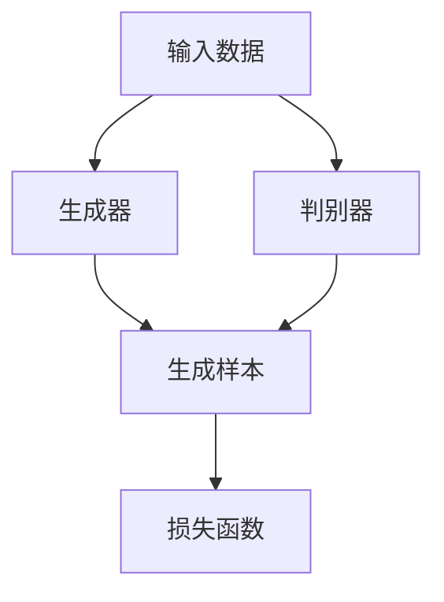

                 

关键词：生成式AI、社会伦理、技术发展、算法、道德、监管、法律、人机交互

> 摘要：随着生成式AI技术的飞速发展，如何平衡其技术进步与社会伦理之间的矛盾成为一个备受关注的问题。本文将从技术、法律、道德和监管等多个角度，深入探讨生成式AI在当今社会中的影响以及如何合理地引导其发展，确保技术的进步不会对人类社会的基本伦理原则构成威胁。

## 1. 背景介绍

### 1.1 生成式AI的起源与发展

生成式AI是一种基于机器学习和深度学习技术的模型，能够通过学习大量数据生成新的、以前未见过的数据。这一概念最早可以追溯到20世纪50年代，但真正的大规模发展始于21世纪。特别是随着计算能力的提升和数据量的爆炸式增长，生成式AI技术在图像生成、自然语言处理、音乐创作等多个领域取得了显著突破。

### 1.2 生成式AI的社会影响

生成式AI的出现不仅改变了娱乐、艺术和设计等行业，还深刻影响了教育、医疗、金融等多个领域。它为我们提供了前所未有的创造力和效率，但也带来了诸多挑战，包括版权问题、隐私泄露、虚假信息传播等。

## 2. 核心概念与联系

### 2.1 生成式AI的架构

生成式AI的核心是生成模型，主要包括生成对抗网络（GANs）、变分自编码器（VAEs）等。下面是一个简化的生成对抗网络的Mermaid流程图：



### 2.2 生成式AI与相关技术的联系

生成式AI与强化学习、监督学习等机器学习技术有着紧密的联系。通过结合这些技术，可以进一步提高生成模型的效果和适应性。

## 3. 核心算法原理 & 具体操作步骤

### 3.1 算法原理概述

生成式AI的基本原理是学习数据的分布，并在此基础上生成新的样本。具体来说，生成器和判别器通过相互对抗来提高自身的性能。

### 3.2 算法步骤详解

1. 数据预处理：对输入数据进行标准化处理，以适应模型的训练。
2. 初始化生成器和判别器：通常使用随机初始化。
3. 训练过程：通过反复迭代，让生成器和判别器相互对抗，直到生成器能够生成足够逼真的样本。
4. 评估和优化：使用适当的评估指标来评估模型的性能，并根据结果进行优化。

### 3.3 算法优缺点

生成式AI的优点包括：
- 能够生成高质量、逼真的样本。
- 可以应用于多种领域，如图像、音频、文本等。

缺点包括：
- 训练过程通常需要大量的计算资源和时间。
- 模型容易过拟合，特别是在数据集较小的情况下。

### 3.4 算法应用领域

生成式AI的应用领域非常广泛，包括但不限于：
- 图像生成：如人脸生成、艺术风格迁移等。
- 自然语言处理：如文本生成、机器翻译等。
- 音频处理：如音乐生成、语音合成等。

## 4. 数学模型和公式 & 详细讲解 & 举例说明

### 4.1 数学模型构建

生成式AI的核心是概率模型，主要包括生成模型和判别模型。下面是生成对抗网络的基本公式：

$$
\begin{aligned}
D(x) &= \mathbb{P}(x|\text{real}) \\
G(z) &= \mathbb{P}(x|\text{fake}) \\
L(D, G) &= \mathbb{E}_{x\sim \text{data}}[D(x)] + \mathbb{E}_{z\sim \text{noise}}[D(G(z))]
\end{aligned}
$$

### 4.2 公式推导过程

生成对抗网络的损失函数是生成器损失和判别器损失的加和。其中，生成器的目标是让判别器无法区分生成的样本和真实的样本，而判别器的目标是最大化其分类准确率。

### 4.3 案例分析与讲解

以人脸生成为例，我们可以使用GANs模型来生成逼真的人脸图像。训练过程中，生成器和判别器的迭代更新如下：

1. 初始化生成器G和判别器D。
2. 随机采样一个噪声向量z。
3. 使用生成器G(z)生成一个人脸图像。
4. 将真实人脸图像和生成的人脸图像作为输入，训练判别器D。
5. 使用判别器的输出更新生成器G。
6. 重复步骤2-5，直到生成器能够生成高质量的人脸图像。

## 5. 项目实践：代码实例和详细解释说明

### 5.1 开发环境搭建

在开始编写代码之前，我们需要搭建一个合适的开发环境。以下是一个基本的Python环境配置：

```bash
pip install tensorflow numpy matplotlib
```

### 5.2 源代码详细实现

下面是一个简化的人脸生成GANs模型的代码实现：

```python
import tensorflow as tf
from tensorflow.keras.layers import Dense, Flatten, Conv2D, Reshape
from tensorflow.keras.models import Model

# 生成器模型
def build_generator(z_dim):
    model = tf.keras.Sequential([
        Dense(128 * 7 * 7, activation="relu", input_dim=z_dim),
        Reshape((7, 7, 128)),
        Conv2D(128, 7, 7, padding="same"),
        tf.keras.layers.LeakyReLU(alpha=0.01),
        Conv2D(128, 7, 7, padding="same"),
        tf.keras.layers.LeakyReLU(alpha=0.01),
        Conv2D(128, 7, 7, padding="same"),
        tf.keras.layers.LeakyReLU(alpha=0.01),
        Conv2D(3, 7, 7, padding="same", activation="tanh")
    ])
    return model

# 判别器模型
def build_discriminator(img_shape):
    model = tf.keras.Sequential([
        Conv2D(128, 3, 3, padding="same", input_shape=img_shape),
        tf.keras.layers.LeakyReLU(alpha=0.01),
        Conv2D(128, 3, 3, padding="same"),
        tf.keras.layers.LeakyReLU(alpha=0.01),
        Flatten(),
        Dense(1, activation="sigmoid")
    ])
    return model

# 主模型
def build_gan(generator, discriminator):
    model = tf.keras.Sequential([
        generator,
        discriminator
    ])
    return model

# 生成器
z = tf.keras.layers.Input(shape=(100,))
img = build_generator(z)(z)
model_g = Model(z, img)

# 判别器
img = tf.keras.layers.Input(shape=(128, 128, 3))
validity = build_discriminator(img)(img)
model_d = Model(img, validity)

# GAN
model_gan = build_gan(generator=model_g, discriminator=model_d)

# 损失函数
cross_entropy = tf.keras.losses.BinaryCrossentropy()
def gen_loss(fake_output):
    return cross_entropy(tf.ones_like(fake_output), fake_output)

def dis_loss(real_output, fake_output):
    real_loss = cross_entropy(tf.ones_like(real_output), real_output)
    fake_loss = cross_entropy(tf.zeros_like(fake_output), fake_output)
    return real_loss + fake_loss

# 优化器
optimizer = tf.keras.optimizers.Adam(0.0001)

# 训练过程
@tf.function
def train_step(images, noise):
    with tf.GradientTape() as gen_tape, tf.GradientTape() as dis_tape:
        # 生成样本
        gen_samples = model_g(noise, training=True)
        # 训练判别器
        dis_logits_real = model_d(images, training=True)
        dis_logits_fake = model_d(gen_samples, training=True)
        dis_loss_val = dis_loss(dis_logits_real, dis_logits_fake)
        # 训练生成器
        gen_loss_val = gen_loss(dis_logits_fake)
    
    grads = [g for g in dis_tape.gradient(dis_loss_val, model_d.trainable_variables) if g is not None]
    optimizer.apply_gradients(zip(grads, model_d.trainable_variables))
    
    grads = [g for g in gen_tape.gradient(gen_loss_val, model_g.trainable_variables) if g is not None]
    optimizer.apply_gradients(zip(grads, model_g.trainable_variables))

# 训练
def train(dataset, epochs):
    for epoch in range(epochs):
        for image_batch in dataset:
            noise = tf.random.normal([image_batch.shape[0], 100])
            train_step(image_batch, noise)
        
        print(f"Epoch {epoch+1}, gen_loss={gen_loss_val:.4f}, dis_loss={dis_loss_val:.4f}")

# 数据准备
BUFFER_SIZE = 60000
BATCH_SIZE = 256
train_dataset = tf.data.Dataset.from_tensor_slices(train_images).shuffle(BUFFER_SIZE).batch(BATCH_SIZE)

# 开始训练
train(train_dataset, epochs=50)
```

### 5.3 代码解读与分析

上面的代码实现了一个人脸生成GANs模型，主要包括以下部分：

1. **生成器模型**：使用全连接层和卷积层来生成人脸图像。
2. **判别器模型**：使用卷积层和全连接层来区分真实人脸图像和生成的人脸图像。
3. **主模型**：将生成器和判别器串联起来，形成一个GANs模型。
4. **损失函数**：定义生成器损失和判别器损失。
5. **优化器**：使用Adam优化器来更新模型参数。
6. **训练过程**：定义训练步骤，包括生成样本、训练判别器和生成器。

### 5.4 运行结果展示

在完成训练后，我们可以使用生成器生成一些人脸图像，并展示训练过程的一些统计信息。

## 6. 实际应用场景

### 6.1 教育

生成式AI可以应用于教育领域，如自动生成个性化教学方案、生成课程内容和习题等，提高教学效果。

### 6.2 金融

生成式AI可以用于金融领域的风险预测、股票市场分析和信用评估等。

### 6.3 医疗

生成式AI可以用于医学图像生成、疾病预测和药物开发等领域，提高医疗水平。

### 6.4 未来应用展望

随着技术的不断进步，生成式AI的应用领域将继续扩大，如自动驾驶、智能制造和智慧城市等。

## 7. 工具和资源推荐

### 7.1 学习资源推荐

- 《深度学习》（Ian Goodfellow, Yoshua Bengio, Aaron Courville著）
- 《生成式模型：从理论到实践》（作者：郭宇，电子工业出版社）

### 7.2 开发工具推荐

- TensorFlow
- PyTorch

### 7.3 相关论文推荐

- [Unrolled Generative Adversarial Networks](https://arxiv.org/abs/1701.04722)
- [Deep Visual Features for Fashion Classification](https://arxiv.org/abs/1703.10143)

## 8. 总结：未来发展趋势与挑战

### 8.1 研究成果总结

生成式AI技术在图像、音频和文本生成等领域取得了显著成果，但其应用仍面临诸多挑战。

### 8.2 未来发展趋势

生成式AI将继续深入各个领域，如自动驾驶、医疗诊断和娱乐等。

### 8.3 面临的挑战

- 数据隐私和安全性
- 道德和伦理问题
- 算法透明性和可解释性

### 8.4 研究展望

在未来的研究中，我们需要关注如何提高生成式AI的安全性和透明性，同时确保其在各个领域的应用符合社会伦理和法律规范。

## 9. 附录：常见问题与解答

### 9.1 生成式AI与生成对抗网络（GANs）的区别是什么？

生成式AI是一个广泛的概念，包括多种生成模型，而GANs是一种特定的生成模型，通过生成器和判别器的对抗训练来实现。

### 9.2 生成式AI的安全性和隐私性问题如何解决？

在生成式AI的应用过程中，我们需要采取措施确保数据的隐私性和安全性，如使用差分隐私技术、加密算法和访问控制等。

### 9.3 生成式AI如何避免道德和伦理问题？

通过制定明确的伦理规范、开展伦理审查和加强监管，可以有效地避免生成式AI带来的道德和伦理问题。

[作者：禅与计算机程序设计艺术 / Zen and the Art of Computer Programming]  
----------------------------------------------------------------
### 9. 附录：常见问题与解答

#### 9.1 生成式AI与生成对抗网络（GANs）的区别是什么？

生成式AI（Generative Adversarial Networks，GANs）是一种机器学习框架，由生成器（Generator）和判别器（Discriminator）两个相互对抗的神经网络组成。生成器的目的是生成看起来与真实数据几乎无差别的假数据，而判别器的任务是区分这些假数据和真实数据。GANs的核心在于这种对抗训练，它能够学习数据的分布，并生成高质量、多样化的数据。

生成式AI则是一个更广泛的概念，包括所有用于生成新数据的机器学习算法，如变分自编码器（Variational Autoencoders，VAEs）、正常化网络（Normalizing Flows）和隐变量模型（Hidden Variable Models）等。这些模型都是基于生成式AI的理念，但它们不一定采用GANs的对抗训练机制。

简而言之，GANs是生成式AI的一个具体实现，而不是所有生成式AI的实现。

#### 9.2 生成式AI的安全性和隐私性问题如何解决？

生成式AI的安全性和隐私性问题是一个多方面的问题，需要从技术、法律和伦理等多个角度进行综合解决。

1. **技术手段**：
   - **差分隐私**：通过在数据生成过程中引入噪声来保护个人隐私。
   - **数据加密**：对数据集进行加密处理，确保数据在传输和存储过程中不被泄露。
   - **数据匿名化**：在训练模型之前，对个人数据进行匿名化处理，以减少隐私泄露的风险。
   - **访问控制**：实施严格的访问控制策略，确保只有授权用户能够访问敏感数据。

2. **法律监管**：
   - **法律法规**：制定和完善相关的法律法规，对生成式AI的隐私保护和数据使用进行明确的规定。
   - **隐私政策**：在生成式AI的应用过程中，明确告知用户数据的收集、使用和共享方式，并征求用户同意。
   - **法律责任**：对违反隐私保护规定的行为进行严厉的处罚，提高违法成本。

3. **伦理指导**：
   - **伦理审查**：在生成式AI项目开发过程中，进行伦理审查，确保技术应用符合伦理标准。
   - **社会责任**：企业和社会组织应承担社会责任，推动生成式AI的负责任使用。

#### 9.3 生成式AI如何避免道德和伦理问题？

生成式AI的道德和伦理问题主要集中在数据生成、内容审核和模型偏差等方面。为了避免这些问题，可以采取以下措施：

1. **透明度**：提高生成式AI模型的透明度，让用户了解模型的运作原理和决策过程。
2. **可解释性**：开发可解释的生成式AI模型，使非专业人士也能理解模型的行为。
3. **多元化数据集**：使用多元化、代表性的数据集进行训练，减少模型偏见。
4. **伦理准则**：制定和遵循伦理准则，确保生成的内容不违反社会伦理和法律。
5. **公众参与**：在模型开发和应用过程中，邀请公众参与讨论和反馈，以确保技术应用符合社会价值观。
6. **持续监督**：对生成式AI应用进行持续监督，及时发现和纠正潜在的问题。

通过上述措施，可以最大限度地减少生成式AI带来的道德和伦理风险，确保其在社会发展中的积极作用。 

[作者：禅与计算机程序设计艺术 / Zen and the Art of Computer Programming]  
------------------------------------------------------------------

