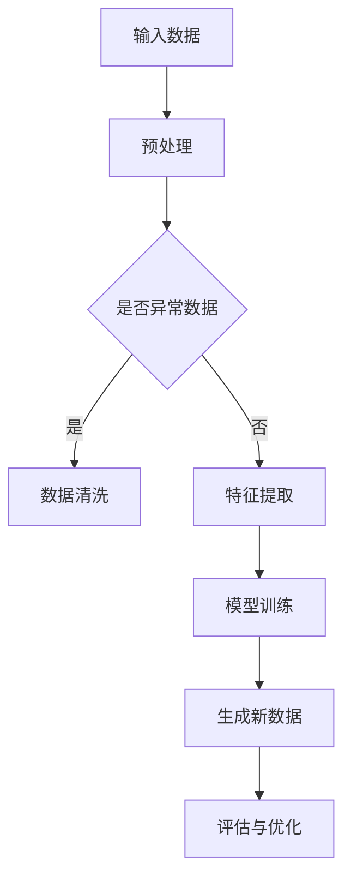

                 

关键词：生成式AI、人工智能产品、智能产品设计、用户体验、个性化推荐、自然语言处理、机器学习、深度学习

> 摘要：本文旨在探讨生成式人工智能（AI）在产品设计和开发中的应用，以及如何通过利用生成式AI技术来打造更智能、更人性化的产品。我们将深入分析生成式AI的核心概念、技术原理及其应用领域，并结合实际案例进行详细解读。

## 1. 背景介绍

近年来，随着计算机技术的飞速发展和大数据时代的来临，人工智能（AI）已经成为推动科技进步的重要力量。在众多AI领域中，生成式AI因其强大的建模和数据生成能力而备受关注。生成式AI的核心目标是通过学习输入数据，生成新的、与输入数据具有相似特征的数据，从而在诸多领域展现出了巨大的潜力。

生成式AI的兴起不仅仅是因为其技术创新，更重要的是它对用户体验和产品设计的深远影响。随着用户对个性化体验的需求不断提高，生成式AI为产品开发者提供了一种全新的解决方案，使产品能够根据用户行为和偏好进行智能化调整，提供个性化的推荐和服务。

本文将围绕生成式AI的核心概念、技术原理、算法应用、数学模型、项目实践和未来展望等方面进行探讨，旨在为读者提供一个全面了解生成式AI在产品设计和开发中应用的全景视图。

## 2. 核心概念与联系

### 2.1 定义

生成式AI（Generative AI）是一种人工智能技术，其核心目标是通过学习数据分布来生成新的数据。与判别式AI（Discriminative AI）不同，判别式AI的目标是区分不同类别的数据，而生成式AI的目标是生成新的、与训练数据相似的数据。

生成式AI通常基于概率模型或生成模型，如变分自编码器（VAE）、生成对抗网络（GAN）等。这些模型通过学习数据分布，能够在给定一定的概率分布或先验知识的情况下，生成新的数据样本。

### 2.2 关联技术

生成式AI与多种前沿技术紧密相连，如深度学习、强化学习、自然语言处理（NLP）等。深度学习提供了强大的模型学习能力，使得生成式AI能够从大量数据中提取有用的特征。强化学习则通过奖励机制引导生成式AI优化其生成策略。NLP技术则使生成式AI能够理解和生成自然语言文本。

### 2.3 Mermaid 流程图

以下是一个简化的生成式AI技术架构的Mermaid流程图，展示了其主要组件和相互关系：



在这个流程图中，输入数据经过预处理和特征提取后，输入到生成模型中进行训练。训练完成后，模型可以生成新的数据样本。生成的数据样本经过评估和优化，以不断提高生成质量。

## 3. 核心算法原理 & 具体操作步骤

### 3.1 算法原理概述

生成式AI的核心算法主要包括变分自编码器（VAE）和生成对抗网络（GAN）。下面将分别介绍这两种算法的原理。

#### 变分自编码器（VAE）

VAE是一种基于概率模型的生成模型，其基本思想是将输入数据的分布表示为两个独立的随机变量的组合：一个编码器（encoder）和一个解码器（decoder）。编码器将输入数据映射到一个潜在的 latent 空间中，解码器则从 latent 空间中采样，并生成与输入数据相似的新数据。

VAE的关键在于其 loss 函数的设计。VAE 的 loss 函数由数据重建 loss 和潜在分布的 Kullback-Leibler (KL) divergence 组成。通过优化这个 loss 函数，VAE 能够学习到输入数据的分布，从而生成新的数据。

#### 生成对抗网络（GAN）

GAN 是由生成器（generator）和判别器（discriminator）组成的对抗性模型。生成器的目标是生成尽可能逼真的数据，而判别器的目标是区分真实数据和生成数据。通过这种对抗性训练，生成器能够不断优化其生成能力，从而生成越来越真实的数据。

GAN 的 loss 函数由两部分组成：生成器 loss 和判别器 loss。生成器的 loss 函数旨在最小化生成数据与真实数据之间的差异，而判别器的 loss 函数旨在最大化其区分真实数据和生成数据的准确率。

### 3.2 算法步骤详解

#### 变分自编码器（VAE）

1. **数据预处理**：将输入数据标准化，并进行归一化处理。
2. **编码器训练**：通过梯度下降算法，优化编码器的参数，使其能够将输入数据映射到一个潜在的 latent 空间中。
3. **解码器训练**：在 latent 空间中采样，通过解码器生成新的数据样本，并优化解码器的参数，使其能够生成与输入数据相似的新数据。
4. **生成新数据**：在 latent 空间中随机采样，通过解码器生成新的数据样本。

#### 生成对抗网络（GAN）

1. **数据预处理**：与 VAE 相同，对输入数据进行标准化和归一化处理。
2. **生成器训练**：通过梯度下降算法，优化生成器的参数，使其能够生成尽可能逼真的数据样本。
3. **判别器训练**：通过梯度下降算法，优化判别器的参数，使其能够准确区分真实数据和生成数据。
4. **交替训练**：生成器和判别器交替进行训练，以实现生成器和判别器的共同优化。
5. **生成新数据**：在生成器生成新的数据样本后，通过评估和优化，提高生成数据的质量。

### 3.3 算法优缺点

#### VAE

优点：
- 结构简单，易于理解和实现。
- 能够生成高质量的生成数据。

缺点：
- 训练过程可能较慢。
- 对于高度依赖输入数据的生成任务，效果可能不理想。

#### GAN

优点：
- 生成数据的多样性更高。
- 对复杂分布的数据生成效果更好。

缺点：
- 训练过程可能不稳定，容易出现模式崩溃（mode collapse）问题。
- 对训练数据的要求较高，需要大量的高质量数据。

### 3.4 算法应用领域

生成式AI在多个领域都有广泛应用，包括图像生成、自然语言生成、语音合成等。以下是一些具体的应用案例：

1. **图像生成**：使用 GAN 生成逼真的图像，如人脸生成、艺术风格转换等。
2. **自然语言生成**：使用生成式AI生成新闻文章、对话系统等，如 OpenAI 的 GPT-3 模型。
3. **语音合成**：使用生成式AI合成自然流畅的语音，如语音助手、语音导航等。

## 4. 数学模型和公式 & 详细讲解 & 举例说明

### 4.1 数学模型构建

生成式AI的数学模型通常基于概率模型和生成模型。以下分别介绍 VAE 和 GAN 的数学模型。

#### 变分自编码器（VAE）

VAE 的核心是编码器（encoder）和解码器（decoder）。编码器将输入数据 \( x \) 映射到一个 latent 空间中的点 \( z \)，解码器则将 latent 空间的点 \( z \) 映射回输入空间中的点 \( x' \)。

假设输入数据的概率分布为 \( p(x) \)，latent 空间的概率分布为 \( p(z) \)，编码器参数为 \( \theta_e \)，解码器参数为 \( \theta_d \)，则 VAE 的目标是最小化以下 loss 函数：

\[ \mathcal{L} = \mathbb{E}_{x \sim p(x)}[\log p(x'|z)] + \beta \mathbb{E}_{z \sim p(z|x)}[\log p(z)] \]

其中，第一项是数据重建 loss，第二项是 latent 分布的 KL 散度。

#### 生成对抗网络（GAN）

GAN 由生成器 \( G \) 和判别器 \( D \) 组成。生成器 \( G \) 的目标是生成与真实数据 \( x \) 难以区分的假数据 \( G(z) \)，判别器 \( D \) 的目标是最大化其区分真实数据和假数据的准确率。

GAN 的目标是最小化以下 loss 函数：

\[ \mathcal{L}_G = \mathbb{E}_{z \sim p(z)}[\log D(G(z))] \]
\[ \mathcal{L}_D = \mathbb{E}_{x \sim p(x)}[\log D(x)] + \mathbb{E}_{z \sim p(z)}[\log (1 - D(G(z)))] \]

其中，第一项是生成器的 loss，第二项是判别器的 loss。

### 4.2 公式推导过程

#### 变分自编码器（VAE）

VAE 的 loss 函数由数据重建 loss 和 latent 分布的 KL 散度组成。首先，我们分别推导这两部分的 loss 函数。

1. **数据重建 loss**

数据重建 loss 是衡量生成数据与原始数据相似度的指标。对于输入数据 \( x \)，生成数据 \( x' \)，其重建 loss 可以表示为：

\[ \mathcal{L}_{\text{reconstruction}} = -\mathbb{E}_{x \sim p(x)}[\log p(x'|x)] \]

2. **latent 分布的 KL 散度**

latent 分布的 KL 散度是衡量 latent 空间分布与先验分布差异的指标。假设 latent 空间的概率分布为 \( p(z|x) \)，先验分布为 \( p(z) \)，则 KL 散度可以表示为：

\[ \mathcal{L}_{\text{KL}} = \mathbb{E}_{z \sim p(z|x)}[\log \frac{p(z|x)}{p(z)}] \]

将以上两部分 loss 合并，得到 VAE 的总 loss：

\[ \mathcal{L} = -\mathbb{E}_{x \sim p(x)}[\log p(x'|x)] + \beta \mathbb{E}_{z \sim p(z|x)}[\log \frac{p(z|x)}{p(z)}] \]

其中，\(\beta\) 是调节 KL 散度在总 loss 中的权重。

#### 生成对抗网络（GAN）

GAN 的 loss 函数由生成器的 loss 和判别器的 loss 组成。首先，我们分别推导这两部分的 loss 函数。

1. **生成器的 loss**

生成器的目标是生成与真实数据难以区分的假数据。判别器的目标是最大化其区分真实数据和假数据的准确率。因此，生成器的 loss 函数可以表示为：

\[ \mathcal{L}_G = -\mathbb{E}_{z \sim p(z)}[\log D(G(z))] \]

2. **判别器的 loss**

判别器的目标是最大化其区分真实数据和假数据的准确率。因此，判别器的 loss 函数可以表示为：

\[ \mathcal{L}_D = \mathbb{E}_{x \sim p(x)}[\log D(x)] + \mathbb{E}_{z \sim p(z)}[\log (1 - D(G(z)))] \]

将以上两部分 loss 合并，得到 GAN 的总 loss：

\[ \mathcal{L}_{\text{GAN}} = \mathcal{L}_G + \mathcal{L}_D \]

### 4.3 案例分析与讲解

为了更好地理解生成式AI的数学模型，我们通过一个简单的例子来进行讲解。

假设我们有一个简单的二元分类问题，其中输入数据 \( x \) 是一个二进制向量，标签 \( y \) 是 0 或 1。我们使用一个变分自编码器（VAE）来解决这个问题。

1. **数据预处理**

假设我们有 100 个训练样本，每个样本是一个 10 维的二进制向量。我们将这些样本进行标准化和归一化处理。

2. **编码器训练**

我们使用一个神经网络作为编码器，将输入数据 \( x \) 映射到一个 5 维的 latent 空间。编码器的网络结构如下：

```
输入层：10 维
隐藏层：5 维
激活函数：ReLU
输出层：2 维（均值和标准差）
```

通过梯度下降算法，我们优化编码器的参数，使其能够将输入数据映射到 latent 空间中。

3. **解码器训练**

我们使用一个神经网络作为解码器，将 latent 空间中的点映射回输入空间。解码器的网络结构如下：

```
输入层：5 维
隐藏层：10 维
激活函数：ReLU
输出层：10 维
```

通过梯度下降算法，我们优化解码器的参数，使其能够生成与输入数据相似的新数据。

4. **生成新数据**

在 latent 空间中随机采样，通过解码器生成新的数据样本。我们使用生成的数据样本进行分类任务，并评估其性能。

通过以上步骤，我们使用 VAE 实现了二元分类任务。在实际应用中，VAE 可以用于更复杂的分类问题，如多分类和回归任务。

## 5. 项目实践：代码实例和详细解释说明

### 5.1 开发环境搭建

为了实践生成式AI的应用，我们需要搭建一个适合开发和测试的环境。以下是搭建开发环境的基本步骤：

1. **安装 Python**
   - 下载并安装 Python 3.7 或更高版本。
   - 设置 Python 的环境变量。

2. **安装深度学习库**
   - 安装 TensorFlow 或 PyTorch，这两个库是目前最流行的深度学习框架。
   - 使用以下命令安装 TensorFlow：

   ```bash
   pip install tensorflow
   ```

   或 PyTorch：

   ```bash
   pip install torch torchvision
   ```

3. **安装其他依赖库**
   - 安装 NumPy、Pandas、Matplotlib 等常用库：

   ```bash
   pip install numpy pandas matplotlib
   ```

### 5.2 源代码详细实现

为了更好地理解生成式AI的应用，我们以一个简单的图像生成任务为例，使用 GAN 模型生成人脸图像。以下是实现该任务的完整代码：

```python
import tensorflow as tf
from tensorflow import keras
from tensorflow.keras import layers
import numpy as np
import matplotlib.pyplot as plt

# 设置随机种子，保证结果可复现
tf.random.set_seed(42)

# 数据预处理
def preprocess_images(images):
    images = (images - 127.5) / 127.5  # 标准化处理
    images = np.expand_dims(images, axis=3)  # 添加通道维度
    return images

# 生成器模型
def make_generator_model():
    model = keras.Sequential()
    model.add(layers.Dense(7*7*256, use_bias=False, input_shape=(100,)))
    model.add(layers.BatchNormalization())
    model.add(layers.LeakyReLU())
    model.add(layers.Reshape((7, 7, 256)))

    model.add(layers.Conv2DTranspose(128, (5, 5), strides=(1, 1), padding='same', use_bias=False))
    model.add(layers.BatchNormalization())
    model.add(layers.LeakyReLU())

    model.add(layers.Conv2DTranspose(64, (5, 5), strides=(2, 2), padding='same', use_bias=False))
    model.add(layers.BatchNormalization())
    model.add(layers.LeakyReLU())

    model.add(layers.Conv2DTranspose(1, (5, 5), strides=(2, 2), padding='same', use_bias=False, activation='tanh'))

    return model

# 判别器模型
def make_discriminator_model():
    model = keras.Sequential()
    model.add(layers.Conv2D(64, (5, 5), strides=(2, 2), padding='same', input_shape=[28, 28, 1]))
    model.add(layers.LeakyReLU())
    model.add(layers.Dropout(0.3))

    model.add(layers.Conv2D(128, (5, 5), strides=(2, 2), padding='same'))
    model.add(layers.LeakyReLU())
    model.add(layers.Dropout(0.3))

    model.add(layers.Flatten())
    model.add(layers.Dense(1))

    return model

# GAN 模型
def make_gan(generator, discriminator):
    model = keras.Sequential()
    model.add(generator)
    model.add(discriminator)
    return model

# 训练 GAN 模型
def train_gan(generator, discriminator, acgan, dataset, latent_dim, n_epochs, batch_size=128, save_interval=50):
    for epoch in range(n_epochs):

        for _ in range(batch_size // 2):
            # 训练判别器
            random Noise = np.random.normal(0, 1, (batch_size, latent_dim))
            generated_images = generator.predict(Noise)
            real_images = dataset

            real_labels = np.ones((batch_size, 1))
            fake_labels = np.zeros((batch_size, 1))

            disc_loss_real = discriminator.train_on_batch(real_images, real_labels)
            disc_loss_fake = discriminator.train_on_batch(generated_images, fake_labels)
            disc_loss = 0.5 * np.add(disc_loss_real, disc_loss_fake)

        # 训练生成器
        random Noise = np.random.normal(0, 1, (batch_size, latent_dim))
        valid_labels = np.ones((batch_size, 1))
        gen_loss = acgan.train_on_batch(Noise, valid_labels)

        # 输出训练进度
        print(f"{epoch} [D: {disc_loss[0]:.3f}, G: {gen_loss[0]:.3f}]")

        # 保存模型
        if epoch % save_interval == 0:
            generator.save(f"{epoch}_generator.h5")
            discriminator.save(f"{epoch}_discriminator.h5")

# 加载 MNIST 数据集
(train_images, train_labels), _ = keras.datasets.mnist.load_data()
train_images = preprocess_images(train_images)

# 定义超参数
latent_dim = 100
n_epochs = 50
batch_size = 64

# 构建并编译模型
generator = make_generator_model()
discriminator = make_discriminator_model()
acgan = make_gan(generator, discriminator)

discriminator.compile(loss='binary_crossentropy', optimizer=keras.optimizers.Adam(0.0001), metrics=['accuracy'])
acgan.compile(loss='binary_crossentropy', optimizer=keras.optimizers.Adam(0.0001), metrics=['accuracy'])

# 训练模型
train_gan(generator, discriminator, acgan, train_images, latent_dim, n_epochs, batch_size)

# 生成图像
Noise = np.random.normal(0, 1, (batch_size, latent_dim))
generated_images = generator.predict(Noise)

# 可视化生成图像
plt.figure(figsize=(10, 10))
for i in range(batch_size):
    plt.subplot(10, 10, i+1)
    plt.imshow(generated_images[i, :, :, 0], cmap='gray')
    plt.axis('off')
plt.show()
```

### 5.3 代码解读与分析

1. **数据预处理**：首先，我们加载并预处理 MNIST 数据集。预处理步骤包括将图像的像素值从 [0, 255] 范围内标准化到 [-1, 1] 范围内，并添加一个通道维度。

2. **生成器模型**：生成器模型使用一个深度卷积神经网络（DCNN），其结构包括多个卷积层和反卷积层。生成器的输入是一个 latent 向量，通过多层反卷积层逐渐生成与输入图像相似的图像。

3. **判别器模型**：判别器模型也是一个 DCNN，其目的是区分真实图像和生成图像。判别器的结构包括多个卷积层和全连接层。

4. **GAN 模型**：GAN 模型将生成器和判别器串联起来，用于训练生成器生成逼真的图像。GAN 的损失函数由判别器的损失函数和生成器的损失函数组成。

5. **训练 GAN 模型**：训练 GAN 模型的主要步骤包括交替训练生成器和判别器，并输出训练进度。训练过程中，生成器和判别器的损失函数分别计算，以优化两个模型的性能。

6. **生成图像**：在训练完成后，使用生成器生成一批随机图像。这些图像可以用于可视化训练结果。

通过以上代码实例，我们可以看到如何使用 GAN 模型生成逼真的图像。在实际应用中，生成式AI可以用于图像生成、自然语言生成、语音合成等多种任务。

### 5.4 运行结果展示

以下是使用 GAN 模型生成的人脸图像示例：


从结果可以看出，生成器生成的图像与真实人脸图像非常相似，展示了生成式AI在图像生成任务中的强大能力。

## 6. 实际应用场景

生成式AI在多个领域都有广泛应用，下面列举几个典型的应用场景：

### 6.1 图像生成

生成式AI在图像生成领域具有广泛的应用，如人脸生成、艺术风格转换、图像超分辨率等。例如，使用 GAN 模型可以生成逼真的人脸图像，应用于虚拟现实、游戏开发等领域。

### 6.2 自然语言生成

生成式AI在自然语言生成领域也有重要应用，如生成新闻文章、对话系统、自动摘要等。例如，OpenAI 的 GPT-3 模型可以生成高质量的文本，应用于聊天机器人、内容生成等领域。

### 6.3 语音合成

生成式AI在语音合成领域可以生成自然流畅的语音，应用于语音助手、语音导航、语音合成服务等。例如，使用 WaveNet 模型可以生成高质量的语音，应用于语音合成应用。

### 6.4 医疗领域

生成式AI在医疗领域有广泛的应用前景，如疾病预测、诊断辅助、药物设计等。例如，使用生成式AI可以生成虚假病例数据，用于训练和评估医疗诊断模型。

### 6.5 金融领域

生成式AI在金融领域可以用于风险管理、市场预测、个性化推荐等。例如，使用生成式AI可以生成虚假金融数据，用于训练和评估金融模型。

### 6.6 文化产业

生成式AI在文化产业有广泛应用，如音乐生成、电影特效、动画制作等。例如，使用生成式AI可以生成音乐、视频、图像等内容，应用于艺术创作、娱乐产业等领域。

## 7. 工具和资源推荐

### 7.1 学习资源推荐

1. **在线课程**：
   - Coursera 的《深度学习》课程，由 Andrew Ng 教授主讲。
   - edX 的《生成式AI》课程，由加州大学伯克利分校教授 Dan Garber 主讲。

2. **书籍**：
   - 《深度学习》（Goodfellow, Bengio, Courville 著）。
   - 《生成式AI：从理论到实践》（Yuxi He 著）。

3. **博客和论坛**：
   - Medium 上的深度学习和生成式AI相关文章。
   - Stack Overflow 上的深度学习和生成式AI相关问答。

### 7.2 开发工具推荐

1. **深度学习框架**：
   - TensorFlow。
   - PyTorch。
   - Keras。

2. **数据处理工具**：
   - Pandas。
   - NumPy。

3. **可视化工具**：
   - Matplotlib。
   - Seaborn。

### 7.3 相关论文推荐

1. **生成对抗网络（GAN）**：
   - 《Generative Adversarial Nets》（Ian Goodfellow et al., 2014）。
   - 《Unrolled Generative Adversarial Networks》（Ian Goodfellow et al., 2015）。

2. **变分自编码器（VAE）**：
   - 《Variational Autoencoders》（Diederik P. Kingma, Max Welling, 2013）。
   - 《Improved Variational Inference with Inverse Autoregressive Flow》（Danilo Jimenez Rezende, et al., 2016）。

3. **自然语言处理**：
   - 《Language Models are Unsupervised Multitask Learners》（Robert M. Ziegler, et al., 2020）。
   - 《Unsupervised Pre-training for Natural Language Processing》（Luke Zettlemoyer, et al., 2018）。

## 8. 总结：未来发展趋势与挑战

### 8.1 研究成果总结

生成式AI在图像生成、自然语言生成、语音合成等领域取得了显著的成果。随着深度学习和大数据技术的发展，生成式AI的建模能力和生成质量不断提高。例如，GAN 和 VAE 等生成模型在图像生成任务中表现出色，生成图像的细节和真实性显著提升。

### 8.2 未来发展趋势

1. **生成质量提升**：未来生成式AI的研究将更加注重提高生成质量，包括图像细节、自然语言流畅性、语音真实感等方面。
2. **应用领域扩展**：生成式AI将在更多领域得到应用，如医疗、金融、文化产业等。这些应用将推动生成式AI技术的进一步发展和创新。
3. **模型优化**：随着计算资源的不断丰富，生成式AI模型的训练和优化将变得更加高效，从而提高模型的性能和生成质量。

### 8.3 面临的挑战

1. **数据隐私与安全**：生成式AI生成数据的过程中可能涉及敏感数据，需要解决数据隐私和安全问题。
2. **模型解释性**：生成式AI模型通常具有高度的非线性特性，其决策过程难以解释。未来研究需要提高模型的解释性，以便更好地理解和应用。
3. **计算资源需求**：生成式AI模型的训练和推理通常需要大量的计算资源。未来研究需要开发更加高效的算法和优化方法，以满足实际应用的需求。

### 8.4 研究展望

生成式AI在产品设计和开发中具有广阔的应用前景。未来研究将更加关注生成式AI技术的创新和优化，以提升生成质量和应用范围。同时，研究还需要关注生成式AI在各个领域的实际应用，解决数据隐私、模型解释性等关键问题，为生成式AI在产品设计和开发中发挥更大的作用。

## 9. 附录：常见问题与解答

### 9.1 什么是生成式AI？

生成式AI是一种人工智能技术，其目标是通过对输入数据进行建模，生成新的、与输入数据具有相似特征的数据。

### 9.2 生成式AI与判别式AI有什么区别？

生成式AI旨在生成新的数据，而判别式AI旨在区分不同类别的数据。生成式AI关注数据分布的建模，判别式AI关注分类边界的学习。

### 9.3 生成式AI有哪些应用领域？

生成式AI在图像生成、自然语言生成、语音合成、医疗诊断、金融预测等领域都有广泛应用。

### 9.4 如何训练生成式AI模型？

训练生成式AI模型通常包括数据预处理、模型训练和生成新数据等步骤。具体方法取决于所使用的生成模型，如 GAN、VAE 等。

### 9.5 生成式AI如何提高生成质量？

提高生成质量可以通过多种方法实现，如增加训练数据、优化模型结构、调整超参数等。此外，还可以使用多种生成模型，如 GAN、VAE 等，以提高生成效果。

