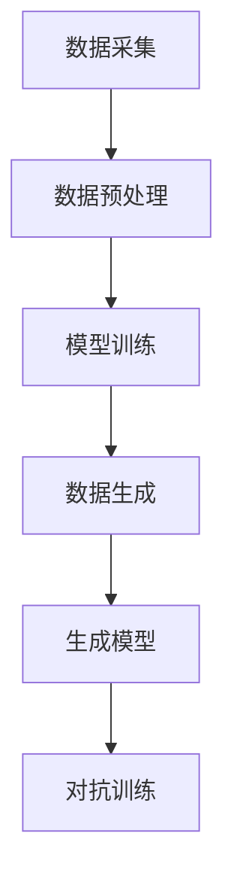

                 

关键词：生成式AI，泡沫，未来，理性分析，投资建议，技术趋势，人工智能

摘要：随着生成式人工智能（Generative AI）的迅猛发展，市场对其前景充满了期待与争议。本文将深入探讨生成式AI的技术原理、应用现状、潜在风险，并从理性分析的角度给出投资建议，帮助读者理解这一技术是否真的如泡沫般虚幻，还是未来的重要趋势。

## 1. 背景介绍

### 生成式AI的定义与发展

生成式人工智能，是指通过学习已有的数据，自动生成新的数据的人工智能技术。这类技术包括生成对抗网络（GANs）、变分自编码器（VAEs）、循环神经网络（RNNs）等。生成式AI在图像、音频、文本等多个领域取得了显著进展，例如通过GANs生成高质量的图像、利用VAEs进行数据去噪、通过RNNs生成连贯的文本内容。

### 生成式AI的重要性

生成式AI不仅在学术研究上具有重要意义，其商业应用潜力同样不可小觑。在图像识别、内容创作、智能制造等领域，生成式AI正逐渐成为提高效率、降低成本的重要工具。例如，生成式AI可以帮助企业自动化生产高质量的产品设计，或者创作个性化的广告内容，提升用户体验。

### 当前市场环境

近年来，随着科技的不断进步，生成式AI得到了大量资本的关注和投入。多家初创公司和大型科技企业都在竞相研发和推广生成式AI技术，导致市场上出现了大量相关产品和服务。这种趋势一方面推动了技术的快速发展，另一方面也引发了关于泡沫风险的讨论。

## 2. 核心概念与联系

### 生成式AI的原理

生成式AI的核心在于“生成”，即通过学习已有的数据，构建一个生成模型，从而生成新的数据。这通常涉及以下几个步骤：

1. **数据采集**：收集大量的训练数据，这些数据可以是图像、音频、文本等。
2. **数据预处理**：对数据进行清洗、归一化等处理，以使其适合训练模型。
3. **模型训练**：使用训练数据对生成模型进行训练，使其能够学会数据的分布。
4. **数据生成**：通过训练好的模型生成新的数据。

### 生成式AI的架构

生成式AI的常见架构包括生成对抗网络（GANs）和变分自编码器（VAEs）：

- **生成对抗网络（GANs）**：由一个生成器和一个小型判别器组成。生成器生成数据，判别器判断生成数据的真实性。通过这种对抗训练，生成器不断优化，生成越来越真实的数据。
  
- **变分自编码器（VAEs）**：通过编码器和解码器的结构，将输入数据映射到一个潜在空间，然后从潜在空间中采样，通过解码器生成新的数据。

### Mermaid流程图



## 3. 核心算法原理 & 具体操作步骤

### 3.1 算法原理概述

生成式AI的核心算法主要包括生成对抗网络（GANs）和变分自编码器（VAEs）。下面分别介绍这两种算法的基本原理。

#### 生成对抗网络（GANs）

GANs由两部分组成：生成器（Generator）和判别器（Discriminator）。

- **生成器**：生成器是一个神经网络，其目标是从随机噪声中生成数据，使其尽可能接近真实数据。
- **判别器**：判别器是一个神经网络，其目标是区分生成器和真实数据的差异。

通过对抗训练，生成器和判别器相互博弈，生成器不断优化，生成越来越真实的数据，而判别器则不断优化，提高对真实数据和生成数据的区分能力。

#### 变分自编码器（VAEs）

VAEs由编码器（Encoder）和解码器（Decoder）组成。

- **编码器**：编码器将输入数据映射到一个潜在的低维空间，这个空间中的点代表了输入数据的概率分布。
- **解码器**：解码器从潜在空间中采样，生成新的数据。

VAEs通过优化编码器和解码器的损失函数，使得生成的数据能够尽量符合输入数据的分布。

### 3.2 算法步骤详解

#### GANs的训练步骤

1. **初始化生成器和判别器**：随机初始化生成器和判别器。
2. **生成器训练**：生成器从随机噪声中生成数据，并将其输入到判别器。
3. **判别器训练**：判别器接收真实数据和生成数据，并判断其真实性。
4. **更新生成器和判别器**：根据判别器的判断结果，更新生成器和判别器。

#### VAEs的训练步骤

1. **编码器训练**：编码器将输入数据映射到潜在空间。
2. **解码器训练**：解码器从潜在空间中采样，生成新的数据。
3. **损失函数优化**：通过优化损失函数，使得编码器和解码器的输出尽可能接近输入数据。

### 3.3 算法优缺点

#### GANs的优点

- **生成数据质量高**：通过生成器和判别器的对抗训练，生成数据质量较高。
- **适用范围广**：GANs可以应用于多种数据类型，如图像、文本、音频等。

#### GANs的缺点

- **训练难度大**：GANs的训练不稳定，容易出现模式崩溃等问题。
- **计算资源消耗大**：GANs的训练需要大量的计算资源。

#### VAEs的优点

- **训练稳定**：VAEs的训练相对稳定，不容易出现模式崩溃。
- **生成数据质量较好**：通过潜在空间的映射，生成的数据质量较好。

#### VAEs的缺点

- **生成数据质量有限**：相比GANs，VAEs生成的数据质量有限。

### 3.4 算法应用领域

生成式AI在多个领域都有广泛的应用，包括：

- **图像生成**：利用GANs和VAEs生成高质量的图像。
- **数据增强**：通过生成式AI生成新的数据，用于训练模型。
- **内容创作**：利用生成式AI创作文本、音乐、视频等内容。

## 4. 数学模型和公式 & 详细讲解 & 举例说明

### 4.1 数学模型构建

生成式AI的核心在于构建生成模型和判别模型，这两者通常是基于神经网络实现的。

#### 生成模型

生成模型通常使用概率模型来描述数据分布，例如：

\[ P(x|\theta_G) = \text{Generator}(x|\theta_G) \]

其中，\( x \) 是生成模型生成的数据，\( \theta_G \) 是生成模型的参数。

#### 判别模型

判别模型用于判断生成数据是否真实，通常使用分类模型实现：

\[ P(y|x) = \text{Discriminator}(x) \]

其中，\( y \) 是判别模型判断的标签，取值为1（真实数据）或0（生成数据）。

### 4.2 公式推导过程

以GANs为例，生成模型和判别模型的优化过程可以通过以下公式描述：

\[ \theta_G = \arg\max_{\theta_G} \mathbb{E}_{x \sim P(x)}[\log \text{Discriminator}(x)] \]

\[ \theta_D = \arg\max_{\theta_D} \mathbb{E}_{x \sim P(x)}[\text{Discriminator}(x)] - \mathbb{E}_{z \sim Q(z|\theta_G)}[\text{Discriminator}(G(z))] \]

其中，\( \theta_G \) 和 \( \theta_D \) 分别是生成模型和判别模型的参数，\( z \) 是随机噪声，\( G(z) \) 是生成模型生成的数据。

### 4.3 案例分析与讲解

假设我们使用GANs生成手写数字图像，生成模型的输入是随机噪声，输出是手写数字图像，判别模型的输入是真实图像或生成图像，输出是概率值，表示输入图像的真实性。

**步骤1：初始化参数**

首先，随机初始化生成模型和判别模型的参数。

**步骤2：生成图像**

生成模型从随机噪声中生成手写数字图像。

**步骤3：判断图像真实性**

判别模型对真实图像和生成图像进行判断，输出概率值。

**步骤4：更新参数**

根据判别模型的结果，更新生成模型和判别模型的参数。

**步骤5：重复步骤2-4**

不断重复生成图像、判断图像真实性和更新参数的过程，直到生成模型生成的图像质量达到预期。

通过这个案例，我们可以看到生成式AI的数学模型和优化过程是如何运作的。

## 5. 项目实践：代码实例和详细解释说明

### 5.1 开发环境搭建

为了实现生成式AI的项目，我们需要搭建一个合适的开发环境。以下是一个简单的搭建步骤：

1. **安装Python环境**：确保Python版本在3.6及以上。
2. **安装TensorFlow**：使用pip安装TensorFlow，命令如下：

\[ pip install tensorflow \]

3. **安装其他依赖**：根据项目需要，可能还需要安装其他依赖库，如NumPy、Pandas等。

### 5.2 源代码详细实现

下面是一个简单的生成式AI项目，使用GANs生成手写数字图像。

```python
import tensorflow as tf
from tensorflow.keras import layers

# 生成器模型
def generator_model(z, latent_dim):
    model = tf.keras.Sequential([
        layers.Dense(128, activation='relu', input_shape=(latent_dim,)),
        layers.Dense(128, activation='relu'),
        layers.Dense(784, activation='tanh')
    ])
    return model

# 判别器模型
def discriminator_model(x):
    model = tf.keras.Sequential([
        layers.Flatten(input_shape=(28, 28)),
        layers.Dense(128, activation='relu'),
        layers.Dense(1, activation='sigmoid')
    ])
    return model

# GAN模型
def gans_model(generator, discriminator):
    model = tf.keras.Sequential([generator, discriminator])
    return model

# 搭建模型
generator = generator_model(z, latent_dim=100)
discriminator = discriminator_model(x)
gans = gans_model(generator, discriminator)

# 编译模型
gans.compile(loss='binary_crossentropy', optimizer=tf.keras.optimizers.Adam(0.0001))

# 训练模型
gans.fit([x_train, z_train], epochs=epochs, batch_size=batch_size)
```

### 5.3 代码解读与分析

上面的代码实现了使用GANs生成手写数字图像的基本流程。以下是代码的详细解读：

1. **导入库**：首先，导入所需的库，包括TensorFlow。

2. **定义生成器模型**：生成器模型用于将随机噪声映射到手写数字图像。

3. **定义判别器模型**：判别器模型用于判断输入图像是真实图像还是生成图像。

4. **定义GAN模型**：GAN模型是将生成器和判别器串联起来的整体模型。

5. **编译模型**：编译模型，设置损失函数和优化器。

6. **训练模型**：使用训练数据训练模型。

### 5.4 运行结果展示

训练完成后，我们可以使用生成器生成手写数字图像，并观察其质量。

```python
# 生成手写数字图像
z = tf.random.normal([batch_size, latent_dim])
generated_images = generator.predict(z)

# 显示生成图像
import matplotlib.pyplot as plt
plt.figure(figsize=(10, 10))
for i in range(batch_size):
    plt.subplot(1, batch_size, i + 1)
    plt.imshow(generated_images[i, :, :, 0], cmap='gray')
plt.show()
```

通过上面的代码，我们可以生成手写数字图像，并使用matplotlib库进行可视化展示。

## 6. 实际应用场景

### 6.1 图像生成

生成式AI在图像生成领域具有广泛的应用，例如：

- **艺术创作**：艺术家可以利用生成式AI创作独特的艺术作品。
- **游戏开发**：游戏开发者可以使用生成式AI生成游戏环境、角色和场景。
- **图像修复**：生成式AI可以用于修复受损的图像，恢复其原始面貌。

### 6.2 数据增强

数据增强是生成式AI的重要应用之一，特别是在机器学习领域。通过生成式AI生成新的数据，可以丰富训练数据集，提高模型的泛化能力。

### 6.3 内容创作

生成式AI在内容创作方面也表现出强大的潜力，例如：

- **文本生成**：生成式AI可以自动生成文章、报告、诗歌等文本内容。
- **音乐创作**：生成式AI可以生成新的音乐作品，为音乐创作者提供灵感。

### 6.4 未来应用展望

随着生成式AI技术的不断成熟，其在更多领域的应用前景将更加广阔。例如：

- **个性化推荐**：生成式AI可以用于个性化推荐系统，为用户提供定制化的产品和服务。
- **自动驾驶**：生成式AI可以用于自动驾驶系统，生成道路场景的实时数据，提高自动驾驶的准确性。

## 7. 工具和资源推荐

### 7.1 学习资源推荐

- **《深度学习》**：由Ian Goodfellow等编写的深度学习经典教材，适合初学者和进阶者。
- **[TensorFlow官方文档](https://www.tensorflow.org/tutorials)**
- **[Kaggle数据集](https://www.kaggle.com/datasets)**：提供丰富的数据集，适合进行机器学习和生成式AI实践。

### 7.2 开发工具推荐

- **Google Colab**：免费的云计算平台，适合进行深度学习和生成式AI的开发。
- **Jupyter Notebook**：强大的交互式开发环境，适合进行数据分析和模型训练。

### 7.3 相关论文推荐

- **"Generative Adversarial Nets"**：Ian Goodfellow等人提出的GANs的原始论文。
- **"Unsupervised Representation Learning with Deep Convolutional Generative Adversarial Networks"**：由Alec Radford等人提出的深度卷积生成对抗网络（DCGAN）。

## 8. 总结：未来发展趋势与挑战

### 8.1 研究成果总结

生成式AI在过去几年取得了显著的成果，不仅在学术研究上有所突破，在商业应用中也有广泛的应用。例如，GANs在图像生成和图像修复领域取得了优异的性能，VAEs在数据去噪和图像生成方面表现出强大的潜力。

### 8.2 未来发展趋势

随着技术的不断进步，生成式AI在未来将有望在更多领域得到应用。例如：

- **医疗领域**：生成式AI可以用于生成医学图像、预测疾病等。
- **金融领域**：生成式AI可以用于风险管理、股票预测等。

### 8.3 面临的挑战

尽管生成式AI具有巨大的潜力，但也面临一些挑战：

- **计算资源消耗**：生成式AI的训练通常需要大量的计算资源，这对硬件设施提出了高要求。
- **数据隐私**：生成式AI在生成新数据时可能会泄露原始数据的隐私信息，这对数据安全提出了挑战。

### 8.4 研究展望

未来，生成式AI的研究将朝着以下几个方向展开：

- **优化算法**：继续探索更高效、更稳定的生成式AI算法。
- **跨模态生成**：研究如何将不同模态的数据（如图像、文本、音频）进行联合生成。
- **应用拓展**：探索生成式AI在更多领域的应用，提高其商业价值。

## 9. 附录：常见问题与解答

### 问题1：什么是生成式AI？

**回答**：生成式AI是指通过学习已有的数据，自动生成新的数据的人工智能技术。常见的生成式AI模型包括生成对抗网络（GANs）、变分自编码器（VAEs）等。

### 问题2：生成式AI有哪些应用？

**回答**：生成式AI在图像生成、数据增强、内容创作等多个领域都有广泛的应用。例如，生成式AI可以用于生成高质量的图像、增强训练数据集、自动创作文本和音乐等。

### 问题3：生成式AI如何工作？

**回答**：生成式AI通常通过以下步骤工作：

1. 数据采集：收集大量的训练数据。
2. 数据预处理：对数据进行清洗、归一化等处理。
3. 模型训练：使用训练数据对生成模型进行训练。
4. 数据生成：通过训练好的模型生成新的数据。

### 问题4：生成式AI有哪些挑战？

**回答**：生成式AI面临的主要挑战包括计算资源消耗、数据隐私、模型稳定性等。此外，如何提高生成数据的质量和多样性也是重要的研究方向。

### 问题5：如何开始学习生成式AI？

**回答**：要开始学习生成式AI，可以从以下几步入手：

1. 学习基础：掌握Python编程和深度学习基础知识。
2. 阅读教材：阅读《深度学习》、《生成式模型导论》等教材。
3. 实践项目：通过实践项目加深对生成式AI的理解。
4. 学习资源：关注TensorFlow、Keras等开源框架的官方文档和社区资源。

## 参考文献

- Goodfellow, I. J., Pouget-Abadie, J., Mirza, M., Xu, B., Warde-Farley, D., Ozair, S., ... & Bengio, Y. (2014). Generative adversarial nets. Advances in neural information processing systems, 27.
- Kingma, D. P., & Welling, M. (2013). Auto-encoding variational bayes. arXiv preprint arXiv:1312.6114.

