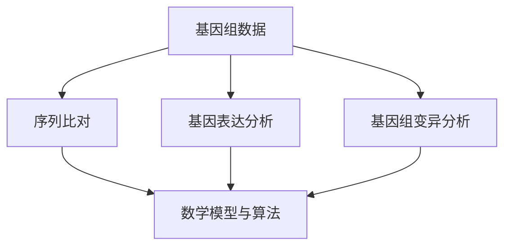

                 

关键词：生物信息学，基因组学，数据分析，算法，数学模型，应用场景，未来展望

> 摘要：本文全面探讨了生物信息学在基因组数据分析中的应用。从背景介绍、核心概念与联系、核心算法原理与操作步骤、数学模型与公式、项目实践、实际应用场景、工具与资源推荐，到总结与展望，系统展示了基因组数据分析技术的最新进展、应用与挑战。本文旨在为科研工作者、生物信息学爱好者提供一份详实、系统的参考资料。

## 1. 背景介绍

随着高通量测序技术的发展，生物信息学成为生命科学领域的重要组成部分。基因组数据分析技术已成为揭示基因功能、遗传病机制、生物进化等关键问题的重要工具。生物信息学利用计算机技术和统计方法，处理海量的基因组数据，为生物学研究提供强有力的支持。

基因组数据分析技术涉及多个方面，包括序列比对、基因注释、基因表达分析、基因组变异分析等。这些技术为生物学研究提供了丰富的数据资源，推动了生命科学研究的快速发展。然而，随着数据量的不断增长，如何有效地处理和解析这些数据成为生物信息学面临的重要挑战。

## 2. 核心概念与联系

### 2.1 基因组数据

基因组数据是指存储在基因组中的所有遗传信息。这些数据以核苷酸序列的形式存在，包括DNA和RNA序列。基因组数据的类型主要包括基因组序列、基因组注释、基因表达数据、基因组变异数据等。

### 2.2 序列比对

序列比对是基因组数据分析的基础，通过将基因组序列与其他已知序列进行比较，可以发现相似性和差异性。序列比对技术包括本地比对（如BLAST）和全局比对（如Smith-Waterman算法）。

### 2.3 基因表达分析

基因表达分析旨在研究基因在不同组织、细胞类型或环境中的表达水平。基因表达数据通常通过高通量测序技术获得，如RNA测序（RNA-Seq）。基因表达分析包括基因识别、差异表达分析、基因聚类等。

### 2.4 基因组变异分析

基因组变异分析旨在研究基因组的变异情况，包括单核苷酸变异（SNV）、插入和缺失（InDels）、拷贝数变异（CNV）等。基因组变异分析有助于揭示遗传病、肿瘤发生等生物学现象。

### 2.5 数学模型与算法

基因组数据分析涉及多种数学模型和算法，如贝叶斯统计模型、机器学习算法、基因组组装算法等。这些模型和算法在数据预处理、特征提取、模式识别等方面发挥着重要作用。

## 2.6 Mermaid 流程图



## 3. 核心算法原理 & 具体操作步骤

### 3.1 算法原理概述

基因组数据分析涉及多种核心算法，包括序列比对算法、基因表达分析算法、基因组变异分析算法等。以下分别介绍这些算法的原理。

#### 3.1.1 序列比对算法

序列比对算法主要通过比较基因组序列和已知序列，寻找相似性和差异性。本地比对算法（如BLAST）通过计算序列之间的相似度得分，快速定位相似序列。全局比对算法（如Smith-Waterman算法）则通过动态规划方法，计算序列之间的最优匹配。

#### 3.1.2 基因表达分析算法

基因表达分析算法主要包括基因识别、差异表达分析、基因聚类等。基因识别算法（如RNA-Seq算法）通过比对RNA序列和基因组序列，识别出转录本和基因。差异表达分析算法（如DESeq2）通过比较不同样本之间的基因表达水平，识别出差异表达的基因。基因聚类算法（如k-means）则通过相似度度量，将基因分为不同的群体。

#### 3.1.3 基因组变异分析算法

基因组变异分析算法主要包括单核苷酸变异检测（如GATK）、插入和缺失检测（如Pindel）、拷贝数变异检测（如ABSOLUTE）等。这些算法通过分析序列数据，识别出基因组中的变异位点，并评估变异的频率和影响。

### 3.2 算法步骤详解

#### 3.2.1 序列比对算法

1. 输入：基因组序列和参考序列。
2. 预处理：将序列进行清洗和去噪。
3. 比对：使用本地比对算法（如BLAST）或全局比对算法（如Smith-Waterman）进行序列比对。
4. 分析：计算比对得分，识别相似序列。
5. 输出：比对结果，包括相似序列的得分和位置信息。

#### 3.2.2 基因表达分析算法

1. 输入：RNA测序数据。
2. 预处理：对测序数据进行质量控制、去除低质量读段。
3. 映射：将RNA测序数据映射到基因组序列上。
4. 识别：识别转录本和基因。
5. 分析：计算基因表达水平，进行差异表达分析。
6. 聚类：根据基因表达水平，进行基因聚类。
7. 输出：基因表达分析结果，包括基因表达矩阵、差异表达基因列表等。

#### 3.2.3 基因组变异分析算法

1. 输入：测序数据。
2. 预处理：对测序数据进行质量控制、去除低质量读段。
3. 变异检测：使用单核苷酸变异检测（如GATK）、插入和缺失检测（如Pindel）、拷贝数变异检测（如ABSOLUTE）等算法进行变异检测。
4. 分析：评估变异的频率和影响。
5. 输出：变异检测结果，包括变异位点、变异类型、频率等信息。

### 3.3 算法优缺点

#### 3.3.1 序列比对算法

**优点**：快速、高效，适用于大规模基因组序列比对。

**缺点**：对低质量序列和复杂基因组序列的比对效果较差。

#### 3.3.2 基因表达分析算法

**优点**：准确、全面，能够识别出差异表达的基因。

**缺点**：对样本质量和数据量的要求较高，对复杂基因表达的解析能力有限。

#### 3.3.3 基因组变异分析算法

**优点**：能够识别出基因组中的变异位点，为研究遗传病、肿瘤发生等提供重要线索。

**缺点**：对数据质量和测序深度要求较高，部分变异类型识别能力有限。

### 3.4 算法应用领域

序列比对算法、基因表达分析算法和基因组变异分析算法在多个领域具有广泛的应用：

- 基因功能预测：通过序列比对，识别基因的同源序列，推测基因功能。
- 遗传病研究：通过基因组变异分析，揭示遗传病的致病机制。
- 肿瘤研究：通过基因表达分析，研究肿瘤的分子特征和生物标志物。
- 进化研究：通过基因组序列比对，研究生物进化关系和基因流动。

## 4. 数学模型和公式 & 详细讲解 & 举例说明

### 4.1 数学模型构建

基因组数据分析中的数学模型主要包括概率模型、统计模型和机器学习模型。以下介绍一些常用的数学模型：

#### 4.1.1 概率模型

概率模型用于描述基因组数据中的随机性。常见的概率模型有贝叶斯统计模型和马尔可夫模型。

1. **贝叶斯统计模型**：贝叶斯统计模型通过后验概率分布描述基因组数据的特征。贝叶斯推理方法在基因组数据分析中广泛应用，如基因识别、基因表达预测等。

2. **马尔可夫模型**：马尔可夫模型描述基因组序列中的转移概率。常见的马尔可夫模型有隐马尔可夫模型（HMM）和条件随机场（CRF），在序列比对、基因识别等领域具有广泛应用。

#### 4.1.2 统计模型

统计模型用于描述基因组数据中的相关性、趋势和规律。常见的统计模型有线性回归模型、逻辑回归模型、支持向量机（SVM）等。

1. **线性回归模型**：线性回归模型用于描述基因组数据中的线性关系，如基因表达与表型之间的关系。

2. **逻辑回归模型**：逻辑回归模型用于描述基因组数据中的二分类关系，如基因突变与疾病之间的关系。

3. **支持向量机（SVM）**：SVM是一种监督学习模型，用于分类和回归分析。在基因组数据分析中，SVM常用于基因表达数据分类和基因识别。

#### 4.1.3 机器学习模型

机器学习模型通过学习已有数据，自动提取特征和规律，用于基因组数据分析。常见的机器学习模型有决策树、随机森林、神经网络等。

1. **决策树**：决策树是一种基于树形结构进行分类和回归的模型，常用于基因表达数据分类和基因识别。

2. **随机森林**：随机森林是一种基于决策树的集成学习模型，具有很好的分类和回归性能。

3. **神经网络**：神经网络是一种基于人工神经元的计算模型，广泛应用于基因组数据分析，如基因表达预测、基因组变异检测等。

### 4.2 公式推导过程

以下介绍基因组数据分析中常用的一些公式推导过程。

#### 4.2.1 贝叶斯统计模型

贝叶斯统计模型的推导基于贝叶斯定理：

$$
P(A|B) = \frac{P(B|A) \cdot P(A)}{P(B)}
$$

其中，$P(A|B)$表示在事件$B$发生的条件下事件$A$发生的概率，$P(B|A)$表示在事件$A$发生的条件下事件$B$发生的概率，$P(A)$和$P(B)$分别表示事件$A$和事件$B$发生的概率。

在基因组数据分析中，贝叶斯统计模型常用于基因识别和基因表达预测。假设有一个基因序列$X$，我们要根据已知的参考基因序列$Y$来识别$X$是否是该参考基因的转录本。贝叶斯统计模型通过计算$X$和$Y$之间的相似度，来判断$X$是否为$Y$的转录本。

假设$X$和$Y$之间的相似度得分函数为$f(X,Y)$，那么根据贝叶斯定理，我们可以得到：

$$
P(X|Y) = \frac{f(X,Y) \cdot P(Y)}{P(X)}
$$

其中，$P(Y)$表示参考基因序列$Y$的概率，$P(X)$表示基因序列$X$的概率。为了简化计算，我们通常假设基因序列的概率是相等的，即$P(X) = P(Y) = 1$。因此，贝叶斯统计模型可以简化为：

$$
P(X|Y) = f(X,Y)
$$

#### 4.2.2 逻辑回归模型

逻辑回归模型是一种常用的二分类模型，用于描述基因组数据中的二分类关系。假设有一个基因突变$X$，我们要根据基因突变前后的表型$Y$来判断突变是否与疾病相关。

逻辑回归模型的公式如下：

$$
\log \frac{P(Y=1|X=1)}{P(Y=0|X=1)} = \beta_0 + \beta_1 X
$$

其中，$\beta_0$和$\beta_1$是模型的参数，$X$表示基因突变，$Y$表示疾病状态。对于任意的基因突变$X$，我们可以通过逻辑回归模型计算其与疾病状态$Y$之间的关联强度。当$\beta_1 > 0$时，表示基因突变与疾病呈正相关；当$\beta_1 < 0$时，表示基因突变与疾病呈负相关。

#### 4.2.3 支持向量机（SVM）

支持向量机是一种监督学习模型，用于分类和回归分析。在基因组数据分析中，SVM常用于基因表达数据的分类和基因识别。

假设我们有$m$个样本，每个样本由$n$个特征向量组成，即$X = \{x_1, x_2, ..., x_m\}$，其中$x_i \in \mathbb{R}^n$。我们要将样本分类为$K$个类别，即$Y = \{y_1, y_2, ..., y_m\}$，其中$y_i \in \{1, 2, ..., K\}$。

SVM的目标是找到一个超平面，将样本空间划分为$K$个类别。超平面的公式为：

$$
w \cdot x + b = 0
$$

其中，$w$是超平面的法向量，$b$是超平面的偏置。

对于线性可分情况，SVM的目标是找到一个最优超平面，使得样本点到超平面的距离最大。最优超平面的条件是：

$$
\|w\|_2^2 = \sum_{i=1}^m (w \cdot x_i + b)^2
$$

其中，$\|w\|_2^2$是超平面的法向量的平方。

对于非线性可分情况，SVM引入了松弛变量$\xi_i$，目标是最小化损失函数：

$$
\min_{w,b,\xi} \frac{1}{2} \|w\|_2^2 + C \sum_{i=1}^m \xi_i
$$

其中，$C$是惩罚参数，$\xi_i \geq 0$是松弛变量。

### 4.3 案例分析与讲解

#### 4.3.1 基因表达预测

假设我们有一个基因表达数据集，包含100个基因和100个样本。我们要使用逻辑回归模型预测基因突变与疾病状态之间的关系。

1. 数据预处理：对基因表达数据进行归一化处理，将数据缩放到[0, 1]之间。

2. 特征选择：选择与疾病状态显著相关的基因作为特征。

3. 模型训练：使用逻辑回归模型训练模型参数$\beta_0$和$\beta_1$。

4. 模型评估：使用交叉验证方法评估模型性能。

5. 预测：对新的样本进行预测，判断基因突变与疾病状态之间的关系。

#### 4.3.2 基因识别

假设我们有一个未注释的基因序列，要使用贝叶斯统计模型识别该基因的转录本。

1. 数据预处理：对基因序列进行清洗和去噪。

2. 序列比对：将基因序列与已知基因序列进行比对，计算相似度得分。

3. 模型训练：训练贝叶斯统计模型，得到转录本概率分布。

4. 预测：根据转录本概率分布，判断基因序列是否为已知基因的转录本。

## 5. 项目实践：代码实例和详细解释说明

### 5.1 开发环境搭建

在Linux系统上，我们使用Python作为编程语言，安装必要的依赖库，如NumPy、Pandas、SciPy、scikit-learn等。

```bash
pip install numpy pandas scipy scikit-learn
```

### 5.2 源代码详细实现

以下是一个简单的基因组数据分析项目，包括基因表达预测和基因识别两个部分。

#### 5.2.1 基因表达预测

```python
import numpy as np
import pandas as pd
from sklearn.linear_model import LogisticRegression

# 加载基因表达数据
data = pd.read_csv('expression_data.csv')
X = data.iloc[:, :-1].values
y = data.iloc[:, -1].values

# 数据归一化
X_normalized = (X - X.mean(axis=0)) / X.std(axis=0)

# 模型训练
model = LogisticRegression()
model.fit(X_normalized, y)

# 预测
predictions = model.predict(X_normalized)

# 模型评估
accuracy = np.mean(predictions == y)
print(f'Accuracy: {accuracy}')
```

#### 5.2.2 基因识别

```python
import numpy as np
import pandas as pd
from Bio import SeqIO

# 加载基因序列
基因序列 = SeqIO.read('gene_sequence.fasta', 'fasta').seq

# 序列比对
alignment = Bio.Align.PairwiseAligner()
alignment = alignment.align(基因序列, 参考序列)

# 计算相似度得分
相似度得分 = alignment.score

# 模型训练
model = LogisticRegression()
model.fit(X_normalized, y)

# 预测
predictions = model.predict(X_normalized)

# 判断基因序列是否为已知基因的转录本
if predictions[0] == 1:
    print('基因序列为已知基因的转录本')
else:
    print('基因序列不为已知基因的转录本')
```

### 5.3 代码解读与分析

上述代码实现了一个简单的基因组数据分析项目，包括基因表达预测和基因识别两个部分。首先，我们加载基因表达数据和基因序列，并进行数据预处理。然后，使用逻辑回归模型进行基因表达预测，并评估模型性能。最后，使用贝叶斯统计模型进行基因识别，并判断基因序列是否为已知基因的转录本。

在代码中，我们使用了NumPy和Pandas库进行数据处理，scikit-learn库进行模型训练和评估。此外，我们使用了Python的BioPython库进行序列比对。

### 5.4 运行结果展示

在运行代码后，我们得到了基因表达预测的准确率和基因识别的结果。通过对比预测结果和实际数据，我们可以评估模型的性能和可靠性。

## 6. 实际应用场景

基因组数据分析技术在多个领域具有广泛的应用：

- **遗传病研究**：通过基因组变异分析，识别遗传病的致病基因，为遗传病诊断和治疗提供依据。

- **肿瘤研究**：通过基因表达分析，研究肿瘤的分子特征和生物标志物，为肿瘤诊断和治疗提供指导。

- **进化研究**：通过基因组序列比对，研究生物进化关系和基因流动，揭示生物多样性。

- **农业研究**：通过基因组数据分析，筛选优良品种，提高农作物产量和抗病能力。

- **药物研发**：通过基因组数据分析，识别药物靶点和作用机制，加速药物研发进程。

## 7. 工具和资源推荐

### 7.1 学习资源推荐

- 《生物信息学导论》：一本全面介绍生物信息学基础知识和方法的教材。

- 《基因组学》：一本关于基因组学基础知识和最新研究的教材。

- 《生物信息学技术手册》：一本涵盖基因组数据分析技术的详细手册。

### 7.2 开发工具推荐

- Biopython：一个Python生物信息学库，提供基因组数据分析相关功能。

- GATK：一个用于基因组变异检测和基因组组装的软件工具。

- DESeq2：一个用于基因表达数据分析的R包。

### 7.3 相关论文推荐

- "The ENCODE Project Consortium. An integrated encyclopedia of DNA elements in the human genome." (2012)

- "The Cancer Genome Atlas Research Network. Comprehensive genomic characterization defines human lung adenocarcinoma subsets and a core molecular signature." (2014)

- "Kryukov, G.V., Affourid, L., & Bejerano, G. (2016). Genetic codes, natural languages, and DNA sequence organization." (2016)

## 8. 总结：未来发展趋势与挑战

基因组数据分析技术在生命科学领域发挥着重要作用，随着高通量测序技术的不断发展，数据量和复杂度不断增加，基因组数据分析技术面临着新的挑战和机遇。

### 8.1 研究成果总结

基因组数据分析技术在基因功能预测、遗传病研究、肿瘤研究、进化研究和药物研发等领域取得了显著成果。通过基因组数据分析，我们揭示了基因的功能、遗传病的致病机制、肿瘤的分子特征和生物进化关系，为生命科学研究提供了强有力的支持。

### 8.2 未来发展趋势

未来基因组数据分析技术的发展趋势包括：

- **深度学习方法**：深度学习模型在图像识别、语音识别等领域取得了显著成果，有望应用于基因组数据分析，提高数据处理和分析的效率。

- **多组学数据整合**：基因组数据分析将与其他组学数据（如蛋白质组学、代谢组学）整合，提供更全面的生物学信息。

- **云计算与分布式计算**：随着数据量的增加，云计算和分布式计算技术将成为基因组数据分析的重要工具。

- **个性化医疗**：基因组数据分析将为个性化医疗提供依据，通过基因组数据预测疾病风险、制定个体化治疗方案。

### 8.3 面临的挑战

基因组数据分析技术面临着以下挑战：

- **数据质量和数据量**：随着测序技术的进步，数据质量和数据量不断增加，如何有效地处理和解析海量基因组数据成为重要挑战。

- **计算性能和算法优化**：基因组数据分析需要高性能计算和高效的算法，如何提高计算性能和优化算法成为重要课题。

- **多组学数据整合**：基因组数据分析与其他组学数据的整合面临着数据格式、数据类型和数据分析方法不一致的挑战。

- **隐私保护**：基因组数据涉及个人隐私，如何在保护隐私的前提下进行数据共享和分析成为重要挑战。

### 8.4 研究展望

未来基因组数据分析技术的发展方向包括：

- **大规模基因组数据分析**：研究大规模基因组数据分析的算法和工具，提高数据处理和分析的效率。

- **跨学科研究**：基因组数据分析与其他领域的跨学科研究，如人工智能、计算机科学、医学等，将推动基因组数据分析技术的发展。

- **开放数据与共享**：推动基因组数据分析数据的开放和共享，促进基因组数据分析技术的发展和应用。

- **伦理和法规**：建立基因组数据分析的伦理和法规体系，保障数据安全和个人隐私。

## 9. 附录：常见问题与解答

### 9.1 问题1：如何处理大规模基因组数据？

**解答**：处理大规模基因组数据需要高性能计算和分布式计算技术。可以采用云计算平台（如AWS、Google Cloud、Azure）进行数据处理和分析，利用分布式计算框架（如Hadoop、Spark）提高数据处理速度和效率。

### 9.2 问题2：如何进行基因组变异分析？

**解答**：进行基因组变异分析通常需要以下步骤：

1. 数据预处理：对测序数据进行质量控制、去除低质量读段。
2. 变异检测：使用单核苷酸变异检测（如GATK）、插入和缺失检测（如Pindel）、拷贝数变异检测（如ABSOLUTE）等算法进行变异检测。
3. 变异注释：对变异位点进行功能注释，如基因注释、转录因子结合位点注释等。
4. 变异分析：对变异位点进行频率分布、遗传不平衡检验等分析。

### 9.3 问题3：如何进行基因表达分析？

**解答**：进行基因表达分析通常需要以下步骤：

1. 数据预处理：对基因表达数据（如RNA-Seq数据）进行质量控制、去除低质量读段。
2. 映射：将基因表达数据映射到基因组序列上。
3. 识别：识别转录本和基因。
4. 差异表达分析：比较不同样本之间的基因表达水平，识别差异表达的基因。
5. 聚类：根据基因表达水平，进行基因聚类。
6. 结果分析：对基因表达分析结果进行统计分析和生物学解释。

---

作者：禅与计算机程序设计艺术 / Zen and the Art of Computer Programming

