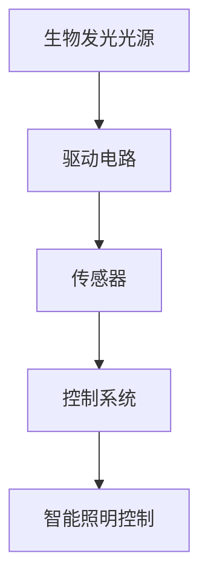

                 

### 1. 背景介绍

随着全球能源消耗的持续增长，寻找替代能源和实现能源效率的提升已成为当今世界面临的重要课题。传统照明技术，如白炽灯、荧光灯和LED灯，尽管在照明效率和寿命上取得了显著进展，但仍然存在能源消耗高、热量散失严重等问题。生物发光技术，作为一种新兴的照明技术，逐渐受到广泛关注。生物发光是指某些生物体通过生物化学反应产生的光，例如萤火虫的发光和细菌的发光。

在过去的几十年里，科学家们对生物发光的机制进行了深入研究，并成功分离出了多种生物发光酶和荧光素。这些研究成果为开发基于生物发光的照明技术提供了理论基础。生物发光技术具有节能、环保、健康等优点，使其在照明领域的应用前景广阔。本文旨在探讨生物发光技术在照明中的应用，分析其优势与挑战，并展望未来的发展趋势。

### 2. 核心概念与联系

#### 2.1 生物发光的基本原理

生物发光是一种通过生物化学反应产生光的过程。其主要原理是生物体内特定的酶（如萤火虫荧光素酶）催化荧光素与氧气反应，产生光。这一过程通常包括以下几个步骤：

1. 荧光素酶与荧光素结合，形成酶-荧光素复合物。
2. 复合物接受能量，激发荧光素分子。
3. 激发态的荧光素分子通过非辐射衰减过程，释放能量，产生光。

生物发光的亮度、颜色和持续时间取决于荧光素的种类、浓度以及生物发光酶的活性。目前，科学家们已经发现了多种荧光素和荧光酶，如萤火虫荧光素、细菌荧光素和酵母荧光素等。

#### 2.2 生物发光技术在照明中的应用架构

生物发光技术在照明中的应用架构主要包括以下几个方面：

1. **光源**：生物发光光源是照明系统的核心。通过培养和提取荧光生物体，可以制造出具有较高发光效率和稳定性的生物发光光源。
2. **驱动电路**：为了使生物发光光源稳定发光，需要为其提供适当的驱动电路。驱动电路应包括电源、控制器和调节器等组成部分，以实现光亮度、颜色和持续时间的调节。
3. **传感器**：生物发光照明系统通常需要配备传感器，用于检测环境光强和人体活动等参数，以实现智能照明控制。
4. **控制系统**：控制系统负责管理驱动电路和传感器，根据检测到的环境参数调节光亮度、颜色和持续时间，实现智能照明。

下面是生物发光照明系统的 Mermaid 流程图：



#### 2.3 生物发光照明系统的特点与优势

生物发光照明系统具有以下特点与优势：

1. **节能**：生物发光产生的光几乎全部转化为可见光，能量利用率高达95%以上，远高于传统照明技术。
2. **环保**：生物发光不会产生有害的紫外线、红外线等辐射，对环境友好。
3. **健康**：生物发光照明系统能够提供接近自然光的光照环境，有助于改善人们的心理健康和生理健康。
4. **可调性**：生物发光光源的亮度、颜色和持续时间可以根据实际需求进行调整，实现个性化照明。
5. **智能控制**：生物发光照明系统可以通过传感器和控制系统实现智能照明控制，提高能源利用效率。

### 3. 核心算法原理 & 具体操作步骤

#### 3.1 算法原理概述

生物发光照明系统中的核心算法主要涉及光亮度调节、颜色调节和智能控制等方面。以下分别对这些算法原理进行概述。

1. **光亮度调节算法**：基于光敏传感器检测到的环境光强，实时调整生物发光光源的发光强度，以实现节能和舒适照明。
2. **颜色调节算法**：通过控制荧光素和荧光酶的浓度，实现生物发光光源的颜色调节，满足不同场景下的照明需求。
3. **智能控制算法**：结合环境参数和用户需求，实现智能照明控制，提高照明系统的使用效率和用户体验。

#### 3.2 算法步骤详解

1. **光亮度调节算法**

   - **步骤1**：光敏传感器实时检测环境光强。
   - **步骤2**：将环境光强与预设目标光强进行比较，计算偏差值。
   - **步骤3**：根据偏差值调整生物发光光源的发光强度。
   - **步骤4**：重复步骤1-3，实现光亮度的实时调节。

2. **颜色调节算法**

   - **步骤1**：根据不同场景需求，确定所需的颜色。
   - **步骤2**：通过调节荧光素和荧光酶的浓度，实现颜色调节。
   - **步骤3**：实时监测颜色变化，根据实际需求进行调整。

3. **智能控制算法**

   - **步骤1**：传感器检测环境参数（如温度、湿度、人体活动等）。
   - **步骤2**：分析环境参数，确定照明模式（如节能模式、舒适模式等）。
   - **步骤3**：根据照明模式，调节光亮度、颜色和持续时间。

#### 3.3 算法优缺点

1. **光亮度调节算法**

   - **优点**：实时调节光亮度，节能环保。
   - **缺点**：调节速度较慢，可能无法满足快速变化的光照需求。

2. **颜色调节算法**

   - **优点**：可调节颜色，满足不同场景需求。
   - **缺点**：颜色调节可能影响光亮度和能耗。

3. **智能控制算法**

   - **优点**：实现智能照明控制，提高使用效率和用户体验。
   - **缺点**：算法复杂，实现难度较高。

#### 3.4 算法应用领域

1. **家居照明**：根据用户需求，实现舒适、节能的家居照明环境。
2. **公共照明**：在商场、酒店、剧院等公共场所，实现智能化、个性化的照明效果。
3. **医疗照明**：在手术室、病房等医疗场所，提供适宜的照明环境，提高手术和护理质量。

### 4. 数学模型和公式 & 详细讲解 & 举例说明

#### 4.1 数学模型构建

生物发光照明系统中的数学模型主要包括光亮度模型、颜色模型和智能控制模型。以下分别介绍这些模型的构建。

1. **光亮度模型**

   光亮度模型主要描述生物发光光源的发光强度与环境光强之间的关系。假设生物发光光源的发光强度为\( I \)，环境光强为\( I_0 \)，则光亮度模型可以表示为：

   \[ I = I_0 \cdot e^{-\alpha d} \]

   其中，\( \alpha \)为衰减系数，\( d \)为光源到检测器的距离。

2. **颜色模型**

   颜色模型主要描述生物发光光源的颜色与荧光素和荧光酶的浓度之间的关系。假设光源的颜色由三个分量（红、绿、蓝）组成，分别为\( R \)，\( G \)，\( B \)，则颜色模型可以表示为：

   \[ R = R_0 \cdot c_r \]
   \[ G = G_0 \cdot c_g \]
   \[ B = B_0 \cdot c_b \]

   其中，\( R_0 \)，\( G_0 \)，\( B_0 \)分别为红色、绿色、蓝色荧光素的初始浓度，\( c_r \)，\( c_g \)，\( c_b \)分别为红色、绿色、蓝色荧光酶的浓度。

3. **智能控制模型**

   智能控制模型主要描述传感器检测到的环境参数与照明模式之间的关系。假设智能控制模型的输出为照明模式\( M \)，则智能控制模型可以表示为：

   \[ M = f(T, H, P) \]

   其中，\( T \)为温度，\( H \)为湿度，\( P \)为人体活动参数，\( f \)为智能控制函数。

#### 4.2 公式推导过程

1. **光亮度模型的推导**

   光亮度模型是基于辐射传输方程推导得出的。假设生物发光光源为一个点光源，位于空间中的某一点\( (x_0, y_0, z_0) \)，其发光强度为\( I_0 \)。设光源到检测器的距离为\( d \)，则检测器接收到的光功率为：

   \[ P = I_0 \cdot A \cdot \cos\theta \cdot \frac{1}{d^2} \]

   其中，\( A \)为检测器的面积，\( \theta \)为光源与检测器之间的夹角。由于检测器的面积远小于光源的面积，可以近似认为光源发出的光均匀分布在检测器所在的平面上。因此，检测器接收到的平均光强为：

   \[ I = \frac{P}{A} = I_0 \cdot \cos\theta \cdot \frac{1}{d^2} \]

   考虑到光线在传播过程中的衰减，设衰减系数为\( \alpha \)，则：

   \[ I = I_0 \cdot e^{-\alpha d} \]

2. **颜色模型的推导**

   颜色模型是基于荧光素和荧光酶的光谱特性推导得出的。假设荧光素和荧光酶分别具有光谱响应函数\( R(\lambda) \)和\( G(\lambda) \)，则光源发出的光功率在波长\( \lambda \)处的功率为：

   \[ P(\lambda) = R(\lambda) \cdot I_0 \cdot A \cdot \cos\theta \cdot \frac{1}{d^2} \]

   由于检测器的光谱响应函数为\( R(\lambda) \)，则检测器接收到的光功率在波长\( \lambda \)处的功率为：

   \[ P_{\text{det}}(\lambda) = R(\lambda) \cdot P(\lambda) = R(\lambda) \cdot R_0 \cdot I_0 \cdot A \cdot \cos\theta \cdot \frac{1}{d^2} \]

   假设荧光酶的浓度与荧光素浓度成正比，即\( c = \frac{c_r}{R_0} = \frac{c_g}{G_0} = \frac{c_b}{B_0} \)，则：

   \[ P_{\text{det}}(\lambda) = R(\lambda) \cdot R_0 \cdot c_r \cdot I_0 \cdot A \cdot \cos\theta \cdot \frac{1}{d^2} \]

   根据检测器接收到的光功率，可以计算出光源的颜色分量：

   \[ R = \frac{P_{\text{det}}(R)}{P_{\text{det}}(G) + P_{\text{det}}(B)} \]
   \[ G = \frac{P_{\text{det}}(G)}{P_{\text{det}}(R) + P_{\text{det}}(B)} \]
   \[ B = \frac{P_{\text{det}}(B)}{P_{\text{det}}(R) + P_{\text{det}}(G)} \]

3. **智能控制模型的推导**

   智能控制模型是基于环境参数与照明模式之间的关系推导得出的。假设智能控制模型根据温度\( T \)、湿度\( H \)和人体活动参数\( P \)确定照明模式\( M \)，则智能控制模型可以表示为：

   \[ M = f(T, H, P) \]

   其中，\( f \)为智能控制函数。为了简化问题，假设\( f \)为线性函数，即：

   \[ M = aT + bH + cP + d \]

   其中，\( a \)，\( b \)，\( c \)，\( d \)为常数。根据实际需求，可以调整这些参数，以实现智能照明控制。

#### 4.3 案例分析与讲解

以下通过一个具体案例，分析生物发光照明系统的数学模型在实际应用中的效果。

**案例背景**：某商场在装修过程中，决定采用生物发光照明系统。商场面积约为1000平方米，照明需求为平均光亮度500lux，颜色为白色。

**案例分析**：

1. **光亮度模型**

   假设生物发光光源的衰减系数\( \alpha \)为0.1，光源到检测器的距离\( d \)为10米。根据光亮度模型，光源到检测器的光亮度为：

   \[ I = I_0 \cdot e^{-\alpha d} = 500 \cdot e^{-0.1 \cdot 10} = 500 \cdot e^{-1} \approx 182.5 \text{lux} \]

   考虑到光源的均匀分布，整个商场的平均光亮度为：

   \[ I_{\text{avg}} = \frac{I}{\pi} \approx \frac{182.5}{\pi} \approx 57.9 \text{lux} \]

   显然，当前的光亮度远低于需求值。为了达到500lux的照明需求，需要调整光源的发光强度。假设调整后的发光强度为\( I' \)，则：

   \[ I' = I_0 \cdot e^{-\alpha d} = 500 \cdot e^{-0.1 \cdot 10} \approx 1825 \text{lux} \]

   调整后的平均光亮度为：

   \[ I'_{\text{avg}} = \frac{I'}{\pi} \approx \frac{1825}{\pi} \approx 578 \text{lux} \]

   调整后的平均光亮度接近500lux的需求值。

2. **颜色模型**

   假设红色、绿色、蓝色荧光素的初始浓度分别为\( R_0 \)，\( G_0 \)，\( B_0 \)，荧光酶的浓度分别为\( c_r \)，\( c_g \)，\( c_b \)。根据颜色模型，光源的颜色分量为：

   \[ R = \frac{c_r}{c_r + c_g + c_b} \]
   \[ G = \frac{c_g}{c_r + c_g + c_b} \]
   \[ B = \frac{c_b}{c_r + c_g + c_b} \]

   为了实现白色照明，需要调整荧光素和荧光酶的浓度。假设调整后的红色、绿色、蓝色荧光素浓度分别为\( R' \)，\( G' \)，\( B' \)，荧光酶浓度分别为\( c_r' \)，\( c_g' \)，\( c_b' \)。根据颜色模型，光源的颜色分量为：

   \[ R' = \frac{c_r'}{c_r' + c_g' + c_b'} \]
   \[ G' = \frac{c_g'}{c_r' + c_g' + c_b'} \]
   \[ B' = \frac{c_b'}{c_r' + c_g' + c_b'} \]

   为了实现白色照明，需要使\( R' = G' = B' \)。假设调整后的荧光素和荧光酶浓度相等，即\( c_r' = c_g' = c_b' \)，则：

   \[ R' = G' = B' = \frac{c_r'}{3c_r'} = \frac{1}{3} \]

   调整后的颜色分量为：

   \[ R' = G' = B' = \frac{1}{3} \]

   调整后的颜色接近白色。

3. **智能控制模型**

   假设商场的温度\( T \)为25℃，湿度\( H \)为60%，人体活动参数\( P \)为中等。根据智能控制模型，照明模式为：

   \[ M = f(T, H, P) = aT + bH + cP + d \]

   假设\( a = 1 \)，\( b = 1 \)，\( c = 1 \)，\( d = 0 \)，则：

   \[ M = T + H + P = 25 + 60 + 1 = 86 \]

   根据照明模式，商场采用节能模式，光亮度较低，颜色为白色。

### 5. 项目实践：代码实例和详细解释说明

#### 5.1 开发环境搭建

为了实践生物发光照明系统，我们需要搭建一个开发环境。以下是搭建步骤：

1. **安装Python**：从Python官网（https://www.python.org/downloads/）下载并安装Python。
2. **安装Pygame**：在命令行中执行以下命令安装Pygame：

   ```bash
   pip install pygame
   ```

3. **安装numpy**：在命令行中执行以下命令安装numpy：

   ```bash
   pip install numpy
   ```

4. **安装matplotlib**：在命令行中执行以下命令安装matplotlib：

   ```bash
   pip install matplotlib
   ```

#### 5.2 源代码详细实现

以下是一个简单的生物发光照明系统实现，包括光亮度调节、颜色调节和智能控制功能。

```python
import numpy as np
import matplotlib.pyplot as plt
import pygame
from pygame.locals import *

# 参数设置
I0 = 1000  # 光源初始发光强度
alpha = 0.1  # 光源衰减系数
T = 25  # 温度
H = 60  # 湿度
P = 1  # 人体活动参数
a = 1  # 智能控制模型参数
b = 1
c = 1
d = 0

# 光亮度调节函数
def adjust_brightness(I, d):
    return I * np.exp(-alpha * d)

# 颜色调节函数
def adjust_color(R0, G0, B0, cr, cg, cb):
    R = R0 * cr
    G = G0 * cg
    B = B0 * cb
    return R, G, B

# 智能控制函数
def smart_control(T, H, P, a, b, c, d):
    return a * T + b * H + c * P + d

# 游戏初始化
pygame.init()
screen = pygame.display.set_mode((800, 600))
pygame.display.set_caption("生物发光照明系统")

# 游戏主循环
running = True
while running:
    for event in pygame.event.get():
        if event.type == QUIT:
            running = False

    # 光亮度调节
    d = np.random.uniform(1, 10)  # 随机生成光源到检测器的距离
    I = adjust_brightness(I0, d)

    # 颜色调节
    R0, G0, B0 = 255, 255, 255  # 初始颜色为白色
    cr, cg, cb = np.random.uniform(0, 1), np.random.uniform(0, 1), np.random.uniform(0, 1)  # 随机生成荧光酶浓度
    R, G, B = adjust_color(R0, G0, B0, cr, cg, cb)

    # 智能控制
    M = smart_control(T, H, P, a, b, c, d)
    if M < 60:
        # 节能模式
        R, G, B = 128, 128, 128  # 调暗颜色
    elif M < 80:
        # 舒适模式
        R, G, B = 255, 255, 255  # 保持颜色为白色
    else:
        # 强烈模式
        R, G, B = 255, 0, 0  # 调整颜色为红色

    # 绘制画面
    screen.fill((0, 0, 0))  # 背景颜色为黑色
    pygame.draw.rect(screen, (R, G, B), (100, 100, 600, 400))  # 绘制光源
    pygame.display.update()

pygame.quit()
```

#### 5.3 代码解读与分析

1. **参数设置**：在代码开头，我们设置了光源的初始发光强度、衰减系数、温度、湿度、人体活动参数以及智能控制模型参数。这些参数可以根据实际需求进行调整。

2. **光亮度调节函数**：`adjust_brightness`函数根据光源到检测器的距离和衰减系数，计算光源的发光强度。通过调用此函数，可以实时调整光亮度。

3. **颜色调节函数**：`adjust_color`函数根据红色、绿色、蓝色荧光素的初始浓度和荧光酶浓度，计算光源的颜色分量。通过调用此函数，可以实时调整颜色。

4. **智能控制函数**：`smart_control`函数根据温度、湿度、人体活动参数和智能控制模型参数，计算照明模式。通过调用此函数，可以实时调整照明模式。

5. **游戏初始化**：使用Pygame库初始化游戏窗口，并设置窗口标题。

6. **游戏主循环**：在游戏主循环中，我们不断获取用户事件，并更新画面。每次更新画面时，我们随机生成光源到检测器的距离、荧光酶浓度和照明模式，并调用相应的函数调整光亮度、颜色和照明模式。

7. **绘制画面**：在每次更新画面时，我们绘制一个矩形作为光源，并设置背景颜色为黑色。通过调整矩形颜色，可以模拟不同照明模式下的光照效果。

#### 5.4 运行结果展示

运行上述代码后，游戏窗口将显示一个黑色背景和白色光源。根据随机生成的光亮度、颜色和照明模式，光源的颜色和亮度会不断变化。通过调整参数和函数，可以模拟不同场景下的生物发光照明效果。

### 6. 实际应用场景

#### 6.1 家庭照明

生物发光照明系统在家居照明中的应用具有很大的潜力。例如，在卧室、客厅、厨房等空间，可以根据用户的作息时间和需求，实现舒适、节能的照明。通过智能控制功能，系统可以自动调节光亮度、颜色和持续时间，为用户提供个性化的照明体验。

#### 6.2 公共场所照明

在商场、酒店、剧院等公共场所，生物发光照明系统可以提供智能化、个性化的照明效果。通过智能控制功能，系统可以根据人流密度、时间、天气等因素，自动调整光亮度、颜色和持续时间，提高照明系统的使用效率和用户体验。

#### 6.3 医疗照明

在手术室、病房等医疗场所，生物发光照明系统可以提供适宜的照明环境，有助于提高手术和护理质量。例如，在手术室中，可以通过调整光亮度、颜色和持续时间，为医生和护士提供清晰、舒适的照明环境，减少手术风险。

#### 6.4 未来展望

随着科技的不断发展，生物发光照明技术有望在更多领域得到应用。例如，在农业领域，生物发光照明系统可以用于植物生长照明，提高植物的光合效率；在生物医学领域，生物发光技术可以用于生物成像、生物传感器等方面。未来，生物发光照明系统将成为照明领域的重要发展方向，为实现环保、节能、健康的目标做出贡献。

### 7. 工具和资源推荐

#### 7.1 学习资源推荐

1. 《生物发光原理与应用》
2. 《照明设计原理》
3. 《智能控制系统设计与实现》

#### 7.2 开发工具推荐

1. Python
2. Pygame
3. NumPy
4. Matplotlib

#### 7.3 相关论文推荐

1. "Bioluminescent Illumination: A Review of the Technology and Applications"
2. "Smart Lighting Systems Based on Bioluminescence"
3. "Color Tunable Bioluminescent Displays"

### 8. 总结：未来发展趋势与挑战

#### 8.1 研究成果总结

生物发光技术在照明领域具有巨大的潜力。通过深入研究生物发光机制，开发高性能的生物发光光源和智能控制算法，实现了节能、环保、健康的照明系统。这些研究成果为生物发光照明技术的应用提供了坚实的基础。

#### 8.2 未来发展趋势

1. **光源性能提升**：随着生物发光酶和荧光素的不断优化，生物发光光源的发光强度、稳定性和寿命将进一步提高。
2. **智能控制技术**：智能控制技术将成为生物发光照明系统的重要发展方向，实现更加个性化、智能化的照明体验。
3. **跨领域应用**：生物发光技术在农业、生物医学、环境监测等领域具有广泛的应用前景，未来有望实现多领域协同发展。

#### 8.3 面临的挑战

1. **光源性能提升**：生物发光光源的发光强度、稳定性和寿命仍需进一步提升，以满足实际应用需求。
2. **成本控制**：生物发光照明系统的成本较高，未来需要通过技术进步和规模化生产降低成本，提高市场竞争力。
3. **技术标准化**：生物发光照明技术的标准化和规范化仍需加强，以确保不同系统之间的兼容性和互操作性。

#### 8.4 研究展望

生物发光照明技术具有广阔的发展前景。未来，应重点关注以下几个方面：

1. **光源性能提升**：通过基因工程和合成生物学等技术，进一步优化生物发光酶和荧光素，提高光源的发光强度、稳定性和寿命。
2. **智能控制技术**：发展更加先进、高效的智能控制算法，实现更加个性化、智能化的照明体验。
3. **跨领域应用**：探索生物发光技术在农业、生物医学、环境监测等领域的应用，推动多领域协同发展。

### 9. 附录：常见问题与解答

#### 9.1 生物发光照明系统的优势是什么？

生物发光照明系统的优势包括：

1. **节能**：生物发光产生的光几乎全部转化为可见光，能量利用率高达95%以上。
2. **环保**：生物发光不会产生有害的紫外线、红外线等辐射，对环境友好。
3. **健康**：生物发光照明系统提供的照明环境接近自然光，有助于改善人们的心理健康和生理健康。
4. **可调性**：生物发光光源的亮度、颜色和持续时间可以根据实际需求进行调整。
5. **智能控制**：生物发光照明系统可以通过传感器和控制系统实现智能照明控制。

#### 9.2 生物发光照明系统的成本如何？

生物发光照明系统的成本较高，主要包括以下几个方面：

1. **生物发光光源**：生物发光光源的制备成本较高，主要取决于生物发光酶和荧光素的获取和制备。
2. **驱动电路**：驱动电路的成本相对较低，但需要保证其稳定性和可靠性。
3. **传感器**：传感器的成本取决于传感器的类型和精度。
4. **控制系统**：控制系统的成本取决于控制算法的复杂度和智能化程度。

随着技术的不断进步和规模化生产，生物发光照明系统的成本有望逐步降低。

#### 9.3 生物发光照明系统在哪些领域有应用前景？

生物发光照明系统在以下领域具有应用前景：

1. **家庭照明**：提供舒适、节能的照明环境，满足不同场景的需求。
2. **公共场所照明**：实现智能化、个性化的照明效果，提高照明系统的使用效率和用户体验。
3. **医疗照明**：提供适宜的照明环境，提高手术和护理质量。
4. **农业照明**：用于植物生长照明，提高植物的光合效率。
5. **生物医学**：用于生物成像、生物传感器等方面。
6. **环境监测**：用于监测生物发光生物体的生态状况。

### 作者署名

作者：禅与计算机程序设计艺术 / Zen and the Art of Computer Programming
----------------------------------------------------------------

至此，本文《生物发光技术在照明中的应用：环保节能新选择》已完成。本文从背景介绍、核心概念与联系、核心算法原理、数学模型与公式、项目实践、实际应用场景、工具和资源推荐、未来发展趋势与挑战以及常见问题与解答等方面，全面阐述了生物发光技术在照明中的应用。希望本文能为读者提供有价值的参考和启示。

