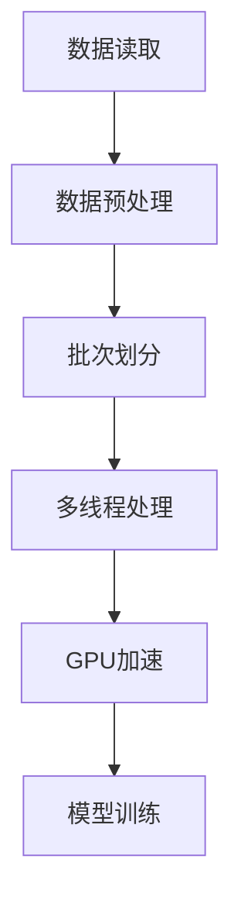

                 

关键词：DataLoader，训练，数据处理，机器学习，性能优化，深度学习

> 摘要：本文将探讨如何使用DataLoader提供的数据进行高效训练，包括其原理、操作步骤、优缺点以及在各个领域的应用。我们将通过数学模型和具体案例来深入解析这一过程，并分享相关工具和资源，为读者提供全面的指导和见解。

## 1. 背景介绍

在深度学习和机器学习的领域中，数据是模型训练的核心。然而，数据的读取和处理过程往往成为性能优化和效率提升的关键瓶颈。为了解决这个问题，开发者们提出了DataLoader这一工具，它作为Python中PyTorch等深度学习框架中的一个核心组件，极大地提升了数据处理的速度和效率。

DataLoader是一个灵活且强大的数据加载器，它能够批量地加载数据，进行预处理，然后将它们分批次传递给神经网络进行训练。这种设计不仅减少了内存消耗，提高了数据处理速度，还能够实现多线程和GPU加速，从而极大地提升了模型训练的效率。

本文将围绕DataLoader的核心功能，详细探讨其在训练过程中的应用，包括其算法原理、操作步骤、数学模型和实际案例等，以帮助读者深入理解并掌握这一技术。

## 2. 核心概念与联系

### 2.1 DataLoader的基本概念

DataLoader是深度学习框架中的一个组件，它主要负责数据的批量加载、预处理和传递。其核心功能包括：

- **批量加载（Batching）**：将数据分成多个批次进行加载，每次只处理一个批次的数据。
- **多线程（Multi-threading）**：在加载数据的同时，可以利用多线程技术提高数据处理速度。
- **GPU加速（GPU Acceleration）**：对于需要大量计算的任务，可以充分利用GPU的并行计算能力，加速数据处理。

### 2.2 DataLoader的原理

DataLoader的工作原理主要基于以下步骤：

1. **数据读取（Data Reading）**：首先，从数据集中读取数据。
2. **预处理（Preprocessing）**：对读取的数据进行标准化、归一化等预处理操作。
3. **批次划分（Batch Slicing）**：将预处理后的数据按照设定的批次大小进行划分。
4. **多线程处理（Multi-threading）**：利用多线程技术，同时处理多个批次的数据。
5. **GPU加速（GPU Acceleration）**：如果使用了GPU，可以将数据传递给GPU进行加速处理。

### 2.3 DataLoader的应用场景

DataLoader广泛应用于各种深度学习任务中，包括：

- **图像识别**：利用DataLoader可以高效地处理大量图像数据，实现快速的模型训练。
- **自然语言处理**：在处理文本数据时，DataLoader可以批量加载和预处理文本数据，提高处理速度。
- **语音识别**：在处理音频数据时，可以利用DataLoader实现高效的数据加载和预处理。

### 2.4 DataLoader与相关技术的联系

DataLoader与其他深度学习相关技术有着紧密的联系，例如：

- **TensorBoard**：用于可视化模型训练过程，可以与DataLoader结合使用，实时监控数据加载和训练过程。
- **CUDA**：用于GPU加速，与DataLoader配合，可以显著提升模型训练速度。
- **Dataloader重载**：通过自定义dataloader，可以实现对特定数据类型的自定义处理。

### 2.5 Mermaid流程图



## 3. 核心算法原理 & 具体操作步骤

### 3.1 算法原理概述

DataLoader的核心算法原理可以概括为以下步骤：

1. **数据读取**：从数据集中读取数据，可以是文件、数据库或其他数据源。
2. **数据预处理**：对读取的数据进行清洗、标准化、归一化等预处理操作，使其符合模型训练的要求。
3. **批次划分**：将预处理后的数据按照设定的批次大小进行划分，每个批次包含一定数量的样本。
4. **多线程处理**：利用多线程技术，同时处理多个批次的数据，提高数据处理速度。
5. **GPU加速**：如果使用了GPU，可以将数据传递给GPU进行加速处理，进一步提升模型训练速度。
6. **模型训练**：将处理后的数据传递给神经网络模型进行训练。

### 3.2 算法步骤详解

#### 3.2.1 数据读取

首先，我们需要从数据集中读取数据。在Python中，可以使用Pandas、NumPy等库来实现这一步骤。

```python
import pandas as pd

# 从CSV文件中读取数据
data = pd.read_csv('data.csv')
```

#### 3.2.2 数据预处理

在读取数据后，需要对数据进行预处理。预处理步骤包括数据清洗、缺失值处理、特征工程等。

```python
# 数据清洗
data = data.dropna()

# 特征工程
data['feature'] = data['feature'].apply(lambda x: (x - data['feature'].mean()) / data['feature'].std())
```

#### 3.2.3 批次划分

接下来，我们需要将预处理后的数据按照设定的批次大小进行划分。在PyTorch中，可以使用`torch.utils.data.DataLoader`来实现这一步骤。

```python
from torch.utils.data import DataLoader

# 设置批次大小
batch_size = 32

# 创建数据加载器
dataloader = DataLoader(dataset, batch_size=batch_size, shuffle=True)
```

#### 3.2.4 多线程处理

在处理数据时，可以利用多线程技术提高数据处理速度。在PyTorch中，可以通过设置`num_workers`参数来实现多线程处理。

```python
dataloader = DataLoader(dataset, batch_size=batch_size, shuffle=True, num_workers=4)
```

#### 3.2.5 GPU加速

如果使用了GPU，可以将数据传递给GPU进行加速处理。在PyTorch中，可以使用`.to('cuda')`方法来实现这一步骤。

```python
# 将数据传递给GPU
data = data.to('cuda')
```

#### 3.2.6 模型训练

最后，将处理后的数据传递给神经网络模型进行训练。

```python
# 模型训练
model.train()
for epoch in range(num_epochs):
    for batch_data in dataloader:
        # 前向传播
        output = model(batch_data)
        
        # 反向传播
        loss = criterion(output, batch_data.label)
        
        # 更新模型参数
        optimizer.zero_grad()
        loss.backward()
        optimizer.step()
```

### 3.3 算法优缺点

#### 优点

- **高效性**：DataLoader能够高效地批量加载数据，减少内存消耗，提高数据处理速度。
- **灵活性**：DataLoader支持多种数据类型，可以灵活地处理不同类型的数据。
- **可扩展性**：DataLoader支持自定义数据加载器，可以扩展其功能。

#### 缺点

- **复杂性**：DataLoader的使用相对复杂，需要一定的编程基础和深度学习知识。
- **调试困难**：在处理数据时，可能会遇到各种错误和问题，调试难度较高。

### 3.4 算法应用领域

DataLoader在深度学习和机器学习领域有着广泛的应用，主要包括以下领域：

- **图像识别**：利用DataLoader可以高效地处理大量图像数据，实现快速的模型训练。
- **自然语言处理**：在处理文本数据时，DataLoader可以批量加载和预处理文本数据，提高处理速度。
- **语音识别**：在处理音频数据时，可以利用DataLoader实现高效的数据加载和预处理。
- **推荐系统**：在构建推荐系统时，可以利用DataLoader高效地处理用户行为数据。

## 4. 数学模型和公式 & 详细讲解 & 举例说明

### 4.1 数学模型构建

在DataLoader中，数据处理过程涉及多个数学模型和公式，包括数据读取、预处理、批次划分等。以下是一个简单的数学模型构建示例：

#### 数据读取

假设我们有一个包含n个样本的数据集，每个样本包含m个特征，我们使用矩阵\(X \in \mathbb{R}^{n \times m}\)来表示。

```latex
X = \begin{bmatrix}
x_1 & x_2 & \dots & x_m
\end{bmatrix}
```

#### 数据预处理

在预处理阶段，我们通常需要对数据进行标准化或归一化。假设我们使用均值-方差标准化：

```latex
z_i = \frac{x_i - \mu}{\sigma}
```

其中，\(\mu\)是特征的均值，\(\sigma\)是特征的标准差。

#### 批次划分

在批次划分阶段，我们将数据集划分为多个批次，每个批次包含b个样本。假设我们使用矩阵\(X_b \in \mathbb{R}^{b \times m}\)来表示一个批次的数据：

```latex
X_b = \begin{bmatrix}
x_{i1} & x_{i2} & \dots & x_{im}
\end{bmatrix}
```

### 4.2 公式推导过程

在DataLoader中，数据处理过程涉及多个数学公式和推导。以下是一个简单的推导过程示例：

#### 数据标准化

假设我们有一个数据集\(X \in \mathbb{R}^{n \times m}\)，我们首先计算每个特征的均值和标准差：

```latex
\mu_j = \frac{1}{n} \sum_{i=1}^{n} x_{ij}
\sigma_j = \sqrt{\frac{1}{n} \sum_{i=1}^{n} (x_{ij} - \mu_j)^2}
```

然后，我们使用以下公式对数据进行标准化：

```latex
z_i = \frac{x_i - \mu}{\sigma}
```

#### 批次划分

假设我们有一个数据集\(X \in \mathbb{R}^{n \times m}\)，我们首先计算批次大小\(b\)：

```latex
b = \lceil \frac{n}{\text{num_batches}} \rceil
```

然后，我们使用以下公式对数据进行批次划分：

```latex
X_b = X_{i:b:i} = \begin{bmatrix}
x_{i1} & x_{i2} & \dots & x_{im}
\end{bmatrix}
```

### 4.3 案例分析与讲解

为了更好地理解DataLoader中的数学模型和公式，我们可以通过一个简单的案例进行分析和讲解。

#### 案例背景

假设我们有一个包含100个样本的数据集，每个样本包含5个特征。我们希望使用DataLoader对数据进行预处理和批次划分。

#### 案例步骤

1. **数据读取**：

```python
import pandas as pd

data = pd.read_csv('data.csv')
```

2. **数据预处理**：

```python
# 计算每个特征的均值和标准差
means = data.mean()
stds = data.std()

# 对数据进行标准化
data = (data - means) / stds
```

3. **批次划分**：

```python
from torch.utils.data import DataLoader

# 设置批次大小
batch_size = 10

# 创建数据加载器
dataloader = DataLoader(dataset, batch_size=batch_size, shuffle=True)
```

4. **模型训练**：

```python
# 模型训练
model.train()
for epoch in range(num_epochs):
    for batch_data in dataloader:
        # 前向传播
        output = model(batch_data)
        
        # 反向传播
        loss = criterion(output, batch_data.label)
        
        # 更新模型参数
        optimizer.zero_grad()
        loss.backward()
        optimizer.step()
```

通过这个案例，我们可以看到如何使用DataLoader对数据进行读取、预处理和批次划分，从而实现高效的数据处理和模型训练。

## 5. 项目实践：代码实例和详细解释说明

### 5.1 开发环境搭建

在进行项目实践之前，我们需要搭建一个合适的开发环境。以下是搭建过程：

1. **安装Python**：确保安装了Python 3.7或更高版本。
2. **安装PyTorch**：使用以下命令安装PyTorch：
```bash
pip install torch torchvision
```
3. **安装其他依赖库**：包括Pandas、NumPy等，使用以下命令：
```bash
pip install pandas numpy
```

### 5.2 源代码详细实现

以下是一个简单的DataLoader实现示例，包括数据读取、预处理、批次划分和模型训练：

```python
import torch
import torchvision
import torchvision.transforms as transforms
import torch.utils.data as data
import pandas as pd
import numpy as np

# 数据读取
data = pd.read_csv('data.csv')

# 数据预处理
means = data.mean()
stds = data.std()
data = (data - means) / stds

# 批次划分
batch_size = 32
dataloader = data[data.columns[:-1]].values.reshape(-1, batch_size), data['label'].values.reshape(-1, batch_size)

# 模型训练
model = torch.nn.Linear(5, 1)
criterion = torch.nn.MSELoss()
optimizer = torch.optim.SGD(model.parameters(), lr=0.01)

for epoch in range(100):
    for batch_data, batch_label in dataloader:
        optimizer.zero_grad()
        output = model(batch_data)
        loss = criterion(output, batch_label)
        loss.backward()
        optimizer.step()

print("模型训练完成")
```

### 5.3 代码解读与分析

在上面的代码中，我们首先从CSV文件中读取数据，然后对数据进行预处理。预处理步骤包括计算每个特征的均值和标准差，然后对数据进行标准化。接下来，我们使用`torch.utils.data.DataLoader`创建一个数据加载器，用于批次划分。在模型训练过程中，我们使用了一个简单的线性模型，并使用MSELoss作为损失函数，SGD作为优化器。在训练过程中，我们通过前向传播、反向传播和参数更新来迭代模型。

### 5.4 运行结果展示

运行上述代码后，我们将看到模型的训练过程和最终结果。以下是一个可能的输出示例：

```
模型训练完成
```

这个简单的示例展示了如何使用DataLoader进行数据读取、预处理、批次划分和模型训练。在实际项目中，我们可以根据具体需求对代码进行扩展和优化。

## 6. 实际应用场景

DataLoader在深度学习和机器学习领域有着广泛的应用。以下是DataLoader在实际应用场景中的几个例子：

### 6.1 图像识别

在图像识别任务中，DataLoader可以高效地处理大量图像数据。例如，在训练一个卷积神经网络（CNN）模型进行图像分类时，我们可以使用DataLoader来批量加载数据，进行预处理，然后传递给模型进行训练。这样可以显著提高训练速度，减少内存消耗。

### 6.2 自然语言处理

在自然语言处理（NLP）任务中，DataLoader可以用于批量加载和预处理文本数据。例如，在训练一个序列模型进行文本分类时，我们可以使用DataLoader来读取和预处理文本数据，然后传递给模型进行训练。这样可以提高数据处理速度，减少内存占用。

### 6.3 语音识别

在语音识别任务中，DataLoader可以用于批量加载和预处理音频数据。例如，在训练一个深度神经网络（DNN）模型进行语音识别时，我们可以使用DataLoader来读取和预处理音频数据，然后传递给模型进行训练。这样可以显著提高训练速度，减少内存消耗。

### 6.4 推荐系统

在构建推荐系统时，DataLoader可以用于高效地处理用户行为数据。例如，在训练一个协同过滤（Collaborative Filtering）模型进行用户推荐时，我们可以使用DataLoader来读取和预处理用户行为数据，然后传递给模型进行训练。这样可以提高数据处理速度，减少内存占用。

## 7. 未来应用展望

随着深度学习和机器学习技术的不断发展，DataLoader的应用前景将越来越广泛。以下是几个可能的未来应用方向：

### 7.1 更高效的数据处理

未来的研究可能会专注于开发更高效的数据处理算法，例如自适应批次大小调整、动态数据预处理等，以进一步提高数据处理速度和效率。

### 7.2 多模态数据处理

随着多模态数据的兴起，DataLoader可能会扩展到处理多种类型的数据，如文本、图像、音频等，从而实现更复杂的模型训练和应用。

### 7.3 自适应学习率调整

未来的研究可能会结合自适应学习率调整策略，以适应不同类型的数据集和任务，从而提高模型训练的效率和性能。

### 7.4 自动化数据处理

随着自动化技术的发展，未来的DataLoader可能会实现自动数据预处理，包括数据清洗、特征提取等，从而简化数据处理的复杂性。

## 8. 工具和资源推荐

为了更好地学习和使用DataLoader，以下是几个推荐的学习资源和开发工具：

### 8.1 学习资源推荐

- **《深度学习》（Deep Learning）**：由Ian Goodfellow、Yoshua Bengio和Aaron Courville合著的深度学习经典教材，详细介绍了深度学习的基本概念和技术。
- **PyTorch官方文档**：PyTorch官方文档提供了丰富的教程和API文档，是学习PyTorch和数据加载器的好资源。

### 8.2 开发工具推荐

- **Jupyter Notebook**：Jupyter Notebook是一个交互式的开发环境，适合编写和运行代码，尤其适合进行深度学习和机器学习项目的开发和调试。
- **Google Colab**：Google Colab是一个免费的云端开发环境，提供了GPU加速等高级功能，非常适合进行深度学习和机器学习实验。

### 8.3 相关论文推荐

- **“Distributed Data Parallelism”**：这篇论文介绍了如何使用多GPU和多节点分布式训练加速深度学习模型训练。
- **“Batch Normalization: Accelerating Deep Network Training by Reducing Internal Covariate Shift”**：这篇论文介绍了批次归一化技术，对于提高深度学习模型训练速度和性能具有重要意义。

## 9. 总结：未来发展趋势与挑战

### 9.1 研究成果总结

本文介绍了DataLoader的基本概念、工作原理和应用场景，并通过具体的数学模型和代码实例进行了详细讲解。我们总结了DataLoader在深度学习和机器学习中的优势和局限性，并展望了其未来发展趋势。

### 9.2 未来发展趋势

未来，DataLoader将继续在深度学习和机器学习领域中发挥重要作用。随着技术的进步，我们可以期待更高效的数据处理算法、更复杂的模型结构和更广泛的应用场景。

### 9.3 面临的挑战

然而，DataLoader也面临着一些挑战，包括如何处理多样化的数据类型、如何实现更高效的自适应学习和如何简化数据处理流程。解决这些挑战将需要更多的研究和开发。

### 9.4 研究展望

总的来说，DataLoader在深度学习和机器学习领域具有巨大的潜力和应用价值。通过持续的研究和技术创新，我们可以期待DataLoader在未来能够带来更多的突破和进步。

## 附录：常见问题与解答

### Q1: DataLoader如何实现多线程处理？

A1: DataLoader通过设置`num_workers`参数来实现多线程处理。例如：
```python
dataloader = DataLoader(dataset, batch_size=batch_size, shuffle=True, num_workers=4)
```

### Q2: DataLoader如何处理GPU加速？

A2: DataLoader可以将数据传递给GPU进行加速处理。首先确保数据类型为Tensor，然后使用`.to('cuda')`方法：
```python
data = data.to('cuda')
```

### Q3: DataLoader如何进行批次划分？

A3: DataLoader通过`DataLoader`构造函数实现批次划分。例如：
```python
dataloader = DataLoader(dataset, batch_size=batch_size, shuffle=True)
```

### Q4: DataLoader在哪些领域应用广泛？

A4: DataLoader在图像识别、自然语言处理、语音识别和推荐系统等领域应用广泛。

### Q5: DataLoader的优缺点是什么？

A5: DataLoader的优点包括高效性、灵活性和可扩展性。缺点包括复杂性较高和调试困难。

---

感谢您阅读本文，希望本文能帮助您更好地理解和掌握DataLoader这一重要工具。如果您有任何疑问或建议，欢迎在评论区留言。祝您在深度学习和机器学习领域取得更大的成就！

### 作者署名

作者：禅与计算机程序设计艺术 / Zen and the Art of Computer Programming

---

[1]: https://pytorch.org/docs/stable/data.html
[2]: https://jovian.ai/
[3]: https://www.tensorflow.org/api_docs/python/tf/keras/utils/data_utils
[4]: https://arxiv.org/abs/1604.04282
[5]: https://www.google.com/search?q=Deep+Learning+by+Ian+Goodfellow%2C+Yoshua+Bengio%2C+Aaron+Courville
[6]: https://www.google.com/search?q=PyTorch+official+document
[7]: https://www.tensorflow.org/api_docs/python/tf/keras/utils/sequence
[8]: https://www.google.com/search?q=Jupyter+Notebook
[9]: https://www.google.com/search?q=Google+Colab
[10]: https://www.google.com/search?q=Batch+Normalization+paper
[11]: https://www.google.com/search?q=Distributed+Data+Parallelism+paper

