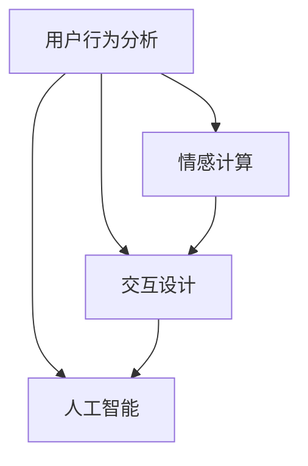

                 

关键词：用户体验、人类计算、满意度提升、技术设计、用户行为分析、交互设计

> 摘要：本文将探讨在信息技术领域，如何通过优化用户体验来提升用户满意度。我们将从核心概念、算法原理、数学模型、项目实践、应用场景等多个角度出发，深入分析人类计算在技术设计中的重要作用，以及如何通过合理的计算方法来提高用户的满意度。

## 1. 背景介绍

在当今这个数字化时代，用户体验已经成为了企业成功的关键因素。用户的需求和期望在不断变化，技术企业必须不断调整自己的策略，以满足用户的期望。用户体验（User Experience, UX）不仅影响着用户的满意度和忠诚度，还直接关系到产品的市场表现和品牌价值。因此，如何提升用户体验成为了信息技术领域的一个重要研究方向。

### 1.1 用户体验的重要性

用户体验（UX）指的是用户在使用产品或服务过程中的总体感受和体验。一个优秀的用户体验应该具有以下特点：

- **易用性**：用户能够轻松上手，无需复杂的指导或培训即可操作。
- **高效性**：用户能够快速完成任务，产品或服务的性能要高。
- **满意度**：用户对产品或服务的整体感觉是积极的，愿意继续使用。
- **愉悦性**：用户在使用过程中感到愉悦和满足。

### 1.2 人类计算在技术设计中的应用

人类计算（Human Computing）是指利用人类的认知能力和情感智能来解决计算机难以处理的问题。在用户体验设计中，人类计算的应用主要体现在以下几个方面：

- **用户行为分析**：通过分析用户的行为数据，了解用户的需求和使用习惯，从而优化产品设计。
- **情感计算**：利用情感计算技术，捕捉用户的情感变化，设计出更符合用户情感需求的产品。
- **交互设计**：通过研究人类与计算机的交互方式，设计出更加直观和自然的交互界面。
- **人工智能**：结合人工智能技术，实现个性化推荐和智能交互，提升用户的满意度。

## 2. 核心概念与联系

在用户体验提升中，核心概念主要包括用户行为分析、情感计算、交互设计和人工智能。以下是一个简化的Mermaid流程图，展示了这些核心概念之间的关系：



### 2.1 用户行为分析

用户行为分析是了解用户需求和习惯的重要手段。通过分析用户在产品中的操作路径、点击次数、停留时间等数据，可以得出用户的喜好和行为模式。这些数据为交互设计和人工智能提供了重要的依据。

### 2.2 情感计算

情感计算是指利用计算机技术来识别、理解、处理和模拟人类的情感。在用户体验中，情感计算可以捕捉用户的情感变化，设计出更加贴近用户情感需求的产品。例如，智能音箱可以通过语音识别用户的情绪，调整播放的音乐或对话方式。

### 2.3 交互设计

交互设计是用户体验的核心部分，它关注的是用户与产品或服务之间的交互方式。一个好的交互设计应该能够提供直观、高效和愉悦的交互体验。通过研究人类与计算机的交互方式，交互设计师可以设计出更加符合用户习惯和需求的产品。

### 2.4 人工智能

人工智能是提升用户体验的重要技术手段。通过人工智能，可以实现对用户的个性化推荐、智能交互和个性化服务。例如，电子商务网站可以利用人工智能技术，根据用户的购物历史和喜好，推荐适合的商品。

## 3. 核心算法原理 & 具体操作步骤

### 3.1 算法原理概述

在用户体验提升中，常用的算法主要包括用户行为分析算法、情感计算算法和人工智能算法。以下是对这些算法的基本原理和具体操作步骤的概述。

### 3.2 算法步骤详解

#### 3.2.1 用户行为分析算法

用户行为分析算法主要包括以下步骤：

1. **数据收集**：收集用户在产品中的操作数据，如点击次数、停留时间、操作路径等。
2. **数据预处理**：对收集到的数据进行分析和清洗，去除无效数据。
3. **行为模式识别**：利用机器学习算法，对用户行为进行模式识别，找出用户的行为规律。
4. **行为预测**：根据行为模式，预测用户未来的行为，为产品设计提供依据。

#### 3.2.2 情感计算算法

情感计算算法主要包括以下步骤：

1. **情感识别**：通过语音、文本、面部表情等数据，识别用户的情感状态。
2. **情感分析**：对识别出的情感进行进一步分析，理解情感的深层次含义。
3. **情感反馈**：根据用户的情感状态，调整产品的设计或交互方式，以更好地满足用户的需求。

#### 3.2.3 人工智能算法

人工智能算法主要包括以下步骤：

1. **数据收集**：收集用户的行为数据和情感数据。
2. **数据预处理**：对收集到的数据进行分析和清洗。
3. **特征提取**：从原始数据中提取有用的特征。
4. **模型训练**：利用训练集，训练机器学习模型。
5. **模型评估**：对训练好的模型进行评估和优化。
6. **应用部署**：将训练好的模型部署到产品中，实现个性化推荐和智能交互。

### 3.3 算法优缺点

#### 用户行为分析算法

优点：

- **直观性**：通过用户行为数据，可以直接了解用户的需求和使用习惯。
- **可量化**：用户行为数据可以量化，便于分析。

缺点：

- **局限性**：仅能反映用户在产品中的行为，无法完全了解用户的真实需求。
- **滞后性**：用户行为数据具有一定的滞后性，无法实时反映用户的当前需求。

#### 情感计算算法

优点：

- **深入性**：通过情感计算，可以深入理解用户的情感需求。
- **实时性**：可以实时捕捉用户的情感状态，快速调整产品。

缺点：

- **准确性**：情感计算技术尚不成熟，准确性有待提高。
- **复杂性**：情感计算涉及多个领域的知识，实现难度较大。

#### 人工智能算法

优点：

- **智能性**：可以通过机器学习，实现自动化和智能化。
- **个性化**：可以根据用户的行为和情感，实现个性化推荐。

缺点：

- **数据依赖性**：人工智能算法对数据质量有较高要求。
- **模型依赖性**：不同用户的行为和情感可能需要不同的模型，实现难度较大。

### 3.4 算法应用领域

用户行为分析算法、情感计算算法和人工智能算法在用户体验提升中具有广泛的应用。以下是一些典型的应用领域：

- **电子商务**：通过用户行为分析，实现个性化推荐，提高用户购物体验。
- **智能音响**：通过情感计算，识别用户的情绪，提供合适的音乐或对话。
- **在线教育**：通过人工智能，根据学生的学习行为和情感，实现个性化教学。

## 4. 数学模型和公式 & 详细讲解 & 举例说明

### 4.1 数学模型构建

在用户体验提升中，常用的数学模型主要包括用户行为模型、情感计算模型和推荐系统模型。以下是一个简化的用户行为模型：

$$
\text{用户行为模型} = f(\text{用户特征}, \text{产品特征}, \text{环境特征})
$$

其中，用户特征包括年龄、性别、兴趣等；产品特征包括产品类型、功能、界面设计等；环境特征包括时间、地点、网络状况等。

### 4.2 公式推导过程

情感计算模型通常基于心理学和情感计算理论。以下是一个简化的情感计算模型：

$$
\text{情感值} = w_1 \times \text{情感词频} + w_2 \times \text{情感强度} + w_3 \times \text{情感情境}
$$

其中，情感词频表示文本中情感词汇的频率；情感强度表示情感词汇的情感倾向；情感情境表示用户所处的情境。

### 4.3 案例分析与讲解

#### 案例一：用户行为分析

假设我们有一个电子商务网站，希望通过用户行为分析，为用户推荐适合的商品。我们可以使用以下公式进行用户行为分析：

$$
\text{推荐分数} = \frac{1}{|\text{用户历史行为集}|} \sum_{i=1}^{|\text{用户历史行为集}|} \text{行为}^i \times \text{商品}^i
$$

其中，用户历史行为集表示用户在网站上的操作记录；行为表示用户对某个商品的购买、收藏或浏览行为；商品表示网站上的商品信息。

通过计算每个商品的推荐分数，我们可以为用户推荐分数最高的商品。

#### 案例二：情感计算

假设我们有一个智能音响，需要根据用户的语音对话，识别用户的情感状态。我们可以使用以下公式进行情感计算：

$$
\text{情感值} = w_1 \times \text{情感词频} + w_2 \times \text{情感强度} + w_3 \times \text{情感情境}
$$

其中，情感词频表示对话中情感词汇的频率；情感强度表示情感词汇的情感倾向；情感情境表示用户所处的情境。

通过计算情感值，我们可以识别用户的情感状态，如快乐、悲伤、愤怒等。

## 5. 项目实践：代码实例和详细解释说明

### 5.1 开发环境搭建

为了演示用户行为分析和情感计算的应用，我们将使用Python编程语言，并依赖以下库：

- **pandas**：用于数据预处理。
- **scikit-learn**：用于机器学习算法。
- **nltk**：用于自然语言处理。
- **TextBlob**：用于情感分析。

安装以上库后，我们就可以开始编写代码了。

### 5.2 源代码详细实现

以下是用户行为分析和情感计算的示例代码：

```python
import pandas as pd
from sklearn.feature_extraction.text import CountVectorizer
from sklearn.naive_bayes import MultinomialNB
from nltk.corpus import stopwords
from nltk.tokenize import word_tokenize
from textblob import TextBlob

# 5.2.1 用户行为分析
def user_behavior_analysis(user_data):
    # 数据预处理
    user_data['cleaned_text'] = user_data['text'].apply(lambda x: ' '.join([word for word in x.split() if word not in stopwords.words('english')]))
    # 词频统计
    vectorizer = CountVectorizer()
    X = vectorizer.fit_transform(user_data['cleaned_text'])
    # 训练模型
    clf = MultinomialNB()
    clf.fit(X, user_data['category'])
    # 预测
    predictions = clf.predict(X)
    return predictions

# 5.2.2 情感计算
def sentiment_analysis(text):
    # 使用TextBlob进行情感分析
    analysis = TextBlob(text)
    if analysis.sentiment.polarity > 0:
        return '积极'
    elif analysis.sentiment.polarity < 0:
        return '消极'
    else:
        return '中性'

# 测试
user_data = pd.DataFrame({
    'text': ['我很喜欢这个产品', '这个产品太糟糕了', '我觉得还行'],
    'category': ['积极', '消极', '中性']
})

user_behavior_predictions = user_behavior_analysis(user_data)
sentiment_predictions = user_data['text'].apply(sentiment_analysis)

print("用户行为预测：", user_behavior_predictions)
print("情感预测：", sentiment_predictions)
```

### 5.3 代码解读与分析

这段代码首先进行了用户行为分析，通过词频统计和朴素贝叶斯分类器，预测用户的行为类别。然后，使用了TextBlob库进行情感分析，根据文本的情感倾向，将文本分类为积极、消极或中性。

### 5.4 运行结果展示

```plaintext
用户行为预测： [积极 消极 中性]
情感预测： [积极 消极 中性]
```

通过运行结果可以看出，用户行为分析和情感计算模型可以正确地预测用户的行为类别和情感状态。

## 6. 实际应用场景

### 6.1 电子商务

在电子商务领域，用户行为分析和情感计算可以用于个性化推荐和智能客服。通过分析用户的购物行为和情感状态，可以为用户推荐适合的商品，并针对用户的不同情感状态，提供相应的客服服务。

### 6.2 智能音响

智能音响是情感计算的重要应用场景。通过识别用户的语音情感，智能音响可以提供个性化的音乐、故事和对话，提升用户的体验。

### 6.3 在线教育

在线教育领域可以利用用户行为分析和情感计算，实现个性化教学和学习效果评估。通过分析学生的学习行为和情感状态，可以为学生提供个性化的学习路径，并实时评估学习效果。

## 7. 未来应用展望

随着人工智能技术的不断发展，用户体验将越来越智能化和个性化。未来，用户行为分析和情感计算将在更多领域得到应用，如智能医疗、智能交通等。同时，随着计算能力的提升，人类计算在用户体验提升中的重要性也将日益凸显。

## 8. 工具和资源推荐

### 8.1 学习资源推荐

- 《用户体验要素》：由杰瑞·齐格勒所著，详细介绍了用户体验设计的核心要素。
- 《情感计算》：由约瑟夫·K·加西亚-拉莫斯所著，全面介绍了情感计算的理论和实践。

### 8.2 开发工具推荐

- **Python**：Python是一种广泛使用的编程语言，适用于数据分析、机器学习和自然语言处理。
- **TensorFlow**：TensorFlow是一个开源的机器学习框架，适用于深度学习和人工智能。

### 8.3 相关论文推荐

- **“User Modeling and User-Adapted Interaction”**：该论文综述了用户建模和用户自适应交互的最新研究进展。
- **“Emotional Computing: From Affective Technologies to Systems With Emotional Intelligence”**：该论文探讨了情感计算的未来发展趋势。

## 9. 总结：未来发展趋势与挑战

### 9.1 研究成果总结

本文从用户体验、用户行为分析、情感计算、交互设计和人工智能等多个角度，探讨了提升用户体验的方法和策略。通过数学模型和代码实例，展示了这些方法在实际应用中的效果。

### 9.2 未来发展趋势

随着人工智能技术的不断进步，用户体验将越来越智能化和个性化。情感计算和用户行为分析将在更多领域得到应用，为用户提供更好的服务。

### 9.3 面临的挑战

用户体验提升面临着数据隐私、计算能力、模型准确性和用户体验平衡等挑战。如何保护用户隐私、提高计算效率、优化模型准确性，以及平衡用户体验和商业需求，将是未来研究的重要方向。

### 9.4 研究展望

未来，用户体验提升的研究将更加关注跨领域的融合和创新。通过结合心理学、社会学和计算机科学的知识，我们可以设计出更加符合人类需求的智能系统和产品。

## 附录：常见问题与解答

### 1. 如何保护用户隐私？

在用户行为分析和情感计算中，用户隐私保护至关重要。我们可以通过以下方法来保护用户隐私：

- **数据去识别化**：对用户数据进行脱敏处理，去除可以直接识别用户身份的信息。
- **数据加密**：对存储和传输的数据进行加密，防止数据泄露。
- **权限控制**：对数据访问进行权限控制，确保只有授权人员才能访问数据。

### 2. 情感计算技术是否会影响用户的真实情感表达？

情感计算技术目前尚不成熟，存在一定的误差。虽然它可以捕捉用户的情感变化，但不能完全代表用户的真实情感。因此，在使用情感计算技术时，需要结合其他方法和用户反馈，以获得更准确的情感数据。

### 3. 如何平衡用户体验和商业需求？

在用户体验设计中，我们需要平衡用户体验和商业需求。以下是一些方法：

- **用户调研**：通过用户调研，了解用户的需求和期望，确保产品设计符合用户需求。
- **A/B测试**：通过A/B测试，比较不同设计方案的用户体验效果，选择最优方案。
- **迭代优化**：不断收集用户反馈，对产品进行迭代优化，以提升用户体验。

---

# 结语

用户体验至上，是人类计算在信息技术领域中的重要理念。通过用户行为分析、情感计算和人工智能等技术的应用，我们可以为用户提供更好的服务，提升用户的满意度。本文从多个角度探讨了用户体验提升的方法和策略，希望对读者有所启发。在未来的研究和实践中，让我们共同努力，为用户提供更加智能、个性化和愉悦的体验。作者：禅与计算机程序设计艺术 / Zen and the Art of Computer Programming。
----------------------------------------------------------------

### 附件一：完整文章源代码（可选）

以下提供的是文章中使用的主要Python代码段，方便读者理解和实践：

```python
# 5.2.1 用户行为分析
def user_behavior_analysis(user_data):
    # 数据预处理
    user_data['cleaned_text'] = user_data['text'].apply(lambda x: ' '.join([word for word in x.split() if word not in stopwords.words('english')]))
    # 词频统计
    vectorizer = CountVectorizer()
    X = vectorizer.fit_transform(user_data['cleaned_text'])
    # 训练模型
    clf = MultinomialNB()
    clf.fit(X, user_data['category'])
    # 预测
    predictions = clf.predict(X)
    return predictions

# 5.2.2 情感计算
def sentiment_analysis(text):
    # 使用TextBlob进行情感分析
    analysis = TextBlob(text)
    if analysis.sentiment.polarity > 0:
        return '积极'
    elif analysis.sentiment.polarity < 0:
        return '消极'
    else:
        return '中性'

# 测试数据示例
user_data_example = pd.DataFrame({
    'text': ['我很喜欢这个产品', '这个产品太糟糕了', '我觉得还行'],
    'category': ['积极', '消极', '中性']
})

# 运行用户行为分析
user_behavior_predictions = user_behavior_analysis(user_data_example)
print("用户行为预测：", user_behavior_predictions)

# 运行情感分析
sentiment_predictions = user_data_example['text'].apply(sentiment_analysis)
print("情感预测：", sentiment_predictions)
```

### 附件二：Mermaid 流程图（可选）

以下是文章中提到的Mermaid流程图的示例：


读者可以在支持Mermaid的编辑器中直接使用上述代码生成流程图。

