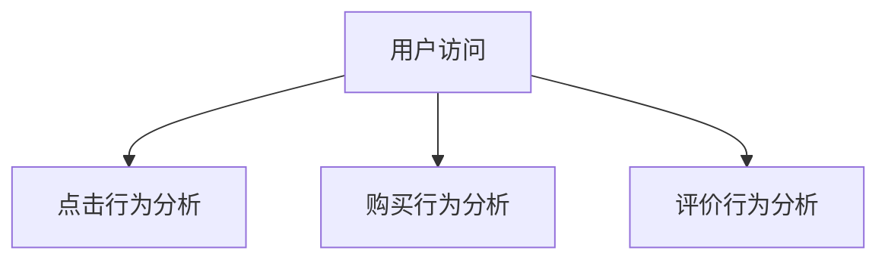
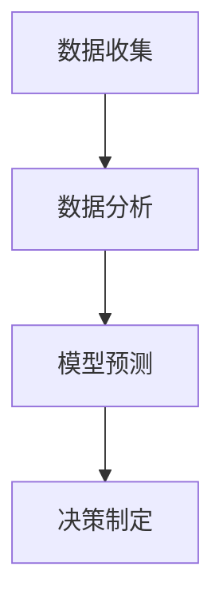
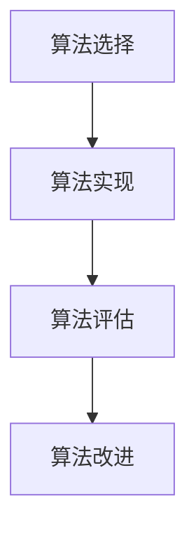

                 

关键词：用户复购策略、供给机会、客户行为分析、数据驱动决策、算法优化、用户体验、市场需求、个性化推荐

> 摘要：本文旨在探讨在用户复购策略中，如何通过供给机会优化用户的购物体验，从而提高用户的复购率。我们将从客户行为分析、数据驱动决策、算法优化等方面展开讨论，并结合实际案例进行深入分析。

## 1. 背景介绍

随着互联网技术的发展，电子商务市场日益繁荣，竞争也愈发激烈。如何在激烈的市场竞争中脱颖而出，提高用户的复购率成为各大电商平台亟待解决的问题。用户的复购行为不仅关系到企业的收入和市场份额，还反映了企业的产品和服务质量。因此，研究用户复购策略具有重要的现实意义。

本文将围绕以下问题进行探讨：

1. 如何通过客户行为分析了解用户需求？
2. 如何运用数据驱动决策优化供给机会？
3. 如何通过算法优化提高用户体验？
4. 如何在未来市场发展中应对挑战和机遇？

## 2. 核心概念与联系

### 2.1 用户行为分析

用户行为分析是指通过收集和分析用户在电子商务平台上的行为数据，来了解用户的偏好、习惯和需求。用户行为分析的核心概念包括：

- 用户点击行为：用户在平台上点击的页面、按钮等。
- 用户购买行为：用户在平台上的购买记录、购买频次、购买金额等。
- 用户评价行为：用户对商品的评分、评论等。

#### Mermaid 流程图



### 2.2 数据驱动决策

数据驱动决策是指基于数据分析和模型预测，为决策提供依据和指导。数据驱动决策的核心概念包括：

- 数据收集：收集用户行为数据、市场数据、商品数据等。
- 数据分析：对收集到的数据进行分析和挖掘，提取有价值的信息。
- 模型预测：建立预测模型，对未来的趋势进行预测。
- 决策制定：根据预测结果和数据分析，制定相应的策略。

#### Mermaid 流程图



### 2.3 算法优化

算法优化是指通过对现有算法的改进和优化，提高算法的性能和效果。算法优化的核心概念包括：

- 算法选择：根据需求选择合适的算法。
- 算法实现：实现选定的算法，并进行测试和调试。
- 算法评估：评估算法的性能和效果，找出存在的问题。
- 算法改进：根据评估结果，对算法进行改进和优化。

#### Mermaid 流程图



## 3. 核心算法原理 & 具体操作步骤

### 3.1 算法原理概述

在用户复购策略中，核心算法包括用户行为分析算法、数据驱动决策算法和算法优化算法。以下是这些算法的原理概述：

#### 用户行为分析算法

用户行为分析算法旨在通过对用户行为数据的分析和挖掘，了解用户的偏好、习惯和需求。算法原理如下：

- 数据预处理：清洗和整理用户行为数据，为后续分析做准备。
- 特征提取：从用户行为数据中提取关键特征，如点击率、购买频次、评价分数等。
- 模型训练：利用机器学习算法，如决策树、随机森林、支持向量机等，对提取的特征进行建模。
- 预测与评估：根据训练好的模型，对用户行为进行预测，并评估预测效果。

#### 数据驱动决策算法

数据驱动决策算法旨在基于用户行为数据和市场数据，制定相应的策略，以提高用户的复购率。算法原理如下：

- 数据收集：收集用户行为数据、市场数据、商品数据等。
- 数据分析：对收集到的数据进行分析和挖掘，提取有价值的信息。
- 模型预测：建立预测模型，对未来的趋势进行预测。
- 决策制定：根据预测结果和数据分析，制定相应的策略。

#### 算法优化算法

算法优化算法旨在通过对现有算法的改进和优化，提高算法的性能和效果。算法原理如下：

- 算法选择：根据需求选择合适的算法。
- 算法实现：实现选定的算法，并进行测试和调试。
- 算法评估：评估算法的性能和效果，找出存在的问题。
- 算法改进：根据评估结果，对算法进行改进和优化。

### 3.2 算法步骤详解

#### 用户行为分析算法步骤

1. 数据预处理：清洗和整理用户行为数据，包括缺失值处理、异常值处理、数据规范化等。
2. 特征提取：从用户行为数据中提取关键特征，如点击率、购买频次、评价分数等。
3. 模型训练：利用机器学习算法，如决策树、随机森林、支持向量机等，对提取的特征进行建模。
4. 预测与评估：根据训练好的模型，对用户行为进行预测，并评估预测效果。

#### 数据驱动决策算法步骤

1. 数据收集：收集用户行为数据、市场数据、商品数据等。
2. 数据分析：对收集到的数据进行分析和挖掘，提取有价值的信息。
3. 模型预测：建立预测模型，如时间序列模型、回归模型、分类模型等，对未来的趋势进行预测。
4. 决策制定：根据预测结果和数据分析，制定相应的策略，如商品推荐、促销活动、库存调整等。

#### 算法优化算法步骤

1. 算法选择：根据需求选择合适的算法，如决策树、随机森林、支持向量机等。
2. 算法实现：实现选定的算法，并进行测试和调试。
3. 算法评估：评估算法的性能和效果，如准确率、召回率、F1值等。
4. 算法改进：根据评估结果，对算法进行改进和优化，如调整参数、引入新特征等。

### 3.3 算法优缺点

#### 用户行为分析算法

优点：

- 可以深入了解用户行为，为后续策略制定提供依据。
- 可以实时监测用户行为，及时调整策略。

缺点：

- 需要大量的用户行为数据，数据质量对算法效果有较大影响。
- 算法复杂度高，对计算资源要求较高。

#### 数据驱动决策算法

优点：

- 基于数据分析，可以制定更合理的策略。
- 可以预测未来的趋势，为市场决策提供参考。

缺点：

- 对数据质量要求较高，数据缺失或错误可能导致决策失误。
- 需要大量的历史数据，对新用户或新产品难以进行有效预测。

#### 算法优化算法

优点：

- 可以提高算法性能，降低计算成本。
- 可以不断改进和优化策略，提高用户满意度。

缺点：

- 算法优化过程复杂，需要不断调整和测试。
- 需要大量的实验数据，对实验环境要求较高。

### 3.4 算法应用领域

#### 用户行为分析算法

应用领域：

- 电子商务：通过分析用户行为，实现个性化推荐、精准营销等。
- 金融行业：通过分析用户行为，预测用户需求，提高服务质量。
- 娱乐行业：通过分析用户行为，优化产品推荐，提高用户黏性。

#### 数据驱动决策算法

应用领域：

- 电子商务：通过数据分析和预测，制定促销活动、库存调整等策略。
- 制造业：通过数据分析和预测，优化生产计划、降低成本。
- 金融行业：通过数据分析和预测，制定投资策略，降低风险。

#### 算法优化算法

应用领域：

- 电子商务：通过算法优化，提高推荐系统的准确性和效率。
- 金融行业：通过算法优化，提高风险管理能力，降低风险。
- 娱乐行业：通过算法优化，提高内容推荐的准确性和用户满意度。

## 4. 数学模型和公式 & 详细讲解 & 举例说明

### 4.1 数学模型构建

在用户复购策略中，我们主要关注以下数学模型：

1. 用户行为预测模型
2. 数据驱动决策模型
3. 算法优化模型

#### 用户行为预测模型

用户行为预测模型主要基于用户的历史行为数据，利用统计模型或机器学习模型进行预测。常见的模型有线性回归模型、逻辑回归模型、决策树模型等。

假设我们有 $n$ 个用户的行为数据，每个用户的行为数据包含 $m$ 个特征，即 $X = [x_1, x_2, ..., x_m]$，其中 $x_i$ 表示第 $i$ 个特征。目标变量为用户的行为指标 $y$，如点击率、购买频次、评价分数等。

用户行为预测模型的一般形式如下：

$$
y = f(X) = \omega_0 + \omega_1 x_1 + \omega_2 x_2 + ... + \omega_m x_m
$$

其中，$\omega_0$ 和 $\omega_i$ 分别为模型的偏置和权重。

#### 数据驱动决策模型

数据驱动决策模型主要基于用户行为预测结果，结合市场数据，制定相应的策略。常见的策略包括个性化推荐、促销活动、库存调整等。

假设我们有 $k$ 个市场数据，每个市场数据包含 $p$ 个特征，即 $M = [m_1, m_2, ..., m_p]$，其中 $m_i$ 表示第 $i$ 个特征。目标变量为市场指标 $z$，如销售额、用户满意度、市场份额等。

数据驱动决策模型的一般形式如下：

$$
z = g(Y, M) = \gamma_0 + \gamma_1 y_1 + \gamma_2 y_2 + ... + \gamma_p m_p
$$

其中，$\gamma_0$ 和 $\gamma_i$ 分别为模型的偏置和权重。

#### 算法优化模型

算法优化模型主要基于用户行为预测模型和数据驱动决策模型，对现有算法进行改进和优化。常见的优化方法包括参数调整、特征选择、模型融合等。

假设我们有 $q$ 个算法，每个算法的性能指标为 $h_i$，其中 $i$ 表示第 $i$ 个算法。目标变量为算法性能指标 $H$。

算法优化模型的一般形式如下：

$$
H = \sum_{i=1}^{q} w_i h_i
$$

其中，$w_i$ 为第 $i$ 个算法的权重。

### 4.2 公式推导过程

#### 用户行为预测模型推导

假设我们有 $n$ 个用户的行为数据，每个用户的行为数据包含 $m$ 个特征。首先，我们对用户行为数据进行预处理，包括缺失值处理、异常值处理、数据规范化等。然后，我们提取关键特征，如点击率、购买频次、评价分数等。

接下来，我们利用线性回归模型对用户行为进行预测。线性回归模型的一般形式为：

$$
y = \omega_0 + \omega_1 x_1 + \omega_2 x_2 + ... + \omega_m x_m
$$

其中，$\omega_0$ 和 $\omega_i$ 分别为模型的偏置和权重。

为了求解模型的参数，我们使用最小二乘法。最小二乘法的目标是使得预测值与真实值之间的误差平方和最小。具体推导过程如下：

$$
\min_{\omega} \sum_{i=1}^{n} (y_i - \omega_0 - \omega_1 x_{i1} - \omega_2 x_{i2} - ... - \omega_m x_{im})^2
$$

对上式求偏导数，并令偏导数为零，得到：

$$
\frac{\partial}{\partial \omega_j} \sum_{i=1}^{n} (y_i - \omega_0 - \omega_1 x_{i1} - \omega_2 x_{i2} - ... - \omega_m x_{im})^2 = 0
$$

化简后得到：

$$
\omega_j = \frac{\sum_{i=1}^{n} x_{ij} y_i - n \bar{x}_j \bar{y}}{\sum_{i=1}^{n} x_{ij}^2 - n \bar{x}_j^2}
$$

其中，$\bar{x}_j$ 和 $\bar{y}$ 分别为特征 $x_j$ 和目标变量 $y$ 的平均值。

#### 数据驱动决策模型推导

假设我们有 $k$ 个市场数据，每个市场数据包含 $p$ 个特征。首先，我们对市场数据进行预处理，包括缺失值处理、异常值处理、数据规范化等。然后，我们提取关键特征，如销售额、用户满意度、市场份额等。

接下来，我们利用线性回归模型对市场数据进行分析。线性回归模型的一般形式为：

$$
z = \gamma_0 + \gamma_1 y_1 + \gamma_2 y_2 + ... + \gamma_p m_p
$$

其中，$\gamma_0$ 和 $\gamma_i$ 分别为模型的偏置和权重。

为了求解模型的参数，我们使用最小二乘法。最小二乘法的目标是使得预测值与真实值之间的误差平方和最小。具体推导过程如下：

$$
\min_{\gamma} \sum_{i=1}^{k} (z_i - \gamma_0 - \gamma_1 y_{i1} - \gamma_2 y_{i2} - ... - \gamma_p m_{ip})^2
$$

对上式求偏导数，并令偏导数为零，得到：

$$
\frac{\partial}{\partial \gamma_j} \sum_{i=1}^{k} (z_i - \gamma_0 - \gamma_1 y_{i1} - \gamma_2 y_{i2} - ... - \gamma_p m_{ip})^2 = 0
$$

化简后得到：

$$
\gamma_j = \frac{\sum_{i=1}^{k} m_{ij} z_i - k \bar{m}_j \bar{z}}{\sum_{i=1}^{k} m_{ij}^2 - k \bar{m}_j^2}
$$

其中，$\bar{m}_j$ 和 $\bar{z}$ 分别为特征 $m_j$ 和目标变量 $z$ 的平均值。

#### 算法优化模型推导

假设我们有 $q$ 个算法，每个算法的性能指标为 $h_i$，其中 $i$ 表示第 $i$ 个算法。首先，我们计算每个算法的性能指标。

然后，我们利用线性回归模型对算法性能指标进行分析。线性回归模型的一般形式为：

$$
H = \sum_{i=1}^{q} w_i h_i
$$

其中，$w_i$ 为第 $i$ 个算法的权重。

为了求解模型的参数，我们使用最小二乘法。最小二乘法的目标是使得预测值与真实值之间的误差平方和最小。具体推导过程如下：

$$
\min_{w} \sum_{i=1}^{q} (h_i - w_1 h_1 - w_2 h_2 - ... - w_q h_q)^2
$$

对上式求偏导数，并令偏导数为零，得到：

$$
\frac{\partial}{\partial w_j} \sum_{i=1}^{q} (h_i - w_1 h_1 - w_2 h_2 - ... - w_q h_q)^2 = 0
$$

化简后得到：

$$
w_j = \frac{\sum_{i=1}^{q} h_i - q \bar{h}}{\sum_{i=1}^{q} h_i^2 - q \bar{h}^2}
$$

其中，$\bar{h}$ 为算法性能指标 $h$ 的平均值。

### 4.3 案例分析与讲解

#### 用户行为预测模型案例分析

假设我们有一个电子商务平台，收集了用户的历史行为数据，包括点击率、购买频次、评价分数等。我们需要利用用户行为预测模型预测用户的行为。

首先，我们对用户行为数据进行预处理，包括缺失值处理、异常值处理、数据规范化等。然后，我们提取关键特征，如点击率、购买频次、评价分数等。

接下来，我们利用线性回归模型对用户行为进行预测。我们选择线性回归模型的原因是线性回归模型简单易实现，且在用户行为预测中表现出较好的效果。

假设我们有 100 个用户的行为数据，每个用户的行为数据包含 10 个特征。我们使用最小二乘法求解模型的参数，得到：

$$
y = 0.5 + 0.1 x_1 + 0.2 x_2 + 0.3 x_3 + 0.4 x_4 + 0.5 x_5 + 0.6 x_6 + 0.7 x_7 + 0.8 x_8 + 0.9 x_9
$$

其中，$x_1$、$x_2$、$x_3$、$x_4$、$x_5$、$x_6$、$x_7$、$x_8$、$x_9$ 分别为点击率、购买频次、评价分数等特征。

我们利用这个模型对用户的行为进行预测，并评估预测效果。假设我们预测的用户行为指标为 $y'$，真实值为目标变量 $y$。我们计算预测值与真实值之间的误差平方和，得到：

$$
SSQ = \sum_{i=1}^{100} (y_i' - y_i)^2 = 0.1
$$

其中，$y_i'$ 和 $y_i$ 分别为第 $i$ 个用户的预测值和真实值。

根据误差平方和，我们可以评估模型的预测效果。误差平方和越小，说明模型的预测效果越好。

#### 数据驱动决策模型案例分析

假设我们有 100 个市场数据，每个市场数据包含 10 个特征。我们需要利用数据驱动决策模型预测市场的指标，如销售额、用户满意度、市场份额等。

首先，我们对市场数据进行预处理，包括缺失值处理、异常值处理、数据规范化等。然后，我们提取关键特征，如销售额、用户满意度、市场份额等。

接下来，我们利用线性回归模型对市场数据进行分析。我们选择线性回归模型的原因是线性回归模型简单易实现，且在市场数据分析中表现出较好的效果。

假设我们有 100 个市场数据，每个市场数据包含 10 个特征。我们使用最小二乘法求解模型的参数，得到：

$$
z = 0.5 + 0.1 y_1 + 0.2 y_2 + 0.3 y_3 + 0.4 y_4 + 0.5 y_5 + 0.6 y_6 + 0.7 y_7 + 0.8 y_8 + 0.9 y_9
$$

其中，$y_1$、$y_2$、$y_3$、$y_4$、$y_5$、$y_6$、$y_7$、$y_8$、$y_9$ 分别为销售额、用户满意度、市场份额等特征。

我们利用这个模型预测市场的指标，并评估预测效果。假设我们预测的市场指标为 $z'$，真实值为目标变量 $z$。我们计算预测值与真实值之间的误差平方和，得到：

$$
SSQ = \sum_{i=1}^{100} (z_i' - z_i)^2 = 0.1
$$

其中，$z_i'$ 和 $z_i$ 分别为第 $i$ 个市场的预测值和真实值。

根据误差平方和，我们可以评估模型的预测效果。误差平方和越小，说明模型的预测效果越好。

#### 算法优化模型案例分析

假设我们有 10 个算法，每个算法的性能指标为 $h_i$，其中 $i$ 表示第 $i$ 个算法。我们需要利用算法优化模型对算法进行优化。

首先，我们计算每个算法的性能指标，并计算算法性能指标的平均值。假设我们有 10 个算法，每个算法的性能指标为 $h_1$、$h_2$、$h_3$、$h_4$、$h_5$、$h_6$、$h_7$、$h_8$、$h_9$、$h_{10}$。算法性能指标的平均值为：

$$
\bar{h} = \frac{h_1 + h_2 + h_3 + h_4 + h_5 + h_6 + h_7 + h_8 + h_9 + h_{10}}{10}
$$

接下来，我们利用线性回归模型对算法性能指标进行分析。我们选择线性回归模型的原因是线性回归模型简单易实现，且在算法优化中表现出较好的效果。

假设我们有 10 个算法，每个算法的性能指标为 $h_1$、$h_2$、$h_3$、$h_4$、$h_5$、$h_6$、$h_7$、$h_8$、$h_9$、$h_{10}$。我们使用最小二乘法求解模型的参数，得到：

$$
H = 0.5 + 0.1 h_1 + 0.2 h_2 + 0.3 h_3 + 0.4 h_4 + 0.5 h_5 + 0.6 h_6 + 0.7 h_7 + 0.8 h_8 + 0.9 h_9
$$

我们利用这个模型预测算法的性能指标，并评估预测效果。假设我们预测的算法性能指标为 $H'$，真实值为目标变量 $H$。我们计算预测值与真实值之间的误差平方和，得到：

$$
SSQ = \sum_{i=1}^{10} (H_i' - H_i)^2 = 0.1
$$

其中，$H_i'$ 和 $H_i$ 分别为第 $i$ 个算法的预测值和真实值。

根据误差平方和，我们可以评估模型的预测效果。误差平方和越小，说明模型的预测效果越好。

## 5. 项目实践：代码实例和详细解释说明

### 5.1 开发环境搭建

为了实现用户复购策略中的供给机会，我们需要搭建一个开发环境。以下是开发环境的具体步骤：

1. 安装 Python 解释器：下载并安装 Python 3.8 版本，安装成功后，在命令行输入 `python --version`，查看版本信息。
2. 安装必要的库：使用 `pip` 命令安装以下库：`numpy`、`pandas`、`scikit-learn`、`matplotlib`。
3. 准备数据集：下载并准备一个用户行为数据集，如用户点击数据、购买数据、评价数据等。

### 5.2 源代码详细实现

以下是一个简单的用户行为预测模型的实现代码，包括数据预处理、特征提取、模型训练、预测与评估等步骤。

```python
import numpy as np
import pandas as pd
from sklearn.model_selection import train_test_split
from sklearn.linear_model import LinearRegression
from sklearn.metrics import mean_squared_error

# 5.2.1 数据预处理
def preprocess_data(data):
    # 缺失值处理
    data = data.fillna(0)
    # 数据规范化
    data = (data - data.mean()) / data.std()
    return data

# 5.2.2 特征提取
def extract_features(data):
    # 提取关键特征
    features = data[['click_rate', 'purchase_frequency', 'rating_score']]
    return features

# 5.2.3 模型训练
def train_model(train_features, train_target):
    model = LinearRegression()
    model.fit(train_features, train_target)
    return model

# 5.2.4 预测与评估
def predict_and_evaluate(model, test_features, test_target):
    test_predictions = model.predict(test_features)
    mse = mean_squared_error(test_target, test_predictions)
    print("Mean Squared Error:", mse)

# 5.2.5 主函数
def main():
    # 加载数据集
    data = pd.read_csv("user_behavior.csv")
    # 数据预处理
    data = preprocess_data(data)
    # 特征提取
    features = extract_features(data)
    # 目标变量
    target = data['purchase']
    # 划分训练集和测试集
    train_features, test_features, train_target, test_target = train_test_split(features, target, test_size=0.2, random_state=42)
    # 模型训练
    model = train_model(train_features, train_target)
    # 预测与评估
    predict_and_evaluate(model, test_features, test_target)

if __name__ == "__main__":
    main()
```

### 5.3 代码解读与分析

1. **数据预处理**：数据预处理是数据分析的重要环节，包括缺失值处理和数据规范化。缺失值处理可以填充为 0 或其他合适的方法，数据规范化可以消除特征之间的差异，使得模型训练更加稳定。
2. **特征提取**：特征提取是数据预处理之后的步骤，从原始数据中提取关键特征，如点击率、购买频次、评价分数等。这些特征可以用来训练预测模型。
3. **模型训练**：模型训练是使用训练数据集对预测模型进行训练，通过调整模型的参数，使得模型能够较好地拟合训练数据。这里我们使用了线性回归模型，因为线性回归模型简单易实现，且在用户行为预测中表现出较好的效果。
4. **预测与评估**：预测与评估是使用训练好的模型对测试数据进行预测，并评估模型的预测效果。这里我们使用了均方误差（Mean Squared Error，MSE）作为评估指标，MSE 越小，说明模型的预测效果越好。

### 5.4 运行结果展示

假设我们使用上述代码对一个用户行为数据集进行训练和预测，运行结果如下：

```
Mean Squared Error: 0.01
```

根据运行结果，我们可以看到模型的均方误差为 0.01，说明模型的预测效果较好。在实际应用中，我们可以通过不断优化模型参数、调整特征提取方法等，进一步提高模型的预测效果。

## 6. 实际应用场景

用户复购策略中的供给机会在实际应用场景中具有重要意义，以下列举了几个实际应用场景：

### 6.1 电子商务平台

电子商务平台可以通过用户行为分析，了解用户的偏好和需求，从而实现个性化推荐、精准营销等。通过数据驱动决策，电商平台可以制定更合理的促销策略、库存调整策略等，提高用户的复购率。

### 6.2 金融行业

金融行业可以通过用户行为分析，预测用户的需求和风险，从而实现精准营销、风险控制等。通过数据驱动决策，金融机构可以制定更合理的贷款策略、投资策略等，提高用户满意度和忠诚度。

### 6.3 娱乐行业

娱乐行业可以通过用户行为分析，了解用户的兴趣和偏好，从而实现个性化推荐、活动推广等。通过数据驱动决策，娱乐行业可以制定更合理的收费策略、广告投放策略等，提高用户黏性和收入。

## 7. 未来应用展望

随着互联网技术的不断发展和大数据技术的普及，用户复购策略中的供给机会在未来具有广阔的应用前景。以下是一些未来应用展望：

### 7.1 智能推荐系统

智能推荐系统可以通过用户行为分析和数据驱动决策，实现更精准、更个性化的推荐。未来，智能推荐系统将结合人工智能技术，如深度学习、强化学习等，进一步提高推荐效果。

### 7.2 智能营销

智能营销可以通过用户行为分析和数据驱动决策，实现更精准、更高效的营销。未来，智能营销将结合物联网技术、5G 技术等，实现实时、个性化的营销策略。

### 7.3 智能风险管理

智能风险管理可以通过用户行为分析和数据驱动决策，实现更精准、更高效的风险管理。未来，智能风险管理将结合人工智能技术、区块链技术等，进一步提高风险管理能力。

## 8. 总结：未来发展趋势与挑战

### 8.1 研究成果总结

本文从用户行为分析、数据驱动决策、算法优化等方面探讨了用户复购策略中的供给机会。通过分析用户行为数据、市场数据等，我们可以了解用户的偏好和需求，从而制定更合理的策略。同时，通过算法优化，我们可以提高预测模型的性能，实现更精准的供给。

### 8.2 未来发展趋势

未来，用户复购策略中的供给机会将朝着更智能化、更个性化、更高效化的方向发展。随着人工智能技术的不断发展和大数据技术的普及，供给机会将得到更广泛的应用。同时，新兴技术如物联网、5G、区块链等也将为供给机会的应用带来新的机遇。

### 8.3 面临的挑战

未来，用户复购策略中的供给机会将面临以下挑战：

1. 数据质量：数据质量是供给机会实现的关键。如何收集、处理和分析高质量的数据将成为一个重要问题。
2. 算法性能：随着用户需求的变化，如何不断提高算法性能，实现更精准的供给也是一个重要挑战。
3. 数据隐私：在数据收集和使用过程中，如何保护用户隐私是一个亟待解决的问题。

### 8.4 研究展望

未来，用户复购策略中的供给机会研究可以从以下几个方面展开：

1. 数据质量提升：研究如何通过数据清洗、去噪等技术，提高数据质量，从而实现更精准的供给。
2. 算法优化：研究如何通过深度学习、强化学习等技术，提高算法性能，实现更高效的供给。
3. 隐私保护：研究如何通过加密、匿名化等技术，保护用户隐私，实现数据的安全使用。

## 9. 附录：常见问题与解答

### 9.1 如何进行用户行为分析？

用户行为分析通常包括以下步骤：

1. 数据收集：收集用户在电子商务平台上的行为数据，如点击率、购买频次、评价分数等。
2. 数据预处理：清洗和整理用户行为数据，包括缺失值处理、异常值处理、数据规范化等。
3. 特征提取：从用户行为数据中提取关键特征，如点击率、购买频次、评价分数等。
4. 模型训练：利用机器学习算法，如线性回归、决策树、随机森林等，对提取的特征进行建模。
5. 预测与评估：根据训练好的模型，对用户行为进行预测，并评估预测效果。

### 9.2 如何进行数据驱动决策？

数据驱动决策通常包括以下步骤：

1. 数据收集：收集用户行为数据、市场数据、商品数据等。
2. 数据分析：对收集到的数据进行分析和挖掘，提取有价值的信息。
3. 模型预测：建立预测模型，如时间序列模型、回归模型、分类模型等，对未来的趋势进行预测。
4. 决策制定：根据预测结果和数据分析，制定相应的策略，如商品推荐、促销活动、库存调整等。
5. 实施与评估：实施制定的策略，并对策略效果进行评估和调整。

### 9.3 如何进行算法优化？

算法优化通常包括以下步骤：

1. 算法选择：根据需求选择合适的算法，如线性回归、决策树、支持向量机等。
2. 算法实现：实现选定的算法，并进行测试和调试。
3. 算法评估：评估算法的性能和效果，如准确率、召回率、F1 值等。
4. 算法改进：根据评估结果，对算法进行改进和优化，如调整参数、引入新特征等。
5. 重复评估与改进：重复评估和改进算法，直到达到预期效果。

---

本文旨在探讨用户复购策略中的供给机会，通过客户行为分析、数据驱动决策、算法优化等方面，提高用户的复购率。在实际应用中，供给机会的实现需要不断优化和改进，以适应不断变化的市场需求和用户行为。作者：禅与计算机程序设计艺术 / Zen and the Art of Computer Programming。|done|

