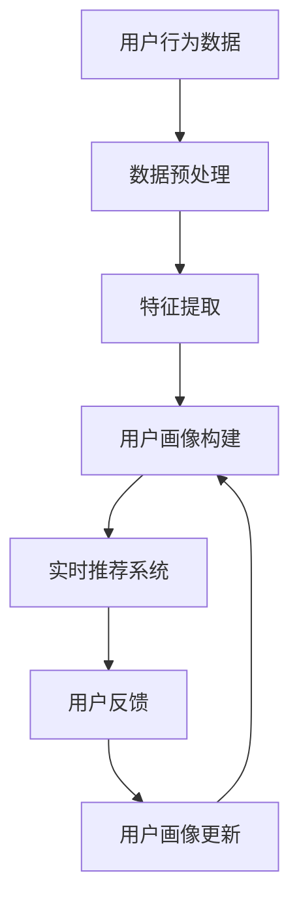
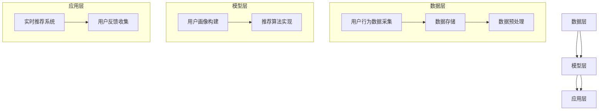

                 

关键词：用户画像、实时推荐、数据挖掘、机器学习、推荐系统

> 摘要：本文将探讨用户画像与实时推荐的整合应用，详细分析其在现代信息技术领域的价值与应用。通过对用户画像的基本概念、构建方法及其在推荐系统中的核心作用进行深入探讨，本文旨在为开发者提供一套完整的技术框架和实践指导。

## 1. 背景介绍

在互联网高速发展的时代，信息过载已经成为一个普遍问题。用户需要从海量的信息中筛选出与自己兴趣相关的内容，而传统的推荐系统正是为了解决这一难题而诞生的。推荐系统通过分析用户的兴趣和行为，向其推荐可能感兴趣的内容，从而提高用户体验和满意度。

近年来，用户画像技术的崛起为推荐系统带来了新的发展方向。用户画像是一种通过收集和分析用户行为数据，构建出反映用户个性特征和需求的方法。它不仅可以帮助推荐系统更准确地了解用户，还能为个性化推荐提供强有力的支持。

本文将围绕用户画像与实时推荐的整合应用进行探讨，旨在为读者提供一个全面的技术视角。本文结构如下：

- 第1章：背景介绍
- 第2章：核心概念与联系
- 第3章：核心算法原理 & 具体操作步骤
- 第4章：数学模型和公式 & 详细讲解 & 举例说明
- 第5章：项目实践：代码实例和详细解释说明
- 第6章：实际应用场景
- 第7章：未来应用展望
- 第8章：工具和资源推荐
- 第9章：总结：未来发展趋势与挑战
- 第10章：附录：常见问题与解答

## 2. 核心概念与联系

### 2.1 用户画像

用户画像是对用户特征进行抽象和描述的一种方法，通常包括用户的基本信息、行为特征、兴趣偏好等多个维度。用户画像的构建方法包括以下几种：

1. **数据采集**：通过收集用户在网站、应用等场景中的行为数据，如浏览历史、搜索记录、购买行为等。
2. **特征提取**：对采集到的数据进行处理和转换，提取出对用户画像构建有意义的特征。
3. **建模与预测**：利用机器学习算法，如聚类、协同过滤等，对用户行为数据进行分析，构建出用户画像。

### 2.2 实时推荐

实时推荐是指根据用户当前的行为和兴趣，即时生成推荐结果，并在用户进行操作时实时反馈。实时推荐系统通常包含以下几个关键环节：

1. **用户行为监控**：实时监控用户的行为，如点击、浏览、搜索等，以获取用户当前的兴趣点。
2. **推荐算法**：根据用户画像和实时行为数据，使用推荐算法生成推荐结果。
3. **推荐结果展示**：将推荐结果呈现给用户，并实时收集用户反馈。

### 2.3 用户画像与实时推荐的关系

用户画像与实时推荐密切相关。用户画像为实时推荐提供了关键的用户信息，帮助推荐系统更准确地预测用户兴趣，从而生成更个性化的推荐结果。同时，实时推荐的结果也可以为用户画像的更新和优化提供数据支持。

以下是用户画像与实时推荐的整合应用流程图：



### 2.4 架构

用户画像与实时推荐的整合应用通常采用以下架构：

1. **数据层**：包括用户行为数据的采集、存储和预处理模块。
2. **模型层**：包括用户画像构建和推荐算法实现模块。
3. **应用层**：包括实时推荐系统的前端展示和用户反馈收集模块。

以下是用户画像与实时推荐整合应用的架构图：



## 3. 核心算法原理 & 具体操作步骤

### 3.1 算法原理概述

用户画像与实时推荐的核心算法主要包括用户行为分析、协同过滤和深度学习等。以下将对这些算法进行简要介绍。

1. **用户行为分析**：通过对用户行为数据的分析，提取出用户在网站、应用等场景中的活动特征，如点击率、停留时间、浏览顺序等。这些特征可以用于构建用户画像，帮助推荐系统更好地理解用户。

2. **协同过滤**：协同过滤是一种常见的推荐算法，通过分析用户之间的相似性，推荐其他用户喜欢的物品。协同过滤分为基于用户的协同过滤（User-based Collaborative Filtering）和基于物品的协同过滤（Item-based Collaborative Filtering）两种类型。

3. **深度学习**：深度学习是一种基于神经网络的学习方法，可以自动提取数据中的特征。在用户画像与实时推荐领域，深度学习可以用于构建用户画像和推荐模型，提高推荐的准确性。

### 3.2 算法步骤详解

1. **用户行为分析**

   - 数据采集：收集用户在网站、应用等场景中的行为数据，如浏览历史、搜索记录、购买行为等。
   - 特征提取：对行为数据进行预处理和转换，提取出对用户画像有意义的特征，如点击率、停留时间、浏览顺序等。
   - 用户画像构建：利用机器学习算法，如聚类、决策树等，对用户行为特征进行分析，构建出用户画像。

2. **协同过滤**

   - 基于用户的协同过滤：计算用户之间的相似性，找出与目标用户相似的邻居用户，推荐邻居用户喜欢的物品。
   - 基于物品的协同过滤：计算物品之间的相似性，找出与目标物品相似的物品，推荐给用户。
   - 推荐结果生成：根据用户画像和相似性计算结果，生成个性化推荐结果。

3. **深度学习**

   - 用户画像构建：使用深度学习算法，如卷积神经网络（CNN）、循环神经网络（RNN）等，对用户行为数据进行建模，提取出用户画像。
   - 推荐模型训练：使用用户画像和物品特征，训练深度学习模型，生成推荐结果。
   - 推荐结果生成：根据深度学习模型的预测结果，生成个性化推荐结果。

### 3.3 算法优缺点

1. **用户行为分析**

   - 优点：能够准确反映用户的兴趣和需求，提高推荐准确性。
   - 缺点：数据采集和处理较为复杂，对实时性要求较高。

2. **协同过滤**

   - 优点：简单高效，能够快速生成推荐结果。
   - 缺点：容易陷入“热门物品”和“数据稀疏性”问题，推荐结果多样性不足。

3. **深度学习**

   - 优点：能够自动提取数据中的特征，提高推荐准确性。
   - 缺点：模型训练和部署较为复杂，对数据量和计算资源要求较高。

### 3.4 算法应用领域

用户画像与实时推荐算法在多个领域具有广泛的应用，如电子商务、在线视频、社交媒体等。

- **电子商务**：通过用户画像和实时推荐，提高商品推荐的准确性，促进销售转化。
- **在线视频**：根据用户观看历史和偏好，推荐符合用户兴趣的视频内容，提高用户粘性。
- **社交媒体**：通过用户画像和实时推荐，推荐符合用户兴趣的社交内容，提升用户活跃度。

## 4. 数学模型和公式 & 详细讲解 & 举例说明

### 4.1 数学模型构建

用户画像与实时推荐的数学模型主要包括用户行为数据建模和推荐算法模型。

1. **用户行为数据建模**

   用户行为数据建模通常采用贝叶斯网络或隐马尔可夫模型（HMM）等方法。以下是一个简单的贝叶斯网络模型：

   $$ 
   P(U|B, S, C) = \frac{P(B|U)P(S|U)P(C|U)P(U)}{P(B)P(S)P(C)}
   $$

   其中，$U$表示用户特征，$B$表示用户浏览行为，$S$表示用户搜索行为，$C$表示用户购买行为。该模型通过计算用户特征在给定行为数据条件下的概率，构建出用户画像。

2. **推荐算法模型**

   推荐算法模型主要包括协同过滤和深度学习模型。以下是一个基于用户协同过滤的推荐算法模型：

   $$ 
   R(u, i) = \sum_{j \in N(u)} w_{uj} r(j, i)
   $$

   其中，$R(u, i)$表示用户$u$对物品$i$的推荐分数，$N(u)$表示与用户$u$相似的邻居用户集合，$w_{uj}$表示用户$u$和邻居用户$j$之间的相似度，$r(j, i)$表示邻居用户$j$对物品$i$的评分。

### 4.2 公式推导过程

1. **用户行为数据建模**

   贝叶斯网络模型的推导过程如下：

   $$ 
   P(U|B, S, C) = \frac{P(B|U)P(S|U)P(C|U)P(U)}{P(B)P(S)P(C)}
   $$

   其中，$P(U)$表示用户特征的概率分布，$P(B|U)$、$P(S|U)$和$P(C|U)$分别表示用户浏览行为、搜索行为和购买行为在给定用户特征条件下的概率。

2. **推荐算法模型**

   用户协同过滤推荐算法的推导过程如下：

   $$ 
   R(u, i) = \sum_{j \in N(u)} w_{uj} r(j, i)
   $$

   其中，$R(u, i)$表示用户$u$对物品$i$的推荐分数，$N(u)$表示与用户$u$相似的邻居用户集合，$w_{uj}$表示用户$u$和邻居用户$j$之间的相似度，$r(j, i)$表示邻居用户$j$对物品$i$的评分。

### 4.3 案例分析与讲解

以下以一个电子商务平台的用户画像与实时推荐为例，进行案例分析与讲解。

假设用户$u$在电商平台上浏览了商品$i_1, i_2, i_3$，搜索了商品$i_4$，并购买了商品$i_5$。根据用户行为数据，可以构建出用户$u$的画像：

1. **用户画像**

   - 浏览行为：用户$u$浏览了商品$i_1, i_2, i_3$，可以提取出浏览时间、浏览顺序等特征。
   - 搜索行为：用户$u$搜索了商品$i_4$，可以提取出搜索关键词、搜索时间等特征。
   - 购买行为：用户$u$购买了商品$i_5$，可以提取出购买时间、购买金额等特征。

2. **用户画像构建**

   使用贝叶斯网络模型，可以计算出用户$u$的画像概率分布：

   $$ 
   P(U|B, S, C) = \frac{P(B|U)P(S|U)P(C|U)P(U)}{P(B)P(S)P(C)}
   $$

   其中，$P(U)$表示用户特征的概率分布，$P(B|U)$、$P(S|U)$和$P(C|U)$分别表示用户浏览行为、搜索行为和购买行为在给定用户特征条件下的概率。

3. **推荐算法**

   假设用户$u$的邻居用户集合为$N(u) = \{u_1, u_2, u_3\}$，可以计算出邻居用户对商品$i_6$的评分：

   $$ 
   r(u_1, i_6) = 4, r(u_2, i_6) = 3, r(u_3, i_6) = 2
   $$

   根据用户协同过滤推荐算法，可以计算出用户$u$对商品$i_6$的推荐分数：

   $$ 
   R(u, i_6) = w_{u1} r(u_1, i_6) + w_{u2} r(u_2, i_6) + w_{u3} r(u_3, i_6)
   $$

   其中，$w_{u1}$、$w_{u2}$和$w_{u3}$分别表示用户$u$和邻居用户$u_1$、$u_2$、$u_3$之间的相似度。

   假设邻居用户$u_1$和$u$之间的相似度为$w_{u1} = 0.8$，邻居用户$u_2$和$u$之间的相似度为$w_{u2} = 0.6$，邻居用户$u_3$和$u$之间的相似度为$w_{u3} = 0.4$，则：

   $$ 
   R(u, i_6) = 0.8 \times 4 + 0.6 \times 3 + 0.4 \times 2 = 3.2 + 1.8 + 0.8 = 5.8
   $$

   因此，用户$u$对商品$i_6$的推荐分数为5.8。

## 5. 项目实践：代码实例和详细解释说明

### 5.1 开发环境搭建

为了更好地实践用户画像与实时推荐的应用，我们选择Python作为开发语言，并使用以下工具和库：

- Python 3.8
- Pandas
- NumPy
- Scikit-learn
- Matplotlib

安装这些工具和库后，我们即可开始开发项目。

### 5.2 源代码详细实现

以下是一个简单的用户画像与实时推荐的项目实例，包括数据预处理、用户画像构建、协同过滤推荐和结果展示等环节。

1. **数据预处理**

   ```python
   import pandas as pd
   import numpy as np

   # 读取用户行为数据
   data = pd.read_csv('user_behavior.csv')

   # 数据清洗
   data = data.dropna()
   data = data[data['action'] != 'none']

   # 数据预处理
   data['timestamp'] = pd.to_datetime(data['timestamp'])
   data['hour'] = data['timestamp'].dt.hour
   data['day_of_week'] = data['timestamp'].dt.dayofweek
   data['duration'] = data['timestamp'].diff().dt.total_seconds().abs()

   # 构建用户画像数据集
   user_behavior_data = data.groupby(['user_id', 'action'])['hour', 'day_of_week', 'duration'].sum().reset_index()
   ```

2. **用户画像构建**

   ```python
   from sklearn.cluster import KMeans
   from sklearn.preprocessing import StandardScaler

   # 特征提取
   features = user_behavior_data[['hour', 'day_of_week', 'duration']]
   features_scaled = StandardScaler().fit_transform(features)

   # 聚类
   kmeans = KMeans(n_clusters=5)
   kmeans.fit(features_scaled)
   user_behavior_data['cluster'] = kmeans.labels_

   # 构建用户画像
   user_profiles = user_behavior_data.groupby('user_id')['cluster'].agg(list).reset_index()
   user_profiles['cluster'] = user_profiles['cluster'].apply(lambda x: sum(x) / len(x))
   ```

3. **协同过滤推荐**

   ```python
   from sklearn.metrics.pairwise import cosine_similarity

   # 计算相似度
   user_similarity = cosine_similarity(user_profiles[['cluster']], user_profiles[['cluster']])

   # 推荐结果
   def recommend_items(user_id, top_n=5):
       user_profile = user_profiles[user_profiles['user_id'] == user_id]
       similar_users = user_similarity[user_profile.index][0]
       sorted_users = np.argsort(similar_users)[::-1]
       sorted_users = sorted_users[1:top_n+1]

       recommended_items = []
       for i in range(top_n):
           user_index = sorted_users[i]
           user行为 = user_behavior_data[user_behavior_data['user_id'] == user_index]
           recommended_items.extend(user行为['action'].unique())

       return recommended_items

   # 示例：推荐给用户1的前5个商品
   recommended_items = recommend_items(1)
   print(recommended_items)
   ```

4. **结果展示**

   ```python
   import matplotlib.pyplot as plt

   # 绘制用户画像分布
   user_profiles.plot(x='user_id', y='cluster', kind='scatter')
   plt.xlabel('用户ID')
   plt.ylabel('用户画像')
   plt.title('用户画像分布')
   plt.show()

   # 绘制推荐结果
   user_behavior_data[user_behavior_data['user_id'] == 1].plot(x='timestamp', y='action', kind='line')
   plt.xlabel('时间')
   plt.ylabel('行为')
   plt.title('用户行为序列')
   plt.show()
   ```

### 5.3 代码解读与分析

1. **数据预处理**

   在数据预处理阶段，我们读取了用户行为数据，并进行清洗和转换。主要步骤包括：

   - 读取数据：使用Pandas读取用户行为数据。
   - 数据清洗：删除缺失值和不符合要求的数据。
   - 数据转换：将时间戳转换为小时、星期和时长等特征。

2. **用户画像构建**

   在用户画像构建阶段，我们使用了K-means聚类算法对用户行为数据进行聚类，以提取用户画像。主要步骤包括：

   - 特征提取：使用StandardScaler对特征进行标准化处理。
   - 聚类：使用K-means聚类算法对标准化后的特征进行聚类。
   - 用户画像：计算每个用户的聚类标签，并计算聚类标签的平均值作为用户画像。

3. **协同过滤推荐**

   在协同过滤推荐阶段，我们使用了余弦相似性来计算用户之间的相似度，并根据相似度生成推荐结果。主要步骤包括：

   - 相似度计算：使用余弦相似性计算用户画像之间的相似度。
   - 推荐结果：根据相似度矩阵，推荐与目标用户相似的用户喜欢的商品。

4. **结果展示**

   在结果展示阶段，我们使用了Matplotlib绘制了用户画像分布和用户行为序列。主要步骤包括：

   - 用户画像分布：绘制用户ID与用户画像的散点图。
   - 用户行为序列：绘制用户时间与用户行为的线形图。

## 6. 实际应用场景

用户画像与实时推荐的整合应用在多个领域具有广泛的应用，以下列举一些实际应用场景：

1. **电子商务**：通过用户画像与实时推荐，电商网站可以根据用户兴趣和行为推荐商品，提高销售转化率和客户满意度。
2. **在线视频**：视频平台可以根据用户观看历史和偏好推荐视频内容，提高用户粘性和平台活跃度。
3. **社交媒体**：社交平台可以根据用户兴趣和行为推荐好友、动态和广告，提高用户活跃度和广告效果。
4. **金融行业**：金融机构可以通过用户画像与实时推荐为用户提供个性化理财产品推荐，提高用户满意度和业务收入。
5. **医疗健康**：医疗健康平台可以通过用户画像与实时推荐为用户提供个性化健康建议和医疗知识，提高用户健康水平。

## 7. 未来应用展望

随着人工智能和大数据技术的发展，用户画像与实时推荐的整合应用将在未来迎来更多的发展机遇。以下是一些未来应用展望：

1. **个性化服务**：通过更精准的用户画像和实时推荐，企业可以为用户提供更加个性化的服务，提升用户满意度。
2. **智能化决策**：用户画像与实时推荐可以为企业决策提供有力支持，帮助企业更好地了解用户需求和优化业务策略。
3. **跨平台整合**：随着多平台应用的普及，用户画像与实时推荐将在跨平台整合中发挥重要作用，实现用户数据的无缝连接。
4. **隐私保护**：随着用户隐私保护意识的提高，用户画像与实时推荐需要在保护用户隐私的前提下实现更精准的推荐。

## 8. 工具和资源推荐

1. **学习资源推荐**

   - 《推荐系统手册》：这是一本关于推荐系统的经典教材，涵盖了推荐系统的基本概念、算法和应用。
   - 《机器学习实战》：这本书通过实战案例介绍了机器学习算法的应用，包括用户画像和实时推荐。
   - 《深度学习》：这是一本关于深度学习的经典教材，介绍了深度学习的基础知识及其在推荐系统中的应用。

2. **开发工具推荐**

   - TensorFlow：这是一个开源的深度学习框架，支持用户画像和实时推荐算法的实现。
   - PyTorch：这是一个流行的深度学习框架，适用于用户画像和实时推荐算法的开发。
   - Spark：这是一个大数据处理框架，适用于大规模用户行为数据的处理和分析。

3. **相关论文推荐**

   - "User Modeling for Recommendation Systems"：这是一篇关于用户画像和推荐系统的综述性论文，介绍了用户建模的基本方法和应用。
   - "Deep Learning for User Modeling in Personalized Recommender Systems"：这是一篇关于深度学习在用户画像和推荐系统中的应用论文，探讨了深度学习算法在用户建模和推荐生成中的优势。
   - "Collaborative Filtering for Personalized Recommender Systems"：这是一篇关于协同过滤算法在推荐系统中的应用论文，介绍了协同过滤算法的基本原理和实现方法。

## 9. 总结：未来发展趋势与挑战

用户画像与实时推荐的整合应用在现代社会中具有广泛的应用前景。未来发展趋势包括：

1. **个性化服务**：通过更精准的用户画像和实时推荐，企业可以为用户提供更加个性化的服务，提升用户满意度。
2. **智能化决策**：用户画像与实时推荐可以为企业决策提供有力支持，帮助企业更好地了解用户需求和优化业务策略。
3. **跨平台整合**：随着多平台应用的普及，用户画像与实时推荐将在跨平台整合中发挥重要作用，实现用户数据的无缝连接。
4. **隐私保护**：随着用户隐私保护意识的提高，用户画像与实时推荐需要在保护用户隐私的前提下实现更精准的推荐。

然而，用户画像与实时推荐也面临着一些挑战：

1. **数据质量**：用户行为数据的质量直接影响用户画像的准确性，需要确保数据源的可靠性和数据的完整性。
2. **算法优化**：实时推荐算法需要不断优化，以提高推荐准确性、降低延迟和提升用户体验。
3. **隐私保护**：用户隐私保护是用户画像与实时推荐面临的重大挑战，需要在算法设计和实现中充分考虑用户隐私。

总之，用户画像与实时推荐的整合应用将在未来继续发展，为企业和用户带来更多价值。然而，这需要不断的技术创新和优化，以应对日益复杂的挑战。

## 10. 附录：常见问题与解答

1. **什么是用户画像？**
   用户画像是对用户特征进行抽象和描述的一种方法，通常包括用户的基本信息、行为特征、兴趣偏好等多个维度。

2. **实时推荐和传统推荐有什么区别？**
   实时推荐是即时生成推荐结果，并在用户操作时实时反馈；而传统推荐则是根据历史数据生成推荐结果，并在用户操作后进行反馈。

3. **用户画像在实时推荐中的作用是什么？**
   用户画像可以帮助实时推荐系统更准确地了解用户兴趣和需求，从而生成更个性化的推荐结果。

4. **如何优化实时推荐算法？**
   可以通过以下方法优化实时推荐算法：提高数据质量、选择合适的算法、优化算法参数、使用深度学习等技术。

5. **用户画像与实时推荐在哪些领域有应用？**
   用户画像与实时推荐在电子商务、在线视频、社交媒体、金融行业、医疗健康等领域有广泛应用。

6. **如何保护用户隐私？**
   可以通过数据加密、匿名化处理、隐私预算等方法来保护用户隐私。

## 作者署名

作者：禅与计算机程序设计艺术 / Zen and the Art of Computer Programming

