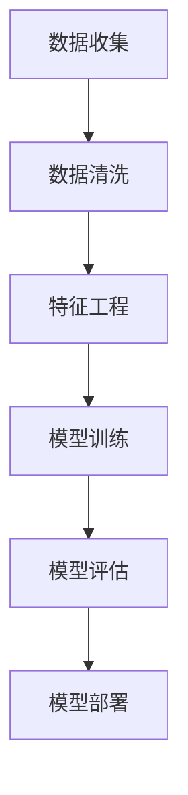

                 

关键词：用户画像，人工智能，个性化推荐，数据分析，机器学习

> 摘要：本文将深入探讨用户画像的概念、构建方法以及其在AI个性化推荐中的应用。通过介绍用户画像的核心概念与联系，解析核心算法原理与操作步骤，讲解数学模型和公式，展示实际项目实践，分析实际应用场景，展望未来发展趋势与挑战。

## 1. 背景介绍

用户画像作为一种新兴的数据分析方法，已经成为现代营销和产品推荐系统中的核心工具。随着大数据和人工智能技术的不断发展，用户画像的应用范围越来越广泛，从电子商务、社交媒体到金融、医疗等各个领域，用户画像都发挥着重要作用。

在人工智能的推动下，用户画像不仅能够捕捉用户的表面行为数据，如浏览记录、购买历史等，还能够通过深度学习等算法深入挖掘用户的潜在需求，从而实现更精准的个性化推荐。

本文旨在通过详细的论述，帮助读者了解用户画像的构建方法、核心算法原理及其在实际应用中的表现，从而为相关领域的实践和理论研究提供参考。

## 2. 核心概念与联系

### 2.1. 用户画像的定义

用户画像，又称用户档案，是一种基于用户行为数据、偏好、需求等多维度信息构建的虚拟用户形象。用户画像的主要目的是通过数据分析，实现对用户需求的深入理解，从而为个性化推荐和精准营销提供依据。

### 2.2. 用户画像的构成要素

用户画像通常由以下几部分构成：

1. **基础属性**：包括用户的基本信息，如年龄、性别、地理位置等。
2. **行为数据**：记录用户在系统中的各种行为，如浏览记录、购买历史、评价等。
3. **兴趣偏好**：通过分析用户行为数据，提取出用户的兴趣标签和偏好。
4. **社交关系**：包括用户在社交网络中的关系，如好友、关注的人等。

### 2.3. 用户画像的构建方法

用户画像的构建一般可以分为以下几个步骤：

1. **数据收集**：收集用户在系统中产生的各种数据，包括结构化数据和非结构化数据。
2. **数据清洗**：对收集到的数据进行处理，去除无效数据，保证数据的准确性和完整性。
3. **特征工程**：对原始数据进行转换和提取，形成能够代表用户特征的变量。
4. **模型训练**：使用机器学习算法，根据特征变量训练用户画像模型。
5. **模型评估**：对训练好的模型进行评估，调整参数以获得更好的效果。
6. **模型部署**：将训练好的模型部署到线上系统，实时更新用户画像。

### 2.4. Mermaid 流程图



## 3. 核心算法原理 & 具体操作步骤

### 3.1. 算法原理概述

用户画像的构建依赖于多种机器学习算法，如协同过滤、聚类分析、深度学习等。以下是这些算法的基本原理：

1. **协同过滤**：通过分析用户的行为数据，找到相似的用户或物品，从而进行推荐。
2. **聚类分析**：将用户划分为不同的群体，每个群体具有相似的特征，从而实现个性化推荐。
3. **深度学习**：通过神经网络模型，对用户的特征进行复杂的学习和建模，从而获得更精准的用户画像。

### 3.2. 算法步骤详解

1. **协同过滤**

   - **用户相似度计算**：计算用户之间的相似度，可以使用余弦相似度、皮尔逊相关系数等方法。
   - **推荐物品选择**：根据用户之间的相似度，为用户推荐相似度高的物品。

2. **聚类分析**

   - **特征选择**：选择能够代表用户特征的变量。
   - **聚类算法**：使用K-means、DBSCAN等聚类算法，将用户划分为不同的群体。
   - **推荐策略**：为每个群体推荐群体内的热门物品。

3. **深度学习**

   - **模型构建**：使用卷积神经网络（CNN）、递归神经网络（RNN）等构建用户画像模型。
   - **参数训练**：使用用户数据训练模型，调整模型参数。
   - **模型评估**：使用测试数据评估模型效果，调整模型结构。

### 3.3. 算法优缺点

1. **协同过滤**

   - **优点**：能够根据用户行为数据进行准确的推荐。
   - **缺点**：需要大量用户行为数据，且推荐结果容易受到数据稀疏性的影响。

2. **聚类分析**

   - **优点**：不需要大量的用户行为数据，能够发现用户的潜在兴趣。
   - **缺点**：推荐结果可能不够精确，且聚类算法的选择和参数调整比较复杂。

3. **深度学习**

   - **优点**：能够处理复杂的用户特征，推荐结果更加精准。
   - **缺点**：需要大量的训练数据和时间，模型训练和调优比较复杂。

### 3.4. 算法应用领域

用户画像算法广泛应用于电子商务、社交媒体、金融、医疗等领域，如：

- **电子商务**：根据用户的购买行为，推荐相似的物品。
- **社交媒体**：根据用户的兴趣标签，推荐感兴趣的内容。
- **金融**：根据用户的信用记录和消费习惯，进行风险控制和精准营销。
- **医疗**：根据患者的病史和症状，推荐合适的治疗方案。

## 4. 数学模型和公式 & 详细讲解 & 举例说明

### 4.1. 数学模型构建

用户画像的构建通常涉及以下数学模型：

1. **用户行为模型**：使用时间序列分析，捕捉用户的行为模式。

   $$User\_Behavior(t) = f(User\_Feature, Time\_Series)$$

2. **用户兴趣模型**：使用聚类分析，提取用户的兴趣标签。

   $$Interest\_Tag = g(User\_Behavior, Cluster\_Algorithm)$$

3. **用户推荐模型**：使用协同过滤或深度学习，生成个性化的推荐列表。

   $$Recommendation = h(User\_Interest, Item\_Feature, Collaborative\_Filtering/Deep\_Learning)$$

### 4.2. 公式推导过程

假设我们使用K-means算法进行用户聚类，则公式推导如下：

1. **初始聚类中心**：

   $$Center\_Initial = \frac{1}{n} \sum_{i=1}^{n} User\_i$$

2. **更新聚类中心**：

   $$Center = \frac{1}{n} \sum_{i=1}^{n} User\_i \in Cluster$$

3. **聚类误差**：

   $$Error = \sum_{i=1}^{n} (User\_i - Center)^2$$

### 4.3. 案例分析与讲解

假设我们有一个电子商务平台，用户的行为数据包括浏览记录和购买历史。我们使用K-means算法进行用户聚类，并基于用户的兴趣标签进行个性化推荐。

1. **数据收集**：

   收集过去一个月的浏览记录和购买历史数据。

2. **数据清洗**：

   去除无效数据，如重复记录、缺失值等。

3. **特征工程**：

   提取用户的浏览频次、购买频次、浏览时长等特征。

4. **模型训练**：

   使用K-means算法进行用户聚类，设置聚类数量为5。

5. **模型评估**：

   计算聚类误差，调整聚类参数以获得更好的聚类效果。

6. **模型部署**：

   将训练好的模型部署到线上系统，实时更新用户画像。

7. **推荐策略**：

   根据用户的兴趣标签，推荐与兴趣相关的商品。

## 5. 项目实践：代码实例和详细解释说明

### 5.1. 开发环境搭建

1. **Python**：安装Python 3.8及以上版本。
2. **NumPy**：安装NumPy库。
3. **Pandas**：安装Pandas库。
4. **Scikit-learn**：安装Scikit-learn库。

### 5.2. 源代码详细实现

```python
import numpy as np
import pandas as pd
from sklearn.cluster import KMeans
from sklearn.metrics import silhouette_score

# 数据收集
data = pd.read_csv('user_behavior.csv')

# 数据清洗
data.drop_duplicates(inplace=True)
data.fillna(0, inplace=True)

# 特征工程
data['browse_frequency'] = data.groupby('user')['browse_id'].transform('count')
data['purchase_frequency'] = data.groupby('user')['purchase_id'].transform('count')
data['browse_duration'] = data.groupby('user')['browse_duration'].mean()

# 模型训练
kmeans = KMeans(n_clusters=5, random_state=42)
clusters = kmeans.fit_predict(data[['browse_frequency', 'purchase_frequency', 'browse_duration']])

# 模型评估
silhouette_avg = silhouette_score(data[['browse_frequency', 'purchase_frequency', 'browse_duration']], clusters)
print(f'Silhouette Score: {silhouette_avg}')

# 模型部署
data['cluster'] = clusters
data.to_csv('user_cluster.csv', index=False)

# 推荐策略
recommendation = data[data['cluster'] == 0]['item_id'].head(10)
print(f'Top 10 Recommended Items: {recommendation}')
```

### 5.3. 代码解读与分析

1. **数据收集**：从CSV文件中读取用户行为数据。
2. **数据清洗**：去除重复数据和缺失值。
3. **特征工程**：提取浏览频次、购买频次、浏览时长等特征。
4. **模型训练**：使用K-means算法进行用户聚类。
5. **模型评估**：计算聚类误差和轮廓系数。
6. **模型部署**：将聚类结果保存到CSV文件。
7. **推荐策略**：根据聚类结果推荐与兴趣相关的商品。

## 6. 实际应用场景

用户画像在实际应用中具有广泛的应用场景，以下是几个典型的应用案例：

### 6.1. 电子商务

电子商务平台使用用户画像分析用户的购买行为和偏好，为用户推荐相关的商品。例如，某用户喜欢购买运动鞋，系统可以根据这一偏好，推荐类似的运动装备。

### 6.2. 社交媒体

社交媒体平台通过用户画像分析用户的兴趣和社交关系，为用户推荐感兴趣的内容和好友。例如，某用户喜欢阅读科技文章，系统可以推荐相关的科技博主和文章。

### 6.3. 金融

金融机构使用用户画像进行风险控制和精准营销。例如，某用户有较高的信用卡消费额度，系统可以推荐与消费水平相匹配的贷款产品。

### 6.4. 医疗

医疗机构使用用户画像分析患者的病史和症状，为患者推荐合适的治疗方案。例如，某患者有糖尿病病史，系统可以推荐相关的血糖监测设备和治疗方案。

## 7. 工具和资源推荐

### 7.1. 学习资源推荐

- 《用户画像技术：方法与实践》
- 《机器学习实战》
- 《深度学习》（Goodfellow, Bengio, Courville）

### 7.2. 开发工具推荐

- Python（数据分析）
- NumPy（数值计算）
- Pandas（数据处理）
- Scikit-learn（机器学习）
- TensorFlow（深度学习）

### 7.3. 相关论文推荐

- "User Modeling and User-Adapted Interaction in Information Systems"
- "Collaborative Filtering for the 21st Century"
- "Deep Learning for User Modeling in Recommender Systems"

## 8. 总结：未来发展趋势与挑战

### 8.1. 研究成果总结

用户画像技术在过去几年取得了显著的进展，包括数据采集、特征工程、算法优化等方面。随着人工智能技术的不断进步，用户画像的构建方法将更加多样和精确。

### 8.2. 未来发展趋势

- **数据隐私与安全**：用户画像涉及到大量个人隐私数据，未来将更加注重数据隐私保护和安全。
- **多模态数据融合**：结合文本、图像、语音等多模态数据，构建更全面的用户画像。
- **实时动态更新**：用户画像将更加实时和动态，以适应用户行为和需求的快速变化。
- **跨平台融合**：实现不同平台间的用户画像数据共享和融合，提供更统一的用户体验。

### 8.3. 面临的挑战

- **数据质量**：用户画像的准确性取决于数据质量，如何处理噪声数据和缺失值是一个重要挑战。
- **算法复杂度**：用户画像算法的复杂度较高，如何优化算法性能和降低计算成本是一个难题。
- **用户隐私**：用户画像涉及到大量个人隐私信息，如何在保护用户隐私的同时进行有效推荐是一个挑战。

### 8.4. 研究展望

未来，用户画像技术将更加注重数据隐私保护和用户体验，探索更高效和准确的算法，以实现更智能和个性化的推荐系统。

## 9. 附录：常见问题与解答

### 9.1. 问题1：用户画像的构建需要哪些数据？

用户画像的构建需要多种数据，包括用户的基本信息、行为数据、兴趣偏好数据等。具体包括：

- **基本信息**：用户的基本信息，如年龄、性别、地理位置等。
- **行为数据**：用户在系统中的行为记录，如浏览记录、购买历史、评价等。
- **兴趣偏好**：用户对特定内容的兴趣和偏好，可以通过调查、标签等方式收集。

### 9.2. 问题2：如何处理用户画像中的噪声数据？

处理用户画像中的噪声数据可以通过以下方法：

- **数据清洗**：去除重复数据、缺失值、异常值等。
- **特征工程**：对原始数据进行转换和提取，减少噪声对模型的影响。
- **降维技术**：使用主成分分析（PCA）等方法，减少数据维度，降低噪声影响。

### 9.3. 问题3：用户画像在哪些领域有应用？

用户画像在多个领域有广泛应用，包括：

- **电子商务**：根据用户偏好推荐商品。
- **社交媒体**：根据用户兴趣推荐内容和人。
- **金融**：根据用户信用和消费习惯进行风险控制和精准营销。
- **医疗**：根据患者病史和症状推荐治疗方案。

----------------------------------------------------------------

本文作者：禅与计算机程序设计艺术 / Zen and the Art of Computer Programming

