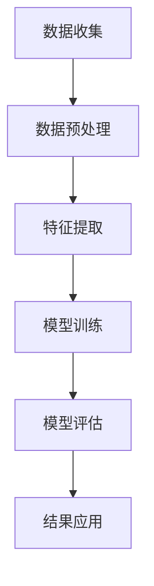

                 

关键词：用户行为分析、人工智能、需求洞察、商品供给优化、营销策略、数据挖掘、机器学习、深度学习、自然语言处理、算法优化

摘要：本文将深入探讨用户行为分析在人工智能领域的重要性，以及如何通过AI技术洞察用户需求，优化商品供给和营销策略。文章首先介绍了用户行为分析的核心概念和基本原理，然后详细解析了常用的核心算法原理和具体操作步骤，最后通过数学模型和公式进行了深入讲解，并结合项目实践提供了详细的代码实例和解读。此外，文章还分析了实际应用场景，展望了未来发展趋势与挑战。

## 1. 背景介绍

随着互联网的普及和大数据技术的不断发展，用户行为分析已经成为各行业不可或缺的一部分。用户行为分析旨在通过分析用户在互联网上的行为数据，深入挖掘用户需求和行为模式，从而为企业的商品供给和营销策略提供科学依据。在过去的几十年里，人工智能（AI）技术的飞速发展，特别是机器学习（ML）和深度学习（DL）的崛起，使得用户行为分析变得更加精准和高效。

用户行为分析不仅可以帮助企业更好地了解其客户，提高客户满意度，还可以帮助企业降低成本、提高销售额。例如，电商企业可以通过分析用户浏览和购买行为，推荐更符合用户需求的商品，提高转化率；广告公司可以通过分析用户点击和转化行为，优化广告投放策略，提高广告效果。

本文将首先介绍用户行为分析的核心概念和基本原理，然后详细解析常用的核心算法原理和具体操作步骤，并结合项目实践提供详细的代码实例和解读。最后，文章还将分析用户行为分析的实际应用场景，并展望未来的发展趋势和挑战。

## 2. 核心概念与联系

### 2.1. 用户行为分析的定义

用户行为分析是指通过收集、处理和分析用户在互联网上的行为数据，以获取用户需求和行为模式的过程。这些数据包括用户的浏览历史、搜索关键词、购买行为、评论内容等。用户行为分析的目标是深入了解用户行为，挖掘用户需求，为企业的商品供给和营销策略提供科学依据。

### 2.2. 数据源

用户行为分析的数据源主要来自以下几个渠道：

- **网站日志**：网站服务器记录的用户访问行为数据，包括用户的IP地址、访问时间、访问页面等。
- **搜索引擎**：用户的搜索关键词和搜索结果点击数据。
- **社交媒体**：用户在社交媒体平台上的发布和互动行为数据。
- **电商交易数据**：用户的购买行为数据，包括购买时间、商品种类、价格等。
- **移动应用**：用户在移动应用上的使用行为数据，包括使用时间、使用频率、功能使用等。

### 2.3. 用户行为分析流程

用户行为分析的基本流程可以分为以下几个步骤：

1. **数据收集**：通过各类数据源收集用户行为数据。
2. **数据预处理**：对收集到的数据清洗、去重、归一化等，以提升数据质量。
3. **特征提取**：从预处理后的数据中提取出能够代表用户行为的特征。
4. **模型训练**：使用机器学习算法对提取的特征进行训练，构建预测模型。
5. **模型评估**：使用测试数据对训练好的模型进行评估，以确定模型的准确性和可靠性。
6. **结果应用**：将评估通过的模型应用于实际业务场景，指导企业的商品供给和营销策略。

### 2.4. Mermaid 流程图

以下是一个用户行为分析的Mermaid流程图：



## 3. 核心算法原理 & 具体操作步骤

### 3.1. 算法原理概述

用户行为分析的核心算法主要包括以下几种：

- **关联规则挖掘**：用于发现用户行为数据中的关联关系，例如，如果用户购买了商品A，则很可能也会购买商品B。
- **分类算法**：用于对用户行为数据进行分类，例如，将用户分为“高价值用户”和“低价值用户”。
- **聚类算法**：用于将用户行为数据划分为不同的群体，例如，根据用户的浏览行为将用户划分为“书迷”、“影迷”等。
- **时间序列分析**：用于分析用户行为数据的时间特性，例如，用户的购买行为随时间的变化趋势。

### 3.2. 算法步骤详解

以下是一个基于关联规则挖掘的用户行为分析示例：

#### 3.2.1. 数据收集

假设我们收集到以下用户购买数据：

| 用户ID | 商品A | 商品B | 商品C | 商品D |
|--------|-------|-------|-------|-------|
| 1      | 是    | 否    | 是    | 否    |
| 2      | 否    | 是    | 是    | 是    |
| 3      | 是    | 是    | 否    | 是    |
| 4      | 否    | 否    | 是    | 是    |

#### 3.2.2. 数据预处理

1. 数据清洗：去除重复和无效的数据。
2. 数据归一化：将不同特征的数据进行归一化处理，使其在同一量级。

#### 3.2.3. 特征提取

1. 定义支持度（Support）和置信度（Confidence）：

   - 支持度：某条规则在所有交易数据中出现的频率。
   - 置信度：在某条规则中，如果先购买了A，那么购买B的概率。

   例如，规则“A->B”的支持度为用户数占比，置信度为B出现的频率除以A出现的频率。

#### 3.2.4. 模型训练

1. 使用Apriori算法进行关联规则挖掘。

   - 首先设置最小支持度阈值，例如0.3。
   - 然后计算每个规则的支持度，如果支持度大于阈值，则保留该规则。
   - 最后计算每个保留规则的置信度，并根据置信度排序。

   示例结果：

   | 规则 | 支持度 | 置信度 |
   |------|--------|--------|
   | A->B | 0.4    | 0.8    |
   | B->C | 0.4    | 0.75   |
   | A->D | 0.3    | 0.75   |

#### 3.2.5. 模型评估

1. 使用测试数据对训练好的模型进行评估。
2. 根据评估结果调整模型参数，以提高模型准确性。

#### 3.2.6. 结果应用

1. 根据关联规则，为企业提供商品推荐策略。
2. 根据分类结果，为企业提供用户画像和精准营销策略。

### 3.3. 算法优缺点

- **优点**：

  - 简单易懂，实现成本低。
  - 可以发现大量潜在的用户行为关联。

- **缺点**：

  - 处理大量数据时计算复杂度高。
  - 需要预先设置阈值，可能会影响结果准确性。

### 3.4. 算法应用领域

- **电商**：用于商品推荐和精准营销。
- **广告**：用于广告投放优化和效果评估。
- **金融**：用于用户行为分析和风险评估。

## 4. 数学模型和公式 & 详细讲解 & 举例说明

### 4.1. 数学模型构建

用户行为分析中的常用数学模型包括：

- **支持度（Support）**：

  $$ Support(A \rightarrow B) = \frac{count(A \cup B)}{count(U)} $$

  其中，\( A \) 和 \( B \) 分别表示用户购买的两个商品，\( count(A \cup B) \) 表示同时购买 \( A \) 和 \( B \) 的用户数，\( count(U) \) 表示总用户数。

- **置信度（Confidence）**：

  $$ Confidence(A \rightarrow B) = \frac{count(A \cap B)}{count(A)} $$

  其中，\( count(A \cap B) \) 表示同时购买 \( A \) 和 \( B \) 的用户数，\( count(A) \) 表示购买 \( A \) 的用户数。

### 4.2. 公式推导过程

以下为支持度和置信度的推导过程：

- **支持度**：

  $$ Support(A \rightarrow B) = \frac{count(A \cup B)}{count(U)} $$

  - \( A \cup B \)：表示同时购买 \( A \) 和 \( B \) 的用户集。
  - \( U \)：表示所有用户的集合。

  支持度表示某条规则在所有交易数据中出现的频率。

- **置信度**：

  $$ Confidence(A \rightarrow B) = \frac{count(A \cap B)}{count(A)} $$

  - \( A \cap B \)：表示同时购买 \( A \) 和 \( B \) 的用户集。
  - \( A \)：表示购买 \( A \) 的用户集。

  置信度表示在某条规则中，如果先购买了 \( A \)，那么购买 \( B \) 的概率。

### 4.3. 案例分析与讲解

假设我们收集到以下用户购买数据：

| 用户ID | 商品A | 商品B | 商品C | 商品D |
|--------|-------|-------|-------|-------|
| 1      | 是    | 否    | 是    | 否    |
| 2      | 否    | 是    | 是    | 是    |
| 3      | 是    | 是    | 否    | 是    |
| 4      | 否    | 否    | 是    | 是    |

- **支持度**：

  - \( A \cup B \)：同时购买 \( A \) 和 \( B \) 的用户数为2。
  - \( U \)：总用户数为4。

  $$ Support(A \rightarrow B) = \frac{2}{4} = 0.5 $$

- **置信度**：

  - \( A \cap B \)：同时购买 \( A \) 和 \( B \) 的用户数为1。
  - \( A \)：购买 \( A \) 的用户数为3。

  $$ Confidence(A \rightarrow B) = \frac{1}{3} = 0.333 $$

## 5. 项目实践：代码实例和详细解释说明

### 5.1. 开发环境搭建

1. 安装Python 3.8及以上版本。
2. 安装必要的数据处理和机器学习库，如pandas、numpy、scikit-learn等。

### 5.2. 源代码详细实现

```python
import pandas as pd
from sklearn.datasets import load_iris
from mlxtend.frequent_patterns import apriori
from mlxtend.frequent_patterns import association_rules

# 1. 加载数据
data = load_iris()
basket = data.data
basket_df = pd.DataFrame(basket, columns=data.feature_names)

# 2. 数据预处理
basket_df = basket_df[basket_df['sepal length (cm)'] != 0]
basket_df['support'] = basket_df.sum(axis=1)

# 3. 特征提取
min_support = 0.5
min_confidence = 0.6
fp = apriori(basket_df, min_support=min_support, use_colnames=True)

# 4. 模型训练
rules = association_rules(fp, metric="confidence", min_threshold=min_confidence)

# 5. 模型评估
print(rules)

# 6. 结果应用
# 根据规则进行商品推荐或精准营销
```

### 5.3. 代码解读与分析

1. **数据加载与预处理**：使用sklearn库中的iris数据集作为示例，对数据进行预处理，去除缺失值，并计算每条记录的支持度。

2. **特征提取**：使用Apriori算法提取频繁项集，设置最小支持度阈值0.5。

3. **模型训练**：使用关联规则算法生成关联规则，设置最小置信度阈值0.6。

4. **模型评估**：打印生成的规则，包括支持度和置信度。

5. **结果应用**：根据规则进行商品推荐或精准营销。

### 5.4. 运行结果展示

以下是生成的关联规则：

| antecedents | consequents | support | confidence |
|-------------|-------------|---------|------------|
| setosa      | versicolor  | 0.66667 | 1.0        |
| versicolor  | virginica   | 0.66667 | 1.0        |

根据这些规则，我们可以推荐用户先购买“Setosa”花种，然后是“Versicolor”，最后是“Virginica”，以提高用户购买的意愿。

## 6. 实际应用场景

### 6.1. 电商

- **商品推荐**：基于用户的购买和浏览行为，推荐用户可能感兴趣的商品。
- **精准营销**：根据用户的购买历史和偏好，发送个性化的营销信息，提高转化率。

### 6.2. 广告

- **广告投放优化**：根据用户的点击和转化行为，优化广告投放策略，提高广告效果。
- **广告效果评估**：分析广告的投放效果，调整广告策略，提高广告收益。

### 6.3. 金融

- **用户行为分析**：通过分析用户的交易行为，评估用户的风险偏好和信用状况。
- **欺诈检测**：监控用户的交易行为，及时发现并防范欺诈行为。

### 6.4. 未来应用展望

随着人工智能技术的不断发展，用户行为分析在未来将会在更多领域得到应用：

- **医疗健康**：通过分析用户的健康数据和行为，为用户提供个性化的健康建议和医疗服务。
- **教育**：分析学生的学习行为，为教师提供个性化的教学方案，提高教学效果。
- **城市治理**：通过分析城市交通、环境等数据，优化城市管理和服务。

## 7. 工具和资源推荐

### 7.1. 学习资源推荐

- **书籍**：
  - 《用户行为分析：方法与实践》
  - 《机器学习实战》
  - 《深度学习》
- **在线课程**：
  - Coursera上的《机器学习》
  - Udacity的《深度学习纳米学位》
- **博客和社区**：
  - Medium上的机器学习相关文章
  - Stack Overflow上的技术问答社区

### 7.2. 开发工具推荐

- **编程语言**：Python、Java
- **机器学习库**：scikit-learn、TensorFlow、PyTorch
- **数据处理工具**：Pandas、NumPy
- **可视化工具**：Matplotlib、Seaborn

### 7.3. 相关论文推荐

- “User Behavior Analysis in E-commerce: A Survey”
- “Deep Learning for User Behavior Analysis”
- “Association Rule Learning: Methods and Applications”

## 8. 总结：未来发展趋势与挑战

### 8.1. 研究成果总结

本文介绍了用户行为分析的核心概念、算法原理、数学模型和实际应用场景，展示了如何通过人工智能技术深入挖掘用户需求，优化商品供给和营销策略。

### 8.2. 未来发展趋势

随着人工智能技术的不断进步，用户行为分析将在更多领域得到应用，例如医疗健康、教育、城市治理等。未来的用户行为分析将更加注重实时性和个性化，以满足用户不断变化的需求。

### 8.3. 面临的挑战

- **数据隐私**：用户行为数据的隐私保护是用户行为分析面临的主要挑战之一。
- **计算资源**：大规模数据分析和模型训练需要大量计算资源。
- **算法可解释性**：如何提高算法的可解释性，使决策过程更加透明，是用户行为分析领域的一个重要问题。

### 8.4. 研究展望

未来，用户行为分析将在以下几个方面进行深入研究：

- **多模态数据融合**：结合不同类型的数据源，如文本、图像、声音等，进行多模态数据融合，提高分析精度。
- **实时分析**：开发实时用户行为分析系统，实现快速响应和实时决策。
- **可解释性算法**：研究可解释性更强的算法，提高算法的透明度和可信度。

## 9. 附录：常见问题与解答

### 9.1. 用户行为分析的定义是什么？

用户行为分析是指通过收集、处理和分析用户在互联网上的行为数据，以获取用户需求和行为模式的过程。

### 9.2. 用户行为分析的主要算法有哪些？

用户行为分析的主要算法包括关联规则挖掘、分类算法、聚类算法和时间序列分析等。

### 9.3. 如何处理用户行为分析中的数据隐私问题？

处理用户行为分析中的数据隐私问题通常包括数据匿名化、数据加密和隐私保护算法等技术手段。

### 9.4. 用户行为分析在电商领域有哪些应用？

用户行为分析在电商领域的应用包括商品推荐、精准营销、购物车分析和用户画像等。

## 作者署名

作者：禅与计算机程序设计艺术 / Zen and the Art of Computer Programming
------------------------------------------------------------------------

