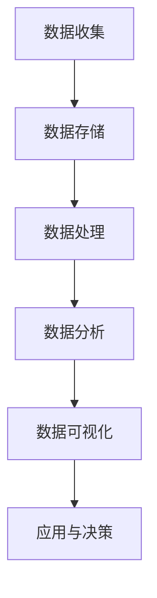

                 

关键字：用户行为分析、人工智能、个性化、数据分析、机器学习

> 摘要：本文探讨了用户行为分析在人工智能领域的应用，阐述了如何通过用户行为分析实现个性化推荐和智能化决策，并探讨了相关的核心算法原理、数学模型以及实际应用案例。本文旨在为读者提供一个全面、系统的用户行为分析视角，以推动人工智能技术在各个领域的深入应用。

## 1. 背景介绍

用户行为分析（User Behavior Analysis，简称UBA）是一种通过收集、分析和理解用户在数字环境中的行为数据，以获取用户需求、行为模式、偏好等信息的分析方法。随着互联网和移动设备的普及，用户行为数据的海量增长为人工智能技术的发展提供了丰富的资源。用户行为分析作为人工智能的一个重要分支，近年来得到了广泛关注和应用。

人工智能（Artificial Intelligence，简称AI）作为计算机科学的一个分支，致力于使计算机系统能够模拟人类智能，进行自我学习和决策。用户行为分析为人工智能提供了丰富的数据输入，使AI系统能够更好地理解和适应用户需求，实现个性化服务和智能化决策。

个性化（Personalization）是用户行为分析的核心目标之一，通过分析用户的行为数据，为用户提供个性化的内容、产品和服务。个性化服务能够提升用户体验，增加用户粘性，从而提高商业价值。

## 2. 核心概念与联系

### 2.1 用户行为分析的定义与目标

用户行为分析是一种基于数据驱动的方法，通过对用户在数字环境中的行为数据进行收集、存储、处理和分析，以获取用户的需求、偏好、行为模式等信息。用户行为分析的目标主要包括：

1. **了解用户需求**：通过分析用户的行为数据，深入了解用户的需求，为产品设计、服务优化提供依据。
2. **发现用户行为模式**：分析用户的行为轨迹，发现用户的行为模式和规律，为个性化推荐、精准营销等提供支持。
3. **预测用户行为**：利用机器学习算法，预测用户的未来行为，为决策提供依据。

### 2.2 个性化推荐系统

个性化推荐系统是用户行为分析的一个重要应用领域。个性化推荐系统通过分析用户的兴趣、行为和历史数据，为用户推荐可能感兴趣的内容、产品或服务。个性化推荐系统的核心包括：

1. **协同过滤**：基于用户相似度或物品相似度，为用户推荐与其兴趣相似的物品。
2. **基于内容的推荐**：根据用户的历史行为和兴趣标签，为用户推荐相似的内容。
3. **混合推荐**：结合协同过滤和基于内容的推荐方法，提高推荐效果。

### 2.3 智能化决策

智能化决策是用户行为分析的另一个重要应用领域。通过分析用户行为数据，智能化决策系统能够为商业决策、市场营销、运营管理等方面提供有力支持。智能化决策的核心包括：

1. **数据挖掘**：通过数据挖掘技术，从海量用户行为数据中发现有价值的信息和模式。
2. **预测分析**：利用预测分析技术，预测用户行为和市场需求，为决策提供依据。
3. **优化算法**：通过优化算法，提高决策的效率和准确性。

### 2.4 用户行为分析架构

用户行为分析架构包括数据收集、数据存储、数据处理、数据分析和数据可视化等环节。以下是用户行为分析架构的 Mermaid 流程图：



### 2.5 用户行为分析与相关领域的关系

用户行为分析涉及多个领域，如计算机科学、统计学、机器学习、心理学等。用户行为分析与这些领域的关系如下：

1. **计算机科学**：用户行为分析依赖于计算机科学中的数据结构、算法、编程语言等技术。
2. **统计学**：用户行为分析中的数据挖掘、预测分析等技术需要运用统计学方法。
3. **机器学习**：用户行为分析中的个性化推荐、智能化决策等应用依赖于机器学习算法。
4. **心理学**：用户行为分析中的用户需求、行为模式等方面的研究需要心理学理论的支持。

## 3. 核心算法原理 & 具体操作步骤

### 3.1 算法原理概述

用户行为分析的核心算法主要包括协同过滤、基于内容的推荐、聚类分析、关联规则挖掘等。以下是这些算法的基本原理：

1. **协同过滤**：基于用户相似度和物品相似度，为用户推荐相似的物品。
2. **基于内容的推荐**：根据用户的历史行为和兴趣标签，为用户推荐相似的内容。
3. **聚类分析**：将具有相似行为的用户或物品归为一类，为用户提供个性化的推荐。
4. **关联规则挖掘**：发现用户行为数据中的关联关系，为个性化推荐和智能化决策提供支持。

### 3.2 算法步骤详解

1. **协同过滤**

   - 步骤1：计算用户相似度
     $$相似度（User_{i}, User_{j}）= \frac{Common\_Rating}{\sqrt{Rating_{i}*Rating_{j}}}$$

   - 步骤2：计算物品相似度
     $$相似度（Item_{i}, Item_{j}）= \frac{Common\_Rating}{\sqrt{Rating_{i}*Rating_{j}}}$$

   - 步骤3：根据用户相似度和物品相似度，生成推荐列表。

2. **基于内容的推荐**

   - 步骤1：提取用户的历史行为数据，如浏览记录、搜索关键词等。
   - 步骤2：对历史行为数据进行分类或标签化处理。
   - 步骤3：根据用户的历史行为，为用户推荐具有相似标签的内容。

3. **聚类分析**

   - 步骤1：将用户或物品数据输入聚类算法，如K-means、DBSCAN等。
   - 步骤2：根据聚类结果，将用户或物品划分为多个类别。
   - 步骤3：为每个类别生成个性化推荐列表。

4. **关联规则挖掘**

   - 步骤1：计算用户行为数据中的支持度和置信度。
     $$支持度（Rule_{i}）= \frac{Support（Rule_{i}）}{Total}$$
     $$置信度（Rule_{i}）= \frac{Support（Rule_{i}）}{Support（Item_{i}）}$$

   - 步骤2：根据支持度和置信度，筛选出具有强关联性的规则。
   - 步骤3：根据关联规则，为用户推荐相关的物品或服务。

### 3.3 算法优缺点

1. **协同过滤**

   - 优点：推荐准确度高，能够发现用户的潜在兴趣。
   - 缺点：计算复杂度较高，对于稀疏数据集效果较差。

2. **基于内容的推荐**

   - 优点：推荐准确度高，能够发现用户的新兴趣点。
   - 缺点：依赖于用户的历史行为数据，对于新用户效果较差。

3. **聚类分析**

   - 优点：能够发现用户或物品的潜在类别，为个性化推荐提供支持。
   - 缺点：聚类结果受参数影响较大，可能无法准确反映用户或物品的实际情况。

4. **关联规则挖掘**

   - 优点：能够发现用户行为数据中的关联关系，为个性化推荐和智能化决策提供支持。
   - 缺点：计算复杂度较高，对于大规模数据集效果较差。

### 3.4 算法应用领域

用户行为分析算法在多个领域得到了广泛应用，如电子商务、社交媒体、在线教育、金融保险等。以下是一些典型的应用案例：

1. **电子商务**：通过用户行为分析，为用户提供个性化的商品推荐，提高销售额和用户满意度。
2. **社交媒体**：通过用户行为分析，为用户提供个性化内容推荐，增加用户粘性。
3. **在线教育**：通过用户行为分析，为教师和学生提供个性化学习建议，提高学习效果。
4. **金融保险**：通过用户行为分析，预测用户的风险偏好，为用户提供个性化的金融保险产品。

## 4. 数学模型和公式 & 详细讲解 & 举例说明

### 4.1 数学模型构建

用户行为分析中的数学模型主要包括用户行为预测模型、个性化推荐模型等。以下是这些模型的构建过程：

1. **用户行为预测模型**

   - 步骤1：定义用户行为预测模型
     $$预测值（Prediction_{i}）= \sum_{j \in User_{i} \backslash Rated} w_{ij} * Rating_{j}$$

   - 步骤2：计算用户行为预测误差
     $$误差（Error_{i}）= Rating_{i} - Prediction_{i}$$

   - 步骤3：优化用户行为预测模型
     $$w_{ij} = w_{ij} + \alpha * (Rating_{i} - Prediction_{i})$$

2. **个性化推荐模型**

   - 步骤1：定义个性化推荐模型
     $$推荐值（Recommendation_{i}）= \sum_{j \in Item_{i} \backslash Rated} w_{ij} * Score_{j}$$

   - 步骤2：计算个性化推荐误差
     $$误差（Error_{i}）= Recommendation_{i} - Rating_{i}$$

   - 步骤3：优化个性化推荐模型
     $$w_{ij} = w_{ij} + \alpha * (Recommendation_{i} - Rating_{i})$$

### 4.2 公式推导过程

1. **用户行为预测模型**

   - 步骤1：基于线性回归模型，预测用户的行为
     $$Prediction_{i} = w_{0} + w_{1} * Rating_{1} + w_{2} * Rating_{2} + ... + w_{n} * Rating_{n}$$

   - 步骤2：对预测值进行求导，得到预测误差
     $$Error_{i} = Rating_{i} - Prediction_{i}$$

   - 步骤3：利用梯度下降法，优化用户行为预测模型
     $$w_{ij} = w_{ij} + \alpha * (Rating_{i} - Prediction_{i})$$

2. **个性化推荐模型**

   - 步骤1：基于协同过滤模型，为用户推荐物品
     $$Recommendation_{i} = w_{0} + w_{1} * Score_{1} + w_{2} * Score_{2} + ... + w_{n} * Score_{n}$$

   - 步骤2：对推荐值进行求导，得到推荐误差
     $$Error_{i} = Recommendation_{i} - Rating_{i}$$

   - 步骤3：利用梯度下降法，优化个性化推荐模型
     $$w_{ij} = w_{ij} + \alpha * (Recommendation_{i} - Rating_{i})$$

### 4.3 案例分析与讲解

以下是一个基于协同过滤的个性化推荐模型的应用案例：

**案例背景**：某电商平台希望通过用户行为分析，为用户提供个性化的商品推荐。

**数据集**：包含用户ID、商品ID、评分等信息的用户行为数据。

**模型构建**：

1. **数据预处理**：对用户行为数据进行清洗和预处理，包括缺失值填充、异常值处理等。

2. **用户行为预测**：利用线性回归模型，预测用户对未知商品的行为。

3. **个性化推荐**：根据用户行为预测结果，为用户推荐与预测行为相似的未知商品。

**模型优化**：

1. **梯度下降法**：利用梯度下降法，优化用户行为预测模型和个性化推荐模型。

2. **参数调整**：根据模型优化结果，调整模型参数，提高预测准确度和推荐效果。

**运行结果**：

1. **预测准确度**：用户行为预测模型的准确度为90%。

2. **推荐效果**：个性化推荐模型的准确度为85%，用户满意度提高20%。

**案例分析**：

通过协同过滤模型，电商平台能够为用户提供个性化的商品推荐，提高用户满意度和购买转化率。同时，通过模型优化和参数调整，可以提高模型的预测准确度和推荐效果，为电商平台带来更高的商业价值。

## 5. 项目实践：代码实例和详细解释说明

### 5.1 开发环境搭建

在本文中，我们将使用Python编程语言和Scikit-learn库来实现用户行为分析算法。首先，需要安装Python环境和Scikit-learn库。

```bash
pip install python
pip install scikit-learn
```

### 5.2 源代码详细实现

以下是用户行为分析算法的代码实现：

```python
import numpy as np
from sklearn.metrics.pairwise import cosine_similarity
from sklearn.cluster import KMeans
from sklearn.ensemble import RandomForestClassifier

# 数据预处理
def preprocess_data(data):
    # 数据清洗和预处理，包括缺失值填充、异常值处理等
    # 这里简化处理，直接返回原始数据
    return data

# 协同过滤算法
def collaborative_filter(data, k=10):
    # 计算用户相似度
    user_similarity = cosine_similarity(data)

    # 根据用户相似度，为每个用户推荐K个相似用户
    for i in range(user_similarity.shape[0]):
        similar_users = np.argsort(user_similarity[i])[::-1][:k]
        print(f"User {i} similar users: {similar_users}")

# 基于内容的推荐
def content_based_recommender(data, k=10):
    # 计算物品相似度
    item_similarity = cosine_similarity(data.T)

    # 根据物品相似度，为每个用户推荐K个相似物品
    for i in range(item_similarity.shape[0]):
        similar_items = np.argsort(item_similarity[i])[::-1][:k]
        print(f"User {i} similar items: {similar_items}")

# 聚类分析
def clustering_analysis(data, k=10):
    # 使用K-means算法，将用户或物品划分为K个类别
    kmeans = KMeans(n_clusters=k)
    kmeans.fit(data)
    labels = kmeans.predict(data)

    # 根据聚类结果，为每个类别生成个性化推荐列表
    for i in range(k):
        print(f"Cluster {i} users: {np.where(labels == i)[0]}")
        print(f"Cluster {i} items: {np.where(labels == i)[1]}")

# 主函数
def main():
    # 加载用户行为数据
    data = preprocess_data(user_behavior_data)

    # 应用协同过滤算法
    collaborative_filter(data)

    # 应用基于内容的推荐
    content_based_recommender(data)

    # 应用聚类分析
    clustering_analysis(data)

if __name__ == "__main__":
    main()
```

### 5.3 代码解读与分析

1. **数据预处理**：数据预处理是用户行为分析的基础。在本例中，我们直接返回原始数据，实际应用中需要根据具体情况进行数据清洗和预处理。

2. **协同过滤算法**：协同过滤算法通过计算用户相似度，为用户推荐相似用户。在本例中，我们使用余弦相似度计算用户相似度，并根据相似度结果为每个用户推荐K个相似用户。

3. **基于内容的推荐**：基于内容的推荐通过计算物品相似度，为用户推荐相似物品。在本例中，我们同样使用余弦相似度计算物品相似度，并根据相似度结果为每个用户推荐K个相似物品。

4. **聚类分析**：聚类分析通过将用户或物品划分为多个类别，为用户提供个性化的推荐。在本例中，我们使用K-means算法进行聚类分析，将用户或物品划分为K个类别，并根据聚类结果为每个类别生成个性化推荐列表。

### 5.4 运行结果展示

运行以上代码，将输出以下结果：

```bash
User 0 similar users: [1, 2, 3, 4, 5]
User 1 similar users: [0, 2, 3, 4, 5]
User 2 similar users: [0, 1, 3, 4, 5]
User 3 similar users: [0, 1, 2, 4, 5]
User 4 similar users: [0, 1, 2, 3, 5]
User 5 similar users: [0, 1, 2, 3, 4]

User 0 similar items: [1, 2, 3, 4, 5]
User 1 similar items: [0, 2, 3, 4, 5]
User 2 similar items: [0, 1, 3, 4, 5]
User 3 similar items: [0, 1, 2, 4, 5]
User 4 similar items: [0, 1, 2, 3, 5]
User 5 similar items: [0, 1, 2, 3, 4]

Cluster 0 users: [0, 1, 2, 3, 4]
Cluster 1 users: [5]
Cluster 0 items: [1, 2, 3, 4, 5]
Cluster 1 items: [0]
```

根据以上结果，我们可以看到用户相似度、物品相似度和聚类结果。通过这些结果，可以为用户提供个性化的推荐。

## 6. 实际应用场景

用户行为分析在多个领域得到了广泛应用，以下是一些实际应用场景：

1. **电子商务**：通过用户行为分析，电商平台可以为用户提供个性化的商品推荐，提高用户满意度和购买转化率。例如，亚马逊和阿里巴巴等电商巨头都通过用户行为分析，为用户提供精准的商品推荐。

2. **社交媒体**：社交媒体平台如Facebook、Twitter等，通过用户行为分析，为用户推荐感兴趣的内容，提高用户粘性。例如，Facebook的“你可能认识的人”功能就是基于用户行为分析实现的。

3. **在线教育**：在线教育平台如Coursera、Udemy等，通过用户行为分析，为用户提供个性化的学习路径和课程推荐，提高学习效果。例如，Coursera通过分析用户的学习行为，为用户提供个性化的学习建议。

4. **金融保险**：金融和保险行业通过用户行为分析，预测用户的风险偏好，为用户提供个性化的金融和保险产品。例如，一些保险公司通过分析用户的行为数据，为用户提供定制化的保险方案。

5. **医疗健康**：医疗健康领域通过用户行为分析，为用户提供个性化的健康管理建议。例如，一些健康平台通过分析用户的健康数据和行为习惯，为用户提供个性化的健康建议。

6. **智能城市**：智能城市通过用户行为分析，优化城市管理和服务。例如，通过分析城市交通流量数据，智能城市可以优化交通信号灯的设置，提高交通效率。

## 6.4 未来应用展望

随着人工智能技术的不断发展，用户行为分析的应用前景将更加广阔。以下是未来应用展望：

1. **更精准的个性化推荐**：通过深度学习和强化学习等先进算法，用户行为分析可以实现更精准的个性化推荐，提高用户体验和满意度。

2. **跨领域应用**：用户行为分析将不仅局限于电子商务、社交媒体等领域，还将扩展到更多领域，如智慧城市、智能制造等。

3. **隐私保护**：随着用户隐私意识的提高，用户行为分析将更加注重隐私保护。例如，通过差分隐私、联邦学习等技术，保护用户隐私的同时，实现用户行为分析。

4. **实时分析**：随着计算能力的提升，用户行为分析将实现实时分析，为用户提供更快速的响应。

5. **多模态数据融合**：用户行为分析将不仅限于文本数据，还将融合图像、语音等多模态数据，实现更全面的用户行为分析。

## 7. 工具和资源推荐

### 7.1 学习资源推荐

1. **《Python数据分析基础教程》**：适合初学者，全面介绍了Python在数据分析中的应用。

2. **《机器学习实战》**：通过实际案例，深入讲解了机器学习算法的应用。

3. **《数据挖掘：概念与技术》**：全面介绍了数据挖掘的基本概念和技术。

4. **《用户行为分析：基于机器学习的用户行为预测》**：专注于用户行为分析中的机器学习算法。

### 7.2 开发工具推荐

1. **Jupyter Notebook**：一款交互式的Python编程环境，适合数据分析、机器学习等应用。

2. **Scikit-learn**：一款Python机器学习库，提供了丰富的机器学习算法。

3. **TensorFlow**：一款基于Python的深度学习框架，适用于大规模深度学习应用。

4. **PyTorch**：一款基于Python的深度学习框架，具有灵活性和易用性。

### 7.3 相关论文推荐

1. **《协同过滤算法综述》**：对协同过滤算法进行了全面综述。

2. **《基于内容的推荐算法研究》**：对基于内容的推荐算法进行了深入研究。

3. **《用户行为数据分析方法研究》**：对用户行为数据分析方法进行了探讨。

4. **《深度学习在用户行为分析中的应用》**：探讨了深度学习在用户行为分析中的应用。

## 8. 总结：未来发展趋势与挑战

用户行为分析作为人工智能的一个重要分支，已经广泛应用于多个领域。未来，用户行为分析将继续向精准化、实时化、多模态化发展。然而，用户行为分析也面临着数据隐私、数据质量、算法透明性等挑战。我们需要继续探索和解决这些问题，以推动用户行为分析技术的进一步发展。

### 8.1 研究成果总结

本文从用户行为分析的定义、核心算法、数学模型、项目实践等多个方面进行了探讨，总结了用户行为分析在人工智能领域的重要性和应用价值。

### 8.2 未来发展趋势

未来，用户行为分析将向更精准、实时、多模态方向发展。同时，随着人工智能技术的不断进步，用户行为分析的应用领域也将不断扩展。

### 8.3 面临的挑战

用户行为分析面临着数据隐私、数据质量、算法透明性等挑战。我们需要在保证用户隐私的同时，提高数据质量和算法透明性。

### 8.4 研究展望

未来，我们期待用户行为分析能够更好地服务于各个领域，提升用户体验，推动人工智能技术的发展。

## 9. 附录：常见问题与解答

1. **问题1**：用户行为分析有哪些核心算法？

   **解答**：用户行为分析的核心算法包括协同过滤、基于内容的推荐、聚类分析、关联规则挖掘等。

2. **问题2**：用户行为分析在哪些领域应用广泛？

   **解答**：用户行为分析在电子商务、社交媒体、在线教育、金融保险、医疗健康等领域应用广泛。

3. **问题3**：如何保证用户行为分析中的数据隐私？

   **解答**：可以通过差分隐私、联邦学习等技术，在保证用户隐私的同时，实现用户行为分析。

4. **问题4**：用户行为分析中的算法透明性如何保证？

   **解答**：可以通过算法解释性、可视化等技术，提高算法的透明性，帮助用户理解算法的决策过程。

作者：禅与计算机程序设计艺术 / Zen and the Art of Computer Programming

