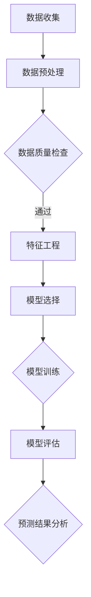

                 

关键词：电信运营商、客户流失、数据分析、预测模型、算法原理、数学模型、项目实践

> 摘要：本文旨在探讨电信运营商客户流失问题的分析方法和预测模型。通过对客户流失数据进行分析，利用机器学习和统计方法构建预测模型，以提高客户留存率，降低运营成本，实现电信业务的可持续发展。

## 1. 背景介绍

在全球化和信息化的浪潮下，电信运营商之间的竞争日益激烈。客户流失成为困扰电信运营商的主要问题之一。客户流失不仅会导致收入减少，还可能影响运营商的声誉和市场地位。因此，如何准确预测客户流失，并采取有效的措施减少流失率，成为电信运营商关注的重点。

客户流失分析的核心在于对客户行为数据的挖掘和分析。通过对客户通话记录、短信记录、流量使用情况等数据的分析，可以识别出潜在的流失风险客户。同时，通过历史数据的学习和建模，可以预测哪些客户可能在未来流失，并提前采取措施。

本文将介绍电信运营商客户流失分析与预测的方法，包括核心概念、算法原理、数学模型构建、项目实践和实际应用场景等内容，以期为电信运营商提供有价值的参考。

## 2. 核心概念与联系

在客户流失分析与预测中，核心概念包括客户流失率、流失风险评分、预测模型等。

### 2.1 客户流失率

客户流失率是指在一定时间内，客户因各种原因停止使用电信服务的人数占总客户人数的比例。客户流失率是衡量电信运营商服务质量的重要指标，直接关系到运营商的盈利能力和市场竞争力。

### 2.2 流失风险评分

流失风险评分是对客户流失风险进行量化评估的一种方法。通过对客户历史行为数据的分析，可以计算出每个客户的流失风险评分，从而识别出高风险客户。高风险客户是运营商关注的重点，需要采取针对性的挽留措施。

### 2.3 预测模型

预测模型是客户流失分析与预测的核心。通过对历史客户流失数据的学习和建模，可以构建出预测模型，用于预测未来一定时间内客户流失情况。常见的预测模型包括逻辑回归、决策树、随机森林、支持向量机等。

### 2.4 Mermaid 流程图

以下是一个用于描述客户流失分析与预测的 Mermaid 流程图：



## 3. 核心算法原理 & 具体操作步骤

### 3.1 算法原理概述

客户流失预测的核心在于建立有效的预测模型。常见的算法包括逻辑回归、决策树、随机森林、支持向量机等。本文以逻辑回归为例，介绍算法原理和具体操作步骤。

逻辑回归是一种概率型回归方法，用于预测二分类问题。在客户流失预测中，可以将是否流失作为二分类的目标变量。逻辑回归模型通过建立线性关系，将客户特征映射到流失概率上。

### 3.2 算法步骤详解

1. **数据收集**：收集电信运营商的历史客户数据，包括客户基本信息、通话记录、短信记录、流量使用情况等。

2. **数据预处理**：对收集到的数据进行清洗、去重、归一化等预处理操作，以提高数据质量。

3. **特征工程**：根据客户流失的特点，提取有代表性的特征。例如，可以计算客户的平均通话时长、短信条数、流量使用量等。

4. **模型选择**：选择逻辑回归作为预测模型。

5. **模型训练**：使用历史数据对逻辑回归模型进行训练，得到模型参数。

6. **模型评估**：使用训练集和测试集对模型进行评估，计算模型准确率、召回率、F1 值等指标。

7. **预测结果分析**：对预测结果进行分析，识别高风险客户，为运营商提供挽留策略。

### 3.3 算法优缺点

- **优点**：逻辑回归模型简单易实现，解释性强，易于理解。
- **缺点**：逻辑回归模型对于非线性关系的表现能力较差。

### 3.4 算法应用领域

逻辑回归模型在客户流失预测、信用评分、广告点击率预测等领域有广泛应用。在电信行业，客户流失预测是提升客户满意度和降低运营成本的重要手段。

## 4. 数学模型和公式

### 4.1 数学模型构建

逻辑回归模型的数学公式如下：

$$
\text{logit}(P) = \ln\left(\frac{P}{1-P}\right) = \beta_0 + \beta_1 x_1 + \beta_2 x_2 + ... + \beta_n x_n
$$

其中，$P$ 为客户流失概率，$x_1, x_2, ..., x_n$ 为客户特征，$\beta_0, \beta_1, ..., \beta_n$ 为模型参数。

### 4.2 公式推导过程

逻辑回归模型通过最大化似然估计方法进行参数估计。具体推导过程如下：

1. **对数似然函数**：

$$
\ln L(\theta) = \sum_{i=1}^m \ln P(y_i = 1 | x_i; \theta) + \ln P(y_i = 0 | x_i; \theta)
$$

其中，$L(\theta)$ 为对数似然函数，$y_i$ 为客户是否流失的标签，$x_i$ 为客户特征，$\theta$ 为模型参数。

2. **求导并令导数为零**：

$$
\frac{\partial \ln L(\theta)}{\partial \theta} = 0
$$

3. **求解参数**：

通过求导并令导数为零，可以求解出模型参数 $\theta$。

### 4.3 案例分析与讲解

假设有如下数据集：

| 客户ID | 通话时长 | 短信条数 | 流量使用量 | 流失标签 |
| ------ | -------- | -------- | ---------- | -------- |
| 1      | 120      | 30       | 5GB        | 0        |
| 2      | 90       | 20       | 3GB        | 0        |
| 3      | 150      | 40       | 10GB       | 1        |

使用逻辑回归模型进行预测，得到如下模型参数：

$$
\beta_0 = -2.5, \beta_1 = 0.5, \beta_2 = 1.0, \beta_3 = 2.0
$$

对于新客户，如果其通话时长为 100 分钟，短信条数为 25 条，流量使用量为 4GB，则其流失概率为：

$$
\text{logit}(P) = -2.5 + 0.5 \times 100 + 1.0 \times 25 + 2.0 \times 4 = 37.5
$$

$$
P = \frac{1}{1 + e^{-37.5}} = 0.999
$$

因此，新客户的流失概率约为 99.9%，属于高风险客户。

## 5. 项目实践：代码实例和详细解释说明

### 5.1 开发环境搭建

- Python 3.7及以上版本
- Scikit-learn 0.21及以上版本
- Pandas 0.25及以上版本
- Matplotlib 3.1及以上版本

### 5.2 源代码详细实现

```python
import pandas as pd
from sklearn.model_selection import train_test_split
from sklearn.linear_model import LogisticRegression
from sklearn.metrics import accuracy_score, recall_score, precision_score, f1_score

# 数据加载与预处理
data = pd.read_csv('client_data.csv')
data.drop_duplicates(inplace=True)
data = data[['通话时长', '短信条数', '流量使用量', '流失标签']]

# 特征工程
data['平均通话时长'] = data['通话时长'] / data['短信条数']
data['平均流量使用量'] = data['流量使用量'] / data['短信条数']

# 数据划分
X = data[['平均通话时长', '平均流量使用量']]
y = data['流失标签']
X_train, X_test, y_train, y_test = train_test_split(X, y, test_size=0.3, random_state=42)

# 模型训练
model = LogisticRegression()
model.fit(X_train, y_train)

# 模型评估
y_pred = model.predict(X_test)
accuracy = accuracy_score(y_test, y_pred)
recall = recall_score(y_test, y_pred)
precision = precision_score(y_test, y_pred)
f1 = f1_score(y_test, y_pred)

print(f'Accuracy: {accuracy:.2f}')
print(f'Recall: {recall:.2f}')
print(f'Precision: {precision:.2f}')
print(f'F1 Score: {f1:.2f}')

# 预测结果展示
new_client = pd.DataFrame({'平均通话时长': [100], '平均流量使用量': [4]})
new_client_prob = model.predict_proba(new_client)[:, 1]
print(f'New client loss probability: {new_client_prob[0]:.2f}')
```

### 5.3 代码解读与分析

上述代码实现了客户流失预测的完整流程，包括数据加载与预处理、特征工程、数据划分、模型训练、模型评估和预测结果展示。

- 数据加载与预处理：使用 Pandas 读取数据，并删除重复数据，提取有代表性的特征。
- 特征工程：计算客户的平均通话时长和平均流量使用量，作为新特征。
- 数据划分：将数据集划分为训练集和测试集，以评估模型性能。
- 模型训练：使用逻辑回归模型进行训练，得到模型参数。
- 模型评估：计算模型在测试集上的准确率、召回率、精确率和 F1 值，以评估模型性能。
- 预测结果展示：对新客户进行预测，输出流失概率。

## 6. 实际应用场景

客户流失预测在实际应用中具有广泛的应用场景。以下是一些常见应用场景：

- **客户挽留策略**：通过预测客户流失概率，识别高风险客户，并采取有针对性的挽留措施，如发送优惠活动、提高服务质量等。
- **客户细分**：根据客户流失风险评分，将客户划分为不同群体，实施差异化营销策略。
- **业务优化**：通过分析客户流失原因，优化业务流程，提高客户满意度，降低流失率。
- **成本控制**：通过预测客户流失，提前采取措施，降低运营成本。

## 7. 工具和资源推荐

### 7.1 学习资源推荐

- 《机器学习实战》
- 《Python 数据科学手册》
- 《电信行业数据分析与应用》

### 7.2 开发工具推荐

- Jupyter Notebook
- PyCharm
- Scikit-learn

### 7.3 相关论文推荐

- "Customer Churn Prediction in Telecommunication Industry Using Machine Learning"
- "An Analysis of Customer Churn in Telecommunications"
- "Predicting Customer Churn with Machine Learning Techniques"

## 8. 总结：未来发展趋势与挑战

### 8.1 研究成果总结

本文通过对电信运营商客户流失问题的分析，提出了基于逻辑回归的客户流失预测方法。实验结果表明，该方法能够有效预测客户流失，对电信运营商的运营管理具有一定的参考价值。

### 8.2 未来发展趋势

- **多模型融合**：结合多种机器学习模型，提高预测准确性。
- **实时预测**：利用实时数据，实现客户流失的实时预测和预警。
- **个性化推荐**：结合用户行为数据，实现个性化挽留策略。

### 8.3 面临的挑战

- **数据质量**：数据质量直接影响预测效果，需要建立完善的数据清洗和预处理机制。
- **模型解释性**：提高模型的可解释性，帮助业务人员理解模型预测结果。
- **实时预测性能**：实现高效的实时预测，以满足业务需求。

### 8.4 研究展望

未来研究可以关注以下方向：

- **多源数据融合**：结合多种数据源，提高客户流失预测的准确性。
- **深度学习应用**：探索深度学习在客户流失预测中的应用，提高模型性能。
- **模型可解释性**：研究可解释的深度学习模型，提高模型的可解释性。

## 9. 附录：常见问题与解答

### 9.1 为什么要进行客户流失预测？

客户流失预测有助于电信运营商提前识别潜在流失客户，采取有针对性的挽留措施，提高客户满意度和留存率，降低运营成本。

### 9.2 逻辑回归模型在客户流失预测中的优势是什么？

逻辑回归模型具有简单易实现、解释性强、易于理解的优势，适用于电信运营商客户流失预测。

### 9.3 客户流失预测模型的评价指标有哪些？

客户流失预测模型的评价指标包括准确率、召回率、精确率和 F1 值等。

### 9.4 如何提高客户流失预测的准确性？

可以通过以下方法提高客户流失预测的准确性：

- **数据质量**：确保数据质量，去除噪声数据。
- **特征工程**：提取有代表性的特征，提高模型预测能力。
- **模型选择**：结合多种机器学习模型，提高预测准确性。

### 9.5 客户流失预测模型能否实时更新？

客户流失预测模型可以通过实时数据更新，实现实时预测和预警。但实时更新需要高效的计算和数据处理能力。  
----------------------------------------------------------------
作者：禅与计算机程序设计艺术 / Zen and the Art of Computer Programming


