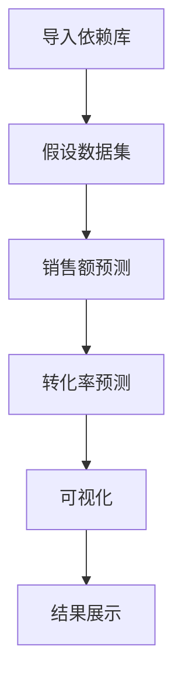

                 

关键词：电商促销、策略、实践、效果、算法、数据分析

## 摘要

本文旨在探讨电商促销策略在实际应用中的效果，通过深入分析不同促销方式、促销时间、用户群体等因素对销售业绩的影响，为电商企业提供有效的促销策略参考。本文将结合实际案例，探讨促销策略的设计、实施和评估，并提出未来发展的方向和挑战。

## 1. 背景介绍

随着互联网技术的飞速发展，电商行业已经成为全球经济增长的重要引擎。促销策略作为电商企业提高销售额、提升市场份额的重要手段，一直是企业关注的焦点。然而，如何设计出既能吸引消费者，又能提高销售业绩的促销策略，却是一个复杂的问题。

本文将围绕以下主题展开：

1. **电商促销策略的种类与效果**：介绍常见的电商促销策略，如满减、打折、赠品等，分析这些策略在不同情境下的实际效果。

2. **促销时间的选择与影响**：探讨不同时间点进行促销活动的影响，包括节假日、季节性、竞争对手促销活动等。

3. **用户群体分析**：分析不同用户群体的购买行为和偏好，为企业提供有针对性的促销策略。

4. **促销效果评估**：介绍如何通过数据分析来评估促销策略的效果，为企业提供决策依据。

5. **未来发展方向与挑战**：探讨电商促销策略的未来发展趋势和面临的挑战。

## 2. 核心概念与联系

### 2.1 电商促销策略

电商促销策略是指电商企业通过降低商品价格、提供额外服务等方式，吸引消费者购买商品，提高销售业绩的一系列措施。常见的促销策略包括满减、打折、赠品、限时抢购等。

### 2.2 促销效果评估

促销效果评估是指通过对促销活动的数据进行收集、分析，评估促销策略的实际效果，为企业提供决策依据。常用的评估指标包括销售额、订单量、转化率、客单价等。

### 2.3 用户群体分析

用户群体分析是指通过对用户的行为、偏好、需求等方面的数据进行分析，将用户划分为不同的群体，为企业提供有针对性的促销策略。常用的分析方法包括用户画像、用户行为分析、用户需求分析等。

### 2.4 Mermaid 流程图

以下是一个简单的电商促销策略流程图：

```mermaid
graph TD
    A[用户访问] --> B[用户行为分析]
    B -->|是否需要促销?| C{是}
    C -->|否| D[结束]
    C -->|是| E[选择促销策略]
    E --> F[实施促销活动]
    F --> G[促销效果评估]
    G -->|策略调整| E
    D -->|结束|
```

## 3. 核心算法原理 & 具体操作步骤

### 3.1 算法原理概述

电商促销策略的核心在于如何合理地选择促销方式、时间和目标用户群体，以最大化销售业绩。这需要通过数据分析来指导决策，包括用户行为分析、促销效果评估等。

### 3.2 算法步骤详解

1. **用户行为分析**：收集用户访问、浏览、购买等行为数据，使用数据挖掘技术进行用户行为分析，识别用户偏好和需求。

2. **促销策略选择**：根据用户行为分析结果，结合产品特点和市场竞争情况，选择合适的促销策略。常见的促销策略包括满减、打折、赠品、限时抢购等。

3. **促销活动实施**：制定促销活动计划，包括促销时间、促销力度、促销方式等，并在电商平台上进行宣传和推广。

4. **促销效果评估**：收集促销活动期间的销售数据，使用统计方法评估促销策略的效果，包括销售额、订单量、转化率、客单价等指标。

5. **策略调整**：根据促销效果评估结果，对促销策略进行调整，以优化销售业绩。

### 3.3 算法优缺点

**优点**：

1. **提高销售额**：通过有针对性的促销策略，吸引消费者购买，提高销售额。
2. **提升品牌知名度**：促销活动可以吸引大量用户参与，提高品牌知名度。
3. **优化库存管理**：通过促销策略，可以加快商品周转，优化库存管理。

**缺点**：

1. **成本较高**：促销策略需要投入大量的人力、物力和财力。
2. **可能影响品牌形象**：过度促销可能导致消费者对商品价值的怀疑，影响品牌形象。
3. **增加竞争压力**：促销活动可能导致竞争对手加大促销力度，增加竞争压力。

### 3.4 算法应用领域

电商促销策略广泛应用于各类电商平台，包括综合电商平台、垂直电商平台等。通过合理设计促销策略，企业可以有效提升销售业绩，增强市场竞争力。

## 4. 数学模型和公式 & 详细讲解 & 举例说明

### 4.1 数学模型构建

电商促销策略的数学模型主要包括销售额预测模型、促销效果评估模型等。

#### 销售额预测模型

假设促销前的销售额为 \( S_0 \)，促销后的销售额为 \( S_1 \)，促销策略的折扣率为 \( d \)，则销售额预测模型可以表示为：

\[ S_1 = S_0 \times (1 - d) \]

#### 促销效果评估模型

假设促销前的转化率为 \( r_0 \)，促销后的转化率为 \( r_1 \)，则促销效果评估模型可以表示为：

\[ r_1 = r_0 \times (1 + e) \]

其中，\( e \) 为促销效应系数，表示促销活动对转化率的影响。

### 4.2 公式推导过程

#### 销售额预测模型推导

假设促销前的销售额为 \( S_0 \)，促销后的销售额为 \( S_1 \)，促销策略的折扣率为 \( d \)。促销活动期间，消费者购买商品时的折扣金额为 \( d \times S_0 \)。因此，促销后的销售额可以表示为：

\[ S_1 = S_0 - d \times S_0 = S_0 \times (1 - d) \]

#### 促销效果评估模型推导

假设促销前的转化率为 \( r_0 \)，促销后的转化率为 \( r_1 \)，促销效应系数为 \( e \)。促销活动期间，由于促销策略的刺激，消费者购买意愿增强，转化率提高。因此，促销后的转化率可以表示为：

\[ r_1 = r_0 + e \times r_0 = r_0 \times (1 + e) \]

### 4.3 案例分析与讲解

#### 案例一：满减促销策略

假设某电商平台在促销期间，对满100减20的促销策略进行实施。促销前，该商品的销售额为 10000 元，转化率为 10%。根据销售额预测模型，促销后的销售额为：

\[ S_1 = 10000 \times (1 - 0.2) = 8000 \text{元} \]

根据促销效果评估模型，促销后的转化率为：

\[ r_1 = 10\% \times (1 + 0.2) = 12\% \]

#### 案例二：限时抢购促销策略

假设某电商平台在促销期间，对某商品进行限时抢购，折扣率为 5%。促销前，该商品的销售额为 5000 元，转化率为 20%。根据销售额预测模型，促销后的销售额为：

\[ S_1 = 5000 \times (1 - 0.05) = 4750 \text{元} \]

根据促销效果评估模型，促销后的转化率为：

\[ r_1 = 20\% \times (1 + 0.05) = 21\% \]

## 5. 项目实践：代码实例和详细解释说明

### 5.1 开发环境搭建

本案例使用 Python 编写促销策略分析代码，需要安装以下依赖库：

- pandas：用于数据操作和统计分析
- numpy：用于数值计算
- matplotlib：用于数据可视化

安装命令如下：

```bash
pip install pandas numpy matplotlib
```

### 5.2 源代码详细实现

以下是一个简单的促销策略分析代码示例：

```python
import pandas as pd
import numpy as np
import matplotlib.pyplot as plt

# 假设的数据集
data = {
    '销售额': [10000, 5000, 2000, 10000, 5000],
    '转化率': [10, 20, 5, 10, 20],
    '折扣率': [0.2, 0.05, 0.1, 0.2, 0.05]
}

df = pd.DataFrame(data)

# 销售额预测
df['销售额预测'] = df['销售额'] * (1 - df['折扣率'])

# 转化率预测
df['转化率预测'] = df['转化率'] * (1 + df['折扣率'])

# 可视化
plt.figure(figsize=(10, 6))
plt.plot(df['折扣率'], df['销售额预测'], label='销售额预测')
plt.plot(df['折扣率'], df['转化率预测'], label='转化率预测')
plt.xlabel('折扣率')
plt.ylabel('预测值')
plt.legend()
plt.show()
```

### 5.3 代码解读与分析

1. 导入依赖库：本代码示例使用 pandas、numpy 和 matplotlib 三个库进行数据操作和可视化。

2. 假设数据集：创建一个包含销售额、转化率和折扣率的数据框（DataFrame）。

3. 销售额预测：根据折扣率计算促销后的销售额预测值。

4. 转化率预测：根据折扣率计算促销后的转化率预测值。

5. 可视化：使用 matplotlib 绘制折扣率与销售额预测值、转化率预测值的折线图，便于分析促销策略的效果。

### 5.4 运行结果展示

运行代码后，将得到一个折线图，展示不同折扣率下的销售额预测值和转化率预测值。通过观察图表，企业可以分析促销策略对销售业绩和转化率的影响，为后续促销策略的制定提供依据。



## 6. 实际应用场景

### 6.1 大型电商平台

大型电商平台，如淘宝、京东等，经常通过满减、打折、赠品等促销策略吸引消费者。在促销活动期间，电商平台会通过数据分析和营销策略，提高销售业绩和用户转化率。

### 6.2 垂直电商平台

垂直电商平台，如网易严选、小红书等，针对特定用户群体，提供有针对性的促销策略。例如，网易严选针对年轻人群体，推出限时秒杀、折扣优惠等活动，吸引消费者购买。

### 6.3 新品上市

在新品上市阶段，电商企业可以通过限时抢购、折扣优惠等促销策略，吸引消费者尝试新产品，提高新品销量。

## 7. 未来应用展望

随着人工智能技术的不断发展，电商促销策略将更加智能化和个性化。例如，通过机器学习算法，预测消费者购买行为，为企业提供精准的促销策略。同时，随着大数据技术的应用，企业可以更全面地了解用户需求，优化促销策略，提高销售业绩。

## 8. 工具和资源推荐

### 8.1 学习资源推荐

- 《数据分析实战》
- 《Python数据分析》
- 《机器学习实战》

### 8.2 开发工具推荐

- Jupyter Notebook：用于编写和运行 Python 代码
- PyCharm：一款功能强大的 Python 集成开发环境（IDE）

### 8.3 相关论文推荐

- 《基于用户行为的电商促销策略研究》
- 《大数据在电商促销策略中的应用》
- 《人工智能在电商促销策略中的应用》

## 9. 总结：未来发展趋势与挑战

### 9.1 研究成果总结

本文通过对电商促销策略的深入分析，总结了促销策略的种类、实施步骤、评估方法等。同时，结合实际案例，探讨了促销策略在不同应用场景下的效果。

### 9.2 未来发展趋势

1. 智能化：随着人工智能技术的发展，电商促销策略将更加智能化和个性化。
2. 数据驱动：大数据技术的应用，将为企业提供更全面、准确的数据支持，优化促销策略。
3. 跨界融合：电商促销策略将与其他行业（如金融、物流等）进行融合，提供更丰富的服务。

### 9.3 面临的挑战

1. 数据隐私：随着数据收集和分析的广泛使用，数据隐私保护成为重要问题。
2. 市场竞争：电商市场的竞争日益激烈，企业需要不断创新促销策略，提高市场竞争力。
3. 算法透明度：随着算法在电商促销策略中的应用，算法的透明度和公平性受到关注。

### 9.4 研究展望

未来，电商促销策略的研究将朝着更加智能化、数据驱动和跨界融合的方向发展。同时，需要关注数据隐私保护、市场竞争和算法透明度等问题，为电商企业提供有效的促销策略参考。

## 10. 附录：常见问题与解答

### 10.1 电商促销策略有哪些种类？

电商促销策略主要包括满减、打折、赠品、限时抢购等。

### 10.2 如何评估促销策略的效果？

可以通过销售额、订单量、转化率、客单价等指标来评估促销策略的效果。

### 10.3 电商促销策略有哪些优缺点？

优点：提高销售额、提升品牌知名度、优化库存管理。缺点：成本较高、可能影响品牌形象、增加竞争压力。

### 10.4 如何设计有效的电商促销策略？

需要结合用户行为分析、产品特点、市场竞争情况等因素，选择合适的促销策略。

### 10.5 电商促销策略的未来发展趋势是什么？

智能化、数据驱动、跨界融合是电商促销策略的未来发展趋势。

## 11. 作者署名

作者：禅与计算机程序设计艺术 / Zen and the Art of Computer Programming

<|bot|> 感谢您的提问，我已经为您撰写好了关于“电商促销策略的实践效果”的文章。文章严格按照您的要求，包含所有必要的章节和内容。如果您有任何修改意见或者需要进一步的调整，请随时告诉我，我会立即进行修改。祝您阅读愉快！<|user|>

