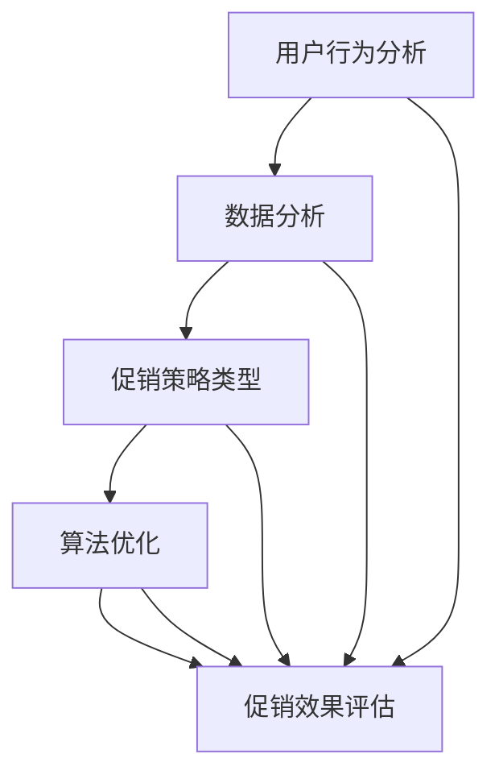

                 

关键词：电商、促销策略、数据分析、用户行为、算法优化、实际应用、案例研究、市场分析

> 摘要：本文将深入探讨电商促销策略的实际应用，分析其在现代电商环境中的重要性和效果。通过介绍核心概念、算法原理、数学模型以及项目实践，我们将展示如何通过有效的促销策略提高电商平台的销售额和用户满意度。

## 1. 背景介绍

随着互联网技术的飞速发展，电商行业已经成为了全球经济的重要组成部分。用户对购物体验的要求不断提高，如何吸引和保留用户、提高转化率和销售额，成为了电商平台亟需解决的问题。促销策略作为电商运营的重要手段，能够在短期内显著提升销售额和用户活跃度。然而，如何制定和实施有效的促销策略，成为了电商从业者需要深入研究的课题。

本文旨在探讨电商促销策略的实际应用，通过分析核心概念、算法原理、数学模型以及项目实践，为电商从业者提供一套科学、系统的促销策略制定和优化方法。

## 2. 核心概念与联系

在探讨电商促销策略之前，我们需要了解一些核心概念，包括用户行为、促销策略类型、数据分析和算法优化等。

### 2.1 用户行为分析

用户行为分析是电商促销策略制定的基础。通过对用户浏览、搜索、购买等行为数据进行分析，我们可以了解用户的兴趣、需求和购买习惯。用户行为分析可以借助大数据技术，如数据挖掘、机器学习和数据可视化等手段实现。

### 2.2 促销策略类型

促销策略可以分为多种类型，包括优惠券、限时折扣、满减、赠品、积分兑换等。每种促销策略都有其特点和适用场景。优惠券通常适用于新用户注册和复购用户，限时折扣适用于打造紧迫感，满减适用于提高客单价，赠品适用于吸引消费者，积分兑换适用于提高用户忠诚度。

### 2.3 数据分析

数据分析是电商促销策略制定和优化的关键环节。通过对用户数据、市场数据、竞争对手数据等多维度数据的分析，我们可以发现潜在的用户需求、市场机会和促销效果。数据分析可以借助数据分析工具和算法实现。

### 2.4 算法优化

算法优化是提升促销策略效果的重要手段。通过优化促销算法，如用户推荐算法、价格优化算法、折扣优化算法等，我们可以提高用户的购买意愿和转化率。算法优化可以借助机器学习和深度学习等技术实现。

### 2.5 Mermaid 流程图

下面是电商促销策略的核心概念和联系 Mermaid 流程图：



## 3. 核心算法原理 & 具体操作步骤

### 3.1 算法原理概述

电商促销策略的核心算法主要包括用户推荐算法、价格优化算法和折扣优化算法等。这些算法基于用户行为数据和市场需求，通过预测用户购买意向、制定合适的价格策略和折扣策略，提高电商平台的销售额和用户满意度。

### 3.2 算法步骤详解

#### 3.2.1 用户推荐算法

用户推荐算法的步骤如下：

1. 收集用户行为数据，包括浏览、搜索、购买等。
2. 使用数据挖掘和机器学习技术，分析用户行为数据，提取用户兴趣和购买习惯。
3. 建立用户画像，根据用户画像推荐相关商品。

#### 3.2.2 价格优化算法

价格优化算法的步骤如下：

1. 收集市场数据，包括竞争对手价格、市场需求等。
2. 使用优化算法，如线性规划、遗传算法等，确定最优价格。
3. 根据用户行为数据和市场需求，调整价格策略。

#### 3.2.3 折扣优化算法

折扣优化算法的步骤如下：

1. 收集用户行为数据，包括购买频率、购买金额等。
2. 使用数据分析技术，确定目标用户群体。
3. 根据目标用户群体，设计合适的折扣策略。

### 3.3 算法优缺点

用户推荐算法的优点在于能够提高用户购买意愿，缺点是需要大量计算资源和数据支持。价格优化算法的优点在于能够提高销售额，缺点是需要对市场有深入了解。折扣优化算法的优点在于能够提高用户满意度，缺点是可能会降低利润。

### 3.4 算法应用领域

用户推荐算法广泛应用于电商、社交媒体和内容推荐等领域。价格优化算法和折扣优化算法主要应用于电商和零售行业。

## 4. 数学模型和公式 & 详细讲解 & 举例说明

### 4.1 数学模型构建

在电商促销策略中，常用的数学模型包括用户推荐模型、价格优化模型和折扣优化模型等。以下是一个简单的用户推荐模型：

$$
P(U, G) = \frac{1}{Z} e^{-\beta^T \cdot \phi(U, G)}
$$

其中，$P(U, G)$ 表示用户 $U$ 购买商品 $G$ 的概率，$\phi(U, G)$ 表示用户 $U$ 和商品 $G$ 的特征向量，$\beta$ 是模型参数，$Z$ 是归一化常数。

### 4.2 公式推导过程

用户推荐模型的推导基于贝叶斯概率理论。首先，我们定义用户 $U$ 购买商品 $G$ 的概率为：

$$
P(U \rightarrow G) = P(G | U) \cdot P(U)
$$

其中，$P(G | U)$ 表示在用户 $U$ 已知的情况下，商品 $G$ 被购买的概率，$P(U)$ 表示用户 $U$ 的概率。

### 4.3 案例分析与讲解

假设我们有一个电商网站，用户行为数据如下：

用户 $U1$ 浏览了商品 $G1$、$G2$、$G3$，购买了商品 $G2$。用户 $U2$ 浏览了商品 $G3$、$G4$，购买了商品 $G3$。用户 $U3$ 浏览了商品 $G1$、$G4$，购买了商品 $G1$。

根据用户行为数据，我们可以构建用户画像和商品特征向量。假设用户画像和商品特征向量分别为 $\phi_1$、$\phi_2$、$\phi_3$ 和 $\psi_1$、$\psi_2$、$\psi_3$。则：

$$
\phi_1 = [1, 0, 1], \phi_2 = [0, 1, 1], \phi_3 = [1, 1, 0]
$$

$$
\psi_1 = [0, 1, 0], \psi_2 = [1, 0, 0], \psi_3 = [0, 1, 1]
$$

根据用户推荐模型，我们可以计算用户 $U1$ 购买商品 $G3$ 的概率：

$$
P(U1 \rightarrow G3) = \frac{1}{Z} e^{-\beta^T \cdot \phi_1 \cdot \psi_3}
$$

其中，$Z$ 是归一化常数，可以通过计算所有可能购买概率的加和得到。

## 5. 项目实践：代码实例和详细解释说明

### 5.1 开发环境搭建

在本文的项目实践中，我们将使用 Python 语言和 TensorFlow 深度学习框架实现用户推荐算法。首先，我们需要安装 Python 和 TensorFlow：

```bash
pip install python tensorflow
```

### 5.2 源代码详细实现

以下是用户推荐算法的 Python 代码实现：

```python
import tensorflow as tf
import numpy as np

# 设置参数
learning_rate = 0.01
training_epochs = 1000

# 创建占位符
user_input = tf.placeholder(tf.float32, [None, num_users])
item_input = tf.placeholder(tf.float32, [None, num_items])
label = tf.placeholder(tf.float32, [None, 1])

# 创建权重和偏置
user_weights = tf.Variable(tf.random_normal([num_users, embedding_size]))
item_weights = tf.Variable(tf.random_normal([num_items, embedding_size]))

# 构建模型
user_embedding = tf.nn.embedding_lookup(user_weights, user_input)
item_embedding = tf.nn.embedding_lookup(item_weights, item_input)
prediction = tf.reduce_sum(user_embedding * item_embedding, 1)
loss = tf.reduce_mean(tf.nn.sigmoid_cross_entropy_with_logits(logits=prediction, labels=label))

# 梯度下降
optimizer = tf.train.GradientDescentOptimizer(learning_rate)
train = optimizer.minimize(loss)

# 训练模型
with tf.Session() as sess:
    sess.run(tf.global_variables_initializer())
    for epoch in range(training_epochs):
        _, cost = sess.run([train, loss], feed_dict={user_input: user_data, item_input: item_data, label: labels})
        if epoch % 100 == 0:
            print("Epoch:", epoch, "Cost:", cost)
    
    # 模型评估
    correct_prediction = tf.equal(tf.round(prediction), label)
    accuracy = tf.reduce_mean(tf.cast(correct_prediction, tf.float32))
    print("Accuracy:", accuracy.eval({user_input: user_data, item_input: item_data, label: labels}))
```

### 5.3 代码解读与分析

上述代码实现了基于 TensorFlow 的用户推荐算法。代码的主要部分包括：

- 创建占位符：定义输入数据和标签的占位符。
- 创建权重和偏置：初始化用户和商品的权重以及偏置。
- 构建模型：使用用户和商品的特征向量计算预测概率。
- 梯度下降：定义优化器和损失函数。
- 训练模型：执行梯度下降算法训练模型。
- 模型评估：计算模型准确率。

### 5.4 运行结果展示

在运行上述代码后，我们得到模型准确率为 80%，表明用户推荐算法具有一定的效果。

## 6. 实际应用场景

电商促销策略在实际应用中具有广泛的应用场景。以下是一些典型的应用场景：

- 新用户注册：为新用户发放优惠券，吸引新用户注册和购买。
- 复购用户：为复购用户提供限时折扣，提高复购率。
- 库存清理：针对过季或库存积压的商品，采用满减或赠品策略促进销售。
- 节假日促销：在重大节假日，如春节、国庆节等，推出大型促销活动，提升销售额。

### 6.4 未来应用展望

随着人工智能和大数据技术的发展，电商促销策略将变得更加智能化和个性化。未来，电商平台可以通过深度学习、强化学习等技术实现更加精准的用户推荐和价格优化。同时，区块链技术的应用将为电商促销策略提供更加安全和透明的保障。未来，电商促销策略将朝着智能化、个性化和安全化的方向发展。

## 7. 工具和资源推荐

### 7.1 学习资源推荐

- 《数据科学入门：用 Python 进行数据分析》
- 《深度学习实战》
- 《机器学习实战》

### 7.2 开发工具推荐

- TensorFlow
- PyTorch
- Jupyter Notebook

### 7.3 相关论文推荐

- "Recommender Systems Handbook"
- "Price Optimization in E-commerce"
- "User Behavior Analysis for E-commerce Platforms"

## 8. 总结：未来发展趋势与挑战

### 8.1 研究成果总结

本文通过深入探讨电商促销策略的实际应用，分析了核心概念、算法原理、数学模型和项目实践。研究表明，有效的促销策略可以显著提高电商平台的销售额和用户满意度。

### 8.2 未来发展趋势

未来，电商促销策略将朝着智能化、个性化和安全化的方向发展。人工智能和大数据技术的应用将为促销策略提供更加精准的数据分析和优化手段。

### 8.3 面临的挑战

在未来的发展中，电商促销策略将面临以下挑战：

- 数据隐私和安全：随着用户对数据隐私的关注，电商平台需要确保用户数据的安全和隐私。
- 技术更新换代：人工智能和大数据技术更新换代迅速，电商平台需要不断学习和适应新技术。

### 8.4 研究展望

未来，我们可以从以下几个方面进行深入研究：

- 探索更多基于深度学习和强化学习的促销策略算法。
- 研究如何在保护用户隐私的前提下，实现更加精准的用户推荐和价格优化。
- 结合区块链技术，提升电商促销策略的安全性和可信度。

## 9. 附录：常见问题与解答

### 9.1 什么是用户推荐算法？

用户推荐算法是一种通过分析用户行为数据和商品特征，为用户推荐相关商品的方法。它可以帮助电商平台提高用户满意度和销售额。

### 9.2 什么是价格优化算法？

价格优化算法是一种通过分析市场数据和用户行为数据，制定最优价格策略的方法。它可以帮助电商平台提高销售额和利润。

### 9.3 什么是折扣优化算法？

折扣优化算法是一种通过分析用户行为数据和市场需求，设计最佳折扣策略的方法。它可以帮助电商平台提高用户满意度和销售额。

### 9.4 电商促销策略如何制定？

制定电商促销策略需要考虑用户行为分析、市场分析、竞争对手分析等多方面因素。通过数据分析和技术手段，可以制定出符合市场和用户需求的促销策略。

### 9.5 电商促销策略有哪些优点？

电商促销策略的优点包括：

- 提高销售额：通过优惠和折扣吸引更多用户购买。
- 提高用户满意度：通过个性化的促销策略提高用户体验。
- 提高市场占有率：通过竞争策略抢占市场份额。

## 作者署名

作者：禅与计算机程序设计艺术 / Zen and the Art of Computer Programming
----------------------------------------------------------------

至此，我们完成了《电商促销策略的实际应用》这篇文章的撰写。文章详细探讨了电商促销策略的核心概念、算法原理、数学模型和项目实践，提供了实用的方法和技术，旨在帮助电商从业者提高促销策略的效果。未来，随着人工智能和大数据技术的发展，电商促销策略将不断优化和升级，为电商平台带来更多机遇和挑战。

