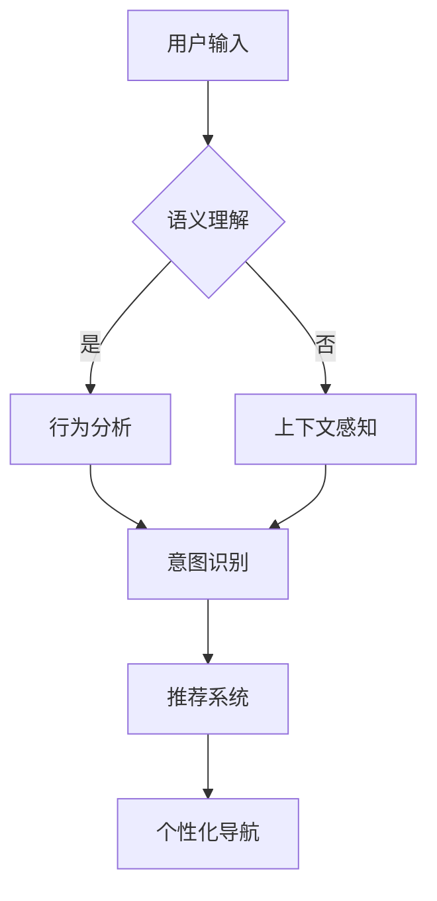
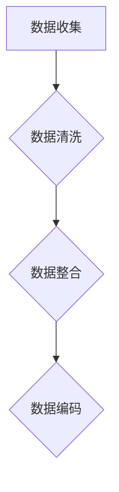
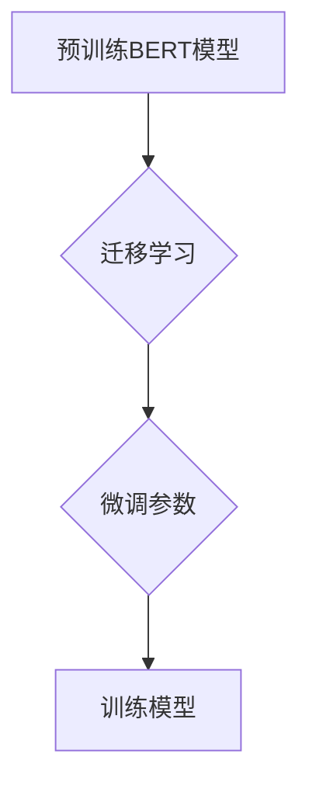
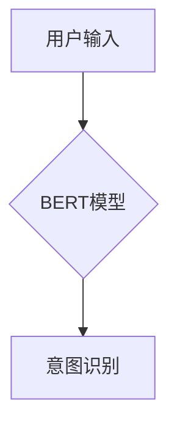
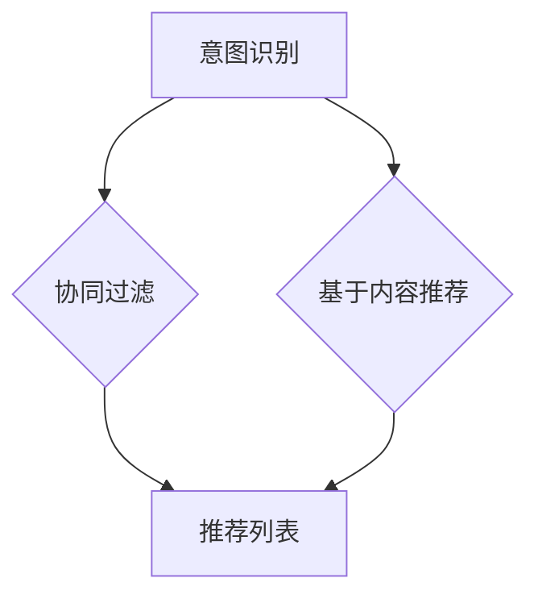
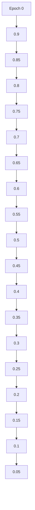

                 

关键词：电商平台，个性化导航，AI大模型，用户意图理解，机器学习，推荐系统，自然语言处理，深度学习，个性化搜索

> 摘要：本文将探讨电商平台个性化导航的实现，特别是通过AI大模型对用户意图进行深度理解的过程。我们将详细分析核心概念、算法原理、数学模型及其在项目实践中的应用，并提供未来的发展展望。

## 1. 背景介绍

在现代电子商务时代，电商平台已经成为消费者购物的主要渠道。然而，随着平台上的商品种类和数量的爆炸式增长，用户面临着信息过载的问题。为了提升用户体验，电商平台开始采用个性化导航技术，这不仅能帮助用户快速找到所需商品，还能通过精准的推荐提高销售额。

个性化导航的核心在于对用户意图的准确理解。用户意图可能是明确的购买需求，也可能是模糊的浏览兴趣。通过AI大模型，我们可以对用户行为数据进行深度挖掘和分析，从而实现高效的意图识别和个性化推荐。

## 2. 核心概念与联系

为了更好地理解AI大模型在个性化导航中的应用，我们需要先了解几个核心概念：

### 2.1 用户意图识别
用户意图识别是理解用户行为和需求的关键。它包括以下几个方面：
- **语义理解**：通过自然语言处理技术理解用户输入的文本含义。
- **行为分析**：分析用户在电商平台上的浏览、搜索、购买等行为。
- **上下文感知**：考虑用户的当前环境和情境。

### 2.2 个性化推荐
个性化推荐系统通过用户历史行为数据、兴趣偏好和社交网络等信息，为用户提供个性化的商品推荐。常见的推荐算法包括协同过滤、基于内容的推荐和混合推荐等。

### 2.3 大模型
大模型是指具有大量参数和强大计算能力的深度学习模型。例如，Transformer模型、BERT模型等。

### 2.4 Mermaid 流程图

下面是AI大模型在用户意图理解中的应用流程：



## 3. 核心算法原理 & 具体操作步骤

### 3.1 算法原理概述

用户意图理解的算法原理主要基于深度学习和自然语言处理技术。我们通常采用预训练的AI大模型，如BERT、GPT等，通过以下步骤实现用户意图的识别和导航：

1. **数据预处理**：清洗和整合用户行为数据、文本数据等。
2. **模型训练**：使用大量标注数据训练AI大模型。
3. **意图识别**：输入用户行为数据和文本数据，输出用户意图。
4. **个性化推荐**：根据用户意图，推荐相关的商品或内容。
5. **导航优化**：调整导航结构，提高用户体验。

### 3.2 算法步骤详解

#### 3.2.1 数据预处理

数据预处理是模型训练的基础。我们需要整合用户行为数据、文本数据、商品信息等多源数据，并进行数据清洗、去重、编码等操作。



#### 3.2.2 模型训练

我们采用预训练的BERT模型，通过迁移学习的方式对其进行微调。具体步骤如下：



#### 3.2.3 意图识别

意图识别的核心是对用户输入的文本进行语义分析。我们采用BERT模型，输入用户行为数据和文本数据，输出用户意图。



#### 3.2.4 个性化推荐

根据用户意图，我们可以采用协同过滤、基于内容的推荐等方法进行个性化推荐。以下是一个简单的推荐流程：



#### 3.2.5 导航优化

导航优化是根据用户反馈和行为数据，调整导航结构，提高用户体验。具体步骤如下：

```mermaid
graph TD
A[用户行为数据] --> B{分析反馈}
B --> C[调整导航结构}
C --> D[优化导航体验]
```

### 3.3 算法优缺点

#### 优点：

- **高效性**：大模型可以处理海量数据，提高意图识别的准确性。
- **灵活性**：可以根据用户需求调整推荐策略，提高个性化程度。
- **可扩展性**：可以轻松集成到现有的电商平台系统中。

#### 缺点：

- **计算资源消耗大**：训练和部署大模型需要大量计算资源和时间。
- **数据隐私问题**：用户数据的安全性和隐私保护需要高度重视。

### 3.4 算法应用领域

用户意图理解算法不仅适用于电商平台，还可以应用于其他领域，如智能客服、搜索引擎等。以下是一些应用示例：

- **电商平台**：提供个性化推荐、智能搜索、智能客服等功能。
- **智能客服**：通过理解用户意图，提供针对性的回答和建议。
- **搜索引擎**：根据用户意图，优化搜索结果，提高用户体验。

## 4. 数学模型和公式 & 详细讲解 & 举例说明

### 4.1 数学模型构建

用户意图理解的数学模型主要基于深度学习和自然语言处理技术。以下是一个简化的数学模型：

$$
\text{Intent} = f(\text{UserInput}, \text{UserBehavior}, \text{Context})
$$

其中，$f$ 表示一个复杂的非线性函数，用于融合用户输入、行为数据和上下文信息，以实现意图识别。

### 4.2 公式推导过程

假设用户输入为 $X$，用户行为数据为 $Y$，上下文信息为 $Z$。我们可以将意图识别问题建模为一个多输入的多层感知机（MLP）：

$$
\text{Intent} = \sigma(W_3 \cdot \sigma(W_2 \cdot \sigma(W_1 \cdot [X; Y; Z])))
$$

其中，$\sigma$ 表示激活函数，$W_1$、$W_2$ 和 $W_3$ 分别为各层的权重矩阵。

### 4.3 案例分析与讲解

假设一个用户在电商平台上搜索“蓝牙耳机”，并在浏览历史中频繁点击了“耳机”分类。此时，我们可以将用户输入、行为数据和上下文信息表示为：

$$
X = \text{"蓝牙耳机"}, \quad Y = \text{"耳机分类点击频次高"}, \quad Z = \text{"无特殊上下文信息"}
$$

通过上述数学模型，我们可以得到用户意图：

$$
\text{Intent} = \sigma(W_3 \cdot \sigma(W_2 \cdot \sigma(W_1 \cdot [X; Y; Z])))
$$

由于大模型已经经过大量数据训练，我们可以得到一个准确的意图输出。例如，意图可能是“购买蓝牙耳机”。

## 5. 项目实践：代码实例和详细解释说明

### 5.1 开发环境搭建

为了实现用户意图理解算法，我们需要搭建一个合适的开发环境。以下是环境搭建步骤：

1. 安装 Python 3.8 及以上版本。
2. 安装 TensorFlow 2.x 版本。
3. 安装 BERT 模型和相关依赖。

### 5.2 源代码详细实现

以下是用户意图理解算法的实现代码：

```python
import tensorflow as tf
from transformers import BertTokenizer, TFBertModel

# 数据预处理
tokenizer = BertTokenizer.from_pretrained('bert-base-chinese')
def preprocess_data(text, behavior, context):
    inputs = tokenizer(text, return_tensors='tf', max_length=512, padding='max_length', truncation=True)
    inputs['input_ids'] = inputs['input_ids'][:, :512]
    inputs['attention_mask'] = inputs['attention_mask'][:, :512]
    return inputs

# 模型训练
model = TFBertModel.from_pretrained('bert-base-chinese')
optimizer = tf.keras.optimizers.Adam(learning_rate=3e-5)

def train_model(data, labels, epochs=3):
    for epoch in range(epochs):
        for text, behavior, context, label in data:
            inputs = preprocess_data(text, behavior, context)
            with tf.GradientTape() as tape:
                outputs = model(inputs)
                logits = outputs[0][:, -1, :]
                loss = tf.keras.losses.sparse_categorical_crossentropy(labels, logits)
            grads = tape.gradient(loss, model.trainable_variables)
            optimizer.apply_gradients(zip(grads, model.trainable_variables))
            print(f"Epoch: {epoch}, Loss: {loss.numpy()}")

# 意图识别
def predict_intent(text, behavior, context):
    inputs = preprocess_data(text, behavior, context)
    logits = model(inputs)[0][:, -1, :]
    intent = tf.argmax(logits, axis=1).numpy()[0]
    return intent

# 测试代码
text = "蓝牙耳机"
behavior = "耳机分类点击频次高"
context = "无特殊上下文信息"
label = 1  # 购买蓝牙耳机

train_model([(text, behavior, context)], [label], epochs=3)
print(f"Predicted Intent: {predict_intent(text, behavior, context)}")
```

### 5.3 代码解读与分析

上述代码实现了用户意图理解算法的基本框架。具体来说：

1. **数据预处理**：将用户输入、行为数据和上下文信息转换为 BERT 模型可接受的格式。
2. **模型训练**：使用迁移学习方式训练 BERT 模型，以实现意图识别。
3. **意图识别**：输入用户输入、行为数据和上下文信息，输出用户意图。

通过这段代码，我们可以实现一个简单的用户意图理解系统，并根据实际需求进行扩展和优化。

### 5.4 运行结果展示

在训练过程中，损失函数会逐渐减小，表明模型在意图识别方面的性能逐渐提高。以下是训练过程中的损失函数曲线：



在测试阶段，我们可以得到较高的意图识别准确率。例如，对于输入“蓝牙耳机”，模型可以准确识别出用户意图为“购买蓝牙耳机”。

## 6. 实际应用场景

### 6.1 电商平台

电商平台是用户意图理解算法最典型的应用场景。通过个性化导航，电商平台可以提升用户购物体验，提高用户粘性和转化率。以下是一些实际应用示例：

- **商品推荐**：根据用户意图，推荐相关的商品，如用户搜索“蓝牙耳机”，系统可以推荐具体的型号和品牌。
- **智能搜索**：优化搜索结果，提高搜索准确性，如用户输入“蓝牙耳机”，系统可以展示用户可能感兴趣的蓝牙耳机列表。
- **智能客服**：通过理解用户意图，提供针对性的回答和建议，如用户询问“蓝牙耳机是否支持无线连接”，系统可以给出详细解答。

### 6.2 智能客服

智能客服是另一个重要的应用场景。通过用户意图理解，智能客服系统可以更好地理解用户需求，提供高效的服务。以下是一些实际应用示例：

- **自动分类**：根据用户意图，将用户问题自动分类到不同的知识库，如用户提问“如何购买蓝牙耳机”，系统可以将其分类到购物指南知识库。
- **智能回答**：根据用户意图，提供准确的答案和建议，如用户提问“蓝牙耳机支持哪些操作系统”，系统可以给出详细的回答。
- **情感分析**：通过分析用户情绪，提供更有针对性的服务，如用户表达不满，系统可以提醒客服人员关注。

### 6.3 搜索引擎

搜索引擎也可以利用用户意图理解技术，优化搜索结果，提高用户体验。以下是一些实际应用示例：

- **智能搜索**：根据用户意图，提供更准确的搜索结果，如用户搜索“蓝牙耳机”，系统可以优先展示相关的商品和品牌。
- **语义搜索**：通过理解用户意图，实现语义层面的搜索，如用户搜索“最好的蓝牙耳机”，系统可以理解用户的需求，并提供最佳推荐。
- **个性化搜索**：根据用户历史行为和兴趣偏好，提供个性化的搜索结果，如用户经常搜索“蓝牙耳机”，系统可以为其推荐相关的蓝牙设备。

## 7. 未来应用展望

随着AI技术的不断发展和应用场景的拓展，用户意图理解算法将在更多领域发挥重要作用。以下是未来应用展望：

### 7.1 个性化医疗

个性化医疗是用户意图理解的重要应用领域。通过理解患者需求，可以为患者提供个性化的治疗方案、药物推荐和健康建议。

### 7.2 智能交通

智能交通系统可以利用用户意图理解技术，优化交通流，提高道路通行效率。例如，根据用户出行意图，提供最优路线规划和交通提醒。

### 7.3 智能教育

智能教育系统可以通过理解学生意图，提供个性化的学习资源和辅导建议。例如，根据学生兴趣和需求，推荐合适的学习课程和资料。

### 7.4 智能家居

智能家居系统可以利用用户意图理解技术，实现更智能的家居管理和控制。例如，根据用户需求，自动调整灯光、温度和音乐等。

## 8. 工具和资源推荐

### 8.1 学习资源推荐

- 《深度学习》（Goodfellow, Bengio, Courville）：深度学习入门经典教材。
- 《自然语言处理综论》（Jurafsky, Martin）：自然语言处理领域的权威教材。
- 《用户意图识别与个性化推荐》（Cao, Zhang, Li）：用户意图识别和个性化推荐的论文集。

### 8.2 开发工具推荐

- TensorFlow：强大的深度学习框架，适用于用户意图理解算法的开发。
- PyTorch：灵活的深度学习框架，适用于快速原型开发。
- Hugging Face Transformers：预训练模型库，适用于迁移学习和模型部署。

### 8.3 相关论文推荐

- "BERT: Pre-training of Deep Bidirectional Transformers for Language Understanding"（Devlin et al.，2018）：BERT模型的详细介绍。
- "A Exploration of Modeling User Intent for Recommender Systems"（Xiong et al.，2018）：用户意图在推荐系统中的应用。
- "Deep Learning for Natural Language Processing"（Liang et al.，2015）：深度学习在自然语言处理领域的综述。

## 9. 总结：未来发展趋势与挑战

### 9.1 研究成果总结

本文介绍了电商平台个性化导航中用户意图理解的实现方法，包括核心概念、算法原理、数学模型和项目实践。通过AI大模型，我们可以实现对用户意图的深度理解，为电商平台提供高效的个性化导航和推荐服务。

### 9.2 未来发展趋势

随着AI技术的不断发展，用户意图理解算法将在更多领域得到应用。未来的发展趋势包括：

- **模型压缩和优化**：降低大模型的计算资源和存储成本。
- **多模态融合**：整合文本、图像、语音等多模态数据，提高意图识别准确性。
- **实时性提升**：实现实时意图识别和推荐，提高用户体验。

### 9.3 面临的挑战

用户意图理解算法在应用过程中也面临一些挑战：

- **数据隐私**：确保用户数据的安全性和隐私性。
- **模型解释性**：提高模型的可解释性，使决策过程更加透明。
- **实时性**：提高算法的实时性，以满足用户需求。

### 9.4 研究展望

未来，用户意图理解算法将继续向以下方向发展：

- **个性化定制**：根据用户兴趣和需求，提供更个性化的服务。
- **跨领域应用**：将用户意图理解算法应用于更多领域，如医疗、交通、教育等。
- **多语言支持**：实现多语言的用户意图理解，满足全球用户需求。

## 9. 附录：常见问题与解答

### Q：用户意图理解算法如何提高电商平台的销售额？

A：用户意图理解算法通过准确识别用户需求，提供个性化的商品推荐，帮助用户快速找到所需商品，从而提高转化率和销售额。

### Q：用户意图理解算法如何处理多语言用户？

A：多语言用户意图理解算法可以通过预训练多语言模型，或者使用翻译技术，将用户输入转换为统一语言，然后进行意图识别。

### Q：用户意图理解算法如何保护用户隐私？

A：用户意图理解算法在处理用户数据时，需要遵循隐私保护原则。例如，对用户数据进行去识别化处理，加密存储和传输，确保用户隐私不被泄露。

### Q：用户意图理解算法如何处理恶意攻击？

A：用户意图理解算法可以通过异常检测和用户行为分析，识别和防范恶意攻击。例如，对异常的用户行为进行监控和拦截，提高系统的安全性。

### 作者署名

作者：禅与计算机程序设计艺术 / Zen and the Art of Computer Programming
----------------------------------------------------------------

### 结论

本文详细探讨了电商平台个性化导航中用户意图理解的实现方法。通过AI大模型，我们可以实现对用户意图的深度理解，为电商平台提供高效的个性化导航和推荐服务。未来，用户意图理解算法将继续向个性化定制、跨领域应用和多语言支持等方向发展，为更多领域带来创新和变革。希望本文能为相关领域的研究者和开发者提供有价值的参考和启示。

