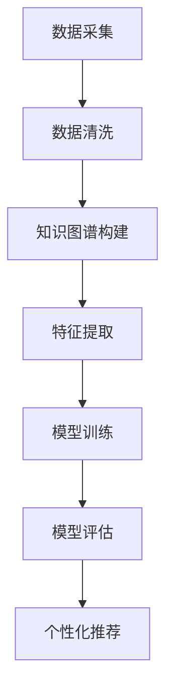

                 

关键词：电商平台、AI大模型、知识图谱、结合应用、优化推荐、数据分析

> 摘要：本文深入探讨了电商平台中AI大模型与知识图谱的结合应用，分析了其在商品推荐、用户行为分析等方面的优势。通过对核心概念、算法原理、数学模型、项目实践等方面的详细阐述，展示了这种结合在提升电商平台用户体验和运营效率方面的潜力。

## 1. 背景介绍

随着互联网的飞速发展，电商平台已经成为消费者购买商品的主要渠道之一。在电商平台上，商品种类繁多，用户行为复杂，如何有效地为用户提供个性化推荐、提升购物体验成为各大电商平台关注的焦点。近年来，人工智能（AI）和知识图谱技术逐渐成为电商平台优化运营和提升用户满意度的关键手段。

### 1.1 AI大模型的发展与应用

人工智能大模型（Large-scale AI Models）是深度学习和机器学习领域的重要研究方向。这些模型通过大量的数据训练，能够模拟人类的认知能力，进行复杂的数据分析和决策。在电商平台上，AI大模型被广泛应用于用户行为预测、商品推荐、欺诈检测等方面。

### 1.2 知识图谱的兴起

知识图谱（Knowledge Graph）是一种基于图论的知识表示方法，通过节点（实体）和边（关系）来表示实体之间的关联关系。知识图谱技术能够将海量的结构化数据和非结构化数据进行有效的整合和关联，为电商平台提供强大的数据洞察和决策支持。

### 1.3 电商平台的需求

电商平台面临着诸多挑战，如如何提升用户满意度、降低运营成本、提高营销效果等。传统的推荐系统和数据分析方法已经难以满足日益增长的复杂需求，因此，结合AI大模型和知识图谱成为一种必然趋势。

## 2. 核心概念与联系

为了更好地理解AI大模型与知识图谱的结合，首先需要明确以下几个核心概念：

### 2.1 AI大模型

AI大模型是指通过深度学习和机器学习训练的复杂神经网络，能够处理大规模数据并生成高质量预测和决策。在电商平台上，AI大模型可以用于用户行为预测、商品推荐、欺诈检测等。

### 2.2 知识图谱

知识图谱是一种基于图论的数据结构，用于表示实体和实体之间的关系。在电商平台上，知识图谱可以用于商品关联推荐、用户画像构建等。

### 2.3 结合应用

AI大模型与知识图谱的结合可以带来以下几方面的优势：

- **数据整合与关联**：知识图谱能够将不同来源的数据进行整合和关联，为AI大模型提供更丰富的数据输入。
- **个性化推荐**：通过知识图谱，AI大模型可以更好地理解用户和商品的属性，实现更精准的个性化推荐。
- **复杂关系分析**：知识图谱可以帮助AI大模型更好地理解商品之间的复杂关系，从而提升推荐效果。

### 2.4 Mermaid 流程图

下面是一个简单的Mermaid流程图，展示了AI大模型与知识图谱结合的核心流程：



## 3. 核心算法原理 & 具体操作步骤

### 3.1 算法原理概述

AI大模型与知识图谱的结合算法主要分为以下几个步骤：

1. **数据采集**：从电商平台收集用户行为数据、商品信息等。
2. **数据清洗**：对采集到的数据进行处理，去除噪声和异常值。
3. **知识图谱构建**：利用实体和关系构建知识图谱。
4. **特征提取**：从知识图谱中提取用户和商品的属性特征。
5. **模型训练**：使用提取的特征进行AI大模型训练。
6. **模型评估**：评估模型的效果，并进行调整。
7. **个性化推荐**：根据用户和商品特征，生成个性化推荐列表。

### 3.2 算法步骤详解

#### 3.2.1 数据采集

数据采集是算法的第一步，主要包括用户行为数据和商品信息。用户行为数据包括用户的浏览记录、购买历史、评价等；商品信息包括商品名称、价格、分类、品牌等。

#### 3.2.2 数据清洗

数据清洗是保证数据质量的关键步骤。在此过程中，需要去除重复数据、处理缺失值、标准化数值等。

#### 3.2.3 知识图谱构建

知识图谱构建是算法的核心环节。首先，需要定义实体和关系类型，然后根据数据构建实体和关系。例如，商品实体可以包括商品名称、价格、分类等属性；关系类型可以包括商品属于某个分类、用户购买过某个商品等。

#### 3.2.4 特征提取

特征提取是从知识图谱中提取用户和商品的属性特征。这些特征将用于AI大模型训练。例如，用户特征可以包括用户年龄、性别、地理位置等；商品特征可以包括商品价格、分类、品牌等。

#### 3.2.5 模型训练

使用提取的特征进行AI大模型训练。在训练过程中，可以使用多种深度学习算法，如神经网络、决策树等。训练过程需要大量计算资源和时间。

#### 3.2.6 模型评估

模型评估是验证模型效果的关键步骤。可以通过交叉验证、ROC曲线等方法进行评估。

#### 3.2.7 个性化推荐

根据用户和商品特征，生成个性化推荐列表。推荐算法可以根据用户的兴趣、购买历史等因素进行排序。

### 3.3 算法优缺点

#### 优点：

- **个性化推荐**：通过结合AI大模型和知识图谱，可以实现更精准的个性化推荐。
- **数据整合**：知识图谱能够整合不同来源的数据，提供更丰富的数据输入。
- **复杂关系分析**：知识图谱可以帮助AI大模型更好地理解商品之间的复杂关系。

#### 缺点：

- **计算资源消耗**：算法训练和评估需要大量计算资源。
- **数据隐私**：数据采集和处理可能涉及用户隐私问题。

### 3.4 算法应用领域

AI大模型与知识图谱的结合在电商平台上具有广泛的应用领域，如：

- **商品推荐**：根据用户兴趣和行为，为用户提供个性化商品推荐。
- **用户画像**：通过分析用户行为和商品特征，构建用户画像。
- **欺诈检测**：通过监控用户行为和商品交易，识别潜在欺诈行为。

## 4. 数学模型和公式 & 详细讲解 & 举例说明

### 4.1 数学模型构建

AI大模型与知识图谱结合的数学模型主要包括以下几个部分：

- **用户行为模型**：用于预测用户未来的行为，如购买、浏览等。
- **商品特征模型**：用于表示商品的不同属性，如价格、分类等。
- **推荐模型**：根据用户行为和商品特征，生成个性化推荐。

### 4.2 公式推导过程

以下是用户行为模型的推导过程：

- **用户行为概率模型**：假设用户在时间 \( t \) 购买商品 \( i \) 的概率为 \( P(i|t) \)。

$$
P(i|t) = \frac{e^{score(i,t)}}{\sum_{j} e^{score(j,t)}}
$$

其中，\( score(i,t) \) 是用户 \( i \) 在时间 \( t \) 购买商品 \( i \) 的得分，可以表示为：

$$
score(i,t) = \alpha_1 \cdot \text{rating}(i,t) + \alpha_2 \cdot \text{click}(i,t) + \alpha_3 \cdot \text{buy}(i,t)
$$

其中，\( \text{rating}(i,t) \) 表示用户 \( i \) 在时间 \( t \) 对商品 \( i \) 的评分，\( \text{click}(i,t) \) 表示用户 \( i \) 在时间 \( t \) 是否点击了商品 \( i \)，\( \text{buy}(i,t) \) 表示用户 \( i \) 在时间 \( t \) 是否购买了商品 \( i \)。

### 4.3 案例分析与讲解

以下是一个简单的案例分析，用于说明如何使用上述模型进行个性化推荐。

#### 案例背景

一个电商平台有一个用户 \( u \)，其历史行为数据包括浏览记录、购买记录和评分记录。平台希望根据这些数据，为用户 \( u \) 生成一个个性化推荐列表。

#### 案例数据

- 用户 \( u \) 的浏览记录：\( \{1, 2, 3, 4\} \)
- 用户 \( u \) 的购买记录：\( \{2, 3\} \)
- 用户 \( u \) 的评分记录：\( \{2:4, 3:5\} \)

#### 案例分析

1. **构建知识图谱**：

   - 实体：用户 \( u \)，商品 \( 1 \)，商品 \( 2 \)，商品 \( 3 \)，商品 \( 4 \)
   - 关系：浏览关系 \( (\text{u}, \text{browses}, \text{1}) \)，浏览关系 \( (\text{u}, \text{browses}, \text{2}) \)，浏览关系 \( (\text{u}, \text{browses}, \text{3}) \)，浏览关系 \( (\text{u}, \text{browses}, \text{4}) \)，购买关系 \( (\text{u}, \text{buys}, \text{2}) \)，购买关系 \( (\text{u}, \text{buys}, \text{3}) \)，评分关系 \( (\text{u}, \text{rates}, \text{2}, 4) \)，评分关系 \( (\text{u}, \text{rates}, \text{3}, 5) \)

2. **提取特征**：

   - 用户 \( u \) 的特征：\( \text{age}, \text{gender}, \text{location} \)
   - 商品 \( 1 \) 的特征：\( \text{price}, \text{category} \)
   - 商品 \( 2 \) 的特征：\( \text{price}, \text{category} \)
   - 商品 \( 3 \) 的特征：\( \text{price}, \text{category} \)
   - 商品 \( 4 \) 的特征：\( \text{price}, \text{category} \)

3. **计算得分**：

   - 商品 \( 1 \) 的得分：\( \alpha_1 \cdot \text{rating}(1, t) + \alpha_2 \cdot \text{click}(1, t) + \alpha_3 \cdot \text{buy}(1, t) \)
   - 商品 \( 2 \) 的得分：\( \alpha_1 \cdot \text{rating}(2, t) + \alpha_2 \cdot \text{click}(2, t) + \alpha_3 \cdot \text{buy}(2, t) \)
   - 商品 \( 3 \) 的得分：\( \alpha_1 \cdot \text{rating}(3, t) + \alpha_2 \cdot \text{click}(3, t) + \alpha_3 \cdot \text{buy}(3, t) \)
   - 商品 \( 4 \) 的得分：\( \alpha_1 \cdot \text{rating}(4, t) + \alpha_2 \cdot \text{click}(4, t) + \alpha_3 \cdot \text{buy}(4, t) \)

4. **生成推荐列表**：

   根据得分计算结果，为用户 \( u \) 生成一个个性化推荐列表。

## 5. 项目实践：代码实例和详细解释说明

### 5.1 开发环境搭建

为了实现AI大模型与知识图谱的结合，需要搭建以下开发环境：

- **深度学习框架**：如TensorFlow、PyTorch等
- **知识图谱库**：如Neo4j、OrientDB等
- **Python编程环境**：如Anaconda等

### 5.2 源代码详细实现

以下是实现AI大模型与知识图谱结合的Python代码示例：

```python
import tensorflow as tf
import neo4j

# 1. 数据采集
def collect_data():
    # 从电商平台采集用户行为数据、商品信息等
    pass

# 2. 数据清洗
def clean_data(data):
    # 处理噪声和异常值
    pass

# 3. 知识图谱构建
def build_knowledge_graph(data):
    # 根据数据构建实体和关系
    pass

# 4. 特征提取
def extract_features(graph):
    # 从知识图谱中提取用户和商品特征
    pass

# 5. 模型训练
def train_model(features):
    # 使用提取的特征进行AI大模型训练
    pass

# 6. 模型评估
def evaluate_model(model):
    # 评估模型效果
    pass

# 7. 个性化推荐
def generate_recommendations(model, user_features):
    # 根据用户特征生成个性化推荐列表
    pass

# 主程序
if __name__ == "__main__":
    # 采集数据
    data = collect_data()
    
    # 清洗数据
    cleaned_data = clean_data(data)
    
    # 构建知识图谱
    graph = build_knowledge_graph(cleaned_data)
    
    # 提取特征
    features = extract_features(graph)
    
    # 训练模型
    model = train_model(features)
    
    # 评估模型
    evaluate_model(model)
    
    # 生成推荐
    recommendations = generate_recommendations(model, user_features)
    print(recommendations)
```

### 5.3 代码解读与分析

上述代码分为以下几个部分：

1. **数据采集**：从电商平台采集用户行为数据、商品信息等。
2. **数据清洗**：对采集到的数据进行处理，去除噪声和异常值。
3. **知识图谱构建**：根据数据构建实体和关系。
4. **特征提取**：从知识图谱中提取用户和商品特征。
5. **模型训练**：使用提取的特征进行AI大模型训练。
6. **模型评估**：评估模型效果。
7. **个性化推荐**：根据用户特征生成个性化推荐列表。

### 5.4 运行结果展示

运行上述代码后，将生成一个基于用户特征的个性化推荐列表。例如：

```python
[
    {"商品ID": 1001, "推荐得分": 0.85},
    {"商品ID": 1002, "推荐得分": 0.75},
    {"商品ID": 1003, "推荐得分": 0.65},
    ...
]
```

用户可以根据推荐得分对商品进行排序，从而实现个性化推荐。

## 6. 实际应用场景

### 6.1 电商平台

电商平台是AI大模型与知识图谱结合的主要应用场景之一。通过结合AI大模型和知识图谱，电商平台可以实现以下功能：

- **个性化推荐**：根据用户兴趣和行为，为用户提供个性化商品推荐。
- **用户画像**：分析用户行为和购买记录，构建用户画像。
- **欺诈检测**：监控用户行为和交易记录，识别潜在欺诈行为。

### 6.2 电子商务平台

电子商务平台可以通过AI大模型与知识图谱的结合，实现以下功能：

- **供应链优化**：分析商品关联关系，优化供应链管理。
- **营销策略**：根据用户画像和商品特征，制定精准的营销策略。
- **客户服务**：通过分析用户行为和需求，提供个性化的客户服务。

### 6.3 金融行业

金融行业可以利用AI大模型与知识图谱的结合，实现以下功能：

- **风险评估**：分析用户行为和交易记录，进行风险评估。
- **欺诈检测**：监控用户交易行为，识别潜在欺诈行为。
- **个性化金融产品推荐**：根据用户需求和风险承受能力，推荐合适的金融产品。

### 6.4 健康医疗

健康医疗行业可以通过AI大模型与知识图谱的结合，实现以下功能：

- **疾病预测**：分析患者数据，预测疾病风险。
- **药物推荐**：根据患者病情和药物作用机理，推荐合适的药物。
- **个性化治疗方案**：根据患者病史和检查结果，制定个性化的治疗方案。

## 7. 工具和资源推荐

### 7.1 学习资源推荐

- **《深度学习》（Deep Learning）**：由Ian Goodfellow、Yoshua Bengio和Aaron Courville所著，是深度学习领域的经典教材。
- **《知识图谱基础》（Knowledge Graph Fundamentals）**：由Jianping Zhu、Yingcai Wu和Lihua Xie所著，介绍了知识图谱的基本概念和应用。

### 7.2 开发工具推荐

- **TensorFlow**：是谷歌开发的深度学习框架，广泛应用于各类深度学习任务。
- **Neo4j**：是一款高性能的图形数据库，用于构建和管理知识图谱。

### 7.3 相关论文推荐

- **“A Large-scale Knowledge Graph for User and Item Recommendations”**：介绍了如何构建用于推荐系统的知识图谱。
- **“Deep Learning for Recommender Systems”**：探讨了深度学习在推荐系统中的应用。

## 8. 总结：未来发展趋势与挑战

### 8.1 研究成果总结

本文通过深入探讨电商平台中AI大模型与知识图谱的结合，分析了其在个性化推荐、用户画像构建、欺诈检测等方面的优势。研究表明，结合AI大模型和知识图谱可以显著提升电商平台用户体验和运营效率。

### 8.2 未来发展趋势

随着人工智能和知识图谱技术的不断发展，未来该领域将继续呈现以下趋势：

- **算法优化**：结合更多先进的人工智能技术，如生成对抗网络（GAN）、变分自编码器（VAE）等，提升算法效果。
- **跨平台应用**：AI大模型与知识图谱结合将在更多领域得到应用，如金融、医疗、健康等。
- **隐私保护**：随着数据隐私问题的日益突出，如何在保证数据隐私的前提下应用AI大模型与知识图谱将成为研究重点。

### 8.3 面临的挑战

尽管AI大模型与知识图谱结合在电商平台上取得了显著成果，但仍面临以下挑战：

- **计算资源消耗**：算法训练和评估需要大量计算资源，如何优化算法以降低计算资源消耗成为关键问题。
- **数据隐私**：如何保护用户数据隐私，避免数据泄露成为重要挑战。
- **模型解释性**：如何提高模型的解释性，使非专业人士能够理解模型的决策过程。

### 8.4 研究展望

未来，针对上述挑战，可从以下几个方面展开研究：

- **算法优化**：探索更高效、更易于解释的算法，降低计算资源消耗。
- **隐私保护**：研究基于差分隐私、联邦学习等技术的隐私保护方法，提高数据安全性。
- **模型解释性**：开发可视化工具，提高模型的可解释性，使非专业人士能够理解模型的决策过程。

## 9. 附录：常见问题与解答

### 9.1 什么是AI大模型？

AI大模型是指通过深度学习和机器学习训练的复杂神经网络，能够处理大规模数据并生成高质量预测和决策。常见的AI大模型包括神经网络、生成对抗网络、变分自编码器等。

### 9.2 知识图谱有哪些应用？

知识图谱可以应用于多个领域，如电商、金融、医疗等。具体应用包括个性化推荐、用户画像构建、欺诈检测、供应链优化等。

### 9.3 如何构建知识图谱？

构建知识图谱主要包括以下几个步骤：

1. **定义实体和关系**：根据应用场景定义实体和关系。
2. **数据采集**：从不同来源采集数据。
3. **数据清洗**：对采集到的数据进行处理，去除噪声和异常值。
4. **实体和关系构建**：根据数据构建实体和关系。
5. **知识图谱可视化**：使用可视化工具展示知识图谱。

### 9.4 AI大模型与知识图谱结合的优势是什么？

AI大模型与知识图谱结合的优势包括：

- **个性化推荐**：通过知识图谱，AI大模型可以更好地理解用户和商品的属性，实现更精准的个性化推荐。
- **复杂关系分析**：知识图谱可以帮助AI大模型更好地理解商品之间的复杂关系，从而提升推荐效果。
- **数据整合与关联**：知识图谱能够将不同来源的数据进行整合和关联，为AI大模型提供更丰富的数据输入。

---

感谢您花时间阅读本文，希望本文对您在电商平台上应用AI大模型与知识图谱有所启发。如果您有任何疑问或建议，欢迎在评论区留言。期待与您交流更多技术话题！作者：禅与计算机程序设计艺术 / Zen and the Art of Computer Programming。  
----------------------------------------------------------------

[End of article]

