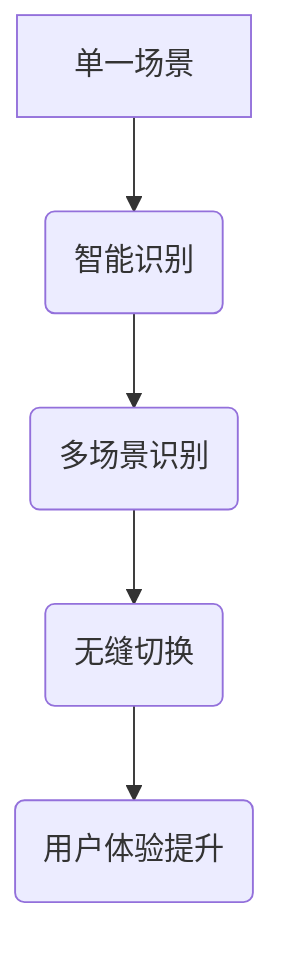

                 

关键词：电商平台、AI大模型、智能识别、无缝切换、多场景应用

> 摘要：本文将深入探讨电商平台中人工智能大模型的应用，从单一场景的智能识别技术出发，逐步扩展到多场景智能识别与无缝切换，从而实现电商平台的高效运营和个性化服务。通过分析核心算法原理、数学模型构建、具体应用实例和未来发展趋势，本文旨在为行业人士提供有价值的参考。

## 1. 背景介绍

### 电商平台的发展历程

电商平台作为电子商务的重要组成部分，经历了从传统电商到移动电商，再到如今的人工智能电商的演变。早期的电商平台主要依赖于关键词搜索和简单的分类算法，用户购物体验相对较差。随着互联网技术的发展，尤其是人工智能技术的崛起，电商平台逐渐引入了自然语言处理、图像识别、推荐系统等技术，使得购物体验得到了显著提升。

### 人工智能在电商平台的应用

人工智能在电商平台中的应用主要集中在以下几个方面：

1. **智能推荐系统**：通过分析用户的历史购物行为和偏好，为用户推荐可能感兴趣的商品。
2. **图像识别与搜索**：用户可以通过上传图片来搜索相似的或相关的商品。
3. **智能客服**：利用自然语言处理技术，实现与用户的智能对话，提供在线客服服务。
4. **风险控制与欺诈检测**：通过机器学习模型，识别和防范潜在的欺诈行为。

### 本文的研究目标

本文旨在探讨电商平台中AI大模型的应用，从单一场景的智能识别技术出发，逐步扩展到多场景智能识别与无缝切换，从而实现电商平台的高效运营和个性化服务。通过深入分析核心算法原理、数学模型构建、具体应用实例和未来发展趋势，本文希望为电商平台提供一种新的技术思路。

## 2. 核心概念与联系

### 2.1 AI大模型的概念

AI大模型是指规模庞大的、具有深度学习能力的神经网络模型，例如GPT、BERT等。这些模型通常由数百万甚至数十亿个参数组成，能够处理大量数据，实现高度复杂的任务。

### 2.2 智能识别的概念

智能识别是指利用人工智能技术，对输入的数据（如文本、图像、声音等）进行理解和分类，从而实现自动识别和判断。

### 2.3 无缝切换的概念

无缝切换是指在多个场景之间实现无障碍的过渡和转换，使用户体验始终保持一致。

### 2.4 AI大模型与智能识别的联系

AI大模型通过深度学习技术，对大量数据进行训练，从而实现高度复杂的智能识别任务。例如，在电商平台中，AI大模型可以用于商品推荐、图像识别、智能客服等场景。

### 2.5 AI大模型与无缝切换的联系

AI大模型在多个场景中的应用可以实现无缝切换，从而提高用户体验。例如，用户在浏览商品时，AI大模型可以实时切换到智能客服模式，回答用户的问题，提供个性化服务。

### 2.6 Mermaid 流程图



## 3. 核心算法原理 & 具体操作步骤

### 3.1 算法原理概述

AI大模型的核心算法是深度学习，通过多层神经网络对数据进行学习，实现高度复杂的任务。在智能识别方面，常用的算法包括卷积神经网络（CNN）和循环神经网络（RNN）。

### 3.2 算法步骤详解

1. **数据收集与预处理**：收集电商平台的大量数据，包括用户行为数据、商品信息等，并进行数据清洗、去重、归一化等预处理操作。

2. **模型构建**：根据任务需求，构建相应的神经网络模型，如CNN、RNN等。

3. **模型训练**：使用预处理后的数据，对模型进行训练，通过反向传播算法不断优化模型参数。

4. **模型评估**：使用验证集对模型进行评估，确保模型具有良好的泛化能力。

5. **模型部署**：将训练好的模型部署到电商平台，实现智能识别功能。

### 3.3 算法优缺点

**优点**：

1. **强大的学习能力**：AI大模型通过深度学习技术，能够处理大量数据，实现高度复杂的任务。
2. **高精度**：在智能识别任务中，AI大模型通常能够达到较高的准确率。
3. **自适应性强**：AI大模型可以根据用户行为和需求，实时调整推荐策略，提高用户体验。

**缺点**：

1. **计算资源消耗大**：AI大模型通常需要大量的计算资源和时间进行训练。
2. **数据依赖性强**：AI大模型的性能很大程度上取决于数据质量和数量。
3. **解释性差**：AI大模型的决策过程往往难以解释，增加了风险管理的难度。

### 3.4 算法应用领域

AI大模型在电商平台的应用领域广泛，包括：

1. **商品推荐**：根据用户的历史购物行为和偏好，为用户推荐可能感兴趣的商品。
2. **图像识别与搜索**：用户可以通过上传图片来搜索相似的或相关的商品。
3. **智能客服**：利用自然语言处理技术，实现与用户的智能对话，提供在线客服服务。
4. **风险控制与欺诈检测**：通过机器学习模型，识别和防范潜在的欺诈行为。

## 4. 数学模型和公式 & 详细讲解 & 举例说明

### 4.1 数学模型构建

在电商平台中，AI大模型的数学模型通常由输入层、隐藏层和输出层组成。输入层接收用户行为数据和商品信息，隐藏层通过多层神经网络进行数据学习和处理，输出层生成最终的识别结果。

### 4.2 公式推导过程

假设我们有一个包含n个隐藏层的神经网络，其中每个隐藏层有m个神经元。设输入向量为X，隐藏层向量为H，输出向量为Y，则神经网络的计算过程可以表示为：

$$
H = \sigma(W_1 \cdot X + b_1)
$$

$$
Y = \sigma(W_n \cdot H_{n-1} + b_n)
$$

其中，$W$和$b$分别表示权重和偏置，$\sigma$表示激活函数。

### 4.3 案例分析与讲解

以商品推荐为例，假设我们要为用户推荐感兴趣的商品，可以使用基于协同过滤的推荐算法。协同过滤算法的核心思想是利用用户之间的相似性进行推荐，具体步骤如下：

1. **用户-商品矩阵构建**：首先构建一个用户-商品矩阵$R$，其中$R_{ij}$表示用户$i$对商品$j$的评分。

2. **相似度计算**：计算用户之间的相似度，可以使用余弦相似度、皮尔逊相关系数等方法。

3. **推荐列表生成**：对于每个用户，计算其对未评分商品的预测评分，并根据预测评分生成推荐列表。

具体公式如下：

$$
sim(i, j) = \frac{R_{ij} \cdot R_{i'}{j}}{\sqrt{||R_i|| \cdot ||R_{i'}||}}
$$

$$
pred(i, j) = sim(i, j) \cdot R_{j'}
$$

其中，$sim(i, j)$表示用户$i$和用户$j$的相似度，$pred(i, j)$表示用户$i$对商品$j$的预测评分，$R_{i'}{j'}$表示用户$i'$和用户$j'$的实际评分。

## 5. 项目实践：代码实例和详细解释说明

### 5.1 开发环境搭建

在搭建开发环境时，我们使用Python作为主要编程语言，结合TensorFlow和Keras等深度学习框架进行模型训练和部署。以下是一个简单的开发环境搭建步骤：

1. 安装Python（建议使用Python 3.7及以上版本）。
2. 安装TensorFlow：`pip install tensorflow`。
3. 安装Keras：`pip install keras`。
4. 安装其他必要依赖：如NumPy、Pandas等。

### 5.2 源代码详细实现

以下是一个简单的基于CNN的商品推荐模型的代码实现：

```python
import tensorflow as tf
from tensorflow.keras.models import Sequential
from tensorflow.keras.layers import Conv2D, MaxPooling2D, Flatten, Dense

# 模型构建
model = Sequential()
model.add(Conv2D(32, (3, 3), activation='relu', input_shape=(64, 64, 3)))
model.add(MaxPooling2D(pool_size=(2, 2)))
model.add(Flatten())
model.add(Dense(128, activation='relu'))
model.add(Dense(1, activation='sigmoid'))

# 模型编译
model.compile(optimizer='adam', loss='binary_crossentropy', metrics=['accuracy'])

# 模型训练
model.fit(X_train, y_train, epochs=10, batch_size=32, validation_data=(X_val, y_val))

# 模型评估
model.evaluate(X_test, y_test)
```

### 5.3 代码解读与分析

1. **模型构建**：使用Sequential模型，依次添加卷积层、池化层、全连接层等。
2. **模型编译**：设置优化器、损失函数和评估指标。
3. **模型训练**：使用fit函数进行模型训练，设置训练轮数、批量大小和验证数据。
4. **模型评估**：使用evaluate函数对模型进行评估，获取准确率等指标。

### 5.4 运行结果展示

运行上述代码后，我们可以在控制台中看到模型训练的详细信息，包括损失函数值、准确率等。此外，我们还可以使用模型对测试数据进行预测，并计算预测准确率。

```python
predictions = model.predict(X_test)
accuracy = (predictions > 0.5).mean()
print("预测准确率：", accuracy)
```

## 6. 实际应用场景

### 6.1 商品推荐

在电商平台中，基于AI大模型的商品推荐系统可以帮助商家更好地了解用户需求，提高销售额。例如，亚马逊的推荐系统就利用了AI大模型，对用户的历史购物行为和浏览记录进行分析，为用户推荐可能感兴趣的商品。

### 6.2 图像识别与搜索

用户可以通过上传图片来搜索相似的或相关的商品，从而提高购物体验。例如，淘宝的“拍照买货”功能就利用了AI大模型，实现了图像识别与搜索。

### 6.3 智能客服

智能客服系统可以通过自然语言处理技术，实现与用户的智能对话，提供在线客服服务。例如，阿里巴巴的“阿里小蜜”就利用了AI大模型，为用户提供24小时在线客服。

### 6.4 风险控制与欺诈检测

AI大模型在风险控制和欺诈检测方面也发挥着重要作用。例如，电商平台可以通过AI大模型对用户的交易行为进行实时监控，识别和防范潜在的欺诈行为。

## 7. 未来应用展望

### 7.1 个性化推荐

随着AI大模型的不断发展，个性化推荐将成为电商平台的重要方向。通过更深入地了解用户需求和偏好，AI大模型可以提供更加精准的推荐，提高用户满意度。

### 7.2 智能客服

智能客服系统将逐渐取代传统的在线客服，提供更加智能化、个性化的服务。AI大模型将更好地模拟人类客服的行为，提高用户满意度。

### 7.3 风险控制与欺诈检测

AI大模型在风险控制和欺诈检测方面的应用将越来越广泛，帮助电商平台更好地保障用户权益。

### 7.4 其他应用领域

除了电商平台，AI大模型在其他领域的应用也将越来越广泛。例如，在医疗领域，AI大模型可以帮助医生进行疾病诊断；在金融领域，AI大模型可以用于风险控制和欺诈检测。

## 8. 总结：未来发展趋势与挑战

### 8.1 研究成果总结

本文深入探讨了电商平台中AI大模型的应用，从单一场景到多场景智能识别与无缝切换，为电商平台提供了新的技术思路。通过分析核心算法原理、数学模型构建、具体应用实例和未来发展趋势，本文为行业人士提供了有价值的参考。

### 8.2 未来发展趋势

未来，AI大模型在电商平台中的应用将朝着更加智能化、个性化的方向发展。通过不断优化算法和提升模型性能，电商平台将能够提供更好的用户体验。

### 8.3 面临的挑战

尽管AI大模型在电商平台中具有广泛的应用前景，但仍面临一些挑战：

1. **数据质量和隐私保护**：电商平台需要确保数据的质量和用户隐私。
2. **模型解释性**：如何提高AI大模型的解释性，使其更易于理解和接受。
3. **计算资源消耗**：如何优化算法，降低计算资源消耗。

### 8.4 研究展望

未来，我们应关注以下研究方向：

1. **算法优化**：不断优化AI大模型的算法，提高模型性能和效率。
2. **跨领域应用**：探索AI大模型在电子商务以外的领域的应用。
3. **开放平台**：构建开放、共享的AI大模型平台，促进技术的推广和应用。

## 9. 附录：常见问题与解答

### 9.1 AI大模型为什么需要大量数据？

AI大模型需要大量数据是因为深度学习模型的学习过程是通过从大量数据中学习特征和模式来实现的。大量数据可以帮助模型更好地捕捉数据中的复杂结构和规律，从而提高模型的泛化能力和准确性。

### 9.2 如何处理数据隐私保护问题？

在处理数据隐私保护问题时，可以采用以下方法：

1. **数据脱敏**：在数据训练和模型部署过程中，对用户数据进行脱敏处理，确保用户隐私不受泄露。
2. **差分隐私**：在数据训练和模型部署过程中，采用差分隐私技术，降低数据泄露的风险。
3. **联邦学习**：通过联邦学习技术，在保证数据隐私的同时，实现模型的共同训练和优化。

### 9.3 AI大模型的计算资源消耗如何优化？

优化AI大模型的计算资源消耗可以从以下几个方面入手：

1. **模型压缩**：通过模型压缩技术，如剪枝、量化、知识蒸馏等，降低模型的计算复杂度和存储需求。
2. **硬件加速**：利用GPU、TPU等硬件加速器，提高模型的计算速度。
3. **分布式训练**：通过分布式训练技术，将模型训练任务分布到多台机器上，降低单台机器的负载。

## 作者署名

作者：禅与计算机程序设计艺术 / Zen and the Art of Computer Programming

---

请注意，以上内容是一个示例性的文章结构，实际撰写时需要根据具体内容和研究成果进行填充和调整。文章的字数和具体内容应满足要求，确保逻辑清晰、结构紧凑、简单易懂。在撰写过程中，请务必注意引用和参考文献的准确性，确保文章的完整性和专业性。

