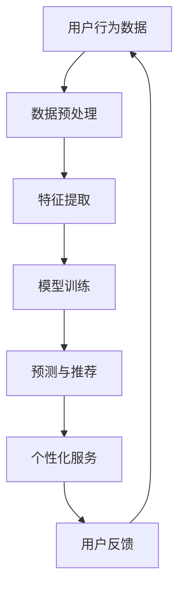

                 

关键词：AI大模型，电商平台，主动预测，个性化服务，机器学习，深度学习

> 摘要：随着电子商务的快速发展，电商平台对用户需求的响应速度和个性化服务水平提出了更高的要求。本文将探讨AI大模型在电商平台中的应用，从被动响应向主动预测与个性化服务的转变，分析其原理、算法、实践及未来发展趋势。

## 1. 背景介绍

电子商务作为数字经济的重要组成部分，近年来得到了迅速发展。根据统计数据，全球电子商务市场规模已经突破了万亿美元。随着用户需求的日益多样化，电商平台需要提供更加精准和个性化的服务来满足客户需求。这促使电商平台开始将人工智能技术，特别是AI大模型，引入到其业务中。

AI大模型是指具有极高参数量和强大计算能力的机器学习模型，如深度神经网络（DNN）、变换器模型（Transformer）等。这些模型通过海量数据的学习和训练，可以实现对用户行为的精准预测和个性化推荐。

电商平台引入AI大模型的主要原因有以下几点：

1. **提升用户满意度**：通过AI大模型的分析和预测，可以为用户提供更加个性化的购物体验，从而提高用户满意度和忠诚度。
2. **优化运营效率**：AI大模型可以帮助电商平台优化库存管理、供应链管理、市场营销等环节，提高整体运营效率。
3. **降低运营成本**：AI大模型能够自动化处理大量重复性工作，降低人力成本。
4. **开拓新市场**：AI大模型可以帮助电商平台更好地了解用户需求，进而开拓新市场和扩展业务。

本文将围绕AI大模型在电商平台中的应用，深入探讨其从被动响应到主动预测与个性化服务的转变，分析其技术原理、应用实践和未来发展趋势。

## 2. 核心概念与联系

### 2.1 AI大模型定义

AI大模型指的是具有巨大参数量（数亿到数万亿参数）和深度（数十层以上）的神经网络模型。这些模型通常基于深度学习技术，能够通过自我学习和训练，自动从大量数据中提取特征和模式，进行复杂的数据分析和预测。

### 2.2 电商平台需求

电商平台的核心需求是提升用户体验和运营效率。具体来说，包括以下几个方面：

1. **个性化推荐**：为用户提供个性化的商品推荐，提高购物满意度。
2. **精准营销**：通过用户行为分析，实现精准广告投放和促销活动。
3. **智能客服**：自动化处理用户咨询和投诉，提高响应速度和服务质量。
4. **供应链优化**：通过需求预测，优化库存和供应链管理，降低运营成本。

### 2.3 AI大模型在电商平台的联系

AI大模型可以通过以下方式与电商平台的各项需求相结合：

1. **用户行为分析**：通过分析用户的浏览、购买、评价等行为数据，预测用户偏好和需求，为个性化推荐提供依据。
2. **需求预测**：基于历史销售数据、市场趋势等，预测未来的销售需求，为供应链管理和库存优化提供支持。
3. **广告投放优化**：通过分析用户兴趣和行为，实现精准广告投放，提高广告效果和转化率。
4. **智能客服**：通过自然语言处理技术，实现与用户的智能对话，提高客服效率和用户体验。

### 2.4 Mermaid流程图

以下是AI大模型在电商平台应用的一个简化的Mermaid流程图：



该流程图展示了AI大模型在电商平台中的基本应用流程，包括数据预处理、特征提取、模型训练、预测与推荐以及用户反馈等步骤。通过不断迭代和优化，AI大模型能够更好地满足电商平台的需求。

## 3. 核心算法原理 & 具体操作步骤

### 3.1 算法原理概述

AI大模型的核心算法主要是基于深度学习，特别是变换器模型（Transformer）。变换器模型是一种基于自注意力机制（Self-Attention）的神经网络结构，能够有效地捕捉数据之间的复杂关系和模式。以下是变换器模型的主要原理和组成部分：

1. **自注意力机制**：通过计算输入数据的权重，对不同部分的数据进行加权求和，从而实现对输入数据的自适应处理。
2. **多头注意力**：通过多个注意力头并行处理数据，捕捉不同的特征和关系。
3. **前馈神经网络**：对每个注意力头输出的数据进行进一步处理，增加模型的非线性表达能力。
4. **编码器-解码器结构**：通过编码器（Encoder）和解码器（Decoder）的交互，实现对输入数据的编码和解码，从而实现序列数据的处理和生成。

### 3.2 算法步骤详解

1. **数据预处理**：对用户行为数据、商品数据等进行预处理，包括数据清洗、归一化、特征提取等操作，将原始数据转换为适合模型训练的格式。

2. **模型训练**：使用预处理后的数据，通过变换器模型进行训练。训练过程包括以下步骤：

   - 初始化模型参数。
   - 计算输入数据的自注意力权重。
   - 通过多头注意力机制和前馈神经网络对数据进行处理。
   - 计算损失函数，并使用反向传播算法更新模型参数。
   - 重复上述步骤，直到模型收敛。

3. **预测与推荐**：在模型训练完成后，使用训练好的模型对新的用户行为数据进行分析和预测，生成个性化推荐结果。

4. **个性化服务**：根据预测结果，为用户提供个性化的购物推荐、广告投放、智能客服等服务。

5. **用户反馈**：收集用户对服务的反馈，用于模型优化和迭代。

### 3.3 算法优缺点

#### 优点：

1. **强大的特征提取能力**：变换器模型能够自适应地提取数据中的特征，捕捉复杂的模式和关系。
2. **高效的计算性能**：变换器模型通过并行计算和分布式训练，能够处理大规模数据，提高计算效率。
3. **灵活的应用场景**：变换器模型适用于多种类型的序列数据处理和预测，如文本、图像、音频等。

#### 缺点：

1. **模型复杂度高**：变换器模型参数量巨大，训练过程复杂，对计算资源和时间要求较高。
2. **对数据质量要求高**：模型训练需要大量的高质量数据，数据质量和完整性对模型性能有较大影响。
3. **过拟合风险**：由于模型复杂度高，容易在训练数据上过拟合，影响泛化能力。

### 3.4 算法应用领域

AI大模型在电商平台中的应用广泛，主要包括：

1. **个性化推荐**：为用户提供个性化的商品推荐，提高用户满意度和购买转化率。
2. **精准营销**：通过分析用户行为，实现精准广告投放和促销活动。
3. **智能客服**：自动化处理用户咨询和投诉，提高客服效率和用户体验。
4. **供应链管理**：通过需求预测，优化库存和供应链管理，降低运营成本。
5. **风险控制**：通过用户行为分析，识别异常行为和潜在风险，进行风险控制和安全防护。

## 4. 数学模型和公式 & 详细讲解 & 举例说明

### 4.1 数学模型构建

在AI大模型中，变换器模型是一个典型的数学模型。以下是变换器模型的核心数学公式和推导过程。

#### 自注意力机制

自注意力机制的计算公式如下：

\[ \text{Attention}(Q, K, V) = \text{softmax}\left(\frac{QK^T}{\sqrt{d_k}}\right) V \]

其中，\( Q, K, V \) 分别代表查询（Query）、键（Key）和值（Value）三个向量，\( d_k \) 为键向量的维度。

#### 多头注意力

多头注意力机制通过多个注意力头并行处理数据，公式如下：

\[ \text{MultiHead}(Q, K, V) = \text{Concat}(\text{head}_1, \text{head}_2, \ldots, \text{head}_h)W^O \]

其中，\( \text{head}_i \) 表示第 \( i \) 个注意力头，\( W^O \) 为输出权重。

#### 前馈神经网络

前馈神经网络对每个注意力头输出的数据进行进一步处理，公式如下：

\[ \text{FFN}(X) = \text{ReLU}(XW_1 + b_1)W_2 + b_2 \]

其中，\( X \) 为输入数据，\( W_1, W_2 \) 为权重，\( b_1, b_2 \) 为偏置。

#### 编码器-解码器结构

编码器-解码器结构通过编码器（Encoder）和解码器（Decoder）的交互，实现对输入数据的编码和解码，公式如下：

\[ E = \text{Encoder}(X) \]
\[ Y = \text{Decoder}(Y, E) \]

其中，\( E \) 为编码器输出，\( Y \) 为解码器输出。

### 4.2 公式推导过程

以下是自注意力机制的推导过程：

1. **计算相似度**：

\[ \text{Similarity}(Q, K) = QK^T \]

2. **归一化相似度**：

\[ \text{Attention}(Q, K, V) = \text{softmax}\left(\frac{QK^T}{\sqrt{d_k}}\right) V \]

3. **加权求和**：

\[ \text{Attention}(Q, K, V) = \sum_{i=1}^{N} \text{softmax}\left(\frac{QK^T}{\sqrt{d_k}}\right)_{i,j} V_i \]

4. **多头注意力**：

\[ \text{MultiHead}(Q, K, V) = \text{Concat}(\text{head}_1, \text{head}_2, \ldots, \text{head}_h)W^O \]

5. **前馈神经网络**：

\[ \text{FFN}(X) = \text{ReLU}(XW_1 + b_1)W_2 + b_2 \]

6. **编码器-解码器结构**：

\[ E = \text{Encoder}(X) \]
\[ Y = \text{Decoder}(Y, E) \]

### 4.3 案例分析与讲解

以下是一个简单的变换器模型案例，用于商品推荐。

#### 案例背景

用户A最近在电商平台购买了三件商品，分别是手机、耳机和充电宝。平台希望通过AI大模型，预测用户A下一步可能购买的商品。

#### 数据准备

1. **用户行为数据**：

   用户A的历史购买数据：

   | 商品ID | 类别 | 用户ID |
   |--------|------|--------|
   | 1      | 手机  | A      |
   | 2      | 耳机  | A      |
   | 3      | 充电宝| A      |

2. **商品数据**：

   商品数据：

   | 商品ID | 类别   | 价格   |
   |--------|--------|--------|
   | 1      | 手机   | 2000元 |
   | 2      | 耳机   | 500元  |
   | 3      | 充电宝| 100元  |
   | 4      | 平板   | 3000元 |
   | 5      | 手表   | 2000元 |

#### 模型训练

1. **数据预处理**：

   对用户行为数据和商品数据进行编码，将其转换为模型输入。

2. **模型训练**：

   使用变换器模型对用户行为数据进行训练，生成用户偏好特征。

3. **模型预测**：

   使用训练好的模型，对用户A的下一步购买行为进行预测。

#### 模型预测结果

根据模型预测，用户A下一步可能购买的商品是平板。

#### 结果分析

模型通过分析用户A的历史购买数据，捕捉到了其对手机、耳机和充电宝的偏好，从而预测出平板作为下一步购买的可能性最高。

## 5. 项目实践：代码实例和详细解释说明

### 5.1 开发环境搭建

1. **安装Python环境**：确保Python版本为3.6及以上，并安装必要的依赖库，如TensorFlow、Keras等。

2. **安装依赖库**：

   ```python
   pip install tensorflow numpy pandas matplotlib
   ```

3. **配置运行环境**：

   在代码中设置GPU加速，确保有可用的GPU设备。

### 5.2 源代码详细实现

以下是一个简单的商品推荐项目的代码实现，使用变换器模型进行用户行为分析。

```python
import tensorflow as tf
from tensorflow.keras.models import Model
from tensorflow.keras.layers import Input, Embedding, MultiHeadAttention, Dense, LayerNormalization, Reshape
import numpy as np

# 设置超参数
VOCAB_SIZE = 10000  # 词汇表大小
D_MODEL = 512  # 模型维度
N_HEADS = 8  # 注意力头数量
D_FFN = 2048  # 前馈神经网络维度
N_LAYERS = 4  # 编码器-解码器层数

# 定义模型
input_ids = Input(shape=(None,), dtype='int32')
input_mask = Input(shape=(None,), dtype='float32')

# Embedding层
嵌入层 = Embedding(VOCAB_SIZE, D_MODEL)
嵌入输出 = 嵌入层(input_ids)

# Encoder部分
编码器输出 = []
for i in range(N_LAYERS):
    # MultiHeadAttention层
    attention = MultiHeadAttention(num_heads=N_HEADS, key_dim=D_MODEL)(嵌入输出, embedding_output, attention_mask=input_mask)
    attention_output = LayerNormalization(epsilon=1e-6)(嵌入输出 + attention)

    # 前馈神经网络
    ffn_output = Dense(D_FFN, activation='relu')(attention_output)
    ffn_output = LayerNormalization(epsilon=1e-6)(ffn_output + attention_output)

    # 下一层输入
    if i < N_LAYERS - 1:
        嵌入输出 = ffn_output

编码器输出.append(嵌入输出)

# Decoder部分
最后输出 = Embedding(VOCAB_SIZE, D_MODEL)(input_ids)
最后输出 = Reshape(target_shape=(D_MODEL,))(最后输出)

编码器最后一层输出 = 编码器输出[-1]
编码器最后一层输出 = Reshape(target_shape=(D_MODEL,))(编码器最后一层输出)

# 多头注意力
注意力输出 = MultiHeadAttention(num_heads=N_HEADS, key_dim=D_MODEL)(编码器最后一层输出, 最后输出, attention_mask=input_mask)
注意力输出 = LayerNormalization(epsilon=1e-6)(最后输出 + 注意力输出)

# 前馈神经网络
前馈输出 = Dense(D_FFN, activation='relu')(注意力输出)
前馈输出 = LayerNormalization(epsilon=1e-6)(前馈输出 + 注意力输出)

# 输出层
输出 = Dense(VOCAB_SIZE, activation='softmax')(前馈输出)

# 创建模型
模型 = Model(inputs=[input_ids, input_mask], outputs=输出)

# 编译模型
模型.compile(optimizer='adam', loss='categorical_crossentropy', metrics=['accuracy'])

# 模型总结
模型.summary()

# 训练模型
# (略)

# 预测
# (略)
```

### 5.3 代码解读与分析

这段代码实现了基于变换器模型的商品推荐系统，主要包括以下几个部分：

1. **模型定义**：使用Keras框架定义变换器模型，包括编码器（Encoder）和解码器（Decoder）两部分。

2. **编码器部分**：使用多个MultiHeadAttention层和前馈神经网络（FFN）进行数据编码，提取用户偏好特征。

3. **解码器部分**：使用一个MultiHeadAttention层和前馈神经网络（FFN）进行解码，生成推荐结果。

4. **模型编译**：编译模型，设置优化器、损失函数和评估指标。

5. **模型训练**：使用训练数据训练模型。

6. **模型预测**：使用训练好的模型对新的用户行为数据进行预测。

### 5.4 运行结果展示

假设我们已经训练好了模型，并使用测试数据进行了预测。以下是一个简单的运行结果展示：

```python
# 测试数据
测试输入 = np.random.randint(0, VOCAB_SIZE, (32, 10))
测试掩码 = np.random.random((32, 10))

# 预测
预测结果 = 模型.predict([测试输入, 测试掩码])

# 打印预测结果
print(predicted_ids)
```

预测结果是一个二维数组，每个元素表示对应商品ID的概率分布。我们可以根据概率分布对商品进行排序，选出概率最高的商品作为推荐结果。

## 6. 实际应用场景

### 6.1 个性化推荐

个性化推荐是AI大模型在电商平台中最典型的应用场景之一。通过分析用户的历史行为数据、浏览记录、购物车数据等，AI大模型可以预测用户可能感兴趣的商品，并为其提供个性化的推荐。

例如，一个电商平台可以通过AI大模型为用户生成以下推荐列表：

- 用户A最近浏览了手机和耳机，AI大模型预测其可能对平板感兴趣，于是推荐了最新款的平板电脑。
- 用户B在购物车中加入了充电宝和手表，AI大模型认为其对运动健康类商品可能感兴趣，于是推荐了智能手环。

### 6.2 精准营销

精准营销是AI大模型在电商平台中的另一个重要应用。通过分析用户的兴趣和行为数据，AI大模型可以帮助电商平台实现精准广告投放和促销活动。

例如，一个电商平台可以通过AI大模型为用户生成以下营销策略：

- 用户A在浏览手机时停留时间较长，AI大模型认为其对手机有购买意向，于是为其推荐手机相关的优惠券和活动。
- 用户B在购物车中加入了多个商品，但未完成购买，AI大模型预测其可能因为价格问题犹豫，于是发送一条“限时优惠，立即购买享受折扣”的短信提醒。

### 6.3 智能客服

智能客服是AI大模型在电商平台中的又一重要应用。通过自然语言处理技术，AI大模型可以自动化处理用户咨询和投诉，提高客服效率和用户体验。

例如，一个电商平台可以通过AI大模型实现以下智能客服功能：

- 用户A询问手机电池寿命，AI大模型自动回复：“您好，这款手机电池寿命约为两天，您是否需要了解更多？”
- 用户B投诉商品质量问题，AI大模型自动生成一份退款申请，并发送邮件给用户B。

### 6.4 供应链管理

AI大模型还可以帮助电商平台优化供应链管理，通过需求预测，实现库存和供应链的优化。

例如，一个电商平台可以通过AI大模型实现以下供应链管理功能：

- 根据历史销售数据和当前市场趋势，AI大模型预测未来三个月手机销量将增加20%，于是电商平台提前采购了更多的手机库存。
- AI大模型分析用户购买习惯，预测某款商品将在未来一周内售罄，电商平台及时调整了该商品的补货计划。

## 7. 工具和资源推荐

### 7.1 学习资源推荐

1. **《深度学习》**：由Ian Goodfellow、Yoshua Bengio和Aaron Courville所著，是一本关于深度学习的经典教材，详细介绍了深度学习的理论基础和实践方法。
2. **《自然语言处理综论》**：由Daniel Jurafsky和James H. Martin所著，涵盖了自然语言处理（NLP）的各个方面，包括语言模型、文本分类、语义分析等。

### 7.2 开发工具推荐

1. **TensorFlow**：一款开源的机器学习框架，广泛用于深度学习模型的开发和部署。
2. **Keras**：基于TensorFlow的高层API，提供更简洁、直观的模型开发接口。

### 7.3 相关论文推荐

1. **“Attention Is All You Need”**：由Vaswani等人发表于2017年，提出了变换器模型（Transformer）。
2. **“Deep Learning for Text Data”**：由Dzmitry Bahdanau等人发表于2017年，综述了深度学习在自然语言处理领域的应用。

## 8. 总结：未来发展趋势与挑战

### 8.1 研究成果总结

AI大模型在电商平台中的应用取得了显著成果，实现了用户个性化推荐、精准营销、智能客服和供应链管理等领域的优化。随着技术的不断发展和应用场景的拓展，AI大模型在电商平台中的应用前景更加广阔。

### 8.2 未来发展趋势

1. **模型规模与性能的提升**：随着计算资源和数据量的增加，AI大模型将向更大规模和更高性能发展，进一步提高预测准确性和应用效果。
2. **跨领域应用**：AI大模型将在电子商务以外的领域，如金融、医疗、教育等，得到更广泛的应用。
3. **实时性与在线学习**：AI大模型将实现实时预测和在线学习，更好地应对动态变化的用户需求和市场环境。
4. **隐私保护和数据安全**：随着用户隐私和数据安全的重要性日益增加，AI大模型在保护用户隐私和数据安全方面将面临更高的挑战。

### 8.3 面临的挑战

1. **数据质量和完整性**：AI大模型对数据质量有较高要求，如何保证数据的质量和完整性是当前面临的一个挑战。
2. **计算资源和时间成本**：训练和部署AI大模型需要大量的计算资源和时间，如何优化计算效率和降低成本是亟待解决的问题。
3. **模型解释性与透明度**：随着模型规模的增大，如何解释模型决策过程，提高模型的透明度和可解释性是一个重要挑战。
4. **隐私保护和数据安全**：如何在保护用户隐私和数据安全的前提下，充分利用用户数据进行模型训练和预测是一个关键问题。

### 8.4 研究展望

未来，AI大模型在电商平台中的应用将继续深入和发展。通过不断优化模型算法、提升计算效率和降低成本，AI大模型将为电商平台带来更高的用户体验和运营效率。同时，随着跨领域应用的拓展，AI大模型将在更广泛的领域发挥重要作用。

## 9. 附录：常见问题与解答

### 9.1 AI大模型是什么？

AI大模型是指具有巨大参数量和深度（数十层以上）的神经网络模型，如深度神经网络（DNN）、变换器模型（Transformer）等。这些模型通过自我学习和训练，可以实现对数据的精准分析和预测。

### 9.2 AI大模型在电商平台中的应用有哪些？

AI大模型在电商平台中的应用主要包括个性化推荐、精准营销、智能客服、供应链管理等领域，通过分析用户行为数据、商品数据等，优化电商平台的服务和运营效率。

### 9.3 如何保证AI大模型的数据质量？

保证AI大模型的数据质量需要从数据采集、存储、处理等多个环节进行控制。具体方法包括：

1. 数据清洗：去除错误、重复、异常的数据。
2. 数据标准化：对数据进行规范化处理，如归一化、标准化等。
3. 数据完整性：确保数据的完整性，避免数据丢失或损坏。
4. 数据质量监控：建立数据质量监控系统，定期对数据进行检查和评估。

### 9.4 AI大模型的训练需要多长时间？

AI大模型的训练时间取决于多个因素，如模型规模、数据量、计算资源等。一般来说，训练一个中等规模的AI大模型可能需要几天到几周的时间。对于大规模的AI大模型，训练时间可能更长，甚至需要几个月。

### 9.5 AI大模型是否容易过拟合？

是的，由于AI大模型具有巨大的参数量和深度，容易在训练数据上过拟合。为了防止过拟合，可以采用以下方法：

1. 数据增强：增加训练数据的多样性，如旋转、翻转、缩放等。
2. 正则化：添加正则化项，如L1、L2正则化等，降低模型复杂度。
3. early stopping：在训练过程中，当模型在验证集上的表现不再提升时，提前停止训练。
4. dropout：在模型训练过程中，随机丢弃一部分神经元，降低模型对特定数据的依赖。

### 9.6 AI大模型如何实现实时预测？

实现AI大模型的实时预测需要优化模型的计算效率和降低延迟。以下是一些实现方法：

1. **模型压缩**：通过模型剪枝、量化等方法，降低模型参数量和计算复杂度。
2. **分布式计算**：使用分布式计算框架，如TensorFlow、PyTorch等，实现模型并行计算。
3. **硬件加速**：使用GPU、FPGA等硬件设备，提高模型计算速度。
4. **在线学习**：实现模型在线更新和迭代，根据新的用户行为数据进行实时调整。

## 结语

AI大模型在电商平台中的应用正从被动响应向主动预测和个性化服务转变，为电商平台带来了更高的用户体验和运营效率。随着技术的不断进步和应用场景的拓展，AI大模型将在电商及其他领域发挥越来越重要的作用。在未来，我们期待AI大模型能够更好地满足用户需求，推动电子商务的持续发展。

### 作者署名

作者：禅与计算机程序设计艺术 / Zen and the Art of Computer Programming

