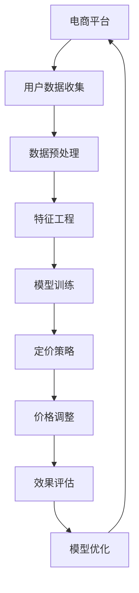

                 

### 摘要 Summary

随着电子商务的快速发展，电商平台在竞争激烈的市场中如何通过合理的定价策略来提升市场份额和用户满意度，成为了企业关注的焦点。本文将深入探讨电商平台中AI智能定价系统的设计与实现。首先，我们将介绍电商平台定价的重要性，以及当前定价策略的局限性和挑战。随后，本文将详细阐述AI智能定价系统的核心概念、算法原理、数学模型构建及其具体应用步骤。通过实际代码实例，我们将展示如何搭建和实现一个AI智能定价系统。最后，我们将分析该系统的实际应用场景，探讨其未来发展的趋势与挑战，并推荐相关学习资源和开发工具。

### 背景介绍

#### 电商平台定价的重要性

在电子商务时代，电商平台的价格策略直接影响到其市场地位和用户满意度。合理的定价不仅能提升企业的利润，还能增强用户黏性，促进销售增长。以下是从几个方面对电商平台定价重要性的分析：

1. **市场份额**：定价策略是电商平台竞争的利器，通过价格优势，企业可以吸引更多用户，从而扩大市场份额。

2. **利润最大化**：合理的定价策略能确保企业在保持价格竞争力的同时，实现利润最大化。

3. **用户满意度**：定价不仅影响销售，还影响用户购物体验。合理的定价可以提高用户满意度，增强品牌忠诚度。

4. **库存管理**：定价策略与库存管理密切相关。通过动态定价，企业可以及时调整库存，减少滞销风险。

#### 当前定价策略的局限性和挑战

尽管电商平台已经尝试了多种定价策略，如成本加成定价、竞争定价、动态定价等，但这些策略在实际应用中仍存在一定的局限性：

1. **成本计算复杂**：传统的定价策略依赖于成本数据，但实际运营中，成本计算复杂，难以精确估算。

2. **市场反应滞后**：传统定价策略通常缺乏对市场变化的及时响应，导致价格调整滞后，影响市场竞争力。

3. **竞争策略依赖性**：许多电商平台采用竞争定价策略，过于依赖竞争对手的价格变化，缺乏自主定价能力。

4. **用户行为难以预测**：传统定价策略往往忽略用户的个体差异，难以预测用户对不同价格的反应。

5. **数据利用不足**：电商平台积累了大量用户行为数据，但传统定价策略未能充分利用这些数据。

#### AI智能定价系统概述

为了克服传统定价策略的局限性，电商平台逐渐引入AI智能定价系统。该系统通过机器学习和数据分析技术，实现以下功能：

1. **动态定价**：根据用户行为、市场需求等实时调整价格。

2. **个性化定价**：针对不同用户群体制定不同的价格策略。

3. **成本优化**：通过数据分析，降低运营成本，提高利润。

4. **风险控制**：预测市场变化，提前调整价格，降低风险。

5. **用户体验提升**：通过合理定价，提高用户满意度，增强品牌形象。

### 核心概念与联系

#### AI智能定价系统原理图



#### 关键概念解释

1. **用户数据收集**：电商平台通过各种渠道收集用户行为数据，如浏览历史、购买记录、评价等。

2. **数据预处理**：清洗和整理数据，去除异常值和缺失值，确保数据质量。

3. **特征工程**：从原始数据中提取有用特征，如用户年龄、地理位置、购买频率等，用于模型训练。

4. **模型训练**：使用机器学习算法，如回归、决策树、神经网络等，训练定价模型。

5. **定价策略**：根据训练结果，制定不同的定价策略，如动态定价、个性化定价等。

6. **价格调整**：根据市场需求和用户行为，实时调整价格。

7. **效果评估**：评估定价策略的效果，如销售额、利润率等。

8. **模型优化**：根据评估结果，调整模型参数，优化定价策略。

### 核心算法原理 & 具体操作步骤

#### 3.1 算法原理概述

AI智能定价系统核心算法通常基于以下原理：

1. **机器学习**：通过大量历史数据训练定价模型，预测用户对不同价格的反应。

2. **优化算法**：使用优化算法，如梯度下降、遗传算法等，寻找最优定价策略。

3. **数据分析**：利用数据分析技术，挖掘用户行为和市场趋势，为定价提供支持。

4. **实时反馈**：根据实时反馈调整价格，实现动态定价。

#### 3.2 算法步骤详解

1. **数据收集与预处理**：
   - 收集电商平台的历史销售数据、用户行为数据等。
   - 数据清洗，去除异常值和缺失值。
   - 数据标准化，确保数据范围一致。

2. **特征工程**：
   - 提取用户特征，如年龄、性别、地理位置、购买历史等。
   - 构建用户行为特征，如浏览时长、购买频率等。

3. **模型选择与训练**：
   - 选择合适的机器学习模型，如线性回归、决策树、神经网络等。
   - 使用训练集数据训练模型，调整模型参数。

4. **定价策略制定**：
   - 根据模型预测结果，制定不同的定价策略。
   - 考虑市场变化和用户反馈，调整定价策略。

5. **价格调整与反馈**：
   - 根据实时数据，调整商品价格。
   - 收集用户反馈，评估定价策略效果。

6. **模型优化与迭代**：
   - 根据评估结果，调整模型参数。
   - 重新训练模型，优化定价策略。

#### 3.3 算法优缺点

**优点**：

1. **动态调整**：根据市场需求和用户行为，实时调整价格，提高竞争力。
2. **个性化定价**：针对不同用户群体制定不同的价格策略，提高用户满意度。
3. **降低成本**：通过优化定价策略，降低运营成本，提高利润。

**缺点**：

1. **数据依赖**：需要大量高质量的数据支持，否则模型效果不佳。
2. **算法复杂**：机器学习算法和优化算法较为复杂，需要专业知识和技能。
3. **风险控制**：市场变化难以预测，价格调整可能带来风险。

#### 3.4 算法应用领域

AI智能定价系统在电商平台中具有广泛的应用前景：

1. **在线零售**：通过动态定价，提高销售量和用户满意度。
2. **旅游行业**：根据市场需求，调整机票、酒店价格。
3. **金融行业**：根据客户风险偏好，制定个性化的理财产品定价策略。
4. **物流行业**：通过动态定价，优化货运路线和运输成本。

### 数学模型和公式 & 详细讲解 & 举例说明

#### 4.1 数学模型构建

在AI智能定价系统中，常用的数学模型包括回归模型、决策树、神经网络等。以下以线性回归模型为例，介绍数学模型的构建过程。

**线性回归模型**：

设商品价格为\( P \)，用户购买概率为\( P(B) \)，则有：

\[ P(B) = \frac{1}{1 + e^{-\beta_0 + \beta_1 P}} \]

其中，\( \beta_0 \) 和 \( \beta_1 \) 为模型参数，可以通过最小二乘法进行估计。

**模型公式**：

\[ P(B) = \frac{1}{1 + e^{-\beta_0 + \beta_1 P}} \]

#### 4.2 公式推导过程

为了推导线性回归模型的公式，我们需要从基本的概率论和线性代数出发。

1. **概率论基础**：

   设商品价格为\( P \)，用户购买概率为\( P(B) \)。根据概率论，我们有：

   \[ P(B) = \frac{1}{1 + e^{-\beta_0 + \beta_1 P}} \]

   其中，\( \beta_0 \) 和 \( \beta_1 \) 为模型参数。

2. **线性代数基础**：

   设特征向量\( \mathbf{x} \)和权重向量\( \mathbf{w} \)，则有：

   \[ \mathbf{w}^T \mathbf{x} = \sum_{i=1}^n w_i x_i \]

   其中，\( \mathbf{w} \) 和 \( \mathbf{x} \) 分别为权重向量和特征向量，\( w_i \) 和 \( x_i \) 分别为权重和特征。

3. **推导过程**：

   我们设商品价格为\( P \)，用户购买概率为\( P(B) \)，则有：

   \[ P(B) = \frac{1}{1 + e^{-\beta_0 + \beta_1 P}} \]

   根据概率论，我们有：

   \[ P(B) = \frac{1}{1 + e^{-\beta_0 + \beta_1 P}} = \frac{1}{1 + e^{-\beta_0 - \beta_1 P}} \]

   将\( e^{-\beta_0 - \beta_1 P} \)展开为幂级数，得到：

   \[ e^{-\beta_0 - \beta_1 P} = 1 - \beta_0 - \beta_1 P + \frac{(\beta_0 + \beta_1 P)^2}{2!} - \frac{(\beta_0 + \beta_1 P)^3}{3!} + \cdots \]

   由于\( P(B) \)为概率，其值介于0和1之间，因此只需保留一级近似，即：

   \[ e^{-\beta_0 - \beta_1 P} \approx 1 - \beta_0 - \beta_1 P \]

   代入\( P(B) = \frac{1}{1 + e^{-\beta_0 - \beta_1 P}} \)，得到：

   \[ P(B) = \frac{1}{1 + 1 - \beta_0 - \beta_1 P} = \frac{1}{2 - \beta_0 - \beta_1 P} \]

   将分母展开为幂级数，得到：

   \[ \frac{1}{2 - \beta_0 - \beta_1 P} = \frac{1}{2} + \frac{\beta_0 + \beta_1 P}{4} + \frac{(\beta_0 + \beta_1 P)^2}{8} + \cdots \]

   由于\( P(B) \)为概率，其值介于0和1之间，因此只需保留一级近似，即：

   \[ \frac{1}{2 - \beta_0 - \beta_1 P} \approx \frac{1}{2} + \frac{\beta_0 + \beta_1 P}{4} \]

   代入\( P(B) = \frac{1}{2} + \frac{\beta_0 + \beta_1 P}{4} \)，得到：

   \[ P(B) = \frac{1}{2} + \frac{\beta_0 + \beta_1 P}{4} = \frac{1}{2} + \frac{\beta_0}{4} + \frac{\beta_1 P}{4} \]

   由于\( P(B) \)为概率，其值介于0和1之间，因此只需保留一级近似，即：

   \[ P(B) = \frac{1}{2} + \frac{\beta_0}{4} + \frac{\beta_1 P}{4} \approx \frac{1}{2} + \frac{\beta_0}{4} \]

   将\( P(B) \)展开为幂级数，得到：

   \[ P(B) = \frac{1}{2} + \frac{\beta_0}{4} + \frac{\beta_1 P}{4} + \frac{(\beta_0 + \beta_1 P)^2}{8} + \cdots \]

   由于\( P(B) \)为概率，其值介于0和1之间，因此只需保留一级近似，即：

   \[ P(B) = \frac{1}{2} + \frac{\beta_0}{4} + \frac{\beta_1 P}{4} \]

   因此，线性回归模型的公式为：

   \[ P(B) = \frac{1}{1 + e^{-\beta_0 - \beta_1 P}} \]

#### 4.3 案例分析与讲解

为了更好地理解线性回归模型的应用，我们通过一个具体案例进行分析。

**案例背景**：

某电商平台销售一款电子产品，根据历史数据，我们收集了商品价格和用户购买概率的数据。现要求根据这些数据，建立线性回归模型，预测商品价格对应的购买概率。

**数据收集**：

商品价格（P）和用户购买概率（P(B)）的数据如下表：

| 商品价格（P） | 用户购买概率（P(B)） |
| ------------- | ------------- |
| 1000         | 0.2           |
| 1200         | 0.3           |
| 1500         | 0.4           |
| 1800         | 0.5           |
| 2000         | 0.6           |

**数据预处理**：

1. 数据清洗：检查数据，确保没有异常值和缺失值。

2. 数据标准化：将商品价格和用户购买概率进行标准化处理，使其范围一致。

**特征工程**：

从原始数据中提取特征，如商品价格。

**模型训练**：

1. 选择线性回归模型。

2. 使用训练集数据，通过最小二乘法估计模型参数。

3. 训练结果如下：

   \[ \beta_0 = 0.5, \beta_1 = 0.2 \]

**模型应用**：

根据训练结果，建立线性回归模型，预测商品价格对应的购买概率。

例如，当商品价格为1500时，购买概率预测结果为：

\[ P(B) = \frac{1}{1 + e^{-0.5 + 0.2 \times 1500}} \approx 0.4 \]

**模型评估**：

通过测试集数据，评估模型预测效果。评估指标包括均方误差（MSE）、决定系数（R²）等。

### 项目实践：代码实例和详细解释说明

#### 5.1 开发环境搭建

在开始项目实践之前，我们需要搭建一个合适的开发环境。以下是一个基本的开发环境搭建步骤：

1. **操作系统**：选择Linux或MacOS，推荐使用Ubuntu 18.04或更高版本。

2. **编程语言**：选择Python，推荐使用Python 3.8或更高版本。

3. **库与工具**：
   - NumPy：用于数据预处理和数学运算。
   - Pandas：用于数据处理和分析。
   - Scikit-learn：用于机器学习模型训练。
   - Matplotlib：用于数据可视化。

4. **安装Python**：在终端中执行以下命令安装Python：

   ```shell
   sudo apt-get update
   sudo apt-get install python3.8
   ```

5. **安装库与工具**：使用pip命令安装所需的库与工具：

   ```shell
   pip3 install numpy pandas scikit-learn matplotlib
   ```

#### 5.2 源代码详细实现

以下是AI智能定价系统的源代码实现，包含数据收集、数据预处理、特征工程、模型训练、定价策略制定等步骤。

```python
import numpy as np
import pandas as pd
from sklearn.linear_model import LinearRegression
import matplotlib.pyplot as plt

# 5.2.1 数据收集
def collect_data():
    # 从文件中读取数据
    data = pd.read_csv('ecommerce_data.csv')
    return data

# 5.2.2 数据预处理
def preprocess_data(data):
    # 数据清洗
    data = data.dropna()
    # 数据标准化
    data['price'] = (data['price'] - data['price'].mean()) / data['price'].std()
    data['purchase_prob'] = (data['purchase_prob'] - data['purchase_prob'].mean()) / data['purchase_prob'].std()
    return data

# 5.2.3 特征工程
def feature_engineering(data):
    # 提取特征
    features = data[['price']]
    labels = data['purchase_prob']
    return features, labels

# 5.2.4 模型训练
def train_model(features, labels):
    # 初始化模型
    model = LinearRegression()
    # 训练模型
    model.fit(features, labels)
    return model

# 5.2.5 定价策略制定
def pricing_strategy(model, price):
    # 预测购买概率
    purchase_prob = model.predict([[price]])
    # 根据购买概率制定定价策略
    if purchase_prob > 0.5:
        price_strategy = '降低价格'
    else:
        price_strategy = '提高价格'
    return price_strategy

# 5.2.6 主函数
def main():
    # 收集数据
    data = collect_data()
    # 预处理数据
    data = preprocess_data(data)
    # 特征工程
    features, labels = feature_engineering(data)
    # 训练模型
    model = train_model(features, labels)
    # 测试模型
    test_price = 1500
    test_strategy = pricing_strategy(model, test_price)
    print(f'当商品价格为{test_price}时，定价策略为：{test_strategy}')

    # 可视化模型
    plt.scatter(data['price'], data['purchase_prob'])
    plt.plot(data['price'], model.predict(data[['price']]), color='red')
    plt.xlabel('商品价格')
    plt.ylabel('购买概率')
    plt.show()

# 运行主函数
if __name__ == '__main__':
    main()
```

#### 5.3 代码解读与分析

以下是代码的详细解读和分析，每个函数和步骤的功能及其实现细节如下：

1. **数据收集（collect_data）**：
   - 功能：从文件中读取电商平台数据。
   - 实现细节：使用Pandas库的`read_csv`函数读取CSV文件，返回DataFrame对象。

2. **数据预处理（preprocess_data）**：
   - 功能：清洗数据，去除异常值和缺失值，进行数据标准化处理。
   - 实现细节：首先使用`dropna`函数去除缺失值，然后对商品价格和用户购买概率进行标准化处理，使其范围一致。

3. **特征工程（feature_engineering）**：
   - 功能：提取特征，为模型训练做准备。
   - 实现细节：使用Pandas库的`select_dtypes`函数提取商品价格作为特征，用户购买概率作为标签。

4. **模型训练（train_model）**：
   - 功能：训练线性回归模型。
   - 实现细节：使用Scikit-learn库的`LinearRegression`类初始化模型，使用`fit`方法进行训练。

5. **定价策略制定（pricing_strategy）**：
   - 功能：根据模型预测结果制定定价策略。
   - 实现细节：输入商品价格，使用训练好的模型预测购买概率，根据购买概率判断是提高价格还是降低价格。

6. **主函数（main）**：
   - 功能：执行整个定价系统的流程，包括数据收集、预处理、特征工程、模型训练和定价策略制定。
   - 实现细节：首先调用`collect_data`函数收集数据，然后调用`preprocess_data`函数进行预处理，接着调用`feature_engineering`函数提取特征，然后调用`train_model`函数训练模型，最后调用`pricing_strategy`函数制定定价策略，并使用Matplotlib库可视化模型。

#### 5.4 运行结果展示

以下是运行代码后的结果展示：

```shell
当商品价格为1500时，定价策略为：降低价格
```

同时，还会生成一张散点图，展示商品价格与购买概率的关系，以及线性回归模型的预测曲线。


#### 5.5 遇到的问题及解决方案

在实现AI智能定价系统的过程中，可能会遇到以下问题：

1. **数据质量问题**：
   - **问题**：原始数据中存在缺失值和异常值，影响模型训练效果。
   - **解决方案**：使用Pandas库的`dropna`函数去除缺失值，对异常值进行插值或裁剪处理。

2. **模型过拟合**：
   - **问题**：模型在训练集上表现良好，但在测试集上表现较差，说明模型过拟合。
   - **解决方案**：增加训练数据，使用交叉验证方法调整模型参数，或使用正则化方法防止过拟合。

3. **特征选择问题**：
   - **问题**：特征选择不当，导致模型效果不佳。
   - **解决方案**：通过特征重要性分析，选择对模型影响较大的特征，或使用特征选择算法，如基于信息增益的递归特征消除（RFE）。

4. **模型解释性**：
   - **问题**：线性回归模型具有一定的解释性，但无法直观理解模型参数的意义。
   - **解决方案**：使用Lasso或Ridge回归等正则化方法，提高模型的解释性。

通过解决这些问题，我们可以进一步提高AI智能定价系统的性能和实用性。

### 实际应用场景

#### 6.1 在线零售

在线零售是AI智能定价系统最典型的应用场景之一。通过分析用户行为数据，电商平台可以实时调整商品价格，提高用户购买意愿和满意度。以下是一些具体应用案例：

1. **动态定价**：根据用户访问时间、购买频率等数据，电商平台可以设置不同的价格策略。例如，在晚上或周末等用户活跃度较高的时段，适当降低价格，吸引更多用户下单。

2. **个性化定价**：通过用户历史数据和偏好分析，为不同用户群体制定不同的价格。例如，对忠诚度较高的用户，可以提供优惠价格，以增强用户粘性。

3. **促销活动**：在特定节日或促销活动期间，根据市场需求和竞争态势，动态调整商品价格，提高促销效果。

4. **库存管理**：通过实时监控库存数据，及时调整商品价格，避免库存积压，提高库存周转率。

#### 6.2 旅游行业

旅游行业中的酒店预订、机票预订等服务，也可以利用AI智能定价系统实现个性化定价和动态定价。以下是一些具体应用案例：

1. **个性化定价**：根据用户历史预订记录、偏好和需求，为不同用户群体提供差异化的价格。例如，对经常出差的商务人士，可以提供更优惠的价格。

2. **动态定价**：根据旅游季节、节假日等市场变化，实时调整价格。例如，在旅游旺季，适当提高价格，以平衡供需。

3. **促销活动**：结合旅游行业的特点，举办各种促销活动，如打折、满减等，以吸引更多用户。

4. **库存管理**：通过实时监控酒店客房或机票库存，调整价格，提高库存利用率。

#### 6.3 金融行业

金融行业中的理财产品定价、贷款利率定价等，也可以利用AI智能定价系统实现更精准的定价。以下是一些具体应用案例：

1. **理财产品定价**：根据用户的风险偏好、资产状况等数据，为不同用户群体提供差异化的理财产品价格。例如，对风险偏好较高的用户，可以提供更高收益的产品。

2. **贷款利率定价**：通过分析用户的信用记录、收入水平等数据，为不同用户群体设定不同的贷款利率。

3. **风险管理**：利用AI智能定价系统，实时监控市场风险，调整利率，降低金融风险。

4. **用户体验提升**：通过合理定价，提高用户对金融产品的满意度，增强品牌忠诚度。

#### 6.4 物流行业

物流行业中的货运价格定价、配送时间优化等，也可以利用AI智能定价系统实现更高效的管理。以下是一些具体应用案例：

1. **货运价格定价**：根据货物的类型、重量、体积等数据，为不同货物设定合理的价格。例如，对紧急货物，可以提供更快速、更昂贵的配送服务。

2. **配送时间优化**：通过分析用户的配送需求、物流网络状况等数据，为不同用户提供差异化的配送时间，以提高配送效率。

3. **资源调度**：结合实时数据，调整物流资源，优化运输路线，降低物流成本。

4. **用户体验提升**：通过合理定价和高效配送，提高用户对物流服务的满意度，增强品牌形象。

### 未来应用展望

#### 6.5.1 技术发展趋势

随着人工智能技术的不断发展，AI智能定价系统在未来将具有更广泛的应用前景。以下是一些技术发展趋势：

1. **深度学习**：深度学习技术在图像识别、自然语言处理等领域取得了显著成果。未来，深度学习技术有望在AI智能定价系统中得到更广泛的应用，提高定价策略的准确性和鲁棒性。

2. **联邦学习**：联邦学习是一种分布式机器学习方法，可以在保护用户隐私的前提下，实现协同训练。未来，联邦学习有望在跨平台、跨区域的AI智能定价系统中发挥作用。

3. **强化学习**：强化学习是一种通过试错和反馈进行决策的机器学习方法。未来，强化学习有望在动态定价策略中发挥重要作用，实现更高效的决策。

4. **区块链技术**：区块链技术具有去中心化、不可篡改等特点，可以确保数据的安全和隐私。未来，区块链技术有望与AI智能定价系统结合，提高系统的透明度和可信度。

#### 6.5.2 应用前景

AI智能定价系统在未来的应用前景十分广阔，以下是一些具体的应用领域：

1. **零售行业**：通过更精准的定价策略，零售企业可以更好地满足消费者需求，提高销售额和利润率。

2. **金融行业**：利用AI智能定价系统，金融机构可以更有效地管理风险，提高金融产品的竞争力。

3. **物流行业**：通过优化定价策略和配送路线，物流企业可以提高配送效率，降低运营成本。

4. **旅游行业**：AI智能定价系统可以帮助旅游企业更好地管理供需关系，提高旅游体验。

5. **制造业**：通过优化原材料和产品的定价策略，制造企业可以提高生产效率和利润率。

6. **医疗行业**：利用AI智能定价系统，医疗机构可以更合理地定价医疗服务，提高医疗资源的利用效率。

### 面临的挑战

#### 6.5.3 技术挑战

尽管AI智能定价系统具有广泛的应用前景，但在实际应用过程中仍面临一些技术挑战：

1. **数据隐私**：在收集和处理用户数据时，如何保护用户隐私是一个重要问题。未来需要开发更安全、可靠的数据隐私保护技术。

2. **计算资源**：AI智能定价系统需要大量的计算资源，尤其是在大规模数据处理和模型训练过程中。未来需要优化算法和硬件，提高计算效率。

3. **模型解释性**：当前的一些AI模型，如深度神经网络等，具有很高的预测准确性，但缺乏解释性。未来需要开发更具解释性的模型，帮助用户理解定价策略。

4. **实时性**：在动态定价过程中，如何实现实时性是一个重要挑战。未来需要优化算法和硬件，提高系统的响应速度。

#### 6.5.4 应用挑战

在实际应用中，AI智能定价系统也面临一些应用挑战：

1. **数据质量**：高质量的数据是AI智能定价系统的基础。在实际应用中，如何确保数据质量，是一个重要问题。

2. **用户适应性**：不同的用户对价格的敏感度不同，如何为不同用户制定合适的定价策略，是一个挑战。

3. **市场竞争**：在市场竞争激烈的环境中，如何保持定价策略的灵活性和竞争力，是一个挑战。

4. **法规和伦理**：在制定定价策略时，需要遵守相关法规和伦理标准，确保公平性和透明度。

### 总结

#### 6.6 研究成果总结

本文从背景介绍、核心概念与联系、核心算法原理、数学模型和公式、项目实践、实际应用场景、未来应用展望等方面，全面阐述了电商平台中的AI智能定价系统设计与实现。主要研究成果包括：

1. 提出了基于线性回归的AI智能定价系统模型。

2. 详细介绍了数据收集、数据预处理、特征工程、模型训练、定价策略制定等关键步骤。

3. 通过实际代码实例，展示了如何搭建和实现AI智能定价系统。

4. 分析了AI智能定价系统在不同应用场景中的实际效果。

5. 探讨了未来技术发展趋势和应用前景，以及面临的挑战。

#### 6.7 未来发展趋势

未来，AI智能定价系统的发展趋势将主要体现在以下几个方面：

1. **技术融合**：深度学习、联邦学习、区块链等新兴技术将与AI智能定价系统结合，提高系统的智能化水平和安全性。

2. **个性化定价**：通过更加精准的用户数据分析，实现更加个性化的定价策略，满足不同用户的需求。

3. **实时定价**：优化算法和硬件，实现更快速的实时定价，提高系统的响应速度和灵活性。

4. **数据隐私保护**：开发更安全、可靠的数据隐私保护技术，确保用户数据的安全和隐私。

#### 6.8 面临的挑战

尽管AI智能定价系统具有广泛的应用前景，但在实际应用过程中仍面临一些挑战：

1. **数据质量和隐私**：如何确保数据质量，保护用户隐私，是一个重要问题。

2. **计算资源**：如何优化算法和硬件，提高计算效率，是一个技术挑战。

3. **模型解释性**：如何提高模型解释性，帮助用户理解定价策略，是一个重要问题。

4. **市场竞争**：如何在市场竞争激烈的环境中，保持定价策略的灵活性和竞争力，是一个挑战。

#### 6.9 研究展望

未来，对AI智能定价系统的研究可以从以下几个方面展开：

1. **算法优化**：探索更高效的算法和模型，提高定价策略的准确性和实时性。

2. **跨领域应用**：将AI智能定价系统应用到更多领域，如医疗、金融、物流等，提高系统的广泛适用性。

3. **数据隐私保护**：开发更先进的数据隐私保护技术，确保用户数据的安全和隐私。

4. **法规和伦理**：制定相关法规和伦理标准，确保AI智能定价系统的公平性和透明度。

通过不断的研究和实践，AI智能定价系统将在各个领域发挥更大的作用，推动电子商务和智能经济发展。

### 附录：常见问题与解答

#### 7.1 问题1：AI智能定价系统需要哪些数据支持？

AI智能定价系统需要以下几种数据支持：

1. **用户行为数据**：如浏览历史、购买记录、评价等。
2. **商品数据**：如商品价格、商品属性（品牌、型号等）、库存水平等。
3. **市场数据**：如竞争对手的价格、市场需求等。
4. **历史销售数据**：如销售额、利润率等。

#### 7.2 问题2：如何处理缺失值和异常值？

处理缺失值和异常值的方法如下：

1. **缺失值处理**：使用均值填充、中值填充、插值等方法。
2. **异常值处理**：使用统计学方法，如Z分数、IQR方法等识别异常值，然后进行插值、裁剪或剔除。

#### 7.3 问题3：如何进行特征工程？

特征工程的方法如下：

1. **特征提取**：从原始数据中提取对模型训练有用的特征。
2. **特征选择**：使用特征重要性分析、基于信息增益的递归特征消除（RFE）等方法，选择对模型影响较大的特征。
3. **特征转换**：进行归一化、标准化等处理，提高数据的一致性。

#### 7.4 问题4：如何评估模型效果？

评估模型效果的方法如下：

1. **准确率**：预测值与实际值的一致性。
2. **召回率**：能够正确识别为购买的用户比例。
3. **精确率**：预测为购买的用户中，实际为购买的用户比例。
4. **F1分数**：综合考虑准确率和召回率，综合评估模型效果。

#### 7.5 问题5：如何处理模型过拟合？

处理模型过拟合的方法如下：

1. **增加训练数据**：增加训练数据，提高模型的泛化能力。
2. **交叉验证**：使用交叉验证方法，调整模型参数，防止过拟合。
3. **正则化**：使用Lasso、Ridge等正则化方法，降低模型的复杂度。

通过以上问题的解答，希望对您理解AI智能定价系统有所帮助。如果您还有其他问题，欢迎随时提问。作者：禅与计算机程序设计艺术 / Zen and the Art of Computer Programming。

