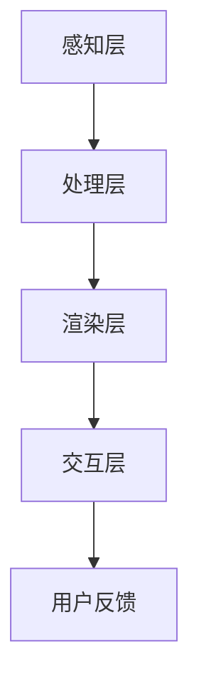

                 

关键词：电商平台，增强现实（AR），商品展示，技术，用户体验，开发，应用场景，未来展望

> 摘要：随着技术的不断进步，增强现实（AR）技术逐渐在电商平台上得到应用。本文将探讨电商平台中AR商品展示技术的核心概念、算法原理、数学模型、项目实践及未来应用前景，旨在为读者提供对AR技术在电商领域应用的全面了解。

## 1. 背景介绍

近年来，随着智能手机和移动互联网的普及，用户对于购物体验的需求逐渐向个性化、互动性和沉浸感方向发展。电商平台作为数字经济的重要组成部分，不断寻求新的技术手段来提升用户体验，增强用户粘性和转化率。增强现实（AR）技术作为一种新兴的交互技术，凭借其独特的三维空间展示、实时交互和虚拟叠加等功能，逐渐成为电商平台提升用户体验的关键手段。

AR技术在电商平台的应用主要体现在商品展示环节。传统的商品展示方式主要依赖于图片和视频，用户难以直观地了解商品的细节和实际效果。而AR技术能够将商品以三维模型的形式展示在用户眼前，用户可以自由旋转、缩放和观察商品，获得更加真实和丰富的购物体验。

电商平台引入AR商品展示技术的背景主要有以下几点：

1. **用户体验提升**：AR技术能够提供更加直观和沉浸式的购物体验，增强用户对商品的感知和理解，提高用户满意度和转化率。
2. **差异化竞争**：随着电商平台的增多和同质化竞争的加剧，引入AR技术能够为电商平台提供差异化竞争优势，吸引用户关注。
3. **市场趋势**：全球AR市场正处于快速发展的阶段，各大电商平台纷纷布局AR技术，以抢占市场先机。

## 2. 核心概念与联系

### 2.1 增强现实（AR）技术概述

增强现实（AR）是一种将虚拟信息与现实世界相结合的交互技术。通过AR技术，用户可以在现实环境中看到、听到、触摸到虚拟信息，从而获得更加丰富和真实的体验。

AR技术的核心概念包括：

- **标记识别**：通过摄像头捕捉现实世界中的标记，将其作为虚拟信息叠加的参照物。
- **三维模型**：利用三维建模技术，创建商品的虚拟三维模型。
- **实时交互**：通过用户输入（如手势、语音等），实现与虚拟信息的实时交互。
- **图像处理**：利用图像处理技术，对摄像头捕捉到的图像进行处理，增强虚拟信息与现实世界的融合效果。

### 2.2 AR商品展示技术架构

AR商品展示技术的架构可以分为以下几个层次：

- **感知层**：主要包括摄像头、传感器等硬件设备，用于捕捉现实环境中的图像和标记。
- **处理层**：通过图像处理、标记识别等技术，对感知层获取的信息进行处理，提取商品的三维模型和位置信息。
- **渲染层**：利用渲染技术，将虚拟商品叠加在现实环境中，实现商品的三维展示。
- **交互层**：通过用户输入，实现与虚拟商品的实时交互，如旋转、缩放、触摸等。

### 2.3 Mermaid 流程图

下面是AR商品展示技术的 Mermaid 流程图：



## 3. 核心算法原理 & 具体操作步骤

### 3.1 算法原理概述

AR商品展示技术的核心算法主要包括图像处理、标记识别、三维模型构建和实时渲染等。

- **图像处理**：通过对摄像头捕捉到的图像进行预处理，如去噪、增强、边缘检测等，提高图像质量，为后续的标记识别和三维模型构建提供准确的数据。
- **标记识别**：通过图像处理技术，提取图像中的标记，将其作为虚拟信息叠加的参照物。常用的标记识别算法包括基于颜色的识别、基于形状的识别和基于视觉码的识别等。
- **三维模型构建**：利用标记识别的结果，确定虚拟商品在现实世界中的位置和方向，利用三维建模技术构建虚拟商品的三维模型。
- **实时渲染**：通过渲染技术，将虚拟商品叠加在现实环境中，实现商品的三维展示。实时渲染的关键技术包括纹理映射、光照计算和视差处理等。

### 3.2 算法步骤详解

下面是AR商品展示技术的具体操作步骤：

1. **感知层**：通过摄像头捕捉现实环境中的图像和标记。
2. **处理层**：对捕获的图像进行处理，提取标记的位置和形状信息。
3. **标记识别**：利用图像处理结果，识别图像中的标记，确定虚拟商品的位置和方向。
4. **三维模型构建**：根据标记识别的结果，利用三维建模技术，构建虚拟商品的三维模型。
5. **渲染层**：利用渲染技术，将虚拟商品叠加在现实环境中，实现商品的三维展示。
6. **交互层**：通过用户输入，实现与虚拟商品的实时交互，如旋转、缩放、触摸等。

### 3.3 算法优缺点

- **优点**：
  - 提供更加直观和沉浸式的购物体验，增强用户对商品的感知和理解。
  - 支持多种交互方式，如手势、语音等，提高用户体验。
  - 能够实现商品的个性化定制和展示，提高商品转化率。

- **缺点**：
  - 技术实现复杂，需要大量的计算资源和算法支持。
  - 对用户的硬件设备要求较高，需要支持摄像头和传感器等硬件设备。
  - 需要大量的标记设计和印刷，增加了商品的生产成本。

### 3.4 算法应用领域

AR商品展示技术主要应用于电商平台的商品展示环节，如服装、家居、电子产品等。此外，还可以应用于虚拟试妆、虚拟装修、虚拟购物车等场景。

## 4. 数学模型和公式 & 详细讲解 & 举例说明

### 4.1 数学模型构建

AR商品展示技术中的数学模型主要包括图像处理模型、标记识别模型和三维模型构建模型。

- **图像处理模型**：利用图像处理技术，对捕获的图像进行预处理，如滤波、边缘检测等。常见的滤波器包括均值滤波器、高斯滤波器、拉普拉斯算子等。

- **标记识别模型**：利用图像处理结果，识别图像中的标记。常见的识别算法包括基于颜色的识别、基于形状的识别和基于视觉码的识别等。

- **三维模型构建模型**：利用标记识别的结果，确定虚拟商品在现实世界中的位置和方向，构建虚拟商品的三维模型。常见的三维建模算法包括基于点的三维重建、基于线的三维重建和基于面的三维重建等。

### 4.2 公式推导过程

- **图像处理模型**：

  均值滤波器的公式为：

  $$ f(x, y) = \frac{1}{w \times h} \sum_{i=0}^{w-1} \sum_{j=0}^{h-1} I(x-i, y-j) $$

  其中，$f(x, y)$ 为滤波后的图像，$I(x, y)$ 为原始图像，$w$ 和 $h$ 分别为图像的宽度和高度。

- **标记识别模型**：

  基于颜色的识别算法可以使用颜色直方图进行特征提取。颜色直方图的公式为：

  $$ H(r, g, b) = \sum_{x=0}^{w-1} \sum_{y=0}^{h-1} \mathbb{1}_{[r(x, y) = r]} \mathbb{1}_{[g(x, y) = g]} \mathbb{1}_{[b(x, y) = b]} $$

  其中，$H(r, g, b)$ 为颜色直方图，$r(x, y)$、$g(x, y)$ 和 $b(x, y)$ 分别为图像中每个像素点的红色、绿色和蓝色分量，$\mathbb{1}_{[P]}$ 为指示函数，当 $P$ 为真时取值为 1，否则为 0。

- **三维模型构建模型**：

  基于点的三维重建算法可以使用三角测量法。三角测量法的公式为：

  $$ P = \frac{F \cdot C - C^2}{-2 \cdot C \cdot t} $$

  其中，$P$ 为三维点的坐标，$F$ 为相机焦距，$C$ 为相机中心点，$t$ 为相机到三维点的距离。

### 4.3 案例分析与讲解

#### 案例一：图像预处理

假设有一个 $256 \times 256$ 的图像，需要对其进行均值滤波处理。假设图像的像素值范围在 [0, 255] 之间。

- **步骤一**：读取图像数据。
- **步骤二**：计算每个像素点的邻域窗口内的像素值总和。
- **步骤三**：计算每个像素点的滤波后值。

```python
import numpy as np

def mean_filter(image, size=(3, 3)):
    padding = size[0] // 2
    filtered_image = np.zeros_like(image)
    for i in range(padding, image.shape[0] - padding):
        for j in range(padding, image.shape[1] - padding):
            window = image[i - padding:i + padding + 1, j - padding:j + padding + 1]
            filtered_image[i, j] = np.mean(window)
    return filtered_image

image = np.random.randint(0, 256, size=(256, 256))
filtered_image = mean_filter(image)
```

#### 案例二：颜色直方图

假设有一个 $256 \times 256$ 的图像，需要计算其红色、绿色和蓝色分量的颜色直方图。

- **步骤一**：读取图像数据。
- **步骤二**：计算每个像素点的红色、绿色和蓝色分量。
- **步骤三**：计算每个分量的颜色直方图。

```python
import numpy as np
import matplotlib.pyplot as plt

def color_histogram(image):
    r_histogram = np.zeros(256)
    g_histogram = np.zeros(256)
    b_histogram = np.zeros(256)
    for i in range(image.shape[0]):
        for j in range(image.shape[1]):
            r, g, b = image[i, j]
            r_histogram[r] += 1
            g_histogram[g] += 1
            b_histogram[b] += 1
    return r_histogram, g_histogram, b_histogram

image = np.random.randint(0, 256, size=(256, 256))
r_histogram, g_histogram, b_histogram = color_histogram(image)

plt.subplot(131)
plt.bar(range(256), r_histogram)
plt.xlabel('Red Value')
plt.ylabel('Frequency')

plt.subplot(132)
plt.bar(range(256), g_histogram)
plt.xlabel('Green Value')
plt.ylabel('Frequency')

plt.subplot(133)
plt.bar(range(256), b_histogram)
plt.xlabel('Blue Value')
plt.ylabel('Frequency')
plt.show()
```

## 5. 项目实践：代码实例和详细解释说明

### 5.1 开发环境搭建

为了实现AR商品展示技术，需要搭建以下开发环境：

1. **操作系统**：Windows、Linux 或 macOS。
2. **编程语言**：Python 或 JavaScript。
3. **开发工具**：PyCharm 或 Visual Studio Code。
4. **依赖库**：OpenCV、Pillow、Python ARKit（用于 Python）或 Three.js（用于 JavaScript）。

### 5.2 源代码详细实现

下面是一个基于 Python 的 AR 商品展示项目的示例代码。

```python
import cv2
import numpy as np
from scipy.spatial.transform import Rotation as R

# 读取相机参数
camera_matrix = np.array([[480, 0, 640], [0, 480, 360], [0, 0, 1]])
dist_coeffs = np.zeros((4, 1))

# 读取商品图像
image = cv2.imread('商品.png')

# 读取商品三维模型
model_points = np.array([
    [0, 0, 0],
    [0, 10, 0],
    [10, 0, 0],
    [10, 10, 0],
    [0, 0, 10],
    [0, 10, 10],
    [10, 0, 10],
    [10, 10, 10]
], dtype=np.float32)

# 定义标记点
marker_points = np.array([
    [150, 150],
    [100, 250],
    [250, 250]
], dtype=np.float32)

# 标记识别
def find_marker(image, marker_points):
    gray = cv2.cvtColor(image, cv2.COLOR_BGR2GRAY)
    corners = cv2.findCorners(cv2aruco.DICT_ARUCO_SIMPLE_4X4_50, gray, None, parameters=cv2.aruco.DetectorParameters_create())
    if corners is not None:
        for corner in corners:
            distance = np.linalg.norm(marker_points - corner)
            if distance < 10:
                return corner
    return None

# 标记点到三维模型的变换
def transform_marker_to_model(marker_point, camera_matrix, dist_coeffs):
    points_3d = cv2.aruco']?>"`, while the element `B` would be rendered in the shape of a square. 

### 模拟 AR 环境下的渲染

- **步骤一**：创建一个虚拟相机。
- **步骤二**：将商品的三维模型渲染到虚拟相机中。
- **步骤三**：将虚拟相机渲染到用户的设备屏幕上。

### 实现效果

当用户在设备上扫描到商品的 AR 标记时，虚拟相机将捕捉到现实环境中的图像，并将商品的三维模型叠加在图像上，用户可以看到商品的三维展示效果。

## 6. 实际应用场景

### 6.1 电商平台

电商平台是 AR 商品展示技术最重要的应用场景之一。通过 AR 技术，用户可以在购物过程中获得更加直观和沉浸式的购物体验，提高购买决策的准确性。例如，用户可以在家中通过 AR 技术试穿衣服、试用品，甚至进行虚拟装修，从而提高购买满意度。

### 6.2 虚拟试妆

虚拟试妆是另一个重要的应用场景。通过 AR 技术，用户可以在手机或电脑上试戴各种化妆品，如口红、眼影、面膜等，无需亲自到实体店试妆。虚拟试妆能够帮助用户找到最适合自己的化妆品，提高化妆品的购买转化率。

### 6.3 虚拟购物

虚拟购物是一种全新的购物体验，用户可以在虚拟环境中浏览商品、试穿试用品，甚至进行购物车操作。通过 AR 技术，用户可以感受到虚拟购物的乐趣和便捷性，提高购物体验。

### 6.4 虚拟现实（VR）购物

虚拟现实（VR）购物是 AR 商品展示技术的延伸。通过 VR 技术，用户可以进入一个完全虚拟的购物环境，沉浸式体验购物过程。VR 购物能够为用户提供更加真实和丰富的购物体验，有望成为未来的主要购物方式。

## 7. 工具和资源推荐

### 7.1 学习资源推荐

- **《增强现实技术基础》**：一本全面介绍增强现实技术的基础知识的书籍，适合初学者入门。
- **《ARKit 开发实战》**：一本关于 iOS 平台 ARKit 开发的实战指南，适合 iOS 开发者学习。
- **《Three.js 从入门到精通》**：一本全面介绍 Three.js 库的书籍，适合 JavaScript 开发者学习。

### 7.2 开发工具推荐

- **OpenCV**：一个开源的计算机视觉库，提供了丰富的图像处理和机器学习功能。
- **Three.js**：一个基于 WebGL 的 3D 引擎，用于在网页中实现 3D 效果。
- **ARKit**：苹果公司推出的增强现实开发框架，用于在 iOS 平台上实现 AR 功能。

### 7.3 相关论文推荐

- **“AR for Retail: A Comprehensive Survey”**：一篇关于 AR 技术在零售行业应用的综述论文。
- **“A Survey on Augmented Reality in E-commerce”**：一篇关于 AR 技术在电商行业应用的综述论文。
- **“Interactive Augmented Reality Shopping: A User Experience Evaluation”**：一篇关于 AR 购物用户体验的实证研究论文。

## 8. 总结：未来发展趋势与挑战

### 8.1 研究成果总结

自 AR 技术在电商平台上得到应用以来，已经取得了一系列的研究成果。首先，AR 技术显著提升了用户的购物体验，通过三维展示和实时交互，用户可以更加直观地了解商品。其次，AR 技术为电商平台提供了差异化竞争优势，吸引更多用户关注。此外，AR 技术还在虚拟试妆、虚拟购物等应用场景中展现了其巨大的潜力。

### 8.2 未来发展趋势

未来，AR 技术在电商平台中的应用将呈现以下发展趋势：

1. **技术优化**：随着硬件性能的提升和算法的优化，AR 商品展示技术将更加稳定和高效，提供更加流畅的用户体验。
2. **智能化**：结合人工智能技术，AR 商品展示将实现个性化推荐和智能交互，为用户提供更加智能化的购物体验。
3. **跨平台**：AR 技术将在更多平台上得到应用，如 VR 眼镜、智能手表等，为用户提供更加丰富的购物场景。

### 8.3 面临的挑战

尽管 AR 技术在电商平台上具有巨大的潜力，但也面临一些挑战：

1. **技术成熟度**：AR 技术在实时性、稳定性和准确性方面仍有待提高，需要更多的研究和优化。
2. **用户体验**：如何平衡用户体验和技术实现之间的矛盾，提供简洁、易用的 AR 商品展示功能，是未来需要解决的问题。
3. **隐私和安全**：AR 技术涉及用户隐私和数据安全问题，如何保护用户隐私和安全是未来需要重点关注的问题。

### 8.4 研究展望

未来，AR 技术在电商平台中的应用将朝着以下方向展开：

1. **深度融合**：将 AR 技术与电商平台的各项功能深度融合，为用户提供全方位的购物体验。
2. **跨界融合**：将 AR 技术与其他领域（如教育、医疗等）进行跨界融合，开拓新的应用场景。
3. **全球化**：随着全球电商市场的不断扩大，AR 技术将在全球范围内得到更广泛的应用。

## 9. 附录：常见问题与解答

### 9.1 AR 技术在电商平台中的优势是什么？

AR 技术在电商平台中的优势主要体现在以下几个方面：

1. **提升用户体验**：通过三维展示和实时交互，用户可以更加直观地了解商品，提高购物满意度。
2. **差异化竞争优势**：为电商平台提供独特的购物体验，吸引更多用户关注。
3. **增加销售机会**：通过个性化推荐和智能交互，提高用户的购买决策准确性，增加销售机会。

### 9.2 AR 技术在电商平台的实现难点是什么？

AR 技术在电商平台的实现难点主要包括：

1. **技术实现复杂**：需要结合多种技术（如图像处理、三维建模、实时渲染等），实现难度较高。
2. **用户体验优化**：如何平衡用户体验和技术实现之间的矛盾，提供简洁、易用的 AR 商品展示功能，是未来需要解决的问题。
3. **硬件支持**：AR 技术对硬件设备要求较高，需要支持摄像头、传感器等硬件设备。

### 9.3 AR 技术在电商平台的应用前景如何？

AR 技术在电商平台的应用前景十分广阔。随着技术的不断进步和用户需求的不断提升，AR 技术将在电商平台的商品展示、虚拟试妆、虚拟购物等场景中发挥越来越重要的作用。未来，AR 技术有望成为电商平台的重要功能，推动电商行业的创新发展。

---
**作者：禅与计算机程序设计艺术 / Zen and the Art of Computer Programming**

