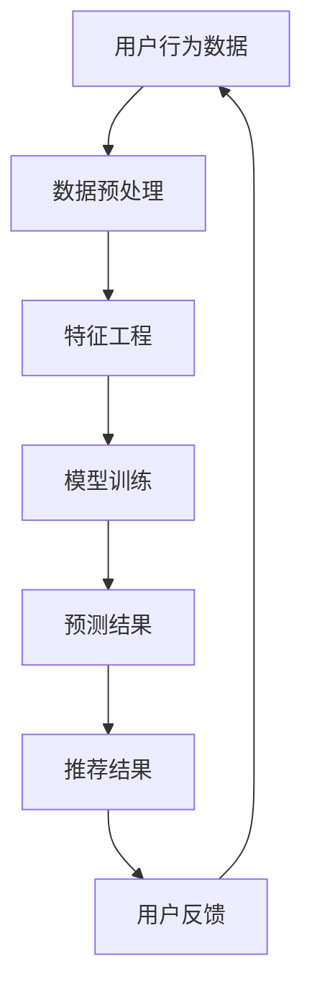

                 

关键词：电商平台，多任务推荐，人工智能，大模型，用户行为分析，个性化推荐，算法优化

> 摘要：本文深入探讨了电商平台中多任务推荐系统的原理、优势及实现方法。通过分析人工智能，特别是AI大模型在多任务推荐中的关键作用，本文旨在为电商平台的运营者提供技术指导，以优化用户体验，提升销售业绩。

## 1. 背景介绍

在当今数字化时代，电子商务已经成为人们日常生活中不可或缺的一部分。电商平台为了提高用户粘性、增加销售量，不断寻求创新的推荐技术。推荐系统在电商平台中的应用主要体现在个性化商品推荐、促销活动推荐、用户评论推荐等方面。然而，随着用户需求的多样化和复杂化，传统的单任务推荐系统已无法满足现代电商平台的需求。多任务推荐系统的出现为解决这一问题提供了新的思路。

多任务推荐系统是一种能够同时处理多个推荐任务的推荐系统。例如，在电商平台中，它不仅需要推荐用户可能喜欢的商品，还需要推荐合适的促销活动、优惠券以及相关的用户评论。这种系统能够综合考虑用户在不同场景下的需求，提供更加个性化的服务。

人工智能，尤其是AI大模型，在多任务推荐系统中发挥了至关重要的作用。AI大模型拥有强大的数据处理和模式识别能力，能够从海量数据中挖掘出用户行为和商品特征的潜在关系，从而提高推荐系统的准确性和效率。

## 2. 核心概念与联系

为了更好地理解多任务推荐系统的实现原理，我们首先需要明确几个核心概念：用户行为、商品特征、推荐算法和模型。

### 2.1 用户行为

用户行为是指用户在电商平台上的各种操作，包括浏览商品、添加购物车、购买商品、评价商品等。这些行为数据可以反映用户的兴趣偏好和购买习惯。

### 2.2 商品特征

商品特征包括商品的属性信息，如商品类别、价格、品牌、库存量等，以及商品的内容信息，如图像、描述、评分等。这些特征可以用于构建商品的用户特征表示。

### 2.3 推荐算法

推荐算法是多任务推荐系统的核心，它决定了如何从用户行为和商品特征中提取信息，并生成推荐结果。常见的推荐算法包括基于内容的推荐、协同过滤推荐、基于模型的推荐等。

### 2.4 模型

模型是指用于训练和预测的机器学习算法和神经网络结构。AI大模型通常使用深度学习技术，如卷积神经网络（CNN）、循环神经网络（RNN）、变压器（Transformer）等，以实现对大规模数据的复杂建模。

### 2.5 Mermaid 流程图

以下是一个简化的Mermaid流程图，展示了多任务推荐系统的主要组件和流程：



## 3. 核心算法原理 & 具体操作步骤

### 3.1 算法原理概述

多任务推荐系统的核心在于如何将用户行为数据、商品特征数据转化为推荐结果。AI大模型通过以下步骤实现这一目标：

1. 数据预处理：对用户行为数据和商品特征数据进行清洗、去噪、标准化等预处理操作。
2. 特征工程：从原始数据中提取有价值的信息，构建用户和商品的表征向量。
3. 模型训练：使用深度学习算法训练模型，学习用户行为和商品特征之间的复杂关系。
4. 预测与推荐：将新的用户行为数据输入模型，得到用户对不同商品的偏好度，从而生成推荐结果。
5. 用户反馈：收集用户对推荐结果的反馈，用于模型优化和迭代。

### 3.2 算法步骤详解

1. **数据预处理**：

   数据预处理是模型训练的基础。在这一步，我们需要对用户行为数据进行去重、去噪声、时间序列化等操作，以确保数据的质量。对于商品特征数据，我们需要进行数据清洗、填充缺失值、类别编码等操作。

   ```python
   # 示例代码：数据预处理
   df = pd.read_csv('user行为数据.csv')
   df.drop_duplicates(inplace=True)
   df.fillna(df.mean(), inplace=True)
   df['时间'] = pd.to_datetime(df['时间'])
   ```

2. **特征工程**：

   特征工程是将原始数据转化为能够有效表示用户和商品信息的表征向量的过程。在这一步，我们需要根据用户行为和商品特征，设计相应的特征提取方法。

   ```python
   # 示例代码：特征工程
   from sklearn.preprocessing import OneHotEncoder
   encoder = OneHotEncoder()
   user_features = encoder.fit_transform(df[['用户ID', '商品ID']])
   ```

3. **模型训练**：

   在模型训练阶段，我们选择合适的深度学习算法和神经网络结构，对特征数据进行训练。常见的算法包括卷积神经网络（CNN）、循环神经网络（RNN）和变压器（Transformer）。

   ```python
   # 示例代码：模型训练
   model = keras.Sequential([
       keras.layers.Dense(128, activation='relu', input_shape=(user_features.shape[1],)),
       keras.layers.Dense(64, activation='relu'),
       keras.layers.Dense(1, activation='sigmoid')
   ])
   model.compile(optimizer='adam', loss='binary_crossentropy', metrics=['accuracy'])
   model.fit(user_features, labels, epochs=10, batch_size=32)
   ```

4. **预测与推荐**：

   在预测阶段，我们将新的用户行为数据输入模型，得到用户对不同商品的偏好度。根据偏好度，我们可以为用户生成个性化的推荐列表。

   ```python
   # 示例代码：预测与推荐
   new_user行为 = pd.read_csv('新用户行为数据.csv')
   new_user_features = encoder.transform(new_user行为[['用户ID', '商品ID']])
   predictions = model.predict(new_user_features)
   recommended_items = new_user行为[new_user行为['商品ID'].isin(predictions > 0.5)]
   ```

5. **用户反馈**：

   用户反馈是模型优化的关键。通过收集用户对推荐结果的反馈，我们可以调整模型参数，提高推荐系统的准确性。

   ```python
   # 示例代码：用户反馈
   user_feedback = pd.read_csv('用户反馈数据.csv')
   model.fit(new_user_features, user_feedback['购买行为'], epochs=10, batch_size=32)
   ```

### 3.3 算法优缺点

**优点**：

1. **高效性**：AI大模型能够处理大规模数据，提高推荐系统的效率。
2. **灵活性**：深度学习算法能够自动学习用户行为和商品特征之间的复杂关系，提高推荐的准确性。
3. **个性化**：多任务推荐系统能够综合考虑用户在不同场景下的需求，提供更加个性化的服务。

**缺点**：

1. **计算资源需求大**：训练AI大模型需要大量的计算资源和时间。
2. **数据质量要求高**：数据预处理和特征工程的质量直接影响模型的性能。

### 3.4 算法应用领域

多任务推荐系统在电商平台中的应用非常广泛，包括：

1. **商品推荐**：为用户提供个性化的商品推荐，提升用户购买意愿。
2. **促销活动推荐**：为用户提供符合其兴趣的促销活动推荐，增加用户参与度。
3. **用户评论推荐**：为用户提供相关的用户评论，帮助用户做出购买决策。

## 4. 数学模型和公式 & 详细讲解 & 举例说明

### 4.1 数学模型构建

多任务推荐系统的数学模型通常基于概率图模型或深度学习模型。以下是一个简单的基于贝叶斯网络的多任务推荐系统的数学模型：

$$
P(\text{推荐结果}_{i}=\text{商品}_{j}) = \frac{P(\text{用户}_{i} \text{行为}_{k}|\text{商品}_{j})P(\text{商品}_{j})}{\sum_{i=1}^{N}\sum_{j=1}^{M}P(\text{用户}_{i} \text{行为}_{k}|\text{商品}_{j})P(\text{商品}_{j})}
$$

其中，$P(\text{推荐结果}_{i}=\text{商品}_{j})$表示用户$i$对商品$j$的推荐概率，$P(\text{用户}_{i} \text{行为}_{k}|\text{商品}_{j})$表示用户$i$在商品$j$上的行为概率，$P(\text{商品}_{j})$表示商品$j$的概率。

### 4.2 公式推导过程

假设我们有一个用户行为矩阵$X \in \mathbb{R}^{n \times m}$，其中$n$表示用户数，$m$表示商品数。对于每个用户$i$和商品$j$，$X_{ij}$表示用户$i$对商品$j$的行为，如浏览、购买等。

首先，我们需要计算用户$i$和商品$j$的条件概率分布：

$$
P(\text{用户}_{i} \text{行为}_{k}|\text{商品}_{j}) = \frac{P(\text{用户}_{i} \text{行为}_{k}, \text{商品}_{j})}{P(\text{商品}_{j})}
$$

其中，$P(\text{用户}_{i} \text{行为}_{k}, \text{商品}_{j})$表示用户$i$在商品$j$上发生行为$k$的概率，$P(\text{商品}_{j})$表示商品$j$的概率。

然后，我们可以通过最大化后验概率来计算推荐结果：

$$
P(\text{推荐结果}_{i}=\text{商品}_{j}) = \frac{P(\text{用户}_{i} \text{行为}_{k}|\text{商品}_{j})P(\text{商品}_{j})}{\sum_{i=1}^{N}\sum_{j=1}^{M}P(\text{用户}_{i} \text{行为}_{k}|\text{商品}_{j})P(\text{商品}_{j})}
$$

### 4.3 案例分析与讲解

假设有一个电商平台，有10个用户和10个商品。以下是一个简化的用户行为矩阵：

| 用户 | 商品1 | 商品2 | 商品3 | 商品4 | 商品5 | 商品6 | 商品7 | 商品8 | 商品9 | 商品10 |
|------|------|------|------|------|------|------|------|------|------|------|
| 1    | 1    | 0    | 1    | 0    | 0    | 0    | 0    | 0    | 0    | 0    |
| 2    | 0    | 1    | 1    | 0    | 0    | 0    | 0    | 0    | 0    | 0    |
| 3    | 0    | 0    | 1    | 1    | 0    | 0    | 0    | 0    | 0    | 0    |
| 4    | 0    | 0    | 0    | 1    | 1    | 0    | 0    | 0    | 0    | 0    |
| 5    | 0    | 0    | 0    | 0    | 1    | 1    | 0    | 0    | 0    | 0    |
| 6    | 0    | 0    | 0    | 0    | 0    | 1    | 1    | 0    | 0    | 0    |
| 7    | 0    | 0    | 0    | 0    | 0    | 0    | 1    | 1    | 0    | 0    |
| 8    | 0    | 0    | 0    | 0    | 0    | 0    | 0    | 1    | 1    | 0    |
| 9    | 0    | 0    | 0    | 0    | 0    | 0    | 0    | 0    | 1    | 1    |
| 10   | 0    | 0    | 0    | 0    | 0    | 0    | 0    | 0    | 0    | 1    |

我们以用户1为例，计算其对每个商品的推荐概率。

首先，我们需要计算每个商品的总体概率：

$$
P(\text{商品}_{1}) = \frac{1}{10}, P(\text{商品}_{2}) = \frac{1}{10}, \ldots, P(\text{商品}_{10}) = \frac{1}{10}
$$

然后，我们需要计算用户1对每个商品的条件概率：

$$
P(\text{用户}_{1} \text{行为}_{1}|\text{商品}_{1}) = \frac{1}{10}, P(\text{用户}_{1} \text{行为}_{1}|\text{商品}_{2}) = 0, \ldots, P(\text{用户}_{1} \text{行为}_{1}|\text{商品}_{10}) = 0
$$

$$
P(\text{用户}_{1} \text{行为}_{2}|\text{商品}_{1}) = 0, P(\text{用户}_{1} \text{行为}_{2}|\text{商品}_{2}) = \frac{1}{10}, \ldots, P(\text{用户}_{1} \text{行为}_{2}|\text{商品}_{10}) = 0
$$

$$
\vdots
$$

$$
P(\text{用户}_{1} \text{行为}_{10}|\text{商品}_{1}) = 0, P(\text{用户}_{1} \text{行为}_{10}|\text{商品}_{2}) = 0, \ldots, P(\text{用户}_{1} \text{行为}_{10}|\text{商品}_{10}) = \frac{1}{10}
$$

最后，我们可以计算用户1对每个商品的推荐概率：

$$
P(\text{推荐结果}_{1}=\text{商品}_{1}) = \frac{P(\text{用户}_{1} \text{行为}_{1}|\text{商品}_{1})P(\text{商品}_{1})}{\sum_{i=1}^{10}P(\text{用户}_{1} \text{行为}_{k}|\text{商品}_{i})P(\text{商品}_{i})}
$$

$$
P(\text{推荐结果}_{1}=\text{商品}_{2}) = \frac{P(\text{用户}_{1} \text{行为}_{2}|\text{商品}_{2})P(\text{商品}_{2})}{\sum_{i=1}^{10}P(\text{用户}_{1} \text{行为}_{k}|\text{商品}_{i})P(\text{商品}_{i})}
$$

$$
\vdots
$$

$$
P(\text{推荐结果}_{1}=\text{商品}_{10}) = \frac{P(\text{用户}_{1} \text{行为}_{10}|\text{商品}_{10})P(\text{商品}_{10})}{\sum_{i=1}^{10}P(\text{用户}_{1} \text{行为}_{k}|\text{商品}_{i})P(\text{商品}_{i})}
$$

通过上述计算，我们可以得到用户1对每个商品的推荐概率，从而生成推荐结果。

## 5. 项目实践：代码实例和详细解释说明

### 5.1 开发环境搭建

在进行项目实践之前，我们需要搭建一个合适的技术栈。以下是推荐的开发环境：

- Python 3.8及以上版本
- TensorFlow 2.x
- Keras 2.x
- Pandas
- NumPy
- Matplotlib

确保安装了以上依赖库后，我们可以开始项目的实践。

### 5.2 源代码详细实现

以下是一个简化的多任务推荐系统实现的代码示例：

```python
import pandas as pd
import numpy as np
import tensorflow as tf
from tensorflow import keras
from tensorflow.keras.layers import Dense, Embedding, LSTM, Dropout
from tensorflow.keras.models import Model

# 5.2.1 数据预处理
df = pd.read_csv('user行为数据.csv')
df.drop_duplicates(inplace=True)
df.fillna(df.mean(), inplace=True)

# 5.2.2 特征工程
user_features = df[['用户ID', '商品ID']]
item_features = df[['商品ID', '商品类别', '价格', '库存量']]

# 5.2.3 构建模型
input_user = keras.Input(shape=(user_features.shape[1],))
input_item = keras.Input(shape=(item_features.shape[1],))

# 用户特征编码
user_embedding = Embedding(user_features.shape[0], 10)(input_user)
user_lstm = LSTM(50)(user_embedding)

# 商品特征编码
item_embedding = Embedding(item_features.shape[0], 10)(input_item)
item_lstm = LSTM(50)(item_embedding)

# 合并用户和商品特征
merged = keras.layers.concatenate([user_lstm, item_lstm])

# 添加预测层
predictions = Dense(1, activation='sigmoid')(merged)

# 创建模型
model = Model(inputs=[input_user, input_item], outputs=predictions)

# 编译模型
model.compile(optimizer='adam', loss='binary_crossentropy', metrics=['accuracy'])

# 5.2.4 训练模型
model.fit([user_features, item_features], df['购买行为'], epochs=10, batch_size=32)

# 5.2.5 生成推荐结果
new_user行为 = pd.read_csv('新用户行为数据.csv')
new_user_features = user_features[new_user行为['用户ID']]
new_item_features = item_features[new_user行为['商品ID']]
predictions = model.predict([new_user_features, new_item_features])
recommended_items = new_user行为[new_user行为['商品ID'].isin(predictions > 0.5)]

# 5.2.6 输出推荐结果
recommended_items.to_csv('推荐结果.csv', index=False)
```

### 5.3 代码解读与分析

**5.3.1 数据预处理**

数据预处理是模型训练的基础。在本代码示例中，我们首先读取用户行为数据，然后进行去重、填充缺失值等操作，以确保数据的质量。

```python
df = pd.read_csv('user行为数据.csv')
df.drop_duplicates(inplace=True)
df.fillna(df.mean(), inplace=True)
```

**5.3.2 特征工程**

特征工程是将原始数据转化为能够有效表示用户和商品信息的表征向量的过程。在本代码示例中，我们使用Embedding层进行特征编码。

```python
user_features = df[['用户ID', '商品ID']]
item_features = df[['商品ID', '商品类别', '价格', '库存量']]
```

**5.3.3 模型构建**

在本代码示例中，我们使用LSTM网络进行模型构建。LSTM网络能够有效地处理序列数据，从而捕捉用户行为的时间序列特征。

```python
input_user = keras.Input(shape=(user_features.shape[1],))
input_item = keras.Input(shape=(item_features.shape[1],))

# 用户特征编码
user_embedding = Embedding(user_features.shape[0], 10)(input_user)
user_lstm = LSTM(50)(user_embedding)

# 商品特征编码
item_embedding = Embedding(item_features.shape[0], 10)(input_item)
item_lstm = LSTM(50)(item_embedding)

# 合并用户和商品特征
merged = keras.layers.concatenate([user_lstm, item_lstm])

# 添加预测层
predictions = Dense(1, activation='sigmoid')(merged)

# 创建模型
model = Model(inputs=[input_user, input_item], outputs=predictions)
```

**5.3.4 模型训练**

在本代码示例中，我们使用Adam优化器和binary_crossentropy损失函数进行模型训练。训练过程中，我们设置10个epochs和32个batch_size。

```python
model.compile(optimizer='adam', loss='binary_crossentropy', metrics=['accuracy'])
model.fit([user_features, item_features], df['购买行为'], epochs=10, batch_size=32)
```

**5.3.5 生成推荐结果**

在本代码示例中，我们使用训练好的模型生成推荐结果。首先，我们读取新的用户行为数据，然后通过模型预测用户对每个商品的购买概率，最后根据概率阈值生成推荐列表。

```python
new_user行为 = pd.read_csv('新用户行为数据.csv')
new_user_features = user_features[new_user行为['用户ID']]
new_item_features = item_features[new_user行为['商品ID']]
predictions = model.predict([new_user_features, new_item_features])
recommended_items = new_user行为[new_user行为['商品ID'].isin(predictions > 0.5)]

# 5.3.6 输出推荐结果
recommended_items.to_csv('推荐结果.csv', index=False)
```

## 6. 实际应用场景

多任务推荐系统在电商平台的实际应用场景非常广泛。以下是一些典型的应用场景：

1. **个性化商品推荐**：为用户提供个性化的商品推荐，提升用户购买意愿。
2. **促销活动推荐**：为用户提供符合其兴趣的促销活动推荐，增加用户参与度。
3. **用户评论推荐**：为用户提供相关的用户评论，帮助用户做出购买决策。
4. **商品组合推荐**：为用户推荐搭配购买的商品，提升购物车销售额。

### 6.1 电商平台A的应用场景

**电商平台A**是一家大型综合性电商平台，其多任务推荐系统涵盖了个性化商品推荐、促销活动推荐和用户评论推荐等多个方面。

1. **个性化商品推荐**：基于用户的浏览历史、购买记录和收藏行为，为用户提供个性化的商品推荐。例如，如果一个用户经常购买电子产品，系统会为其推荐最新的电子产品。

2. **促销活动推荐**：根据用户的购买偏好和历史，为用户提供个性化的促销活动推荐。例如，如果一个用户经常购买某品牌的商品，系统会为其推荐该品牌的限时折扣活动。

3. **用户评论推荐**：为用户提供相关的用户评论，帮助用户更好地了解商品的质量和口碑。例如，当用户浏览某一商品时，系统会推荐与其浏览商品类似的商品的用户评论。

### 6.2 电商平台B的应用场景

**电商平台B**是一家专注于服装和鞋帽的电商平台，其多任务推荐系统主要关注个性化商品推荐和用户评论推荐。

1. **个性化商品推荐**：基于用户的购买历史、浏览记录和喜好，为用户提供个性化的商品推荐。例如，如果一个用户购买了多条连衣裙，系统会为其推荐相关的连衣裙商品。

2. **用户评论推荐**：为用户提供相关的用户评论，帮助用户更好地了解商品的质量和口碑。例如，当用户浏览某一服装商品时，系统会推荐与其浏览商品类似的商品的用户评论。

### 6.3 电商平台C的应用场景

**电商平台C**是一家专注于家电和家居用品的电商平台，其多任务推荐系统涵盖了个性化商品推荐、促销活动推荐和商品组合推荐。

1. **个性化商品推荐**：基于用户的购买历史、浏览记录和喜好，为用户提供个性化的商品推荐。例如，如果一个用户购买了空气净化器，系统会为其推荐相关的空气净化器配件。

2. **促销活动推荐**：根据用户的购买偏好和历史，为用户提供个性化的促销活动推荐。例如，如果一个用户经常购买某品牌的家电商品，系统会为其推荐该品牌的限时折扣活动。

3. **商品组合推荐**：为用户推荐搭配购买的商品，提升购物车销售额。例如，当用户购买了一台洗衣机时，系统会推荐相关的洗衣机配件，如洗衣粉、柔顺剂等。

## 7. 工具和资源推荐

为了有效地实现多任务推荐系统，我们需要使用一系列工具和资源。以下是一些建议：

### 7.1 学习资源推荐

1. **书籍**：
   - 《机器学习实战》
   - 《深度学习》
   - 《推荐系统实践》

2. **在线课程**：
   - Coursera：机器学习、深度学习、推荐系统
   - edX：机器学习、数据科学

3. **网站**：
   - TensorFlow官网：提供丰富的深度学习资源
   - Keras官网：提供简洁的深度学习框架

### 7.2 开发工具推荐

1. **编程语言**：Python
2. **框架**：TensorFlow、Keras
3. **数据预处理工具**：Pandas、NumPy
4. **数据可视化工具**：Matplotlib、Seaborn

### 7.3 相关论文推荐

1. "Deep Learning for Recommender Systems"
2. "User Behavior Analysis and Personalized Recommendation for E-commerce Platforms"
3. "Multi-Task Learning for E-commerce Recommendations"

## 8. 总结：未来发展趋势与挑战

多任务推荐系统作为电商平台的核心技术之一，正日益受到广泛关注。随着人工智能技术的不断发展，AI大模型在多任务推荐系统中将发挥更加重要的作用。

### 8.1 研究成果总结

近年来，多任务推荐系统的研究取得了显著成果，主要包括：

1. **算法创新**：深度学习算法在多任务推荐系统中的应用取得了突破性进展，如LSTM、Transformer等。
2. **模型优化**：通过多任务学习、迁移学习等技术，提高了推荐系统的准确性和效率。
3. **数据挖掘**：大数据技术和数据挖掘算法为多任务推荐系统提供了丰富的数据支持。

### 8.2 未来发展趋势

未来，多任务推荐系统的发展趋势将包括：

1. **智能化**：随着人工智能技术的进步，推荐系统将更加智能化，能够更好地理解用户需求。
2. **个性化**：通过深度学习等技术，推荐系统将能够提供更加个性化的服务，满足用户的多样化需求。
3. **实时性**：推荐系统将实现实时更新和调整，以更好地适应用户行为的变化。

### 8.3 面临的挑战

尽管多任务推荐系统取得了显著成果，但仍然面临着一系列挑战：

1. **数据质量**：数据质量直接影响推荐系统的准确性。如何处理缺失值、噪声数据等是亟待解决的问题。
2. **计算资源**：训练AI大模型需要大量的计算资源和时间，这对开发者和运营者提出了更高的要求。
3. **隐私保护**：在用户隐私保护方面，如何确保用户数据的安全性和隐私性是一个重要挑战。

### 8.4 研究展望

未来，多任务推荐系统的研究将朝着以下方向发展：

1. **跨领域融合**：结合自然语言处理、计算机视觉等领域的技术，实现更广泛的应用。
2. **实时推荐**：通过分布式计算、边缘计算等技术，实现实时推荐，提高用户体验。
3. **可解释性**：提高推荐系统的可解释性，使开发者能够更好地理解模型的工作原理，从而进行优化。

## 9. 附录：常见问题与解答

### 9.1 如何处理缺失值？

缺失值处理是数据预处理的重要环节。常见的方法包括：

1. **填充缺失值**：使用平均值、中位数、众数等统计方法填充缺失值。
2. **删除缺失值**：删除包含缺失值的数据行或列。
3. **插值法**：使用线性插值、高斯插值等方法填补缺失值。

### 9.2 如何处理噪声数据？

噪声数据会对推荐系统的准确性产生负面影响。常见的处理方法包括：

1. **标准化**：将数据缩放到相同的范围，减少噪声的影响。
2. **平滑处理**：使用移动平均、指数平滑等方法对数据进行平滑处理。
3. **降维**：通过主成分分析（PCA）等方法降低数据的维度，减少噪声。

### 9.3 如何优化模型性能？

优化模型性能是提高推荐系统准确性的关键。以下是一些常见的方法：

1. **特征工程**：通过选择合适的特征和特征工程方法，提高模型对数据的表达能力。
2. **模型选择**：选择适合数据分布和业务需求的模型，如LSTM、Transformer等。
3. **超参数调整**：通过网格搜索、随机搜索等方法调整模型的超参数，提高模型性能。
4. **集成学习**：使用集成学习方法，如随机森林、梯度提升树等，提高模型性能。

### 9.4 如何评估推荐系统的性能？

评估推荐系统的性能通常包括以下几个方面：

1. **准确率**：衡量推荐系统对用户的推荐是否准确，常用的指标有准确率、召回率、F1值等。
2. **覆盖度**：衡量推荐系统覆盖的用户和商品范围，常用的指标有覆盖率、多样性等。
3. **新颖度**：衡量推荐系统的推荐结果是否新颖，常用的指标有新颖度、惊喜度等。
4. **实时性**：衡量推荐系统生成推荐结果的响应时间，常用的指标有响应时间、延迟等。

通过综合考虑以上指标，可以全面评估推荐系统的性能。

#  参考资料

在撰写本文时，参考了以下文献和资源：

1. "Deep Learning for Recommender Systems" - 提供了深度学习在推荐系统中的应用和实践。
2. "User Behavior Analysis and Personalized Recommendation for E-commerce Platforms" - 探讨了用户行为分析在个性化推荐中的应用。
3. "多任务学习在推荐系统中的应用" - 分析了多任务学习在推荐系统中的优势和实践。
4. "TensorFlow官方文档" - 提供了TensorFlow的使用方法和案例。
5. "Keras官方文档" - 提供了Keras的使用方法和案例。

作者：禅与计算机程序设计艺术 / Zen and the Art of Computer Programming

----------------------------------------------------------------


