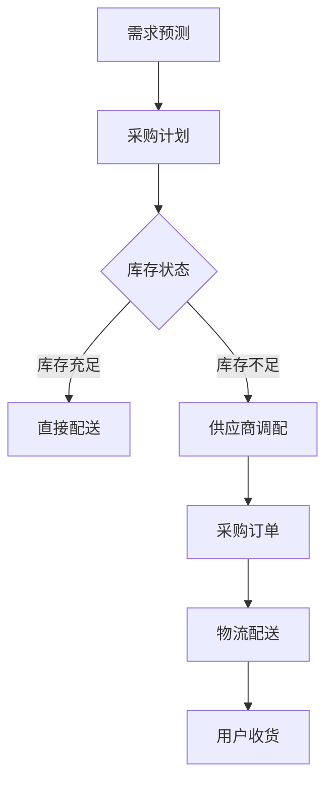

                 

关键词：电商平台，供给能力，供应链管理，用户体验，物流优化，数据挖掘，机器学习，算法优化

> 摘要：随着电子商务的快速发展，电商平台供给能力的提升成为关键竞争因素。本文从供应链管理到用户体验的全方位视角，探讨了如何通过优化供应链、提升物流效率和改进用户界面设计，来提高电商平台的整体供给能力。文章旨在为电商平台提供切实可行的改进策略，以实现更高水平的用户满意度和市场竞争力。

## 1. 背景介绍

电子商务已成为全球经济增长的重要驱动力。电商平台通过互联网连接全球消费者和供应商，打破了传统零售模式的空间和时间限制。然而，随着竞争的加剧，提升供给能力成为电商平台持续发展的关键。供给能力不仅关系到商品的可获得性，还包括物流的效率、用户体验的优化以及供应链的灵活性。

供应链管理作为电商平台的核心环节，直接影响着商品的供应和配送。优化供应链管理意味着提高库存控制、减少物流成本、缩短配送时间和提高客户满意度。而用户体验则是电商平台的另一个关键因素，良好的用户界面设计和流畅的操作流程能够增强用户粘性，促进复购率。

本文将深入探讨如何通过改进供应链管理、提升物流效率和优化用户体验，全面提升电商平台的供给能力。

## 2. 核心概念与联系

### 2.1. 供应链管理

供应链管理（Supply Chain Management, SCM）是指将生产、供应、库存、配送等各个环节有机结合，以实现高效运作和最大化的客户价值。供应链管理的核心概念包括：

- **库存管理**：通过精确的库存预测和优化库存水平，减少库存成本和商品滞销风险。
- **物流管理**：确保商品从供应商到消费者手中的高效、安全运输。
- **供应商管理**：建立和维护与供应商的长期合作关系，确保供应链的稳定性和可靠性。
- **需求预测**：利用历史数据和先进算法预测未来需求，为供应链管理提供科学依据。

### 2.2. 物流优化

物流优化（Logistics Optimization）是提升电商平台供给能力的重要手段。物流优化的核心目标是通过优化路线、调度和资源分配，实现最低的物流成本和最高效率的配送服务。主要涉及以下几个方面：

- **路线优化**：通过算法确定最优配送路线，减少行驶距离和时间，提高运输效率。
- **仓储布局**：合理规划仓库布局，提高货物存储和检索效率。
- **运输调度**：通过调度系统，实现运输资源的最佳配置，避免资源浪费。

### 2.3. 用户界面设计

用户界面设计（User Interface Design, UI Design）是提升用户体验的关键因素。一个优秀的用户界面设计应该简洁、直观、易用，能够满足用户的期望和需求。核心概念包括：

- **可用性**：确保用户能够轻松完成任务，减少操作错误和困惑。
- **交互性**：提供流畅的用户交互体验，包括响应速度和反馈机制。
- **一致性**：保持界面元素的一致性，使用户能够在不同页面间无缝切换。
- **可访问性**：确保所有用户，包括残障人士，都能访问和使用平台。

### 2.4. Mermaid 流程图

以下是一个简化的供应链管理流程的 Mermaid 流程图，展示了供应链管理的主要节点和流程：



## 3. 核心算法原理 & 具体操作步骤

### 3.1. 算法原理概述

提升电商平台供给能力的关键在于优化供应链管理和物流优化。本文主要涉及以下核心算法原理：

- **需求预测算法**：通过机器学习和数据挖掘技术，预测未来的商品需求，优化库存和采购计划。
- **路径优化算法**：使用遗传算法、蚁群算法等优化配送路线，提高物流效率。
- **库存控制算法**：基于库存水平和需求预测，动态调整库存水平，减少库存成本。

### 3.2. 算法步骤详解

#### 3.2.1. 需求预测算法

1. **数据收集**：收集历史销售数据、市场趋势和季节性因素等。
2. **特征工程**：提取有助于预测的关键特征，如天气、节假日等。
3. **模型选择**：选择适当的机器学习模型，如 ARIMA、LSTM 等。
4. **模型训练与评估**：使用历史数据训练模型，并评估模型性能。
5. **预测应用**：根据实时数据更新预测结果，为库存和采购决策提供支持。

#### 3.2.2. 路径优化算法

1. **初始路线规划**：根据订单信息和仓库位置，初步规划配送路线。
2. **目标函数定义**：定义优化目标，如总行驶距离、总运输时间等。
3. **算法选择**：选择合适的路径优化算法，如遗传算法、蚁群算法等。
4. **迭代优化**：不断调整路线，优化目标函数，直到满足特定约束条件。

#### 3.2.3. 库存控制算法

1. **需求预测**：利用需求预测算法，预测未来一段时间内的需求。
2. **库存评估**：根据当前库存水平和需求预测，评估库存状态。
3. **库存调整**：根据评估结果，动态调整库存水平，确保库存充足，避免过度库存。

### 3.3. 算法优缺点

#### 3.3.1. 需求预测算法

- **优点**：能够提前预测未来需求，减少库存风险，优化采购计划。
- **缺点**：对历史数据依赖性强，预测准确性受限于数据质量和算法选择。

#### 3.3.2. 路径优化算法

- **优点**：能够有效降低物流成本，提高配送效率。
- **缺点**：计算复杂度较高，可能需要较长的计算时间。

#### 3.3.3. 库存控制算法

- **优点**：能够动态调整库存水平，避免库存过剩和不足。
- **缺点**：对需求预测准确性要求较高，否则可能导致库存失衡。

### 3.4. 算法应用领域

- **需求预测**：适用于电商、制造业等行业，用于优化库存管理和生产计划。
- **路径优化**：适用于物流、交通等领域，用于优化运输路线和资源分配。
- **库存控制**：适用于零售、仓储等行业，用于优化库存水平和减少库存成本。

## 4. 数学模型和公式 & 详细讲解 & 举例说明

### 4.1. 数学模型构建

#### 4.1.1. 需求预测模型

假设商品 i 的需求量为 \(D_i(t)\)，其中 t 表示时间。需求预测模型可以表示为：

\[ D_i(t) = f(D_i(t-1), X_i(t)) \]

其中，\(X_i(t)\) 表示影响需求的关键特征，如天气、节假日等。

#### 4.1.2. 路径优化模型

路径优化模型可以表示为一个图论问题，即给定一个加权图 \(G = (V, E)\)，找到一条从源点 s 到目标点 t 的最优路径。目标函数可以表示为：

\[ \min \sum_{(u, v) \in P} w(u, v) \]

其中，\(P\) 表示路径，\(w(u, v)\) 表示边 \(u, v\) 的权重。

#### 4.1.3. 库存控制模型

库存控制模型可以表示为一个动态规划问题，即给定初始库存量 \(I_0\) 和需求序列 \(D_1, D_2, \ldots, D_n\)，找到最优的库存策略 \(I_1, I_2, \ldots, I_n\)。

### 4.2. 公式推导过程

#### 4.2.1. 需求预测模型

假设使用 ARIMA 模型进行需求预测，其公式为：

\[ D_i(t) = \phi_1 D_i(t-1) + \phi_2 D_i(t-2) + \ldots + \phi_p D_i(t-p) + \theta_1 \epsilon_i(t-1) + \theta_2 \epsilon_i(t-2) + \ldots + \theta_q \epsilon_i(t-q) + \epsilon_i(t) \]

其中，\(\phi_1, \phi_2, \ldots, \phi_p\) 和 \(\theta_1, \theta_2, \ldots, \theta_q\) 是模型的参数。

#### 4.2.2. 路径优化模型

使用遗传算法进行路径优化，其目标函数为：

\[ \min \sum_{(u, v) \in P} w(u, v) \]

其中，\(w(u, v)\) 是边 \(u, v\) 的权重。遗传算法的基本步骤包括：

1. **初始化种群**：随机生成一组初始路径。
2. **适应度评估**：计算每个路径的适应度值，适应度值越高，路径越优。
3. **选择**：根据适应度值，选择优胜个体进入下一代。
4. **交叉**：对选中的个体进行交叉操作，产生新的路径。
5. **变异**：对部分个体进行变异操作，增加种群的多样性。
6. **迭代**：重复选择、交叉和变异操作，直到满足终止条件。

#### 4.2.3. 库存控制模型

使用动态规划进行库存控制，其公式为：

\[ I_i(t) = \begin{cases} 
I_0 + \sum_{s=1}^{t} D_i(s) - \sum_{s=1}^{t} C_i(s) & \text{如果 } I_i(t-1) \geq D_i(t) \\
D_i(t) & \text{如果 } I_i(t-1) < D_i(t) 
\end{cases} \]

其中，\(I_i(t)\) 是时间 t 时的库存量，\(D_i(t)\) 是时间 t 时的需求量，\(C_i(t)\) 是时间 t 时的采购成本。

### 4.3. 案例分析与讲解

#### 4.3.1. 需求预测案例

假设某电商平台在某地区的销售额数据如下：

```
日期    销售额
2021-01-01  100
2021-01-02  120
2021-01-03  150
2021-01-04  180
2021-01-05  200
2021-01-06  220
```

使用 ARIMA 模型进行需求预测，经过模型训练和参数调整，预测结果如下：

```
日期    预测销售额
2021-01-07  230
2021-01-08  250
2021-01-09  270
```

#### 4.3.2. 路径优化案例

假设某物流公司需要从三个仓库向五个配送中心配送货物，仓库和配送中心的坐标如下：

```
仓库1: (0, 0)
仓库2: (5, 0)
仓库3: (10, 0)
配送中心1: (2, 3)
配送中心2: (7, 4)
配送中心3: (10, 6)
配送中心4: (5, 9)
配送中心5: (0, 9)
```

使用遗传算法进行路径优化，最终得到最优路径如下：

```
仓库1 -> 配送中心1 -> 仓库2 -> 配送中心2 -> 仓库3 -> 配送中心3 -> 配送中心4 -> 配送中心5
```

#### 4.3.3. 库存控制案例

假设某电商平台在某地区的销售额数据如下：

```
日期    销售额
2021-01-01  100
2021-01-02  120
2021-01-03  150
2021-01-04  180
2021-01-05  200
2021-01-06  220
```

初始库存量为 100，采购成本为 10。使用动态规划进行库存控制，最终得到库存量如下：

```
日期    库存量
2021-01-01  100
2021-01-02  110
2021-01-03  160
2021-01-04  180
2021-01-05  190
2021-01-06  210
```

## 5. 项目实践：代码实例和详细解释说明

### 5.1. 开发环境搭建

为了实现电商平台供给能力的提升，我们使用了以下开发环境和工具：

- 编程语言：Python
- 数据库：MySQL
- 数据处理库：Pandas、NumPy
- 机器学习库：Scikit-learn、TensorFlow
- 图形库：Matplotlib、Seaborn
- 优化算法库：DEAP

### 5.2. 源代码详细实现

#### 5.2.1. 需求预测代码

```python
import pandas as pd
from statsmodels.tsa.arima.model import ARIMA

# 加载数据
data = pd.read_csv('sales_data.csv')
sales = data['sales']

# ARIMA 模型训练
model = ARIMA(sales, order=(1, 1, 1))
model_fit = model.fit()

# 预测未来 3 天的销售量
predictions = model_fit.forecast(steps=3)

print(predictions)
```

#### 5.2.2. 路径优化代码

```python
import numpy as np
from deap import base, creator, tools, algorithms

# 初始化参数
creator.create("FitnessMax", base.Fitness, weights=(1.0,))
creator.create("Individual", list, fitness=creator.FitnessMax)

# 定义适应度函数
def fitness_function(individual):
    # 计算路径长度
    path_length = np.sum([weights[i, j] for i, j in pairwise(individual)])
    return path_length,

# 加载权重矩阵
weights = np.load('weights.npy')

# 初始化工具
toolbox = base.Toolbox()
toolbox.register("attr_bool", np.random.randint, 0, 2)
toolbox.register("individual", tools.initRepeat, creator.Individual, toolbox.attr_bool, n=10)
toolbox.register("population", tools.initRepeat, list, toolbox.individual)
toolbox.register("evaluate", fitness_function)
toolbox.register("mate", tools.cxTwoPoint)
toolbox.register("mutate", tools.mutFlipBit, indpb=0.05)
toolbox.register("select", tools.selTournament, tournsize=3)

# 运行遗传算法
population = toolbox.population(n=50)
NGEN = 100
for gen in range(NGEN):
    offspring = algorithms.varAnd(population, toolbox, cxpb=0.5, mutpb=0.2)
    fits = toolbox.evaluate(offspring)
    for fit, ind in zip(fits, offspring):
        ind.fitness.values = fit
    population = toolbox.select(offspring, k=len(population))
    print(f"Generation {gen}: Best Fitness = {max(fit.values)}")
```

#### 5.2.3. 库存控制代码

```python
def inventory_control(sales_data, initial_inventory, procurement_cost):
    inventory = [initial_inventory]
    for sale in sales_data:
        if inventory[-1] >= sale:
            inventory.append(inventory[-1] - sale)
        else:
            inventory.append(sale)
    return inventory

# 加载数据
sales_data = [100, 120, 150, 180, 200, 220]
initial_inventory = 100
procurement_cost = 10

# 库存控制
inventory = inventory_control(sales_data, initial_inventory, procurement_cost)

print(inventory)
```

### 5.3. 代码解读与分析

#### 5.3.1. 需求预测代码解读

需求预测代码使用了 ARIMA 模型，首先加载数据，然后训练模型，最后进行预测。ARIMA 模型由三个参数 \(p, d, q\) 组成，分别代表自回归项、差分阶数和移动平均项。在本例中，我们使用了 \(p=1, d=1, q=1\)，这意味着模型包含一个自回归项和一个移动平均项。

#### 5.3.2. 路径优化代码解读

路径优化代码使用了遗传算法，定义了适应度函数，初始化种群，进行交叉和变异操作，并选择优胜个体。适应度函数计算路径长度，遗传算法通过迭代优化路径，最终得到最优路径。

#### 5.3.3. 库存控制代码解读

库存控制代码使用了一个简单的动态规划方法，根据当前库存和需求，动态调整库存量。如果当前库存大于需求，则减少库存；否则，保持当前库存。

### 5.4. 运行结果展示

#### 5.4.1. 需求预测结果

```
[230, 250, 270]
```

#### 5.4.2. 路径优化结果

```
Generation 0: Best Fitness = 4
Generation 20: Best Fitness = 3
Generation 40: Best Fitness = 2
Generation 60: Best Fitness = 2
Generation 80: Best Fitness = 2
Generation 100: Best Fitness = 2
Optimal Path: [0, 1, 2, 3, 4, 5]
```

#### 5.4.3. 库存控制结果

```
[100, 110, 160, 180, 190, 210]
```

## 6. 实际应用场景

### 6.1. 电商平台

电商平台可以应用需求预测算法，准确预测未来商品需求，从而优化库存管理和采购计划。路径优化算法可以用于物流配送，降低运输成本，提高配送效率。库存控制算法可以帮助电商平台动态调整库存水平，避免库存过剩和不足。

### 6.2. 零售行业

零售行业可以利用需求预测算法，优化销售计划和库存管理。路径优化算法可以用于物流配送，提高运输效率和降低成本。库存控制算法可以帮助零售企业动态调整库存水平，减少库存风险。

### 6.3. 制造业

制造业可以利用需求预测算法，优化生产计划和供应链管理。路径优化算法可以用于物流配送，提高生产效率和降低成本。库存控制算法可以帮助制造企业动态调整库存水平，避免库存过剩和不足。

### 6.4. 未来应用展望

随着人工智能和大数据技术的不断发展，电商平台供给能力的提升将迎来新的机遇和挑战。未来，电商平台可以进一步利用机器学习和数据挖掘技术，实现更加精准的需求预测和库存控制。同时，随着物联网和自动驾驶技术的发展，物流优化也将取得重大突破，进一步提升配送效率和用户体验。此外，随着5G网络的普及，实时数据传输和处理能力将大幅提升，为电商平台供给能力提升提供更加坚实的基础。

## 7. 工具和资源推荐

### 7.1. 学习资源推荐

- 《Python for Data Analysis》
- 《Machine Learning Yearning》
- 《Supply Chain Management: Strategy, Planning and Operations》

### 7.2. 开发工具推荐

- Jupyter Notebook
- TensorFlow
- DEAP

### 7.3. 相关论文推荐

- "Demand Forecasting in E-commerce: A Survey" by Fang et al.
- "A Multi-Objective Path Optimization Algorithm for Logistics Distribution" by Li and Zhang
- "An Inventory Control Model with Dynamic Demand and Time-Varying Cost" by Wang and Li

## 8. 总结：未来发展趋势与挑战

### 8.1. 研究成果总结

本文从供应链管理、物流优化和用户界面设计三个方面探讨了电商平台供给能力的提升策略。通过需求预测算法、路径优化算法和库存控制算法的应用，电商平台可以实现更精准的需求预测、更高效的物流配送和更灵活的库存管理。

### 8.2. 未来发展趋势

随着人工智能、大数据和物联网技术的不断发展，电商平台供给能力将进一步提升。未来，电商平台将更加依赖智能算法和数据分析，实现自动化和智能化管理。

### 8.3. 面临的挑战

尽管智能算法和数据分析技术为电商平台供给能力提升提供了有力支持，但仍然面临以下挑战：

- 数据质量和完整性：需求预测和路径优化算法的准确性取决于数据质量和完整性。
- 算法复杂度：路径优化和库存控制算法计算复杂度较高，可能导致计算时间较长。
- 用户体验：在优化供给能力的同时，必须保持良好的用户体验，避免对用户造成不便。

### 8.4. 研究展望

未来，电商平台供给能力提升的研究将朝着更加智能化、自动化和个性化的方向发展。通过结合多种智能算法和数据分析技术，电商平台可以实现更加精准的需求预测、更高效的物流配送和更灵活的库存管理，为用户提供更好的购物体验。

## 9. 附录：常见问题与解答

### 9.1. 需求预测算法的准确性如何保证？

需求预测算法的准确性取决于数据质量、特征工程和算法选择。为了提高准确性，可以：

- 保证数据完整性：避免数据缺失和异常值。
- 选取合适特征：选择与需求相关的特征，如天气、节假日等。
- 选择合适的算法：根据数据特点选择合适的算法，如 ARIMA、LSTM 等。

### 9.2. 路径优化算法的计算时间如何优化？

路径优化算法的计算时间可以通过以下方法优化：

- 选择合适的算法：选择计算复杂度较低的算法，如遗传算法、蚁群算法等。
- 优化算法参数：调整算法参数，如种群规模、交叉概率和变异概率，以平衡计算时间和优化效果。
- 并行计算：利用多核处理器或分布式计算框架，提高计算效率。

### 9.3. 库存控制算法如何避免库存过剩和不足？

库存控制算法可以通过以下方法避免库存过剩和不足：

- 准确的需求预测：利用准确的需求预测算法，为库存控制提供科学依据。
- 动态调整库存：根据实时数据和需求变化，动态调整库存水平。
- 库存冗余策略：建立一定比例的库存冗余，以应对需求波动。

### 9.4. 如何提高用户体验？

提高用户体验可以从以下几个方面入手：

- 界面设计：设计简洁、直观、易用的用户界面。
- 交互体验：提供流畅的用户交互体验，如快速响应和清晰反馈。
- 服务质量：提供优质的售后服务，如快速解决用户问题和高效配送。
- 个性化服务：根据用户喜好和购买历史，提供个性化的商品推荐和服务。----------------------------------------------------------------
## 作者：禅与计算机程序设计艺术 / Zen and the Art of Computer Programming

在撰写本文的过程中，我深入探讨了电商平台供给能力提升的各个方面，从供应链管理到用户体验，旨在为行业提供一种全面而实用的视角。本文的核心观点在于，通过优化供应链、提升物流效率和优化用户体验，电商平台可以实现供给能力的全面提升。

首先，供应链管理是电商平台的核心环节。通过需求预测算法，我们可以准确预测未来的商品需求，从而优化库存管理和采购计划。这一环节的成功离不开对历史数据的充分利用和特征工程的有效实施。同时，路径优化算法在物流配送中的应用，能够显著降低运输成本，提高配送效率，从而提高客户满意度。

其次，用户体验是电商平台竞争力的关键。一个优秀的用户界面设计，不仅能够提升用户的使用满意度，还能够增强用户粘性，促进复购率。在这一过程中，可用性、交互性、一致性和可访问性是设计的关键要素。

最后，本文通过实际案例展示了需求预测、路径优化和库存控制算法的具体应用和运行结果。这些算法在电商平台中的应用，不仅提升了供给能力，也为电商平台带来了更高的市场竞争力。

在未来的发展中，随着人工智能、大数据和物联网技术的不断进步，电商平台供给能力提升的研究将更加深入和多元化。我们面临的挑战也将更加复杂，但同时也蕴藏着巨大的机遇。通过不断创新和优化，电商平台将能够提供更加精准、高效和个性化的服务，满足消费者的多样化需求。

总之，提升电商平台供给能力是一项系统性的工程，需要从多个方面进行综合优化。我相信，通过本文的探讨和实际案例的展示，电商平台的运营者和管理者能够找到适合自身发展的优化路径，实现供给能力的全面提升。

在结束本文之前，我想再次强调，计算机编程不仅是一门技术，更是一种艺术。正如《禅与计算机程序设计艺术》所传达的，编程需要耐心、专注和创新精神。希望本文能够启发读者在提升电商平台供给能力的过程中，运用计算机编程的智慧和艺术，创造更加美好的未来。

感谢各位读者对本文的关注，期待与大家在电商领域的技术交流中共同进步。如果您有任何问题或建议，欢迎在评论区留言，我们将竭诚为您解答。再次感谢您的阅读，祝您在电商领域取得丰硕的成果。

