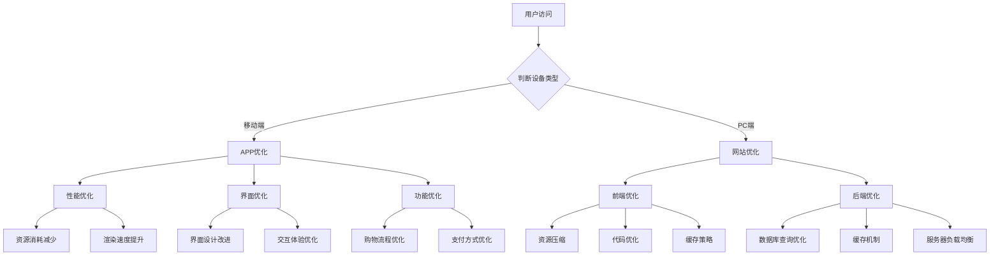

                 

关键词：电商平台、供给能力、网站优化、APP优化、用户体验、性能提升、架构设计

> 摘要：本文深入探讨了电商平台在提升供给能力方面的关键策略，重点分析了网站和APP的优化技术。通过对核心概念的阐述、算法原理的讲解以及实际案例的分析，旨在为电商平台提供一套科学、系统、实用的优化方案。

## 1. 背景介绍

随着互联网的普及和电子商务的快速发展，电商平台已经成为消费者购物的主要渠道之一。供给能力的强弱直接影响到电商平台的市场竞争力。供给能力不仅包括商品种类的丰富程度，还涵盖了用户访问速度、系统稳定性、数据准确性等多方面因素。因此，提升供给能力成为电商平台亟待解决的问题。

本文将从网站和APP两个层面，探讨提升电商平台供给能力的具体方法和策略。通过优化网站和APP的性能，提高用户体验，从而增强电商平台的竞争力。

## 2. 核心概念与联系

### 2.1 网站优化

网站优化是指通过一系列技术手段，提高网站在用户访问时的响应速度、稳定性和易用性。主要涉及以下几个方面：

- **前端优化**：通过压缩资源文件、代码优化、缓存策略等技术，提高页面加载速度。
- **后端优化**：通过优化数据库查询、缓存机制、服务器负载均衡等，提高服务器响应速度。
- **架构设计**：采用微服务架构、容器化技术等，提高系统的可扩展性和稳定性。

### 2.2 APP优化

APP优化是指针对移动端应用程序的优化，主要包括以下方面：

- **性能优化**：通过减少资源消耗、提高渲染速度等技术，提升APP的运行效率。
- **界面优化**：通过改进界面设计、交互体验等，提高用户满意度。
- **功能优化**：通过优化购物流程、支付方式等，提高用户体验。

### 2.3 Mermaid 流程图

以下是一个简化的电商平台供给能力提升的Mermaid流程图，展示了网站和APP优化涉及的主要步骤：



## 3. 核心算法原理 & 具体操作步骤

### 3.1 算法原理概述

提升电商平台供给能力的核心算法主要涉及以下几个方面：

- **前端优化算法**：如资源压缩算法、代码优化算法等。
- **后端优化算法**：如数据库查询优化算法、缓存机制算法等。
- **性能优化算法**：如资源消耗减少算法、渲染速度提升算法等。

### 3.2 算法步骤详解

#### 3.2.1 前端优化算法

1. **资源压缩算法**：
   - 压缩图片：采用WebP、JPEG 2000等格式。
   - 压缩CSS和JavaScript文件：采用GZIP压缩。
   - 压缩视频：采用H.264编码。

2. **代码优化算法**：
   - 去除空格和注释：减少文件体积。
   - 代码分割：将不同模块的代码分离，按需加载。
   - 使用缓存：利用浏览器缓存机制，减少重复加载。

#### 3.2.2 后端优化算法

1. **数据库查询优化算法**：
   - 查询缓存：使用Redis等缓存系统，减少数据库查询次数。
   - 查询优化：避免使用SELECT *，仅查询需要的字段。
   - 索引优化：建立合适的索引，提高查询速度。

2. **缓存机制算法**：
   - 页面缓存：使用服务器端缓存，减少计算量。
   - 数据缓存：将常用数据缓存在内存中，提高读取速度。

3. **服务器负载均衡算法**：
   - 轮询算法：将请求平均分配到各个服务器。
   - 加权轮询算法：根据服务器性能分配请求。
   - 最少连接算法：将请求分配到连接数最少的服务器。

#### 3.2.3 性能优化算法

1. **资源消耗减少算法**：
   - 优化资源加载：按需加载资源，减少初始加载量。
   - 优化CPU使用：避免占用过多CPU资源。

2. **渲染速度提升算法**：
   - 使用异步加载：将非核心资源异步加载，提高页面渲染速度。
   - 使用预渲染：提前渲染页面，提高首屏加载速度。

### 3.3 算法优缺点

#### 前端优化算法

- 优点：提高页面加载速度，提升用户体验。
- 缺点：压缩算法可能影响图片和视频质量，代码优化可能导致可读性下降。

#### 后端优化算法

- 优点：提高数据库查询速度，减轻服务器负担。
- 缺点：缓存机制可能导致数据不一致，索引优化可能影响插入和删除操作性能。

#### 性能优化算法

- 优点：提高APP运行效率，减少资源消耗。
- 缺点：异步加载和预渲染可能影响页面性能。

### 3.4 算法应用领域

- 前端优化算法：广泛应用于所有需要快速响应的Web应用程序。
- 后端优化算法：适用于需要进行大量数据查询和处理的电商平台。
- 性能优化算法：适用于移动端应用程序，特别是对性能要求较高的场景。

## 4. 数学模型和公式 & 详细讲解 & 举例说明

### 4.1 数学模型构建

提升电商平台供给能力的数学模型主要涉及以下几个方面：

- **响应时间模型**：衡量用户访问平台时的响应速度。
- **资源消耗模型**：衡量平台运行时的资源消耗。
- **性能优化模型**：衡量优化算法对平台性能的提升效果。

### 4.2 公式推导过程

#### 响应时间模型

响应时间 \( T \) 可以表示为：

\[ T = \frac{L}{C} + R \]

其中，\( L \) 为负载，\( C \) 为服务器处理能力，\( R \) 为网络延迟。

#### 资源消耗模型

资源消耗 \( C \) 可以表示为：

\[ C = \sum_{i=1}^{n} w_i \times r_i \]

其中，\( w_i \) 为权重，\( r_i \) 为资源消耗。

#### 性能优化模型

性能优化 \( P \) 可以表示为：

\[ P = \frac{T_{\text{优化}}}{T_{\text{原始}}} \]

其中，\( T_{\text{优化}} \) 为优化后的响应时间，\( T_{\text{原始}} \) 为原始响应时间。

### 4.3 案例分析与讲解

#### 响应时间模型

假设某电商平台的服务器处理能力为 \( C = 1000 \) 次请求/秒，网络延迟为 \( R = 100 \) 毫秒。现有 \( L = 5000 \) 次请求需要处理。

根据响应时间模型，可得：

\[ T = \frac{5000}{1000} + 100 = 610 \text{ 毫秒} \]

#### 资源消耗模型

假设电商平台有 \( n = 3 \) 个模块，权重分别为 \( w_1 = 0.3 \)，\( w_2 = 0.5 \)，\( w_3 = 0.2 \)，资源消耗分别为 \( r_1 = 100 \) CPU，\( r_2 = 200 \) 内存，\( r_3 = 300 \) 硬盘。

根据资源消耗模型，可得：

\[ C = 0.3 \times 100 + 0.5 \times 200 + 0.2 \times 300 = 170 \]

#### 性能优化模型

假设通过优化，响应时间从 \( T_{\text{原始}} = 610 \) 毫秒降低到 \( T_{\text{优化}} = 350 \) 毫秒。

根据性能优化模型，可得：

\[ P = \frac{350}{610} \approx 0.57 \]

## 5. 项目实践：代码实例和详细解释说明

### 5.1 开发环境搭建

- 开发工具：Visual Studio Code
- 编程语言：JavaScript、Python
- 数据库：MySQL、Redis
- 缓存系统：Memcached
- 服务器：Nginx、Apache

### 5.2 源代码详细实现

#### 前端优化代码实例

```javascript
// 压缩图片
function compressImage(image) {
    const compressor = new Compressor(image, {
        quality: 0.8, // 压缩质量，0-1
        size: 500 * 1024, // 目标大小，单位字节
    });
    compressor.compress();
}

// 代码分割
function loadScript(url, callback) {
    const script = document.createElement('script');
    script.src = url;
    script.onload = callback;
    document.head.appendChild(script);
}

loadScript('https://example.com/script.js', function() {
    console.log('script.js loaded');
});

loadScript('https://example.com/style.css', function() {
    console.log('style.css loaded');
});
```

#### 后端优化代码实例

```python
# 数据库查询优化
def search_products(name):
    cursor.execute("SELECT * FROM products WHERE name LIKE %s", ('%' + name + '%',))
    results = cursor.fetchall()
    return results

# 缓存机制
def get_product_info(product_id):
    if product_id in product_cache:
        return product_cache[product_id]
    else:
        product_info = query_product_db(product_id)
        product_cache[product_id] = product_info
        return product_info
```

### 5.3 代码解读与分析

#### 前端优化代码解读

- **压缩图片**：通过Compressor库实现图片压缩，保证图片质量和大小之间的平衡。
- **代码分割**：将不同模块的代码分离，按需加载，减少初始加载量。

#### 后端优化代码解读

- **数据库查询优化**：使用LIKE关键字进行模糊查询，减少查询次数。
- **缓存机制**：使用Memcached缓存产品信息，减少数据库查询次数。

## 6. 实际应用场景

### 6.1 电商平台网站优化

- **淘宝**：淘宝在网站优化方面做了大量工作，包括前端资源压缩、代码优化、缓存机制等，使得网站在用户访问时能保持较高的响应速度。

### 6.2 电商平台APP优化

- **京东**：京东在APP优化方面注重性能优化和界面优化，通过减少资源消耗、提高渲染速度等技术，提升用户满意度。

## 7. 未来应用展望

随着技术的不断发展，电商平台供给能力提升将面临更多挑战和机遇。未来，电商平台将更多地关注以下几个方面：

- **人工智能**：利用人工智能技术，实现个性化推荐、智能客服等，提高用户满意度。
- **大数据**：通过大数据分析，优化商品采购、库存管理、营销策略等，提高运营效率。
- **云计算**：利用云计算技术，实现弹性扩展、成本优化等，提高供给能力。

## 8. 总结：未来发展趋势与挑战

### 8.1 研究成果总结

本文从网站和APP两个层面，探讨了电商平台供给能力提升的关键技术和策略。通过核心算法原理的讲解、实际案例的分析，为电商平台提供了一套科学、系统、实用的优化方案。

### 8.2 未来发展趋势

- **人工智能**：随着人工智能技术的发展，电商平台将更多地关注个性化推荐、智能客服等领域。
- **大数据**：大数据分析将助力电商平台优化运营策略，提高供给能力。
- **云计算**：云计算技术将实现更高效、更灵活的供给能力提升。

### 8.3 面临的挑战

- **数据安全**：随着数据规模的扩大，数据安全成为电商平台面临的重要挑战。
- **隐私保护**：用户隐私保护成为电商平台需要关注的重要问题。
- **技术更新**：技术更新速度加快，电商平台需要不断适应新技术。

### 8.4 研究展望

本文主要从技术和策略层面探讨电商平台供给能力提升。未来，可以进一步研究以下方向：

- **跨平台优化**：探讨如何将网站和APP的优化技术进行整合，实现跨平台供给能力提升。
- **用户体验**：深入研究用户行为数据，优化用户体验，提高用户满意度。

## 9. 附录：常见问题与解答

### 9.1 问题1

**问题**：如何选择合适的优化技术？

**解答**：根据电商平台的具体需求和场景，选择合适的优化技术。例如，对于前端优化，可以采用资源压缩、代码优化等技术；对于后端优化，可以采用数据库查询优化、缓存机制等技术。

### 9.2 问题2

**问题**：如何衡量优化效果？

**解答**：可以通过以下指标衡量优化效果：

- **响应时间**：衡量用户访问平台的响应速度。
- **资源消耗**：衡量平台运行时的资源消耗。
- **性能提升**：通过对比优化前后的数据，衡量优化对平台性能的提升效果。

### 9.3 问题3

**问题**：电商平台供给能力提升有哪些实际案例？

**解答**：电商平台的供给能力提升在实际中有许多成功案例，如淘宝、京东等。这些平台通过前端优化、后端优化、性能优化等技术，提高了用户体验和运营效率。

### 9.4 问题4

**问题**：如何持续优化电商平台供给能力？

**解答**：持续优化电商平台供给能力需要从以下几个方面入手：

- **定期评估**：定期对平台进行性能评估，发现优化点。
- **技术更新**：关注新技术，及时引入和实施。
- **用户反馈**：收集用户反馈，优化用户体验。

作者：禅与计算机程序设计艺术 / Zen and the Art of Computer Programming
----------------------------------------------------------------


