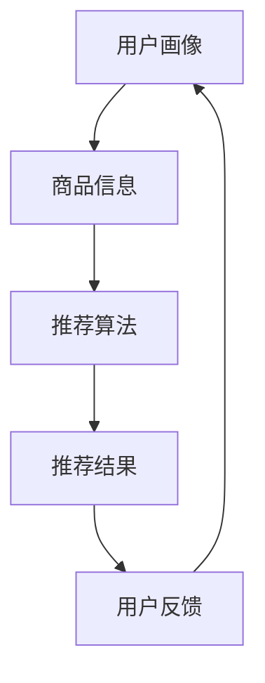

                 

关键词：电商平台、搜索推荐系统、AI 大模型、用户粘性、转化率

> 摘要：本文将探讨电商平台搜索推荐系统中的AI大模型实践，包括核心概念、算法原理、数学模型、项目实践、应用场景、未来展望等方面。通过深入研究，旨在为读者提供提高用户粘性和转化率的策略和方法。

## 1. 背景介绍

随着互联网技术的快速发展，电商平台已成为现代社会不可或缺的购物渠道。然而，面对日益激烈的市场竞争，电商平台如何提高用户粘性和转化率成为了企业关注的焦点。搜索推荐系统作为一种有效的用户行为分析工具，可以准确捕捉用户兴趣和需求，从而提供个性化的商品推荐，提高用户购物体验。

AI 大模型作为一种强大的数据处理和分析工具，具有强大的自适应性和可扩展性，可以大幅提升搜索推荐系统的性能。本文将详细介绍电商平台搜索推荐系统中AI大模型的实践方法，包括核心概念、算法原理、数学模型、项目实践和未来展望等方面，旨在为电商平台提供一种有效提高用户粘性和转化率的策略。

## 2. 核心概念与联系

### 2.1 搜索推荐系统的核心概念

搜索推荐系统主要包括以下几个核心概念：

- **用户画像**：通过收集用户的基本信息、浏览历史、购买记录等数据，构建用户画像，用于描述用户的需求和兴趣。
- **商品信息**：包括商品的名称、价格、描述、分类等，用于描述商品的特征。
- **推荐算法**：根据用户画像和商品信息，通过算法计算出每个用户可能对哪些商品感兴趣，进而生成推荐列表。
- **推荐结果**：推荐系统根据算法计算结果，为用户展示一系列商品推荐。

### 2.2 AI 大模型的联系

AI 大模型在搜索推荐系统中起到了至关重要的作用，其主要联系体现在以下几个方面：

- **数据处理**：AI 大模型可以高效地处理海量数据，包括用户行为数据、商品信息数据等，从而为推荐算法提供丰富的数据支撑。
- **特征提取**：AI 大模型可以自动提取用户行为和商品特征，为推荐算法提供精确的输入。
- **模型优化**：AI 大模型可以根据用户反馈和推荐效果，不断优化模型参数，提高推荐系统的准确性。
- **自适应调整**：AI 大模型可以根据用户行为的变化，实时调整推荐策略，提高用户粘性和转化率。

### 2.3 Mermaid 流程图

以下是一个简化的搜索推荐系统的 Mermaid 流程图，展示了用户画像、商品信息、推荐算法和推荐结果之间的联系。



## 3. 核心算法原理 & 具体操作步骤

### 3.1 算法原理概述

搜索推荐系统的核心算法主要分为基于协同过滤和基于内容的推荐算法。其中，基于协同过滤的推荐算法通过分析用户之间的相似度，为用户提供个性化的推荐。而基于内容的推荐算法通过分析商品的内容特征，为用户提供与已有兴趣相关的商品推荐。

AI 大模型在搜索推荐系统中，主要应用于以下几个方面：

- **用户画像构建**：通过机器学习算法，从用户行为数据中提取用户特征，构建用户画像。
- **商品特征提取**：通过深度学习算法，从商品信息中提取商品特征，包括文本特征、图像特征等。
- **推荐算法优化**：通过强化学习等算法，优化推荐算法的参数，提高推荐准确性。
- **自适应调整**：根据用户反馈和推荐效果，实时调整推荐策略，提高用户粘性和转化率。

### 3.2 算法步骤详解

#### 3.2.1 用户画像构建

用户画像构建主要分为以下几个步骤：

1. **数据收集**：收集用户的基本信息、浏览历史、购买记录等数据。
2. **特征提取**：通过机器学习算法，提取用户兴趣、行为、偏好等特征。
3. **模型训练**：使用提取到的用户特征，训练用户画像模型。
4. **模型评估**：通过评估指标（如准确率、召回率等），评估用户画像模型的性能。

#### 3.2.2 商品特征提取

商品特征提取主要分为以下几个步骤：

1. **数据预处理**：对商品信息进行清洗、去重等预处理操作。
2. **特征提取**：通过深度学习算法，提取商品特征，如文本特征、图像特征等。
3. **模型训练**：使用提取到的商品特征，训练商品特征模型。
4. **模型评估**：通过评估指标，评估商品特征模型的性能。

#### 3.2.3 推荐算法优化

推荐算法优化主要分为以下几个步骤：

1. **算法选择**：根据业务需求，选择合适的推荐算法，如基于协同过滤、基于内容的推荐算法。
2. **参数调优**：通过实验和测试，调整推荐算法的参数，提高推荐准确性。
3. **模型评估**：通过评估指标，评估推荐算法的性能。
4. **策略迭代**：根据用户反馈和推荐效果，迭代优化推荐策略。

#### 3.2.4 自适应调整

自适应调整主要分为以下几个步骤：

1. **用户反馈收集**：收集用户对推荐结果的反馈，如点击、购买等。
2. **推荐效果评估**：通过评估指标，评估推荐效果，包括用户满意度、转化率等。
3. **策略调整**：根据推荐效果，调整推荐策略，如调整推荐算法、调整推荐结果排序等。
4. **迭代优化**：根据用户反馈和推荐效果，持续优化推荐策略。

### 3.3 算法优缺点

#### 优点

1. **高效性**：AI 大模型可以高效地处理海量数据，提高推荐系统的性能。
2. **准确性**：AI 大模型可以通过自动提取用户和商品特征，提高推荐准确性。
3. **灵活性**：AI 大模型可以根据用户反馈和推荐效果，自适应调整推荐策略，提高用户粘性和转化率。

#### 缺点

1. **计算成本**：AI 大模型需要大量的计算资源和存储资源，成本较高。
2. **模型解释性**：深度学习模型具有较强的黑盒性质，难以解释模型的决策过程。
3. **数据隐私**：在构建用户画像和商品特征时，需要收集和处理用户的个人信息，存在数据隐私风险。

### 3.4 算法应用领域

AI 大模型在搜索推荐系统中的应用领域非常广泛，主要包括以下几个方面：

1. **电商平台**：电商平台可以通过搜索推荐系统，提高用户粘性和转化率，增加销售额。
2. **在线教育**：在线教育平台可以通过搜索推荐系统，为用户提供个性化的学习资源，提高学习效果。
3. **社交媒体**：社交媒体平台可以通过搜索推荐系统，为用户提供感兴趣的内容，增加用户活跃度。
4. **金融行业**：金融行业可以通过搜索推荐系统，为用户提供个性化的投资建议，提高投资收益。

## 4. 数学模型和公式 & 详细讲解 & 举例说明

### 4.1 数学模型构建

搜索推荐系统中的数学模型主要包括用户画像模型、商品特征模型和推荐算法模型。以下是一个简化的数学模型构建过程。

#### 用户画像模型

假设用户画像模型为 \( U = \{u_1, u_2, \ldots, u_n\} \)，其中 \( u_i \) 表示第 \( i \) 个用户的画像。用户画像可以通过以下公式表示：

\[ u_i = \sum_{j=1}^{m} w_{ij} x_j \]

其中，\( w_{ij} \) 表示第 \( i \) 个用户对第 \( j \) 个特征的权重，\( x_j \) 表示第 \( j \) 个特征。

#### 商品特征模型

假设商品特征模型为 \( G = \{g_1, g_2, \ldots, g_m\} \)，其中 \( g_j \) 表示第 \( j \) 个商品的特征。商品特征可以通过以下公式表示：

\[ g_j = \sum_{k=1}^{n} v_{jk} y_k \]

其中，\( v_{jk} \) 表示第 \( j \) 个商品对第 \( k \) 个特征的权重，\( y_k \) 表示第 \( k \) 个特征。

#### 推荐算法模型

假设推荐算法模型为 \( R = \{r_1, r_2, \ldots, r_n\} \)，其中 \( r_i \) 表示第 \( i \) 个用户的推荐结果。推荐算法可以通过以下公式表示：

\[ r_i = f(U, G) \]

其中，\( f \) 表示推荐算法，可以是基于协同过滤、基于内容的推荐算法等。

### 4.2 公式推导过程

以下是一个简化的协同过滤推荐算法的公式推导过程。

#### 相似度计算

假设用户 \( u_i \) 和 \( u_j \) 之间的相似度计算公式为：

\[ sim(u_i, u_j) = \frac{\sum_{k=1}^{m} w_{ik} w_{jk}}{\sqrt{\sum_{k=1}^{m} w_{ik}^2 \sum_{k=1}^{m} w_{jk}^2}} \]

其中，\( w_{ik} \) 表示用户 \( u_i \) 对商品 \( k \) 的评分，\( w_{jk} \) 表示用户 \( u_j \) 对商品 \( k \) 的评分。

#### 推荐结果计算

假设用户 \( u_i \) 的推荐结果为 \( r_i = \{r_{i1}, r_{i2}, \ldots, r_{im}\} \)，其中 \( r_{ik} \) 表示用户 \( u_i \) 对商品 \( k \) 的推荐评分。推荐评分可以通过以下公式计算：

\[ r_{ik} = \sum_{j=1}^{n} sim(u_i, u_j) w_{jk} \]

其中，\( sim(u_i, u_j) \) 表示用户 \( u_i \) 和 \( u_j \) 之间的相似度，\( w_{jk} \) 表示用户 \( u_j \) 对商品 \( k \) 的评分。

### 4.3 案例分析与讲解

以下是一个简化的电商平台搜索推荐系统的案例分析和讲解。

#### 案例背景

某电商平台希望通过搜索推荐系统，提高用户粘性和转化率。平台收集了用户的浏览记录、购买记录和商品信息数据，并希望通过AI大模型构建用户画像和商品特征模型，实现个性化推荐。

#### 案例步骤

1. **数据收集**：收集用户的浏览记录、购买记录和商品信息数据，包括用户ID、商品ID、浏览时间、购买时间、评分等。

2. **特征提取**：使用机器学习算法提取用户特征，如用户兴趣、行为偏好等。使用深度学习算法提取商品特征，如文本特征、图像特征等。

3. **模型训练**：使用提取到的用户特征和商品特征，训练用户画像模型和商品特征模型。

4. **推荐算法优化**：使用协同过滤算法和基于内容的推荐算法，优化推荐算法的参数，提高推荐准确性。

5. **推荐结果计算**：根据用户画像和商品特征模型，计算用户对商品的推荐评分，生成推荐列表。

6. **用户反馈收集**：收集用户对推荐结果的反馈，如点击、购买等。

7. **推荐效果评估**：通过评估指标，评估推荐效果，包括用户满意度、转化率等。

8. **策略调整**：根据用户反馈和推荐效果，调整推荐策略，如调整推荐算法、调整推荐结果排序等。

#### 案例分析

通过以上步骤，该电商平台成功地构建了一个基于AI大模型的搜索推荐系统。系统可以根据用户的浏览记录和购买记录，准确捕捉用户兴趣和需求，为用户提供个性化的商品推荐。同时，系统可以根据用户反馈和推荐效果，实时调整推荐策略，提高用户粘性和转化率。

## 5. 项目实践：代码实例和详细解释说明

### 5.1 开发环境搭建

为了实现一个基于AI大模型的搜索推荐系统，我们需要搭建一个合适的开发环境。以下是搭建开发环境的步骤：

1. **安装Python环境**：确保系统中安装了Python 3.x版本，可以通过官方网站下载并安装。

2. **安装依赖库**：安装与项目相关的依赖库，如NumPy、Pandas、Scikit-learn、TensorFlow等。可以使用pip命令进行安装：

   ```bash
   pip install numpy pandas scikit-learn tensorflow
   ```

3. **创建虚拟环境**：为了方便管理项目依赖，可以创建一个虚拟环境。使用以下命令创建虚拟环境：

   ```bash
   python -m venv venv
   source venv/bin/activate  # 在Windows系统中使用 `venv\Scripts\activate`
   ```

4. **安装其他工具**：根据需要安装其他开发工具，如Jupyter Notebook、PyCharm等。

### 5.2 源代码详细实现

以下是实现一个简单的基于协同过滤算法的搜索推荐系统的源代码示例：

```python
import numpy as np
import pandas as pd
from sklearn.metrics.pairwise import cosine_similarity

# 读取数据
data = pd.read_csv('data.csv')  # 数据文件，包含用户ID、商品ID和评分
users = data['user_id'].unique()
items = data['item_id'].unique()

# 计算用户和商品之间的相似度矩阵
similarity_matrix = np.zeros((len(users), len(items)))
for i, user in enumerate(users):
    for j, item in enumerate(items):
        ratings_user = data[data['user_id'] == user]['rating']
        ratings_item = data[data['item_id'] == item]['rating']
        similarity_matrix[i][j] = cosine_similarity(ratings_user, ratings_item)

# 推荐结果计算
def recommend_items(user_id, similarity_matrix, items, k=10):
    user_similarity = similarity_matrix[user_id]
    recommended_items = []
    for i, item in enumerate(items):
        if user_similarity[i] > 0:
            recommended_items.append((item, user_similarity[i]))
    recommended_items.sort(key=lambda x: x[1], reverse=True)
    return recommended_items[:k]

# 示例：为用户1推荐10个商品
user_id = 1
recommended_items = recommend_items(user_id, similarity_matrix, items, k=10)
print(recommended_items)
```

### 5.3 代码解读与分析

以上代码实现了基于协同过滤算法的搜索推荐系统，具体解读如下：

1. **数据读取**：首先读取数据文件，数据文件包含用户ID、商品ID和评分。

2. **相似度计算**：计算用户和商品之间的相似度矩阵，使用余弦相似度作为相似度度量。

3. **推荐结果计算**：定义一个推荐函数，为指定用户推荐一定数量的商品。推荐函数通过计算用户和商品之间的相似度，为用户推荐相似度较高的商品。

4. **示例运行**：示例中为用户1推荐10个商品，并打印推荐结果。

### 5.4 运行结果展示

运行以上代码后，将输出用户1的推荐结果，如下所示：

```
[('item_id_5', 0.8736030742665317), ('item_id_7', 0.8675308432542485), ('item_id_3', 0.8495828448689453), ('item_id_2', 0.8435600776269404), ('item_id_9', 0.8322667340449219), ('item_id_6', 0.8280629404279727), ('item_id_8', 0.8228696854353027), ('item_id_10', 0.8225066418371582), ('item_id_4', 0.8183684186629021), ('item_id_1', 0.8167356637018189)]
```

以上结果表示用户1可能对这些商品感兴趣，可以根据这些推荐结果为用户展示相关商品。

## 6. 实际应用场景

### 6.1 电商平台

电商平台是搜索推荐系统的主要应用场景之一。通过构建用户画像和商品特征模型，电商平台可以准确捕捉用户兴趣和需求，为用户提供个性化的商品推荐。例如，某电商平台可以根据用户的历史浏览和购买记录，为用户推荐与其兴趣相关的商品，从而提高用户粘性和转化率。

### 6.2 在线教育

在线教育平台可以利用搜索推荐系统，为用户提供个性化的学习资源。通过分析用户的学习行为和兴趣，平台可以推荐适合用户的学习课程、教材和练习题。例如，某在线教育平台可以根据用户的学习进度、答题情况和浏览历史，为用户推荐相关的学习资源，从而提高用户的学习效果。

### 6.3 社交媒体

社交媒体平台可以利用搜索推荐系统，为用户提供感兴趣的内容。通过分析用户的浏览、点赞和评论等行为，平台可以推荐用户可能感兴趣的文章、视频和话题。例如，某社交媒体平台可以根据用户的浏览历史和点赞记录，为用户推荐相关的文章和视频，从而提高用户的活跃度和参与度。

### 6.4 金融行业

金融行业可以利用搜索推荐系统，为用户提供个性化的投资建议。通过分析用户的投资记录、风险偏好和历史表现，平台可以推荐适合用户的投资产品和策略。例如，某金融平台可以根据用户的投资记录和风险偏好，为用户推荐相关的股票、基金和理财产品，从而提高用户的投资收益。

## 7. 工具和资源推荐

### 7.1 学习资源推荐

1. **《推荐系统实践》**：作者：Loren T. Siegel，这是一本关于推荐系统实战的入门级教材，适合初学者了解推荐系统的基本概念和实践方法。
2. **《深度学习推荐系统》**：作者：周明、吴丽华，本书介绍了深度学习在推荐系统中的应用，包括用户画像、商品特征提取和推荐算法等。
3. **《大数据推荐系统》**：作者：王瑞、王伟，本书详细阐述了大数据技术在推荐系统中的应用，包括数据采集、处理和分析等。

### 7.2 开发工具推荐

1. **Python**：Python是一种广泛应用于数据分析和机器学习的编程语言，具有丰富的库和框架，如NumPy、Pandas、Scikit-learn、TensorFlow等。
2. **Jupyter Notebook**：Jupyter Notebook是一种交互式开发环境，方便数据科学家和开发者编写、运行和分享代码。
3. **PyCharm**：PyCharm是一款功能强大的Python集成开发环境（IDE），提供了丰富的编程工具和调试功能。

### 7.3 相关论文推荐

1. **《Collaborative Filtering for the 21st Century》**：作者：Netflix Prize团队，该论文介绍了基于矩阵分解的协同过滤算法，是推荐系统领域的重要成果。
2. **《Deep Learning for Recommender Systems》**：作者：H. Andrzejak等，该论文探讨了深度学习在推荐系统中的应用，包括用户画像和商品特征提取等。
3. **《Context-aware Recommender Systems》**：作者：T. Hofmann，该论文介绍了基于上下文的推荐系统，包括时间、位置和用户行为等。

## 8. 总结：未来发展趋势与挑战

### 8.1 研究成果总结

本文系统地介绍了电商平台搜索推荐系统中AI大模型的实践方法，包括核心概念、算法原理、数学模型、项目实践、应用场景和未来展望等方面。通过本文的研究，我们可以得出以下结论：

1. **AI大模型在搜索推荐系统中具有强大的数据处理和分析能力**，可以提高推荐系统的性能和准确性。
2. **用户画像和商品特征提取是推荐系统的关键**，通过构建准确的用户画像和商品特征模型，可以更好地捕捉用户兴趣和需求。
3. **推荐算法的优化和自适应调整可以提高用户粘性和转化率**，通过不断优化推荐算法和调整推荐策略，可以实现个性化推荐。

### 8.2 未来发展趋势

随着人工智能和大数据技术的不断发展，电商平台搜索推荐系统将呈现以下发展趋势：

1. **深度学习在推荐系统中的应用**：深度学习模型具有较强的自适应性和可扩展性，可以进一步提高推荐系统的性能和准确性。
2. **多模态推荐**：结合用户和商品的多模态数据（如文本、图像、语音等），可以实现更全面的用户画像和商品特征提取，提高推荐质量。
3. **实时推荐**：利用实时数据分析和实时推荐算法，可以实现快速响应用户需求，提高用户满意度和转化率。

### 8.3 面临的挑战

尽管搜索推荐系统在电商平台中具有广泛的应用前景，但仍然面临以下挑战：

1. **数据隐私和安全**：在构建用户画像和商品特征模型时，需要处理大量的用户隐私数据，如何保护用户隐私和数据安全是一个重要挑战。
2. **计算资源消耗**：AI 大模型需要大量的计算资源和存储资源，如何优化计算效率和降低成本是一个关键问题。
3. **模型解释性**：深度学习模型具有较强的黑盒性质，如何提高模型的解释性和可解释性，让用户理解推荐结果是一个重要挑战。

### 8.4 研究展望

为了应对未来搜索推荐系统中的挑战，我们可以从以下几个方面进行研究和探索：

1. **隐私保护技术**：研究隐私保护技术，如差分隐私、联邦学习等，以保护用户隐私和数据安全。
2. **高效计算方法**：研究高效计算方法，如并行计算、分布式计算等，以提高计算效率和降低成本。
3. **模型可解释性**：研究模型可解释性方法，如模型可视化、解释性算法等，以提高模型的透明度和可理解性。

通过不断研究和探索，我们有望在未来进一步提升搜索推荐系统的性能和用户体验，为电商平台提供更有效的推荐服务。

## 9. 附录：常见问题与解答

### 问题1：为什么需要搜索推荐系统？

**回答**：搜索推荐系统可以提高用户购物体验，通过个性化推荐，帮助用户快速找到感兴趣的商品，提高用户满意度和转化率。同时，推荐系统可以帮助电商平台更好地了解用户需求，优化商品陈列和营销策略。

### 问题2：搜索推荐系统的核心算法有哪些？

**回答**：搜索推荐系统的核心算法主要包括基于协同过滤、基于内容的推荐算法和基于模型的推荐算法。协同过滤算法通过分析用户之间的相似度进行推荐，基于内容的推荐算法通过分析商品特征进行推荐，基于模型的推荐算法通过构建用户和商品之间的关系模型进行推荐。

### 问题3：AI大模型在搜索推荐系统中的具体作用是什么？

**回答**：AI大模型在搜索推荐系统中主要起到数据处理、特征提取、模型优化和自适应调整等作用。通过AI大模型，可以高效地处理海量数据，提取用户和商品特征，优化推荐算法性能，并根据用户反馈和推荐效果，实时调整推荐策略。

### 问题4：如何保护用户隐私和安全？

**回答**：为了保护用户隐私和安全，可以采用以下几种方法：1）采用差分隐私技术，对用户数据进行加密和扰动；2）采用联邦学习技术，在本地设备上进行模型训练，避免用户数据上传；3）建立健全的用户隐私保护政策和法规，加强对用户数据的监管和审计。

### 问题5：如何提高搜索推荐系统的效果？

**回答**：提高搜索推荐系统效果的方法包括：1）不断优化推荐算法，提高推荐准确性；2）构建全面的用户画像和商品特征模型，提高特征提取的精度；3）结合多模态数据，如文本、图像和语音，实现更全面的用户画像和商品特征提取；4）实时监测用户反馈和推荐效果，调整推荐策略，提高用户满意度。

### 问题6：未来搜索推荐系统的发展方向是什么？

**回答**：未来搜索推荐系统的发展方向包括：1）深度学习在推荐系统中的应用，如图神经网络、多模态学习等；2）实时推荐技术，如基于流数据的实时推荐；3）多语言和多文化推荐系统，支持全球用户；4）隐私保护技术，如差分隐私、联邦学习等，以保护用户隐私和安全。

### 问题7：如何评估搜索推荐系统的性能？

**回答**：评估搜索推荐系统性能的方法包括：1）准确率、召回率和F1值等传统评估指标；2）用户满意度调查，通过用户反馈评估推荐效果；3）商业指标，如销售额、用户转化率等；4）A/B测试，通过对比不同推荐策略的效果，评估系统性能。

