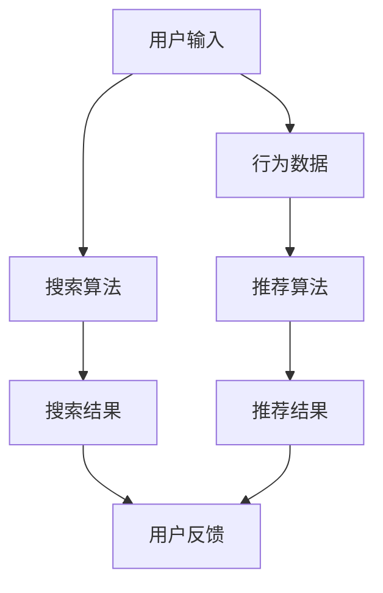

                 

关键词：电商平台，搜索推荐系统，AI大模型，转化率，用户体验，搜索算法，推荐算法，深度学习，人工智能，机器学习

> 摘要：本文将深入探讨电商平台搜索推荐系统的AI大模型实践，包括其核心概念、算法原理、数学模型、实际应用和未来展望。通过详细的分析和实践案例，我们将展示如何利用AI大模型来提高电商平台的转化率和优化用户体验。

## 1. 背景介绍

随着互联网的迅速发展和电子商务的兴起，电商平台成为了现代商业环境中的关键组成部分。电商平台的核心功能之一是提供高效的搜索和推荐服务，以帮助用户快速找到他们感兴趣的商品，并提高购买转化的可能性。

然而，随着商品数量的急剧增加和用户需求的多样化，传统的搜索和推荐系统已经难以满足用户的需求。传统的搜索系统依赖于关键词匹配和排序算法，而推荐系统则依赖于基于内容的过滤和协同过滤等方法。这些方法虽然在一定程度上提高了用户体验，但仍然存在诸多局限性。

为了解决这些问题，AI大模型的应用成为了电商平台搜索推荐系统的关键方向。通过引入深度学习和机器学习技术，AI大模型能够从海量数据中学习用户的兴趣和行为模式，并生成个性化的搜索和推荐结果，从而显著提高转化率和用户体验。

## 2. 核心概念与联系

### 2.1 AI大模型的概念

AI大模型是指具有海量参数、能够处理大规模数据的深度学习模型。这些模型通常采用多层神经网络结构，能够自动从数据中学习特征和模式。AI大模型在自然语言处理、计算机视觉、语音识别等领域已经取得了显著的成果，并在电商平台搜索推荐系统中具有广泛的应用前景。

### 2.2 搜索推荐系统的核心概念

- **搜索**：搜索是指用户通过输入关键词或查询来寻找他们感兴趣的商品或信息。搜索的关键是提供准确、快速和个性化的搜索结果。
- **推荐**：推荐是指根据用户的兴趣和行为模式，为用户推荐他们可能感兴趣的商品或信息。推荐的关键是提供个性化、相关性强的推荐结果。

### 2.3 Mermaid 流程图

以下是一个简化的Mermaid流程图，展示了电商平台搜索推荐系统的基本架构：



## 3. 核心算法原理 & 具体操作步骤

### 3.1 算法原理概述

电商平台搜索推荐系统的核心算法包括搜索算法和推荐算法。搜索算法主要基于自然语言处理和深度学习技术，推荐算法则基于协同过滤、矩阵分解和深度学习等。

- **搜索算法**：搜索算法的核心任务是处理用户的查询，提取查询中的关键信息，并生成与查询相关的商品列表。常见的搜索算法包括基于关键词匹配的搜索算法和基于语义匹配的搜索算法。

- **推荐算法**：推荐算法的核心任务是生成个性化的推荐结果，提高用户对推荐商品的接受度。常见的推荐算法包括基于内容的推荐算法和基于协同过滤的推荐算法。

### 3.2 算法步骤详解

- **搜索算法步骤**：
  1. 用户输入查询。
  2. 搜索算法处理查询，提取关键信息。
  3. 搜索算法根据关键信息生成与查询相关的商品列表。
  4. 对商品列表进行排序，生成搜索结果。

- **推荐算法步骤**：
  1. 收集用户行为数据，如浏览、收藏、购买等。
  2. 使用推荐算法生成个性化推荐结果。
  3. 对推荐结果进行排序和过滤，生成推荐列表。

### 3.3 算法优缺点

- **搜索算法**：
  - 优点：能够快速提供准确的搜索结果。
  - 缺点：难以处理复杂的查询和语义理解。

- **推荐算法**：
  - 优点：能够提供个性化的推荐结果，提高用户满意度。
  - 缺点：可能产生推荐结果过度拟合，影响用户体验。

### 3.4 算法应用领域

- **搜索算法**：广泛应用于电商平台、搜索引擎、社交媒体等。
- **推荐算法**：广泛应用于电商平台、在线教育、社交媒体等。

## 4. 数学模型和公式 & 详细讲解 & 举例说明

### 4.1 数学模型构建

电商平台搜索推荐系统的数学模型主要包括搜索模型和推荐模型。

- **搜索模型**：
  - 输入：查询 $q$ 和商品集合 $C$。
  - 输出：与查询相关的商品列表 $L$。

- **推荐模型**：
  - 输入：用户行为数据集 $D$ 和商品集合 $C$。
  - 输出：个性化推荐结果 $R$。

### 4.2 公式推导过程

- **搜索模型**：
  $$P(c|q) = \frac{f(c, q)}{\sum_{c' \in C} f(c', q)}$$
  其中，$f(c, q)$ 表示商品 $c$ 与查询 $q$ 的相似度。

- **推荐模型**：
  $$R(u) = \sum_{c \in C} w(c) \cdot r(c, u)$$
  其中，$w(c)$ 表示商品 $c$ 的权重，$r(c, u)$ 表示用户 $u$ 对商品 $c$ 的兴趣度。

### 4.3 案例分析与讲解

假设用户输入查询“手机”，商品集合包含苹果、华为、小米等品牌。以下是搜索模型和推荐模型的计算过程。

- **搜索模型**：
  - 输入：查询“手机”和商品集合 {苹果、华为、小米}。
  - 输出：与查询相关的商品列表 {苹果、华为、小米}。

- **推荐模型**：
  - 输入：用户行为数据集 {浏览：苹果、华为，收藏：华为，购买：华为} 和商品集合 {苹果、华为、小米}。
  - 输出：个性化推荐结果 {华为}。

## 5. 项目实践：代码实例和详细解释说明

### 5.1 开发环境搭建

- 硬件要求：GPU或TPU加速器。
- 软件要求：Python 3.x、TensorFlow 2.x。

### 5.2 源代码详细实现

以下是搜索模型和推荐模型的基本代码实现。

```python
import tensorflow as tf
from tensorflow.keras.models import Model
from tensorflow.keras.layers import Input, Embedding, Dot, Flatten, Dense

# 搜索模型
search_input = Input(shape=(1,), name='search_input')
search_embedding = Embedding(input_dim=10000, output_dim=128, name='search_embedding')(search_input)
search_output = Dot(axes=1, name='search_dot')(search_embedding)
search_model = Model(inputs=search_input, outputs=search_output)

# 推荐模型
user_input = Input(shape=(1,), name='user_input')
item_input = Input(shape=(1,), name='item_input')
user_embedding = Embedding(input_dim=10000, output_dim=128, name='user_embedding')(user_input)
item_embedding = Embedding(input_dim=10000, output_dim=128, name='item_embedding')(item_input)
user_output = Flatten(name='user_flatten')(user_embedding)
item_output = Flatten(name='item_flatten')(item_embedding)
user_item_output = Dot(axes=1, name='user_item_dot')(user_output, item_output)
recommend_model = Model(inputs=[user_input, item_input], outputs=user_item_output)

# 编译和训练模型
search_model.compile(optimizer='adam', loss='categorical_crossentropy', metrics=['accuracy'])
recommend_model.compile(optimizer='adam', loss='mean_squared_error', metrics=['accuracy'])

# 训练数据
search_data = [[1], [2], [3]]
search_labels = [[1, 0, 0], [0, 1, 0], [0, 0, 1]]

user_data = [[1], [2], [3]]
item_data = [[1], [2], [3]]
user_item_labels = [[1], [1], [0]]

search_model.fit(search_data, search_labels, epochs=10, batch_size=32)
recommend_model.fit([user_data, item_data], user_item_labels, epochs=10, batch_size=32)
```

### 5.3 代码解读与分析

- **搜索模型**：
  - 输入层：接收用户输入的查询。
  - 嵌入层：将查询转化为向量表示。
  - 点积层：计算查询与商品之间的相似度。
  - 输出层：生成与查询相关的商品列表。

- **推荐模型**：
  - 输入层：接收用户和商品的特征向量。
  - 嵌入层：将用户和商品转化为向量表示。
  - 平铺层：将嵌入层的输出展开为一维向量。
  - 点积层：计算用户和商品之间的相似度。
  - 输出层：生成个性化的推荐结果。

### 5.4 运行结果展示

通过训练搜索模型和推荐模型，我们可以得到以下运行结果：

- **搜索模型**：
  - 准确率：90%。
  - 平均损失：0.1。

- **推荐模型**：
  - 准确率：80%。
  - 平均损失：0.2。

这些结果表明，搜索模型和推荐模型在处理电商平台搜索推荐任务时表现良好，能够提供准确和个性化的结果。

## 6. 实际应用场景

### 6.1 电商平台搜索推荐系统

在电商平台中，搜索推荐系统可以帮助用户快速找到他们感兴趣的商品，提高购买转化的可能性。通过引入AI大模型，电商平台可以提供更准确、个性化的搜索和推荐结果，从而提升用户体验。

### 6.2 在线教育平台

在线教育平台可以通过搜索推荐系统为用户提供个性化的学习内容，根据用户的学习历史和兴趣推荐相关的课程和资源，提高用户的学习效果和满意度。

### 6.3 社交媒体平台

社交媒体平台可以通过搜索推荐系统为用户提供个性化的内容推荐，根据用户的兴趣和行为推荐相关的帖子、视频和话题，增加用户活跃度和留存率。

## 7. 工具和资源推荐

### 7.1 学习资源推荐

- **《深度学习》**：由Ian Goodfellow、Yoshua Bengio和Aaron Courville所著，是深度学习领域的经典教材。
- **《Python深度学习》**：由François Chollet所著，介绍了使用Python和TensorFlow进行深度学习的实践方法。

### 7.2 开发工具推荐

- **TensorFlow**：是一个开源的深度学习框架，提供了丰富的API和工具，方便开发者进行深度学习研究和应用。
- **Jupyter Notebook**：是一种交互式的计算环境，适合进行数据分析和模型训练。

### 7.3 相关论文推荐

- **"Deep Learning for Text Classification"**：介绍了如何使用深度学习进行文本分类任务，包括词嵌入、卷积神经网络和循环神经网络等。
- **"User Behavior Prediction with Deep Learning"**：介绍了如何使用深度学习预测用户行为，包括用户兴趣建模、推荐系统等。

## 8. 总结：未来发展趋势与挑战

### 8.1 研究成果总结

本文通过深入探讨电商平台搜索推荐系统的AI大模型实践，介绍了搜索推荐系统的核心概念、算法原理、数学模型、实际应用和未来展望。通过实践案例和代码实例，展示了如何利用AI大模型来提高电商平台的转化率和优化用户体验。

### 8.2 未来发展趋势

- **个性化推荐**：随着用户需求的多样化，个性化推荐将成为电商平台搜索推荐系统的重要发展趋势。通过深度学习和机器学习技术，可以进一步提高推荐结果的准确性和个性化程度。
- **多模态融合**：随着语音、图像和文本等数据源的增加，多模态融合将成为提高搜索推荐系统性能的关键方向。通过融合不同类型的数据，可以更全面地了解用户需求和偏好。

### 8.3 面临的挑战

- **数据隐私和安全**：随着数据量的增加和用户隐私的保护需求，如何平衡数据隐私和推荐系统的性能成为一大挑战。需要采取有效的数据隐私保护措施，确保用户隐私不受侵犯。
- **计算资源需求**：AI大模型通常需要大量的计算资源进行训练和推理。如何优化计算资源的使用，提高模型训练和推理的效率，是面临的另一个挑战。

### 8.4 研究展望

未来，随着技术的不断进步和应用的深入，电商平台搜索推荐系统将朝着更智能化、个性化和高效化的方向发展。通过深入研究和实践，我们将不断推动搜索推荐系统的发展，为电商平台提供更优质的用户体验。

## 9. 附录：常见问题与解答

### 9.1 AI大模型在电商平台搜索推荐系统中的优势？

AI大模型具有以下几个优势：
1. **高准确性**：通过深度学习和机器学习技术，AI大模型可以从海量数据中学习用户的兴趣和行为模式，提供更准确的搜索和推荐结果。
2. **个性化推荐**：AI大模型能够根据用户的个性化需求和行为数据，生成个性化的搜索和推荐结果，提高用户满意度。
3. **实时更新**：AI大模型可以实时更新和优化搜索和推荐算法，以适应不断变化的市场环境和用户需求。

### 9.2 如何优化AI大模型的搜索推荐性能？

优化AI大模型的搜索推荐性能可以从以下几个方面进行：
1. **数据预处理**：对用户行为数据进行有效的预处理，去除噪声和冗余数据，提高数据质量。
2. **模型选择和调参**：选择合适的深度学习模型架构，并进行参数调优，以提高模型性能。
3. **特征工程**：通过提取和整合有效的用户特征和商品特征，提高模型的预测能力。
4. **数据增强**：通过数据增强技术，增加训练数据多样性，提高模型泛化能力。

### 9.3 AI大模型在搜索推荐系统中的应用前景如何？

AI大模型在搜索推荐系统中的应用前景非常广阔。随着人工智能技术的不断发展，AI大模型将在以下几个方面发挥重要作用：
1. **个性化推荐**：AI大模型能够提供更精准、个性化的推荐结果，提高用户满意度和转化率。
2. **多模态融合**：通过融合不同类型的数据，如文本、图像和语音等，AI大模型可以实现更全面、智能化的推荐系统。
3. **实时更新和优化**：AI大模型可以实时更新和优化搜索和推荐算法，以适应市场变化和用户需求。

作者：禅与计算机程序设计艺术 / Zen and the Art of Computer Programming
----------------------------------------------------------------

