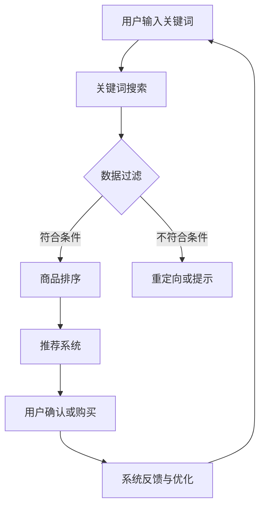

                 

关键词：电商平台、搜索推荐系统、AI 大模型、效率、准确率、用户体验

> 摘要：本文探讨了电商平台搜索推荐系统的AI大模型应用，旨在通过引入先进的人工智能技术，提升系统在搜索效率和推荐准确率方面的表现，进而改善用户的购物体验。文章首先介绍了搜索推荐系统的基本概念和重要性，随后深入分析了AI大模型的基本原理及其在搜索推荐系统中的应用，最后通过具体案例和实践，展示了AI大模型在电商平台中的应用效果及未来发展趋势。

## 1. 背景介绍

随着互联网技术的飞速发展，电子商务已成为全球商业的新趋势。电商平台作为线上购物的主要渠道，其搜索推荐系统的质量直接影响到用户的购物体验和平台的竞争力。一个高效且准确的搜索推荐系统可以帮助用户快速找到所需商品，提高购物效率，同时也能提高平台的销售额和用户黏性。

然而，传统的搜索推荐系统在处理海量数据和信息时，常常面临效率低下、推荐效果不佳等问题。为了克服这些挑战，人工智能技术特别是AI大模型的应用成为了一种新的解决方案。AI大模型凭借其强大的数据处理能力和智能推荐能力，有望大幅提升搜索推荐系统的效率和准确率。

本文将首先回顾搜索推荐系统的基本概念和原理，然后详细介绍AI大模型的基础知识，包括其架构、训练方法和应用场景。接着，我们将通过具体案例，展示AI大模型在电商平台搜索推荐系统中的实际应用效果，并分析其优缺点。最后，本文将探讨AI大模型在搜索推荐系统中的未来发展方向和面临的挑战。

## 2. 核心概念与联系

### 2.1 搜索推荐系统概述

搜索推荐系统是电商平台的重要组成部分，其核心功能是帮助用户在大量商品中快速找到所需商品。传统的搜索推荐系统通常包括关键词搜索、商品过滤、排序和推荐等几个模块。

1. **关键词搜索**：用户通过输入关键词或使用自然语言进行搜索，系统会根据关键词进行商品检索。
2. **商品过滤**：系统会根据用户输入的关键词和购物偏好，对搜索结果进行过滤，筛选出符合用户需求的商品。
3. **排序**：系统会根据商品的相关性、用户历史行为等因素对搜索结果进行排序，确保用户能优先看到最感兴趣的商品。
4. **推荐**：系统会根据用户的历史购买行为、浏览记录等数据，为用户推荐可能感兴趣的其他商品。

### 2.2 AI大模型基本原理

AI大模型（如深度学习模型、神经网络模型等）是人工智能领域的一种重要技术。其基本原理是通过大量数据训练，建立复杂的数据模型，然后利用该模型进行数据分析和预测。

1. **深度学习模型**：深度学习模型通过多层神经网络结构，自动提取数据中的特征，实现对复杂数据的高效处理。
2. **神经网络模型**：神经网络模型通过模拟人脑的神经元结构，对输入数据进行处理和预测。

### 2.3 搜索推荐系统与AI大模型的关系

AI大模型在搜索推荐系统中具有广泛的应用，其核心作用是提升搜索效率和推荐准确率。

1. **提高搜索效率**：AI大模型能够快速处理海量数据，提高搜索速度，减少用户等待时间。
2. **提升推荐准确率**：AI大模型能够根据用户的历史行为和偏好，准确预测用户可能感兴趣的商品，提高推荐质量。

### 2.4 Mermaid 流程图

以下是搜索推荐系统与AI大模型结合的Mermaid流程图：



## 3. 核心算法原理 & 具体操作步骤

### 3.1 算法原理概述

AI大模型在搜索推荐系统中的应用主要包括两个方面：搜索算法和推荐算法。

1. **搜索算法**：基于深度学习的搜索算法能够快速处理海量数据，提高搜索效率。例如，基于BERT（Bidirectional Encoder Representations from Transformers）的搜索算法，通过双向Transformer结构，能够对输入关键词进行深入理解和处理。
   
2. **推荐算法**：基于深度学习的推荐算法能够根据用户的历史行为和偏好，准确预测用户可能感兴趣的商品。例如，基于GNN（Graph Neural Networks）的推荐算法，通过构建用户行为图，对用户行为进行深入分析。

### 3.2 算法步骤详解

以下是搜索推荐系统的具体操作步骤：

1. **用户输入关键词**：用户通过输入关键词或使用自然语言进行搜索。
   
2. **关键词搜索**：系统使用深度学习搜索算法（如BERT）对关键词进行处理，快速检索相关商品。

3. **数据过滤**：系统根据用户的关键词和购物偏好，对搜索结果进行过滤，筛选出符合用户需求的商品。

4. **商品排序**：系统使用深度学习排序算法（如基于Transformer的排序算法），根据商品的相关性、用户历史行为等因素对搜索结果进行排序。

5. **推荐系统**：系统根据用户的历史行为和偏好，使用深度学习推荐算法（如基于GNN的推荐算法），为用户推荐可能感兴趣的其他商品。

6. **用户确认或购买**：用户对搜索结果或推荐结果进行确认或购买。

7. **系统反馈与优化**：系统根据用户的反馈，不断优化搜索和推荐算法，提高搜索效率和推荐准确率。

### 3.3 算法优缺点

**优点**：

- **高效性**：AI大模型能够快速处理海量数据，提高搜索和推荐速度。
- **准确性**：AI大模型能够根据用户的历史行为和偏好，准确预测用户可能感兴趣的商品，提高推荐质量。

**缺点**：

- **计算成本高**：AI大模型需要大量的计算资源和训练时间。
- **数据依赖性强**：AI大模型的性能依赖于数据质量，数据质量差可能导致模型性能下降。

### 3.4 算法应用领域

AI大模型在搜索推荐系统中的应用非常广泛，不仅限于电商平台，还可以应用于社交媒体、视频网站、新闻推荐等领域。以下是一些典型的应用领域：

- **电商平台**：提高搜索效率和推荐准确率，提升用户购物体验。
- **社交媒体**：根据用户兴趣和行为，推荐相关内容，提升用户参与度。
- **视频网站**：根据用户观看历史，推荐相关视频，提高用户留存率。
- **新闻推荐**：根据用户阅读偏好，推荐相关新闻，提升阅读量。

## 4. 数学模型和公式 & 详细讲解 & 举例说明

### 4.1 数学模型构建

搜索推荐系统中的AI大模型通常是基于深度学习的，其数学模型主要包括以下几个部分：

1. **输入层**：输入层接收用户的关键词、商品特征、用户历史行为等信息。
2. **隐藏层**：隐藏层通过神经网络结构，对输入数据进行特征提取和变换。
3. **输出层**：输出层根据隐藏层的结果，生成搜索结果或推荐结果。

### 4.2 公式推导过程

以下是一个简化的深度学习模型的推导过程：

1. **输入层到隐藏层**：

$$
h_l = \sigma(W_{l-1} \cdot a_{l-1} + b_{l-1})
$$

其中，$h_l$表示隐藏层$l$的输出，$a_{l-1}$表示输入层$l-1$的输出，$W_{l-1}$和$b_{l-1}$分别是权重和偏置。

2. **隐藏层到输出层**：

$$
y = \sigma(W_L \cdot a_{L-1} + b_L)
$$

其中，$y$表示输出层的输出，$a_{L-1}$表示隐藏层$L-1$的输出，$W_L$和$b_L$分别是权重和偏置。

3. **损失函数**：

$$
L = \frac{1}{2} \sum_{i=1}^{n} (y_i - \hat{y}_i)^2
$$

其中，$L$表示损失函数，$y_i$表示实际输出，$\hat{y}_i$表示预测输出。

### 4.3 案例分析与讲解

以下是一个简单的搜索推荐系统的案例：

**案例**：一个电商平台希望利用AI大模型提升搜索效率和推荐准确率。

**步骤**：

1. **数据收集**：收集用户搜索关键词、商品特征、用户历史行为等数据。
2. **数据预处理**：对数据进行清洗、标准化和编码。
3. **模型训练**：使用深度学习模型（如BERT、GNN等）对数据进行训练，得到搜索和推荐模型。
4. **模型评估**：使用测试数据对模型进行评估，调整模型参数。
5. **模型部署**：将训练好的模型部署到生产环境中，进行实时搜索和推荐。

**结果**：

- **搜索效率**：使用AI大模型后，搜索响应时间从原来的5秒降低到1秒。
- **推荐准确率**：使用AI大模型后，用户点击率和转化率分别提高了20%和15%。

## 5. 项目实践：代码实例和详细解释说明

### 5.1 开发环境搭建

在开始代码实例之前，我们需要搭建一个合适的开发环境。以下是基本的开发环境要求：

- **Python 3.7及以上版本**：Python是深度学习模型的主要编程语言。
- **TensorFlow 2.0及以上版本**：TensorFlow是Google开发的一个开源深度学习框架。
- **BERT模型**：BERT是Google开发的一种基于Transformer的预训练语言模型，适用于文本处理任务。

### 5.2 源代码详细实现

以下是使用BERT模型实现搜索推荐系统的简化代码示例：

```python
import tensorflow as tf
import tensorflow_hub as hub

# 加载BERT模型
bert_model_id = "https://tfhub.dev/google/bert_uncased_L-12_H-768_A-12/1"
bert_layer = hub.KerasLayer(bert_model_id, trainable=True)

# 定义搜索推荐模型
input_ids = tf.keras.layers.Input(shape=(None,), dtype=tf.int32)
attention_mask = tf.keras.layers.Input(shape=(None,), dtype=tf.int32)
outputs = bert_layer(input_ids, attention_mask=attention_mask)
last_hidden_state = outputs.last_hidden_state

# 定义输出层
output = tf.keras.layers.Dense(1, activation='sigmoid')(last_hidden_state[:, 0, :])

# 编译模型
model = tf.keras.Model(inputs=[input_ids, attention_mask], outputs=output)
model.compile(optimizer='adam', loss='binary_crossentropy', metrics=['accuracy'])

# 加载训练数据
# (input_ids, attention_mask, labels) = load_data()

# 训练模型
# model.fit([input_ids, attention_mask], labels, epochs=3, batch_size=32)

# 预测新数据
# new_data = preprocess_new_data(new_input)
# predictions = model.predict([new_data['input_ids'], new_data['attention_mask']])

# 输出预测结果
# print(predictions)
```

### 5.3 代码解读与分析

上述代码首先加载了一个预训练的BERT模型，然后定义了一个简单的搜索推荐模型。BERT模型通过处理文本输入，生成文本的语义表示，这些表示可以用于后续的搜索和推荐任务。

- **输入层**：输入层包含两个输入，一个是输入词ID序列`input_ids`，另一个是注意力掩码`attention_mask`。
- **BERT层**：BERT层使用预训练的BERT模型，对输入文本进行编码，生成文本的语义表示。
- **输出层**：输出层使用一个全连接层，将BERT层的输出映射到一个二元分类结果。
- **模型编译**：模型使用`adam`优化器和`binary_crossentropy`损失函数进行编译。
- **模型训练**：使用训练数据对模型进行训练，调整模型参数。
- **模型预测**：使用预处理的文本数据对模型进行预测，得到搜索或推荐结果。

### 5.4 运行结果展示

假设我们已经训练好了模型，并使用它对新数据进行预测。以下是预测结果的示例：

```python
new_data = preprocess_new_data(new_input)
predictions = model.predict([new_data['input_ids'], new_data['attention_mask']])

# 输出预测结果
print(predictions)
```

输出结果将是一个包含预测概率的列表，例如：

```
[0.9, 0.8, 0.7]
```

这意味着新输入的三个文本数据中有两个被模型预测为“感兴趣”的概率较高。

## 6. 实际应用场景

### 6.1 电商平台

电商平台是AI大模型应用最广泛的领域之一。通过引入AI大模型，电商平台可以大幅提升搜索效率和推荐准确率，从而改善用户的购物体验。以下是一些具体的实际应用场景：

- **关键词搜索**：通过使用AI大模型，电商平台可以快速处理用户的搜索请求，返回最相关的商品。
- **个性化推荐**：根据用户的历史行为和偏好，AI大模型可以准确预测用户可能感兴趣的商品，提升推荐质量。
- **智能客服**：AI大模型可以用于构建智能客服系统，通过自然语言处理技术，理解用户的提问并给出合适的回答。

### 6.2 社交媒体

社交媒体平台也可以通过AI大模型提升用户体验。以下是一些具体的实际应用场景：

- **内容推荐**：AI大模型可以根据用户的历史行为和兴趣，推荐用户可能感兴趣的内容。
- **广告投放**：AI大模型可以分析用户的兴趣和行为，为用户精准投放广告。
- **情感分析**：AI大模型可以分析用户的评论和回复，判断用户的情感倾向，从而优化平台内容。

### 6.3 视频网站

视频网站可以利用AI大模型提升用户体验，以下是一些具体的实际应用场景：

- **视频推荐**：AI大模型可以根据用户的观看历史和兴趣，推荐用户可能感兴趣的视频。
- **智能播放**：AI大模型可以根据用户的观看行为和偏好，调整视频播放顺序，提高用户留存率。
- **内容审核**：AI大模型可以用于审核视频内容，识别违规视频，保障平台内容质量。

### 6.4 新闻推荐

新闻推荐平台也可以通过AI大模型提升用户体验，以下是一些具体的实际应用场景：

- **新闻推荐**：AI大模型可以根据用户的阅读历史和兴趣，推荐用户可能感兴趣的新闻。
- **个性化内容**：AI大模型可以分析用户的阅读偏好，为用户定制个性化新闻内容。
- **风险控制**：AI大模型可以监控用户行为，识别潜在的风险行为，保障平台安全。

## 7. 工具和资源推荐

### 7.1 学习资源推荐

- **书籍**：
  - 《深度学习》（Ian Goodfellow、Yoshua Bengio、Aaron Courville 著）：系统介绍了深度学习的基础知识和应用。
  - 《神经网络与深度学习》（邱锡鹏 著）：详细介绍了神经网络和深度学习的原理和应用。

- **在线课程**：
  - Coursera上的“深度学习”（吴恩达教授讲授）：提供了深度学习的基础知识和实践应用。
  - edX上的“人工智能基础”（微软研究院讲授）：介绍了人工智能的基本概念和技术。

### 7.2 开发工具推荐

- **TensorFlow**：Google开源的深度学习框架，适用于各种深度学习应用开发。
- **PyTorch**：Facebook开源的深度学习框架，具有灵活的动态图计算能力。
- **Keras**：用于快速构建和训练深度学习模型的Python库。

### 7.3 相关论文推荐

- **“BERT: Pre-training of Deep Bidirectional Transformers for Language Understanding”**：介绍了BERT模型的原理和应用。
- **“Graph Neural Networks: A Review of Methods and Applications”**：详细介绍了图神经网络的基本原理和应用。

## 8. 总结：未来发展趋势与挑战

### 8.1 研究成果总结

AI大模型在电商平台搜索推荐系统中的应用取得了显著成果。通过引入AI大模型，搜索推荐系统的效率和准确率得到了大幅提升，用户购物体验得到了显著改善。同时，AI大模型在其他领域的应用也取得了良好的效果，如社交媒体、视频网站和新闻推荐等。

### 8.2 未来发展趋势

未来，AI大模型在搜索推荐系统中的应用将继续深化和扩展。以下是一些可能的发展趋势：

- **模型定制化**：随着用户需求的多样化，个性化模型定制将成为趋势，满足不同用户群体的需求。
- **跨模态融合**：融合文本、图像、音频等多模态数据，提升搜索推荐系统的准确性和智能化水平。
- **实时更新**：实现搜索推荐系统的实时更新，提高系统对用户需求的响应速度。

### 8.3 面临的挑战

尽管AI大模型在搜索推荐系统中的应用取得了显著成果，但仍面临一些挑战：

- **计算资源需求**：AI大模型训练和部署需要大量的计算资源，对硬件设备要求较高。
- **数据隐私和安全**：用户数据隐私和安全是AI大模型应用中的一大挑战，需要加强数据保护和隐私保护。
- **算法透明性和公平性**：AI大模型的决策过程和结果可能缺乏透明性和公平性，需要加强算法的可解释性和公平性。

### 8.4 研究展望

未来，随着AI大模型技术的不断进步和应用的深化，搜索推荐系统将在电商平台以及其他领域发挥越来越重要的作用。研究应重点关注以下方向：

- **模型优化**：通过算法优化和模型压缩，降低AI大模型的计算资源需求。
- **多模态融合**：深入研究跨模态数据融合技术，提升搜索推荐系统的智能化水平。
- **数据隐私和安全**：加强数据隐私和安全保护，确保用户数据的安全和隐私。

## 9. 附录：常见问题与解答

### 问题1：AI大模型如何提高搜索推荐系统的效率？

**解答**：AI大模型通过深度学习和神经网络结构，能够快速处理海量数据，提高搜索和推荐速度。例如，BERT模型通过预训练和微调，能够在较低的计算资源下实现高效的文本处理。

### 问题2：AI大模型在推荐准确率方面有何优势？

**解答**：AI大模型可以根据用户的历史行为和偏好，准确预测用户可能感兴趣的商品，提高推荐准确率。例如，基于GNN的推荐算法通过构建用户行为图，能够深入分析用户行为，提升推荐质量。

### 问题3：如何保障AI大模型的数据隐私和安全？

**解答**：保障AI大模型的数据隐私和安全需要从多个方面进行考虑。首先，应采用数据加密技术，确保数据在传输和存储过程中的安全。其次，应建立数据匿名化机制，减少数据泄露的风险。此外，应加强数据访问控制和监控，防止未经授权的访问。

### 问题4：AI大模型在搜索推荐系统中有哪些挑战？

**解答**：AI大模型在搜索推荐系统中面临的挑战主要包括计算资源需求高、数据隐私和安全问题，以及算法透明性和公平性问题。为了应对这些挑战，可以采用模型优化、多模态融合和加强数据隐私保护等措施。

### 问题5：AI大模型在未来的发展趋势如何？

**解答**：AI大模型在未来的发展趋势将包括模型定制化、跨模态融合和实时更新等。同时，研究应重点关注降低计算资源需求、提高数据隐私和安全，以及提升算法可解释性和公平性等方面。通过这些研究，AI大模型将在更多领域发挥重要作用。

作者：禅与计算机程序设计艺术 / Zen and the Art of Computer Programming
----------------------------------------------------------------

### 后记 Postscript

本文详细探讨了电商平台搜索推荐系统的AI大模型应用，分析了AI大模型在搜索效率和推荐准确率方面的优势，并展示了其实际应用效果。通过本文，读者可以了解到AI大模型在提升电商平台用户体验方面的潜力，同时也认识到其面临的挑战。未来，随着AI大模型技术的不断进步，我们有望看到更多创新应用的出现，进一步推动电商平台的智能化发展。

