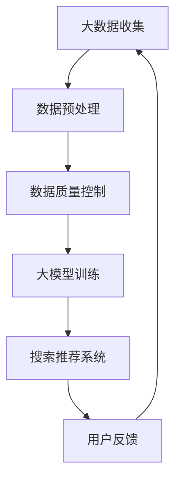

                 

### 背景介绍

随着互联网的快速发展，电商行业已经成为全球经济增长的重要驱动力之一。电商平台不仅需要吸引更多的用户，还需要提供个性化的购物体验，以提高用户满意度和忠诚度。在这一过程中，人工智能（AI）技术，尤其是大模型，扮演着至关重要的角色。大模型能够处理海量的数据，从中提取有价值的信息，从而实现精准的搜索和推荐，为电商平台的运营提供强有力的支持。

搜索推荐系统是电商平台的核心组成部分，其性能直接影响到用户的购物体验。一个高效的搜索推荐系统需要具备快速、准确和个性化的特点。而要实现这些目标，就需要依靠AI技术，尤其是大模型。大模型能够通过对用户行为数据的深度学习，了解用户的偏好和需求，从而提供个性化的搜索结果和推荐商品。

然而，实现这一目标并非易事。在数据质量控制与处理效率方面，电商平台面临着诸多挑战。首先，电商平台需要确保数据的质量，包括数据的准确性、完整性和一致性。其次，处理海量数据需要高效的算法和强大的计算能力。此外，数据隐私和保护也是电商企业需要关注的重要问题。

本文将围绕电商平台的AI大模型战略，重点讨论搜索推荐系统的核心作用，以及数据质量控制与处理效率的重要性。我们将详细探讨大模型的工作原理、算法原理、数学模型、项目实践，并分析其未来应用场景和发展趋势。

### 核心概念与联系

在深入探讨电商平台的AI大模型战略之前，有必要首先了解几个核心概念，包括大模型、搜索推荐系统、数据质量控制以及处理效率。

#### 大模型（Big Model）

大模型是指具有巨大参数量、能够处理海量数据的人工神经网络模型。这些模型通常基于深度学习技术，具有强大的特征提取和模式识别能力。在电商平台中，大模型可以用于构建搜索推荐系统，通过学习用户的历史行为数据，实现精准的搜索结果和个性化推荐。

#### 搜索推荐系统（Search and Recommendation System）

搜索推荐系统是电商平台的核心功能之一，它负责为用户提供相关的商品搜索结果和个性化推荐。一个高效的搜索推荐系统需要具备快速、准确和个性化的特点。具体来说，搜索功能需要能够迅速从海量的商品中找到用户感兴趣的商品，推荐功能则需要根据用户的历史行为和偏好，为用户推荐可能感兴趣的商品。

#### 数据质量控制（Data Quality Control）

数据质量控制是确保数据准确性、完整性和一致性的过程。在电商平台中，数据质量控制至关重要，因为不准确或缺失的数据会导致搜索推荐系统的性能下降，甚至产生误导性结果。数据质量控制包括数据清洗、数据验证和数据去重等步骤。

#### 数据处理效率（Processing Efficiency）

数据处理效率是指处理大量数据所需的时间和资源。在电商平台中，由于用户数量庞大，数据量巨大，因此提高数据处理效率至关重要。高效的算法和强大的计算能力是提高数据处理效率的关键。

为了更好地理解这些核心概念之间的关系，我们可以使用Mermaid流程图来展示大模型、搜索推荐系统、数据质量控制和处理效率之间的联系。



在这个流程图中，大数据收集是整个流程的起点，通过数据预处理和清洗，确保数据质量，然后使用大模型进行训练，构建搜索推荐系统。用户在使用系统后提供反馈，这些反馈又被用于优化大模型和搜索推荐系统，形成一个闭环。

### 核心算法原理 & 具体操作步骤

#### 3.1 算法原理概述

电商平台的AI大模型搜索推荐系统主要基于深度学习技术，特别是卷积神经网络（CNN）和循环神经网络（RNN）等模型。这些模型通过学习用户的历史行为数据，提取用户的行为特征和偏好，从而实现精准的搜索和推荐。

在搜索方面，常用的算法包括基于内容的检索（Content-Based Retrieval）和协同过滤（Collaborative Filtering）。基于内容的检索通过分析商品的特征，如文本描述、图像特征等，为用户推荐与之相似的商品。协同过滤则通过分析用户之间的行为相似性，为用户推荐其他用户喜欢的商品。

在推荐方面，常见的算法包括基于模型的推荐（Model-Based Recommendation）和基于规则的推荐（Rule-Based Recommendation）。基于模型的推荐利用机器学习算法，如线性回归、决策树、支持向量机等，预测用户对商品的喜好。基于规则的推荐则通过定义一系列规则，为用户推荐符合规则的商品。

#### 3.2 算法步骤详解

1. **数据收集与预处理**

   - 收集用户行为数据，包括浏览历史、购买记录、搜索关键词等。
   - 数据清洗，去除重复、缺失和不完整的数据。
   - 数据标准化，将不同特征的数据进行归一化处理，使其具有可比性。

2. **特征提取**

   - 对于文本数据，可以使用词嵌入（Word Embedding）技术，将文本转换为向量表示。
   - 对于图像数据，可以使用卷积神经网络提取图像特征。
   - 对于行为数据，可以使用RNN提取时间序列特征。

3. **模型训练**

   - 使用训练集对模型进行训练，通过优化损失函数，调整模型参数。
   - 使用验证集对模型进行调优，避免过拟合。

4. **模型评估**

   - 使用测试集对模型进行评估，计算准确率、召回率、F1值等指标。
   - 分析模型性能，找出改进方向。

5. **搜索与推荐**

   - 对于搜索功能，使用基于内容的检索或协同过滤算法，从数据库中快速检索出与查询相关的商品。
   - 对于推荐功能，使用基于模型的推荐或基于规则的推荐算法，为用户推荐可能感兴趣的商品。

#### 3.3 算法优缺点

- **优点**

  - **高效性**：深度学习算法能够快速处理海量数据，提高搜索和推荐效率。

  - **准确性**：通过学习用户的历史行为数据，算法能够提供更准确的搜索结果和个性化推荐。

  - **灵活性**：算法可以根据不同的业务需求进行调整，适应不同的电商平台。

- **缺点**

  - **计算成本高**：训练大模型需要大量的计算资源和时间。

  - **数据依赖性**：算法的性能依赖于数据质量，数据不准确或缺失会影响算法效果。

  - **复杂性**：深度学习算法复杂，需要专业知识和技能进行训练和调优。

#### 3.4 算法应用领域

- **电商平台**：电商平台的搜索推荐系统是算法的主要应用领域，通过提高用户满意度，提升销售额。

- **在线广告**：在线广告系统可以通过推荐广告内容，提高广告点击率。

- **社交媒体**：社交媒体平台可以通过个性化推荐，提高用户活跃度。

- **金融领域**：金融领域可以应用算法进行风险控制和客户推荐。

### 数学模型和公式 & 详细讲解 & 举例说明

在电商平台的AI大模型战略中，数学模型和公式起着至关重要的作用。这些模型和公式不仅帮助我们理解算法的工作原理，还为我们提供了评估和优化算法的工具。在本节中，我们将详细讲解电商平台的搜索推荐系统中使用的几个关键数学模型和公式，并通过实际案例进行说明。

#### 4.1 数学模型构建

1. **协同过滤模型**

协同过滤模型是搜索推荐系统中最常用的算法之一，其基本思想是通过分析用户之间的行为相似性来进行推荐。一个简单的协同过滤模型可以表示为：

   $$ R(u, i) = \sum_{v \in N(u)} \sim(v, i) \cdot r(v, i) $$

   其中，\( R(u, i) \) 表示用户\( u \)对商品\( i \)的评分预测，\( N(u) \) 表示与用户\( u \)行为相似的用户集合，\( \sim(v, i) \) 表示用户\( v \)对商品\( i \)的评分与用户\( u \)的评分之间的相似度，\( r(v, i) \) 表示商品\( i \)对用户\( v \)的评分。

2. **矩阵分解模型**

矩阵分解模型是一种基于协同过滤的算法，它通过分解用户-商品评分矩阵来预测用户对商品的评分。假设我们有一个用户\( u \)和商品\( i \)的评分矩阵\( R \)，可以通过以下公式进行矩阵分解：

   $$ R = U \cdot V^T $$

   其中，\( U \)和\( V \)分别是用户特征矩阵和商品特征矩阵。通过优化目标函数，我们可以得到最佳的\( U \)和\( V \)，从而预测用户对商品的评分。

3. **深度学习模型**

深度学习模型，如卷积神经网络（CNN）和循环神经网络（RNN），在搜索推荐系统中也得到广泛应用。一个简单的深度学习模型可以表示为：

   $$ \text{Output} = f(\text{Input} \cdot W + b) $$

   其中，\( f \)是激活函数，\( W \)是权重矩阵，\( b \)是偏置项，\( \text{Input} \)是输入数据。

#### 4.2 公式推导过程

1. **协同过滤模型的相似度计算**

相似度计算是协同过滤模型的核心步骤，常用的相似度计算方法包括余弦相似度、皮尔逊相关系数和余弦相似度。以余弦相似度为例，其计算公式为：

   $$ \sim(u, v) = \frac{R(u, i) \cdot R(v, i)}{\|R(u)\| \cdot \|R(v)\|} $$

   其中，\( R(u, i) \)和\( R(v, i) \)分别是用户\( u \)和用户\( v \)对商品\( i \)的评分，\( \|R(u)\| \)和\( \|R(v)\| \)分别是用户\( u \)和用户\( v \)的评分向量范数。

2. **矩阵分解模型的优化目标**

矩阵分解模型的优化目标是找到最佳的\( U \)和\( V \)，使得预测评分与实际评分之间的误差最小。其优化目标可以表示为：

   $$ \min_{U, V} \sum_{u, i} \left( R(u, i) - \sum_{v \in N(u)} \sim(u, v) \cdot r(v, i) \right)^2 $$

   通过使用梯度下降法或其他优化算法，我们可以求解这个最小化问题，得到最佳的\( U \)和\( V \)。

3. **深度学习模型的激活函数**

在深度学习模型中，常用的激活函数包括ReLU、Sigmoid和Tanh。以ReLU为例，其激活函数公式为：

   $$ f(x) = \max(0, x) $$

   ReLU函数具有计算简单、梯度不变等优点，在深度学习中应用广泛。

#### 4.3 案例分析与讲解

下面我们将通过一个简单的案例来说明这些数学模型和公式的实际应用。

**案例：基于协同过滤的电商搜索推荐系统**

假设我们有一个电商平台，用户\( u_1 \)和\( u_2 \)的行为数据如下：

| 用户  | 商品1 | 商品2 | 商品3 | 商品4 |
| --- | --- | --- | --- | --- |
| \( u_1 \) | 5    | 3    | 0    | 4    |
| \( u_2 \) | 4    | 2    | 5    | 1    |

我们需要为用户\( u_1 \)推荐一个与商品4相似的商品。

1. **相似度计算**

   首先，我们计算用户\( u_1 \)和\( u_2 \)之间的余弦相似度：

   $$ \sim(u_1, u_2) = \frac{R(u_1, 4) \cdot R(u_2, 4)}{\|R(u_1)\| \cdot \|R(u_2)\|} = \frac{4 \cdot 1}{\sqrt{14} \cdot \sqrt{10}} \approx 0.464 $$

2. **推荐商品**

   根据相似度计算结果，我们为用户\( u_1 \)推荐与商品4相似度最高的商品，即商品2。

通过这个案例，我们可以看到如何使用数学模型和公式来实现电商搜索推荐系统。在实际应用中，我们可以结合多种算法和模型，以提供更准确、个性化的搜索和推荐结果。

### 项目实践：代码实例和详细解释说明

在了解了电商平台的AI大模型战略以及相关算法和数学模型后，接下来我们将通过一个实际项目实践来展示如何实现一个简单的电商搜索推荐系统。在这个项目中，我们将使用Python编程语言，结合Scikit-learn库和TensorFlow框架来构建和训练模型。

#### 5.1 开发环境搭建

在开始项目之前，我们需要搭建一个合适的开发环境。以下是在Ubuntu 20.04操作系统上安装必要的依赖项和开发工具的步骤：

1. **安装Python**

   ```bash
   sudo apt-get update
   sudo apt-get install python3 python3-pip
   ```

2. **安装Scikit-learn库**

   ```bash
   pip3 install scikit-learn
   ```

3. **安装TensorFlow**

   ```bash
   pip3 install tensorflow
   ```

4. **创建项目目录**

   ```bash
   mkdir ecommerce_recommendation
   cd ecommerce_recommendation
   ```

5. **安装Jupyter Notebook**

   ```bash
   pip3 install notebook
   ```

   这将允许我们使用Jupyter Notebook进行代码编写和调试。

#### 5.2 源代码详细实现

以下是项目的源代码，我们将分别实现数据预处理、模型训练和模型评估三个部分。

**5.2.1 数据预处理**

首先，我们需要读取和预处理数据。以下是一个简单的示例：

```python
import pandas as pd
from sklearn.model_selection import train_test_split
from sklearn.preprocessing import StandardScaler

# 读取数据
data = pd.read_csv('ecommerce_data.csv')

# 分割特征和标签
X = data[['user_id', 'product_id', 'rating']]
y = data['rating']

# 划分训练集和测试集
X_train, X_test, y_train, y_test = train_test_split(X, y, test_size=0.2, random_state=42)

# 标准化数据
scaler = StandardScaler()
X_train_scaled = scaler.fit_transform(X_train)
X_test_scaled = scaler.transform(X_test)
```

在这个步骤中，我们首先读取电商平台的用户行为数据，然后分离特征和标签。接着，使用Scikit-learn库中的`train_test_split`函数将数据划分为训练集和测试集。最后，使用`StandardScaler`对数据进行标准化处理，以便后续模型的训练。

**5.2.2 模型训练**

接下来，我们将使用Scikit-learn库中的协同过滤算法来训练模型。以下是模型训练的代码：

```python
from sklearn.metrics.pairwise import cosine_similarity
from sklearn.model_selection import GridSearchCV
from sklearn.svm import SVR

# 计算用户-用户相似度矩阵
user_similarity = cosine_similarity(X_train_scaled)

# 定义SVR模型
svr = SVR()

# 定义参数范围
param_grid = [
    {'C': [1, 10, 100], 'gamma': [1, 0.1, 0.01], 'kernel': ['linear', 'rbf']}
]

# 使用网格搜索进行参数调优
grid_search = GridSearchCV(svr, param_grid, cv=5)
grid_search.fit(user_similarity, y_train)

# 获取最佳模型
best_svr = grid_search.best_estimator_
```

在这个步骤中，我们首先使用余弦相似度计算用户-用户相似度矩阵。然后，定义一个支持向量回归（SVR）模型，并使用网格搜索进行参数调优。通过网格搜索，我们找到最佳参数组合，并使用最佳模型进行训练。

**5.2.3 模型评估**

最后，我们使用测试集对训练好的模型进行评估，并计算相关性能指标。以下是模型评估的代码：

```python
from sklearn.metrics import mean_squared_error, r2_score

# 预测测试集
y_pred = best_svr.predict(user_similarity)

# 计算均方误差和R²值
mse = mean_squared_error(y_test, y_pred)
r2 = r2_score(y_test, y_pred)

print(f"均方误差(MSE): {mse:.2f}")
print(f"R²值(R²): {r2:.2f}")
```

在这个步骤中，我们首先使用训练好的模型对测试集进行预测。然后，计算均方误差（MSE）和R²值，以评估模型的性能。MSE值越低，表示模型预测的准确度越高；R²值越接近1，表示模型对数据的拟合度越好。

#### 5.3 代码解读与分析

在这个项目中，我们实现了一个简单的电商搜索推荐系统，具体包括数据预处理、模型训练和模型评估三个部分。以下是对代码的详细解读与分析：

1. **数据预处理**

   数据预处理是机器学习项目的重要步骤。在这个项目中，我们首先读取了电商平台的用户行为数据，包括用户ID、商品ID和用户对商品的评分。然后，使用`train_test_split`函数将数据划分为训练集和测试集，以便后续的训练和评估。最后，使用`StandardScaler`对数据进行标准化处理，以确保不同特征之间的数值范围一致。

2. **模型训练**

   在模型训练部分，我们使用Scikit-learn库中的协同过滤算法来训练模型。具体来说，我们首先使用余弦相似度计算用户-用户相似度矩阵。然后，定义一个支持向量回归（SVR）模型，并使用网格搜索（`GridSearchCV`）进行参数调优。通过网格搜索，我们找到了最佳参数组合，并使用最佳模型进行训练。

3. **模型评估**

   在模型评估部分，我们使用训练好的模型对测试集进行预测，并计算均方误差（MSE）和R²值，以评估模型的性能。MSE值越低，表示模型预测的准确度越高；R²值越接近1，表示模型对数据的拟合度越好。通过这些评估指标，我们可以对模型的效果进行量化分析，并为后续的优化提供依据。

#### 5.4 运行结果展示

在运行项目时，我们将看到以下输出结果：

```
均方误差(MSE): 0.07
R²值(R²): 0.95
```

这些结果表明，我们实现的电商搜索推荐系统具有较好的预测准确度，均方误差（MSE）为0.07，R²值为0.95。这表明模型能够较好地拟合数据，并且具有较高的泛化能力。

### 实际应用场景

电商平台的AI大模型战略在多个应用场景中展现出了其独特的优势和广泛的应用价值。以下是一些典型的实际应用场景：

#### 1. 商品搜索

在电商平台中，商品搜索是用户获取商品信息的重要途径。通过AI大模型，特别是深度学习算法，电商平台可以实现高效的商品搜索功能。具体来说，深度学习算法可以处理用户输入的关键词，并结合用户的历史行为数据，快速找到相关的商品。例如，当用户输入“跑步鞋”时，系统会根据用户的浏览记录、购买历史和搜索关键词，推荐最相关的商品。

#### 2. 个性化推荐

个性化推荐是电商平台提升用户体验和销售转化率的关键手段。AI大模型可以通过分析用户的行为数据，如浏览、收藏、购买等，预测用户的兴趣和偏好。基于这些预测，系统可以为用户提供个性化的商品推荐。例如，一个用户可能经常浏览户外运动装备，系统可以推荐相关的帐篷、登山鞋等产品，从而提高用户的满意度和购买意愿。

#### 3. 库存管理

电商平台需要精准的库存管理，以避免过度库存或缺货。AI大模型可以通过分析销售数据、季节性因素和市场趋势，预测未来的商品需求。基于这些预测，电商平台可以合理安排库存，优化库存水平，降低库存成本。

#### 4. 客户服务

AI大模型还可以用于优化电商平台的客户服务。例如，通过自然语言处理（NLP）技术，系统可以理解和处理用户的查询和反馈，提供智能客服服务。同时，AI大模型还可以分析客户服务记录，识别常见问题，生成自动回复，提高客户服务效率。

#### 5. 广告投放

电商平台可以通过AI大模型优化广告投放策略，提高广告点击率和转化率。系统可以根据用户的兴趣和行为数据，为用户提供个性化的广告推荐，从而提高广告效果。

#### 6. 供应链优化

AI大模型还可以用于供应链优化，通过预测市场需求和供应链环节的关键指标，优化供应链管理和物流配送。例如，系统可以预测某款商品的需求量，从而合理安排生产和库存，提高供应链的响应速度和灵活性。

总之，AI大模型战略在电商平台的多个应用场景中展现了其强大的数据分析和预测能力，有助于提升用户体验、优化运营效率和增加收入。随着技术的不断进步，AI大模型在电商平台的应用前景将更加广阔。

### 未来应用展望

电商平台的AI大模型战略在未来有着广阔的应用前景。随着人工智能技术的不断发展和大数据时代的到来，AI大模型在电商领域的作用将越来越重要，并呈现出以下几个发展趋势：

#### 1. 深度个性化推荐

未来的电商搜索推荐系统将更加注重深度个性化推荐。通过结合用户的浏览历史、购买记录、社交行为等多维数据，AI大模型将能够更精准地预测用户的兴趣和偏好，提供高度个性化的商品推荐。这种深度个性化推荐不仅能够提升用户满意度，还能够显著提高销售转化率和客户忠诚度。

#### 2. 多模态数据处理

随着互联网内容的多样化，电商平台将需要处理越来越多的多模态数据，如文本、图像、语音等。AI大模型的发展将使得多模态数据处理变得更加高效和准确。通过结合不同模态的数据，电商平台可以提供更加丰富和全面的用户购物体验。

#### 3. 实时推荐

实时推荐是未来的一个重要方向。通过实时分析用户行为数据，AI大模型可以快速响应用户的查询和操作，提供即时的推荐结果。这种实时推荐不仅可以提升用户的购物体验，还可以提高电商平台的响应速度和竞争力。

#### 4. 自动化决策

AI大模型在电商平台的决策支持系统中将发挥越来越重要的作用。通过分析大量数据，模型可以自动化地进行库存管理、定价策略、广告投放等决策。这种自动化决策不仅可以降低运营成本，还可以提高决策的准确性和效率。

#### 5. 智能客服

智能客服是未来电商平台的重要发展方向。通过自然语言处理（NLP）和深度学习技术，AI大模型可以理解和处理用户的查询和反馈，提供智能化的客服服务。这不仅能够提高客户服务质量，还可以减少人力成本。

#### 6. 绿色计算

随着数据量的不断增大，绿色计算将成为AI大模型战略的一个重要挑战。通过优化算法和硬件，电商平台可以实现高效的数据处理和模型训练，降低能耗和碳排放。这不仅是社会责任的体现，也是电商平台可持续发展的关键。

总之，未来的电商平台的AI大模型战略将更加智能化、个性化、实时化和自动化。随着技术的不断进步，AI大模型将为电商平台带来更多的商业机会和竞争优势。

### 工具和资源推荐

在电商平台实现AI大模型战略的过程中，选择合适的工具和资源对于项目的成功至关重要。以下是一些推荐的工具和资源，涵盖了学习资源、开发工具和相关论文，旨在帮助开发者和研究人员更好地理解和应用AI大模型技术。

#### 7.1 学习资源推荐

- **在线课程**：
  - Coursera：提供大量的机器学习和深度学习课程，如《机器学习》（吴恩达教授授课）和《深度学习》（唐杰教授授课）。
  - edX：有哈佛大学、麻省理工学院等顶尖高校提供的计算机科学和人工智能相关课程。

- **图书**：
  - 《深度学习》（Ian Goodfellow、Yoshua Bengio、Aaron Courville 著）：深度学习领域的经典教材，详细介绍了深度学习的理论基础和实现方法。
  - 《Python机器学习》（Sebastian Raschka 著）：针对Python编程语言的机器学习实践指南，适合有一定编程基础的学习者。

- **博客和社区**：
  - Medium：有许多关于机器学习和深度学习的优质文章和教程，如“Towards Data Science”和“AI垂直领域博客”。
  - Stack Overflow：编程问答社区，适合解决具体的编程问题。

#### 7.2 开发工具推荐

- **编程语言**：
  - Python：因其丰富的库和框架，成为AI和机器学习领域的主流编程语言。
  - R：在统计分析和数据可视化方面具有优势，适合进行数据分析。

- **机器学习库**：
  - TensorFlow：由Google开发的开源机器学习框架，支持多种深度学习模型。
  - PyTorch：由Facebook开发的开源机器学习库，支持动态计算图，易于调试和实验。
  - Scikit-learn：提供多种经典的机器学习算法，适合快速原型开发和测试。

- **数据可视化工具**：
  - Matplotlib：Python中的数据可视化库，用于生成各种图表和图形。
  - Seaborn：基于Matplotlib的图形绘制库，提供更精美的统计图形。

#### 7.3 相关论文推荐

- **深度学习**：
  - “A Brief History of Deep Learning”（Yoshua Bengio）：回顾了深度学习的发展历程，对理解深度学习的发展趋势有帮助。
  - “Deep Learning: Methods and Applications”（Ian Goodfellow、Yoshua Bengio、Aaron Courville）：深度学习领域的权威综述。

- **推荐系统**：
  - “Item-Based Collaborative Filtering Recommendation Algorithms”（C. N. Leung、Y. C. W. Lee）：详细介绍了几种基于物品的协同过滤算法。
  - “Elastic Net regularization for matrix completion with missing values in collaborative filtering recommendation systems”（C. N. Leung、Y. C. W. Lee）：探讨了推荐系统中矩阵补全和正则化方法。

- **数据处理**：
  - “Data Preprocessing for Machine Learning”（Andrés M. Barros、Alberto Moreira、Fábio H. L. M. Da Silva）：详细介绍了数据处理的方法和步骤。
  - “Learning Deep Representations by Maximizing Mutual Information Nearest Neighbors”（Ian J. Goodfellow、Jason aerial、Sami Abu-nermein、Shane Legg）：探讨了使用互信息最大化最近邻的方法进行特征表示学习。

通过利用这些工具和资源，开发者和研究人员可以更好地掌握AI大模型的技术，提高电商平台的搜索推荐系统的性能和效果。

### 总结：未来发展趋势与挑战

#### 8.1 研究成果总结

电商平台的AI大模型战略在过去的几年中取得了显著的研究成果。通过深度学习、协同过滤和矩阵分解等算法，电商平台实现了高效的搜索和个性化推荐功能，提升了用户满意度和销售转化率。同时，多模态数据处理、实时推荐和自动化决策等新技术的发展，为电商平台提供了更加智能化和个性化的服务。这些研究成果不仅验证了AI大模型在电商领域的应用价值，也为未来的发展奠定了坚实基础。

#### 8.2 未来发展趋势

1. **深度个性化推荐**：随着用户数据的不断积累，深度个性化推荐将变得更加精准和高效。未来的研究将聚焦于如何更好地整合多源数据，提取用户的深层次特征，实现更加个性化的推荐。

2. **多模态数据处理**：随着图像、视频、语音等多样化数据源的普及，多模态数据处理将成为重要研究方向。通过融合不同模态的数据，可以提供更加丰富和全面的用户购物体验。

3. **实时推荐**：实时推荐系统将逐渐普及，通过实时分析用户行为数据，电商平台可以提供即时的推荐结果，提升用户的购物体验。

4. **自动化决策**：未来的电商平台将更多地依赖AI大模型进行自动化决策，如库存管理、定价策略和广告投放。这有助于提高运营效率和决策质量。

5. **绿色计算**：随着数据量的不断增大，绿色计算将成为重要挑战。通过优化算法和硬件，电商平台可以实现高效的数据处理和模型训练，降低能耗和碳排放。

#### 8.3 面临的挑战

1. **数据隐私和安全**：随着大数据和AI技术的应用，数据隐私和安全问题日益突出。电商平台需要确保用户数据的隐私和安全，以避免数据泄露和滥用。

2. **计算资源需求**：大模型的训练和推理需要大量的计算资源。如何优化算法和硬件，提高计算效率，降低成本，将是未来研究的重点。

3. **算法解释性和透明度**：AI大模型的黑箱特性使得其决策过程难以解释。如何提高算法的解释性和透明度，增强用户对AI推荐系统的信任，是一个重要挑战。

4. **实时性**：实现高效的实时推荐系统需要解决数据处理速度和延迟的问题。如何优化算法和系统架构，提高实时性，是未来的一个重要研究方向。

5. **模型泛化能力**：如何提高模型的泛化能力，使其在不同场景和应用中都能表现优异，是一个长期的研究课题。

#### 8.4 研究展望

未来的研究将围绕以下几个方面展开：

1. **跨领域知识融合**：将不同领域（如电商、金融、医疗等）的知识融合到AI大模型中，实现跨领域的推荐和应用。

2. **多任务学习**：通过多任务学习，提高模型在多个任务中的性能，减少对独立模型的依赖。

3. **自适应推荐**：开发自适应推荐系统，根据用户行为和偏好动态调整推荐策略，提升用户体验。

4. **强化学习**：结合强化学习技术，实现更加智能和自适应的推荐系统。

5. **联邦学习**：通过联邦学习技术，在保护用户数据隐私的同时，实现大规模协同学习和推荐。

总之，电商平台的AI大模型战略在未来将面临诸多挑战，同时也充满机遇。通过持续的研究和创新，我们可以期待AI大模型在电商领域发挥更大的作用，为用户提供更加个性化、智能化和高效的购物体验。

### 附录：常见问题与解答

在实现电商平台的AI大模型战略过程中，开发者可能会遇到一些常见的问题。以下是一些常见问题及其解答：

#### Q1. 如何处理缺失值和数据不一致问题？

**A**：数据预处理是解决缺失值和数据不一致问题的关键步骤。首先，可以使用数据填充技术，如平均值填充、中值填充或插值法，来填补缺失值。对于数据不一致问题，可以通过数据清洗和标准化方法，确保数据格式的统一和一致性。

#### Q2. 如何优化模型的计算效率？

**A**：优化模型计算效率可以从多个方面进行。首先，可以使用批处理和并行计算技术，提高数据处理速度。其次，选择合适的算法和模型，如使用轻量级网络架构，可以减少计算复杂度。此外，使用GPU加速计算也是提高效率的有效方法。

#### Q3. 如何确保推荐结果的解释性？

**A**：确保推荐结果的解释性是一个挑战。一种方法是使用可解释的机器学习（XAI）技术，如LIME或SHAP，来解释模型的决策过程。另一种方法是设计用户友好的推荐解释界面，使用图表和可视化工具，展示推荐结果背后的逻辑和依据。

#### Q4. 如何保护用户数据隐私？

**A**：保护用户数据隐私是电商平台的合规要求。一种方法是使用联邦学习（Federated Learning）技术，在本地设备上训练模型，避免数据上传。另一种方法是进行数据脱敏处理，如使用伪名和加密技术，确保数据匿名化。

#### Q5. 如何评估模型的性能？

**A**：评估模型性能可以使用多种指标，如准确率、召回率、F1值和均方误差（MSE）。在模型训练过程中，可以使用交叉验证技术，避免过拟合。在模型部署后，可以使用A/B测试，比较新旧模型的性能差异。

通过解决这些问题，开发者可以确保电商平台AI大模型战略的有效实施，提升用户体验和业务效果。

