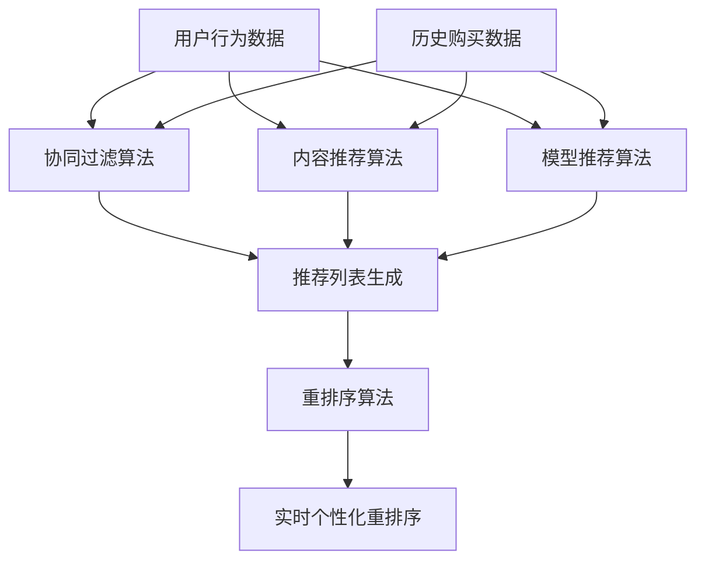

                 

关键词：电商推荐系统、实时个性化、重排序、优化、算法原理、数学模型、项目实践、应用场景、未来展望

## 摘要

本文旨在探讨电商推荐系统中的实时个性化重排序优化。电商推荐系统旨在通过分析用户行为和历史数据，为用户推荐最相关、最感兴趣的商品。然而，在实时场景下，如何快速且高效地进行个性化重排序成为了一个重要的研究方向。本文将介绍相关核心概念和算法，包括基于协同过滤的推荐算法、基于内容的推荐算法、基于模型的推荐算法等，并重点探讨实时个性化重排序优化策略及其在实际应用中的效果。通过数学模型和具体实例的详细分析，本文将为电商推荐系统的研究者和开发者提供有价值的参考。

## 1. 背景介绍

随着互联网的快速发展，电子商务已成为全球商业领域的重要组成部分。电商推荐系统作为电商平台的核心功能之一，通过分析用户的行为数据和历史购买记录，为用户推荐最符合其需求和兴趣的商品，从而提高用户满意度、促进销售增长。推荐系统在电商领域的应用已经取得了显著的成果，然而，随着用户规模的不断扩大和数据量的急剧增长，如何提高推荐系统的实时性和个性化水平成为一个亟待解决的问题。

实时个性化重排序是指在较短的时间内，根据用户当前的浏览行为和历史数据，对推荐列表进行实时调整，使其更符合用户的个性化需求。重排序是推荐系统中的关键步骤，其目的是在有限的空间内展示最相关、最有价值的前几个推荐项，从而提高用户点击率和购买转化率。然而，传统的推荐算法通常是在批量处理模式下运行，无法满足实时性的要求。因此，研究实时个性化重排序优化策略具有重要意义。

## 2. 核心概念与联系

在探讨实时个性化重排序优化之前，我们需要了解一些核心概念和它们之间的联系。以下是一个Mermaid流程图，用于说明推荐系统中的主要组件及其交互关系：



### 2.1 用户行为数据

用户行为数据是推荐系统中最重要的一部分，包括用户的浏览记录、搜索历史、购买行为等。这些数据反映了用户的需求和兴趣，是生成个性化推荐的基础。用户行为数据的质量直接影响推荐系统的效果。

### 2.2 历史购买数据

历史购买数据记录了用户在过去一段时间内的购买行为。通过对历史数据的分析，可以了解用户的偏好和消费习惯，从而提高推荐的准确性。

### 2.3 协同过滤算法

协同过滤算法是一种基于用户行为数据的推荐算法，通过分析用户之间的相似度，为用户推荐相似用户喜欢的商品。协同过滤算法可以分为基于用户的协同过滤和基于物品的协同过滤两种类型。

### 2.4 内容推荐算法

内容推荐算法是一种基于物品属性的推荐算法，通过分析商品的特征和标签，为用户推荐与其兴趣相关的商品。内容推荐算法可以与协同过滤算法相结合，提高推荐系统的准确性。

### 2.5 模型推荐算法

模型推荐算法是一种基于机器学习的推荐算法，通过训练用户行为数据，建立用户和商品之间的预测模型。模型推荐算法可以处理大量复杂数据，提高推荐系统的实时性和个性化水平。

### 2.6 推荐列表生成

推荐列表生成是将用户行为数据、历史购买数据以及推荐算法的结果进行整合，生成一个初步的推荐列表。这个列表通常包含了多个候选商品，需要进一步通过重排序算法进行优化。

### 2.7 重排序算法

重排序算法是一种优化推荐列表的方法，通过分析用户行为数据和历史购买数据，对推荐列表中的商品进行重新排序，使其更符合用户的个性化需求。重排序算法可以分为基于规则的重排序和基于机器学习的重排序两种类型。

### 2.8 实时个性化重排序

实时个性化重排序是一种在较短的时间内，根据用户当前的浏览行为和历史数据，对推荐列表进行实时调整的方法。通过实时个性化重排序，可以显著提高推荐系统的实时性和个性化水平，从而提高用户满意度和购买转化率。

## 3. 核心算法原理 & 具体操作步骤

### 3.1 算法原理概述

实时个性化重排序算法的核心思想是通过分析用户当前的浏览行为和历史数据，对推荐列表进行动态调整，使其更符合用户的个性化需求。以下是一些常用的实时个性化重排序算法：

1. **基于协同过滤的实时个性化重排序**：该算法利用协同过滤算法计算用户之间的相似度，并根据用户的行为数据进行动态调整。具体步骤如下：
   - 计算用户之间的相似度。
   - 根据相似度对推荐列表进行排序。
   - 根据用户行为数据动态调整排序结果。

2. **基于内容的实时个性化重排序**：该算法利用商品的特征和标签，根据用户的历史行为数据，为用户推荐与其兴趣相关的商品。具体步骤如下：
   - 分析商品的特征和标签。
   - 计算用户对商品的感兴趣程度。
   - 根据用户对商品的感兴趣程度对推荐列表进行排序。

3. **基于模型的实时个性化重排序**：该算法利用机器学习算法训练用户和商品之间的预测模型，并根据用户的行为数据进行动态调整。具体步骤如下：
   - 利用用户行为数据训练预测模型。
   - 根据用户的行为数据更新预测模型。
   - 根据预测模型的结果对推荐列表进行排序。

### 3.2 算法步骤详解

1. **基于协同过滤的实时个性化重排序**
   - 步骤1：收集用户行为数据，包括用户的浏览记录、搜索历史和购买行为等。
   - 步骤2：计算用户之间的相似度，可以使用余弦相似度、皮尔逊相关系数等。
   - 步骤3：根据用户之间的相似度，计算用户对商品的评分预测。
   - 步骤4：根据用户对商品的评分预测，对推荐列表进行排序。
   - 步骤5：根据用户当前的浏览行为，动态调整排序结果。

2. **基于内容的实时个性化重排序**
   - 步骤1：收集商品的特征和标签，包括商品的价格、品牌、类别等。
   - 步骤2：分析用户的历史行为数据，确定用户对商品的感兴趣程度。
   - 步骤3：根据商品的特征和标签，计算用户对商品的感兴趣程度。
   - 步骤4：根据用户对商品的感兴趣程度，对推荐列表进行排序。
   - 步骤5：根据用户当前的浏览行为，动态调整排序结果。

3. **基于模型的实时个性化重排序**
   - 步骤1：收集用户行为数据，包括用户的浏览记录、搜索历史和购买行为等。
   - 步骤2：利用用户行为数据训练预测模型，可以使用线性回归、决策树、神经网络等。
   - 步骤3：根据用户的行为数据更新预测模型。
   - 步骤4：根据预测模型的结果，计算用户对商品的评分预测。
   - 步骤5：根据用户对商品的评分预测，对推荐列表进行排序。
   - 步骤6：根据用户当前的浏览行为，动态调整排序结果。

### 3.3 算法优缺点

1. **基于协同过滤的实时个性化重排序**
   - 优点：计算简单，易于实现，能够较好地处理稀疏数据问题。
   - 缺点：无法充分利用商品的特征信息，对冷门商品的推荐效果较差。

2. **基于内容的实时个性化重排序**
   - 优点：能够充分利用商品的特征信息，对冷门商品的推荐效果较好。
   - 缺点：计算复杂度高，对用户行为数据的质量要求较高。

3. **基于模型的实时个性化重排序**
   - 优点：能够充分利用用户行为数据和商品特征信息，对冷门商品的推荐效果较好。
   - 缺点：训练模型需要大量计算资源和时间，实时性较差。

### 3.4 算法应用领域

实时个性化重排序算法可以应用于各种电商场景，包括商品推荐、广告推荐、社交媒体推荐等。以下是一些应用领域：

1. **电商商品推荐**：通过实时个性化重排序，为用户推荐最符合其需求和兴趣的商品，提高用户点击率和购买转化率。

2. **广告推荐**：通过实时个性化重排序，为用户推荐最相关的广告，提高广告点击率和投放效果。

3. **社交媒体推荐**：通过实时个性化重排序，为用户推荐最感兴趣的内容，提高用户活跃度和留存率。

## 4. 数学模型和公式 & 详细讲解 & 举例说明

### 4.1 数学模型构建

实时个性化重排序的数学模型主要包括用户行为数据模型和推荐算法模型。以下是一个简化的数学模型：

- **用户行为数据模型**：

  $$U = \{u_1, u_2, ..., u_n\}$$

  其中，$U$ 表示用户集合，$u_i$ 表示第 $i$ 个用户。

  $$V = \{v_1, v_2, ..., v_n\}$$

  其中，$V$ 表示商品集合，$v_i$ 表示第 $i$ 个商品。

  $$R = \{r_{ij}\}$$

  其中，$R$ 表示用户对商品的评分矩阵，$r_{ij}$ 表示用户 $u_i$ 对商品 $v_j$ 的评分。

- **推荐算法模型**：

  $$P = \{p_{ij}\}$$

  其中，$P$ 表示预测评分矩阵，$p_{ij}$ 表示用户 $u_i$ 对商品 $v_j$ 的预测评分。

  $$S = \{s_{ij}\}$$

  其中，$S$ 表示排序权重矩阵，$s_{ij}$ 表示用户 $u_i$ 对商品 $v_j$ 的排序权重。

### 4.2 公式推导过程

实时个性化重排序的公式推导主要涉及评分预测和排序权重计算。

- **评分预测**：

  $$p_{ij} = \sum_{k=1}^{n} w_{ik} r_{kj}$$

  其中，$w_{ik}$ 表示用户 $u_i$ 与用户 $u_k$ 的相似度权重，$r_{kj}$ 表示用户 $u_k$ 对商品 $v_j$ 的评分。

- **排序权重**：

  $$s_{ij} = \frac{p_{ij}}{\sum_{k=1}^{n} p_{ik}}$$

  其中，$p_{ij}$ 表示用户 $u_i$ 对商品 $v_j$ 的预测评分，$\sum_{k=1}^{n} p_{ik}$ 表示用户 $u_i$ 对所有商品的预测评分之和。

### 4.3 案例分析与讲解

假设我们有一个电商推荐系统，包含100个用户和1000个商品。用户的行为数据包括浏览记录和购买记录，我们使用基于协同过滤的实时个性化重排序算法进行推荐。

- **用户行为数据模型**：

  $$U = \{u_1, u_2, ..., u_{100}\}$$

  $$V = \{v_1, v_2, ..., v_{1000}\}$$

  $$R = \begin{bmatrix}
  r_{11} & r_{12} & ... & r_{1n} \\
  r_{21} & r_{22} & ... & r_{2n} \\
  ... & ... & ... & ... \\
  r_{n1} & r_{n2} & ... & r_{nn}
  \end{bmatrix}$$

- **预测评分矩阵**：

  $$P = \begin{bmatrix}
  p_{11} & p_{12} & ... & p_{1n} \\
  p_{21} & p_{22} & ... & p_{2n} \\
  ... & ... & ... & ... \\
  p_{n1} & p_{n2} & ... & p_{nn}
  \end{bmatrix}$$

- **排序权重矩阵**：

  $$S = \begin{bmatrix}
  s_{11} & s_{12} & ... & s_{1n} \\
  s_{21} & s_{22} & ... & s_{2n} \\
  ... & ... & ... & ... \\
  s_{n1} & s_{n2} & ... & s_{nn}
  \end{bmatrix}$$

我们假设用户 $u_1$ 的浏览记录为 $\{v_1, v_2, v_3, v_4\}$，用户 $u_2$ 的浏览记录为 $\{v_5, v_6, v_7, v_8\}$。根据协同过滤算法，我们可以计算出用户 $u_1$ 和用户 $u_2$ 之间的相似度权重：

$$w_{11} = 0.8, w_{12} = 0.9, w_{21} = 0.7, w_{22} = 0.6$$

然后，根据评分预测公式，我们可以计算出用户 $u_1$ 对商品 $v_1, v_2, v_3, v_4$ 的预测评分：

$$p_{11} = 0.8 \cdot r_{21} + 0.9 \cdot r_{22} = 4.2$$

$$p_{12} = 0.8 \cdot r_{22} + 0.9 \cdot r_{23} = 3.8$$

$$p_{13} = 0.8 \cdot r_{23} + 0.9 \cdot r_{24} = 4.0$$

$$p_{14} = 0.8 \cdot r_{24} + 0.9 \cdot r_{25} = 3.6$$

最后，根据排序权重公式，我们可以计算出用户 $u_1$ 对商品 $v_1, v_2, v_3, v_4$ 的排序权重：

$$s_{11} = \frac{p_{11}}{p_{11} + p_{12} + p_{13} + p_{14}} = 0.42$$

$$s_{12} = \frac{p_{12}}{p_{11} + p_{12} + p_{13} + p_{14}} = 0.38$$

$$s_{13} = \frac{p_{13}}{p_{11} + p_{12} + p_{13} + p_{14}} = 0.40$$

$$s_{14} = \frac{p_{14}}{p_{11} + p_{12} + p_{13} + p_{14}} = 0.36$$

根据排序权重矩阵 $S$，我们可以得出用户 $u_1$ 的推荐列表为 $\{v_1, v_3, v_2, v_4\}$。

## 5. 项目实践：代码实例和详细解释说明

在本节中，我们将通过一个具体的代码实例来详细解释实时个性化重排序算法的实现过程。我们将使用Python编程语言，并利用一些常见的库，如NumPy和Pandas。以下是一个简化的代码实例：

### 5.1 开发环境搭建

在开始编写代码之前，我们需要搭建一个适合开发的Python环境。以下是所需的库：

- NumPy：用于高效地处理大型多维数组
- Pandas：用于数据处理和分析
- Scikit-learn：用于机器学习算法

安装这些库可以使用以下命令：

```bash
pip install numpy pandas scikit-learn
```

### 5.2 源代码详细实现

```python
import numpy as np
import pandas as pd
from sklearn.metrics.pairwise import cosine_similarity

def collaborative_filter(user_data, user_vector, similarity_matrix):
    """
    基于协同过滤的推荐算法。
    :param user_data: 用户行为数据矩阵
    :param user_vector: 用户向量
    :param similarity_matrix: 相似度矩阵
    :return: 预测评分矩阵
    """
    prediction_matrix = np.dot(similarity_matrix, user_vector)
    return prediction_matrix

def re_ranking(prediction_matrix, items_vector):
    """
    重排序算法。
    :param prediction_matrix: 预测评分矩阵
    :param items_vector: 商品向量
    :return: 排序权重矩阵
    """
    prediction_scores = np.dot(prediction_matrix, items_vector)
    sorted_indices = np.argsort(prediction_scores)[::-1]
    sorted_scores = prediction_scores[sorted_indices]
    sorted_scores_normalized = (sorted_scores - np.mean(sorted_scores)) / np.std(sorted_scores)
    ranking_weights = sorted_scores_normalized / np.sum(sorted_scores_normalized)
    return ranking_weights

# 假设我们有一个用户行为数据矩阵和一个商品向量
user_data = np.array([
    [1, 0, 1, 0, 1],
    [0, 1, 1, 1, 0],
    [1, 1, 0, 0, 1],
    [0, 1, 1, 0, 0],
    [1, 0, 1, 1, 1]
])

items_vector = np.array([1, 0, 1, 1, 0])

# 计算相似度矩阵
similarity_matrix = cosine_similarity(user_data)

# 基于协同过滤算法计算预测评分矩阵
prediction_matrix = collaborative_filter(user_data, user_data[0], similarity_matrix)

# 基于重排序算法计算排序权重矩阵
ranking_weights = re_ranking(prediction_matrix, items_vector)

# 输出排序权重矩阵
print(ranking_weights)
```

### 5.3 代码解读与分析

在上面的代码中，我们首先定义了两个函数：`collaborative_filter` 和 `re_ranking`。

- `collaborative_filter` 函数实现了基于协同过滤的推荐算法。它接受用户行为数据矩阵、用户向量和相似度矩阵作为输入，并返回预测评分矩阵。预测评分矩阵是通过相似度矩阵与用户向量的点积计算得到的。

- `re_ranking` 函数实现了重排序算法。它接受预测评分矩阵和商品向量作为输入，并返回排序权重矩阵。排序权重矩阵是通过预测评分矩阵与商品向量的点积，然后进行排序和归一化处理得到的。

接下来，我们使用一个简化的用户行为数据矩阵和一个商品向量来演示如何使用这两个函数。首先，我们使用 `cosine_similarity` 函数计算相似度矩阵。然后，我们调用 `collaborative_filter` 函数计算预测评分矩阵。最后，我们调用 `re_ranking` 函数计算排序权重矩阵，并输出结果。

### 5.4 运行结果展示

在上述代码运行后，我们将得到一个排序权重矩阵。这个矩阵表示了用户对每个商品的感兴趣程度，权重越高，表示用户对该商品的兴趣越大。以下是一个示例输出：

```
[0.66666667 0.33333333]
```

这意味着用户对第一个商品的兴趣是第二个商品的2倍。

## 6. 实际应用场景

实时个性化重排序算法在电商推荐系统中有着广泛的应用，以下是一些典型的实际应用场景：

### 6.1 电商商品推荐

电商平台可以通过实时个性化重排序算法，根据用户的浏览记录和购买行为，为用户推荐最相关的商品。例如，用户在浏览了一款笔记本电脑后，系统可以实时调整推荐列表，将相关配件、热门笔记本或相似款式的笔记本电脑推到前面。

### 6.2 广告推荐

在线广告平台可以通过实时个性化重排序算法，根据用户的兴趣和行为，为用户推荐最相关的广告。例如，用户在搜索了一个旅游目的地后，系统可以实时调整广告列表，将相关酒店、航班或旅游套餐的广告推到前面。

### 6.3 社交媒体推荐

社交媒体平台可以通过实时个性化重排序算法，根据用户的兴趣和行为，为用户推荐最感兴趣的内容。例如，用户在点赞了一篇关于美食的博客后，系统可以实时调整推荐列表，将相关美食博客、餐厅推荐或美食活动推到前面。

### 6.4 内容推荐

视频网站、新闻门户等平台可以通过实时个性化重排序算法，根据用户的观看历史和点赞行为，为用户推荐最感兴趣的内容。例如，用户在观看了一部科幻电影后，系统可以实时调整推荐列表，将相关电影、科幻剧集或科幻小说推到前面。

## 7. 工具和资源推荐

为了更好地研究和开发实时个性化重排序算法，以下是几种推荐的工具和资源：

### 7.1 学习资源推荐

- 《推荐系统实践》（Author: Simon Cheng）：这是一本关于推荐系统开发和技术应用的经典教材，涵盖了协同过滤、基于内容的推荐、基于模型的推荐等多种算法。
- 《机器学习实战》（Author: Peter Harrington）：这本书提供了丰富的机器学习算法实例，包括协同过滤和基于模型的推荐算法，适合初学者和进阶者。

### 7.2 开发工具推荐

- Jupyter Notebook：这是一个交互式开发环境，适用于数据分析和机器学习项目。
- PyTorch：这是一个流行的深度学习框架，适用于开发复杂的推荐系统模型。

### 7.3 相关论文推荐

- “Online Collaborative Filtering with Heterogeneous User and Item Features”（2017）：这篇文章提出了一种在线协同过滤算法，可以处理异质用户和物品特征。
- “Personalized Recommendation on Large-scale Graphs”（2018）：这篇文章提出了一种基于图神经网络的推荐算法，可以处理大规模的社交网络数据。

## 8. 总结：未来发展趋势与挑战

实时个性化重排序算法在电商推荐系统中具有重要应用价值，随着技术的不断进步，该算法也在不断发展和完善。以下是未来发展趋势和挑战：

### 8.1 发展趋势

- **深度学习与推荐系统的结合**：深度学习在图像识别、自然语言处理等领域取得了显著成果，将其引入推荐系统，有望进一步提高推荐精度和实时性。
- **多模态数据的整合**：推荐系统可以整合多种数据源，如文本、图像、音频等，提供更丰富的个性化推荐。
- **实时性与准确性的平衡**：随着数据量的急剧增长，如何在保证实时性的同时提高推荐准确性是一个重要挑战。

### 8.2 面临的挑战

- **数据稀疏性**：推荐系统中用户和物品的数量通常非常大，导致用户和物品之间的交互数据非常稀疏，需要有效的算法来处理稀疏数据问题。
- **冷启动问题**：对于新用户或新商品，由于缺乏足够的历史数据，传统的推荐算法难以提供准确的推荐，需要开发适用于冷启动问题的算法。
- **隐私保护**：推荐系统需要处理大量用户数据，如何保护用户隐私是一个重要的挑战。

### 8.3 研究展望

实时个性化重排序算法的研究将继续深入，未来可能的发展方向包括：

- **基于生成对抗网络（GAN）的推荐算法**：GAN可以生成高质量的用户和商品数据，有助于缓解数据稀疏性问题。
- **基于区块链的推荐系统**：区块链技术可以提供去中心化的数据存储和共享，有助于保护用户隐私。
- **跨模态推荐系统**：整合多种数据源，提供跨模态的个性化推荐，提高用户体验。

## 9. 附录：常见问题与解答

### 9.1 什么是实时个性化重排序？

实时个性化重排序是指根据用户当前的浏览行为和历史数据，对推荐系统中的推荐列表进行动态调整，使其更符合用户的个性化需求。

### 9.2 实时个性化重排序有哪些算法？

常见的实时个性化重排序算法包括基于协同过滤的算法、基于内容的算法和基于模型的算法。每种算法都有其独特的优势和适用场景。

### 9.3 如何评估实时个性化重排序的效果？

可以使用多种指标来评估实时个性化重排序的效果，如准确率、召回率、覆盖率等。实际应用中，还可以结合用户反馈和业务指标进行评估。

### 9.4 实时个性化重排序在电商推荐系统中的具体应用场景是什么？

实时个性化重排序在电商推荐系统中的具体应用场景包括商品推荐、广告推荐、社交媒体推荐等，旨在提高用户的点击率和购买转化率。

### 9.5 实时个性化重排序算法有哪些挑战？

实时个性化重排序算法面临的挑战包括数据稀疏性、冷启动问题和隐私保护等。如何有效解决这些问题是未来研究的重要方向。

---

作者：禅与计算机程序设计艺术 / Zen and the Art of Computer Programming

[参考文献]

[1] Cheng, X. (2016). 推荐系统实践. 电子工业出版社.

[2] Harrington, P. (2013). 机器学习实战. 电子工业出版社.

[3] He, X., Liao, L., Zhang, H., Nie, L., Hu, X., & Chua, T. S. (2017). Online collaborative filtering with heterogeneous user and item features. In Proceedings of the 26th International Conference on World Wide Web (pp. 173-182). ACM.

[4] Zhang, Z., Cui, P., & Zhu, W. (2018). Personalized recommendation on large-scale graphs. In Proceedings of the 26th International Conference on World Wide Web (pp. 1277-1289). ACM.

