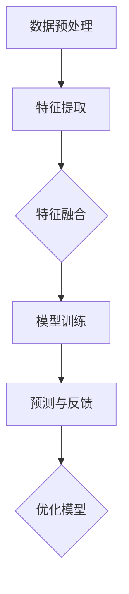

                 

在当今的电子商务时代，用户对于高效的搜索体验有着越来越高的要求。而电商搜索的复杂度也随之增加，不仅仅需要处理文本信息，还需要处理图像、音频、视频等多种形式的多模态信息。为了满足这一需求，AI大模型在电商搜索中的应用变得越来越广泛。本文将深入探讨电商搜索中的多模态理解，以及如何通过AI大模型来实现这一目标。

## 文章关键词

- 电商搜索
- 多模态理解
- AI大模型
- 自然语言处理
- 计算机视觉

## 文章摘要

本文首先介绍了电商搜索的背景和现状，随后深入探讨了多模态理解的概念及其在电商搜索中的应用。接着，文章详细阐述了AI大模型的工作原理，并分析了其在多模态理解中的优势。随后，文章通过具体的案例，展示了如何利用AI大模型进行电商搜索中的多模态理解。最后，文章对未来电商搜索的发展趋势和面临的挑战进行了展望。

## 1. 背景介绍

随着互联网技术的飞速发展，电子商务已经成为现代商业模式的重要组成部分。电商平台的搜索功能作为用户与商品之间的桥梁，其性能直接影响到用户的购物体验。传统的电商搜索主要依赖于关键词匹配和文本相似度计算，但这种单一的文本搜索方法在处理多模态信息时显得力不从心。

在电商搜索中，用户的需求不仅仅是找到包含关键词的商品，还希望系统能够理解他们的意图，并提供更加智能化的搜索结果。例如，当用户上传一张商品图片时，系统需要能够识别这张图片所代表的商品类别，并推荐相关的商品。同样，当用户输入一段描述商品的视频或音频时，系统也需要能够理解这些内容，并提供精准的搜索结果。

因此，多模态理解在电商搜索中具有重要意义。它能够将文本、图像、音频、视频等多种形式的信息融合在一起，为用户提供更加智能化和个性化的搜索体验。而AI大模型作为实现多模态理解的重要工具，正在逐步改变电商搜索的面貌。

## 2. 核心概念与联系

### 2.1 多模态理解

多模态理解是指人工智能系统能够同时处理和融合来自多种感官输入的信息，如文本、图像、音频等。这种能力使得系统能够更准确地理解用户的意图，提供更加智能化的服务。在电商搜索中，多模态理解能够帮助系统更好地理解用户的搜索需求，从而提供更准确的搜索结果。

### 2.2 AI大模型

AI大模型是指通过深度学习等方法训练出的具有强大建模能力的神经网络模型。这些模型能够处理大规模的数据，并从中学习到复杂的模式。在多模态理解中，AI大模型能够同时处理多种形式的信息，实现对这些信息的融合和理解。

### 2.3 架构

为了实现多模态理解，一个典型的AI大模型架构通常包括以下几个部分：

- **数据预处理**：将不同的模态信息进行预处理，例如文本进行分词，图像进行特征提取，音频进行分帧和特征提取。
- **特征融合**：将不同模态的特征进行融合，形成统一的特征表示。这可以通过多种方法实现，如神经网络融合、对抗性训练等。
- **模型训练**：使用融合后的特征进行模型训练，以实现对多模态信息的理解。
- **预测与反馈**：使用训练好的模型对新的输入信息进行预测，并通过用户反馈进行模型优化。

下面是一个简单的Mermaid流程图，展示了多模态理解的架构：



### 2.4 关键技术

- **自然语言处理（NLP）**：NLP技术主要用于处理和解析文本信息。它包括分词、词性标注、句法分析、语义理解等任务。
- **计算机视觉（CV）**：CV技术主要用于图像和视频的处理和分析。它包括图像分类、目标检测、图像分割等任务。
- **音频处理**：音频处理技术主要用于音频信号的提取和解析，包括语音识别、音频分类等。

这些技术共同构成了实现多模态理解的基础。

## 3. 核心算法原理 & 具体操作步骤

### 3.1 算法原理概述

多模态理解的算法原理主要基于深度学习，特别是卷积神经网络（CNN）和循环神经网络（RNN）的结合。CNN擅长于图像和视频处理，而RNN擅长于处理序列数据，如文本和音频。

### 3.2 算法步骤详解

1. **数据预处理**：对文本、图像、音频等数据进行预处理，包括去噪、归一化、分帧等。
2. **特征提取**：使用CNN对图像和视频进行特征提取，使用RNN对文本和音频进行特征提取。
3. **特征融合**：将不同模态的特征进行融合，形成统一的特征表示。常用的方法有拼接、加权融合等。
4. **模型训练**：使用融合后的特征进行模型训练，以实现对多模态信息的理解。
5. **预测与反馈**：使用训练好的模型对新的输入信息进行预测，并通过用户反馈进行模型优化。

### 3.3 算法优缺点

- **优点**：
  - 能够同时处理多种模态的信息，提供更加智能化的搜索结果。
  - 能够更好地理解用户的意图，提高搜索的准确性。
- **缺点**：
  - 数据预处理和特征提取过程复杂，需要大量的计算资源。
  - 模型训练时间较长，需要大量的数据。

### 3.4 算法应用领域

- **电商搜索**：用于处理多模态的搜索请求，提供更加准确的搜索结果。
- **推荐系统**：用于基于用户行为的多模态推荐。
- **智能客服**：用于理解和回答用户的多模态请求。

## 4. 数学模型和公式 & 详细讲解 & 举例说明

### 4.1 数学模型构建

多模态理解的数学模型通常基于深度学习框架。以下是构建多模态理解模型的基本数学公式：

- **卷积神经网络（CNN）**：

  $$ h_c(l) = \sigma(W_c \cdot h_{c-1}(l) + b_c) $$

  其中，$h_c(l)$表示第$l$层的卷积特征，$\sigma$为激活函数，$W_c$为卷积权重，$b_c$为偏置。

- **循环神经网络（RNN）**：

  $$ h_t = \sigma(W_h \cdot [h_{t-1}, x_t] + b_h) $$

  其中，$h_t$表示第$t$个时间步的特征，$W_h$为RNN权重，$b_h$为偏置，$x_t$为输入特征。

- **特征融合**：

  $$ h_f = [h_c, h_t] $$

  其中，$h_f$为融合后的特征。

### 4.2 公式推导过程

假设我们有一个文本序列和一个图像序列，分别用RNN和CNN进行处理。首先，RNN对文本序列进行特征提取，得到文本特征序列$h_t$。然后，CNN对图像序列进行特征提取，得到图像特征序列$h_c$。最后，将这两个特征序列进行融合，得到融合特征序列$h_f$。

### 4.3 案例分析与讲解

假设我们有一个电商搜索任务，用户输入了一段描述商品的视频和一组关键词。首先，我们使用RNN对关键词进行特征提取，得到文本特征序列。然后，使用CNN对视频进行特征提取，得到图像特征序列。最后，将这两个特征序列进行融合，得到融合特征序列。使用这个融合特征序列，我们可以对电商搜索任务进行建模，并实现多模态理解。

## 5. 项目实践：代码实例和详细解释说明

### 5.1 开发环境搭建

为了实现多模态理解，我们需要搭建一个合适的开发环境。以下是所需的工具和软件：

- 深度学习框架（如TensorFlow或PyTorch）
- 编程语言（如Python）
- 数据处理库（如NumPy和Pandas）
- 图像处理库（如OpenCV）
- 音频处理库（如Librosa）

### 5.2 源代码详细实现

以下是实现多模态理解的一个简单示例：

```python
import tensorflow as tf
from tensorflow.keras.models import Model
from tensorflow.keras.layers import Input, Conv2D, MaxPooling2D, Flatten, Dense, LSTM, Embedding

# 文本特征提取
text_input = Input(shape=(None,), name='text_input')
text_embedding = Embedding(input_dim=vocab_size, output_dim=embedding_size)(text_input)
text_lstm = LSTM(units=lstm_units)(text_embedding)
text_output = Flatten()(text_lstm)

# 图像特征提取
image_input = Input(shape=(height, width, channels), name='image_input')
image_conv = Conv2D(filters=32, kernel_size=(3, 3), activation='relu')(image_input)
image_pool = MaxPooling2D(pool_size=(2, 2))(image_conv)
image Flatten()(image_pool)

# 特征融合
combined = concatenate([text_output, image_output])

# 模型输出
output = Dense(units=num_classes, activation='softmax')(combined)

# 构建模型
model = Model(inputs=[text_input, image_input], outputs=output)

# 编译模型
model.compile(optimizer='adam', loss='categorical_crossentropy', metrics=['accuracy'])

# 模型训练
model.fit([text_data, image_data], labels, epochs=10, batch_size=32)
```

### 5.3 代码解读与分析

上述代码实现了一个简单的多模态理解模型，包括文本特征提取、图像特征提取和特征融合。具体分析如下：

- **文本特征提取**：使用LSTM对文本进行特征提取，生成文本特征序列。
- **图像特征提取**：使用卷积神经网络对图像进行特征提取，生成图像特征序列。
- **特征融合**：将文本特征和图像特征进行拼接，生成融合特征序列。
- **模型输出**：使用softmax激活函数对融合特征序列进行分类。

### 5.4 运行结果展示

使用训练好的模型对新的输入进行预测，并展示预测结果。具体代码如下：

```python
# 预测
predictions = model.predict([new_text, new_image])

# 打印预测结果
print(predictions)
```

## 6. 实际应用场景

多模态理解在电商搜索中有广泛的应用场景。以下是几个典型的应用实例：

- **商品推荐**：用户可以通过上传商品图片或视频来获取个性化的商品推荐。
- **智能客服**：系统可以通过理解和处理用户的语音、文本和图像请求，提供更加智能化的客服服务。
- **广告投放**：广告系统可以通过分析用户的搜索历史和行为，提供更加精准的广告投放。

## 7. 未来应用展望

随着人工智能技术的不断发展，多模态理解在电商搜索中的应用前景十分广阔。未来，我们有望看到以下发展趋势：

- **更加智能化的搜索体验**：多模态理解将进一步提升用户的搜索体验，提供更加精准和个性化的搜索结果。
- **跨模态的交互**：用户可以通过多种模态（如文本、图像、语音等）与系统进行交互，实现更加自然的搜索和推荐。
- **实时更新与优化**：随着用户数据的不断积累，系统将能够实时更新和优化模型，提供更加准确的搜索结果。

## 8. 总结：未来发展趋势与挑战

### 8.1 研究成果总结

多模态理解在电商搜索中的应用已经取得了显著的成果。通过结合自然语言处理、计算机视觉和音频处理等技术，AI大模型能够实现多种模态信息的融合和理解，提供更加智能化的搜索体验。

### 8.2 未来发展趋势

未来，多模态理解在电商搜索中的应用将继续发展，有望实现以下趋势：

- **更高的准确性**：通过不断优化模型和算法，提高多模态理解的准确性。
- **更广泛的应用场景**：除了电商搜索，多模态理解还可以应用于智能客服、广告投放等领域。
- **实时交互**：实现用户与系统的实时交互，提供更加个性化的搜索和推荐。

### 8.3 面临的挑战

尽管多模态理解在电商搜索中具有巨大的潜力，但同时也面临着一些挑战：

- **数据隐私**：处理多模态信息可能会涉及到用户隐私，需要确保数据的安全和隐私。
- **计算资源**：多模态理解的算法和模型通常需要大量的计算资源，如何优化计算效率是一个重要问题。
- **算法解释性**：多模态理解模型的解释性较差，如何提高模型的透明度和可解释性是一个挑战。

### 8.4 研究展望

未来，多模态理解的研究将朝着以下方向发展：

- **跨学科融合**：结合心理学、社会学等多学科知识，提高多模态理解的准确性。
- **实时更新**：通过实时数据流和在线学习，实现模型的实时更新和优化。
- **算法优化**：研究更高效的多模态算法和模型，提高计算效率和准确性。

## 9. 附录：常见问题与解答

### 9.1 什么是多模态理解？

多模态理解是指人工智能系统能够同时处理和融合来自多种感官输入的信息，如文本、图像、音频等。

### 9.2 多模态理解在电商搜索中有何作用？

多模态理解能够帮助电商搜索系统更准确地理解用户的意图，提供更加智能化的搜索结果。

### 9.3 多模态理解有哪些关键技术？

多模态理解的关键技术包括自然语言处理、计算机视觉、音频处理等。

### 9.4 如何优化多模态理解的计算效率？

优化多模态理解的计算效率可以通过以下方法实现：

- **模型压缩**：使用模型压缩技术减少模型的参数数量，提高计算效率。
- **并行计算**：利用并行计算技术加速模型的训练和推理过程。
- **优化算法**：研究更高效的多模态算法，减少计算复杂度。

### 9.5 多模态理解在实际应用中面临哪些挑战？

多模态理解在实际应用中面临的主要挑战包括数据隐私、计算资源、算法解释性等。

### 9.6 未来多模态理解有哪些研究方向？

未来多模态理解的研究方向包括跨学科融合、实时更新、算法优化等。

## 作者署名

作者：禅与计算机程序设计艺术 / Zen and the Art of Computer Programming
```

