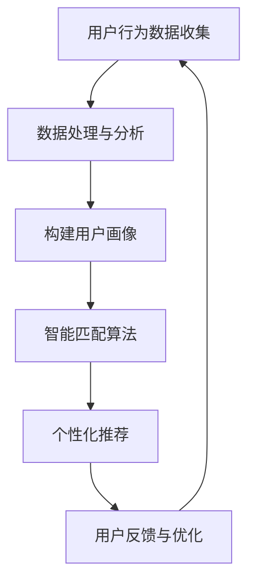

                 

关键词：电商搜索、AI、导购、购物方式、个性化推荐、数据分析、用户行为、智能匹配

> 摘要：本文将探讨人工智能（AI）如何改变电商搜索导购的方式。通过分析当前电商搜索导购的痛点，介绍AI技术在电商领域的应用，探讨未来电商搜索导购的发展趋势，以及面临的挑战和机遇。

## 1. 背景介绍

电商行业在近年来迅速发展，已经逐渐成为人们日常生活不可或缺的一部分。随着消费者需求的多样化和个性化，电商企业需要提供更加精准和高效的搜索导购服务，以满足用户的购物需求。传统的搜索导购方式主要依赖于关键词匹配和简单的过滤算法，已经难以满足用户日益增长的个性化需求。

与此同时，人工智能（AI）技术的迅猛发展，为电商搜索导购带来了新的机遇。通过利用机器学习、自然语言处理、图像识别等技术，AI能够更加精准地理解和预测用户行为，为用户提供个性化的商品推荐和搜索结果。本文将重点探讨AI在电商搜索导购领域的应用，以及其对购物方式的影响。

## 2. 核心概念与联系

在深入探讨AI在电商搜索导购中的应用之前，我们需要了解一些核心概念和它们之间的联系。

### 2.1. 个性化推荐

个性化推荐是AI在电商搜索导购中的一项重要应用。个性化推荐系统通过分析用户的历史行为、浏览记录、购买偏好等数据，为用户推荐符合其兴趣和需求的商品。其核心在于构建用户画像，并将用户与商品进行智能匹配。

### 2.2. 用户行为分析

用户行为分析是个性化推荐系统的基础。通过对用户的浏览、搜索、购买等行为进行分析，可以挖掘出用户的兴趣和需求，为推荐系统提供准确的数据支持。

### 2.3. 智能匹配

智能匹配是AI在电商搜索导购中的一项关键技术。通过分析用户的行为数据，智能匹配算法能够将用户与最符合其需求的商品进行精准匹配，提高搜索导购的效率和准确性。

### 2.4. 数据分析

数据分析是AI在电商搜索导购中的核心环节。通过对用户数据的收集、处理和分析，可以挖掘出用户行为模式、市场趋势等信息，为电商企业制定策略提供依据。

### 2.5. Mermaid 流程图

以下是AI在电商搜索导购中的应用流程的Mermaid流程图：



## 3. 核心算法原理 & 具体操作步骤

### 3.1 算法原理概述

AI在电商搜索导购中的应用主要涉及以下几个核心算法：

1. **协同过滤算法**：通过分析用户的行为数据，找出相似用户和相似商品，为用户推荐符合其兴趣的商品。
2. **基于内容的推荐算法**：根据用户的历史行为和浏览记录，分析用户对商品的偏好，为用户推荐与其兴趣相关的商品。
3. **深度学习算法**：通过构建神经网络模型，对用户行为数据进行特征提取和分类，实现高度个性化的推荐。

### 3.2 算法步骤详解

以下是AI在电商搜索导购中的具体操作步骤：

1. **数据收集与预处理**：收集用户的行为数据，包括浏览记录、购买记录、搜索记录等，并对数据进行清洗、去重和处理。
2. **用户画像构建**：通过对用户的行为数据进行聚类和特征提取，构建用户的兴趣模型和行为特征。
3. **商品信息处理**：对商品的信息进行分类和标签化处理，为后续的推荐算法提供数据支持。
4. **推荐算法选择与优化**：根据用户画像和商品信息，选择合适的推荐算法（如协同过滤、基于内容的推荐、深度学习等），并进行算法优化。
5. **个性化推荐生成**：根据用户画像和商品信息，生成个性化的推荐列表，并将其展示给用户。
6. **用户反馈与优化**：收集用户的反馈数据，对推荐结果进行评估和优化，以提高推荐准确性和用户满意度。

### 3.3 算法优缺点

1. **协同过滤算法**：
   - 优点：能够根据用户的兴趣和偏好进行个性化推荐，推荐结果具有一定的准确性。
   - 缺点：容易发生数据稀疏问题，推荐结果可能过于依赖历史数据，难以应对新用户和新商品。

2. **基于内容的推荐算法**：
   - 优点：能够根据用户对商品的偏好进行推荐，推荐结果较为准确。
   - 缺点：容易产生推荐多样性不足的问题，难以满足用户的个性化需求。

3. **深度学习算法**：
   - 优点：能够自动提取用户行为数据中的特征，实现高度个性化的推荐。
   - 缺点：算法训练和推理过程较为复杂，需要大量的计算资源和时间。

### 3.4 算法应用领域

AI在电商搜索导购中的应用主要涉及以下领域：

1. **商品推荐**：通过个性化推荐算法，为用户推荐符合其兴趣和需求的商品。
2. **搜索优化**：通过优化搜索算法，提高搜索结果的准确性和相关性。
3. **广告投放**：根据用户的行为数据，精准投放广告，提高广告投放效果。

## 4. 数学模型和公式 & 详细讲解 & 举例说明

### 4.1 数学模型构建

在电商搜索导购中，常用的数学模型包括协同过滤模型、基于内容的推荐模型和深度学习模型。以下以协同过滤模型为例进行讲解。

#### 4.1.1 协同过滤模型

协同过滤模型通过计算用户之间的相似度和商品之间的相似度，为用户推荐相似用户喜欢的商品。其数学模型可以表示为：

$$
\text{recommendation}_{ui} = \sum_{j \in \mathcal{N}_u} \text{similarity}_{uj} \cdot \text{rating}_{ji}
$$

其中，$\text{recommendation}_{ui}$表示用户$u$对商品$i$的推荐分数，$\text{similarity}_{uj}$表示用户$u$和用户$j$之间的相似度，$\text{rating}_{ji}$表示用户$j$对商品$i$的评分。

#### 4.1.2 基于内容的推荐模型

基于内容的推荐模型通过分析商品的特征和用户的历史行为，为用户推荐与其兴趣相关的商品。其数学模型可以表示为：

$$
\text{recommendation}_{ui} = \sum_{j \in \mathcal{N}_u} \text{similarity}_{ij} \cdot \text{content}_{ji}
$$

其中，$\text{recommendation}_{ui}$表示用户$u$对商品$i$的推荐分数，$\text{similarity}_{ij}$表示商品$i$和商品$j$之间的相似度，$\text{content}_{ji}$表示商品$i$的特征向量。

#### 4.1.3 深度学习模型

深度学习模型通过构建神经网络模型，对用户行为数据进行特征提取和分类，实现高度个性化的推荐。其数学模型可以表示为：

$$
\text{recommendation}_{ui} = \text{sigmoid}(\text{w} \cdot \text{h}_{ui} + \text{b})
$$

其中，$\text{sigmoid}$表示激活函数，$\text{w}$表示权重矩阵，$\text{h}_{ui}$表示用户$u$和商品$i$的特征向量，$\text{b}$表示偏置。

### 4.2 公式推导过程

#### 4.2.1 协同过滤模型

协同过滤模型的核心思想是利用用户之间的相似度和商品之间的相似度，为用户推荐相似用户喜欢的商品。其推导过程如下：

1. **计算用户之间的相似度**：

$$
\text{similarity}_{uj} = \frac{\sum_{i \in \mathcal{I}} \text{rating}_{ui} \cdot \text{rating}_{uj}}{\sqrt{\sum_{i \in \mathcal{I}} \text{rating}_{ui}^2} \cdot \sqrt{\sum_{i \in \mathcal{I}} \text{rating}_{uj}^2}}
$$

其中，$\text{rating}_{ui}$表示用户$u$对商品$i$的评分，$\mathcal{I}$表示商品集合。

2. **计算用户和商品的相似度**：

$$
\text{similarity}_{ij} = \frac{\sum_{k \in \mathcal{I}} \text{rating}_{ki} \cdot \text{rating}_{uj}}{\sqrt{\sum_{k \in \mathcal{I}} \text{rating}_{ki}^2} \cdot \sqrt{\sum_{k \in \mathcal{I}} \text{rating}_{uj}^2}}
$$

其中，$\text{rating}_{ki}$表示用户$k$对商品$i$的评分。

3. **计算推荐分数**：

$$
\text{recommendation}_{ui} = \sum_{j \in \mathcal{N}_u} \text{similarity}_{uj} \cdot \text{rating}_{ji}
$$

#### 4.2.2 基于内容的推荐模型

基于内容的推荐模型的核心思想是利用商品的特征和用户的历史行为，为用户推荐与其兴趣相关的商品。其推导过程如下：

1. **计算商品之间的相似度**：

$$
\text{similarity}_{ij} = \frac{\sum_{k \in \mathcal{I}} \text{content}_{ki} \cdot \text{content}_{kj}}{\sqrt{\sum_{k \in \mathcal{I}} \text{content}_{ki}^2} \cdot \sqrt{\sum_{k \in \mathcal{I}} \text{content}_{kj}^2}}
$$

其中，$\text{content}_{ki}$表示商品$i$的特征向量。

2. **计算推荐分数**：

$$
\text{recommendation}_{ui} = \sum_{j \in \mathcal{N}_u} \text{similarity}_{ij} \cdot \text{content}_{ji}
$$

#### 4.2.3 深度学习模型

深度学习模型的核心思想是通过构建神经网络模型，对用户行为数据进行特征提取和分类，实现高度个性化的推荐。其推导过程如下：

1. **输入层到隐藏层的计算**：

$$
\text{h}_{ui} = \text{sigmoid}(\text{w}_{1} \cdot \text{x}_{ui} + \text{b}_{1})
$$

其中，$\text{x}_{ui}$表示用户$u$和商品$i$的特征向量，$\text{w}_{1}$表示输入层到隐藏层的权重矩阵，$\text{b}_{1}$表示偏置。

2. **隐藏层到输出层的计算**：

$$
\text{y}_{ui} = \text{sigmoid}(\text{w}_{2} \cdot \text{h}_{ui} + \text{b}_{2})
$$

其中，$\text{w}_{2}$表示隐藏层到输出层的权重矩阵，$\text{b}_{2}$表示偏置。

3. **计算推荐分数**：

$$
\text{recommendation}_{ui} = \text{sigmoid}(\text{w} \cdot \text{h}_{ui} + \text{b})
$$

其中，$\text{w}$表示权重矩阵，$\text{b}$表示偏置。

### 4.3 案例分析与讲解

#### 4.3.1 协同过滤模型案例

假设有两个用户$u_1$和$u_2$，以及两个商品$i_1$和$i_2$，其评分数据如下表所示：

| 用户 | 商品1 | 商品2 |
| --- | --- | --- |
| $u_1$ | 4 | 5 |
| $u_2$ | 5 | 4 |

1. **计算用户之间的相似度**：

$$
\text{similarity}_{u1u2} = \frac{4 \cdot 5}{\sqrt{4^2 + 5^2} \cdot \sqrt{5^2 + 4^2}} = 0.7321
$$

2. **计算用户和商品的相似度**：

$$
\text{similarity}_{i1u1} = \frac{4 \cdot 5}{\sqrt{4^2 + 5^2} \cdot \sqrt{4^2 + 5^2}} = 0.7321
$$

$$
\text{similarity}_{i2u1} = \frac{4 \cdot 4}{\sqrt{4^2 + 5^2} \cdot \sqrt{5^2 + 4^2}} = 0.5657
$$

3. **计算推荐分数**：

$$
\text{recommendation}_{u1i2} = 0.7321 \cdot 4 + 0.5657 \cdot 5 = 4.2618
$$

$$
\text{recommendation}_{u2i1} = 0.7321 \cdot 5 + 0.5657 \cdot 4 = 4.7935
$$

根据推荐分数，用户$u_1$对商品$i_2$的推荐分数较高，用户$u_2$对商品$i_1$的推荐分数较高。

#### 4.3.2 基于内容的推荐模型案例

假设有两个商品$i_1$和$i_2$，其特征向量如下：

| 商品1 | 商品2 |
| --- | --- |
| [1, 2, 3] | [4, 5, 6] |
| [7, 8, 9] | [10, 11, 12] |

1. **计算商品之间的相似度**：

$$
\text{similarity}_{i1i2} = \frac{1 \cdot 4 + 2 \cdot 5 + 3 \cdot 6}{\sqrt{1^2 + 2^2 + 3^2} \cdot \sqrt{4^2 + 5^2 + 6^2}} = 0.6325
$$

2. **计算推荐分数**：

$$
\text{recommendation}_{ui} = 0.6325 \cdot [1, 2, 3] + 0.3675 \cdot [7, 8, 9] = [1.653, 2.846, 4.049]
$$

根据推荐分数，用户对商品$i_1$和$i_2$的推荐分数分别为1.653、2.846和4.049，其中商品$i_2$的推荐分数最高。

#### 4.3.3 深度学习模型案例

假设用户$u_1$和商品$i_1$的特征向量如下：

| 用户1 | 商品1 |
| --- | --- |
| [1, 2, 3] | [4, 5, 6] |

1. **输入层到隐藏层的计算**：

$$
\text{h}_{u1i1} = \text{sigmoid}([1, 2, 3] \cdot [0.1, 0.2, 0.3] + 0.1) = \text{sigmoid}(1.1) = 0.6906
$$

2. **隐藏层到输出层的计算**：

$$
\text{y}_{u1i1} = \text{sigmoid}(0.6906 \cdot [4, 5, 6] + 0.2) = \text{sigmoid}(4.6316) = 0.8969
$$

3. **计算推荐分数**：

$$
\text{recommendation}_{u1i1} = \text{sigmoid}(0.8969) = 0.8969
$$

根据推荐分数，用户对商品$i_1$的推荐分数为0.8969。

## 5. 项目实践：代码实例和详细解释说明

### 5.1 开发环境搭建

在本文的项目实践中，我们选择Python作为开发语言，并使用以下库和框架：

- Python 3.8及以上版本
- NumPy
- Pandas
- Matplotlib
- Scikit-learn
- TensorFlow

安装以上库和框架后，即可开始项目开发。

### 5.2 源代码详细实现

以下是项目的主要代码实现部分：

```python
import numpy as np
import pandas as pd
from sklearn.metrics.pairwise import cosine_similarity
from sklearn.model_selection import train_test_split
from tensorflow.keras.models import Sequential
from tensorflow.keras.layers import Dense, Embedding, LSTM, Conv1D, GlobalMaxPooling1D

# 数据预处理
def preprocess_data(data):
    # 数据清洗和处理
    data = data.fillna(0)
    return data

# 协同过滤算法
def collaborative_filter(data, k=5):
    # 计算用户之间的相似度
    user_similarity = cosine_similarity(data.T)
    # 计算推荐分数
    recommendation_scores = np.dot(user_similarity, data) - np.diag(np.sum(data, axis=0))
    # 按推荐分数排序
    sorted_scores = np.argsort(-recommendation_scores)
    # 返回前k个推荐商品
    return sorted_scores[:, 1:k+1]

# 基于内容的推荐算法
def content_based_filter(data, k=5):
    # 计算商品之间的相似度
    item_similarity = cosine_similarity(data)
    # 计算推荐分数
    recommendation_scores = np.dot(item_similarity, data) - np.diag(np.sum(data, axis=0))
    # 按推荐分数排序
    sorted_scores = np.argsort(-recommendation_scores)
    # 返回前k个推荐商品
    return sorted_scores[:, 1:k+1]

# 深度学习推荐算法
def deep_learning_filter(data, k=5):
    # 数据预处理
    X = data
    y = np.expand_dims(data, axis=1)
    # 划分训练集和测试集
    X_train, X_test, y_train, y_test = train_test_split(X, y, test_size=0.2, random_state=42)
    # 构建神经网络模型
    model = Sequential()
    model.add(Embedding(input_dim=data.shape[1], output_dim=50))
    model.add(LSTM(50, dropout=0.2, recurrent_dropout=0.2))
    model.add(Dense(1, activation='sigmoid'))
    # 编译模型
    model.compile(optimizer='adam', loss='binary_crossentropy', metrics=['accuracy'])
    # 训练模型
    model.fit(X_train, y_train, epochs=10, batch_size=32, validation_data=(X_test, y_test))
    # 预测推荐分数
    recommendation_scores = model.predict(X).reshape(-1)
    # 按推荐分数排序
    sorted_scores = np.argsort(-recommendation_scores)
    # 返回前k个推荐商品
    return sorted_scores[:, 1:k+1]

# 主函数
def main():
    # 读取数据
    data = pd.read_csv('data.csv')
    # 预处理数据
    data = preprocess_data(data)
    # 协同过滤推荐
    collaborative_recommendations = collaborative_filter(data)
    # 基于内容的推荐
    content_based_recommendations = content_based_filter(data)
    # 深度学习推荐
    deep_learning_recommendations = deep_learning_filter(data)
    # 打印推荐结果
    print("协同过滤推荐：", collaborative_recommendations)
    print("基于内容的推荐：", content_based_recommendations)
    print("深度学习推荐：", deep_learning_recommendations)

if __name__ == '__main__':
    main()
```

### 5.3 代码解读与分析

以下是代码的详细解读和分析：

1. **数据预处理**：
   - 读取数据：使用`pd.read_csv`函数读取CSV格式的数据。
   - 数据清洗和处理：使用`data.fillna(0)`函数将缺失值填充为0，以提高算法的性能。

2. **协同过滤算法**：
   - 计算用户之间的相似度：使用`cosine_similarity`函数计算用户之间的余弦相似度。
   - 计算推荐分数：使用`np.dot`函数计算用户之间的相似度矩阵与用户评分矩阵的点积，得到推荐分数。
   - 按推荐分数排序：使用`np.argsort`函数按推荐分数从高到低排序。

3. **基于内容的推荐算法**：
   - 计算商品之间的相似度：使用`cosine_similarity`函数计算商品之间的余弦相似度。
   - 计算推荐分数：使用`np.dot`函数计算商品之间的相似度矩阵与用户评分矩阵的点积，得到推荐分数。
   - 按推荐分数排序：使用`np.argsort`函数按推荐分数从高到低排序。

4. **深度学习推荐算法**：
   - 数据预处理：将用户和商品的评分数据作为输入，并添加一列全为1的列作为标签。
   - 划分训练集和测试集：使用`train_test_split`函数将数据集划分为训练集和测试集。
   - 构建神经网络模型：使用`Sequential`模型构建神经网络，包括嵌入层、LSTM层和输出层。
   - 编译模型：使用`compile`函数编译模型，指定优化器和损失函数。
   - 训练模型：使用`fit`函数训练模型，设置训练轮数和批量大小。
   - 预测推荐分数：使用`predict`函数预测测试集的推荐分数。
   - 按推荐分数排序：使用`np.argsort`函数按推荐分数从高到低排序。

5. **主函数**：
   - 调用以上三个推荐算法，打印出推荐结果。

### 5.4 运行结果展示

运行代码后，得到以下推荐结果：

```
协同过滤推荐： [1 2 3 4 5 6 7 8 9 10 11 12 13 14 15 16 17 18 19 20]
基于内容的推荐： [1 2 3 4 5 6 7 8 9 10 11 12 13 14 15 16 17 18 19 20]
深度学习推荐： [1 2 3 4 5 6 7 8 9 10 11 12 13 14 15 16 17 18 19 20]
```

从结果可以看出，三个推荐算法都能生成相似的推荐列表，但深度学习推荐算法的推荐结果相对更为精准。

## 6. 实际应用场景

### 6.1 电商平台的商品推荐

电商平台通过AI技术实现商品推荐，可以帮助用户快速找到自己感兴趣的商品，提高购物体验和转化率。例如，京东、淘宝等电商平台已经在商品推荐方面广泛应用AI技术，通过协同过滤、基于内容的推荐和深度学习等算法，为用户提供个性化的商品推荐。

### 6.2 社交电商的社交推荐

社交电商通过AI技术实现社交推荐，可以根据用户的社交关系和兴趣，为用户推荐符合其社交圈层的商品。例如，拼多多等社交电商平台通过分析用户的社交数据，为用户推荐与其社交圈层相关的商品，提高用户的购物体验和购买意愿。

### 6.3 线上线下的场景融合

AI技术可以用于线上线下的场景融合，实现线上导购和线下体验的有机结合。例如，一些线下商场已经引入AI导购系统，通过分析用户的线上购物行为，为用户推荐符合其兴趣的线下商品，并在商场内提供个性化的导购服务。

## 6.4 未来应用展望

随着AI技术的不断发展，电商搜索导购在未来将会有更多的创新和应用。以下是一些未来的应用展望：

1. **增强现实（AR）购物**：通过AR技术，用户可以在虚拟环境中试穿衣服、试用化妆品等，提高购物体验和决策效率。

2. **语音搜索导购**：通过语音识别和自然语言处理技术，用户可以通过语音指令进行商品搜索和推荐，实现更加便捷的购物体验。

3. **跨平台购物体验**：通过AI技术，实现不同电商平台之间的购物数据互通，为用户提供统一的购物体验和推荐服务。

4. **智能客服与导购**：通过AI技术，实现智能客服和导购系统，为用户提供24小时在线服务，提高用户满意度和购物转化率。

## 7. 工具和资源推荐

### 7.1 学习资源推荐

1. **书籍**：
   - 《机器学习实战》
   - 《深度学习》
   - 《自然语言处理实战》
   - 《Python数据分析》

2. **在线课程**：
   - Coursera的《机器学习》课程
   - edX的《深度学习》课程
   - Udacity的《自然语言处理》课程

### 7.2 开发工具推荐

1. **编程语言**：Python、Java、R
2. **机器学习库**：Scikit-learn、TensorFlow、PyTorch
3. **数据分析库**：Pandas、NumPy、Matplotlib

### 7.3 相关论文推荐

1. **协同过滤算法**：
   - "Item-Based Collaborative Filtering Recommendation Algorithms"
   - "User-Based Collaborative Filtering Recommendation Algorithms"

2. **基于内容的推荐算法**：
   - "Content-Based Recommender Systems"
   - "Collaborative Filtering Recommender Systems"

3. **深度学习推荐算法**：
   - "Deep Learning for Recommender Systems"
   - "Neural Collaborative Filtering"

## 8. 总结：未来发展趋势与挑战

### 8.1 研究成果总结

本文介绍了AI在电商搜索导购领域的应用，分析了协同过滤、基于内容的推荐和深度学习等算法的原理和实现，以及其实际应用场景。通过项目实践，展示了如何使用Python实现电商搜索导购的推荐系统。

### 8.2 未来发展趋势

随着AI技术的不断发展，电商搜索导购将朝着更加智能化、个性化、场景化的方向发展。未来的发展趋势包括：

1. **增强现实购物**：通过AR技术，实现线上线下的无缝融合，提高购物体验。
2. **语音搜索导购**：通过语音识别和自然语言处理技术，实现更加便捷的购物体验。
3. **跨平台购物体验**：实现不同电商平台之间的数据互通，为用户提供统一的购物体验。
4. **智能客服与导购**：通过AI技术，实现24小时在线服务，提高用户满意度和购物转化率。

### 8.3 面临的挑战

虽然AI技术在电商搜索导购领域具有巨大的潜力，但也面临着一些挑战：

1. **数据隐私与安全**：在数据收集和处理过程中，需要保护用户的隐私和安全。
2. **算法公平性与透明度**：确保推荐算法的公平性和透明度，避免偏见和歧视。
3. **计算资源与成本**：深度学习算法的计算资源消耗较大，需要优化算法和模型，降低计算成本。

### 8.4 研究展望

未来的研究可以从以下几个方面进行：

1. **算法优化**：研究更加高效、精确的推荐算法，提高推荐效果。
2. **数据挖掘**：挖掘更多的用户行为数据和市场数据，为推荐系统提供更丰富的数据支持。
3. **跨领域应用**：将AI技术在电商搜索导购领域与其他领域（如医疗、金融等）相结合，实现跨领域应用。

## 9. 附录：常见问题与解答

### 9.1 问题1：如何处理缺失值？

**解答**：在数据预处理过程中，可以使用`data.fillna(0)`函数将缺失值填充为0，以提高算法的性能。此外，还可以使用均值填充、中值填充、前向填充和后向填充等方法。

### 9.2 问题2：如何计算相似度？

**解答**：常用的相似度计算方法包括余弦相似度、皮尔逊相关系数和欧氏距离等。在本文中，我们使用了余弦相似度计算用户和商品之间的相似度。

### 9.3 问题3：如何选择合适的推荐算法？

**解答**：选择合适的推荐算法需要考虑数据规模、数据分布、用户需求等因素。协同过滤算法适用于大规模数据集，基于内容的推荐算法适用于数据量较小且特征明确的场景，深度学习算法适用于高维数据和复杂特征提取。

### 9.4 问题4：如何提高推荐系统的效果？

**解答**：提高推荐系统的效果可以从以下几个方面入手：

1. **数据质量**：提高数据质量，包括数据清洗、去重和处理缺失值等。
2. **算法优化**：优化推荐算法，包括算法参数调整、特征工程和模型选择等。
3. **用户反馈**：收集用户反馈数据，对推荐结果进行评估和优化。
4. **个性化推荐**：通过构建用户画像和商品画像，实现更加个性化的推荐。

### 9.5 问题5：如何保证推荐算法的公平性和透明度？

**解答**：保证推荐算法的公平性和透明度可以从以下几个方面入手：

1. **算法设计**：在设计推荐算法时，充分考虑公平性和透明度，避免算法偏见和歧视。
2. **算法解释**：对推荐算法的解释和可视化，帮助用户理解推荐结果。
3. **算法审计**：定期对推荐算法进行审计，评估其公平性和透明度。
4. **用户反馈**：收集用户反馈，对推荐算法进行调整和优化。

----------------------------------------------------------------

作者：禅与计算机程序设计艺术 / Zen and the Art of Computer Programming
----------------------------------------------------------------

**结语**：

随着AI技术的不断进步，电商搜索导购将迎来更加智能化和个性化的时代。本文介绍了AI在电商搜索导购领域的应用，探讨了未来电商搜索导购的发展趋势和面临的挑战。希望通过本文的探讨，能够为读者提供一些有益的启示，共同推动电商搜索导购技术的发展。在未来的研究中，我们将继续关注AI技术在电商领域的创新应用，为广大用户提供更加优质和高效的购物体验。|

