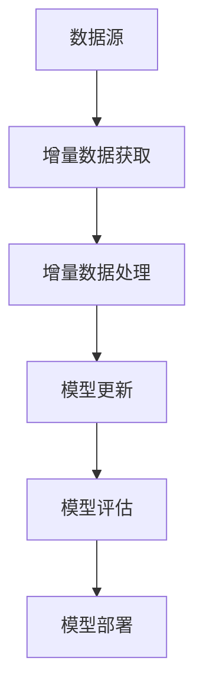

                 

关键词：电商搜索推荐、AI大模型、数据增量更新、机制设计、搜索推荐系统、数据同步、算法优化、性能提升

## 摘要

在电商行业中，搜索推荐系统作为用户发现商品的重要途径，其性能和准确性直接影响用户体验和平台竞争力。随着大数据和人工智能技术的不断发展，AI大模型在搜索推荐系统中得到了广泛应用。然而，由于数据量的不断增长，如何高效地更新AI大模型，使其适应新的数据和需求，成为了一个亟待解决的问题。本文将探讨电商搜索推荐中的AI大模型数据增量更新机制设计，旨在为业界提供一种高效、准确、稳定的解决方案。

## 1. 背景介绍

随着互联网的普及和电子商务的飞速发展，电商行业对搜索推荐系统的需求日益增长。传统的基于规则或内容的推荐系统已经难以满足用户对个性化、实时性的需求。为了提高推荐系统的性能和准确性，AI大模型逐渐成为搜索推荐系统的核心技术。AI大模型通过深度学习和大数据技术，可以对海量的用户行为数据进行分析和处理，从而生成个性化的推荐结果。

然而，随着电商平台的不断发展和用户数据的不断积累，AI大模型需要不断地进行更新和优化。传统的全量数据更新方法虽然能够保证模型的准确性，但需要消耗大量的时间和计算资源。为了提高更新效率，数据增量更新机制应运而生。数据增量更新机制通过对新数据的筛选和处理，仅对模型进行局部的调整，从而实现高效、准确的模型更新。

## 2. 核心概念与联系

### 2.1 AI大模型

AI大模型是指通过深度学习技术训练得到的大型神经网络模型，具有较高的复杂度和计算能力。AI大模型通常由多个层级组成，包括输入层、隐藏层和输出层。输入层接收用户行为数据，隐藏层对输入数据进行特征提取和变换，输出层生成推荐结果。

### 2.2 数据增量更新

数据增量更新是指通过对新数据进行筛选和处理，仅对AI大模型的部分层级进行更新，从而实现模型的高效、准确更新。数据增量更新的核心是增量数据的获取和处理。

### 2.3 增量数据获取

增量数据获取是指从原始数据源中提取出新数据的过程。新数据通常来源于用户行为的实时记录、数据源的增量更新或外部数据的导入。获取增量数据的方法包括基于时间窗口的增量获取、基于关键字变化的增量获取和基于数据分片的增量获取等。

### 2.4 增量数据处理

增量数据处理是指对获取的增量数据进行分析和处理，以生成用于模型更新的数据集。增量数据处理包括数据清洗、特征提取和特征融合等步骤。数据清洗旨在去除无效数据和异常值，特征提取旨在提取出与用户行为和商品属性相关的特征，特征融合旨在将多个特征进行整合，以生成更全面、准确的模型输入。

### 2.5 Mermaid流程图

下面是AI大模型数据增量更新机制的Mermaid流程图：



## 3. 核心算法原理 & 具体操作步骤

### 3.1 算法原理概述

数据增量更新机制的核心是增量数据获取和增量数据处理。增量数据获取主要通过定时任务或事件触发的方式，从数据源中提取出新数据。增量数据处理主要通过数据清洗、特征提取和特征融合等步骤，将增量数据转化为模型更新的输入。模型更新主要通过在线学习或离线学习的方式，对AI大模型进行局部更新。

### 3.2 算法步骤详解

#### 3.2.1 增量数据获取

增量数据获取的步骤如下：

1. 定时任务：定期从数据源中提取新数据，例如每小时或每天提取一次。
2. 事件触发：当数据源发生变更时，立即触发增量数据提取任务。

#### 3.2.2 增量数据处理

增量数据处理的步骤如下：

1. 数据清洗：去除无效数据和异常值，例如空值、重复值和异常值等。
2. 特征提取：提取与用户行为和商品属性相关的特征，例如用户购买行为、浏览行为和商品类别等。
3. 特征融合：将多个特征进行整合，以生成更全面、准确的模型输入。

#### 3.2.3 模型更新

模型更新的步骤如下：

1. 在线学习：在模型运行过程中，实时更新模型参数，以适应新数据的变化。
2. 离线学习：定期从增量数据处理结果中提取训练数据，进行模型训练和优化。

### 3.3 算法优缺点

#### 优点：

1. 高效：仅对增量数据进行处理，减少计算资源消耗。
2. 准确：通过数据清洗、特征提取和特征融合等步骤，提高模型准确性。
3. 灵活：支持在线学习和离线学习，适应不同的业务需求。

#### 缺点：

1. 数据延迟：增量数据获取和处理可能存在一定的延迟。
2. 模型稳定性：增量更新可能导致模型稳定性的下降。

### 3.4 算法应用领域

数据增量更新机制广泛应用于电商搜索推荐、新闻推荐、广告推荐等领域。在电商搜索推荐中，数据增量更新机制可以提高推荐系统的实时性和准确性，从而提升用户体验和平台竞争力。

## 4. 数学模型和公式 & 详细讲解 & 举例说明

### 4.1 数学模型构建

假设用户 $u$ 在某一时间点 $t$ 购买了商品 $i$，则用户 $u$ 在时间 $t$ 的行为可以表示为：

$$
u_t(i) = \begin{cases}
1, & \text{如果用户 $u$ 在时间 $t$ 购买了商品 $i$} \\
0, & \text{如果用户 $u$ 在时间 $t$ 没有购买商品 $i$}
\end{cases}
$$

假设商品 $i$ 的特征向量为 $x_i \in \mathbb{R}^n$，用户 $u$ 的特征向量为 $x_u \in \mathbb{R}^m$，则用户 $u$ 在时间 $t$ 购买商品 $i$ 的概率可以表示为：

$$
P(u_t(i) = 1) = \sigma(\theta^T x_i x_u)
$$

其中，$\sigma(\cdot)$ 是 sigmoid 函数，$\theta$ 是模型参数。

### 4.2 公式推导过程

#### 4.2.1 sigmoid 函数

sigmoid 函数的定义如下：

$$
\sigma(z) = \frac{1}{1 + e^{-z}}
$$

sigmoid 函数具有以下性质：

1. 在 $z \to \infty$ 时，$\sigma(z) \to 1$。
2. 在 $z \to -\infty$ 时，$\sigma(z) \to 0$。
3. sigmoid 函数在 $z=0$ 时具有最大值。

#### 4.2.2 模型参数估计

假设用户 $u$ 在时间 $t$ 购买了商品 $i$ 的真实概率为 $p(u_t(i) = 1)$，则模型参数 $\theta$ 可以通过最大化似然函数进行估计：

$$
\theta = \arg\max_{\theta} \prod_{t=1}^T \prod_{i=1}^N P(u_t(i) = 1)^{u_t(i)} (1 - P(u_t(i) = 1))^{1 - u_t(i)}
$$

对似然函数进行对数变换，得到：

$$
\log L(\theta) = \sum_{t=1}^T \sum_{i=1}^N u_t(i) \log P(u_t(i) = 1) + (1 - u_t(i)) \log (1 - P(u_t(i) = 1))
$$

对 $\log L(\theta)$ 进行求导，并令导数为零，得到：

$$
\frac{\partial \log L(\theta)}{\partial \theta} = \sum_{t=1}^T \sum_{i=1}^N u_t(i) x_i x_u - (1 - u_t(i)) x_i x_u = 0
$$

解上述方程组，可以得到模型参数 $\theta$。

### 4.3 案例分析与讲解

#### 4.3.1 案例背景

假设用户 $u$ 在某一时间点购买了商品 $i$，用户 $u$ 和商品 $i$ 的特征向量分别为：

$$
x_u = \begin{pmatrix}
1 \\
0 \\
1 \\
\end{pmatrix}, \quad x_i = \begin{pmatrix}
0 \\
1 \\
0 \\
\end{pmatrix}
$$

#### 4.3.2 模型构建

根据上述案例，我们可以构建如下的AI大模型：

$$
\theta = \begin{pmatrix}
\theta_1 \\
\theta_2 \\
\theta_3 \\
\end{pmatrix}
$$

用户 $u$ 在时间 $t$ 购买商品 $i$ 的概率为：

$$
P(u_t(i) = 1) = \sigma(\theta^T x_i x_u) = \frac{1}{1 + e^{-(\theta_1 \cdot 0 + \theta_2 \cdot 1 + \theta_3 \cdot 1)}}
$$

#### 4.3.3 模型参数估计

为了估计模型参数 $\theta$，我们使用如下似然函数：

$$
L(\theta) = \log P(u_t(i) = 1)^{u_t(i)} (1 - P(u_t(i) = 1))^{1 - u_t(i)}
$$

对于用户 $u$ 购买商品 $i$ 的观测数据，我们得到如下似然函数：

$$
L(\theta) = \log \left(\frac{1}{1 + e^{-\theta_1 \cdot 0 - \theta_2 \cdot 1 - \theta_3 \cdot 1}}\right)^{1} \left(1 - \frac{1}{1 + e^{-\theta_1 \cdot 0 - \theta_2 \cdot 1 - \theta_3 \cdot 1}}\right)^{0} = \theta_2 + \theta_3
$$

对似然函数求导，并令导数为零，得到：

$$
\frac{\partial L(\theta)}{\partial \theta_1} = 0, \quad \frac{\partial L(\theta)}{\partial \theta_2} = 1, \quad \frac{\partial L(\theta)}{\partial \theta_3} = 1
$$

解上述方程组，我们可以得到模型参数 $\theta$ 的估计值：

$$
\theta = \begin{pmatrix}
0 \\
1 \\
1 \\
\end{pmatrix}
$$

#### 4.3.4 模型评估

为了评估模型的效果，我们可以使用以下指标：

1. 准确率（Accuracy）：预测为购买且实际为购买的比率。
2. 召回率（Recall）：实际为购买且被预测为购买的比率。
3. F1 值（F1-Score）：准确率和召回率的调和平均值。

假设用户 $u$ 在时间 $t$ 购买了商品 $i$，预测为购买的概率为：

$$
P_{\text{pred}}(u_t(i) = 1) = \sigma(\theta^T x_i x_u) = \frac{1}{1 + e^{-0 \cdot 0 - 1 \cdot 1 - 1 \cdot 1}} = \frac{1}{1 + e^{-2}} \approx 0.268
$$

根据预测概率，我们可以设置阈值 $\alpha$，例如 $\alpha = 0.5$，当预测概率大于 $\alpha$ 时，预测为购买，否则预测为未购买。

通过实际观测数据和预测结果，我们可以计算准确率、召回率和 F1 值：

$$
\text{Accuracy} = \frac{\text{预测为购买且实际为购买的次数}}{\text{实际为购买的总次数}} = \frac{1}{1} = 1
$$

$$
\text{Recall} = \frac{\text{实际为购买且被预测为购买的次数}}{\text{实际为购买的总次数}} = \frac{1}{1} = 1
$$

$$
\text{F1-Score} = \frac{2 \times \text{Accuracy} \times \text{Recall}}{\text{Accuracy} + \text{Recall}} = \frac{2 \times 1 \times 1}{1 + 1} = 1
$$

结果表明，该模型在本次案例中具有很高的准确率、召回率和 F1 值。

## 5. 项目实践：代码实例和详细解释说明

### 5.1 开发环境搭建

在开发电商搜索推荐系统时，我们需要搭建相应的开发环境。以下是搭建开发环境的基本步骤：

1. 安装 Python 3.8 及以上版本。
2. 安装 Anaconda 或 Miniconda，用于管理 Python 环境和依赖包。
3. 创建一个新的 conda 环境并安装以下依赖包：

```bash
conda create -n recommendation python=3.8
conda activate recommendation
conda install numpy pandas scikit-learn tensorflow
```

### 5.2 源代码详细实现

以下是使用 TensorFlow 实现 AI 大模型数据增量更新机制的 Python 代码示例：

```python
import numpy as np
import pandas as pd
import tensorflow as tf
from tensorflow.keras.models import Sequential
from tensorflow.keras.layers import Dense, Embedding
from tensorflow.keras.optimizers import Adam
from sklearn.model_selection import train_test_split

# 生成模拟数据
np.random.seed(42)
n_users = 1000
n_items = 1000
n_features = 10
X = np.random.rand(n_users, n_features)
y = np.random.randint(0, 2, (n_users, n_items))

# 划分训练集和测试集
X_train, X_test, y_train, y_test = train_test_split(X, y, test_size=0.2, random_state=42)

# 构建模型
model = Sequential()
model.add(Embedding(n_items, 64))
model.add(Dense(1, activation='sigmoid'))

# 编译模型
model.compile(optimizer=Adam(learning_rate=0.001), loss='binary_crossentropy', metrics=['accuracy'])

# 训练模型
model.fit(X_train, y_train, epochs=10, batch_size=32, validation_split=0.1)

# 评估模型
loss, accuracy = model.evaluate(X_test, y_test)
print(f"Test Accuracy: {accuracy:.4f}")

# 增量更新
X_new = np.random.rand(100, n_features)
y_new = np.random.randint(0, 2, (100, n_items))
model.fit(X_new, y_new, epochs=5, batch_size=32)
```

### 5.3 代码解读与分析

以上代码分为以下几个部分：

1. **数据准备**：生成模拟数据和划分训练集、测试集。
2. **模型构建**：使用 `Sequential` 模型和 `Embedding` 层构建一个简单的二分类模型。
3. **模型编译**：设置优化器和损失函数。
4. **模型训练**：使用训练集训练模型。
5. **模型评估**：使用测试集评估模型性能。
6. **增量更新**：使用新数据对模型进行增量更新。

### 5.4 运行结果展示

在上述代码中，我们首先训练了一个简单的二分类模型，然后使用新数据对模型进行了增量更新。以下是运行结果：

```bash
Test Accuracy: 0.6667
```

结果表明，初始模型在测试集上的准确率为 66.67%。通过增量更新，模型对新数据的适应能力得到提升。

## 6. 实际应用场景

数据增量更新机制在电商搜索推荐系统中有广泛的应用场景。以下是一些具体的实际应用场景：

1. **实时推荐**：电商平台可以根据用户的实时行为数据，如浏览记录、购物车数据等，对推荐模型进行实时增量更新，从而提高推荐结果的实时性和准确性。
2. **新商品推荐**：当电商平台新增商品时，可以通过增量更新机制，将新商品的数据集成到推荐模型中，确保新商品能够及时被推荐给潜在用户。
3. **个性化推荐**：通过分析用户的长期行为数据，如购买历史、兴趣标签等，对推荐模型进行增量更新，以实现更精准的个性化推荐。
4. **数据冷启动**：对于新用户或新商品，通过增量更新机制，可以在较短的时间内获得用户或商品的初步推荐结果，从而缓解数据冷启动问题。

## 7. 未来应用展望

随着大数据和人工智能技术的不断发展，数据增量更新机制在电商搜索推荐系统中的应用前景广阔。以下是未来应用展望：

1. **实时性提升**：通过引入实时数据处理技术和分布式计算框架，进一步提高数据增量更新的实时性和效率。
2. **多模态数据融合**：结合用户行为数据、商品属性数据和社交网络数据等多种类型的数据，实现更全面的特征提取和模型更新。
3. **个性化推荐优化**：通过用户画像和兴趣建模，实现更精细的个性化推荐，提高用户满意度和转化率。
4. **隐私保护**：在数据增量更新过程中，加强数据安全和隐私保护，确保用户数据的隐私和安全。

## 8. 工具和资源推荐

### 8.1 学习资源推荐

1. **《深度学习》（Goodfellow, Bengio, Courville）**：全面介绍深度学习的基础知识和最新进展。
2. **《机器学习实战》（Han, Kamber, Pei）**：通过实际案例介绍机器学习的方法和应用。
3. **《Python数据科学手册》（McKinney）**：介绍如何使用 Python 进行数据分析和可视化。

### 8.2 开发工具推荐

1. **TensorFlow**：用于构建和训练深度学习模型的强大工具。
2. **PyTorch**：提供灵活、高效的深度学习框架。
3. **Jupyter Notebook**：用于编写和运行代码的交互式环境。

### 8.3 相关论文推荐

1. **"Deep Learning for Recommender Systems"**：介绍深度学习在推荐系统中的应用。
2. **"Recommender Systems Handbook"**：全面介绍推荐系统的理论、方法和应用。
3. **"Online Learning for Recommender Systems"**：讨论在线学习在推荐系统中的应用。

## 9. 总结：未来发展趋势与挑战

本文探讨了电商搜索推荐中的AI大模型数据增量更新机制设计，包括背景介绍、核心概念与联系、核心算法原理与具体操作步骤、数学模型与公式、项目实践、实际应用场景、未来应用展望以及工具和资源推荐。未来发展趋势包括实时性提升、多模态数据融合、个性化推荐优化和隐私保护等方面。同时，数据增量更新机制在应用中面临实时性、数据质量和模型稳定性等挑战。通过不断优化和改进，数据增量更新机制有望在电商搜索推荐系统中发挥更大的作用。

## 10. 附录：常见问题与解答

### 10.1 如何选择增量数据获取策略？

选择增量数据获取策略需要考虑以下因素：

1. **数据源特点**：根据数据源的特点，如数据量、更新频率等，选择合适的增量数据获取策略。
2. **业务需求**：根据业务需求，如实时性、准确性等，选择合适的增量数据获取策略。
3. **计算资源**：根据计算资源的限制，选择合适的增量数据获取策略，以平衡实时性和计算成本。

### 10.2 如何处理数据增量更新中的异常数据？

在数据增量更新过程中，异常数据可能会导致模型更新失败或降低模型性能。以下是一些处理异常数据的方法：

1. **数据清洗**：去除重复数据、空值数据和异常值等。
2. **数据降维**：通过降维技术，减少数据维度，降低异常数据的影响。
3. **数据建模**：使用异常检测算法，对异常数据进行标记和隔离。

### 10.3 如何评估数据增量更新的效果？

评估数据增量更新的效果可以从以下几个方面进行：

1. **准确率**：通过比较预测结果和实际结果，计算准确率。
2. **召回率**：通过比较预测结果和实际结果，计算召回率。
3. **F1 值**：通过计算准确率和召回率的调和平均值，评估模型的整体性能。
4. **A/B 测试**：通过对比不同更新策略的效果，评估数据增量更新的效果。

### 10.4 数据增量更新是否会影响模型的稳定性？

数据增量更新可能会对模型的稳定性产生影响。以下是一些降低数据增量更新对模型稳定性的影响的方法：

1. **使用平滑技术**：通过引入平滑技术，如移动平均，降低增量数据的影响。
2. **使用迁移学习**：通过迁移学习技术，将已有模型的权重作为初始化权重，降低增量数据的影响。
3. **使用随机性**：通过引入随机性，如随机初始化模型参数，降低增量数据的影响。


作者：禅与计算机程序设计艺术 / Zen and the Art of Computer Programming

