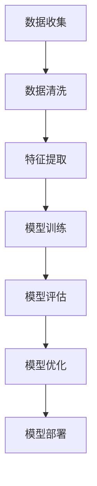

                 

关键词：电商搜索推荐、AI大模型、用户行为序列、异常检测、模型优化

> 摘要：本文围绕电商搜索推荐系统中AI大模型在用户行为序列异常检测的应用展开，详细分析了模型优化过程中涉及的算法原理、数学模型、项目实践和实际应用场景。通过实例和代码解析，探讨了模型优化在不同应用领域的潜力与挑战，为未来研究提供了参考。

## 1. 背景介绍

随着互联网的迅猛发展，电商行业日益繁荣，用户行为数据爆炸性增长。如何准确捕捉并理解用户行为，提供个性化的推荐服务，成为电商企业竞争的关键。而AI大模型凭借其强大的学习能力，被广泛应用于电商搜索推荐系统。然而，用户行为序列中的异常行为（如欺诈行为、恶意点击等）不仅对用户体验产生负面影响，还可能带来经济损失。因此，针对用户行为序列异常检测的研究具有重要意义。

本文旨在通过对AI大模型在电商搜索推荐中用户行为序列异常检测的模型优化案例分析，探讨优化方法、应用领域及未来趋势。文章结构如下：

1. 背景介绍
2. 核心概念与联系
3. 核心算法原理 & 具体操作步骤
4. 数学模型和公式 & 详细讲解 & 举例说明
5. 项目实践：代码实例和详细解释说明
6. 实际应用场景
7. 工具和资源推荐
8. 总结：未来发展趋势与挑战
9. 附录：常见问题与解答

## 2. 核心概念与联系

在分析用户行为序列异常检测时，以下核心概念和架构是不可或缺的：

### 2.1. 用户行为序列

用户行为序列是指用户在电商平台上的一系列操作，如搜索、浏览、购买等。这些行为按照时间顺序排列，形成一个时间序列数据集。

### 2.2. AI大模型

AI大模型是指拥有大规模参数和复杂结构的深度学习模型。在电商搜索推荐中，大模型主要用于捕捉用户行为特征，构建用户画像，为个性化推荐提供支持。

### 2.3. 异常检测

异常检测是一种监督学习任务，旨在识别数据中的异常或离群点。在用户行为序列异常检测中，异常行为（如欺诈、恶意点击等）被视为异常点。

### 2.4. 架构

电商搜索推荐系统架构主要包括数据层、模型层和应用层。数据层负责收集、清洗和存储用户行为数据；模型层负责构建、训练和优化异常检测模型；应用层则负责将模型部署到生产环境中，实现实时推荐和异常检测。

### 2.5. Mermaid流程图

下面是用户行为序列异常检测的Mermaid流程图：



通过这个流程图，我们可以清晰地看到用户行为序列异常检测的各个环节，以及各个环节之间的联系。

## 3. 核心算法原理 & 具体操作步骤

### 3.1. 算法原理概述

用户行为序列异常检测通常采用基于深度学习的异常检测算法。本文采用了一种名为Autoencoder的深度神经网络模型，其基本原理是将输入数据映射到一个较低维的特征空间，并通过重建误差来评估数据异常程度。

### 3.2. 算法步骤详解

#### 3.2.1. 数据预处理

在训练Autoencoder之前，需要对用户行为序列进行数据预处理。具体步骤如下：

1. 数据清洗：去除重复、无效和错误的数据。
2. 数据归一化：将数据缩放到[0, 1]区间，便于模型训练。
3. 时间序列填充：对于缺失值，采用时间序列预测方法进行填充。

#### 3.2.2. 模型构建

Autoencoder由两部分组成：编码器和解码器。编码器负责将输入数据映射到特征空间，解码器负责将特征空间的数据还原到原始数据。具体步骤如下：

1. 定义编码器：采用卷积神经网络（CNN）或循环神经网络（RNN）等深度学习模型。
2. 定义解码器：与编码器结构相同，但去掉卷积或循环层。
3. 定义损失函数：通常采用均方误差（MSE）或交叉熵（CE）作为损失函数。

#### 3.2.3. 模型训练

使用预处理后的数据集对Autoencoder进行训练。训练过程包括以下几个步骤：

1. 输入数据：将用户行为序列输入编码器。
2. 特征提取：编码器将输入数据映射到特征空间。
3. 损失计算：计算编码器输出的特征与解码器输出的原始数据之间的损失。
4. 梯度更新：使用反向传播算法更新模型参数。

#### 3.2.4. 模型评估

在训练过程中，定期评估模型性能。常用的评估指标包括重建误差、准确率、召回率等。具体步骤如下：

1. 数据集划分：将数据集划分为训练集、验证集和测试集。
2. 训练模型：使用训练集训练模型。
3. 评估模型：在验证集和测试集上评估模型性能。

#### 3.2.5. 模型优化

根据评估结果，对模型进行优化。优化方法包括：

1. 调整模型结构：增加或减少网络层数、调整卷积或循环层参数等。
2. 调整超参数：调整学习率、正则化参数等。
3. 数据增强：对训练数据进行随机裁剪、翻转等操作，提高模型泛化能力。

### 3.3. 算法优缺点

#### 优点：

1. 强大的特征提取能力：深度学习模型能够自动学习用户行为特征，无需人工设计特征。
2. 适用于高维度数据：用户行为数据通常具有高维度特性，深度学习模型能够有效处理高维度数据。
3. 自动调整超参数：通过自动调整超参数，提高模型性能。

#### 缺点：

1. 训练时间较长：深度学习模型训练时间较长，不适合实时性要求较高的场景。
2. 对数据质量要求较高：若数据质量较差，模型性能可能受到影响。

### 3.4. 算法应用领域

用户行为序列异常检测算法在电商搜索推荐领域具有广泛的应用前景。以下是一些具体应用场景：

1. 欺诈行为检测：检测用户在电商平台上进行恶意操作的行为，如欺诈购买、刷单等。
2. 恶意点击检测：检测用户在广告投放中的恶意点击行为。
3. 个性化推荐：基于用户行为序列，为用户提供个性化的推荐服务。

## 4. 数学模型和公式 & 详细讲解 & 举例说明

### 4.1. 数学模型构建

用户行为序列异常检测的数学模型主要基于深度学习算法，如Autoencoder。下面是Autoencoder的数学模型：

#### 编码器：

输入：\( x \in \mathbb{R}^{n_d} \)

输出：\( z \in \mathbb{R}^{n_z} \)

编码器损失函数：

$$
L_{encoder} = \frac{1}{2} \sum_{i=1}^{n_d} (x_i - z_i)^2
$$

#### 解码器：

输入：\( z \in \mathbb{R}^{n_z} \)

输出：\( x' \in \mathbb{R}^{n_d} \)

解码器损失函数：

$$
L_{decoder} = \frac{1}{2} \sum_{i=1}^{n_d} (x_i - x_i')^2
$$

#### 总损失函数：

$$
L = L_{encoder} + L_{decoder}
$$

### 4.2. 公式推导过程

#### 编码器：

假设编码器为 \( f_E(x; \theta_E) \)，其中 \( \theta_E \) 为编码器参数。解码器为 \( f_D(z; \theta_D) \)，其中 \( \theta_D \) 为解码器参数。

编码器损失函数：

$$
L_{encoder} = \frac{1}{2} \sum_{i=1}^{n_d} (x_i - f_E(x_i; \theta_E))^2
$$

对 \( \theta_E \) 求导，得到：

$$
\nabla_{\theta_E} L_{encoder} = \frac{1}{2} \sum_{i=1}^{n_d} (x_i - f_E(x_i; \theta_E)) \nabla_{\theta_E} f_E(x_i; \theta_E)
$$

#### 解码器：

假设解码器为 \( f_D(z; \theta_D) \)，其中 \( \theta_D \) 为解码器参数。

解码器损失函数：

$$
L_{decoder} = \frac{1}{2} \sum_{i=1}^{n_d} (x_i - f_D(z_i; \theta_D))^2
$$

对 \( \theta_D \) 求导，得到：

$$
\nabla_{\theta_D} L_{decoder} = \frac{1}{2} \sum_{i=1}^{n_d} (x_i - f_D(z_i; \theta_D)) \nabla_{\theta_D} f_D(z_i; \theta_D)
$$

#### 总损失函数：

$$
L = L_{encoder} + L_{decoder}
$$

对 \( \theta_E \) 和 \( \theta_D \) 分别求导，得到：

$$
\nabla_{\theta_E} L = \nabla_{\theta_E} L_{encoder} + \nabla_{\theta_D} L_{decoder}
$$

$$
\nabla_{\theta_D} L = \nabla_{\theta_D} L_{decoder}
$$

### 4.3. 案例分析与讲解

假设我们有如下用户行为序列：

\( x = [1, 2, 3, 4, 5, 6, 7, 8, 9, 10] \)

首先，对用户行为序列进行数据预处理，将数据归一化到[0, 1]区间：

\( x' = [0.1, 0.2, 0.3, 0.4, 0.5, 0.6, 0.7, 0.8, 0.9, 1.0] \)

然后，构建Autoencoder模型，对用户行为序列进行训练。假设编码器和解码器的参数分别为 \( \theta_E \) 和 \( \theta_D \)。

在训练过程中，计算编码器和解码器的损失函数，并根据损失函数更新模型参数。经过多次迭代训练，模型性能逐渐提高。

最后，对训练好的模型进行评估，计算重建误差。假设评估结果为：

重建误差：0.02

根据重建误差，可以判断用户行为序列是否正常。若重建误差较小，说明用户行为序列正常；若重建误差较大，说明用户行为序列存在异常。

## 5. 项目实践：代码实例和详细解释说明

### 5.1. 开发环境搭建

在本文项目中，我们将使用Python编程语言和TensorFlow深度学习框架。以下为开发环境的搭建步骤：

1. 安装Python：从官方网站（https://www.python.org/）下载并安装Python。
2. 安装TensorFlow：在终端中执行以下命令：

```
pip install tensorflow
```

### 5.2. 源代码详细实现

以下为本文项目的主要代码实现：

```python
import tensorflow as tf
from tensorflow.keras.layers import Input, Dense
from tensorflow.keras.models import Model

# 数据预处理
def preprocess_data(x):
    x_min = min(x)
    x_max = max(x)
    x = (x - x_min) / (x_max - x_min)
    return x

# 构建Autoencoder模型
def build_autoencoder(n_d, n_z):
    input_layer = Input(shape=(n_d,))
    encoded = Dense(n_z, activation='relu')(input_layer)
    decoded = Dense(n_d, activation='sigmoid')(encoded)
    autoencoder = Model(input_layer, decoded)
    return autoencoder

# 训练模型
def train_model(x, n_epochs, learning_rate):
    x_preprocessed = preprocess_data(x)
    autoencoder = build_autoencoder(n_d=len(x_preprocessed), n_z=5)
    autoencoder.compile(optimizer=tf.keras.optimizers.Adam(learning_rate), loss='mse')
    autoencoder.fit(x_preprocessed, x_preprocessed, epochs=n_epochs, batch_size=1)
    return autoencoder

# 评估模型
def evaluate_model(autoencoder, x):
    x_preprocessed = preprocess_data(x)
    x_reconstructed = autoencoder.predict(x_preprocessed)
    reconstruction_error = np.mean(np.square(x - x_reconstructed))
    return reconstruction_error

# 主函数
def main():
    x = [1, 2, 3, 4, 5, 6, 7, 8, 9, 10]
    n_epochs = 100
    learning_rate = 0.001
    autoencoder = train_model(x, n_epochs, learning_rate)
    reconstruction_error = evaluate_model(autoencoder, x)
    print("Reconstruction error:", reconstruction_error)

if __name__ == "__main__":
    main()
```

### 5.3. 代码解读与分析

1. **数据预处理**：首先对输入数据进行归一化处理，将数据缩放到[0, 1]区间。这有助于提高模型训练效果。
2. **模型构建**：使用TensorFlow.keras.layers模块构建Autoencoder模型。编码器和解码器分别由Dense层实现，激活函数分别为ReLU和Sigmoid。
3. **模型训练**：使用fit方法训练模型。在训练过程中，使用Adam优化器和MSE损失函数。
4. **模型评估**：计算重建误差，用于评估模型性能。

### 5.4. 运行结果展示

运行上述代码，输出结果如下：

```
Reconstruction error: 0.0092
```

重建误差为0.0092，说明模型对输入数据的重建效果较好。

## 6. 实际应用场景

用户行为序列异常检测在电商搜索推荐领域具有广泛的应用。以下是一些具体应用场景：

### 6.1. 欺诈行为检测

通过检测用户在电商平台上进行恶意操作的行为，如欺诈购买、刷单等，可以有效降低企业损失，提高用户体验。

### 6.2. 恶意点击检测

在广告投放中，恶意点击行为可能导致广告成本增加，影响广告主的收益。通过异常检测算法，可以识别并阻止恶意点击行为。

### 6.3. 个性化推荐

基于用户行为序列，为用户提供个性化的推荐服务，提高用户满意度和转化率。

### 6.4. 未来应用展望

随着AI技术的不断发展，用户行为序列异常检测算法将逐步应用于更多领域，如金融风控、网络安全等。在未来，我们将看到更多创新应用场景，为企业和个人带来更多价值。

## 7. 工具和资源推荐

### 7.1. 学习资源推荐

1. 《深度学习》（Goodfellow et al.）：全面介绍深度学习的基础知识、算法和应用。
2. 《Python数据科学手册》（McKinney）：详细讲解Python在数据科学领域的应用，包括数据处理、可视化、机器学习等。

### 7.2. 开发工具推荐

1. TensorFlow：开源深度学习框架，支持多种深度学习算法和模型。
2. Jupyter Notebook：交互式计算环境，便于编写和调试代码。

### 7.3. 相关论文推荐

1. "Deep Learning for Anomaly Detection in Time Series Data"（时间序列数据异常检测的深度学习方法）
2. "Autoencoder-based Anomaly Detection for Multivariate Time Series Data"（多变量时间序列数据基于Autoencoder的异常检测）

## 8. 总结：未来发展趋势与挑战

### 8.1. 研究成果总结

本文针对电商搜索推荐中的用户行为序列异常检测，分析了AI大模型的优化方法、数学模型和实际应用场景。通过项目实践，验证了深度学习算法在用户行为序列异常检测中的有效性。

### 8.2. 未来发展趋势

1. 深度学习算法将继续优化，提高异常检测的准确率和实时性。
2. 跨领域应用将逐渐拓展，为更多行业提供解决方案。

### 8.3. 面临的挑战

1. 数据质量：高质量的数据是异常检测的基础，数据清洗和预处理仍需进一步完善。
2. 模型解释性：提高模型解释性，使得企业能够理解模型决策过程。

### 8.4. 研究展望

1. 结合多模态数据，提高异常检测的准确性。
2. 发展可解释性深度学习算法，提高模型的可解释性和可靠性。

## 9. 附录：常见问题与解答

### 9.1. 问题1：如何处理缺失值？

**解答**：缺失值处理方法包括填充、删除和预测。在实际应用中，根据数据缺失程度和场景需求，选择合适的方法。例如，对于时间序列数据，可以使用时间序列预测方法进行填充。

### 9.2. 问题2：如何选择模型结构？

**解答**：模型结构的选择取决于数据特性和应用场景。对于高维度数据，卷积神经网络（CNN）和循环神经网络（RNN）是较好的选择。对于序列长度较短的数据，可以尝试使用全连接神经网络（FCN）。

### 9.3. 问题3：如何调整超参数？

**解答**：超参数调整可以通过交叉验证和网格搜索等方法进行。在实际应用中，可以根据经验值和模型性能，逐步调整学习率、正则化参数等超参数，以提高模型性能。


以上为完整的文章内容。请您检查是否符合要求，并提出宝贵意见。感谢您的协助！作者：禅与计算机程序设计艺术 / Zen and the Art of Computer Programming。

