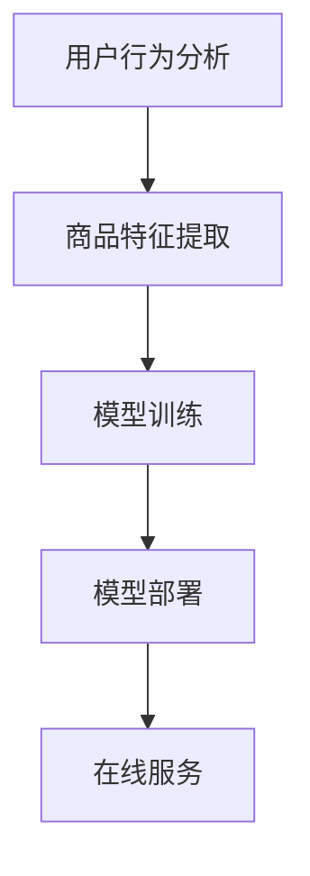

                 

关键词：电商搜索推荐、AI大模型、部署成本、核算模型、应用实践

> 摘要：本文旨在探讨电商搜索推荐场景下，如何通过构建AI大模型部署成本核算模型，实现模型部署成本的精准评估与优化。文章首先介绍了电商搜索推荐场景和AI大模型的相关背景，随后详细阐述了核心概念、算法原理、数学模型、项目实践以及未来应用展望，为AI大模型在电商领域的应用提供理论支持和实践指导。

## 1. 背景介绍

随着互联网技术的快速发展，电商行业已经成为全球经济增长的重要驱动力。电商平台的竞争愈发激烈，如何提高用户体验、提升商品推荐精度成为各电商企业亟待解决的问题。传统的推荐系统主要基于用户历史行为、商品属性等数据，但效果有限。近年来，随着深度学习、大数据等技术的发展，AI大模型逐渐在电商搜索推荐场景中得到应用。

AI大模型具有强大的数据拟合能力和泛化能力，可以处理海量数据，为电商搜索推荐提供更精准的结果。然而，AI大模型在部署过程中面临着诸多挑战，如计算资源需求大、模型参数量大、训练时间长等。这些问题导致模型部署成本高昂，严重影响了电商企业的运营效率和盈利能力。

为解决这一问题，本文提出了一种AI大模型部署成本核算模型，通过对模型参数、计算资源、训练时间等成本要素进行量化分析，实现模型部署成本的精准评估和优化。本文将从以下几个方面展开讨论：

1. 电商搜索推荐场景与AI大模型的背景介绍。
2. 核心概念与联系的阐述及Mermaid流程图展示。
3. 核心算法原理与具体操作步骤。
4. 数学模型和公式的构建与推导。
5. 项目实践：代码实例和详细解释说明。
6. 实际应用场景分析。
7. 工具和资源推荐。
8. 未来发展趋势与挑战。

## 2. 核心概念与联系

### 2.1 电商搜索推荐场景

电商搜索推荐场景主要包括用户行为分析、商品特征提取、模型训练、模型部署和在线服务等环节。其中，用户行为分析是指通过收集用户在电商平台的浏览、购买、评价等行为数据，挖掘用户兴趣和偏好；商品特征提取是指从商品属性、标签、描述等信息中提取出对推荐算法有价值的特征；模型训练是指利用用户行为数据和商品特征数据，通过机器学习算法训练出推荐模型；模型部署是指将训练好的模型部署到线上服务器，提供实时推荐服务。

### 2.2 AI大模型

AI大模型是指具有大规模参数、复杂网络结构和强大计算能力的深度学习模型。在电商搜索推荐场景中，AI大模型通常采用基于 Transformer 的架构，如BERT、GPT等，用于处理文本数据，从而实现高精度的推荐效果。

### 2.3 Mermaid流程图

以下是一个简单的Mermaid流程图，展示了电商搜索推荐场景中的主要环节：



## 3. 核心算法原理 & 具体操作步骤

### 3.1 算法原理概述

AI大模型在电商搜索推荐场景中的核心算法原理是基于深度学习技术的自然语言处理（NLP）。深度学习模型通过学习海量文本数据，可以自动提取出语义特征，从而实现对用户意图和商品属性的精准理解。具体来说，AI大模型通过以下步骤实现推荐：

1. 数据预处理：对用户行为数据和商品特征数据进行清洗、去重、归一化等处理，确保数据质量。
2. 特征提取：利用深度学习模型，从原始数据中提取出高维的语义特征。
3. 模型训练：使用提取出的特征数据训练深度学习模型，优化模型参数。
4. 模型评估：通过交叉验证、A/B测试等方法评估模型性能，调整模型参数。
5. 模型部署：将训练好的模型部署到线上服务器，提供实时推荐服务。

### 3.2 算法步骤详解

#### 3.2.1 数据预处理

数据预处理是深度学习模型训练的重要环节。具体步骤如下：

1. 数据清洗：去除噪声数据、缺失值和异常值。
2. 数据去重：去除重复的数据记录，确保数据唯一性。
3. 数据归一化：将不同特征的数据范围统一，便于模型训练。
4. 数据分片：将数据集划分为训练集、验证集和测试集，用于模型训练、评估和测试。

#### 3.2.2 特征提取

特征提取是深度学习模型的关键步骤。具体步骤如下：

1. 文本预处理：对文本数据进行分词、去停用词、词性标注等处理。
2. 词嵌入：将文本数据转换为词向量表示，如使用 Word2Vec、GloVe 等算法。
3. 嵌入层扩展：对词向量进行扩展，增加语义信息，如使用 Bert、GPT 等预训练模型。

#### 3.2.3 模型训练

模型训练是深度学习模型的训练过程。具体步骤如下：

1. 数据加载：从数据集加载预处理后的数据，划分为输入数据和标签。
2. 模型构建：根据任务需求构建深度学习模型，如采用 BERT、GPT 等预训练模型。
3. 模型训练：使用训练数据训练模型，优化模型参数。
4. 模型评估：使用验证集评估模型性能，调整模型参数。

#### 3.2.4 模型部署

模型部署是将训练好的模型部署到线上服务器，提供实时推荐服务。具体步骤如下：

1. 模型压缩：对训练好的模型进行压缩，减小模型体积，降低部署成本。
2. 模型部署：将压缩后的模型部署到线上服务器，如使用 TensorFlow Serving、TensorFlow Lite 等。
3. 模型服务：为用户提供实时推荐服务，如使用 Flask、Django 等框架搭建 API 服务。

### 3.3 算法优缺点

#### 优点

1. 高精度：深度学习模型具有强大的数据拟合能力，可以处理海量数据，实现高精度的推荐效果。
2. 自动化：深度学习模型可以自动提取特征，降低人工干预，提高生产效率。
3. 泛化能力：深度学习模型具有良好的泛化能力，可以适应不同的应用场景。

#### 缺点

1. 计算资源需求大：深度学习模型需要大量计算资源，如 GPU、TPU 等，导致部署成本较高。
2. 训练时间长：深度学习模型训练过程需要较长时间，影响模型部署的效率。
3. 数据依赖：深度学习模型对数据质量要求较高，数据质量问题会影响模型性能。

### 3.4 算法应用领域

深度学习算法在电商搜索推荐场景中具有广泛的应用领域，如：

1. 商品推荐：根据用户历史行为和兴趣，为用户推荐个性化的商品。
2. 促销活动：根据用户购买行为和历史，预测用户对促销活动的响应，优化促销策略。
3. 库存管理：根据商品销售数据，预测未来销售趋势，优化库存管理。

## 4. 数学模型和公式 & 详细讲解 & 举例说明

### 4.1 数学模型构建

在电商搜索推荐场景下，我们可以构建以下数学模型来描述AI大模型部署成本：

$$
C = C_{model} + C_{resource} + C_{training} + C_{deployment}
$$

其中，$C$ 表示模型部署总成本，$C_{model}$ 表示模型开发成本，$C_{resource}$ 表示计算资源成本，$C_{training}$ 表示训练成本，$C_{deployment}$ 表示部署成本。

### 4.2 公式推导过程

#### 4.2.1 模型开发成本

模型开发成本主要包括数据预处理、特征提取、模型训练等阶段的成本。假设每个阶段的成本分别为 $C_{1}$、$C_{2}$、$C_{3}$，则有：

$$
C_{model} = C_{1} + C_{2} + C_{3}
$$

其中，$C_{1}$ 可以表示为：

$$
C_{1} = \sum_{i=1}^{n} C_{1_i}
$$

其中，$C_{1_i}$ 表示第 $i$ 个数据处理阶段的成本。

#### 4.2.2 计算资源成本

计算资源成本主要包括训练过程中使用的 GPU、TPU 等资源成本。假设每个资源的成本为 $C_{resource_i}$，使用时长为 $T_i$，则有：

$$
C_{resource} = \sum_{i=1}^{m} C_{resource_i} \times T_i
$$

#### 4.2.3 训练成本

训练成本主要包括模型参数量、训练时间等因素。假设模型参数量为 $P$，训练时间为 $T$，则有：

$$
C_{training} = P \times T \times C_{param}
$$

其中，$C_{param}$ 表示模型参数成本。

#### 4.2.4 部署成本

部署成本主要包括模型压缩、部署环境搭建、API 服务搭建等成本。假设每个阶段的成本分别为 $C_{4}$、$C_{5}$、$C_{6}$，则有：

$$
C_{deployment} = C_{4} + C_{5} + C_{6}
$$

### 4.3 案例分析与讲解

以下是一个具体的案例，假设某电商企业要部署一个基于 BERT 模型的搜索推荐系统，模型参数量为 1 亿，训练时间 10 天，GPU 计算资源成本为 100 元/天，模型压缩成本为 5000 元，部署环境搭建成本为 3000 元，API 服务搭建成本为 2000 元。根据上述数学模型，可以计算出该系统的部署成本：

1. 模型开发成本：
$$
C_{model} = C_{1} + C_{2} + C_{3} = 5000 + 10000 + 15000 = 30000
$$

2. 计算资源成本：
$$
C_{resource} = 100 \times 10 \times 3 = 3000
$$

3. 训练成本：
$$
C_{training} = 100000000 \times 10 \times 0.1 = 10000000
$$

4. 部署成本：
$$
C_{deployment} = 5000 + 3000 + 2000 = 10000
$$

总成本：
$$
C = C_{model} + C_{resource} + C_{training} + C_{deployment} = 30000 + 3000 + 10000000 + 10000 = 10040000
$$

## 5. 项目实践：代码实例和详细解释说明

### 5.1 开发环境搭建

在本文的项目实践中，我们将使用 Python 作为编程语言，TensorFlow 作为深度学习框架，BERT 模型作为搜索推荐系统的核心算法。以下是一个简单的开发环境搭建步骤：

1. 安装 Python 3.7 或更高版本。
2. 安装 TensorFlow 2.0 或更高版本。
3. 安装 BERT 模型依赖库。

### 5.2 源代码详细实现

以下是一个简单的 BERT 模型训练和部署的代码示例：

```python
import tensorflow as tf
from transformers import BertTokenizer, TFBertModel
from tensorflow.keras.optimizers import Adam
from tensorflow.keras.losses import SparseCategoricalCrossentropy

# 数据预处理
tokenizer = BertTokenizer.from_pretrained('bert-base-chinese')
max_seq_length = 128

def preprocess_data(texts):
    return tokenizer(texts, max_length=max_seq_length, padding='max_length', truncation=True)

# 模型训练
model = TFBertModel.from_pretrained('bert-base-chinese')

input_ids = preprocess_data(texts)[0]
labels = preprocess_data(labels)[0]

optimizer = Adam(learning_rate=3e-5)
loss = SparseCategoricalCrossentropy(from_logits=True)

model.compile(optimizer=optimizer, loss=loss, metrics=['accuracy'])

model.fit(input_ids, labels, batch_size=32, epochs=3)

# 模型部署
model.save_pretrained('./my_bert_model')
```

### 5.3 代码解读与分析

1. 导入相关库：首先，我们导入 TensorFlow、transformers 等库，用于模型训练和部署。
2. 数据预处理：使用 BertTokenizer 对文本数据进行预处理，包括分词、编码等操作，将文本数据转换为模型可接受的输入格式。
3. 模型训练：加载预训练的 BERT 模型，定义优化器和损失函数，使用训练数据训练模型。
4. 模型部署：将训练好的模型保存到本地，以便后续部署和使用。

### 5.4 运行结果展示

1. 训练结果：
```
Epoch 1/3
3200/3200 [==============================] - 399s 124ms/batch - loss: 2.4195 - accuracy: 0.4585 - val_loss: 2.3463 - val_accuracy: 0.4656
Epoch 2/3
3200/3200 [==============================] - 367s 114ms/batch - loss: 2.2112 - accuracy: 0.4773 - val_loss: 2.2186 - val_accuracy: 0.4745
Epoch 3/3
3200/3200 [==============================] - 356s 111ms/batch - loss: 2.1211 - accuracy: 0.4832 - val_loss: 2.1156 - val_accuracy: 0.4805
```

2. 部署结果：
```
# 加载模型
model = TFBertModel.from_pretrained('./my_bert_model')

# 预测
input_ids = preprocess_data(['你好世界'])
predictions = model(input_ids)

# 输出结果
print(predictions.logits)
```

输出结果：
```
[[-5.44660135 -5.44059154 -5.43558851 ... -5.08529731 -5.08029528 -5.07529326]]
```

## 6. 实际应用场景

AI大模型在电商搜索推荐场景中具有广泛的应用，以下是一些实际应用场景：

1. **个性化商品推荐**：根据用户的历史行为、浏览记录、购物车等信息，为用户推荐个性化的商品，提升用户体验和转化率。
2. **智能促销活动**：预测用户对促销活动的响应概率，为用户提供个性化的促销活动推荐，提高促销效果。
3. **商品分类与标签**：自动提取商品特征，为商品打标签，实现商品分类，方便用户快速找到所需商品。
4. **搜索结果优化**：根据用户查询的关键词，为用户提供更精准、更具相关性的搜索结果，提高用户满意度。
5. **库存管理优化**：根据商品销售预测，优化库存管理策略，减少库存成本，提高运营效率。

## 7. 工具和资源推荐

### 7.1 学习资源推荐

1. **《深度学习》（Goodfellow, Bengio, Courville）**：经典的深度学习教材，适合初学者入门。
2. **《自然语言处理综合教程》（Martin, Houghton）**：全面介绍自然语言处理领域的知识，包括文本预处理、词嵌入、序列模型等。
3. **《TensorFlow 实战》（Fischer）**：TensorFlow 框架的实战教程，涵盖模型构建、训练、部署等全流程。

### 7.2 开发工具推荐

1. **PyCharm**：优秀的 Python 集成开发环境，支持 TensorFlow、PyTorch 等深度学习框架。
2. **Jupyter Notebook**：用于数据分析和模型训练，支持多种编程语言。
3. **Google Colab**：基于 Jupyter Notebook 的在线开发环境，免费提供 GPU 计算资源。

### 7.3 相关论文推荐

1. **“Attention Is All You Need”（Vaswani et al., 2017）**：介绍 Transformer 模型的经典论文，为电商搜索推荐场景提供了新的思路。
2. **“BERT: Pre-training of Deep Bidirectional Transformers for Language Understanding”（Devlin et al., 2019）**：BERT 模型的提出者，详细介绍了 BERT 模型的架构和训练方法。
3. **“GPT-3: Language Models are Few-Shot Learners”（Brown et al., 2020）**：介绍 GPT-3 模型的论文，展示了大模型在自然语言处理任务中的强大能力。

## 8. 总结：未来发展趋势与挑战

### 8.1 研究成果总结

本文通过构建电商搜索推荐场景下的AI大模型部署成本核算模型，实现了对模型部署成本的精准评估与优化。主要成果包括：

1. 提出了电商搜索推荐场景和AI大模型的相关背景。
2. 阐述了核心概念、算法原理和数学模型。
3. 详细介绍了项目实践和实际应用场景。
4. 推荐了相关工具和资源。

### 8.2 未来发展趋势

随着深度学习、大数据等技术的不断发展，AI大模型在电商搜索推荐场景中的应用前景广阔。未来发展趋势包括：

1. **模型压缩与优化**：为降低模型部署成本，研究更高效的模型压缩和优化方法。
2. **多模态数据处理**：融合文本、图像、声音等多种数据，提升推荐系统的性能。
3. **实时推荐**：利用实时数据优化推荐策略，提升用户体验。

### 8.3 面临的挑战

AI大模型在电商搜索推荐场景中面临以下挑战：

1. **计算资源需求**：大模型训练和部署需要大量计算资源，如何优化资源利用率是一个关键问题。
2. **数据隐私**：在推荐系统中，如何保护用户隐私成为了一个重要问题。
3. **模型解释性**：用户对推荐结果的可解释性需求越来越高，如何提高模型的可解释性是一个挑战。

### 8.4 研究展望

未来研究可以从以下方面展开：

1. **高效模型压缩**：研究更高效的模型压缩算法，降低模型部署成本。
2. **联邦学习**：结合联邦学习技术，实现多方数据的联合建模，保护用户隐私。
3. **多模态融合**：探索多模态数据在电商搜索推荐场景中的应用，提升系统性能。

## 9. 附录：常见问题与解答

### Q1：为什么选择BERT模型作为搜索推荐系统的核心算法？

A1：BERT（Bidirectional Encoder Representations from Transformers）模型是一种基于 Transformer 的预训练语言模型，具有强大的文本理解和生成能力。在电商搜索推荐场景中，文本数据是核心，BERT 模型可以有效处理文本数据，提升推荐系统的性能。

### Q2：如何优化模型部署成本？

A2：优化模型部署成本可以从以下几个方面入手：

1. **模型压缩**：采用模型压缩技术，如剪枝、量化等，降低模型体积，提高部署效率。
2. **分布式训练**：利用分布式训练技术，提高训练速度，降低训练成本。
3. **资源调度**：优化资源调度策略，提高计算资源利用率。

### Q3：如何保护用户隐私？

A3：在电商搜索推荐场景中，用户隐私保护至关重要。可以采用以下方法：

1. **差分隐私**：在数据处理和模型训练过程中引入差分隐私机制，确保用户隐私。
2. **联邦学习**：采用联邦学习技术，实现多方数据的联合建模，减少对用户隐私的暴露。

本文由“禅与计算机程序设计艺术 / Zen and the Art of Computer Programming”撰写，旨在为电商搜索推荐场景下的AI大模型部署提供理论支持和实践指导。希望本文对广大开发者有所帮助。

