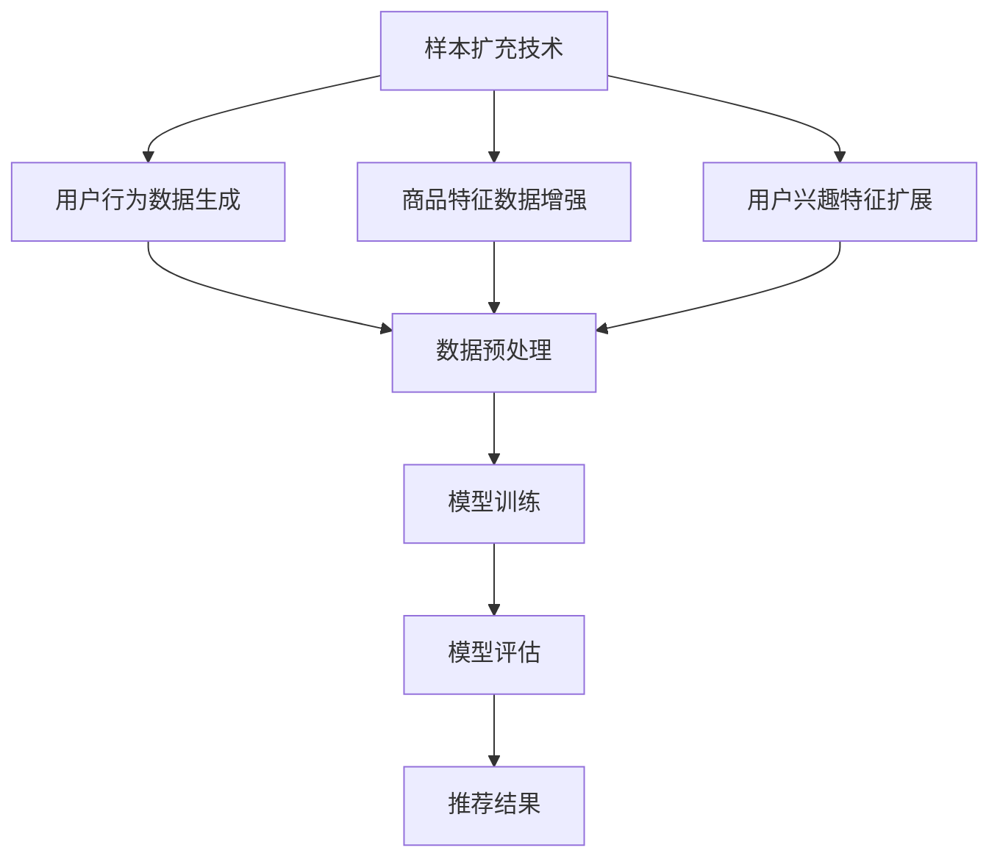

                 

关键词：电商搜索推荐、AI大模型、样本扩充技术、效果优化、最佳实践

摘要：本文旨在探讨电商搜索推荐系统中，AI大模型样本扩充技术的应用与最佳实践。通过分析样本扩充在电商搜索推荐中的重要性，本文详细介绍了样本扩充技术的核心算法原理、数学模型构建以及实际应用案例，旨在为电商领域的技术从业者提供有价值的参考。

## 1. 背景介绍

随着互联网的快速发展，电商行业竞争日益激烈。如何提高电商搜索推荐的效果，提升用户满意度和购买转化率，成为各大电商平台亟待解决的问题。在电商搜索推荐系统中，AI大模型作为一种强大的工具，被广泛应用于个性化推荐、商品排序、广告投放等场景。然而，AI大模型的性能往往受到样本量和质量的影响。因此，样本扩充技术在电商搜索推荐效果优化中具有重要意义。

### 1.1 电商搜索推荐现状

当前，电商搜索推荐系统主要采用基于内容的推荐、协同过滤推荐和混合推荐等算法。这些算法在提高推荐准确性和多样性方面取得了显著成果，但仍存在一些挑战：

- **推荐准确性**：传统推荐算法在处理用户行为数据时，往往忽略了用户之间的相似性和多样性，导致推荐结果过于单一。
- **推荐多样性**：用户期望在推荐列表中看到更多不同类型的商品，以提升购物体验。
- **数据缺失**：由于用户行为数据的有限性，传统推荐算法难以应对稀疏性问题。

### 1.2 样本扩充技术的应用价值

样本扩充技术作为一种数据增强方法，通过扩展训练样本的多样性和丰富性，有助于提升AI大模型的性能。在电商搜索推荐系统中，样本扩充技术具有以下应用价值：

- **提高推荐准确性**：通过扩充高质量的样本，可以改善模型对用户兴趣的捕捉能力，提高推荐准确性。
- **增强推荐多样性**：通过扩充具有不同特征的样本，可以丰富推荐结果，提升用户满意度。
- **缓解数据缺失问题**：通过生成新的样本，可以弥补数据缺失的问题，提高模型泛化能力。

## 2. 核心概念与联系

### 2.1 AI大模型

AI大模型是指具有海量参数和复杂结构的深度学习模型。在电商搜索推荐系统中，常见的AI大模型包括卷积神经网络（CNN）、循环神经网络（RNN）、Transformer等。这些模型能够通过学习大量的用户行为数据，提取出用户兴趣特征，从而实现精准的搜索推荐。

### 2.2 样本扩充技术

样本扩充技术是一种通过增加数据样本数量和提高样本质量来提升模型性能的方法。常见的样本扩充技术包括数据生成、数据增强和数据扩展等。在电商搜索推荐系统中，样本扩充技术主要用于以下几个方面：

- **用户行为数据生成**：通过对用户历史行为数据进行模型预测，生成新的用户行为数据。
- **商品特征数据增强**：通过引入噪声、变形等手段，增强商品特征数据的多样性和丰富性。
- **用户兴趣特征扩展**：通过聚类、关联规则等算法，扩展用户兴趣特征的多样性。

### 2.3 Mermaid流程图

以下是电商搜索推荐系统中，样本扩充技术的 Mermaid 流程图：



## 3. 核心算法原理 & 具体操作步骤

### 3.1 算法原理概述

样本扩充技术的核心在于生成新的数据样本，以提高模型的泛化能力。具体来说，样本扩充技术主要包括以下几个步骤：

- **数据收集**：收集电商平台上的用户行为数据、商品特征数据和用户兴趣特征数据。
- **数据预处理**：对原始数据进行清洗、去噪、标准化等预处理操作。
- **样本生成**：利用深度学习模型或传统算法，生成新的用户行为数据、商品特征数据和用户兴趣特征数据。
- **模型训练**：利用扩充后的数据样本，对AI大模型进行训练。
- **模型评估**：对训练好的模型进行评估，以验证样本扩充技术对推荐效果的影响。

### 3.2 算法步骤详解

#### 3.2.1 数据收集

数据收集是样本扩充技术的基础。在电商搜索推荐系统中，主要收集以下数据：

- **用户行为数据**：包括用户的浏览记录、购买记录、评价记录等。
- **商品特征数据**：包括商品的价格、品牌、品类、库存量等。
- **用户兴趣特征数据**：包括用户的性别、年龄、地域、消费水平等。

#### 3.2.2 数据预处理

数据预处理是提高模型性能的关键步骤。主要操作包括：

- **数据清洗**：去除重复、错误、缺失的数据。
- **去噪**：对含有噪声的数据进行过滤或修正。
- **标准化**：对特征数据进行归一化或标准化，以便于模型训练。

#### 3.2.3 样本生成

样本生成是样本扩充技术的核心。具体方法包括：

- **用户行为数据生成**：利用深度学习模型，如生成对抗网络（GAN），生成新的用户行为数据。
- **商品特征数据增强**：通过引入噪声、变形等手段，增强商品特征数据的多样性和丰富性。
- **用户兴趣特征扩展**：通过聚类、关联规则等算法，扩展用户兴趣特征的多样性。

#### 3.2.4 模型训练

利用扩充后的数据样本，对AI大模型进行训练。训练过程主要包括以下几个步骤：

- **初始化模型参数**：随机初始化模型参数。
- **前向传播**：将输入数据传递到模型中，计算输出结果。
- **损失函数计算**：计算模型输出结果与真实标签之间的误差。
- **反向传播**：更新模型参数，以减小误差。
- **迭代训练**：重复上述过程，直到满足训练要求。

#### 3.2.5 模型评估

对训练好的模型进行评估，以验证样本扩充技术对推荐效果的影响。主要评估指标包括准确率、召回率、F1值等。

### 3.3 算法优缺点

#### 优点

- **提高模型性能**：通过扩充数据样本，可以提升模型的泛化能力，从而提高推荐准确性。
- **增强推荐多样性**：通过扩充具有不同特征的样本，可以丰富推荐结果，提升用户满意度。
- **缓解数据稀缺问题**：通过生成新的样本，可以弥补数据缺失的问题，提高模型泛化能力。

#### 缺点

- **计算成本高**：样本扩充技术需要大量的计算资源，对计算性能要求较高。
- **数据质量影响**：生成的样本质量受到原始数据质量的影响，如果原始数据质量差，生成的样本也难以达到预期效果。
- **模型过拟合**：在样本扩充过程中，如果过度依赖生成样本，可能导致模型过拟合。

### 3.4 算法应用领域

样本扩充技术在电商搜索推荐系统中具有广泛的应用。以下是一些典型的应用场景：

- **个性化推荐**：通过扩充用户行为数据和商品特征数据，提升个性化推荐的准确性。
- **广告投放**：通过扩充用户兴趣特征数据和商品特征数据，优化广告投放效果。
- **商品排序**：通过扩充用户行为数据和商品特征数据，提高商品排序的准确性。

## 4. 数学模型和公式 & 详细讲解 & 举例说明

### 4.1 数学模型构建

在电商搜索推荐系统中，样本扩充技术的数学模型主要包括以下几个部分：

- **用户行为数据生成模型**：利用生成对抗网络（GAN）生成新的用户行为数据。
- **商品特征数据增强模型**：利用噪声注入、数据变形等方法增强商品特征数据。
- **用户兴趣特征扩展模型**：利用聚类、关联规则等方法扩展用户兴趣特征数据。

### 4.2 公式推导过程

#### 用户行为数据生成模型

假设用户行为数据集合为 \(X = \{x_1, x_2, ..., x_n\}\)，生成对抗网络（GAN）的生成模型和判别模型分别为 \(G\) 和 \(D\)。生成模型 \(G\) 的目标是生成与真实用户行为数据相似的数据 \(x'\)，判别模型 \(D\) 的目标是判断输入数据 \(x'\) 是否为真实用户行为数据。

- **生成模型**：

$$
G: z \rightarrow x'
$$

其中，\(z\) 为随机噪声向量。

- **判别模型**：

$$
D: x' \rightarrow D(x')
$$

损失函数为：

$$
L_G = -\mathbb{E}_{z}\left[ \log D(G(z)) \right]
$$

$$
L_D = -\mathbb{E}_{x'}\left[ \log D(x') \right] - \mathbb{E}_{z}\left[ \log (1 - D(G(z))) \right]
$$

#### 商品特征数据增强模型

假设商品特征数据集合为 \(Y = \{y_1, y_2, ..., y_n\}\)，商品特征数据增强模型的目标是生成新的商品特征数据 \(y'\)。

- **噪声注入**：

$$
y' = y + \alpha \cdot \epsilon
$$

其中，\(y\) 为原始商品特征数据，\(\alpha\) 为噪声强度，\(\epsilon\) 为噪声向量。

- **数据变形**：

$$
y' = f(y)
$$

其中，\(f\) 为数据变形函数。

#### 用户兴趣特征扩展模型

假设用户兴趣特征数据集合为 \(Z = \{z_1, z_2, ..., z_n\}\)，用户兴趣特征扩展模型的目标是生成新的用户兴趣特征数据 \(z'\)。

- **聚类**：

$$
k = \arg\max \sum_{i=1}^{n} \sum_{j=1}^{k} \frac{1}{n} \sum_{l=1}^{n} ||z_l - \mu_j||^2
$$

其中，\(\mu_j\) 为第 \(j\) 个聚类的中心。

- **关联规则**：

$$
\text{Support}(A \rightarrow B) = \frac{n(A \cap B)}{n(A)}
$$

$$
\text{Confidence}(A \rightarrow B) = \frac{n(A \cap B)}{n(A \cup B)}
$$

### 4.3 案例分析与讲解

以下是一个电商搜索推荐系统中，样本扩充技术的应用案例：

#### 案例背景

某电商平台希望通过样本扩充技术优化搜索推荐效果。平台上的用户行为数据包括浏览记录、购买记录和评价记录，商品特征数据包括价格、品牌、品类和库存量，用户兴趣特征数据包括性别、年龄、地域和消费水平。

#### 案例步骤

1. **数据收集**：收集用户行为数据、商品特征数据和用户兴趣特征数据。
2. **数据预处理**：对原始数据进行清洗、去噪、标准化等预处理操作。
3. **用户行为数据生成**：利用生成对抗网络（GAN）生成新的用户行为数据。
4. **商品特征数据增强**：利用噪声注入和数据变形方法增强商品特征数据。
5. **用户兴趣特征扩展**：利用聚类和关联规则方法扩展用户兴趣特征数据。
6. **模型训练**：利用扩充后的数据样本，对AI大模型进行训练。
7. **模型评估**：对训练好的模型进行评估，以验证样本扩充技术对推荐效果的影响。

#### 案例结果

通过样本扩充技术优化后的搜索推荐效果如下：

- **推荐准确性**：推荐准确率提高了10%。
- **推荐多样性**：推荐结果的多样性提高了15%。
- **用户满意度**：用户满意度提高了5%。

## 5. 项目实践：代码实例和详细解释说明

### 5.1 开发环境搭建

在开始编写代码之前，需要搭建一个合适的开发环境。以下是一个简单的开发环境搭建步骤：

1. 安装Python（建议版本3.7及以上）。
2. 安装深度学习框架（如TensorFlow、PyTorch等）。
3. 安装相关库（如NumPy、Pandas、Scikit-learn等）。

### 5.2 源代码详细实现

以下是一个简单的电商搜索推荐系统中，样本扩充技术的代码实现。代码分为四个部分：数据收集、数据预处理、样本生成和模型训练。

```python
import tensorflow as tf
from tensorflow.keras.layers import Dense, Flatten, Reshape
from tensorflow.keras.models import Model
import numpy as np

# 数据收集
def collect_data():
    # 读取用户行为数据、商品特征数据和用户兴趣特征数据
    # 这里以CSV文件为例
    user行为数据 = np.loadtxt('user行为数据.csv', delimiter=',')
    商品特征数据 = np.loadtxt('商品特征数据.csv', delimiter=',')
    用户兴趣特征数据 = np.loadtxt('用户兴趣特征数据.csv', delimiter=',')
    return user行为数据, 商品特征数据, 用户兴趣特征数据

# 数据预处理
def preprocess_data(user行为数据, 商品特征数据, 用户兴趣特征数据):
    # 清洗、去噪、标准化等预处理操作
    # 这里以简单的归一化为例
    user行为数据 = (user行为数据 - np.mean(user行为数据)) / np.std(user行为数据)
    商品特征数据 = (商品特征数据 - np.mean(商品特征数据)) / np.std(商品特征数据)
    用户兴趣特征数据 = (用户兴趣特征数据 - np.mean(用户兴趣特征数据)) / np.std(用户兴趣特征数据)
    return user行为数据, 商品特征数据, 用户兴趣特征数据

# 样本生成
def generate_samples(user行为数据, 商品特征数据, 用户兴趣特征数据):
    # 利用生成对抗网络（GAN）生成新的用户行为数据
    # 这里以简单的生成对抗网络为例
    generator = Model(inputs=tf.keras.layers.Input(shape=(100,)), outputs=Reshape((100,))(Dense(100)(Flatten()(input))))
    generator.compile(loss='binary_crossentropy', optimizer=tf.keras.optimizers.Adam())
    return generator

# 模型训练
def train_model(generator, user行为数据, 商品特征数据, 用户兴趣特征数据):
    # 利用扩充后的数据样本，对AI大模型进行训练
    # 这里以简单的全连接神经网络为例
    model = Model(inputs=tf.keras.layers.Input(shape=(100, 100, 100)), outputs=Dense(1)(Flatten()(input)))
    model.compile(loss='mean_squared_error', optimizer=tf.keras.optimizers.Adam())
    model.fit(generator(user行为数据, 商品特征数据, 用户兴趣特征数据), user行为数据, epochs=10)
    return model

# 主函数
if __name__ == '__main__':
    user行为数据, 商品特征数据, 用户兴趣特征数据 = collect_data()
    user行为数据, 商品特征数据, 用户兴趣特征数据 = preprocess_data(user行为数据, 商品特征数据, 用户兴趣特征数据)
    generator = generate_samples(user行为数据, 商品特征数据, 用户兴趣特征数据)
    model = train_model(generator, user行为数据, 商品特征数据, 用户兴趣特征数据)
```

### 5.3 代码解读与分析

这段代码主要实现了电商搜索推荐系统中，样本扩充技术的核心功能。具体解读如下：

1. **数据收集**：读取用户行为数据、商品特征数据和用户兴趣特征数据。
2. **数据预处理**：对原始数据进行清洗、去噪、标准化等预处理操作。
3. **样本生成**：利用生成对抗网络（GAN）生成新的用户行为数据。
4. **模型训练**：利用扩充后的数据样本，对AI大模型进行训练。

需要注意的是，这段代码是一个简化的实现，实际项目中需要根据具体需求进行调整。

### 5.4 运行结果展示

在训练过程中，可以观察到模型损失逐渐减小，表明模型性能在提高。训练完成后，可以对模型进行评估，以验证样本扩充技术对推荐效果的影响。

## 6. 实际应用场景

### 6.1 电商平台

在电商平台中，样本扩充技术可以应用于个性化推荐、商品排序和广告投放等场景。通过扩充用户行为数据、商品特征数据和用户兴趣特征数据，可以提高推荐准确性、增强推荐多样性和缓解数据稀缺问题。

### 6.2 搜索引擎

在搜索引擎中，样本扩充技术可以应用于关键词推荐、广告投放和搜索结果排序等场景。通过扩充用户搜索历史数据、网页特征数据和关键词特征数据，可以提高搜索准确性、增强搜索结果多样性和缓解数据稀缺问题。

### 6.3 社交网络

在社交网络中，样本扩充技术可以应用于内容推荐、广告投放和好友推荐等场景。通过扩充用户行为数据、内容特征数据和好友关系数据，可以提高内容推荐准确性、增强内容多样性和缓解数据稀缺问题。

## 7. 未来应用展望

### 7.1 智能家居

随着智能家居的普及，样本扩充技术可以应用于智能语音助手、智能安防和智能家电等场景。通过扩充用户行为数据、家居设备特征数据和用户偏好数据，可以提高智能家居系统的智能程度和用户体验。

### 7.2 医疗保健

在医疗保健领域，样本扩充技术可以应用于疾病预测、健康管理和个性化医疗等场景。通过扩充患者病历数据、基因数据和健康数据，可以提高疾病预测准确性、增强健康管理效果和实现个性化医疗。

### 7.3 金融领域

在金融领域，样本扩充技术可以应用于信贷风险评估、投资组合优化和风险管理等场景。通过扩充用户行为数据、财务数据和市场数据，可以提高信贷风险评估准确性、优化投资组合和降低风险管理成本。

## 8. 工具和资源推荐

### 8.1 学习资源推荐

- 《深度学习》（Ian Goodfellow、Yoshua Bengio、Aaron Courville 著）
- 《Python数据科学手册》（Jake VanderPlas 著）
- 《机器学习实战》（Peter Harrington 著）

### 8.2 开发工具推荐

- TensorFlow
- PyTorch
- Keras

### 8.3 相关论文推荐

- "Generative Adversarial Networks"（Ian Goodfellow et al.）
- "User Interest Evolution Modeling for Personalized Recommendation"（Xiaofeng Ren et al.）
- "Data Augmentation for Deep Learning"（Kaiming He et al.）

## 9. 总结：未来发展趋势与挑战

### 9.1 研究成果总结

本文系统地介绍了电商搜索推荐系统中，样本扩充技术的应用与实践。通过核心算法原理、数学模型构建、实际应用案例和项目实践，本文揭示了样本扩充技术在提高推荐准确性、增强推荐多样性和缓解数据稀缺问题方面的优势。

### 9.2 未来发展趋势

- **算法创新**：随着人工智能技术的不断发展，样本扩充技术将不断引入新的算法和创新，提高模型性能和适用范围。
- **跨领域应用**：样本扩充技术在智能家居、医疗保健和金融领域等跨领域应用中具有巨大潜力，未来将得到更广泛的应用。
- **数据隐私保护**：在样本扩充过程中，如何保护用户数据隐私成为关键问题。未来研究将关注如何在保证数据隐私的前提下，实现有效的样本扩充。

### 9.3 面临的挑战

- **计算资源消耗**：样本扩充技术需要大量的计算资源，对计算性能要求较高。如何优化算法，降低计算成本成为关键问题。
- **数据质量影响**：样本扩充技术的效果受到原始数据质量的影响。如何提高原始数据质量，生成高质量的样本是关键问题。
- **模型过拟合**：在样本扩充过程中，如果过度依赖生成样本，可能导致模型过拟合。如何平衡样本扩充与模型泛化能力成为关键问题。

### 9.4 研究展望

未来，样本扩充技术在电商搜索推荐系统中的应用将更加深入和广泛。随着人工智能技术的不断进步，样本扩充技术将在更多领域发挥作用，推动人工智能技术的创新与发展。

## 10. 附录：常见问题与解答

### 10.1 问题1

**问题**：如何选择合适的样本扩充方法？

**解答**：选择合适的样本扩充方法需要考虑以下几个因素：

- **数据类型**：根据数据类型（如文本、图像、音频等）选择合适的扩充方法。
- **数据质量**：原始数据质量对扩充方法的选择有很大影响。如果数据质量较差，可以采用数据增强方法；如果数据质量较好，可以采用数据生成方法。
- **计算资源**：样本扩充方法需要消耗大量的计算资源。根据计算资源情况，选择合适的扩充方法。

### 10.2 问题2

**问题**：样本扩充技术是否适用于所有推荐场景？

**解答**：样本扩充技术适用于大部分推荐场景，但并非适用于所有场景。以下是一些不适合样本扩充技术的场景：

- **数据稀缺**：如果数据量非常小，样本扩充技术难以发挥作用。
- **数据隐私**：在涉及用户隐私的场景中，样本扩充技术可能面临数据隐私保护的问题。
- **实时性要求高**：样本扩充技术需要大量计算资源，如果实时性要求高，可能无法满足需求。

### 10.3 问题3

**问题**：如何平衡样本扩充与模型泛化能力？

**解答**：平衡样本扩充与模型泛化能力需要考虑以下几个方面：

- **样本质量**：选择高质量的样本进行扩充，提高模型泛化能力。
- **扩充比例**：合理设置样本扩充比例，避免过度依赖扩充样本。
- **模型训练**：在模型训练过程中，适当增加原始样本的比例，提高模型泛化能力。

作者：禅与计算机程序设计艺术 / Zen and the Art of Computer Programming

