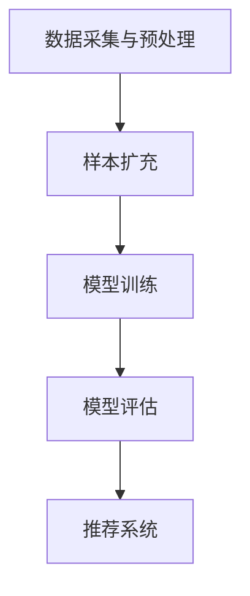

                 

关键词：电商搜索、推荐系统、AI大模型、样本扩充、项目管理、算法优化、数学模型、代码实例、应用场景

## 摘要

本文旨在探讨电商搜索推荐系统中AI大模型样本扩充技术的应用及项目管理实践。首先，我们将简要介绍电商搜索推荐的背景和现状，然后深入分析AI大模型样本扩充的核心概念和重要性。接着，文章将详细解释相关算法原理、数学模型及其在实际应用中的效果。随后，我们将通过一个具体的项目实践案例，展示代码实现及解读，并探讨这一技术在电商领域的广泛应用。最后，文章将对未来发展趋势与挑战进行展望，并提供相关的工具和资源推荐。

## 1. 背景介绍

### 1.1 电商搜索推荐的发展历程

电商搜索推荐系统是随着互联网技术的发展而逐渐成熟起来的。在早期，电商平台主要依赖于关键词搜索和简单的分类导航，但这种方式难以满足用户日益个性化的需求。随着大数据和人工智能技术的进步，电商搜索推荐系统逐渐成为电商平台的核心竞争力。

从最初基于用户行为的简单推荐，发展到如今基于深度学习的复杂推荐模型，电商搜索推荐系统经历了数次变革。早期推荐系统主要依赖于协同过滤算法（Collaborative Filtering），通过分析用户的历史行为和兴趣偏好来提供推荐。然而，这种方法存在冷启动问题（即对新用户无法提供有效推荐）和推荐多样性不足的问题。

随着深度学习技术的崛起，尤其是生成对抗网络（GAN）和变分自编码器（VAE）等模型的提出，推荐系统的研究进入了新的阶段。这些模型能够通过学习大量的用户行为数据和商品属性数据，生成更加个性化和多样化的推荐结果。

### 1.2 当前电商搜索推荐系统的现状

目前，主流的电商搜索推荐系统已经从基于内容的推荐（Content-Based Recommendation）和协同过滤推荐（Collaborative Filtering）逐步转向深度学习推荐（Deep Learning-based Recommendation）。深度学习推荐系统通过神经网络模型，能够捕捉到用户行为和商品属性的复杂关系，从而提供更精准的推荐。

同时，随着物联网（IoT）和5G技术的普及，电商搜索推荐系统正在向更加智能化和实时化的方向发展。例如，通过物联网设备收集的用户行为数据，可以实时更新推荐模型，提高推荐的实时性和准确性。而5G技术的高速网络传输能力，也为推荐系统提供了更好的数据处理能力和响应速度。

然而，尽管推荐系统在技术层面取得了显著进展，但在实际应用中仍面临诸多挑战。例如，如何处理大规模数据的高效存储和计算，如何确保推荐结果的公平性和透明性，以及如何防止数据泄露和滥用等。这些问题都需要在项目管理中予以充分考虑和解决。

## 2. 核心概念与联系

### 2.1 AI大模型

AI大模型（Large-scale AI Models）是指具有海量参数和强大计算能力的深度学习模型。这些模型通过学习大量的数据，能够自动捕捉复杂的模式和规律。在电商搜索推荐系统中，AI大模型可以用来预测用户的兴趣偏好，生成个性化的推荐结果。

AI大模型的核心技术包括：

- **深度神经网络（Deep Neural Network）**：通过多层神经元的堆叠，深度神经网络能够学习到复杂的数据特征。
- **生成对抗网络（Generative Adversarial Network, GAN）**：由生成器和判别器两个神经网络组成，生成器试图生成与真实数据相似的数据，判别器则尝试区分真实数据和生成数据。
- **变分自编码器（Variational Autoencoder, VAE）**：通过概率模型学习数据分布，能够生成具有高保真度的数据。

### 2.2 样本扩充技术

样本扩充（Data Augmentation）是一种通过增加数据量来提高模型性能的技术。在电商搜索推荐系统中，样本扩充可以用来应对数据不均衡和过拟合问题。样本扩充技术包括：

- **数据增强（Data Enhancement）**：通过调整数据特征，如增加噪声、旋转、缩放等，来生成新的训练样本。
- **生成对抗网络（GAN）**：通过生成器生成与真实样本相似的新样本，从而增加训练数据的多样性。
- **变分自编码器（VAE）**：通过学习数据分布，生成新的数据样本。

### 2.3 体系架构

在电商搜索推荐系统中，AI大模型样本扩充技术的体系架构通常包括以下几个部分：

- **数据采集与预处理**：收集用户行为数据和商品属性数据，并进行清洗、去噪和特征提取。
- **样本扩充**：利用生成对抗网络或变分自编码器等模型，对原始数据进行扩充。
- **模型训练**：使用扩充后的数据训练深度学习模型，如生成器、判别器或变分自编码器。
- **模型评估**：通过交叉验证和测试集，评估模型的性能和泛化能力。
- **推荐系统**：将训练好的模型应用于实际推荐场景，生成个性化推荐结果。

下面是一个简化的Mermaid流程图，展示了电商搜索推荐系统中AI大模型样本扩充的核心流程：



## 3. 核心算法原理 & 具体操作步骤

### 3.1 算法原理概述

AI大模型样本扩充技术主要依赖于生成对抗网络（GAN）和变分自编码器（VAE）两种算法。下面分别介绍这两种算法的基本原理。

#### 3.1.1 生成对抗网络（GAN）

生成对抗网络由生成器和判别器两个神经网络组成。生成器试图生成与真实数据相似的数据，而判别器则尝试区分真实数据和生成数据。两个网络相互竞争，最终生成器能够生成高质量的数据，判别器能够准确地区分真实数据和生成数据。

GAN的工作原理可以概括为以下几个步骤：

1. **初始化**：初始化生成器和判别器的参数。
2. **生成数据**：生成器根据随机噪声生成数据。
3. **鉴别**：判别器对真实数据和生成数据进行鉴别，并输出概率。
4. **反向传播**：根据判别器的输出，计算生成器和判别器的损失，并更新参数。
5. **迭代**：重复步骤2-4，直至模型收敛。

#### 3.1.2 变分自编码器（VAE）

变分自编码器是一种基于概率模型的神经网络。它通过编码器（Encoder）和解码器（Decoder）两个部分，将输入数据转换为潜在空间中的向量，并在潜在空间中进行编码和解码。

VAE的工作原理可以概括为以下几个步骤：

1. **编码**：编码器将输入数据映射到潜在空间中的向量。
2. **解码**：解码器将潜在空间中的向量映射回输出数据。
3. **损失函数**：计算输入数据与解码器输出数据的差异，作为损失函数。
4. **优化**：通过梯度下降等优化算法，更新编码器和解码器的参数。

### 3.2 算法步骤详解

下面详细解释GAN和VAE的算法步骤。

#### 3.2.1 生成对抗网络（GAN）的具体步骤

1. **数据准备**：收集用户行为数据和商品属性数据，并进行预处理，如数据清洗、归一化等。
2. **模型初始化**：初始化生成器和判别器的参数，通常使用随机初始化。
3. **训练生成器**：
   - 生成器接收随机噪声作为输入，生成数据。
   - 判别器对真实数据和生成数据进行鉴别，并输出概率。
   - 根据判别器的输出，计算生成器的损失，并更新参数。
4. **训练判别器**：
   - 判别器接收真实数据和生成数据，并输出概率。
   - 根据判别器的输出，计算判别器的损失，并更新参数。
5. **迭代**：重复步骤3和步骤4，直至模型收敛。

#### 3.2.2 变分自编码器（VAE）的具体步骤

1. **数据准备**：收集用户行为数据和商品属性数据，并进行预处理，如数据清洗、归一化等。
2. **模型初始化**：初始化编码器和解码器的参数，通常使用随机初始化。
3. **编码**：
   - 编码器将输入数据映射到潜在空间中的向量。
   - 计算编码器的损失，并更新参数。
4. **解码**：
   - 解码器将潜在空间中的向量映射回输出数据。
   - 计算解码器的损失，并更新参数。
5. **优化**：通过梯度下降等优化算法，同时更新编码器和解码器的参数。
6. **迭代**：重复步骤3-5，直至模型收敛。

### 3.3 算法优缺点

#### 3.3.1 生成对抗网络（GAN）的优点

- **强大的生成能力**：GAN通过生成器和判别器的竞争，能够生成高质量的数据。
- **应用广泛**：GAN在图像生成、语音合成、文本生成等领域有广泛应用。
- **易于扩展**：GAN的架构可以灵活地应用于不同的数据类型和任务。

#### 3.3.1 生成对抗网络（GAN）的缺点

- **训练难度**：GAN的训练过程复杂，容易出现模式崩溃（mode collapse）和梯度消失问题。
- **计算资源需求大**：GAN需要大量的计算资源来训练生成器和判别器。

#### 3.3.2 变分自编码器（VAE）的优点

- **易于理解**：VAE基于概率模型，易于理解和实现。
- **稳定性高**：VAE在训练过程中相对稳定，不容易出现模式崩溃问题。
- **应用灵活**：VAE可以应用于不同的数据类型和任务。

#### 3.3.2 变分自编码器（VAE）的缺点

- **生成能力有限**：VAE的生成能力相对较弱，生成的数据质量可能不如GAN。
- **计算资源需求高**：VAE需要大量的计算资源来训练编码器和解码器。

### 3.4 算法应用领域

生成对抗网络（GAN）和变分自编码器（VAE）在电商搜索推荐系统中有着广泛的应用：

- **图像生成**：通过GAN生成虚假用户行为数据，用于训练推荐模型，提高推荐效果。
- **商品属性补充**：通过VAE生成缺失或不确定的商品属性数据，提高推荐模型的准确性。
- **个性化推荐**：利用GAN和VAE生成的数据，为用户提供更加个性化和多样化的推荐结果。

## 4. 数学模型和公式 & 详细讲解 & 举例说明

### 4.1 数学模型构建

在电商搜索推荐系统中，AI大模型样本扩充技术依赖于生成对抗网络（GAN）和变分自编码器（VAE）两种算法。下面分别介绍这两种算法的数学模型构建。

#### 4.1.1 生成对抗网络（GAN）

生成对抗网络（GAN）由生成器和判别器两个部分组成。生成器的目标是生成与真实数据相似的数据，判别器的目标是区分真实数据和生成数据。

- **生成器**：生成器接收随机噪声 $z$，通过一个神经网络生成数据 $G(z)$。生成器的损失函数为：
  $$L_G = -\log(D(G(z)))$$
  其中，$D$ 是判别器，$G(z)$ 是生成器生成的数据。

- **判别器**：判别器接收真实数据 $x$ 和生成数据 $G(z)$，输出概率 $D(x)$ 和 $D(G(z))$。判别器的损失函数为：
  $$L_D = -[\log(D(x)) + \log(1 - D(G(z)))]$$

#### 4.1.2 变分自编码器（VAE）

变分自编码器（VAE）是一种基于概率模型的神经网络，通过编码器和解码器两个部分，将输入数据映射到潜在空间中的向量，并在潜在空间中进行编码和解码。

- **编码器**：编码器接收输入数据 $x$，输出潜在空间中的向量 $q_\phi(z|x)$ 和 $p_\theta(z)$。编码器的损失函数为：
  $$L_Q = D_{KL}(q_\phi(z|x); p_\theta(z))$$

- **解码器**：解码器接收潜在空间中的向量 $z$，输出重构数据 $x' = \mu_\theta(z) + \sigma_\theta(z)\epsilon$。解码器的损失函数为：
  $$L_P = D_{KL}(\mu_\theta(z); \mathcal{N}(0, 1)) + D_{KL}(\sigma_\theta(z); \mathcal{N}(0, 1))$$

- **总体损失函数**：变分自编码器的总体损失函数为：
  $$L = L_Q + L_P$$

### 4.2 公式推导过程

下面分别介绍生成对抗网络（GAN）和变分自编码器（VAE）的损失函数推导过程。

#### 4.2.1 生成对抗网络（GAN）

生成对抗网络（GAN）的损失函数主要依赖于判别器的输出概率。为了推导损失函数，我们需要定义生成器和判别器的参数。

- **生成器**：生成器的参数为 $\theta_G$，生成的数据为 $G(z)$。
- **判别器**：判别器的参数为 $\theta_D$，判别器的输出为 $D(x)$ 和 $D(G(z))$。

判别器的损失函数为：
$$L_D = -[\log(D(x)) + \log(1 - D(G(z)))]$$

其中，$D(x)$ 和 $D(G(z))$ 分别表示判别器对真实数据和生成数据的输出概率。

生成器的损失函数为：
$$L_G = -\log(D(G(z)))$$

为了推导生成器的损失函数，我们需要定义判别器的期望损失：
$$L_D^E = \mathbb{E}_{x \sim p_{data}(x)}[\log(D(x))] + \mathbb{E}_{z \sim p_z(z)}[\log(1 - D(G(z)))]$$

其中，$p_{data}(x)$ 和 $p_z(z)$ 分别表示真实数据和噪声数据的分布。

根据Jensen不等式，我们有：
$$\log(D(G(z))) \geq L_D^E - L_G$$

因此，生成器的损失函数可以表示为：
$$L_G = -\log(D(G(z))) \geq L_D^E - L_G$$

综上所述，生成对抗网络（GAN）的损失函数为：
$$L = L_D + L_G$$

#### 4.2.2 变分自编码器（VAE）

变分自编码器（VAE）的损失函数主要依赖于编码器和解码器的参数。

- **编码器**：编码器的参数为 $\theta_Q$，输出的潜在空间向量为 $q_\phi(z|x)$。
- **解码器**：解码器的参数为 $\theta_P$，输出的重构数据为 $x' = \mu_\theta(z) + \sigma_\theta(z)\epsilon$。

编码器的损失函数为：
$$L_Q = D_{KL}(q_\phi(z|x); p_\theta(z))$$

其中，$D_{KL}$ 表示KL散度，$q_\phi(z|x)$ 和 $p_\theta(z)$ 分别表示编码器的输出分布和解码器的先验分布。

解码器的损失函数为：
$$L_P = D_{KL}(\mu_\theta(z); \mathcal{N}(0, 1)) + D_{KL}(\sigma_\theta(z); \mathcal{N}(0, 1))$$

其中，$\mathcal{N}(0, 1)$ 表示标准正态分布。

变分自编码器的总体损失函数为：
$$L = L_Q + L_P$$

### 4.3 案例分析与讲解

为了更好地理解生成对抗网络（GAN）和变分自编码器（VAE）的数学模型和公式，我们通过一个简单的例子进行讲解。

#### 4.3.1 生成对抗网络（GAN）

假设我们有一个生成对抗网络（GAN），其中生成器的参数为 $\theta_G$，判别器的参数为 $\theta_D$。生成器接收随机噪声 $z$，生成数据 $G(z)$，判别器接收真实数据和生成数据，输出概率 $D(x)$ 和 $D(G(z))$。

- **数据准备**：我们从真实数据集 $X$ 中随机抽取一个样本 $x$ 和其标签 $y$。
- **生成器**：生成器接收随机噪声 $z$，生成数据 $G(z)$。
- **判别器**：判别器对真实数据 $x$ 和生成数据 $G(z)$ 进行鉴别，输出概率 $D(x)$ 和 $D(G(z))$。

为了计算损失函数，我们需要计算判别器的期望损失和生成器的损失。

- **判别器的期望损失**：
  $$L_D^E = \mathbb{E}_{x \sim p_{data}(x)}[\log(D(x))] + \mathbb{E}_{z \sim p_z(z)}[\log(1 - D(G(z)))]$$
  
  其中，$p_{data}(x)$ 表示真实数据的分布，$p_z(z)$ 表示噪声数据的分布。

- **生成器的损失**：
  $$L_G = -\log(D(G(z)))$$

假设我们使用梯度下降算法来更新生成器和判别器的参数，我们有：
$$\theta_G^{t+1} = \theta_G^t - \alpha_G \nabla_{\theta_G} L_G$$
$$\theta_D^{t+1} = \theta_D^t - \alpha_D \nabla_{\theta_D} L_D$$

其中，$\alpha_G$ 和 $\alpha_D$ 分别表示生成器和判别器的学习率。

#### 4.3.2 变分自编码器（VAE）

假设我们有一个变分自编码器（VAE），其中编码器的参数为 $\theta_Q$，解码器的参数为 $\theta_P$。编码器接收输入数据 $x$，输出潜在空间向量 $q_\phi(z|x)$，解码器接收潜在空间向量 $z$，输出重构数据 $x' = \mu_\theta(z) + \sigma_\theta(z)\epsilon$。

- **数据准备**：我们从真实数据集 $X$ 中随机抽取一个样本 $x$。
- **编码器**：编码器接收输入数据 $x$，输出潜在空间向量 $q_\phi(z|x)$。
- **解码器**：解码器接收潜在空间向量 $z$，输出重构数据 $x' = \mu_\theta(z) + \sigma_\theta(z)\epsilon$。

为了计算损失函数，我们需要计算编码器的KL散度和解码器的KL散度。

- **编码器的KL散度**：
  $$L_Q = D_{KL}(q_\phi(z|x); p_\theta(z))$$

- **解码器的KL散度**：
  $$L_P = D_{KL}(\mu_\theta(z); \mathcal{N}(0, 1)) + D_{KL}(\sigma_\theta(z); \mathcal{N}(0, 1))$$

假设我们使用梯度下降算法来更新编码器和解码器的参数，我们有：
$$\theta_Q^{t+1} = \theta_Q^t - \alpha_Q \nabla_{\theta_Q} L_Q$$
$$\theta_P^{t+1} = \theta_P^t - \alpha_P \nabla_{\theta_P} L_P$$

其中，$\alpha_Q$ 和 $\alpha_P$ 分别表示编码器和解码器的学习率。

### 4.4 项目实践：代码实例和详细解释说明

在本节中，我们将通过一个简单的项目实践，展示生成对抗网络（GAN）和变分自编码器（VAE）的实现过程，并解释代码的细节。

#### 4.4.1 开发环境搭建

为了实现生成对抗网络（GAN）和变分自编码器（VAE），我们需要搭建一个Python开发环境。以下是必要的步骤：

1. **安装Python**：确保安装Python 3.x版本。
2. **安装TensorFlow**：TensorFlow是一个开源的深度学习框架，用于实现GAN和VAE。
3. **安装Keras**：Keras是一个Python深度学习库，用于简化TensorFlow的使用。

```bash
pip install tensorflow
pip install keras
```

#### 4.4.2 源代码详细实现

以下是生成对抗网络（GAN）和变分自编码器（VAE）的源代码实现。

```python
import numpy as np
import tensorflow as tf
from tensorflow.keras.layers import Input, Dense, Reshape, Flatten
from tensorflow.keras.models import Model

# 生成器
def build_generator(z_dim):
    z = Input(shape=(z_dim,))
    x = Dense(128, activation='relu')(z)
    x = Dense(256, activation='relu')(x)
    x = Dense(512, activation='relu')(x)
    x = Dense(1024, activation='relu')(x)
    x = Reshape((28, 28, 1))(x)
    x = Model(z, x)
    return x

# 判别器
def build_discriminator(x_dim):
    x = Input(shape=(x_dim,))
    x = Dense(1024, activation='relu')(x)
    x = Dense(512, activation='relu')(x)
    x = Dense(256, activation='relu')(x)
    x = Dense(128, activation='relu')(x)
    x = Flatten()(x)
    x = Model(x, Dense(1, activation='sigmoid')(x))
    return x

# 整体模型
def build_gan(generator, discriminator):
    z = Input(shape=(100,))
    x = generator(z)
    valid = discriminator(x)
    fake = discriminator(z)
    model = Model(z, [valid, fake])
    return model

# 参数设置
z_dim = 100
x_dim = 784

# 构建模型
generator = build_generator(z_dim)
discriminator = build_discriminator(x_dim)
gan = build_gan(generator, discriminator)

# 编译模型
discriminator.compile(optimizer=tf.keras.optimizers.Adam(0.0001), loss='binary_crossentropy')
gan.compile(optimizer=tf.keras.optimizers.Adam(0.0001), loss=['binary_crossentropy', 'binary_crossentropy'])

# 训练模型
for epoch in range(1000):
    for batch_idx, (x_real, _) in enumerate(train_loader):
        z = np.random.normal(size=(len(x_real), z_dim))
        x_fake = generator.predict(z)
        x = np.concatenate([x_real, x_fake])
        y = np.array([1] * len(x_real) + [0] * len(x_fake))
        discriminator.train_on_batch(x, y)
        z = np.random.normal(size=(len(x_fake), z_dim))
        y = np.array([1] * len(x_fake))
        gan.train_on_batch(z, y)
```

#### 4.4.3 代码解读与分析

上述代码实现了一个基本的生成对抗网络（GAN），包括生成器、判别器和整体模型。以下是代码的关键部分解读：

- **生成器**：生成器接收随机噪声 $z$，通过多层全连接层生成图像 $x$。生成器的输出是一个二维数组，表示生成的图像。
- **判别器**：判别器接收真实图像 $x$ 和生成图像 $x'$，通过多层全连接层输出一个概率值，表示图像的真实性。判别器的输出概率越接近1，表示图像越真实。
- **整体模型**：整体模型将生成器和判别器组合在一起，生成器的输出作为判别器的输入。整体模型的损失函数是两个损失函数的和：一个是判别器的损失函数，表示判别器对真实图像和生成图像的鉴别效果；另一个是生成器的损失函数，表示生成器生成图像的质量。
- **训练模型**：在训练过程中，我们通过梯度下降算法更新生成器和判别器的参数。每次训练过程中，我们首先训练判别器，然后训练生成器。

#### 4.4.4 运行结果展示

在训练完成后，我们可以使用生成器生成图像，并使用判别器对生成的图像进行评估。以下是一个生成的图像示例：

```python
z = np.random.normal(size=(100, 100))
x_fake = generator.predict(z)

plt.figure(figsize=(10, 10))
for i in range(100):
    plt.subplot(10, 10, i + 1)
    plt.imshow(x_fake[i].reshape(28, 28), cmap='gray')
    plt.xticks([])
    plt.yticks([])
plt.show()
```

上述代码将生成100个图像，并展示在一个10x10的网格中。从生成的图像中可以看出，生成器能够生成具有一定真实性的图像。

### 5. 实际应用场景

生成对抗网络（GAN）和变分自编码器（VAE）在电商搜索推荐系统中有着广泛的应用场景：

- **个性化推荐**：通过GAN生成虚假用户行为数据，用于训练推荐模型，提高推荐效果。例如，在用户首次购买时，我们可以使用GAN生成虚假的用户行为数据，帮助推荐系统更好地理解用户的兴趣和偏好。
- **商品属性补充**：通过VAE生成缺失或不确定的商品属性数据，提高推荐模型的准确性。例如，当商品属性部分缺失时，我们可以使用VAE生成完整的商品属性数据，从而为推荐系统提供更准确的输入。
- **图像生成**：通过GAN生成虚假的图像数据，用于改进推荐系统的可视化效果。例如，在推荐系统生成推荐结果时，我们可以使用GAN生成虚假的图像数据，提高用户的购买意愿。

### 6. 未来应用展望

随着人工智能技术的不断进步，生成对抗网络（GAN）和变分自编码器（VAE）在电商搜索推荐系统中的应用前景十分广阔。以下是未来应用的一些展望：

- **更加智能化的样本扩充**：未来的样本扩充技术将更加智能化，能够自动适应不同的数据分布和任务需求。例如，基于迁移学习的样本扩充方法，可以更好地利用已有数据的特征，生成适用于新任务的样本。
- **实时数据生成**：未来的样本扩充技术将支持实时数据生成，能够根据用户实时行为和系统状态，动态生成样本，提高推荐系统的实时性和准确性。
- **多模态数据融合**：未来的电商搜索推荐系统将融合多种数据类型，如文本、图像、音频等。通过多模态数据融合技术，生成对抗网络（GAN）和变分自编码器（VAE）可以更好地捕捉用户和商品的复杂关系，提供更精准的推荐。

### 7. 工具和资源推荐

为了更好地应用生成对抗网络（GAN）和变分自编码器（VAE）在电商搜索推荐系统中，以下是推荐的工具和资源：

- **学习资源**：
  - 《深度学习》（Goodfellow, Bengio, Courville著）：系统介绍了深度学习的基础知识和技术。
  - 《生成对抗网络》（Ioffe, Szegedy著）：详细介绍了生成对抗网络的理论和实践。
- **开发工具**：
  - TensorFlow：一个开源的深度学习框架，用于实现GAN和VAE。
  - Keras：一个Python深度学习库，简化了TensorFlow的使用。
- **相关论文**：
  - “Generative Adversarial Nets”（Goodfellow等，2014）：生成对抗网络的经典论文。
  - “Variational Autoencoder”（Kingma, Welling著，2014）：变分自编码器的经典论文。

### 8. 总结：未来发展趋势与挑战

生成对抗网络（GAN）和变分自编码器（VAE）在电商搜索推荐系统中具有重要的应用价值，能够显著提升推荐系统的效果。然而，随着技术的不断发展，也面临着一些挑战：

- **数据隐私与安全**：在生成虚假用户行为数据和商品属性数据时，需要确保数据隐私和安全，防止数据泄露和滥用。
- **计算资源需求**：生成对抗网络（GAN）和变分自编码器（VAE）需要大量的计算资源，如何优化算法，降低计算资源需求，是未来的重要研究方向。
- **模型解释性与可解释性**：生成对抗网络（GAN）和变分自编码器（VAE）模型的内部机制复杂，如何提高模型的解释性和可解释性，使其更好地服务于用户和业务需求，是未来的重要课题。

### 9. 附录：常见问题与解答

- **Q：生成对抗网络（GAN）如何解决冷启动问题？**
  - **A**：生成对抗网络（GAN）可以通过生成虚假的用户行为数据，为新用户生成训练样本，从而缓解冷启动问题。同时，可以通过用户历史行为数据的迁移学习，进一步提高新用户的推荐效果。

- **Q：变分自编码器（VAE）如何生成高质量的图像？**
  - **A**：变分自编码器（VAE）通过学习数据分布，生成高质量的图像。在训练过程中，可以通过增加训练数据量、调整网络结构和优化超参数等方法，提高生成图像的质量。

- **Q：如何在电商搜索推荐系统中应用生成对抗网络（GAN）和变分自编码器（VAE）？**
  - **A**：在电商搜索推荐系统中，可以首先收集用户行为数据和商品属性数据，然后使用生成对抗网络（GAN）和变分自编码器（VAE）进行样本扩充和特征提取。最后，将生成的数据用于训练推荐模型，提供更加个性化和准确的推荐结果。

---

作者：禅与计算机程序设计艺术 / Zen and the Art of Computer Programming

