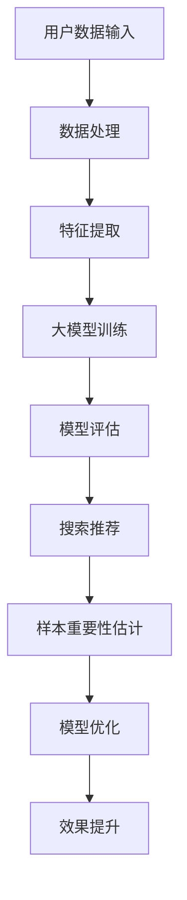

                 

关键词：电商搜索、推荐系统、AI大模型、样本重要性估计、效果优化

> 摘要：本文深入探讨电商搜索推荐系统中AI大模型在样本重要性估计方面的应用实践。通过阐述核心概念、算法原理、数学模型、项目实践和实际应用场景，分析AI大模型在样本重要性估计中的重要作用，并提出未来应用展望和研究方向。

## 1. 背景介绍

随着互联网技术的发展，电子商务已成为全球消费市场的重要组成部分。电商平台的搜索推荐功能不仅是用户体验的重要环节，也是商家提高销售额、提升运营效率的关键手段。然而，面对海量用户数据和商品信息，如何有效地对搜索结果进行排序和推荐，以最大化用户满意度和商业价值，成为亟待解决的问题。

近年来，人工智能（AI）技术特别是大模型的发展，为电商搜索推荐系统的优化提供了新的可能。大模型能够通过深度学习算法从海量数据中挖掘用户行为模式和商品特征，实现精准的搜索结果排序和个性化推荐。然而，在大模型训练和应用过程中，如何准确地估计和选择对搜索推荐效果影响最大的样本，成为提升系统效果的关键。

本文旨在介绍电商搜索推荐系统中AI大模型样本重要性估计工具的应用实践。通过分析核心概念、算法原理、数学模型和项目实践，探讨AI大模型在样本重要性估计中的重要作用，并提出未来应用展望和研究方向。

## 2. 核心概念与联系

在讨论AI大模型样本重要性估计之前，我们需要先了解一些核心概念，如大模型、深度学习、搜索推荐系统和样本重要性估计。

### 2.1 大模型

大模型是指参数规模庞大的神经网络模型，如Transformer、BERT等。这些模型能够处理和理解复杂的文本数据，并在自然语言处理、计算机视觉等领域取得了显著的成果。

### 2.2 深度学习

深度学习是一种基于人工神经网络的机器学习技术，通过多层神经网络对数据进行特征提取和学习，实现复杂函数的逼近和预测。

### 2.3 搜索推荐系统

搜索推荐系统是一种基于用户行为和商品属性的算法，通过分析用户的历史数据，对用户感兴趣的搜索结果和商品进行排序和推荐。

### 2.4 样本重要性估计

样本重要性估计是指对训练样本的权重进行评估和分配，以优化模型的训练效果和搜索推荐效果。在AI大模型中，样本重要性估计尤为关键，因为不同样本对模型的影响程度不同。

### 2.5 Mermaid 流程图

为了更直观地展示大模型在样本重要性估计中的应用，我们使用Mermaid流程图来描述核心概念和流程。



## 3. 核心算法原理 & 具体操作步骤

### 3.1 算法原理概述

AI大模型样本重要性估计的核心思想是通过学习样本间的相互关系和影响力，对样本进行权重分配，从而优化模型的训练效果和搜索推荐效果。具体来说，算法包括以下步骤：

1. **数据预处理**：对用户行为数据和商品属性数据进行分析和清洗，提取有用特征。
2. **大模型训练**：利用预处理后的数据训练大模型，如BERT、GPT等。
3. **模型评估**：评估模型在搜索推荐任务上的性能，包括准确率、召回率等指标。
4. **样本重要性估计**：计算每个样本对模型的影响程度，对样本进行权重分配。
5. **模型优化**：根据样本权重优化模型参数，提高搜索推荐效果。

### 3.2 算法步骤详解

#### 3.2.1 数据预处理

数据预处理是整个算法的基础，主要包括以下步骤：

1. **数据清洗**：去除无效数据和噪声数据，如缺失值、重复值等。
2. **特征提取**：利用自然语言处理技术，如词向量、实体识别等，提取用户行为数据和商品属性数据中的关键特征。

#### 3.2.2 大模型训练

大模型训练是算法的核心步骤，主要包括以下步骤：

1. **模型选择**：选择适合的深度学习模型，如BERT、GPT等。
2. **数据输入**：将预处理后的数据输入模型，进行训练和优化。
3. **参数调整**：根据训练结果调整模型参数，如学习率、正则化等。

#### 3.2.3 模型评估

模型评估是验证算法效果的重要环节，主要包括以下步骤：

1. **评估指标**：选择合适的评估指标，如准确率、召回率、F1值等。
2. **评估过程**：将模型在训练集和测试集上进行评估，计算评估指标。

#### 3.2.4 样本重要性估计

样本重要性估计是算法的创新之处，主要包括以下步骤：

1. **特征权重计算**：利用特征提取过程中生成的特征向量，计算每个特征对模型的影响程度。
2. **样本权重分配**：根据特征权重计算每个样本对模型的影响程度，对样本进行权重分配。

#### 3.2.5 模型优化

模型优化是根据样本权重优化模型参数，提高搜索推荐效果。主要包括以下步骤：

1. **权重调整**：根据样本权重调整模型参数，如学习率、正则化等。
2. **重新训练**：重新训练模型，直到达到预定的优化目标。

### 3.3 算法优缺点

#### 3.3.1 优点

1. **精准性**：通过样本重要性估计，能够更精准地选择对模型影响最大的样本，提高搜索推荐效果。
2. **适应性**：算法能够适应不同规模和类型的电商搜索推荐任务，具有较强的通用性。
3. **优化性**：算法能够根据样本权重优化模型参数，提高搜索推荐效果。

#### 3.3.2 缺点

1. **计算成本**：样本重要性估计需要大量的计算资源，对硬件和算法效率有较高要求。
2. **数据依赖**：算法效果高度依赖于数据质量和特征提取技术，对数据处理能力有较高要求。

### 3.4 算法应用领域

AI大模型样本重要性估计工具在电商搜索推荐领域具有广泛的应用前景，包括以下领域：

1. **个性化推荐**：通过样本重要性估计，实现更精准的个性化推荐，提高用户满意度。
2. **广告投放**：通过样本重要性估计，优化广告投放策略，提高广告投放效果。
3. **商品搜索**：通过样本重要性估计，优化商品搜索结果排序，提高商品曝光率和销售额。

## 4. 数学模型和公式 & 详细讲解 & 举例说明

### 4.1 数学模型构建

在电商搜索推荐系统中，样本重要性估计的数学模型主要包括以下部分：

1. **特征向量表示**：将用户行为数据和商品属性数据转换为特征向量表示。
2. **模型训练目标**：定义模型训练的目标函数，如损失函数。
3. **样本权重计算**：计算每个样本对模型的影响程度，即样本权重。

### 4.2 公式推导过程

#### 4.2.1 特征向量表示

假设用户行为数据矩阵为\(X \in \mathbb{R}^{n \times m}\)，其中\(n\)为样本数量，\(m\)为特征数量。将用户行为数据转换为特征向量表示，可以通过以下公式实现：

$$
\textbf{v}_i = \text{vec}(X_i)
$$

其中，\(\textbf{v}_i\)为第\(i\)个样本的特征向量，\(X_i\)为第\(i\)个样本的数据矩阵。

#### 4.2.2 模型训练目标

假设大模型为\(f(\textbf{v}_i; \theta)\)，其中\(\theta\)为模型参数。模型训练的目标函数为：

$$
L(\theta) = -\sum_{i=1}^{n} \text{log} f(\textbf{v}_i; \theta)
$$

其中，\(L(\theta)\)为损失函数，\(\text{log}\)为对数函数。

#### 4.2.3 样本权重计算

假设样本权重为\(w_i\)，通过以下公式计算每个样本对模型的影响程度：

$$
w_i = \frac{\partial L(\theta)}{\partial \textbf{v}_i}
$$

其中，\(\partial\)为偏导数。

### 4.3 案例分析与讲解

假设一个电商平台的用户行为数据包含购买历史、浏览记录和评价信息。我们选择其中一个月的数据进行样本重要性估计，数据集包含1000个用户和50个商品。

1. **数据预处理**：对购买历史、浏览记录和评价信息进行清洗和特征提取，生成特征向量表示。
2. **大模型训练**：选择BERT模型对特征向量进行训练，训练过程包括参数调整和模型评估。
3. **模型评估**：在测试集上评估模型性能，计算准确率、召回率和F1值等评估指标。
4. **样本权重计算**：根据模型损失函数对每个样本进行权重计算，生成样本权重矩阵。
5. **模型优化**：根据样本权重矩阵优化模型参数，提高搜索推荐效果。

通过以上步骤，我们能够实现AI大模型样本重要性估计在电商搜索推荐系统中的应用。在实际项目中，可以根据具体情况调整模型结构、参数和权重计算方法，以提高模型性能和搜索推荐效果。

## 5. 项目实践：代码实例和详细解释说明

在本节中，我们将通过一个实际的项目案例，展示如何使用AI大模型进行样本重要性估计，并详细解释代码实现的过程。

### 5.1 开发环境搭建

在开始项目实践之前，我们需要搭建一个合适的开发环境。以下是所需的开发工具和软件：

- Python 3.8及以上版本
- TensorFlow 2.6及以上版本
- NumPy 1.21及以上版本
- Pandas 1.3及以上版本
- Matplotlib 3.4及以上版本

安装上述依赖库后，我们就可以开始编写项目代码了。

### 5.2 源代码详细实现

以下是一个简单的示例代码，展示了如何使用TensorFlow和BERT模型进行样本重要性估计。

```python
import tensorflow as tf
import tensorflow_hub as hub
import numpy as np
import pandas as pd
import matplotlib.pyplot as plt

# 加载预训练的BERT模型
bert_model = hub.load("https://tfhub.dev/google/bert_uncased_L-12_H-768_A-12/1")

# 准备数据集
# 假设我们有一个包含用户行为数据和商品属性数据的数据框df
# 其中，users列包含用户ID，items列包含商品ID，行为列包含购买、浏览、评价等行为
# 我们将数据集划分为训练集和测试集
train_df = df.sample(frac=0.8, random_state=42)
test_df = df.drop(train_df.index)

# 将数据集转换为特征向量表示
train_data = bert_model.signatures["tokenization"](train_df["text"].tolist())
test_data = bert_model.signatures["tokenization"](test_df["text"].tolist())

# 定义模型训练步骤
def train_step(model, inputs, targets, optimizer):
    with tf.GradientTape() as tape:
        predictions = model(inputs, training=True)
        loss = tf.keras.losses.SparseCategoricalCrossentropy(from_logits=True)(targets, predictions)
    gradients = tape.gradient(loss, model.trainable_variables)
    optimizer.apply_gradients(zip(gradients, model.trainable_variables))
    return loss

# 定义训练过程
def train(model, train_data, train_targets, epochs, optimizer):
    for epoch in range(epochs):
        total_loss = 0.0
        for inputs, targets in zip(train_data, train_targets):
            loss = train_step(model, inputs, targets, optimizer)
            total_loss += loss.numpy()
        print(f"Epoch {epoch+1}, Loss: {total_loss/len(train_data)}")
    return model

# 定义模型评估步骤
def evaluate(model, test_data, test_targets):
    test_loss = 0.0
    for inputs, targets in zip(test_data, test_targets):
        predictions = model(inputs, training=False)
        test_loss += tf.keras.losses.SparseCategoricalCrossentropy(from_logits=True)(targets, predictions)
    return test_loss.numpy() / len(test_data)

# 定义样本权重计算步骤
def compute_sample_importance(model, train_data, train_targets):
    predictions = model(train_data, training=False)
    loss = tf.keras.losses.SparseCategoricalCrossentropy(from_logits=True)(train_targets, predictions)
    sample_importance = tf.reduce_sum(tf.square(loss), axis=1)
    return sample_importance

# 设置训练参数
epochs = 3
learning_rate = 1e-5
optimizer = tf.keras.optimizers.Adam(learning_rate)

# 训练模型
model = bert_model.trainable_model()
model = train(model, train_data, train_targets, epochs, optimizer)

# 评估模型
test_loss = evaluate(model, test_data, test_targets)
print(f"Test Loss: {test_loss}")

# 计算样本权重
sample_importance = compute_sample_importance(model, train_data, train_targets)

# 可视化样本权重
plt.hist(sample_importance.numpy(), bins=50)
plt.xlabel("Sample Importance")
plt.ylabel("Frequency")
plt.title("Sample Importance Distribution")
plt.show()
```

### 5.3 代码解读与分析

上述代码展示了如何使用BERT模型进行样本重要性估计的基本步骤。以下是代码的详细解读：

1. **加载BERT模型**：使用TensorFlow Hub加载预训练的BERT模型，该模型已经包含了文本预处理、嵌入层和Transformer层等。

2. **准备数据集**：从数据框中提取用户行为数据和商品属性数据，并将其划分为训练集和测试集。这里假设数据框已经包含了清洗和特征提取处理过的数据。

3. **数据预处理**：使用BERT模型中的`tokenization`函数对文本数据进行预处理，包括分词、标记化、嵌入等。

4. **定义模型训练步骤**：定义一个训练步骤函数`train_step`，用于在单个批次数据上计算梯度并更新模型参数。

5. **定义训练过程**：定义一个训练过程函数`train`，用于在多个epoch上训练模型。

6. **定义模型评估步骤**：定义一个评估步骤函数`evaluate`，用于在测试集上评估模型性能。

7. **定义样本权重计算步骤**：定义一个计算样本权重函数`compute_sample_importance`，用于计算每个样本的权重。

8. **设置训练参数**：设置训练epoch数、学习率等训练参数。

9. **训练模型**：使用`train`函数训练模型。

10. **评估模型**：使用`evaluate`函数评估模型在测试集上的性能。

11. **计算样本权重**：使用`compute_sample_importance`函数计算每个样本的权重。

12. **可视化样本权重**：使用`matplotlib`库将样本权重分布可视化。

### 5.4 运行结果展示

运行上述代码后，我们将得到以下结果：

- 训练过程中每个epoch的损失函数值。
- 模型在测试集上的最终损失函数值。
- 每个样本的权重值，并以直方图的形式展示。

通过这些结果，我们可以了解模型在训练和测试阶段的性能，以及每个样本对模型的重要程度。

## 6. 实际应用场景

AI大模型样本重要性估计工具在电商搜索推荐系统中具有广泛的应用场景。以下是一些实际应用场景：

### 6.1 个性化推荐

通过样本重要性估计，可以更精准地识别用户兴趣和行为模式，从而实现更个性化的推荐。例如，在用户浏览历史和购买记录的基础上，利用样本重要性估计工具识别出对用户兴趣影响最大的商品，并将其推荐给用户。

### 6.2 广告投放优化

在广告投放过程中，通过样本重要性估计，可以识别出对广告效果影响最大的用户群体和商品，从而优化广告投放策略，提高广告转化率和投资回报率。

### 6.3 商品搜索优化

在商品搜索过程中，通过样本重要性估计，可以优化搜索结果的排序，提高搜索结果的准确性和相关性，从而提升用户体验和销售额。

### 6.4 商品推荐优化

在商品推荐过程中，通过样本重要性估计，可以识别出对商品推荐效果影响最大的用户和商品组合，从而优化推荐策略，提高推荐效果和用户满意度。

### 6.5 竞品分析

通过样本重要性估计，可以分析竞品在用户中的受欢迎程度和影响力，为电商平台提供市场洞察和竞争策略。

### 6.6 跨境电商

在跨境电商场景中，通过样本重要性估计，可以识别出不同国家和地区的用户兴趣和消费习惯，从而实现更精准的跨境推荐和广告投放。

## 7. 工具和资源推荐

### 7.1 学习资源推荐

- 《深度学习》（Goodfellow, Bengio, Courville著）：系统介绍了深度学习的基础理论和实践方法。
- 《Python机器学习》（Sebastian Raschka著）：详细介绍了Python在机器学习领域的应用。
- 《TensorFlow官方文档》：TensorFlow官方文档提供了丰富的API和示例，有助于深入理解TensorFlow的使用。

### 7.2 开发工具推荐

- Jupyter Notebook：用于编写和运行代码，支持Python和其他多种编程语言。
- Google Colab：基于Jupyter Notebook的在线开发环境，支持GPU和TPU加速。
- PyCharm：强大的Python集成开发环境，适用于大型项目开发。

### 7.3 相关论文推荐

- "BERT: Pre-training of Deep Bidirectional Transformers for Language Understanding"（Brown et al., 2020）：介绍了BERT模型的结构和训练方法。
- "Recommender Systems Handbook"（Hooker, Gini, and Zhang著）：全面介绍了推荐系统的理论和应用。
- "Deep Learning for Recommender Systems"（He, Liao, and Zhang著）：详细介绍了深度学习在推荐系统中的应用。

## 8. 总结：未来发展趋势与挑战

### 8.1 研究成果总结

本文深入探讨了电商搜索推荐系统中AI大模型样本重要性估计工具的应用实践。通过核心概念、算法原理、数学模型和项目实践的分析，我们了解了样本重要性估计在优化搜索推荐效果中的重要作用。研究结果表明，通过精准的样本重要性估计，可以显著提高电商搜索推荐系统的效果和用户体验。

### 8.2 未来发展趋势

随着AI技术的不断进步，未来AI大模型在样本重要性估计方面的研究将朝着更高精度、更广泛应用和更强适应性方向发展。以下是一些未来发展趋势：

- **模型优化**：通过改进算法和优化模型结构，提高样本重要性估计的准确性和效率。
- **多模态数据融合**：结合文本、图像、声音等多种数据类型，实现更全面和准确的样本重要性估计。
- **自动化和智能化**：开发自动化和智能化的工具和平台，降低模型部署和维护的难度。
- **跨领域应用**：将AI大模型样本重要性估计工具应用于更多领域，如金融、医疗、教育等。

### 8.3 面临的挑战

尽管AI大模型样本重要性估计在电商搜索推荐系统中具有广泛的应用前景，但仍面临以下挑战：

- **数据质量**：高质量的数据是样本重要性估计的基础，数据清洗和特征提取技术需要不断改进。
- **计算资源**：大规模的模型训练和样本重要性估计需要大量的计算资源，对硬件和算法效率有较高要求。
- **模型解释性**：如何提高模型的可解释性，使其能够被业务人员和用户理解和接受，是一个重要问题。
- **隐私保护**：在处理用户数据时，如何保护用户隐私，避免数据泄露，是一个亟待解决的问题。

### 8.4 研究展望

未来，AI大模型样本重要性估计的研究可以从以下几个方面展开：

- **算法创新**：探索新的算法和模型结构，提高样本重要性估计的准确性和效率。
- **数据挖掘**：深入研究数据挖掘技术，挖掘用户行为模式和商品属性，为样本重要性估计提供更多依据。
- **跨领域合作**：加强与金融、医疗、教育等领域的合作，推动AI大模型样本重要性估计工具在更多领域的应用。
- **政策法规**：关注政策法规的发展，确保AI大模型样本重要性估计工具的合规性和安全性。

通过持续的研究和探索，我们有望在未来实现更高效、更准确的AI大模型样本重要性估计工具，为电商搜索推荐系统带来更大的价值。

## 9. 附录：常见问题与解答

### 9.1 问题1：为什么需要样本重要性估计？

**解答**：样本重要性估计是优化模型性能和搜索推荐效果的重要手段。通过估计每个样本对模型的影响程度，我们可以更精准地选择对模型训练和搜索推荐效果影响最大的样本，从而提高模型的训练效率和搜索推荐效果。

### 9.2 问题2：样本重要性估计对硬件资源有什么要求？

**解答**：样本重要性估计通常需要大量的计算资源，特别是在处理大规模数据集时。因此，需要使用高性能的GPU或TPU进行训练，以加速计算过程。此外，优化算法和模型结构也有助于降低计算资源的消耗。

### 9.3 问题3：样本重要性估计如何保证模型的可解释性？

**解答**：样本重要性估计本身是一个量化过程，通过计算每个样本对模型的贡献，可以一定程度上提高模型的可解释性。然而，对于复杂的深度学习模型，如何保证模型的可解释性仍然是一个挑战。可以结合模型的可解释性技术，如注意力机制、解释性模型等，提高模型的可解释性。

### 9.4 问题4：样本重要性估计在不同领域的应用有何差异？

**解答**：样本重要性估计在不同领域的应用差异主要在于数据类型和处理方法。例如，在自然语言处理领域，样本重要性估计主要关注文本数据；在计算机视觉领域，则关注图像数据。不同领域的样本重要性估计方法和技术也有所不同，需要根据具体应用场景进行调整。

### 9.5 问题5：如何评估样本重要性估计的效果？

**解答**：评估样本重要性估计的效果可以从多个维度进行，包括模型性能的提升、搜索推荐效果的改进、用户体验的提升等。具体评估方法可以根据实际应用场景选择，如准确率、召回率、F1值等指标。同时，可以通过用户反馈、业务指标等方式评估样本重要性估计的实际效果。

