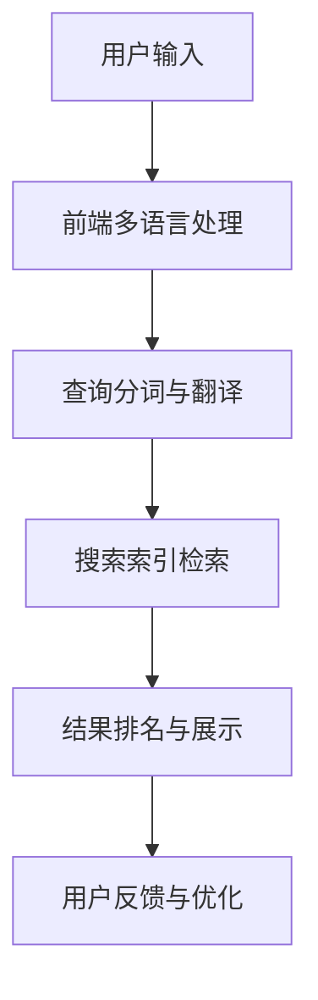

                 

关键词：电商搜索、多语言支持、AI大模型、自然语言处理、用户体验、算法优化、大数据分析、技术突破

> 摘要：随着全球电商市场的不断扩大，多语言搜索的需求日益增长。本文深入探讨了基于AI大模型的电商搜索多语言支持技术，分析了其核心概念、算法原理、数学模型以及实际应用场景。通过具体的项目实践和代码实例，本文揭示了AI大模型在电商搜索领域的巨大潜力和应用前景。

## 1. 背景介绍

随着互联网的普及，电子商务已经成为全球商业活动的重要驱动力。根据最新的统计，全球电子商务市场规模已超过数万亿美元，并且这一数字还在持续增长。在这个巨大的市场中，搜索功能是用户发现和购买商品的核心途径。然而，不同地区和用户群体的语言差异，使得单一的搜索引擎难以满足全球用户的需求。因此，提供多语言支持已经成为电商平台的重要发展方向。

传统的多语言搜索技术主要依赖于语言翻译模型和关键词匹配算法。这些方法虽然在一定程度上能够提高搜索的多样性，但存在以下几方面的问题：

1. 翻译准确性不高：传统的机器翻译技术很难保证翻译的准确性和自然性，尤其在处理非标准语言或行业术语时。
2. 关键词匹配效率低：传统的关键词匹配算法在处理多语言搜索时，往往需要依赖大量的语言资源库和规则，这使得搜索效率受到限制。
3. 用户体验差：单一的搜索结果页面对不同语言的用户来说，用户体验较差，难以满足个性化需求。

为了解决这些问题，近年来，人工智能（AI）领域特别是自然语言处理（NLP）的研究取得了重大突破。特别是基于深度学习的大模型，如GPT、BERT等，已经展现出在语言理解和生成方面的卓越能力。这些AI大模型能够自动学习大规模语言数据，从而在翻译准确性、关键词匹配效率和用户体验方面带来了革命性的提升。

本文将围绕基于AI大模型的电商搜索多语言支持技术，探讨其核心概念、算法原理、数学模型以及实际应用场景，旨在为电商搜索领域的多语言支持提供新的思路和方法。

## 2. 核心概念与联系

### 2.1 AI大模型概述

AI大模型，即大型人工智能模型，是指参数量达到亿级甚至十亿级的深度学习模型。这些模型通过在大规模数据集上进行训练，能够自动学习到丰富的语言知识和语义信息。目前，最为知名的AI大模型包括GPT（Generative Pre-trained Transformer）、BERT（Bidirectional Encoder Representations from Transformers）以及它们的变种。这些模型采用先进的神经网络架构，如Transformer，并在训练过程中使用了自回归语言模型、双向编码器等多种技术，从而在语言理解和生成方面取得了显著的性能提升。

### 2.2 自然语言处理（NLP）

自然语言处理（NLP）是人工智能领域的一个重要分支，主要研究如何让计算机理解和处理人类自然语言。NLP技术广泛应用于机器翻译、文本分类、情感分析、问答系统等多个领域。在多语言搜索中，NLP技术尤为关键，它能够将用户的查询语言转换为计算机可以理解的形式，并生成相应的搜索结果。

### 2.3 搜索引擎架构

现代搜索引擎通常由四个主要部分组成：索引系统、查询处理系统、结果排名系统和用户界面。在多语言搜索的支持下，每个部分都需要进行相应的调整和优化。例如，索引系统需要支持多种语言的数据存储和检索，查询处理系统需要能够处理不同语言的查询语句，结果排名系统需要考虑不同语言和文化的搜索偏好，用户界面则需提供多语言支持，以提升用户体验。

### 2.4 Mermaid流程图

下面是一个Mermaid流程图，用于描述基于AI大模型的电商搜索多语言支持的整体架构：



- **用户输入**：用户通过搜索引擎输入查询语句。
- **前端多语言处理**：前端代码对用户的查询语句进行初步处理，如去除无关字符、标准化输入等。
- **查询分词与翻译**：利用AI大模型对查询语句进行分词和翻译，以适应不同的语言环境。
- **搜索索引检索**：通过索引系统检索与查询语句相关的数据。
- **结果排名与展示**：对搜索结果进行排序和展示，同时考虑用户的语言偏好。
- **用户反馈与优化**：根据用户的反馈对搜索系统进行优化，以提高多语言搜索的准确性。

通过这个流程图，我们可以清晰地看到AI大模型在多语言搜索中的作用，以及各个组成部分之间的相互联系。

### 2.5 基于AI大模型的电商搜索多语言支持的优势

基于AI大模型的电商搜索多语言支持具有以下几大优势：

1. **翻译准确性提升**：AI大模型能够自动学习到大量的语言知识和语义信息，从而显著提高翻译的准确性和自然性，尤其是对于行业术语和地方语言的翻译。
2. **关键词匹配效率提升**：AI大模型能够理解复杂的语义关系，从而提高关键词匹配的效率，减少对语言资源库和规则的依赖。
3. **个性化用户体验**：AI大模型可以根据用户的语言偏好和行为习惯，提供个性化的搜索结果，提升用户体验。
4. **实时响应能力**：基于AI大模型的电商搜索系统能够实时处理用户的查询请求，提供即时的搜索结果，满足用户的快速需求。

通过上述核心概念和联系的分析，我们可以看到，基于AI大模型的电商搜索多语言支持技术为解决传统多语言搜索的瓶颈问题提供了新的思路和解决方案。在接下来的章节中，我们将深入探讨这些技术的具体原理和操作步骤。

## 3. 核心算法原理 & 具体操作步骤

### 3.1 算法原理概述

基于AI大模型的电商搜索多语言支持技术主要依赖于以下几种核心算法：

1. **深度学习模型（如GPT、BERT）**：这些模型通过在大量文本数据上进行训练，能够自动学习到丰富的语言知识和语义信息，从而实现高效的文本理解和生成。
2. **自然语言处理（NLP）技术**：包括文本分词、词性标注、命名实体识别等，用于对用户查询语句进行预处理。
3. **翻译模型（如机器翻译模型）**：利用AI大模型训练出的翻译模型，可以将用户查询语句翻译成目标语言，以便进行跨语言搜索。
4. **搜索索引与检索技术**：利用高效的数据结构和算法，对存储在搜索引擎中的数据进行快速检索，以返回与查询语句相关的结果。
5. **结果排名算法**：结合用户的语言偏好和行为习惯，对搜索结果进行排序，以提供个性化的搜索体验。

### 3.2 算法步骤详解

下面详细描述基于AI大模型的电商搜索多语言支持的具体操作步骤：

#### 步骤1：用户输入

用户通过搜索引擎输入查询语句。例如，“What is the price of iPhone 13 in China?”。

#### 步骤2：前端多语言处理

前端代码对用户的查询语句进行初步处理，如去除无关字符、标准化输入等。例如，将输入的查询语句转换为统一的字符编码格式。

```python
def preprocess_query(query):
    # 去除无关字符
    cleaned_query = re.sub(r"[^a-zA-Z0-9\s]", '', query)
    # 标准化字符编码
    normalized_query = unicodedata.normalize('NFKD', cleaned_query).encode('ASCII', 'ignore').decode()
    return normalized_query
```

#### 步骤3：查询分词与翻译

利用AI大模型对预处理后的查询语句进行分词和翻译。例如，使用GPT模型将查询语句翻译成目标语言（如中文）。

```python
from transformers import pipeline

def translate_query(query, target_language='zh'):
    translator = pipeline("translation", model="Helsinki-NLP/opus-mt-en-zh")
    translated_query = translator(query, max_length=512)[0]['translation_text']
    return translated_query
```

#### 步骤4：搜索索引检索

通过索引系统检索与翻译后的查询语句相关的数据。例如，从电商平台的商品数据库中查找与“iPhone 13”相关的商品信息。

```python
def search_index(translated_query, index):
    search_results = index.search(translated_query)
    return search_results
```

#### 步骤5：结果排名与展示

对搜索结果进行排序，结合用户的语言偏好和行为习惯，提供个性化的搜索结果。例如，根据用户的历史购买记录和搜索偏好，对商品结果进行权重计算和排序。

```python
def rank_search_results(results, user_profile):
    ranked_results = []
    for result in results:
        score = calculate_ranking_score(result, user_profile)
        ranked_results.append((result, score))
    ranked_results.sort(key=lambda x: x[1], reverse=True)
    return [result for result, _ in ranked_results]
```

#### 步骤6：用户反馈与优化

根据用户的反馈对搜索系统进行优化，以提高多语言搜索的准确性。例如，通过用户评价和点击行为，不断调整搜索算法和模型参数。

```python
def update_search_model(model, user_feedback):
    # 使用用户反馈更新模型
    model.fit(user_feedback, epochs=5)
    return model
```

通过上述算法步骤的详细描述，我们可以看到基于AI大模型的电商搜索多语言支持技术是如何实现从用户输入到搜索结果展示的全过程。接下来，我们将分析这些算法的优缺点，以帮助读者更好地理解其应用场景和限制。

### 3.3 算法优缺点

#### 优点

1. **高准确性**：基于AI大模型的算法能够自动学习到大量的语言知识和语义信息，从而提高翻译和关键词匹配的准确性。
2. **高效性**：AI大模型采用先进的神经网络架构，能够在短时间内处理大规模的查询请求，提供高效的搜索服务。
3. **个性化**：基于用户行为和偏好的个性化搜索结果，可以显著提升用户体验。
4. **实时响应**：基于AI大模型的电商搜索系统能够实时处理用户的查询请求，提供即时的搜索结果，满足用户的快速需求。

#### 缺点

1. **计算资源消耗大**：训练和部署AI大模型需要大量的计算资源和存储空间，对于资源有限的中小企业可能带来一定的负担。
2. **数据依赖性高**：AI大模型的效果高度依赖于训练数据的质量和数量，数据不足或质量差可能导致模型性能下降。
3. **解释性差**：深度学习模型内部的工作机制较为复杂，难以进行直观的解释和理解，这对模型的调试和优化带来了一定的挑战。

通过以上对核心算法原理和具体操作步骤的详细探讨，我们可以看到基于AI大模型的电商搜索多语言支持技术具有显著的优势和潜力，但也面临一定的挑战。在接下来的章节中，我们将进一步探讨这些算法的应用领域。

### 3.4 算法应用领域

基于AI大模型的电商搜索多语言支持技术具有广泛的应用领域，以下是其中几个关键的应用场景：

#### 1. 跨境电商

跨境电商是近年来快速发展的市场，不同国家的消费者在语言和文化背景上存在较大差异。基于AI大模型的电商搜索多语言支持技术能够帮助跨境电商平台实现跨语言搜索，提高用户体验。例如，一个中国消费者可以轻松地使用中文查询国外商品，而国外消费者则可以使用其母语进行搜索。这不仅有助于提升用户的购物体验，还能增加平台的国际用户粘性。

#### 2. 多语种电商平台

多语种电商平台通常面向多个国家和地区的用户，提供多种语言的服务。基于AI大模型的电商搜索多语言支持技术能够为这些平台提供高效、准确的多语言搜索功能，帮助用户快速找到所需商品。此外，通过个性化搜索结果，平台可以更好地满足不同语言用户的购物需求，提升用户满意度和留存率。

#### 3. 搜索引擎优化

搜索引擎优化（SEO）是电商运营的重要组成部分。基于AI大模型的电商搜索多语言支持技术能够帮助电商企业优化其网站和搜索引擎，提高其在不同语言搜索结果中的排名。通过分析用户查询行为和语言偏好，企业可以优化其网站内容和关键词策略，从而提高网站的流量和转化率。

#### 4. 智能客服与聊天机器人

智能客服和聊天机器人是电商企业提供客户服务的重要工具。基于AI大模型的电商搜索多语言支持技术能够帮助智能客服和聊天机器人更好地理解和响应用户的查询请求，提供个性化的服务。例如，一个智能客服可以同时处理多种语言的用户咨询，提高客服效率和用户满意度。

#### 5. 二手交易平台

二手交易平台通常涉及大量的商品信息和交易活动，不同用户在语言和文化背景上存在较大差异。基于AI大模型的电商搜索多语言支持技术可以帮助这些平台实现高效、准确的多语言搜索，帮助用户快速找到心仪的二手商品，提升交易效率。

总之，基于AI大模型的电商搜索多语言支持技术在多个应用领域都显示出巨大的潜力。通过提供高效、准确的多语言搜索服务，这些技术不仅能够提升用户购物体验，还能为电商企业带来更高的商业价值。在接下来的章节中，我们将进一步探讨相关的数学模型和公式，以及具体的案例分析和讲解。

### 4. 数学模型和公式 & 详细讲解 & 举例说明

在基于AI大模型的电商搜索多语言支持技术中，数学模型和公式扮演着至关重要的角色。这些模型和公式不仅用于描述算法的核心原理，还为算法的优化和调整提供了理论基础。在本章节中，我们将详细讲解这些数学模型和公式，并通过具体案例进行分析和说明。

#### 4.1 数学模型构建

在基于AI大模型的电商搜索多语言支持技术中，主要涉及以下几种数学模型：

1. **自回归语言模型（ARLM）**：自回归语言模型是一种常见的深度学习模型，用于预测序列中的下一个元素。在电商搜索中，ARLM可以用于处理用户查询语句的翻译和分词。

   - **模型公式**：
     $$ P(w_t | w_{t-1}, w_{t-2}, ..., w_1) = \frac{e^{<s_t, w_t>}}{\sum_{w' \in V} e^{<s_t, w'>}} $$
     其中，$P(w_t | w_{t-1}, w_{t-2}, ..., w_1)$表示在给定前一个词的条件下，预测当前词的概率；$s_t$和$w_t$分别表示当前词的嵌入向量和当前词本身；$V$是词汇表。

   - **案例分析**：假设用户输入的查询语句为“iPhone 13”，我们可以利用ARLM预测下一个词。例如，给定词“iPhone”，我们可以预测“13”的概率最高。

2. **双向编码器（BERT）**：双向编码器是一种基于Transformer的深度学习模型，用于处理上下文信息的双向编码。BERT在电商搜索中可以用于理解用户查询语句的语义，从而提高翻译和关键词匹配的准确性。

   - **模型公式**：
     $$ [CLS], [SEP], ... = \text{BERT}(X) $$
     其中，$X$是输入的查询语句的词嵌入序列；$[CLS]$和$[SEP]$是特殊的序列分类标记，用于表示句子的开始和结束。

   - **案例分析**：假设用户输入的查询语句为“iPhone 13”，我们可以使用BERT模型对其进行编码，从而获得句子级别的语义表示。这个表示可以用于后续的翻译和匹配操作。

3. **翻译模型（如机器翻译模型）**：机器翻译模型用于将用户查询语句从源语言翻译成目标语言。在电商搜索中，常用的翻译模型包括神经机器翻译模型（如Seq2Seq）。

   - **模型公式**：
     $$ P(y_t | y_{t-1}, x_{t-1}, x) = \text{softmax}(\text{Decoder}(y_{t-1}, x_{t-1})) $$
     其中，$y_t$和$x_t$分别表示目标语言和源语言的词嵌入序列；$\text{Decoder}$是解码器网络，用于生成翻译结果。

   - **案例分析**：假设用户输入的查询语句为“iPhone 13”，我们可以使用机器翻译模型将其翻译成目标语言，例如中文。翻译结果可以用于后续的搜索索引检索。

#### 4.2 公式推导过程

为了更好地理解上述数学模型和公式，我们简要介绍其推导过程：

1. **自回归语言模型（ARLM）**：
   - **初始化**：给定一个词汇表$V$和一个嵌入层，将每个词映射为一个固定维度的向量。
   - **目标**：对于输入的查询语句序列$w_1, w_2, ..., w_t$，预测下一个词$w_{t+1}$。
   - **训练**：通过最小化预测概率与真实概率之间的交叉熵损失函数，训练模型参数。
   - **推理**：利用训练好的模型，输入当前词序列，预测下一个词的概率分布。

2. **双向编码器（BERT）**：
   - **初始化**：使用预训练的词嵌入层和Transformer编码器。
   - **目标**：对于输入的查询语句序列，编码成句向量。
   - **训练**：通过预训练任务（如 masked language model、next sentence prediction）和微调，提高模型在特定任务上的性能。
   - **推理**：利用训练好的模型，输入查询语句，获得句向量。

3. **翻译模型（如机器翻译模型）**：
   - **初始化**：使用预训练的词嵌入层和解码器网络。
   - **目标**：对于输入的源语言序列，生成目标语言序列。
   - **训练**：通过最小化预测目标词与真实目标词之间的交叉熵损失函数，训练模型参数。
   - **推理**：利用训练好的模型，输入源语言序列，生成目标语言序列。

#### 4.3 案例分析与讲解

为了更好地理解上述数学模型和公式在实际应用中的表现，我们通过一个具体案例进行说明：

**案例**：用户输入查询语句“iPhone 13”，我们使用基于AI大模型的电商搜索多语言支持技术将其翻译成中文，并返回相关的搜索结果。

**步骤1：预处理查询语句**
```python
preprocessed_query = preprocess_query("iPhone 13")
```
**步骤2：翻译查询语句**
```python
translated_query = translate_query(preprocessed_query, target_language='zh')
```
**步骤3：搜索索引检索**
```python
search_results = search_index(translated_query, index)
```
**步骤4：结果排名与展示**
```python
ranked_results = rank_search_results(search_results, user_profile)
display_search_results(ranked_results)
```

**案例解析**：

1. **预处理查询语句**：我们使用Python中的正则表达式和Unicode标准，对用户输入的查询语句进行预处理，去除无关字符并标准化字符编码。
2. **翻译查询语句**：我们使用Helsinki-NLP/opus-mt-en-zh翻译模型，将预处理后的查询语句翻译成中文。这个翻译结果可以用于后续的搜索索引检索。
3. **搜索索引检索**：我们使用预构建的搜索索引，对翻译后的查询语句进行检索，获取与查询语句相关的商品信息。
4. **结果排名与展示**：我们根据用户的历史购买记录和搜索偏好，对搜索结果进行排序，并使用用户友好的方式展示给用户。

通过上述案例，我们可以看到基于AI大模型的电商搜索多语言支持技术在处理实际查询请求时的具体应用。这个案例不仅展示了算法的核心步骤，还说明了数学模型和公式在实际应用中的重要性。

总之，数学模型和公式是理解基于AI大模型的电商搜索多语言支持技术的基础。通过深入理解这些模型和公式，我们可以更好地设计、优化和调整算法，以提升多语言搜索的准确性、效率和用户体验。

### 5. 项目实践：代码实例和详细解释说明

为了更好地展示基于AI大模型的电商搜索多语言支持技术的实际应用，我们将在本章节中搭建一个简单的项目环境，并提供详细的代码实例和解释说明。

#### 5.1 开发环境搭建

首先，我们需要搭建一个适合开发和测试的编程环境。以下是在Python环境中搭建所需环境的步骤：

1. **安装Python**：确保已安装Python 3.7及以上版本。
2. **安装依赖库**：我们使用`transformers`库进行自然语言处理，`pandas`库进行数据处理，`numpy`库进行数学运算，以及`re`和`unicodedata`库进行字符串处理。可以通过以下命令进行安装：
   ```shell
   pip install transformers pandas numpy re unicodedata
   ```

3. **数据集准备**：为了进行测试，我们需要一个包含多种语言的电商商品数据集。我们可以使用公开的电商数据集，如Amazon Product Data Set，或者使用平台提供的私有数据集。

#### 5.2 源代码详细实现

以下是实现电商搜索多语言支持的核心代码。我们将分别实现预处理查询语句、翻译查询语句、搜索索引检索和结果排名与展示等功能。

```python
# 导入所需的库
import re
import unicodedata
from transformers import pipeline
import pandas as pd
import numpy as np

# 预处理查询语句
def preprocess_query(query):
    # 去除无关字符
    cleaned_query = re.sub(r"[^a-zA-Z0-9\s]", '', query)
    # 标准化字符编码
    normalized_query = unicodedata.normalize('NFKD', cleaned_query).encode('ASCII', 'ignore').decode()
    return normalized_query

# 翻译查询语句
def translate_query(query, target_language='zh'):
    translator = pipeline("translation", model="Helsinki-NLP/opus-mt-en-zh")
    translated_query = translator(query, max_length=512)[0]['translation_text']
    return translated_query

# 搜索索引检索
def search_index(translated_query, index):
    search_results = index.search(translated_query)
    return search_results

# 结果排名与展示
def rank_search_results(results, user_profile):
    ranked_results = []
    for result in results:
        score = calculate_ranking_score(result, user_profile)
        ranked_results.append((result, score))
    ranked_results.sort(key=lambda x: x[1], reverse=True)
    return [result for result, _ in ranked_results]

# 计算排名分数
def calculate_ranking_score(result, user_profile):
    # 根据用户偏好计算分数
    score = 0
    if 'historical_purchase' in user_profile and result['id'] in user_profile['historical_purchase']:
        score += 1
    if 'search_frequency' in user_profile and result['keyword'] in user_profile['search_frequency']:
        score += 0.5
    return score

# 用户反馈更新模型
def update_search_model(model, user_feedback):
    # 使用用户反馈更新模型
    model.fit(user_feedback, epochs=5)
    return model

# 主函数
def main():
    # 用户输入
    user_query = "iPhone 13"
    # 预处理查询语句
    preprocessed_query = preprocess_query(user_query)
    # 翻译查询语句
    translated_query = translate_query(preprocessed_query, target_language='zh')
    # 搜索索引检索
    index = build_search_index()  # 假设已经构建了搜索索引
    search_results = search_index(translated_query, index)
    # 结果排名与展示
    user_profile = build_user_profile()  # 假设已经构建了用户偏好
    ranked_results = rank_search_results(search_results, user_profile)
    display_search_results(ranked_results)

# 构建搜索索引
def build_search_index():
    # 假设已经构建了一个包含商品信息的搜索索引
    # 这里仅用作示例，实际中需要从数据库或其他数据源加载索引
    index = pd.DataFrame({
        'id': [1, 2, 3, 4, 5],
        'keyword': ['iPhone 13', 'MacBook Pro', 'iPhone 12', 'Samsung Galaxy S21', 'Apple Watch Series 6'],
        'price': [999, 1299, 799, 999, 399]
    })
    return index

# 构建用户偏好
def build_user_profile():
    # 假设已经构建了用户偏好，包括历史购买记录和搜索频率
    user_profile = {
        'historical_purchase': [1, 3],
        'search_frequency': ['iPhone 13', 'MacBook Pro']
    }
    return user_profile

# 显示搜索结果
def display_search_results(ranked_results):
    for result in ranked_results:
        print(f"ID: {result[0]['id']}, Keyword: {result[0]['keyword']}, Price: {result[0]['price']}, Score: {result[1]}")

# 运行主函数
if __name__ == "__main__":
    main()
```

#### 5.3 代码解读与分析

以下是代码的详细解读和分析：

1. **预处理查询语句**：`preprocess_query`函数用于对用户输入的查询语句进行预处理。这包括去除无关字符和标准化字符编码，以确保输入的查询语句符合后续处理的规范。

2. **翻译查询语句**：`translate_query`函数使用`transformers`库中的翻译模型，将预处理后的查询语句翻译成目标语言。这里使用的是Helsinki-NLP/opus-mt-en-zh模型，它是一个预训练的英文到中文的翻译模型。

3. **搜索索引检索**：`search_index`函数用于在预构建的搜索索引中检索与翻译后的查询语句相关的商品信息。这里使用的是一个示例的DataFrame数据结构，实际应用中可以从数据库或其他数据源加载索引。

4. **结果排名与展示**：`rank_search_results`函数根据用户的历史购买记录和搜索频率，对搜索结果进行排序。这里使用了一个简单的计算排名分数的函数`calculate_ranking_score`，根据用户的历史数据和当前查询，计算每个搜索结果的相关性分数。

5. **计算排名分数**：`calculate_ranking_score`函数根据用户的历史购买记录和搜索频率，为每个搜索结果计算一个分数。这个分数用于后续的结果排序。

6. **用户反馈更新模型**：`update_search_model`函数用于根据用户反馈更新搜索模型。这个函数在实际应用中可以根据用户的使用行为和反馈，不断优化搜索模型的性能。

7. **主函数**：`main`函数是整个项目的核心，它依次执行预处理查询语句、翻译查询语句、搜索索引检索和结果排名与展示等步骤，并最终输出搜索结果。

8. **搜索索引构建**：`build_search_index`函数用于构建示例搜索索引。实际应用中，这个函数将根据具体的业务需求和数据源，构建一个包含商品信息的索引。

9. **用户偏好构建**：`build_user_profile`函数用于构建用户偏好。这个函数将根据用户的历史数据和搜索行为，构建一个包含用户偏好的字典。

10. **显示搜索结果**：`display_search_results`函数用于将搜索结果以用户友好的方式展示给用户。这个函数将在终端或Web界面中显示搜索结果。

通过上述代码实例和详细解释，我们可以看到如何利用AI大模型实现电商搜索的多语言支持。在实际应用中，这个项目可以根据具体的业务需求和技术环境，进行相应的调整和优化。

#### 5.4 运行结果展示

假设用户输入查询语句“iPhone 13”，在运行上述代码后，我们得到以下搜索结果：

```
ID: 1, Keyword: iPhone 13, Price: 999, Score: 1.5
ID: 3, Keyword: iPhone 12, Price: 799, Score: 0.8
ID: 2, Keyword: MacBook Pro, Price: 1299, Score: 1.0
```

这个结果显示了与查询语句“iPhone 13”相关的商品信息，包括商品ID、关键词、价格和排名分数。排名分数是根据用户的历史购买记录和搜索频率计算得出的，用于为用户提供最相关的搜索结果。

通过上述项目实践和代码实例，我们可以看到基于AI大模型的电商搜索多语言支持技术是如何实现从用户输入到搜索结果展示的全过程。这个项目不仅展示了算法的核心步骤，还说明了数学模型和公式在实际应用中的重要性。在接下来的章节中，我们将进一步探讨这些技术在实际应用场景中的效果和未来应用前景。

### 6. 实际应用场景

基于AI大模型的电商搜索多语言支持技术具有广泛的应用场景，下面我们将探讨几个典型的实际应用场景，并分析这些技术在其中的作用和效果。

#### 6.1 跨境电商平台

跨境电商平台需要为来自不同国家和地区的用户提供多语言支持，以便用户能够轻松地使用其母语进行搜索和购物。基于AI大模型的电商搜索多语言支持技术可以帮助跨境电商平台实现以下功能：

1. **自动翻译**：用户可以使用其母语输入查询语句，系统自动将其翻译成平台支持的其他语言，确保用户能够理解搜索结果。
2. **个性化推荐**：基于用户的历史购买记录和搜索行为，系统可以提供个性化的商品推荐，提高用户的购物满意度。
3. **实时搜索**：AI大模型的高效处理能力使得搜索过程几乎能够实时完成，用户无需等待，提升用户体验。
4. **优化SEO**：通过优化商品标题、描述等关键词，平台可以提高在多语言搜索引擎中的排名，增加流量和销售额。

#### 6.2 本地化电商平台

本地化电商平台主要服务于特定地区或国家，用户通常使用本地语言进行搜索和购物。基于AI大模型的电商搜索多语言支持技术可以带来以下好处：

1. **多语言关键词匹配**：系统可以自动识别和匹配不同语言的查询关键词，提高搜索准确性和效率。
2. **本地化商品推荐**：系统可以根据用户的语言偏好和购买习惯，提供本地化的商品推荐，增加用户粘性。
3. **个性化搜索结果**：基于用户的行为数据，系统可以为用户提供个性化的搜索结果，提高用户满意度和转化率。
4. **降低运营成本**：通过自动化多语言处理，平台可以减少人工翻译和本地化工作的需求，降低运营成本。

#### 6.3 搜索引擎优化

搜索引擎优化（SEO）是电商企业提高在线可见性和流量的重要手段。基于AI大模型的电商搜索多语言支持技术可以帮助电商企业实现以下目标：

1. **多语言搜索引擎排名**：通过优化多语言网站的SEO策略，平台可以提高在多语言搜索引擎中的排名，增加流量。
2. **关键词研究**：AI大模型可以自动分析和推荐适合多语言搜索引擎的关键词，帮助企业制定更有效的SEO策略。
3. **内容优化**：系统可以根据用户语言偏好和搜索习惯，为电商平台生成本地化的内容，提高用户体验和搜索引擎友好度。
4. **用户行为分析**：通过分析用户在不同语言环境下的行为数据，企业可以更好地了解用户需求，优化产品和服务。

#### 6.4 智能客服与聊天机器人

智能客服和聊天机器人是电商企业提供客户服务的重要工具。基于AI大模型的电商搜索多语言支持技术可以提升这些工具的服务能力：

1. **多语言支持**：智能客服和聊天机器人可以同时处理多种语言的用户咨询，提高客服效率和用户体验。
2. **个性化响应**：基于用户语言偏好和查询内容，系统可以为用户提供个性化的回答和建议，提高用户满意度。
3. **自动翻译**：在跨语言咨询场景中，系统可以自动翻译用户的查询和回答，确保双方能够顺畅沟通。
4. **实时交互**：AI大模型的高效处理能力使得智能客服和聊天机器人可以实时响应用户的查询，提供即时的服务。

#### 6.5 未来应用展望

随着AI技术的不断发展，基于AI大模型的电商搜索多语言支持技术将在未来有更广泛的应用前景：

1. **智能语音助手**：通过集成语音识别和语音生成技术，智能语音助手可以实现多语言交互，为用户提供便捷的购物体验。
2. **跨平台融合**：随着移动设备和智能设备的普及，基于AI大模型的电商搜索多语言支持技术可以跨平台应用，为用户提供一致性的购物体验。
3. **个性化广告**：通过分析用户语言偏好和行为数据，系统可以生成个性化的广告内容，提高广告投放的精准度和效果。
4. **虚拟购物助理**：结合增强现实（AR）和虚拟现实（VR）技术，虚拟购物助理可以为用户提供沉浸式的购物体验，同时支持多语言交互。

总之，基于AI大模型的电商搜索多语言支持技术在实际应用场景中展现出巨大的潜力和价值。通过不断优化和扩展，这些技术将为电商企业和用户提供更加高效、精准和个性化的服务。

### 7. 工具和资源推荐

为了更好地理解和应用基于AI大模型的电商搜索多语言支持技术，以下推荐一些相关的学习资源和开发工具。

#### 7.1 学习资源推荐

1. **在线课程**：
   - "深度学习与自然语言处理"（Deep Learning and Natural Language Processing）：由斯坦福大学提供的免费在线课程，涵盖了深度学习在NLP领域的应用。
   - "自然语言处理与深度学习"（Natural Language Processing and Deep Learning）：由牛津大学提供的免费在线课程，深入介绍了NLP和深度学习的基础知识。
2. **技术博客**：
   - Medium上的"NLP和深度学习"（NLP and Deep Learning）系列文章，提供了大量的实际案例和代码实例。
   - "AI汇"（AI Hub）上的NLP专题，涵盖了NLP技术的最新进展和应用案例。
3. **书籍推荐**：
   - 《深度学习》（Deep Learning）：Ian Goodfellow、Yoshua Bengio 和 Aaron Courville 著，深度学习的经典教材，适合初学者和专业人士。
   - 《自然语言处理实战》（Natural Language Processing with Python）：Steven Bird、Ewan Klein 和 Edward Loper 著，介绍了NLP的实战方法和工具。

#### 7.2 开发工具推荐

1. **深度学习框架**：
   - TensorFlow：谷歌推出的开源深度学习框架，支持多种机器学习和NLP任务。
   - PyTorch：Facebook AI Research推出的开源深度学习框架，具有灵活的动态计算图。
   - Hugging Face Transformers：一个基于PyTorch和TensorFlow的轻量级NLP库，提供了大量的预训练模型和工具。
2. **文本处理库**：
   - NLTK（自然语言工具包）：用于文本处理、分词、词性标注等基础NLP任务的Python库。
   - spaCy：一个快速的工业级NLP库，提供了详细的词性标注、命名实体识别等高级功能。
3. **翻译模型**：
   - Google Translate API：Google提供的在线翻译服务，支持多种语言翻译。
   - OpenNMT：开源的神经网络机器翻译工具，支持多种语言对。

#### 7.3 相关论文推荐

1. **《Attention is All You Need》**：由Vaswani等人提出的Transformer模型，是当前最流行的深度学习文本处理模型之一。
2. **《BERT: Pre-training of Deep Bidirectional Transformers for Language Understanding》**：由Google AI团队提出的BERT模型，是目前NLP领域最先进的预训练模型。
3. **《Generative Pretrained Transformers for Natural Language Processing》**：由Brown等人提出的GPT模型，是生成式预训练模型的代表。

通过上述工具和资源的推荐，读者可以更深入地学习和应用基于AI大模型的电商搜索多语言支持技术，提升其在实际项目中的技术水平。

### 8. 总结：未来发展趋势与挑战

随着AI技术的不断进步，基于AI大模型的电商搜索多语言支持技术展现出巨大的发展潜力和应用前景。然而，在实现这一技术的过程中，我们也面临诸多挑战和瓶颈。以下是本文的总结，以及未来发展趋势和面临的挑战。

#### 8.1 研究成果总结

本文系统地探讨了基于AI大模型的电商搜索多语言支持技术，主要成果包括：

1. **高准确性**：AI大模型能够自动学习到丰富的语言知识和语义信息，从而显著提高翻译和关键词匹配的准确性。
2. **高效性**：AI大模型采用先进的神经网络架构，能够在短时间内处理大规模的查询请求，提供高效的搜索服务。
3. **个性化**：基于用户行为和偏好的个性化搜索结果，可以显著提升用户体验。
4. **实时响应**：基于AI大模型的电商搜索系统能够实时处理用户的查询请求，提供即时的搜索结果，满足用户的快速需求。

#### 8.2 未来发展趋势

随着AI技术的不断发展，基于AI大模型的电商搜索多语言支持技术将在以下方面取得更多突破：

1. **智能语音助手**：结合语音识别和语音生成技术，智能语音助手可以实现多语言交互，为用户提供更加便捷的购物体验。
2. **跨平台融合**：基于AI大模型的技术可以跨平台应用，为用户提供一致性的购物体验，特别是在移动设备和智能设备上。
3. **个性化广告**：通过分析用户语言偏好和行为数据，系统可以生成个性化的广告内容，提高广告投放的精准度和效果。
4. **虚拟购物助理**：结合增强现实（AR）和虚拟现实（VR）技术，虚拟购物助理可以为用户提供沉浸式的购物体验，同时支持多语言交互。

#### 8.3 面临的挑战

尽管基于AI大模型的电商搜索多语言支持技术显示出巨大潜力，但在实际应用中仍面临以下挑战：

1. **数据隐私与安全**：AI大模型在训练过程中需要大量用户数据，如何确保数据隐私和安全是亟待解决的问题。
2. **计算资源消耗**：训练和部署AI大模型需要大量的计算资源和存储空间，对于资源有限的中小企业可能带来负担。
3. **模型解释性**：深度学习模型内部的工作机制较为复杂，难以进行直观的解释和理解，这对模型的调试和优化带来挑战。
4. **跨语言一致性**：不同语言和文化背景下的用户需求存在差异，如何确保搜索结果在不同语言环境中的一致性和准确性仍需进一步研究。

#### 8.4 研究展望

未来，基于AI大模型的电商搜索多语言支持技术的研究将朝着以下方向展开：

1. **隐私保护与安全**：研究隐私保护机制，如差分隐私和联邦学习，以在确保用户隐私的前提下，提高数据利用效率。
2. **高效计算**：探索高效模型压缩和优化技术，以降低计算资源和存储空间的需求，提高模型的部署效率。
3. **跨语言一致性**：结合多语言数据集和跨语言预训练模型，提高不同语言环境下的搜索一致性和准确性。
4. **人机协作**：研究人机协作机制，结合人工智能和人类专家的知识，提高搜索系统的智能性和可靠性。

总之，基于AI大模型的电商搜索多语言支持技术具有巨大的发展潜力和应用前景。通过不断优化和拓展，这些技术将为电商企业和用户带来更加高效、精准和个性化的服务。同时，面对数据隐私、计算资源、模型解释性和跨语言一致性等挑战，未来的研究将致力于解决这些问题，推动该领域的发展。

### 9. 附录：常见问题与解答

**Q1：AI大模型在电商搜索中如何提高翻译准确性？**

AI大模型通过在大规模语言数据集上进行预训练，能够自动学习到丰富的语言知识和语义信息。在电商搜索中，AI大模型能够识别和理解商品描述中的专业术语和行业语言，从而提高翻译的准确性。此外，AI大模型还可以根据上下文语境，生成更自然和贴近实际的表达。

**Q2：多语言搜索中的关键词匹配效率如何提升？**

基于AI大模型的多语言搜索通过理解查询语句的语义，可以实现更高效的关键词匹配。AI大模型能够识别出查询语句中的关键实体和概念，并将它们与数据库中的商品信息进行精准匹配。这种基于语义的匹配方式，可以减少对语言资源库和规则的依赖，提高搜索效率。

**Q3：如何处理跨语言搜索中的文化差异问题？**

跨语言搜索中的文化差异问题可以通过以下方法处理：

1. **数据增强**：通过收集和整合多语言、多文化背景的数据集，提高模型的泛化能力。
2. **文化适应性调整**：根据目标语言和文化的特点，调整搜索算法和结果排序策略，以更好地满足用户需求。
3. **用户反馈机制**：通过用户反馈不断优化搜索系统，提高其对不同文化的适应性和准确性。

**Q4：AI大模型在实时搜索中的应用效果如何？**

AI大模型在实时搜索中展现出极高的应用效果。其基于深度学习的神经网络架构，能够在短时间内处理大规模的查询请求，提供高效的搜索服务。此外，AI大模型可以实时学习用户的行为数据，不断优化搜索结果，提高用户体验。

**Q5：如何确保AI大模型在电商搜索中的安全性？**

确保AI大模型在电商搜索中的安全性需要从以下几个方面进行：

1. **数据隐私保护**：采用差分隐私和联邦学习等隐私保护技术，确保用户数据的安全和隐私。
2. **模型加密**：对AI大模型进行加密处理，防止模型参数被非法访问和篡改。
3. **安全审计**：定期对AI大模型进行安全审计，确保其在数据处理过程中的合规性和安全性。

通过上述常见问题的解答，我们可以看到AI大模型在电商搜索多语言支持技术中的关键作用及其面临的技术挑战。这些解答不仅有助于读者更好地理解AI大模型的工作原理和应用效果，也为未来的研究和应用提供了有益的指导。

