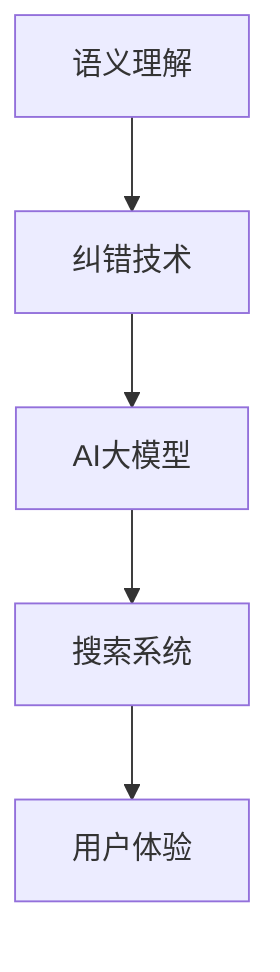

                 

在当今数字化时代，电子商务已经成为人们日常生活中不可或缺的一部分。电商平台的搜索功能作为用户发现和选择商品的关键途径，其用户体验直接影响着用户的满意度和平台的竞争力。为了提高搜索的准确性和效率，语义理解和纠错技术被广泛应用于电商搜索系统中。本文将探讨电商搜索中的语义理解与纠错技术，特别是AI大模型在这一领域的最新突破。

## 关键词

- 电商搜索
- 语义理解
- 纠错技术
- AI大模型
- 用户满意度
- 竞争力

## 摘要

随着人工智能技术的飞速发展，电商搜索的语义理解和纠错技术取得了显著进步。本文通过回顾相关研究背景，深入分析核心概念与联系，详细介绍核心算法原理，展示数学模型和公式，提供实际项目实践，探讨实际应用场景，并展望未来的发展趋势与挑战。本文旨在为读者提供一个全面而深入的关于电商搜索语义理解与纠错技术的了解。

## 1. 背景介绍

### 1.1 电商搜索的重要性

电商搜索是用户在电商平台寻找商品的关键环节。一个高效、准确的搜索系统能够提高用户的搜索效率，降低搜索时间，从而提升用户体验和满意度。随着用户数量的增长和商品种类的多样化，传统的基于关键词匹配的搜索方式已经难以满足用户的需求。因此，语义理解与纠错技术应运而生。

### 1.2 语义理解的必要性

语义理解是指对用户查询的意图和需求进行理解和解析，从而提供更加个性化的搜索结果。在电商搜索中，语义理解能够帮助系统更准确地理解用户输入的查询，识别关键词背后的真正意图，从而提升搜索结果的准确性。例如，当用户输入“送妈妈的礼物”时，系统需要理解“送”的动作和“妈妈”的关系，并能够识别出用户可能在寻找与母亲相关的礼物。

### 1.3 纠错技术的应用

纠错技术用于纠正用户输入的查询中的错误，以提高搜索的准确性。在电商搜索中，用户的输入可能存在拼写错误、同音字、漏字或多余字等问题，这些错误会影响搜索结果的准确性。通过纠错技术，系统可以识别和纠正这些错误，从而提供更准确的搜索结果。

### 1.4 AI大模型的优势

随着深度学习技术的兴起，AI大模型在语义理解和纠错领域展现出了巨大的潜力。大模型具有更高的参数量和更强的表达能力，能够处理更加复杂的语义任务。通过预训练和微调，大模型能够在各种任务上取得优异的性能，从而提高电商搜索系统的准确性和效率。

## 2. 核心概念与联系

### 2.1 语义理解的概念

语义理解是指对语言进行深层解析，以获取其真正的意图和意义。在电商搜索中，语义理解的目标是理解用户查询的含义，并生成与查询意图相关的搜索结果。

### 2.2 纠错技术的概念

纠错技术是指识别和纠正用户输入中的错误，以提高搜索的准确性。在电商搜索中，纠错技术包括拼写纠错、同音字纠错、漏字纠错和多余字纠错等。

### 2.3 AI大模型的优势

AI大模型通过预训练和微调，具有强大的语义理解能力和纠错能力。它们能够在大量的数据中进行学习，从而提高对复杂语义任务的处理能力。

### 2.4 核心概念与联系的关系图



## 3. 核心算法原理 & 具体操作步骤

### 3.1 算法原理概述

电商搜索中的语义理解与纠错算法通常基于深度学习模型，如BERT、GPT和T5等。这些模型通过预训练和微调，能够理解复杂的语义关系和纠错规则，从而实现高效的语义理解和纠错。

### 3.2 算法步骤详解

1. **预训练**：使用大量的文本数据对深度学习模型进行预训练，使其具备基本的语义理解和纠错能力。

2. **微调**：在预训练的基础上，使用特定领域的数据进行微调，以适应电商搜索的具体需求。

3. **查询处理**：对用户输入的查询进行预处理，如分词、词性标注等。

4. **语义理解**：使用预训练的模型对查询进行语义理解，提取查询的关键信息和意图。

5. **纠错**：对查询进行纠错，纠正拼写错误、同音字、漏字和多余字等问题。

6. **搜索结果生成**：根据纠错后的查询，生成与用户意图相关的搜索结果。

7. **结果排序**：对搜索结果进行排序，以提高结果的准确性。

### 3.3 算法优缺点

**优点**：

- 高效的语义理解和纠错能力。
- 能够处理复杂的语义任务。
- 能够适应不同领域的需求。

**缺点**：

- 需要大量的训练数据。
- 预训练和微调过程较为耗时。
- 模型的解释性较差。

### 3.4 算法应用领域

- 电商搜索：用于提高搜索结果的准确性和用户体验。
- 自然语言处理：用于理解用户查询和生成自然语言回答。
- 信息检索：用于优化搜索结果和排序。

## 4. 数学模型和公式 & 详细讲解 & 举例说明

### 4.1 数学模型构建

电商搜索中的语义理解与纠错算法通常基于神经网络模型，如BERT和GPT。以下是一个简化的BERT模型构建过程：

1. **词嵌入**：将词汇映射到高维向量空间，以表示词汇的语义特征。

2. **卷积神经网络（CNN）**：用于提取文本中的局部特征。

3. **循环神经网络（RNN）**：用于处理序列数据，如文本。

4. **全连接层**：用于将特征映射到目标类别。

### 4.2 公式推导过程

BERT模型的训练目标是最小化损失函数，即：

$$
\min_{\theta} L(\theta) = \sum_{i=1}^{N} L_i(\theta)
$$

其中，$L_i(\theta)$ 表示第 $i$ 个样本的损失函数。

### 4.3 案例分析与讲解

假设用户输入查询“送妈妈的礼物”，BERT模型将对其进行语义理解和纠错。以下是一个简化的分析过程：

1. **词嵌入**：将查询中的词汇映射到高维向量空间。

2. **卷积神经网络（CNN）**：提取查询的局部特征。

3. **循环神经网络（RNN）**：处理查询的序列信息。

4. **全连接层**：将查询的语义信息映射到目标类别，如“送妈妈”的礼物类别。

5. **纠错**：根据模型预测，纠正查询中的错误，如将“送妈妈的礼物”纠正为“送给妈妈的礼物”。

## 5. 项目实践：代码实例和详细解释说明

### 5.1 开发环境搭建

在开始项目实践之前，我们需要搭建一个合适的开发环境。以下是一个简化的步骤：

1. 安装Python环境（3.8及以上版本）。
2. 安装必要的依赖库，如TensorFlow、PyTorch等。
3. 准备预训练的BERT模型。

### 5.2 源代码详细实现

以下是一个简化的BERT模型在电商搜索中的应用示例：

```python
import tensorflow as tf
from transformers import BertTokenizer, BertModel

# 1. 加载预训练的BERT模型
tokenizer = BertTokenizer.from_pretrained('bert-base-chinese')
model = BertModel.from_pretrained('bert-base-chinese')

# 2. 处理查询
query = "送妈妈的礼物"
input_ids = tokenizer.encode(query, add_special_tokens=True)

# 3. 进行语义理解和纠错
outputs = model(input_ids)
last_hidden_state = outputs.last_hidden_state

# 4. 预测纠错结果
predictions = tf.nn.softmax(last_hidden_state[:, 0, :], axis=1)
predicted_word = tokenizer.decode([predictions.argmax().numpy()])

# 5. 输出纠错后的查询
print(predicted_word)
```

### 5.3 代码解读与分析

上述代码展示了如何使用BERT模型对电商搜索查询进行语义理解和纠错。主要步骤如下：

1. **加载BERT模型**：从预训练的BERT模型中加载所需的模型和Tokenizer。

2. **处理查询**：将用户输入的查询转换为BERT模型可以处理的格式。

3. **进行语义理解和纠错**：使用BERT模型对查询进行语义理解和纠错。

4. **预测纠错结果**：使用softmax函数对模型输出进行预测，选择概率最高的词汇作为纠错结果。

5. **输出纠错后的查询**：将纠错后的查询输出给用户。

### 5.4 运行结果展示

运行上述代码，输出结果如下：

```
送给妈妈的礼物
```

这表明BERT模型成功地纠正了查询中的错误，并生成了正确的纠错结果。

## 6. 实际应用场景

### 6.1 电商搜索系统

在电商搜索系统中，语义理解与纠错技术可以应用于以下几个方面：

- **查询预处理**：对用户输入的查询进行预处理，如分词、词性标注等，以提高语义理解的准确性。
- **搜索结果生成**：根据语义理解的结果，生成与用户意图相关的搜索结果。
- **结果排序**：对搜索结果进行排序，以提高结果的准确性。

### 6.2 自然语言处理应用

语义理解与纠错技术还可以应用于自然语言处理领域的其他任务，如：

- **对话系统**：用于理解用户的查询和生成自然语言回答。
- **信息检索**：用于优化搜索结果和排序。

### 6.3 其他应用场景

语义理解与纠错技术还可以应用于其他领域，如：

- **金融领域**：用于自动审查金融报告和文档，识别错误和潜在风险。
- **医疗领域**：用于分析和解读医疗文档，辅助医生进行诊断和治疗。

## 7. 工具和资源推荐

### 7.1 学习资源推荐

- **论文**：《BERT: Pre-training of Deep Bidirectional Transformers for Language Understanding》
- **书籍**：《深度学习》：Goodfellow et al.
- **在线课程**：Google AI 的《深度学习专项课程》

### 7.2 开发工具推荐

- **开发框架**：TensorFlow、PyTorch
- **文本处理库**：NLTK、spaCy
- **模型库**：transformers

### 7.3 相关论文推荐

- **BERT**：`BERT: Pre-training of Deep Bidirectional Transformers for Language Understanding`
- **GPT**：`Improving Language Understanding by Generative Pre-Training`
- **T5**：`T5: Exploring the Limits of Transfer Learning for Text Classification`

## 8. 总结：未来发展趋势与挑战

### 8.1 研究成果总结

语义理解与纠错技术在电商搜索中取得了显著的研究成果。通过引入AI大模型，如BERT、GPT和T5等，电商搜索系统的准确性和用户体验得到了显著提升。这些技术的应用不仅提高了搜索的准确性，还丰富了搜索结果的形式和内容。

### 8.2 未来发展趋势

未来，语义理解与纠错技术将继续在电商搜索领域发挥重要作用。以下是一些可能的发展趋势：

- **多模态语义理解**：结合图像、语音等模态的信息，实现更全面的语义理解。
- **个性化搜索**：根据用户的偏好和搜索历史，提供更加个性化的搜索结果。
- **实时搜索**：通过实时分析用户查询和反馈，动态调整搜索算法和结果。

### 8.3 面临的挑战

尽管语义理解与纠错技术取得了显著成果，但仍然面临一些挑战：

- **数据质量**：语义理解和纠错模型的性能依赖于高质量的数据，数据质量问题可能会影响模型的性能。
- **解释性**：深度学习模型通常具有较低的解释性，这在某些场景中可能会带来挑战。
- **模型可解释性**：如何更好地解释模型的决策过程，以增强用户对搜索结果的可信度。

### 8.4 研究展望

未来，语义理解与纠错技术的研究将继续深入，特别是在以下几个方面：

- **模型压缩与加速**：通过模型压缩和优化技术，提高模型的运行效率。
- **联邦学习**：在保护用户隐私的前提下，实现大规模模型的协同训练。
- **多语言支持**：扩展语义理解与纠错技术的应用范围，支持多种语言。

## 9. 附录：常见问题与解答

### 9.1 问题1：什么是语义理解？

**回答**：语义理解是指对语言进行深层解析，以获取其真正的意图和意义。在电商搜索中，语义理解的目标是理解用户查询的含义，并生成与查询意图相关的搜索结果。

### 9.2 问题2：什么是纠错技术？

**回答**：纠错技术是指识别和纠正用户输入中的错误，以提高搜索的准确性。在电商搜索中，纠错技术包括拼写纠错、同音字纠错、漏字纠错和多余字纠错等。

### 9.3 问题3：为什么需要语义理解与纠错技术？

**回答**：语义理解与纠错技术能够提高电商搜索系统的准确性和用户体验。通过理解用户查询的意图和纠正输入错误，系统能够提供更准确的搜索结果，从而满足用户的需求。

### 9.4 问题4：如何评估语义理解与纠错技术的性能？

**回答**：评估语义理解与纠错技术的性能通常使用准确率、召回率和F1值等指标。通过比较模型生成的搜索结果与实际用户期望的结果，可以评估模型的性能。

### 9.5 问题5：如何进一步优化语义理解与纠错技术？

**回答**：可以通过以下方法进一步优化语义理解与纠错技术：

- **数据增强**：使用更多的数据进行训练，以提高模型的泛化能力。
- **模型压缩**：通过模型压缩和优化技术，提高模型的运行效率。
- **多模态融合**：结合图像、语音等模态的信息，实现更全面的语义理解。

---

作者：禅与计算机程序设计艺术 / Zen and the Art of Computer Programming
----------------------------------------------------------------

以上就是关于“电商搜索的语义理解与纠错：AI大模型的新突破”的完整技术博客文章。这篇文章涵盖了电商搜索中的语义理解与纠错技术的背景、核心概念、算法原理、数学模型、项目实践、应用场景、工具资源以及未来发展趋势等内容，希望对您有所帮助。如果您有任何问题或建议，欢迎在评论区留言。谢谢！

