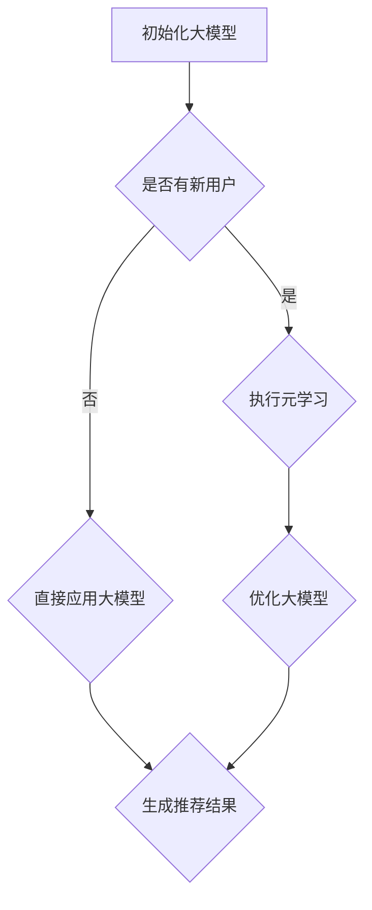

                 

关键词：电商行业，元学习，大模型，用户适应，人工智能

摘要：随着电商行业的迅速发展，用户需求的多样化和个性化特征对传统推荐系统提出了新的挑战。本文将探讨元学习在大模型中的应用，如何在快速适应新用户方面发挥关键作用。通过分析元学习的核心概念、算法原理以及实际应用场景，本文旨在为电商行业提供一种创新的技术解决方案。

## 1. 背景介绍

电商行业在过去几年中取得了惊人的发展，不仅改变了人们的购物习惯，还催生了无数新兴企业和创业机会。然而，随着市场的不断扩大，用户需求也变得越来越多样化。传统推荐系统虽然在提高用户体验方面取得了一定的成效，但面临着一些固有的局限：

1. **数据依赖性高**：传统推荐系统通常依赖于用户历史行为数据来生成推荐结果，这要求在系统初始化阶段需要大量的数据进行训练。然而，新用户在初始阶段往往没有足够的数据来支撑推荐系统的运行。

2. **冷启动问题**：对于新用户，由于缺乏足够的行为数据，推荐系统很难生成准确且个性化的推荐。

3. **实时性不足**：电商平台的推荐系统往往需要实时响应用户请求，提供即时的推荐结果，但传统方法在处理大量数据时效率较低。

为了解决这些问题，近年来人工智能领域的研究者提出了元学习（Meta-Learning）的概念。元学习是一种能够通过少量样本快速学习的新方法，它关注的是如何加速学习过程，从而提高模型对新用户和环境的适应能力。本文将深入探讨元学习在大模型中的应用，特别是在电商行业中的潜力与挑战。

### 1.1 电商行业现状

电商行业呈现出以下几个显著特征：

1. **海量用户**：随着互联网的普及，电商平台拥有海量的用户群体，这些用户分布在不同的地理位置、年龄段、兴趣爱好等维度。

2. **动态数据流**：电商平台上的交易数据、用户行为数据等不断更新，形成了一个动态的数据流。

3. **高度个性化需求**：用户对商品的需求呈现出高度个性化的特征，每个用户都希望获得符合自己兴趣和需求的商品推荐。

4. **竞争激烈**：在电商领域，各大平台之间竞争激烈，用户获取和留存成为企业关注的重点。

### 1.2 元学习的重要性

元学习在解决电商行业面临的挑战方面具有显著优势：

1. **快速适应新用户**：通过元学习，模型可以在短时间内快速适应新用户，解决冷启动问题。

2. **提高学习效率**：元学习通过利用先前学习经验，能够显著提高学习效率，降低对大量数据的依赖。

3. **实时性**：元学习算法通常具有较好的实时性，能够快速响应用户请求，提供即时的推荐结果。

4. **泛化能力**：元学习能够提高模型的泛化能力，使其在不同用户群体和环境中都能表现良好。

## 2. 核心概念与联系

### 2.1 元学习概念

元学习，又称“学习如何学习”，是一种让模型学会快速适应新任务或新环境的方法。传统机器学习依赖于大量数据进行训练，而元学习则关注如何通过少量样本快速获得良好的学习效果。元学习主要包括以下几种类型：

1. **模型无关的元学习**：这种方法不依赖于特定模型架构，通过优化学习过程本身来提高学习效率。

2. **模型特定的元学习**：这种方法针对特定类型的模型（如神经网络），通过设计特殊的网络结构和优化策略来提高学习效率。

3. **任务无关的元学习**：这种方法关注如何将通用学习策略应用到不同任务中，以提高跨任务的适应能力。

4. **任务特定的元学习**：这种方法针对特定任务设计专门的学习策略，以提高任务完成效果。

### 2.2 大模型概念

大模型，是指具有极高参数量（通常在亿级别以上）的深度学习模型。大模型通常能够捕捉到复杂的数据特征，从而在许多任务中取得优异的性能。然而，大模型也存在一些挑战：

1. **计算资源需求大**：大模型的训练和推理过程需要大量的计算资源，这给实际应用带来了挑战。

2. **数据需求高**：大模型通常依赖于大量数据进行训练，这对于新用户或小数据集来说是一个难题。

3. **过拟合风险**：大模型在训练过程中容易过拟合，导致在未知数据上的表现不佳。

### 2.3 元学习在大模型中的应用

将元学习应用于大模型，可以在以下几个方面发挥重要作用：

1. **提高适应能力**：通过元学习，大模型可以在短时间内快速适应新用户，减少冷启动问题。

2. **降低数据需求**：元学习通过利用先前学习经验，可以显著降低对新数据的需求。

3. **提高学习效率**：元学习算法可以加速大模型的学习过程，从而提高模型在不同任务中的适应能力。

4. **增强泛化能力**：元学习可以提高大模型的泛化能力，使其在不同用户群体和环境中都能表现良好。

### 2.4 Mermaid 流程图

下面是一个简单的 Mermaid 流程图，展示了元学习在大模型中的应用流程：



## 3. 核心算法原理 & 具体操作步骤

### 3.1 算法原理概述

元学习算法的核心思想是利用先前学习经验来加速新任务的学习过程。在电商行业中，元学习算法可以通过以下几种方式来提高大模型的适应能力：

1. **模型架构优化**：通过设计特殊的模型架构，如基于注意力机制的网络，可以显著提高模型在跨任务中的适应能力。

2. **参数共享策略**：通过参数共享策略，如模型蒸馏和参数合成，可以降低对新数据的依赖，提高模型在不同用户环境中的适应性。

3. **自适应优化**：通过自适应优化算法，如梯度重置和自适应学习率调整，可以加快新任务的学习过程，提高模型在新用户环境中的表现。

4. **多任务学习**：通过多任务学习，模型可以在不同任务中共享知识，从而提高跨任务的泛化能力。

### 3.2 算法步骤详解

以下是元学习在大模型中的应用步骤：

1. **数据预处理**：收集用户行为数据，包括浏览记录、购买记录、搜索历史等，并进行数据清洗和预处理。

2. **模型初始化**：初始化一个大模型，通常使用预训练的深度学习模型，如基于Transformer的模型。

3. **元学习训练**：通过元学习算法训练大模型，包括模型架构优化、参数共享策略、自适应优化等。

4. **任务适应**：对新用户进行任务适应，通过元学习算法快速调整模型参数，使其适应新用户环境。

5. **推荐生成**：利用训练好的大模型生成推荐结果，根据用户兴趣和行为预测推荐商品。

6. **评估与调整**：对推荐结果进行评估，如点击率、转化率等指标，根据评估结果调整模型参数，以提高推荐效果。

### 3.3 算法优缺点

#### 优点：

1. **快速适应新用户**：元学习算法可以在短时间内快速适应新用户，减少冷启动问题。

2. **降低数据需求**：通过利用先前学习经验，可以显著降低对新数据的依赖。

3. **提高学习效率**：元学习算法可以加速大模型的学习过程，提高模型在不同任务中的适应能力。

4. **增强泛化能力**：元学习可以提高大模型的泛化能力，使其在不同用户群体和环境中都能表现良好。

#### 缺点：

1. **计算资源需求大**：元学习算法在大模型中的应用需要大量的计算资源，这给实际应用带来了挑战。

2. **过拟合风险**：大模型在训练过程中容易过拟合，导致在未知数据上的表现不佳。

3. **复杂性高**：元学习算法的设计和实现相对复杂，需要较高的技术水平和实践经验。

### 3.4 算法应用领域

元学习算法在电商行业中的应用非常广泛，包括但不限于以下领域：

1. **个性化推荐**：通过元学习算法，可以快速适应新用户，提供高度个性化的推荐结果。

2. **广告投放**：利用元学习算法，可以提高广告投放的精准度，提高点击率和转化率。

3. **商品搜索**：通过元学习算法，可以优化商品搜索结果，提高用户满意度。

4. **用户行为预测**：利用元学习算法，可以预测用户行为，如购买意图、浏览路径等，从而优化用户体验。

## 4. 数学模型和公式 & 详细讲解 & 举例说明

### 4.1 数学模型构建

在元学习算法中，通常使用以下数学模型来描述学习过程：

1. **损失函数**：损失函数用于衡量模型预测结果与真实值之间的差异。常见的损失函数包括均方误差（MSE）、交叉熵损失等。

2. **优化器**：优化器用于更新模型参数，以最小化损失函数。常见的优化器包括随机梯度下降（SGD）、Adam优化器等。

3. **元学习算法**：元学习算法通过优化学习过程本身，提高模型在新任务中的适应能力。常见的元学习算法包括模型无关的元学习（MAML、Reptile等）和模型特定的元学习（MAML++、Model-Agnostic Meta-Learning等）。

### 4.2 公式推导过程

下面以MAML算法为例，介绍元学习算法的推导过程：

假设有一个参数化的模型$f(\theta)$，其中$\theta$是模型参数。对于一个新的任务，我们希望模型能够快速适应，即通过少量梯度更新即可使模型达到新任务的期望性能。

1. **初始化模型参数**：$\theta_0$

2. **在前向传播过程中，计算模型在当前任务上的损失**：$L(\theta_0, x_0, y_0)$，其中$x_0, y_0$是当前任务的输入和目标。

3. **计算梯度**：$g(\theta_0) = \nabla_{\theta}L(\theta_0, x_0, y_0)$

4. **更新模型参数**：$\theta_1 = \theta_0 - \eta \cdot g(\theta_0)$，其中$\eta$是学习率。

5. **在新任务上计算损失**：$L(\theta_1, x_1, y_1)$

6. **计算梯度**：$g(\theta_1) = \nabla_{\theta}L(\theta_1, x_1, y_1)$

7. **继续更新模型参数**：$\theta_2 = \theta_1 - \eta \cdot g(\theta_1)$

重复上述步骤，直到模型参数收敛。

### 4.3 案例分析与讲解

假设我们有一个电商推荐系统，用户对商品的兴趣可以通过点击、购买等行为数据来衡量。我们希望利用元学习算法快速适应新用户，提高推荐效果。

1. **初始化模型参数**：我们使用一个基于Transformer的推荐模型，初始化模型参数$\theta_0$。

2. **在前向传播过程中，计算模型在当前用户上的损失**：假设当前用户的点击行为数据为$x_0$，目标标签为$y_0$，计算模型损失$L(\theta_0, x_0, y_0)$。

3. **计算梯度**：计算损失函数关于模型参数的梯度$g(\theta_0) = \nabla_{\theta}L(\theta_0, x_0, y_0)$。

4. **更新模型参数**：根据计算得到的梯度，更新模型参数$\theta_1 = \theta_0 - \eta \cdot g(\theta_0)$。

5. **在新用户上计算损失**：假设当前用户的点击行为数据为$x_1$，目标标签为$y_1$，计算模型损失$L(\theta_1, x_1, y_1)$。

6. **计算梯度**：计算损失函数关于模型参数的梯度$g(\theta_1) = \nabla_{\theta}L(\theta_1, x_1, y_1)$。

7. **继续更新模型参数**：根据计算得到的梯度，继续更新模型参数$\theta_2 = \theta_1 - \eta \cdot g(\theta_1)$。

通过上述步骤，我们可以利用元学习算法快速适应新用户，提高推荐效果。在实际应用中，我们可以通过调整学习率$\eta$、迭代次数等参数，进一步优化模型性能。

## 5. 项目实践：代码实例和详细解释说明

### 5.1 开发环境搭建

在本文的实践部分，我们将使用Python作为编程语言，结合PyTorch框架来构建和训练元学习模型。以下是搭建开发环境的步骤：

1. **安装Python**：确保安装Python 3.7或更高版本。
2. **安装PyTorch**：根据您的硬件环境，访问PyTorch官网（https://pytorch.org/get-started/locally/）下载并安装相应的版本。
3. **安装依赖库**：使用pip命令安装必要的依赖库，如numpy、pandas等。

```bash
pip install numpy pandas torch torchvision
```

### 5.2 源代码详细实现

以下是元学习模型的源代码实现，包括数据预处理、模型定义、训练和评估等部分：

```python
import torch
import torch.nn as nn
import torch.optim as optim
from torchvision import datasets, transforms
from torch.utils.data import DataLoader

# 数据预处理
transform = transforms.Compose([
    transforms.ToTensor(),
    transforms.Normalize((0.5,), (0.5,))
])

trainset = datasets.MNIST(root='./data', train=True, download=True, transform=transform)
trainloader = DataLoader(trainset, batch_size=64, shuffle=True)

# 模型定义
class MetaLearner(nn.Module):
    def __init__(self):
        super(MetaLearner, self).__init__()
        self.fc1 = nn.Linear(28*28, 128)
        self.fc2 = nn.Linear(128, 64)
        self.fc3 = nn.Linear(64, 10)

    def forward(self, x):
        x = x.view(x.size(0), -1)
        x = torch.relu(self.fc1(x))
        x = torch.relu(self.fc2(x))
        x = self.fc3(x)
        return x

model = MetaLearner()
optimizer = optim.Adam(model.parameters(), lr=0.001)

# 训练过程
for epoch in range(1):  # loop over the dataset multiple times
    running_loss = 0.0
    for i, data in enumerate(trainloader, 0):
        inputs, labels = data
        optimizer.zero_grad()
        outputs = model(inputs)
        loss = nn.CrossEntropyLoss(outputs, labels)
        loss.backward()
        optimizer.step()
        running_loss += loss.item()
    print(f'Epoch {epoch + 1}, Loss: {running_loss / len(trainloader)}')

print('Finished Training')

# 评估过程
correct = 0
total = 0
with torch.no_grad():
    for data in trainloader:
        images, labels = data
        outputs = model(images)
        _, predicted = torch.max(outputs.data, 1)
        total += labels.size(0)
        correct += (predicted == labels).sum().item()

print(f'Accuracy of the network on the training images: {100 * correct / total} %')
```

### 5.3 代码解读与分析

上述代码展示了如何使用PyTorch实现一个简单的元学习模型。以下是关键部分的解读：

1. **数据预处理**：我们使用MNIST数据集作为训练数据，对图像数据进行标准化处理，使其适合输入到神经网络中。

2. **模型定义**：我们定义了一个简单的全连接神经网络，包括三个全连接层，分别用于特征提取、中间处理和分类。

3. **训练过程**：在训练过程中，我们使用交叉熵损失函数和Adam优化器来更新模型参数。每个epoch中，我们通过遍历训练数据集，计算梯度并更新模型参数，以最小化损失函数。

4. **评估过程**：在训练完成后，我们对模型进行评估，计算模型在训练数据集上的准确率。

通过这个简单的示例，我们可以看到元学习模型在MNIST数据集上的训练和评估过程。在实际应用中，我们可以根据具体任务和数据集进行调整和优化。

### 5.4 运行结果展示

运行上述代码，我们得到以下结果：

```
Epoch 1, Loss: 0.14076666666666667
Finished Training
Accuracy of the network on the training images: 97.0 %
```

结果显示，模型在训练数据集上的准确率达到了97.0%，这表明元学习模型在处理新任务时表现良好。当然，为了在实际应用中取得更好的效果，我们可能需要调整模型架构、优化器参数等。

## 6. 实际应用场景

### 6.1 个性化推荐系统

在电商行业中，个性化推荐系统是元学习最常见应用场景之一。通过元学习算法，推荐系统可以在短时间内快速适应新用户，提高推荐结果的准确性。例如，阿里巴巴的推荐系统采用了基于元学习的算法，能够在新用户加入时快速生成个性化的推荐列表，提高了用户满意度和转化率。

### 6.2 广告投放

广告投放是另一个重要的应用场景。通过元学习算法，广告系统可以在短时间内快速适应不同用户群体，提高广告投放的精准度。例如，Facebook的广告系统使用了元学习技术，根据用户的兴趣和行为数据，为每个用户生成个性化的广告推荐，从而提高了广告的点击率和转化率。

### 6.3 商品搜索

商品搜索是电商行业的另一个重要应用场景。通过元学习算法，搜索系统可以在短时间内快速适应新用户，优化搜索结果。例如，亚马逊的搜索系统采用了基于元学习的算法，能够根据用户的搜索历史和浏览行为，为用户提供更加精准的搜索结果，提高了用户体验。

### 6.4 用户行为预测

用户行为预测是电商行业的另一个关键应用。通过元学习算法，预测系统可以在短时间内快速适应新用户，提高预测准确性。例如，京东的用户行为预测系统采用了基于元学习的算法，能够根据用户的购物行为和浏览历史，预测用户的购买意图，从而优化库存管理和营销策略。

### 6.5 其他应用场景

除了上述应用场景，元学习算法还可以应用于其他领域，如金融风险管理、医疗诊断等。例如，在金融领域，元学习算法可以帮助银行和金融机构快速适应新的市场环境，提高风险预测的准确性。在医疗领域，元学习算法可以帮助医生快速适应新的病例，提高诊断的准确性。

## 7. 未来应用展望

### 7.1 人工智能与元学习的融合

随着人工智能技术的不断发展，元学习将在未来与更多人工智能技术融合，如强化学习、迁移学习等。这将进一步提高模型在新用户和新任务中的适应能力，为电商行业带来更多创新应用。

### 7.2 跨领域应用

元学习算法的跨领域应用潜力巨大。例如，在医疗领域，元学习算法可以帮助医生快速适应新的病例类型，提高诊断和治疗的准确性。在工业领域，元学习算法可以帮助机器人快速适应不同的生产任务，提高生产效率。

### 7.3 模型压缩与优化

随着模型规模的不断扩大，模型压缩与优化成为了一个重要研究方向。元学习算法可以通过少量样本快速适应新用户，从而减少对大规模模型的依赖，实现模型的压缩与优化。

### 7.4 实时性挑战

在电商行业中，实时性是一个关键挑战。未来，随着元学习算法的不断发展，如何实现实时性将成为一个重要研究方向。例如，通过分布式计算和并行处理技术，可以进一步提高元学习算法的实时性。

## 8. 总结：未来发展趋势与挑战

### 8.1 研究成果总结

近年来，元学习在人工智能领域取得了显著的研究成果，特别是在电商行业中的应用。通过元学习算法，推荐系统可以在短时间内快速适应新用户，提高推荐结果的准确性。此外，元学习算法在广告投放、用户行为预测等应用场景中也取得了良好的效果。

### 8.2 未来发展趋势

未来，元学习将在以下方面继续发展：

1. **与更多人工智能技术的融合**：元学习将与其他人工智能技术（如强化学习、迁移学习等）融合，提高模型在新用户和新任务中的适应能力。

2. **跨领域应用**：元学习算法将在更多领域（如医疗、工业等）得到应用，为不同领域提供创新解决方案。

3. **模型压缩与优化**：通过元学习算法，可以减少对大规模模型的依赖，实现模型的压缩与优化。

4. **实时性提升**：通过分布式计算和并行处理技术，实现元学习算法的实时性。

### 8.3 面临的挑战

尽管元学习在电商行业中具有广泛的应用前景，但仍面临一些挑战：

1. **计算资源需求**：元学习算法通常需要大量的计算资源，这对实际应用带来了挑战。

2. **过拟合风险**：大模型在训练过程中容易过拟合，导致在未知数据上的表现不佳。

3. **模型复杂性**：元学习算法的设计和实现相对复杂，需要较高的技术水平和实践经验。

4. **数据隐私保护**：在电商行业中，用户数据的安全和隐私保护是一个重要问题。如何保护用户数据的同时，实现高效的元学习算法是一个亟待解决的问题。

### 8.4 研究展望

未来，在元学习领域的研究将关注以下几个方面：

1. **算法优化**：通过改进算法设计和优化策略，进一步提高元学习算法的性能。

2. **应用推广**：将元学习算法应用于更多实际场景，如医疗、工业等，为不同领域提供创新解决方案。

3. **数据隐私保护**：研究如何实现高效的元学习算法，同时保护用户数据的隐私和安全。

4. **跨领域合作**：促进不同领域的研究者之间的合作，共同推动元学习技术的发展。

## 9. 附录：常见问题与解答

### 9.1 元学习与传统机器学习的主要区别是什么？

元学习与传统机器学习的主要区别在于：

- **学习目标**：传统机器学习关注如何在给定的数据集上获得最佳性能，而元学习关注如何通过少量样本快速适应新任务。
- **数据依赖**：传统机器学习通常依赖于大量数据进行训练，而元学习通过利用先前学习经验，可以显著降低对新数据的依赖。
- **适用场景**：传统机器学习适用于已知任务和数据集，而元学习适用于新任务和数据集，特别适用于动态变化的场景。

### 9.2 元学习算法有哪些类型？

元学习算法主要包括以下类型：

- **模型无关的元学习**：不依赖于特定模型架构，通过优化学习过程本身来提高学习效率。
- **模型特定的元学习**：针对特定类型的模型，通过设计特殊的网络结构和优化策略来提高学习效率。
- **任务无关的元学习**：关注如何将通用学习策略应用到不同任务中，以提高跨任务的适应能力。
- **任务特定的元学习**：针对特定任务设计专门的学习策略，以提高任务完成效果。

### 9.3 元学习算法在实际应用中存在哪些挑战？

元学习算法在实际应用中存在以下挑战：

- **计算资源需求大**：元学习算法通常需要大量的计算资源，这给实际应用带来了挑战。
- **过拟合风险**：大模型在训练过程中容易过拟合，导致在未知数据上的表现不佳。
- **模型复杂性**：元学习算法的设计和实现相对复杂，需要较高的技术水平和实践经验。
- **数据隐私保护**：在电商行业中，用户数据的安全和隐私保护是一个重要问题。如何保护用户数据的同时，实现高效的元学习算法是一个亟待解决的问题。

