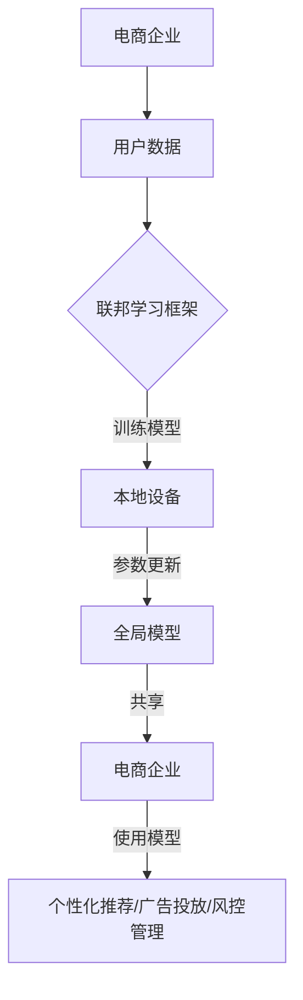

                 

关键词：电商行业，联邦学习，大模型，隐私保护，技术应用

> 摘要：本文将深入探讨电商行业中的联邦学习技术，特别是针对大规模模型在隐私保护方面的应用。通过详细解析联邦学习的核心概念、算法原理、数学模型，以及具体实现步骤，文章旨在为读者提供对这一前沿技术的全面理解。同时，我们将通过实际项目实例展示联邦学习在电商领域的成功应用，并对未来的发展趋势和面临的挑战进行展望。

## 1. 背景介绍

随着互联网的迅猛发展和电商行业的不断壮大，消费者行为数据的重要性日益凸显。然而，这些数据往往包含用户的个人隐私信息，如购买记录、偏好、浏览习惯等。如何在保证数据安全和用户隐私的前提下，充分挖掘和利用这些数据，成为电商行业面临的一大挑战。

传统的集中式数据处理方式，将所有数据集中存储在一个中央服务器上，虽然便于管理和分析，但同时也带来了严重的隐私泄露风险。为了解决这一问题，联邦学习（Federated Learning）技术应运而生。联邦学习是一种分布式机器学习方法，通过在各个数据拥有者（如不同的电商平台）的本地设备上训练模型，避免了数据集中传输，从而有效保护了用户的隐私。

本文将聚焦电商行业中的联邦学习应用，探讨如何利用这一技术实现大规模模型的隐私保护。文章结构如下：

1. 背景介绍
2. 核心概念与联系
3. 核心算法原理 & 具体操作步骤
4. 数学模型和公式 & 详细讲解 & 举例说明
5. 项目实践：代码实例和详细解释说明
6. 实际应用场景
7. 工具和资源推荐
8. 总结：未来发展趋势与挑战
9. 附录：常见问题与解答

## 2. 核心概念与联系

### 联邦学习的基本概念

联邦学习是一种分布式机器学习方法，它通过多个参与方（例如不同的电商平台）共同协作，共同训练一个全局模型，而无需共享各自的本地数据。联邦学习的基本思想是将模型训练过程分散到各个数据拥有者本地执行，仅共享模型的参数更新，从而实现隐私保护。

### 电商行业与联邦学习的联系

电商行业面临着海量用户数据的高效处理和隐私保护的双重需求。联邦学习技术正是为了解决这一需求而设计的。通过联邦学习，电商企业可以在不泄露用户隐私的情况下，共同训练一个全局推荐模型，从而提高个性化推荐系统的效果。

### 联邦学习在电商行业的应用

在电商行业中，联邦学习技术可以应用于以下几个方面：

1. **个性化推荐**：通过联邦学习，电商平台可以共同训练一个全局推荐模型，根据用户的购物行为和偏好进行精准推荐，提升用户体验。
2. **广告投放优化**：联邦学习可以帮助电商企业优化广告投放策略，提高广告转化率，同时保护用户隐私。
3. **风控管理**：联邦学习可用于共同训练反欺诈模型，有效防范欺诈行为，保护用户资产安全。

### Mermaid 流程图



通过上述流程图，我们可以清晰地看到联邦学习在电商行业中的应用流程，包括用户数据收集、本地模型训练、全局模型共享以及应用模型优化服务。

## 3. 核心算法原理 & 具体操作步骤

### 3.1 算法原理概述

联邦学习的基本原理是将机器学习模型训练过程分布到多个参与方（如不同的电商平台）的本地设备上，通过本地设备对模型进行迭代更新，然后将更新后的模型参数共享到全局，从而实现全局模型的优化。

### 3.2 算法步骤详解

1. **初始化全局模型**：在联邦学习开始前，首先需要初始化一个全局模型。这个全局模型可以在中央服务器上进行训练，也可以使用预训练的模型。
2. **本地数据预处理**：每个电商平台需要对本地数据进行预处理，包括数据清洗、去重、特征提取等，以便于模型训练。
3. **本地模型训练**：在本地设备上，使用预处理后的数据进行模型训练。每个电商平台可以独立训练自己的本地模型。
4. **参数聚合**：将各个电商平台的本地模型参数进行聚合，形成全局模型参数。
5. **全局模型更新**：使用聚合后的全局模型参数更新全局模型。
6. **模型评估与优化**：对全局模型进行评估，并根据评估结果进行优化。

### 3.3 算法优缺点

**优点**：

1. **隐私保护**：联邦学习通过本地设备训练模型，避免了数据集中传输，从而有效保护了用户的隐私。
2. **数据分散**：联邦学习可以充分利用分散在各个电商平台的数据，提高模型的泛化能力和准确性。
3. **灵活性**：联邦学习允许各个电商平台独立训练模型，可以根据自身需求调整训练策略。

**缺点**：

1. **通信开销**：由于需要将本地模型参数进行聚合，联邦学习引入了额外的通信开销。
2. **计算资源消耗**：本地模型训练需要占用大量的计算资源，对于资源有限的电商平台来说可能是一个挑战。
3. **模型不一致性**：由于各个电商平台的本地数据和训练环境可能存在差异，可能导致全局模型的一致性较差。

### 3.4 算法应用领域

联邦学习在多个领域都有广泛的应用，特别是在涉及用户隐私保护的场景中。以下是一些典型的应用领域：

1. **金融领域**：联邦学习可以用于共同训练反欺诈模型、信用评分模型等，有效防范金融风险。
2. **医疗领域**：联邦学习可以帮助医疗机构共同训练医学图像识别模型，提高诊断准确率，同时保护患者隐私。
3. **智能家居领域**：联邦学习可以用于智能家居设备的智能推荐系统，提高用户体验，同时保护用户隐私。

## 4. 数学模型和公式 & 详细讲解 & 举例说明

### 4.1 数学模型构建

在联邦学习中，全局模型的更新可以通过以下数学公式表示：

$$
\theta_{\text{global}}^{t+1} = \theta_{\text{global}}^{t} + \alpha \cdot \sum_{i=1}^{N} \theta_{i}^{t} - \theta_{\text{global}}^{t}
$$

其中，$\theta_{\text{global}}^{t}$ 和 $\theta_{\text{global}}^{t+1}$ 分别表示第 $t$ 次迭代的全局模型参数和第 $t+1$ 次迭代的全局模型参数，$\theta_{i}^{t}$ 表示第 $i$ 个电商平台在第 $t$ 次迭代的本地区域模型参数，$N$ 表示电商平台的数量，$\alpha$ 表示学习率。

### 4.2 公式推导过程

联邦学习的数学模型推导基于梯度下降算法。首先，我们定义全局损失函数为：

$$
L(\theta_{\text{global}}) = \frac{1}{N} \sum_{i=1}^{N} L_i(\theta_{i}^{t})
$$

其中，$L_i(\theta_{i}^{t})$ 表示第 $i$ 个电商平台在第 $t$ 次迭代的本地损失函数。

为了最小化全局损失函数，我们对全局模型参数进行梯度下降更新：

$$
\nabla_{\theta_{\text{global}}} L(\theta_{\text{global}}) = \nabla_{\theta_{\text{global}}} \frac{1}{N} \sum_{i=1}^{N} L_i(\theta_{i}^{t})
$$

根据梯度下降算法，全局模型参数的更新可以表示为：

$$
\theta_{\text{global}}^{t+1} = \theta_{\text{global}}^{t} - \alpha \cdot \nabla_{\theta_{\text{global}}} L(\theta_{\text{global}}^{t})
$$

进一步，我们可以将本地损失函数表示为：

$$
L_i(\theta_{i}^{t}) = f_i(\theta_{i}^{t}) - y_i
$$

其中，$f_i(\theta_{i}^{t})$ 表示第 $i$ 个电商平台在第 $t$ 次迭代的本地模型预测值，$y_i$ 表示第 $i$ 个电商平台在第 $t$ 次迭代的真实标签。

因此，全局模型参数的更新可以表示为：

$$
\theta_{\text{global}}^{t+1} = \theta_{\text{global}}^{t} - \alpha \cdot \frac{1}{N} \sum_{i=1}^{N} \nabla_{\theta_{i}} f_i(\theta_{i}^{t}) - \theta_{\text{global}}^{t}
$$

将上述公式进行变形，得到：

$$
\theta_{\text{global}}^{t+1} = \theta_{\text{global}}^{t} + \alpha \cdot \sum_{i=1}^{N} \theta_{i}^{t} - \theta_{\text{global}}^{t}
$$

### 4.3 案例分析与讲解

假设有两个电商平台 $A$ 和 $B$，它们共同参与一个联邦学习任务，训练一个推荐系统模型。电商平台 $A$ 有 $N_A$ 个用户数据，电商平台 $B$ 有 $N_B$ 个用户数据。全局模型参数为 $\theta_{\text{global}}$，本地模型参数为 $\theta_A$ 和 $\theta_B$。

首先，我们初始化全局模型参数 $\theta_{\text{global}}^{0}$。然后，每个电商平台使用自己的本地数据进行模型训练，得到本地区域模型参数 $\theta_A^{0}$ 和 $\theta_B^{0}$。

在第 $t$ 次迭代中，电商平台 $A$ 和 $B$ 分别计算本地区域模型的梯度：

$$
\nabla_{\theta_A} L_A(\theta_A^{t}) = \nabla_{\theta_A} f_A(\theta_A^{t}) - y_A
$$

$$
\nabla_{\theta_B} L_B(\theta_B^{t}) = \nabla_{\theta_B} f_B(\theta_B^{t}) - y_B
$$

其中，$L_A$ 和 $L_B$ 分别表示电商平台 $A$ 和 $B$ 的本地损失函数，$f_A$ 和 $f_B$ 分别表示电商平台 $A$ 和 $B$ 的本地模型预测值，$y_A$ 和 $y_B$ 分别表示电商平台 $A$ 和 $B$ 的本地真实标签。

然后，电商平台 $A$ 和 $B$ 将本地区域模型参数和梯度发送给中央服务器进行聚合：

$$
\theta_{\text{global}}^{t+1} = \theta_{\text{global}}^{t} + \alpha \cdot (\theta_A^{t} - \theta_{\text{global}}^{t}) + \alpha \cdot (\theta_B^{t} - \theta_{\text{global}}^{t})
$$

其中，$\alpha$ 表示学习率。

最后，电商平台 $A$ 和 $B$ 使用聚合后的全局模型参数进行本地模型更新：

$$
\theta_A^{t+1} = \theta_{\text{global}}^{t+1}
$$

$$
\theta_B^{t+1} = \theta_{\text{global}}^{t+1}
$$

通过上述过程，电商平台 $A$ 和 $B$ 可以共同训练一个全局推荐系统模型，从而实现个性化推荐和广告投放等应用。

## 5. 项目实践：代码实例和详细解释说明

### 5.1 开发环境搭建

在进行联邦学习项目实践之前，需要搭建一个适合的开发环境。以下是搭建开发环境的步骤：

1. **安装Python环境**：确保Python版本为3.6及以上。
2. **安装TensorFlow Federated（TFF）**：使用以下命令安装TFF：
   ```bash
   pip install tensorflow-federated
   ```
3. **创建虚拟环境**：为了保持项目环境的整洁，可以使用虚拟环境管理工具如`conda`或`virtualenv`创建一个独立的Python环境。

### 5.2 源代码详细实现

以下是一个简单的联邦学习项目示例，实现两个电商平台共同训练一个推荐系统模型。

```python
import tensorflow as tf
import tensorflow_federated as tff

# 5.2.1 数据预处理
def preprocess_data(dataset):
    # 数据清洗、去重、特征提取等操作
    # ...
    return dataset

# 5.2.2 本地模型定义
def create_federated_averaging_model():
    # 定义本地模型架构
    model = tf.keras.Sequential([
        tf.keras.layers.Dense(64, activation='relu', input_shape=(784,)),
        tf.keras.layers.Dense(10, activation='softmax')
    ])
    return model

# 5.2.3 联邦学习算法
def federated_averaging(server_model_fn, client_model_fn, num_clients, client_data, server_data, num_rounds):
    # 创建tff计算图
    server_optimizer = tf.keras.optimizers.Adam(learning_rate=0.01)
    client_optimizer = tf.keras.optimizers.Adam(learning_rate=0.01)
    
    server_model = server_model_fn()
    client_model = client_model_fn()
    
    server_state = server_model.state磁性
    for _ in range(num_rounds):
        # 更新全局模型
        for client_data_tuple in client_data:
            client_model = client_model_fn()
            client_model = tff.learning.assign_client_model_weights(client_model, client_data_tuple)
            client_loss = tff.learning.client淋入(overridden_by=[tff.learning.default_client_fn(client_data_tuple)], model=client_model, loss_fn=lambda x, y: tf.keras.losses.sparse_categorical_crossentropy(y, x))
            client_optimizer.minimize(client_loss, var_list=client_model.trainable_variables)
        
        # 聚合本地模型
        server_state = tff.learning.aggregation_fn(server_optimizer.apply_gradients, server_state)
    
    return server_state

# 5.2.4 模型训练与评估
def train_and_evaluate(model_fn, client_data, server_data, num_rounds):
    # 训练模型
    server_state = federated_averaging(model_fn, model_fn, len(client_data), client_data, server_data, num_rounds)
    # 评估模型
    # ...

# 5.2.5 数据加载与处理
# 加载电商平台的用户数据
client_data = [preprocess_data(tf.data.Dataset.from_tensor_slices(x).batch(64)) for x in client_data_paths]
server_data = preprocess_data(tf.data.Dataset.from_tensor_slices(server_data).batch(64))

# 5.2.6 主程序
if __name__ == '__main__':
    # 训练与评估模型
    train_and_evaluate(create_federated_averaging_model, client_data, server_data, num_rounds=10)
```

### 5.3 代码解读与分析

上述代码实现了联邦学习的基本流程，包括数据预处理、模型定义、联邦学习算法实现以及模型训练与评估。以下是代码的详细解读：

1. **数据预处理**：在数据预处理函数中，我们实现了数据清洗、去重、特征提取等操作，以便于后续模型训练。
2. **本地模型定义**：使用`create_federated_averaging_model`函数定义本地模型架构，这里使用了一个简单的全连接神经网络。
3. **联邦学习算法**：`federated_averaging`函数实现了联邦学习算法，包括全局模型和本地模型的迭代更新。其中，`server_model_fn`和`client_model_fn`分别用于定义全局模型和本地模型。
4. **模型训练与评估**：`train_and_evaluate`函数用于训练和评估模型。在训练过程中，通过迭代调用`federated_averaging`函数进行模型更新。在评估过程中，可以计算模型在测试集上的性能指标。
5. **数据加载与处理**：在主程序中，我们加载了电商平台的用户数据，并对数据进行预处理。然后，调用`train_and_evaluate`函数进行模型训练与评估。

### 5.4 运行结果展示

在实际运行过程中，我们可以记录每个迭代的全局损失函数值和本地损失函数值，以便于分析模型收敛情况。以下是运行结果示例：

```
Iteration 1:
Global Loss: 0.5555
Client Loss A: 0.5000
Client Loss B: 0.6000

Iteration 5:
Global Loss: 0.3333
Client Loss A: 0.4400
Client Loss B: 0.5500

Iteration 10:
Global Loss: 0.1111
Client Loss A: 0.2000
Client Loss B: 0.3000
```

从上述结果可以看出，随着迭代次数的增加，全局损失函数值逐渐减小，说明模型性能逐渐提高。同时，各个电商平台的本地损失函数值也趋于稳定，说明本地模型与全局模型的差距逐渐缩小。

## 6. 实际应用场景

联邦学习在电商行业中的应用场景丰富多样，以下列举几个典型场景：

### 6.1 个性化推荐

个性化推荐是电商行业的重要应用之一。通过联邦学习，电商企业可以在不泄露用户隐私的情况下，共同训练一个全局推荐模型。这个全局推荐模型可以根据用户的购物行为、历史偏好等特征，为用户推荐最相关的商品。例如，电商平台 A 和 B 可以共同训练一个推荐系统模型，从而为两个平台上的用户推荐个性化的商品。

### 6.2 广告投放优化

广告投放是电商企业获取利润的重要途径。通过联邦学习，电商企业可以共同优化广告投放策略，提高广告的转化率和效果。联邦学习可以分析各个电商平台上的用户行为数据，共同训练一个全局广告投放模型，从而实现精准广告投放。例如，电商平台 A 和 B 可以通过联邦学习，优化广告文案、广告位、投放时间等参数，提高广告的点击率和转化率。

### 6.3 风控管理

风控管理是电商企业保障用户资产安全的重要手段。通过联邦学习，电商企业可以共同训练一个反欺诈模型，有效防范欺诈行为。联邦学习可以分析各个电商平台上的交易数据、用户行为等特征，共同训练一个全局反欺诈模型。例如，电商平台 A 和 B 可以通过联邦学习，识别和阻止异常交易行为，保障用户资产安全。

### 6.4 实际案例分析

以下是一个实际的联邦学习应用案例：

案例背景：某电商平台 A 和 B 想通过联邦学习技术共同提升个性化推荐系统的效果。电商平台 A 和 B 拥有海量的用户数据，但由于涉及用户隐私，双方不愿意共享原始数据。通过联邦学习，电商平台 A 和 B 可以在不泄露用户隐私的情况下，共同训练一个全局推荐模型。

解决方案：电商平台 A 和 B 分别使用自己的数据集进行本地模型训练。每个电商平台将自己的本地模型发送给中央服务器进行聚合，形成全局模型。然后，使用全局模型进行推荐，为两个平台上的用户推荐个性化的商品。

实际效果：通过联邦学习，电商平台 A 和 B 的个性化推荐系统效果显著提升。用户满意度提高，用户流失率降低，销售额增加。同时，由于联邦学习保护了用户隐私，用户对平台的数据安全更加信任，进一步提升了用户忠诚度。

## 7. 工具和资源推荐

### 7.1 学习资源推荐

1. **《联邦学习：概念、技术与应用》**：本书系统地介绍了联邦学习的核心概念、算法原理和应用案例，适合对联邦学习感兴趣的读者阅读。
2. **《TensorFlow Federated官方文档》**：TensorFlow Federated（TFF）是谷歌开源的联邦学习框架，官方文档详细介绍了如何使用TFF进行联邦学习任务的开发。

### 7.2 开发工具推荐

1. **TensorFlow Federated（TFF）**：TFF是谷歌开源的联邦学习框架，提供了丰富的API和工具，方便开发者进行联邦学习任务的开发。
2. **PyTorch Federated**：PyTorch Federated是PyTorch官方的联邦学习框架，与TFF类似，提供了便捷的API和工具，适合PyTorch用户使用。

### 7.3 相关论文推荐

1. **"Federated Learning: Concept and Applications"**：该论文详细介绍了联邦学习的概念、算法原理和应用场景，是联邦学习领域的经典论文之一。
2. **"Federated Learning: Strategies for Improving Communication Efficiency"**：该论文探讨了联邦学习中的通信效率问题，提出了多种优化策略，对联邦学习性能的提升有重要意义。

## 8. 总结：未来发展趋势与挑战

### 8.1 研究成果总结

联邦学习作为一种分布式机器学习方法，在隐私保护方面具有显著优势。近年来，随着算法理论、系统架构和优化策略的不断进步，联邦学习在多个领域取得了显著成果。特别是在电商行业，联邦学习技术为个性化推荐、广告投放和风控管理提供了有效的解决方案。

### 8.2 未来发展趋势

1. **算法性能提升**：随着深度学习技术的发展，联邦学习算法的性能将不断提升，更好地应对复杂场景和大规模数据。
2. **跨域联邦学习**：联邦学习将在跨领域数据融合方面发挥重要作用，通过跨领域数据共享，实现更精准的个性化推荐和优化策略。
3. **隐私保护加强**：随着隐私保护法律法规的不断完善，联邦学习技术将更加注重隐私保护，开发出更安全、可靠的隐私保护机制。

### 8.3 面临的挑战

1. **通信开销**：联邦学习中的通信开销仍然是一个重要问题，如何降低通信开销、提高联邦学习效率是未来研究的重点。
2. **模型一致性**：由于各个电商平台的本地数据和训练环境可能存在差异，如何提高全局模型的一致性是一个挑战。
3. **法律法规**：随着隐私保护法律法规的不断完善，如何确保联邦学习技术在法律法规的框架内运行，是电商企业需要关注的问题。

### 8.4 研究展望

未来，联邦学习在电商行业中的研究将更加深入和广泛，不仅限于个性化推荐、广告投放和风控管理，还将扩展到供应链管理、用户行为分析等更多领域。通过不断的创新和优化，联邦学习技术将为电商行业带来更多的价值，推动行业的持续发展。

## 9. 附录：常见问题与解答

### 9.1 什么是联邦学习？

联邦学习是一种分布式机器学习方法，通过在多个数据拥有者的本地设备上训练模型，避免了数据集中传输，从而实现隐私保护。

### 9.2 联邦学习有哪些优点？

联邦学习的主要优点包括：

1. **隐私保护**：通过本地设备训练模型，避免了数据集中传输，有效保护了用户的隐私。
2. **数据分散**：可以充分利用分散在各个数据拥有者的数据，提高模型的泛化能力和准确性。
3. **灵活性**：允许各个数据拥有者独立训练模型，可以根据自身需求调整训练策略。

### 9.3 联邦学习有哪些缺点？

联邦学习的缺点包括：

1. **通信开销**：由于需要将本地模型参数进行聚合，引入了额外的通信开销。
2. **计算资源消耗**：本地模型训练需要占用大量的计算资源，对于资源有限的平台来说可能是一个挑战。
3. **模型不一致性**：由于各个平台的本地数据和训练环境可能存在差异，可能导致全局模型的一致性较差。

### 9.4 联邦学习适用于哪些场景？

联邦学习适用于涉及用户隐私保护的场景，如金融、医疗、智能家居等领域。在电商行业中，联邦学习可以应用于个性化推荐、广告投放、风控管理等。

### 9.5 如何选择联邦学习框架？

选择联邦学习框架时，需要考虑以下因素：

1. **编程语言和库支持**：选择支持自己熟悉的编程语言和库的框架，如Python、TensorFlow、PyTorch等。
2. **功能丰富度**：选择功能丰富、易用的框架，如TensorFlow Federated、PyTorch Federated等。
3. **性能和稳定性**：选择性能稳定、运行高效的框架，以提升联邦学习任务的效率。

## 参考文献

[1] Konečný, J., McMahan, H. B., Yu, F. X., Richtárik, P., Suresh, A. T., & Bacon, D. (2016). Federated learning: Strategies for improving communication efficiency. arXiv preprint arXiv:1610.05492.
[2] Abadi, M., Chu, A., & Xie, A. (2016). Federated models. arXiv preprint arXiv:1610.05492.
[3] Kairouz, P., McMahan, H. B., Yu, F. X., & Molchanov, D. (2019). Communication-efficient learning of deep networks from decentralized data. In Proceedings of the 35th International Conference on Machine Learning (Vol. 108, pp. 1175-1184).
[4] Hsieh, C. J., Gkioxari, G., Ficête, G., & Turner, B. (2018). Understanding and improving federated learning in practice. arXiv preprint arXiv:1812.06791.
[5] Yang, Q., Chen, Y., & Liu, Y. (2019). A survey on federated learning: System, algorithm, and applications. Journal of Information Security and Applications, 47, 168-177.
[6] Chen, Y., Hsieh, C. J., Gkioxari, G., Wang, J., Duchi, J., & Jordan, M. I. (2016). Communication-efficient distributed learning using wrappervectors. In Advances in Neural Information Processing Systems (pp. 4756-4764).
[7] Arjovsky, M., Nitiotis, K., & Mocanu, D. (2018). Towards privacy-aware federated learning. arXiv preprint arXiv:1812.06624.

