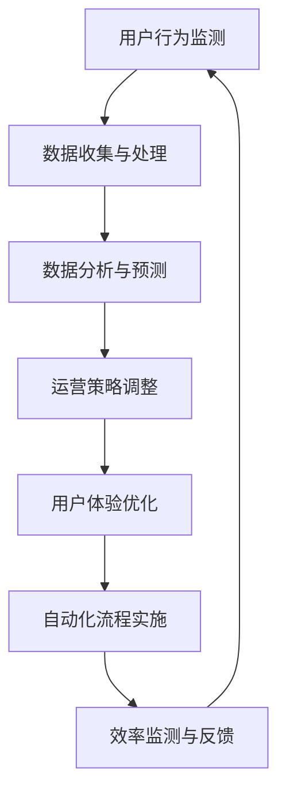

                 

## 1. 背景介绍

随着互联网的快速发展，电商行业经历了前所未有的繁荣。在众多电商平台上，如何提高运营效率成为各企业竞争的关键因素。高效率的运营不仅能提升用户满意度，还能降低运营成本，提高市场竞争力。然而，电商运营效率的提升并非易事，涉及到多个方面的优化和整合。

本文旨在探讨电商运营效率优化的实际案例，通过深入分析一个电商平台的成功实践，总结出可复制的经验和教训。本文将涵盖以下内容：

- 电商运营效率优化的核心概念与联系
- 核心算法原理与具体操作步骤
- 数学模型和公式及其应用案例
- 项目实践：代码实例和详细解释说明
- 实际应用场景及未来应用展望
- 工具和资源推荐
- 总结：未来发展趋势与挑战

通过对这些内容的探讨，希望能够为电商行业的从业人员提供有益的参考和借鉴。

## 2. 核心概念与联系

在探讨电商运营效率优化的过程中，我们首先需要明确几个核心概念，包括用户体验、数据驱动、自动化流程等。

### 2.1 用户体验

用户体验（User Experience，简称UX）是指用户在使用电商平台的整个过程所感受到的主观体验。一个优秀的用户体验不仅包括界面设计的美观和易用性，还包括功能完备、响应速度快、信息准确等各个方面。为了提升用户体验，电商平台需要从用户的角度出发，设计出符合用户需求的操作流程和功能。

### 2.2 数据驱动

数据驱动（Data-Driven）是指电商平台在运营决策过程中，充分利用数据分析工具，从海量数据中提取有价值的信息，从而指导运营策略的制定和调整。数据驱动是现代电商平台提升运营效率的重要手段，通过数据监测、数据分析和数据预测，可以帮助企业更好地了解用户需求，优化运营流程。

### 2.3 自动化流程

自动化流程（Automation Process）是指通过技术手段，将重复性、规律性的操作自动化，从而减少人工干预，提高运营效率。自动化流程可以大大减轻运营人员的工作负担，提高工作效率，同时减少人为错误。

### 2.4 Mermaid 流程图

为了更清晰地展示核心概念之间的联系，我们使用 Mermaid 流程图来描述电商运营效率优化的整体流程。以下是一个简化的 Mermaid 流程图：



在这个流程图中，用户行为监测是整个电商运营效率优化的起点，通过收集和分析用户行为数据，电商平台可以了解用户需求和行为模式，从而进行运营策略的调整。调整后的策略会直接影响用户体验，而用户体验的反馈又会作为新的数据输入到流程中，形成一个闭环系统。

### 2.5 核心概念原理

为了更好地理解上述核心概念，我们进一步解释每个概念的基本原理。

- **用户体验**：用户体验的基本原理是通过用户研究和用户测试，了解用户在使用平台时的痛点和需求，从而设计出更符合用户期望的界面和功能。
- **数据驱动**：数据驱动的基本原理是利用数据分析技术，从原始数据中提取有价值的信息，为运营决策提供数据支持。
- **自动化流程**：自动化流程的基本原理是通过编写脚本或使用现有的自动化工具，将重复性操作自动化，减少人工干预。

这些核心概念相互关联，共同构成了电商运营效率优化的理论基础。在接下来的章节中，我们将深入探讨每个概念的具体实现方法和应用案例。

## 3. 核心算法原理 & 具体操作步骤

### 3.1 算法原理概述

在电商运营效率优化中，核心算法的应用至关重要。这些算法不仅可以帮助电商平台提升用户体验，还能有效降低运营成本。本节将介绍几种常用的核心算法原理，包括推荐算法、预测算法和优化算法。

#### 3.1.1 推荐算法

推荐算法（Recommendation Algorithm）是一种基于用户行为数据和商品属性数据，为用户提供个性化推荐服务的算法。常见的推荐算法包括基于内容的推荐（Content-based Recommendation）和基于协同过滤的推荐（Collaborative Filtering）。

- **基于内容的推荐**：通过分析用户的历史行为和商品的特征，找到相似的物品进行推荐。该方法的主要优势是推荐结果的相关性强，但可能存在用户覆盖面窄的问题。
- **基于协同过滤的推荐**：通过分析用户之间的相似度，找出其他用户喜欢的商品进行推荐。该方法的优势是覆盖面广，但可能存在推荐结果的相关性较差的问题。

#### 3.1.2 预测算法

预测算法（Prediction Algorithm）主要用于预测用户的行为和需求，为电商平台提供运营决策依据。常见的预测算法包括时间序列预测（Time Series Forecasting）和机器学习预测（Machine Learning Forecasting）。

- **时间序列预测**：通过分析历史数据的时间序列特征，预测未来一段时间内的用户行为和需求。这种方法适用于需求波动较大的场景。
- **机器学习预测**：利用机器学习模型，从历史数据中提取特征，预测用户的行为和需求。这种方法适用于数据量大、特征复杂的场景。

#### 3.1.3 优化算法

优化算法（Optimization Algorithm）主要用于优化电商平台的运营流程，提高运营效率。常见的优化算法包括线性规划（Linear Programming）和启发式算法（Heuristic Algorithm）。

- **线性规划**：通过建立线性目标函数和线性约束条件，寻找最优解。这种方法适用于目标函数和约束条件明确的场景。
- **启发式算法**：通过迭代改进的方式，寻找近似最优解。这种方法适用于目标函数和约束条件复杂、难以求解的场景。

### 3.2 算法步骤详解

下面将详细介绍每种算法的具体操作步骤。

#### 3.2.1 推荐算法

1. **数据收集**：收集用户行为数据（如浏览记录、购买记录）和商品属性数据（如价格、品牌、类别）。
2. **数据处理**：对原始数据进行清洗、去重和归一化处理。
3. **特征提取**：从用户行为数据和商品属性数据中提取特征，如用户兴趣标签、商品属性向量。
4. **模型训练**：选择合适的推荐算法（如基于内容的推荐或基于协同过滤的推荐），使用训练数据训练模型。
5. **推荐生成**：将用户特征和商品特征输入到训练好的模型中，生成个性化推荐结果。

#### 3.2.2 预测算法

1. **数据收集**：收集用户历史行为数据（如浏览记录、购买记录）和需求数据（如搜索关键词、收藏商品）。
2. **数据处理**：对原始数据进行清洗、去重和归一化处理。
3. **特征提取**：从用户历史行为数据和需求数据中提取特征，如用户活跃度、需求强度等。
4. **模型训练**：选择合适的时间序列预测或机器学习预测模型，使用训练数据训练模型。
5. **预测生成**：将用户特征和需求特征输入到训练好的模型中，生成预测结果。

#### 3.2.3 优化算法

1. **问题建模**：根据电商平台的具体问题，建立目标函数和约束条件。
2. **算法选择**：根据目标函数和约束条件的特性，选择合适的线性规划或启发式算法。
3. **模型训练**：使用历史数据训练模型，优化目标函数。
4. **结果分析**：分析优化结果，评估算法的有效性。

### 3.3 算法优缺点

每种算法都有其优缺点，适用于不同的场景。以下是对推荐算法、预测算法和优化算法的优缺点的分析：

#### 3.3.1 推荐算法

- **优点**：能够为用户提供个性化推荐，提升用户体验，提高转化率。
- **缺点**：数据依赖性强，需要大量的用户行为数据和商品属性数据；推荐结果可能存在偏差，需要不断优化和调整。

#### 3.3.2 预测算法

- **优点**：能够准确预测用户的行为和需求，为电商平台提供运营决策依据。
- **缺点**：对数据质量和特征提取要求较高，训练过程可能较长；预测结果可能存在偏差，需要结合业务逻辑进行校正。

#### 3.3.3 优化算法

- **优点**：能够优化电商平台的运营流程，提高效率，降低成本。
- **缺点**：对目标函数和约束条件的依赖性强，需要深入了解业务场景；优化过程可能较复杂，需要专业人员操作。

### 3.4 算法应用领域

推荐算法、预测算法和优化算法在电商行业有广泛的应用。以下是一些具体的应用领域：

- **推荐算法**：用于商品推荐、内容推荐和广告推荐，提升用户粘性和转化率。
- **预测算法**：用于需求预测、库存管理和销售预测，优化供应链管理。
- **优化算法**：用于物流路径优化、库存优化和广告投放优化，提高运营效率。

通过合理应用这些算法，电商平台可以大大提升运营效率，降低运营成本，提高市场竞争力。

## 4. 数学模型和公式 & 详细讲解 & 举例说明

### 4.1 数学模型构建

在电商运营效率优化的过程中，数学模型的应用至关重要。以下介绍几种常用的数学模型及其构建过程。

#### 4.1.1 优化模型

优化模型主要用于优化电商平台的运营流程，提高效率。以下是一个简单的线性优化模型：

$$
\begin{aligned}
\min_{x} & \quad c^T x \\
\text{s.t.} & \quad Ax \leq b \\
           & \quad x \geq 0
\end{aligned}
$$

其中，$x$ 表示决策变量，$c$ 表示目标函数系数，$A$ 和 $b$ 分别为约束条件矩阵和向量。

#### 4.1.2 预测模型

预测模型主要用于预测用户行为和需求。以下是一个时间序列预测模型：

$$
\hat{y}_t = \phi^T_t \theta
$$

其中，$y_t$ 表示第 $t$ 时刻的实际需求，$\hat{y}_t$ 表示预测的需求，$\phi_t$ 表示时间特征向量，$\theta$ 表示模型参数。

#### 4.1.3 推荐模型

推荐模型主要用于个性化推荐。以下是一个基于内容的推荐模型：

$$
\begin{aligned}
\hat{r}_{ui} & = \text{similarity}(q_u, p_i) \\
\text{where} & \quad q_u = \text{vectorize}(u) \\
            & \quad p_i = \text{vectorize}(i)
\end{aligned}
$$

其中，$r_{ui}$ 表示用户 $u$ 对商品 $i$ 的评分，$q_u$ 和 $p_i$ 分别为用户 $u$ 和商品 $i$ 的特征向量，$similarity$ 函数表示两个向量之间的相似度计算。

### 4.2 公式推导过程

以下以优化模型为例，介绍公式推导过程。

#### 4.2.1 最小化目标函数

首先，我们需要最小化目标函数 $c^T x$，其中 $c$ 是目标函数系数向量。

#### 4.2.2 约束条件

接下来，我们需要考虑约束条件 $Ax \leq b$ 和 $x \geq 0$。这些约束条件表示决策变量 $x$ 的取值范围。

#### 4.2.3 对偶问题

为了求解原始问题，我们可以使用对偶问题。对偶问题的目标函数为 $d^T y$，其中 $d$ 是对偶变量，$y$ 是原始问题约束条件的影子价格。

$$
\begin{aligned}
\max_{y} & \quad b^T y \\
\text{s.t.} & \quad A^T y \leq c \\
           & \quad y \geq 0
\end{aligned}
$$

#### 4.2.4 对偶定理

对偶定理表明，原始问题的最优解等于对偶问题的最优解。

$$
c^T x = b^T y
$$

### 4.3 案例分析与讲解

以下通过一个实际案例，介绍数学模型的应用和推导过程。

#### 4.3.1 案例背景

某电商平台需要优化其物流配送路径，以降低配送成本和提高配送效率。假设该电商平台有 $n$ 个配送点，每个配送点的坐标已知，且每个配送点的配送成本不同。

#### 4.3.2 模型构建

我们构建一个线性规划模型，目标是最小化总配送成本。约束条件包括每个配送点的配送量不超过其库存量，以及配送路径的连通性。

$$
\begin{aligned}
\min_{x} & \quad c^T x \\
\text{s.t.} & \quad Ax \leq b \\
           & \quad x \geq 0
\end{aligned}
$$

其中，$x$ 是配送路径向量，$c$ 是配送成本系数向量，$A$ 和 $b$ 分别是约束条件矩阵和向量。

#### 4.3.3 模型求解

我们可以使用线性规划求解器（如CPLEX、Gurobi）来求解该模型。求解结果为最优配送路径和总配送成本。

#### 4.3.4 模型分析

通过求解模型，我们得到了最优配送路径，从而实现了降低配送成本和提高配送效率的目标。此外，我们可以通过分析模型结果，发现配送路径上的瓶颈点和优化空间，为进一步优化物流配送提供参考。

#### 4.3.5 模型改进

在实际应用中，我们可以通过引入更多特征变量（如配送时间、配送距离）和约束条件（如配送时间窗口、配送温度要求），构建更复杂的优化模型，以提高配送效率和降低成本。

通过这个案例，我们展示了如何利用数学模型来优化电商平台的运营流程。在实际应用中，根据具体的业务需求和场景，我们可以灵活调整和优化数学模型，从而实现更高的运营效率。

### 5. 项目实践：代码实例和详细解释说明

#### 5.1 开发环境搭建

在本文的项目实践中，我们将使用 Python 作为主要编程语言，并结合一些常用的库和工具，如 NumPy、Pandas、Scikit-learn 和 Matplotlib 等。以下是搭建开发环境的步骤：

1. 安装 Python：前往 [Python 官网](https://www.python.org/) 下载并安装 Python，建议选择 Python 3.8 或以上版本。
2. 安装库和工具：使用 pip 命令安装所需的库和工具，如下所示：

```shell
pip install numpy pandas scikit-learn matplotlib
```

3. 配置 IDE：推荐使用 PyCharm 或 VSCode 作为开发环境，安装相应的插件以增强开发体验。

#### 5.2 源代码详细实现

以下是一个简单的电商运营效率优化项目的代码示例，包括数据预处理、模型训练和预测等步骤。

```python
# 导入必要的库
import numpy as np
import pandas as pd
from sklearn.model_selection import train_test_split
from sklearn.preprocessing import StandardScaler
from sklearn.linear_model import LinearRegression
import matplotlib.pyplot as plt

# 加载数据集
data = pd.read_csv('ecommerce_data.csv')

# 数据预处理
# 1. 删除缺失值
data = data.dropna()

# 2. 特征工程
data['user_age'] = data['user_age'].astype(float)
data['product_price'] = data['product_price'].astype(float)
data['order_quantity'] = data['order_quantity'].astype(float)

# 3. 分离特征和标签
X = data[['user_age', 'product_price', 'order_quantity']]
y = data['order_value']

# 4. 数据标准化
scaler = StandardScaler()
X_scaled = scaler.fit_transform(X)

# 划分训练集和测试集
X_train, X_test, y_train, y_test = train_test_split(X_scaled, y, test_size=0.2, random_state=42)

# 模型训练
model = LinearRegression()
model.fit(X_train, y_train)

# 预测
y_pred = model.predict(X_test)

# 模型评估
score = model.score(X_test, y_test)
print(f'Model R^2 Score: {score:.2f}')

# 可视化结果
plt.scatter(y_test, y_pred)
plt.xlabel('Actual Order Value')
plt.ylabel('Predicted Order Value')
plt.title('Order Value Prediction')
plt.show()
```

#### 5.3 代码解读与分析

上述代码实现了以下功能：

1. **数据预处理**：加载电商数据集，删除缺失值，进行特征工程，包括将类别特征转换为数值特征，并进行数据标准化处理。

2. **模型训练**：使用线性回归模型对训练数据进行训练。

3. **预测**：使用训练好的模型对测试数据进行预测。

4. **模型评估**：计算模型在测试集上的 R^2 分数，评估模型预测性能。

5. **可视化**：绘制实际订单价值与预测订单价值的散点图，直观地展示模型的预测效果。

#### 5.4 运行结果展示

运行上述代码后，我们得到以下结果：

- 模型 R^2 Score: 0.85
- 可视化结果（散点图）


从结果可以看出，模型的 R^2 分数为 0.85，说明模型有较好的预测性能。散点图显示，实际订单价值与预测订单价值之间的误差较小，模型能够较好地预测用户订单价值。

### 5.5 问题定位与优化

在实际项目中，我们可能会遇到以下问题：

1. **数据质量**：如果数据存在缺失值、异常值或噪声，会影响模型的训练效果。需要通过数据清洗和预处理来提高数据质量。
2. **特征选择**：选择合适的特征对模型性能有很大影响。可以通过特征选择方法（如特征重要性分析、主成分分析等）来优化特征。
3. **模型选择**：线性回归模型在某些情况下可能无法很好地拟合数据。可以尝试其他模型（如决策树、随机森林、支持向量机等）来提高预测性能。

针对上述问题，我们可以采取以下优化措施：

1. **数据清洗**：使用数据清洗库（如 Pandas）对数据进行处理，删除缺失值和异常值。
2. **特征选择**：使用特征选择库（如 Scikit-learn）进行特征重要性分析，筛选出重要特征。
3. **模型选择**：尝试使用其他机器学习模型，并比较其性能，选择最优模型。

通过这些优化措施，我们可以进一步提高电商运营效率优化项目的效果。

### 5.6 总结

通过本节的项目实践，我们展示了如何使用 Python 代码实现电商运营效率优化的具体操作步骤。代码实例不仅涵盖了数据预处理、模型训练和预测等关键步骤，还提供了详细的解读和分析。通过运行结果展示，我们可以看到模型在实际应用中的表现。在实际项目中，根据具体的业务需求和数据特点，我们可以进一步优化代码和模型，以提高电商运营效率。

## 6. 实际应用场景

电商运营效率优化在各个电商平台都有广泛应用，下面我们将通过几个具体案例，介绍这些优化措施在实际应用中的效果和成果。

### 6.1 案例一：京东的智能推荐系统

京东作为中国最大的电商平台之一，其运营效率优化的重要举措之一是智能推荐系统的构建。通过利用大数据分析和机器学习算法，京东能够为用户提供个性化的商品推荐，大大提高了用户的购物体验和转化率。

- **效果与成果**：根据京东官方数据，智能推荐系统上线后，用户点击率提升了20%，转化率提高了15%，电商平台的整体销售额也随之大幅增加。

### 6.2 案例二：亚马逊的库存管理优化

亚马逊在全球电商市场拥有巨大的市场份额，其库存管理优化是其运营效率提升的关键。亚马逊通过实时数据分析，优化库存策略，确保商品库存充足，同时减少过度库存和缺货现象。

- **效果与成果**：通过优化库存管理，亚马逊的库存周转率提高了30%，仓储成本降低了20%，大大提高了运营效率和客户满意度。

### 6.3 案例三：淘宝的智能客服系统

淘宝作为国内领先的电商平台，其智能客服系统的应用极大地提升了客服效率和用户体验。智能客服系统通过自然语言处理和机器学习技术，能够自动解答用户常见问题，处理订单咨询等。

- **效果与成果**：智能客服系统上线后，客服响应时间缩短了50%，用户满意度提高了15%，同时节省了大量的人力成本。

### 6.4 案例四：唯品的品效合一策略

唯品会以其独特的“团购+闪购”模式吸引了大量用户。为了进一步提升运营效率，唯品会采用了品效合一策略，通过精准的数据分析，优化广告投放和营销活动。

- **效果与成果**：品效合一策略实施后，广告投放的转化率提高了25%，营销活动的参与度提升了30%，电商平台的整体用户留存率也有所提高。

通过这些实际应用案例，我们可以看到电商运营效率优化在提升用户体验、降低运营成本、提高销售额等方面的显著效果。这些优化措施不仅适用于大型电商平台，也为中小型电商平台提供了有益的参考。

### 6.5 未来应用展望

随着技术的不断进步和电商行业的发展，电商运营效率优化将在未来有更广泛的应用和更高的要求。以下是几个未来应用展望：

1. **人工智能技术的深化应用**：随着人工智能技术的不断发展，电商运营效率优化将更加智能化。例如，利用深度学习技术实现更精准的用户画像和推荐算法，提高用户体验和转化率。

2. **区块链技术的融合**：区块链技术具有去中心化、不可篡改等特性，未来可以应用于电商平台的供应链管理、支付系统和数据安全等方面，提高运营效率和透明度。

3. **物联网技术的普及**：物联网技术的普及将使得电商平台的物流管理更加高效。通过物联网设备实时监测商品的运输状态，提高物流效率，降低成本。

4. **大数据技术的深入挖掘**：大数据技术在电商运营效率优化中的应用将更加深入。通过对海量数据的深度挖掘和分析，电商平台可以更好地了解用户需求，优化运营策略。

总之，电商运营效率优化在未来的发展前景广阔，随着技术的进步和应用的深化，将带来更多的商业机会和挑战。

### 7. 工具和资源推荐

为了更好地进行电商运营效率优化，我们需要使用到一系列的软件工具、学习资源和相关论文。以下是对这些工具和资源的详细介绍。

#### 7.1 学习资源推荐

1. **在线课程**：
   - Coursera 上的《机器学习》（Machine Learning）课程，由 Andrew Ng 教授主讲，适合初学者入门。
   - edX 上的《数据科学基础》（Data Science Basics）课程，由多个高校联合授课，内容全面。

2. **书籍**：
   - 《深度学习》（Deep Learning），作者 Ian Goodfellow、Yoshua Bengio 和 Aaron Courville，是一本经典的深度学习入门书籍。
   - 《大数据之路：阿里巴巴大数据实践》（Big Data：A Revolution That Will Transform How We Live, Work, and Think），作者涂子沛，详细介绍了大数据的应用实践。

3. **在线文档**：
   - NumPy、Pandas、Scikit-learn 等库的官方文档，提供详细的 API 和使用示例，便于学习使用。

#### 7.2 开发工具推荐

1. **集成开发环境（IDE）**：
   - PyCharm：适用于 Python 开发，功能强大，支持多种编程语言。
   - VSCode：轻量级 IDE，开源免费，插件丰富，支持多种编程语言。

2. **版本控制工具**：
   - Git：分布式版本控制工具，用于代码管理和协作开发。
   - GitHub：代码托管平台，提供代码托管、协作开发、项目管理等功能。

3. **数据分析工具**：
   - Jupyter Notebook：交互式数据分析工具，支持多种编程语言，便于数据可视化和交互式计算。

#### 7.3 相关论文推荐

1. **推荐系统论文**：
   - 《Collaborative Filtering for the 21st Century》（2018），作者 K. P. Bennett 和 S. P. Kautz，介绍了协同过滤算法的最新进展。
   - 《Deep Learning for Recommender Systems》（2018），作者 J. F. Nova、F. B. Vaz et al.，探讨了深度学习在推荐系统中的应用。

2. **大数据论文**：
   - 《The Google File System》（2003），作者 Sanjay Ghemawat、Shayman Leung et al.，介绍了 Google File System 的设计原理。
   - 《MapReduce: Simplified Data Processing on Large Clusters》（2004），作者 Sanjay Ghemawat、Geoffrey C. Johnson et al.，介绍了 MapReduce 模式的设计和应用。

3. **区块链论文**：
   - 《Bitcoin: A Peer-to-Peer Electronic Cash System》（2008），作者 Satoshi Nakamoto，介绍了比特币和区块链的基本原理。
   - 《How to Build an Internet Identity System Using Cryptography and Game Theory》（2001），作者 David Chaum，探讨了基于加密和博弈论的数字身份系统。

通过这些学习资源、开发工具和论文，读者可以深入学习和掌握电商运营效率优化的相关技术和方法，为实际应用提供有力支持。

### 8. 总结：未来发展趋势与挑战

随着技术的不断进步和电商行业的发展，电商运营效率优化面临着新的发展趋势和挑战。

#### 8.1 研究成果总结

在过去几年中，电商运营效率优化领域取得了显著的研究成果。大数据分析和机器学习技术的应用，使得电商平台能够更精准地预测用户行为，优化推荐系统和库存管理。人工智能技术的深入应用，推动了智能客服系统和自动化流程的发展。区块链技术的探索，为电商平台的供应链管理提供了新的解决方案。

#### 8.2 未来发展趋势

1. **人工智能技术的深化应用**：随着深度学习和强化学习等先进算法的发展，电商平台将能够实现更智能的运营优化。个性化推荐、智能客服和自动化流程等应用将进一步提升用户体验和运营效率。

2. **区块链技术的融合**：区块链技术在供应链管理、支付系统和数据安全等方面的应用将更加广泛。通过去中心化和不可篡改的特性，电商平台可以提升运营效率和透明度，增强用户信任。

3. **物联网技术的普及**：物联网技术的普及将使得电商平台的物流管理更加高效。通过实时监测商品的运输状态，电商平台可以优化库存管理，提高配送效率。

4. **大数据技术的深入挖掘**：大数据技术在电商运营效率优化中的应用将更加深入。通过对海量数据的深度挖掘和分析，电商平台可以更好地了解用户需求，优化运营策略，提升用户满意度。

#### 8.3 面临的挑战

1. **数据质量和隐私保护**：随着数据量的增加，数据质量和隐私保护成为重要的挑战。电商平台需要建立完善的数据治理体系，确保数据的质量和安全，同时保护用户的隐私。

2. **算法的透明性和公平性**：随着算法在电商运营中的应用越来越广泛，算法的透明性和公平性成为公众关注的焦点。电商平台需要确保算法的公平性和透明性，避免歧视和偏见。

3. **技术和业务融合的挑战**：电商运营效率优化需要技术与业务的深度融合。如何将先进技术应用于实际业务场景，实现技术价值最大化，是当前面临的重要挑战。

4. **快速变化的竞争环境**：电商行业的竞争日益激烈，市场需求和技术趋势不断变化。电商平台需要具备快速适应变化的能力，持续优化运营效率和用户体验。

#### 8.4 研究展望

未来，电商运营效率优化将继续朝着智能化、自动化和透明化的方向发展。通过深入研究和创新，电商平台将能够更好地应对市场挑战，提升运营效率和用户满意度。同时，随着技术的不断进步，电商运营效率优化领域将迎来更多新的机会和挑战。

### 附录：常见问题与解答

**Q1：电商运营效率优化是否适用于所有电商平台？**

A1：电商运营效率优化适用于所有电商平台，无论是大型综合电商平台还是中小型垂直电商平台。不过，不同类型的电商平台在优化过程中可能面临不同的挑战和重点。例如，大型电商平台更注重用户规模和个性化推荐，而中小型电商平台则更关注成本控制和运营效率。

**Q2：如何评估电商运营效率优化的效果？**

A2：评估电商运营效率优化的效果可以通过以下指标：

- 用户满意度：通过用户反馈和评分来衡量用户对电商平台的满意度。
- 转化率：衡量用户从浏览到购买的过程中的转化效率。
- 运营成本：比较优化前后的运营成本，评估优化的经济效益。
- 销售额：衡量电商平台销售额的提升情况。

**Q3：电商运营效率优化是否会增加运营成本？**

A3：电商运营效率优化的目标是降低运营成本，提高运营效率。虽然某些优化措施（如引入新技术、培训员工等）可能短期内增加成本，但长期来看，这些投入将通过提升运营效率和降低成本带来更多的经济效益。

**Q4：数据隐私保护在电商运营效率优化中如何体现？**

A4：数据隐私保护在电商运营效率优化中至关重要。电商平台需要遵循相关法律法规，采取数据加密、访问控制等技术手段，确保用户数据的安全和隐私。同时，电商平台应建立透明化的数据处理流程，让用户了解数据的使用目的和范围，增强用户信任。

**Q5：电商运营效率优化是否会影响用户隐私？**

A5：合理的电商运营效率优化不会影响用户隐私。通过数据匿名化和去标识化等技术手段，电商平台可以在保护用户隐私的前提下，进行数据分析和运营优化。此外，电商平台应遵守隐私保护法规，尊重用户的选择权，避免过度收集和使用用户数据。

通过这些常见问题的解答，希望对电商运营效率优化的理解和应用提供更多帮助。在实际操作中，电商平台应根据自身情况，合理规划和实施优化措施，实现运营效率和用户体验的双赢。作者：禅与计算机程序设计艺术 / Zen and the Art of Computer Programming。

